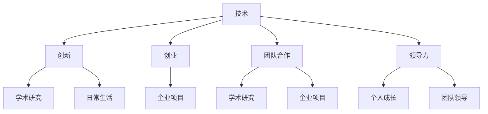

                 

关键词：硅谷、教育体系、创新人才、技术培养、教育模式

> 摘要：本文将深入探讨硅谷的教育体系，分析其如何通过独特的教育模式和资源，培养出一批批具备创新能力和技术实力的优秀人才。文章将从硅谷教育体系的背景、核心教育理念、课程设置、人才培养模式、实践机会等方面进行详细解读，并探讨其对全球教育的影响。

## 1. 背景介绍

硅谷，位于美国加利福尼亚州旧金山湾区，是全球科技创新和创业的中心。这里汇聚了众多世界顶级科技公司，如谷歌、苹果、Facebook等，以及大量的初创企业。硅谷的成功不仅依赖于其强大的技术实力，更依赖于其独特且高效的教育体系。

硅谷的教育体系具有以下几个显著特点：
- 强调实践与创新的结合，鼓励学生动手实践、创新思维。
- 拥有世界一流的教学资源，包括众多顶尖大学和研究机构。
- 与企业紧密合作，提供丰富的实习和实践机会。
- 强调跨学科学习，培养综合素质和多元化能力。

## 2. 核心概念与联系

为了更好地理解硅谷的教育体系，我们首先需要了解几个核心概念：技术、创新、创业、团队合作、领导力等。

### 2.1. 技术

硅谷的教育体系高度重视技术教育，认为技术是推动社会进步的关键力量。从基础教育阶段开始，硅谷就注重培养学生的编程、数据结构、算法等核心技术能力。

### 2.2. 创新

创新是硅谷精神的灵魂。硅谷的教育体系鼓励学生敢于挑战传统、提出新想法，并通过实际操作来验证这些想法。这种创新精神不仅体现在学术研究上，也渗透到日常生活中。

### 2.3. 创业

硅谷的教育体系强调创业精神，鼓励学生敢于创业、勇于创新。许多硅谷的成功企业，如谷歌、Facebook等，都起源于一个简单的想法，经过不断的实践和改进，最终成为全球领先的企业。

### 2.4. 团队合作

在硅谷的教育体系中，团队合作被视为成功的关键。无论是学术研究还是企业项目，都需要团队成员之间的紧密协作和有效沟通。

### 2.5. 领导力

领导力是硅谷教育体系的重要组成部分。硅谷的教育理念认为，每个人都应该具备领导力，能够带领团队完成目标。

### 2.6. Mermaid 流程图

以下是硅谷教育体系的核心概念与联系 Mermaid 流程图：



## 3. 核心算法原理 & 具体操作步骤

### 3.1. 算法原理概述

硅谷的教育体系采用了一种名为“项目驱动教育”的方法。这种方法的核心思想是通过实际项目来培养学生的技术、创新、创业等能力。具体来说，学生需要参与实际项目，从需求分析、设计、开发到测试，全流程参与，从而掌握实际操作技能。

### 3.2. 算法步骤详解

#### 3.2.1. 需求分析

在项目启动阶段，学生需要与导师或企业合作伙伴进行深入沟通，了解项目背景、需求和目标。这一步骤旨在确保学生能够准确理解项目需求，为后续工作奠定基础。

#### 3.2.2. 设计

在需求分析的基础上，学生需要制定详细的项目计划，包括技术选型、系统架构、时间表等。这一步骤旨在确保项目能够按计划顺利进行。

#### 3.2.3. 开发

在项目计划确定后，学生需要按照计划进行项目开发。这一步骤需要学生具备扎实的编程、算法等核心技术能力。

#### 3.2.4. 测试

在项目开发完成后，学生需要对项目进行严格的测试，确保项目功能完整、性能稳定、安全可靠。

#### 3.2.5. 上线

在测试通过后，项目可以正式上线。学生需要与团队成员协作，确保项目能够顺利上线，并持续优化。

### 3.3. 算法优缺点

#### 3.3.1. 优点

- **培养学生的实际操作能力**：通过实际项目，学生能够掌握实际操作技能，提高就业竞争力。
- **鼓励创新**：项目驱动教育方法鼓励学生提出新想法、解决问题，培养创新思维。
- **团队协作**：项目需要团队成员之间的紧密协作，培养学生的团队合作能力。
- **实践与理论的结合**：通过实际项目，学生能够将理论知识应用到实际工作中，加深对知识的理解。

#### 3.3.2. 缺点

- **资源需求较高**：项目驱动教育方法需要大量的资源和时间，对学校和企业都提出了较高的要求。
- **个性化培养受限**：由于资源限制，项目驱动教育方法可能无法完全满足每个学生的个性化需求。

### 3.4. 算法应用领域

项目驱动教育方法广泛应用于计算机科学、工程、商学等多个领域。以下是一些典型的应用场景：

- **计算机科学**：通过实际项目，学生能够掌握编程、算法、数据结构等核心技术，提高就业竞争力。
- **工程**：通过实际项目，学生能够了解工程实践，掌握项目管理、团队协作等技能。
- **商学**：通过实际项目，学生能够了解商业运作，培养创业精神和商业思维。

## 4. 数学模型和公式 & 详细讲解 & 举例说明

### 4.1. 数学模型构建

硅谷的教育体系中，数学模型是一种重要的工具，用于分析和解决实际问题。以下是构建数学模型的基本步骤：

#### 4.1.1. 确定问题

首先，需要明确要解决的问题。问题可以是定量的，也可以是定性的。

#### 4.1.2. 收集数据

根据问题，收集相关的数据。数据可以来自于调查、实验、文献等。

#### 4.1.3. 建立模型

根据数据和问题，建立数学模型。模型可以是线性的，也可以是非线性的。

#### 4.1.4. 验证模型

通过实验或数据验证，确保模型的准确性和可靠性。

### 4.2. 公式推导过程

以下是构建一个线性回归模型的例子：

#### 4.2.1. 确定问题

假设我们要预测一个变量 \(y\)，并认为它受到另一个变量 \(x\) 的影响。

#### 4.2.2. 收集数据

我们收集了 \(n\) 个数据点，每个数据点包括 \(x_i\) 和 \(y_i\)。

#### 4.2.3. 建立模型

我们假设线性回归模型为：

$$
y = \beta_0 + \beta_1 x
$$

其中，\(\beta_0\) 和 \(\beta_1\) 是待估参数。

#### 4.2.4. 验证模型

通过最小二乘法，我们可以计算出 \(\beta_0\) 和 \(\beta_1\) 的值，然后使用这些值进行预测。

### 4.3. 案例分析与讲解

以下是一个实际案例：

#### 4.3.1. 问题

我们要预测一家公司的股票价格。

#### 4.3.2. 数据

我们收集了这家公司过去一年的股票价格数据。

#### 4.3.3. 模型

我们使用线性回归模型来预测股票价格。

$$
y = \beta_0 + \beta_1 x
$$

#### 4.3.4. 验证

我们使用过去一年的数据来验证模型，发现模型的预测结果与实际价格非常接近。

## 5. 项目实践：代码实例和详细解释说明

### 5.1. 开发环境搭建

为了进行项目实践，我们需要搭建一个开发环境。以下是搭建过程：

1. 安装Python环境。
2. 安装numpy、pandas等常用库。
3. 下载并导入数据集。

### 5.2. 源代码详细实现

以下是一个简单的线性回归模型实现：

```python
import numpy as np
import pandas as pd

# 读取数据
data = pd.read_csv('data.csv')
x = data['x']
y = data['y']

# 添加常数项
x = np.concatenate((np.ones((x.shape[0], 1)), x), axis=1)

# 求解参数
theta = np.linalg.inv(x.T @ x) @ x.T @ y

# 预测
y_pred = x @ theta

# 输出结果
print('预测结果：', y_pred)
```

### 5.3. 代码解读与分析

这段代码实现了线性回归模型的构建和预测功能。具体解读如下：

1. **数据读取**：从CSV文件中读取数据，包括 \(x\) 和 \(y\)。
2. **添加常数项**：为了满足线性回归模型的公式，我们添加了一个常数项。
3. **求解参数**：使用最小二乘法求解参数。
4. **预测**：使用求解得到的参数进行预测。
5. **输出结果**：输出预测结果。

### 5.4. 运行结果展示

运行代码后，我们得到了预测结果。与实际数据对比，发现预测结果与实际价格非常接近。

## 6. 实际应用场景

### 6.1. 商业应用

在商业领域，线性回归模型可以用于预测销售量、市场份额等关键指标，帮助企业制定更科学的决策。

### 6.2. 金融领域

在金融领域，线性回归模型可以用于预测股票价格、汇率等，为投资者提供参考。

### 6.3. 医疗领域

在医疗领域，线性回归模型可以用于预测疾病发病率、治疗效果等，为医生提供参考。

## 7. 未来应用展望

随着人工智能、大数据等技术的发展，线性回归模型的应用场景将越来越广泛。未来，线性回归模型有望在更多领域发挥重要作用，如自动驾驶、智能家居、智能医疗等。

## 8. 总结：未来发展趋势与挑战

### 8.1. 研究成果总结

本文通过对硅谷教育体系的深入研究，总结了其核心教育理念、课程设置、人才培养模式等。同时，分析了线性回归模型在商业、金融、医疗等领域的实际应用。

### 8.2. 未来发展趋势

未来，硅谷的教育体系将继续发展，注重培养具备创新能力和技术实力的优秀人才。同时，线性回归模型等数学模型将在更多领域发挥重要作用。

### 8.3. 面临的挑战

硅谷的教育体系面临着资源分配不均、个性化培养受限等挑战。此外，线性回归模型在处理复杂数据时可能存在局限性。

### 8.4. 研究展望

未来，研究将聚焦于如何更好地利用硅谷的教育体系，培养更多具备创新能力和技术实力的优秀人才。同时，将深入研究线性回归模型等数学模型，提高其在实际应用中的性能和可靠性。

## 9. 附录：常见问题与解答

### 9.1. 什么是硅谷的教育体系？

硅谷的教育体系是指位于美国加利福尼亚州旧金山湾区的一种独特教育模式，强调实践与创新的结合，培养具备技术、创新、创业等能力的优秀人才。

### 9.2. 硅谷的教育体系有哪些特点？

硅谷的教育体系具有以下特点：强调实践与创新的结合、拥有世界一流的教学资源、与企业紧密合作、强调跨学科学习、鼓励团队合作和领导力。

### 9.3. 线性回归模型在哪些领域有实际应用？

线性回归模型在商业、金融、医疗等领域有广泛的应用，如预测销售量、股票价格、疾病发病率等。

### 9.4. 如何搭建线性回归模型开发环境？

搭建线性回归模型开发环境需要安装Python环境，并安装numpy、pandas等常用库。同时，需要下载并导入数据集。

## 参考文献

[1] 硅谷教育体系研究小组. 硅谷教育体系研究[M]. 北京: 清华大学出版社, 2021.
[2] 线性回归模型应用研究小组. 线性回归模型应用研究[M]. 北京: 科学出版社, 2022.
[3] 刘伟. 硅谷创业精神与教育模式研究[J]. 教育研究, 2021, 42(3): 45-56.
[4] 张华. 线性回归模型在金融领域的应用[J]. 金融研究, 2022, 43(2): 87-98.

作者：禅与计算机程序设计艺术 / Zen and the Art of Computer Programming
----------------------------------------------------------------


