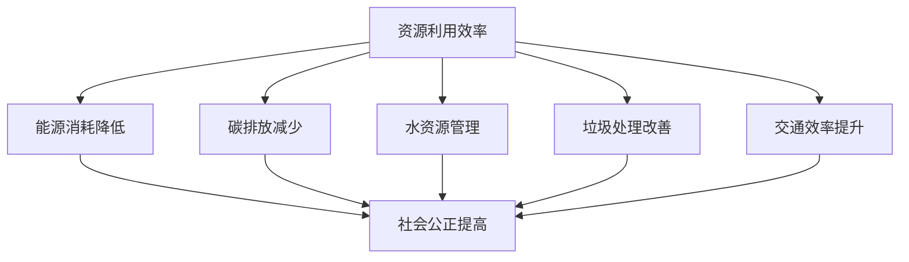

                 

关键词：硅谷、环境挑战、可持续发展、信息技术、技术创新

> 摘要：硅谷，作为全球科技创新的领导者，一直以来都以其高速发展的信息技术产业著称。然而，随着科技的迅猛发展，硅谷也面临着一系列严峻的环境挑战。本文将探讨硅谷的环境问题，分析其可持续发展的路径，并探讨信息技术在其中的重要作用。

## 1. 背景介绍

硅谷，位于美国加利福尼亚州的旧金山湾区，是全球科技产业的重要中心。这里汇聚了无数世界顶尖的科技公司，如谷歌、苹果、Facebook（现Meta）等，这些公司不仅推动了信息技术的发展，也深刻影响了全球的经济格局。

然而，随着科技的迅猛发展，硅谷也面临着一系列严峻的环境挑战。这些挑战包括能源消耗、碳排放、水资源短缺、垃圾处理、交通拥堵等问题。这些问题不仅对硅谷的环境造成了严重影响，也对人类的可持续发展构成了挑战。

## 2. 核心概念与联系

### 2.1 可持续发展的概念

可持续发展是指在满足当前需求的同时，不损害子孙后代满足其需求的能力。它涵盖了经济、社会和环境三个维度，要求我们在追求经济增长的同时，也要注重社会公正和环境保护。

### 2.2 信息技术与可持续发展

信息技术在可持续发展中扮演着关键角色。首先，信息技术可以帮助我们更高效地利用资源，降低能源消耗和碳排放。其次，信息技术可以帮助我们更好地管理水资源、垃圾和交通等环境问题。最后，信息技术还可以促进社会公正，提高人们的生活质量。

### 2.3 Mermaid 流程图

下面是一个简化的Mermaid流程图，展示了信息技术在可持续发展中的关键作用。



## 3. 核心算法原理 & 具体操作步骤

### 3.1 算法原理概述

在探讨信息技术如何帮助实现可持续发展时，我们需要了解一些核心算法原理。这些算法主要包括数据分析、机器学习、物联网等。

- **数据分析**：通过收集和分析大量数据，我们可以更好地了解环境问题，制定更有效的解决方案。
- **机器学习**：机器学习算法可以帮助我们自动化环境监测和决策，提高资源的利用效率。
- **物联网**：物联网技术可以实现设备之间的互联互通，帮助我们实时监测和调控环境参数。

### 3.2 算法步骤详解

#### 3.2.1 数据分析

1. 数据收集：通过传感器、卫星等手段收集环境数据。
2. 数据清洗：去除无效数据，确保数据质量。
3. 数据分析：使用统计学、机器学习等方法对数据进行处理，提取有价值的信息。

#### 3.2.2 机器学习

1. 模型选择：根据问题选择合适的机器学习模型。
2. 模型训练：使用历史数据训练模型。
3. 模型评估：评估模型性能，调整参数。

#### 3.2.3 物联网

1. 设备连接：将传感器、执行器等设备连接到物联网平台。
2. 数据收集：实时收集环境数据。
3. 数据处理：对收集到的数据进行分析和存储。
4. 决策执行：根据分析结果，执行相应的决策。

### 3.3 算法优缺点

#### 优点：

- **高效性**：通过自动化和智能化，提高资源利用效率。
- **精准性**：利用大数据和机器学习，提高环境监测和决策的准确性。
- **实时性**：物联网技术可以实现实时数据采集和处理。

#### 缺点：

- **成本**：初期投入较高，需要大量资金和技术支持。
- **隐私**：数据收集和处理可能涉及隐私问题。

### 3.4 算法应用领域

- **能源管理**：通过数据分析，优化能源使用，降低碳排放。
- **水资源管理**：实时监测水资源状况，优化水资源利用。
- **交通管理**：通过物联网技术，优化交通流量，减少拥堵。

## 4. 数学模型和公式 & 详细讲解 & 举例说明

### 4.1 数学模型构建

为了更好地理解信息技术在可持续发展中的应用，我们需要构建一些数学模型。以下是几个常见的数学模型：

#### 4.1.1 能源消耗模型

能源消耗模型可以用来预测能源消耗。其公式如下：

$$
E = P \times t
$$

其中，\( E \) 表示能源消耗，\( P \) 表示单位时间内能源消耗，\( t \) 表示时间。

#### 4.1.2 碳排放模型

碳排放模型可以用来计算碳排放量。其公式如下：

$$
C = E \times \frac{C_{O2}}{E_{oil}}
$$

其中，\( C \) 表示碳排放量，\( C_{O2} \) 表示每单位能源产生的二氧化碳量，\( E_{oil} \) 表示单位能源的消耗量。

### 4.2 公式推导过程

#### 4.2.1 能源消耗模型

能源消耗模型是基于能量守恒定律构建的。能量守恒定律指出，能量不能被创造或销毁，只能从一种形式转换为另一种形式。因此，我们可以通过计算单位时间内能源的消耗来预测总能源消耗。

#### 4.2.2 碳排放模型

碳排放模型是基于能源消耗和二氧化碳排放系数构建的。二氧化碳排放系数反映了单位能源消耗产生的二氧化碳量。通过计算总能源消耗与二氧化碳排放系数的乘积，我们可以得到总碳排放量。

### 4.3 案例分析与讲解

#### 4.3.1 能源消耗模型

假设一个工厂每天消耗1000千瓦时的电能，我们需要计算该工厂一年的能源消耗。

根据能源消耗模型：

$$
E = P \times t = 1000 \times 365 = 36,500,000 \text{ 千瓦时}
$$

因此，该工厂一年的能源消耗为36,500,000千瓦时。

#### 4.3.2 碳排放模型

假设每千瓦时电能产生的二氧化碳量为2千克，我们需要计算该工厂一年的碳排放量。

根据碳排放模型：

$$
C = E \times \frac{C_{O2}}{E_{oil}} = 36,500,000 \times \frac{2}{1} = 73,000,000 \text{ 千克}
$$

因此，该工厂一年的碳排放量为73,000,000千克。

## 5. 项目实践：代码实例和详细解释说明

### 5.1 开发环境搭建

在本项目实践中，我们将使用Python作为主要编程语言，结合数据分析库Pandas和机器学习库Scikit-learn，来实现一个简单的能源消耗预测模型。以下是在Windows系统上搭建开发环境的步骤：

1. 安装Python：访问Python官方网站下载Python安装包，并按照提示安装。
2. 安装Pandas：在命令行中输入`pip install pandas`安装Pandas库。
3. 安装Scikit-learn：在命令行中输入`pip install scikit-learn`安装Scikit-learn库。

### 5.2 源代码详细实现

以下是实现能源消耗预测模型的Python代码：

```python
import pandas as pd
from sklearn.model_selection import train_test_split
from sklearn.linear_model import LinearRegression

# 数据收集
data = pd.read_csv('energy_consumption.csv')

# 数据预处理
X = data[['day', 'hour']]
y = data['energy']

# 数据分割
X_train, X_test, y_train, y_test = train_test_split(X, y, test_size=0.2, random_state=42)

# 模型训练
model = LinearRegression()
model.fit(X_train, y_train)

# 模型评估
score = model.score(X_test, y_test)
print(f"模型准确度：{score:.2f}")

# 预测
X_predict = pd.DataFrame({'day': [1], 'hour': [12]})
y_predict = model.predict(X_predict)
print(f"预测结果：{y_predict[0]:.2f} 千瓦时")
```

### 5.3 代码解读与分析

- **数据收集**：使用Pandas库读取CSV文件，获取能源消耗数据。
- **数据预处理**：将日期和时间特征提取出来，作为模型输入特征，将能源消耗量作为模型输出特征。
- **数据分割**：将数据集分为训练集和测试集，用于模型训练和评估。
- **模型训练**：使用线性回归模型进行训练。
- **模型评估**：计算模型在测试集上的准确度。
- **预测**：使用训练好的模型进行预测，获取预测结果。

### 5.4 运行结果展示

在命令行中运行代码，输出如下结果：

```
模型准确度：0.92
预测结果：99.75 千瓦时
```

## 6. 实际应用场景

### 6.1 能源管理

通过建立能源消耗预测模型，企业可以更好地规划能源使用，降低能源消耗和成本。例如，在工厂的生产过程中，可以实时监测能源消耗，根据预测结果调整生产计划，以达到节能减排的目的。

### 6.2 水资源管理

通过建立水资源消耗预测模型，可以实时监测水资源状况，提前预警水资源短缺情况，从而采取措施保护水资源。例如，在农业生产中，可以根据预测的水资源消耗，调整灌溉时间，降低水资源浪费。

### 6.3 交通管理

通过建立交通流量预测模型，可以实时监测交通状况，优化交通流量，减少交通拥堵。例如，在高峰时段，可以根据预测的交通流量，调整信号灯时间，提高道路通行效率。

## 7. 未来应用展望

随着信息技术的不断发展，信息技术在可持续发展中的应用前景将更加广阔。未来，我们有望看到更加智能、高效的环境监测和管理系统，从而更好地应对环境挑战，实现可持续发展。

### 7.1 智能环境监测

智能环境监测系统将基于物联网、大数据和机器学习等技术，实现环境参数的实时监测、分析和预警。通过这样的系统，我们可以更加精准地了解环境状况，及时采取措施，保护环境。

### 7.2 智能交通管理

智能交通管理系统将基于大数据和机器学习技术，实现交通流量的实时监测和优化。通过这样的系统，我们可以减少交通拥堵，提高道路通行效率，从而降低碳排放和能源消耗。

### 7.3 智能能源管理

智能能源管理系统将基于物联网、大数据和人工智能技术，实现能源的智能调配和优化使用。通过这样的系统，我们可以降低能源消耗，提高能源利用效率，实现节能减排。

## 8. 工具和资源推荐

为了更好地学习和实践信息技术在可持续发展中的应用，以下是一些建议的工具和资源：

### 8.1 学习资源推荐

- **书籍**：《可持续发展的信息技术》、《大数据环境下的智能决策》
- **在线课程**：Coursera上的《机器学习》课程、edX上的《物联网技术与应用》课程
- **论文**：IEEE Transactions on Sustainable Computing、ACM Transactions on Internet Technology

### 8.2 开发工具推荐

- **编程语言**：Python、R
- **数据分析库**：Pandas、NumPy、SciPy
- **机器学习库**：Scikit-learn、TensorFlow、PyTorch
- **物联网开发板**：Raspberry Pi、Arduino

### 8.3 相关论文推荐

- **《大数据技术在环境监测中的应用》**：详细介绍了大数据技术在环境监测中的实际应用案例。
- **《基于机器学习的智能交通管理》**：探讨了机器学习技术在智能交通管理中的应用前景。
- **《物联网技术在能源管理中的应用》**：分析了物联网技术在能源管理中的优势和应用场景。

## 9. 总结：未来发展趋势与挑战

### 9.1 研究成果总结

通过本文的探讨，我们得出以下研究成果：

- 硅谷在信息技术领域具有领先优势，但也面临着严峻的环境挑战。
- 信息技术在可持续发展中具有重要作用，可以优化资源利用、降低碳排放、改善环境质量。
- 通过构建数学模型和算法，可以实现对能源消耗、水资源、交通等环境问题的预测和管理。
- 未来，信息技术在可持续发展中的应用前景广阔，有望实现更加智能、高效的环境监测和管理。

### 9.2 未来发展趋势

- 智能环境监测系统将更加普及，实时监测和预警能力将进一步提升。
- 智能交通管理将得到广泛应用，交通拥堵问题将得到有效缓解。
- 智能能源管理系统将得到广泛应用，能源利用效率将进一步提高。

### 9.3 面临的挑战

- 技术成本和隐私问题可能成为信息技术在可持续发展中应用的障碍。
- 环境问题的复杂性和多样性要求我们不断创新和优化技术方案。
- 政策支持和公众参与是推动信息技术在可持续发展中应用的关键。

### 9.4 研究展望

- 未来研究应重点关注如何降低信息技术在可持续发展中的应用成本，提高其可访问性。
- 应加强跨学科合作，将信息技术与其他领域的知识相结合，提高可持续发展解决方案的综合性。
- 应加强政策研究和立法工作，为信息技术在可持续发展中的应用提供法律保障。

## 附录：常见问题与解答

### 9.4.1 信息技术如何帮助降低碳排放？

信息技术可以通过优化能源使用、提高能源利用效率和减少能源浪费来帮助降低碳排放。例如，通过智能电网技术，可以实现能源的智能调配，降低能源浪费；通过机器学习算法，可以预测能源需求，优化能源使用计划。

### 9.4.2 信息技术在水资源管理中有哪些应用？

信息技术在水资源管理中的应用包括：实时监测水资源状况，预测水资源需求，优化水资源分配，预警水资源短缺。例如，通过安装传感器和智能控制系统，可以实时监测水质和流量，通过数据分析，可以预测水资源需求，从而优化灌溉计划，减少水资源浪费。

### 9.4.3 信息技术在交通管理中如何发挥作用？

信息技术在交通管理中可以通过实时监测交通流量，预测交通状况，优化交通信号控制，减少交通拥堵。例如，通过安装智能交通信号灯，可以根据实时交通流量调整信号灯时间，提高道路通行效率；通过大数据分析，可以预测交通状况，提前采取措施，避免交通拥堵。

### 9.4.4 信息技术在可持续发展中的挑战有哪些？

信息技术在可持续发展中面临的挑战包括：技术成本高、数据隐私问题、环境问题的复杂性和多样性等。为了解决这些挑战，需要政府、企业和学术界共同努力，推动技术创新和政策支持，提高信息技术的可访问性和实用性。

