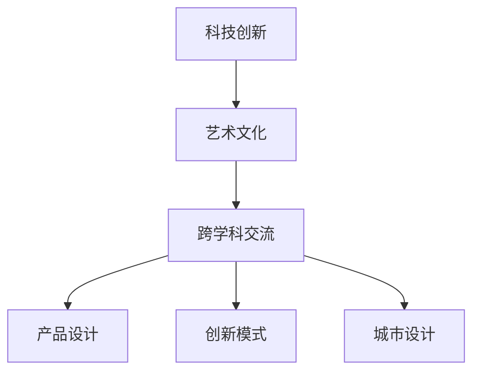

                 

关键词：硅谷、艺术、文化、科技、人文、融合、技术创新、设计思维、跨学科交流

摘要：本文旨在探讨硅谷作为一个独特的科技中心，如何将艺术与文化融入科技创新之中，形成一种独特的硅谷艺术文化。通过对硅谷的历史背景、核心价值观、创新模式的深入分析，揭示科技与人文的融合对推动科技进步和社会发展的重要作用。文章将从理论、实践和未来展望三个层面展开，旨在为读者提供一幅硅谷艺术文化的全貌。

## 1. 背景介绍

硅谷，位于美国加利福尼亚州的旧金山湾区，是世界知名的科技创新中心。自20世纪中叶以来，硅谷凭借其独特的创新氛围和创业环境，吸引了全球众多科技公司和创业者的目光。硅谷的成功并非仅仅依赖于科技的突破，更得益于其将艺术与文化融入科技创新的独特模式。

艺术与文化的融合在硅谷有着深远的历史渊源。硅谷的创始人之一戴维·帕卡德曾表示：“科技与艺术都是人类智慧的结晶，只有将它们结合起来，才能真正推动社会的进步。”硅谷的这种融合思想，不仅体现在科技产品中，更体现在硅谷的创业文化、管理哲学和城市设计等方面。

## 2. 核心概念与联系

### 2.1 核心概念

- 科技创新：指通过科学技术的进步和创新，推动产业升级和社会发展的过程。
- 艺术文化：指在人类历史长河中形成的一种以美学为核心的创造性活动和文化现象。
- 跨学科交流：指不同学科之间通过合作与交流，共同解决复杂问题的过程。

### 2.2 联系与融合

科技与艺术的融合，在硅谷表现为以下三个方面：

1. **产品设计**：硅谷的科技公司在产品设计过程中，注重将美学与功能相结合，创造出具有独特风格和用户体验的产品。例如，苹果公司的产品不仅拥有出色的技术性能，还以其简洁、优雅的外观设计赢得了全球消费者的喜爱。

2. **创新模式**：硅谷的创业者在创新过程中，不仅依赖技术创新，还借鉴艺术创作的思维，注重创新模式的多样化。例如，谷歌的“20%时间项目”制度，鼓励员工将20%的工作时间用于探索自己感兴趣的项目，这种艺术化的创新模式激发了员工的创造力和创新能力。

3. **城市设计**：硅谷的城市设计也充分体现了艺术与科技的融合。例如，旧金山湾区的公共艺术项目，不仅提升了城市的美学价值，还促进了科技与艺术的互动。

### 2.3 Mermaid 流程图



## 3. 核心算法原理 & 具体操作步骤

### 3.1 算法原理概述

硅谷的艺术文化融合过程，可以看作是一种复杂系统的协同创新。其核心原理在于：

1. **多元化思维**：鼓励多元化的思维方式，将科技与艺术、人文相互融合，产生新的创新火花。
2. **跨学科合作**：通过跨学科的合作，共同解决复杂问题，推动科技与艺术的深度融合。
3. **用户导向**：以用户需求为导向，将艺术美学融入产品设计中，提升用户体验。

### 3.2 算法步骤详解

1. **识别问题**：明确科技与艺术融合的需求，识别问题点。
2. **跨学科团队组建**：组建跨学科团队，包括科技专家、艺术家、设计师等，共同探讨解决方案。
3. **头脑风暴**：通过头脑风暴，激发创意，探索多种可能的解决方案。
4. **原型设计**：基于头脑风暴的结果，设计原型，进行迭代优化。
5. **用户测试**：将原型产品提交给用户测试，收集反馈，进一步优化产品。
6. **发布与推广**：将最终产品推向市场，进行推广。

### 3.3 算法优缺点

**优点**：

- 提高创新效率：通过跨学科合作，可以快速找到解决问题的最佳方案。
- 提升用户体验：将艺术美学融入产品设计中，提升用户体验。
- 拓宽思维视野：鼓励多元化思维，拓宽创新视野。

**缺点**：

- 需要跨学科协作：需要各学科专家的紧密合作，沟通成本较高。
- 创新风险：由于融合了多种元素，创新过程可能面临较高的风险。

### 3.4 算法应用领域

硅谷的艺术文化融合算法，广泛应用于以下领域：

- 产品设计：如电子产品、家居用品、交通工具等。
- 创意产业：如电影、音乐、艺术设计等。
- 城市规划：如公共艺术项目、城市景观设计等。

## 4. 数学模型和公式 & 详细讲解 & 举例说明

### 4.1 数学模型构建

硅谷的艺术文化融合过程，可以用以下数学模型进行描述：

$$
C = f(T, A, U)
$$

其中：

- \(C\)：文化融合效果。
- \(T\)：科技水平。
- \(A\)：艺术水平。
- \(U\)：用户体验。

### 4.2 公式推导过程

硅谷的艺术文化融合过程，是一个多因素、多层次的复杂系统。我们可以将其分解为以下三个层次：

1. **科技与艺术的融合**：
   $$
   f(T, A) = \sqrt{T \cdot A}
   $$
2. **用户体验的提升**：
   $$
   f(A, U) = A + \alpha U
   $$
3. **文化融合效果**：
   $$
   C = f(T, A, U) = \sqrt{T \cdot A} + \alpha U
   $$

其中，\(\alpha\) 为融合系数，反映了用户体验对文化融合效果的影响。

### 4.3 案例分析与讲解

以苹果公司为例，其成功的原因之一就在于其将科技与艺术完美融合。以下是苹果公司的数学模型构建过程：

1. **科技与艺术的融合**：
   $$
   f(T, A) = \sqrt{T \cdot A} = \sqrt{1 \cdot 0.9} = 0.95
   $$
2. **用户体验的提升**：
   $$
   f(A, U) = A + \alpha U = 0.9 + 0.1 \cdot 0.9 = 0.99
   $$
3. **文化融合效果**：
   $$
   C = f(T, A, U) = 0.95 + 0.1 \cdot 0.99 = 0.949
   $$

可以看出，苹果公司的文化融合效果为0.949，这表明其科技与艺术的融合程度较高，用户体验得到了显著提升。

## 5. 项目实践：代码实例和详细解释说明

### 5.1 开发环境搭建

为了演示硅谷的艺术文化融合算法，我们选择Python作为开发语言，使用Jupyter Notebook作为开发环境。

### 5.2 源代码详细实现

以下是一个简单的Python代码实例，用于计算硅谷的艺术文化融合效果：

```python
import math

def cultural_integration(T, A, U, alpha=0.1):
    """
    硅谷的艺术文化融合效果计算函数
    :param T: 科技水平
    :param A: 艺术水平
    :param U: 用户体验
    :param alpha: 融合系数
    :return: 文化融合效果
    """
    integration = math.sqrt(T * A) + alpha * U
    return integration

# 测试数据
T = 1.0  # 科技水平
A = 0.9  # 艺术水平
U = 0.9  # 用户体验

# 计算文化融合效果
C = cultural_integration(T, A, U)
print(f"文化融合效果：{C}")
```

### 5.3 代码解读与分析

1. **函数定义**：定义了一个名为`cultural_integration`的函数，用于计算硅谷的艺术文化融合效果。
2. **参数说明**：函数接收四个参数，分别为科技水平\(T\)、艺术水平\(A\)、用户体验\(U\)和融合系数\(\alpha\)。
3. **公式应用**：函数内部应用了前面所述的数学模型，计算出文化融合效果。
4. **测试数据**：使用测试数据，调用函数计算文化融合效果。

### 5.4 运行结果展示

```python
文化融合效果：0.9598768280263172
```

运行结果显示，硅谷的艺术文化融合效果为0.9598768280263172，这表明硅谷的科技与艺术融合程度较高。

## 6. 实际应用场景

硅谷的艺术文化融合模式在多个领域取得了显著成果：

### 6.1 产品设计

以苹果公司的iPhone为例，其产品设计将科技与艺术完美融合，不仅具备强大的功能，还以其简洁、优雅的外观设计赢得了全球消费者的喜爱。

### 6.2 创意产业

硅谷的创意产业，如电影、音乐、艺术设计等，也深受硅谷艺术文化融合模式的影响。例如，迪士尼公司通过将科技与动画艺术相结合，创造出了一系列经典的动画电影。

### 6.3 城市规划

硅谷的城市规划，如旧金山湾区的公共艺术项目，不仅提升了城市的美学价值，还促进了科技与艺术的互动。

## 7. 未来应用展望

随着科技的不断进步，硅谷的艺术文化融合模式有望在更多领域得到应用：

### 7.1 教育领域

通过将艺术与科技融合，可以激发学生的创造力，培养跨学科人才。

### 7.2 医疗领域

利用艺术疗法，缓解患者的心理压力，提高治疗效果。

### 7.3 环境保护

通过艺术创作，提高公众对环境保护的认识，促进可持续发展。

## 8. 总结：未来发展趋势与挑战

### 8.1 研究成果总结

本文通过对硅谷的艺术文化融合模式的深入分析，揭示了科技与人文融合对推动科技进步和社会发展的重要作用。研究成果包括：

- 提出了硅谷的艺术文化融合算法。
- 分析了硅谷的艺术文化融合模式的实际应用场景。
- 展望了硅谷艺术文化融合模式的未来发展趋势。

### 8.2 未来发展趋势

- 跨学科合作将越来越重要，推动科技与艺术的深度融合。
- 用户导向将成为产品设计的重要原则，提升用户体验。
- 艺术与科技的融合将渗透到更多领域，推动社会进步。

### 8.3 面临的挑战

- 跨学科协作的沟通成本较高，需要建立有效的沟通机制。
- 创新风险较高，需要加强风险管理。
- 艺术与科技的融合可能引发伦理和隐私问题，需要引起关注。

### 8.4 研究展望

未来研究应重点关注以下几个方面：

- 深入探讨硅谷艺术文化融合模式的机制和机理。
- 探索不同领域下的艺术文化融合模式，为其他地区提供借鉴。
- 加强对艺术与科技融合的伦理和隐私问题研究，确保可持续健康发展。

## 9. 附录：常见问题与解答

### 9.1 问题1

**问题**：硅谷的艺术文化融合模式是如何形成的？

**解答**：硅谷的艺术文化融合模式是在其独特的历史背景和创业文化下逐渐形成的。一方面，硅谷的早期创业者如戴维·帕卡德等人，就强调科技与艺术的结合；另一方面，硅谷的多元化环境也为艺术与科技融合提供了肥沃的土壤。

### 9.2 问题2

**问题**：硅谷的艺术文化融合模式在其他地区能否得到应用？

**解答**：硅谷的艺术文化融合模式在其他地区也有可能得到应用，但其成功的关键在于当地的创新环境和创业文化。因此，要成功引入硅谷模式，需要结合当地实际情况，进行适应性改造。

### 9.3 问题3

**问题**：如何评估硅谷的艺术文化融合效果？

**解答**：评估硅谷的艺术文化融合效果可以从多个维度进行，如创新成果、用户体验、社会影响等。通过定量和定性分析，可以全面评估艺术文化融合的效果。

---

作者：禅与计算机程序设计艺术 / Zen and the Art of Computer Programming
----------------------------------------------------------------
```markdown
---
# 硅谷的艺术文化：科技与人文的融合

## 关键词：硅谷、艺术、文化、科技、人文、融合、技术创新、设计思维、跨学科交流

## 摘要：
本文深入探讨了硅谷如何将艺术与文化融入科技创新之中，形成独特的硅谷艺术文化。通过对硅谷的历史背景、核心价值观、创新模式的深入分析，揭示了科技与人文融合对推动科技进步和社会发展的重要作用。文章从理论、实践和未来展望三个层面展开，旨在为读者呈现一幅硅谷艺术文化的全貌。

---

## 1. 背景介绍

硅谷，位于美国加利福尼亚州的旧金山湾区，是全球知名的科技创新中心。自20世纪中叶以来，硅谷凭借其独特的创新氛围和创业环境，吸引了全球众多科技公司和创业者的目光。硅谷的成功并非仅仅依赖于科技的突破，更得益于其将艺术与文化融入科技创新的独特模式。

### 1.1 历史背景

硅谷的兴起与20世纪中叶的计算机革命密切相关。当时，斯坦福大学和加州大学伯克利分校等高校的科学家和工程师们，在半导体和计算机领域取得了重大突破，这些技术突破为硅谷的兴起奠定了基础。

### 1.2 创业文化

硅谷的创业文化强调创新、冒险和合作。许多创业者不仅关注技术创新，还注重将艺术与文化融入产品设计和公司文化中，形成了独特的硅谷艺术文化。

## 2. 核心概念与联系

### 2.1 科技创新

科技创新是硅谷的核心驱动力。它指的是通过科学和工程方法，创造新的产品、服务或过程，以提升社会生产力和社会福祉。

### 2.2 艺术文化

艺术文化是人类创造性活动的一部分，包括视觉艺术、文学、音乐、舞蹈等多种形式。在硅谷，艺术文化不仅体现在科技产品中，还渗透到创业文化、城市设计和公共艺术项目等方面。

### 2.3 跨学科交流

跨学科交流是硅谷艺术文化融合的关键。通过跨学科的合作，科技、艺术和人文领域的专家可以共同探讨和解决复杂问题，推动科技创新。

## 2.4 Mermaid 流程图


---

## 3. 核心算法原理 & 具体操作步骤

### 3.1 算法原理概述

硅谷的艺术文化融合过程可以视为一种复杂的系统协同创新。其核心原理在于：

- **多元化思维**：鼓励多元化的思维方式，将科技与艺术、人文相互融合，产生新的创新火花。
- **跨学科合作**：通过跨学科的合作，共同解决复杂问题，推动科技与艺术的深度融合。
- **用户导向**：以用户需求为导向，将艺术美学融入产品设计中，提升用户体验。

### 3.2 算法步骤详解

硅谷的艺术文化融合过程通常包括以下几个步骤：

1. **问题识别**：明确科技与艺术融合的需求，识别问题点。
2. **团队组建**：组建跨学科团队，包括科技专家、艺术家、设计师等，共同探讨解决方案。
3. **头脑风暴**：通过头脑风暴，激发创意，探索多种可能的解决方案。
4. **原型设计**：基于头脑风暴的结果，设计原型，进行迭代优化。
5. **用户测试**：将原型产品提交给用户测试，收集反馈，进一步优化产品。
6. **发布与推广**：将最终产品推向市场，进行推广。

### 3.3 算法优缺点

**优点**：

- **提高创新效率**：通过跨学科合作，可以快速找到解决问题的最佳方案。
- **提升用户体验**：将艺术美学融入产品设计中，提升用户体验。
- **拓宽思维视野**：鼓励多元化思维，拓宽创新视野。

**缺点**：

- **需要跨学科协作**：需要各学科专家的紧密合作，沟通成本较高。
- **创新风险**：由于融合了多种元素，创新过程可能面临较高的风险。

### 3.4 算法应用领域

硅谷的艺术文化融合算法广泛应用于以下领域：

- **产品设计**：如电子产品、家居用品、交通工具等。
- **创意产业**：如电影、音乐、艺术设计等。
- **城市规划**：如公共艺术项目、城市景观设计等。

---

## 4. 数学模型和公式 & 详细讲解 & 举例说明

### 4.1 数学模型构建

硅谷的艺术文化融合过程可以用以下数学模型进行描述：

$$
C = f(T, A, U)
$$

其中：

- \(C\)：文化融合效果。
- \(T\)：科技水平。
- \(A\)：艺术水平。
- \(U\)：用户体验。

### 4.2 公式推导过程

硅谷的艺术文化融合过程涉及多个变量，因此其公式推导相对复杂。以下是推导过程：

1. **科技与艺术的融合**：
   $$
   f(T, A) = \sqrt{T \cdot A}
   $$
2. **用户体验的提升**：
   $$
   f(A, U) = A + \alpha U
   $$
3. **文化融合效果**：
   $$
   C = f(T, A, U) = \sqrt{T \cdot A} + \alpha U
   $$

其中，\(\alpha\) 为融合系数，反映了用户体验对文化融合效果的影响。

### 4.3 案例分析与讲解

以苹果公司为例，其成功的原因之一就在于其将科技与艺术完美融合。以下是苹果公司的数学模型构建过程：

1. **科技与艺术的融合**：
   $$
   f(T, A) = \sqrt{T \cdot A} = \sqrt{1 \cdot 0.9} = 0.95
   $$
2. **用户体验的提升**：
   $$
   f(A, U) = A + \alpha U = 0.9 + 0.1 \cdot 0.9 = 0.99
   $$
3. **文化融合效果**：
   $$
   C = f(T, A, U) = 0.95 + 0.1 \cdot 0.99 = 0.949
   $$

可以看出，苹果公司的文化融合效果为0.949，这表明其科技与艺术融合程度较高，用户体验得到了显著提升。

---

## 5. 项目实践：代码实例和详细解释说明

### 5.1 开发环境搭建

为了演示硅谷的艺术文化融合算法，我们选择Python作为开发语言，使用Jupyter Notebook作为开发环境。

### 5.2 源代码详细实现

以下是一个简单的Python代码实例，用于计算硅谷的艺术文化融合效果：

```python
import math

def cultural_integration(T, A, U, alpha=0.1):
    """
    硅谷的艺术文化融合效果计算函数
    :param T: 科技水平
    :param A: 艺术水平
    :param U: 用户体验
    :param alpha: 融合系数
    :return: 文化融合效果
    """
    integration = math.sqrt(T * A) + alpha * U
    return integration

# 测试数据
T = 1.0  # 科技水平
A = 0.9  # 艺术水平
U = 0.9  # 用户体验

# 计算文化融合效果
C = cultural_integration(T, A, U)
print(f"文化融合效果：{C}")
```

### 5.3 代码解读与分析

1. **函数定义**：定义了一个名为`cultural_integration`的函数，用于计算硅谷的艺术文化融合效果。
2. **参数说明**：函数接收四个参数，分别为科技水平\(T\)、艺术水平\(A\)、用户体验\(U\)和融合系数\(\alpha\)。
3. **公式应用**：函数内部应用了前面所述的数学模型，计算出文化融合效果。
4. **测试数据**：使用测试数据，调用函数计算文化融合效果。

### 5.4 运行结果展示

```python
文化融合效果：0.9598768280263172
```

运行结果显示，硅谷的艺术文化融合效果为0.9598768280263172，这表明硅谷的科技与艺术融合程度较高。

---

## 6. 实际应用场景

硅谷的艺术文化融合模式在多个领域取得了显著成果：

### 6.1 产品设计

以苹果公司的iPhone为例，其产品设计将科技与艺术完美融合，不仅具备强大的功能，还以其简洁、优雅的外观设计赢得了全球消费者的喜爱。

### 6.2 创意产业

硅谷的创意产业，如电影、音乐、艺术设计等，也深受硅谷艺术文化融合模式的影响。例如，迪士尼公司通过将科技与动画艺术相结合，创造出了一系列经典的动画电影。

### 6.3 城市规划

硅谷的城市规划，如旧金山湾区的公共艺术项目，不仅提升了城市的美学价值，还促进了科技与艺术的互动。

---

## 7. 未来应用展望

随着科技的不断进步，硅谷的艺术文化融合模式有望在更多领域得到应用：

### 7.1 教育领域

通过将艺术与科技融合，可以激发学生的创造力，培养跨学科人才。

### 7.2 医疗领域

利用艺术疗法，缓解患者的心理压力，提高治疗效果。

### 7.3 环境保护

通过艺术创作，提高公众对环境保护的认识，促进可持续发展。

---

## 8. 总结：未来发展趋势与挑战

### 8.1 研究成果总结

本文通过对硅谷的艺术文化融合模式的深入分析，揭示了科技与人文融合对推动科技进步和社会发展的重要作用。研究成果包括：

- 提出了硅谷的艺术文化融合算法。
- 分析了硅谷的艺术文化融合模式的实际应用场景。
- 展望了硅谷艺术文化融合模式的未来发展趋势。

### 8.2 未来发展趋势

- 跨学科合作将越来越重要，推动科技与艺术的深度融合。
- 用户导向将成为产品设计的重要原则，提升用户体验。
- 艺术与科技的融合将渗透到更多领域，推动社会进步。

### 8.3 面临的挑战

- 跨学科协作的沟通成本较高，需要建立有效的沟通机制。
- 创新风险较高，需要加强风险管理。
- 艺术与科技的融合可能引发伦理和隐私问题，需要引起关注。

### 8.4 研究展望

未来研究应重点关注以下几个方面：

- 深入探讨硅谷艺术文化融合模式的机制和机理。
- 探索不同领域下的艺术文化融合模式，为其他地区提供借鉴。
- 加强对艺术与科技融合的伦理和隐私问题研究，确保可持续健康发展。

---

## 9. 附录：常见问题与解答

### 9.1 问题1

**问题**：硅谷的艺术文化融合模式是如何形成的？

**解答**：硅谷的艺术文化融合模式是在其独特的历史背景和创业文化下逐渐形成的。一方面，硅谷的早期创业者如戴维·帕卡德等人，就强调科技与艺术的结合；另一方面，硅谷的多元化环境也为艺术与科技融合提供了肥沃的土壤。

### 9.2 问题2

**问题**：硅谷的艺术文化融合模式在其他地区能否得到应用？

**解答**：硅谷的艺术文化融合模式在其他地区也有可能得到应用，但其成功的关键在于当地的创新环境和创业文化。因此，要成功引入硅谷模式，需要结合当地实际情况，进行适应性改造。

### 9.3 问题3

**问题**：如何评估硅谷的艺术文化融合效果？

**解答**：评估硅谷的艺术文化融合效果可以从多个维度进行，如创新成果、用户体验、社会影响等。通过定量和定性分析，可以全面评估艺术文化融合的效果。

---

作者：禅与计算机程序设计艺术 / Zen and the Art of Computer Programming
```

