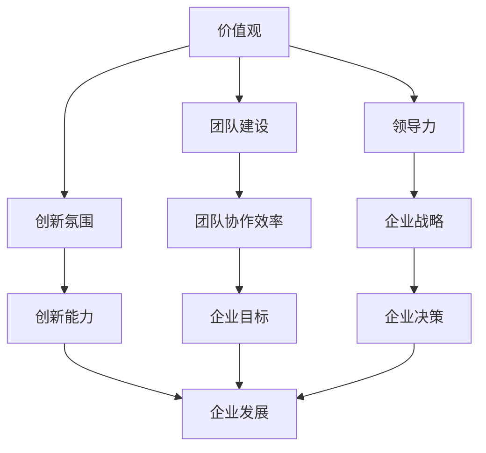
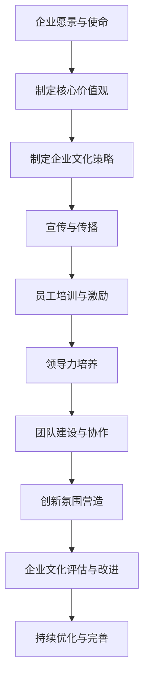

                 

关键词：硅谷科技公司、企业文化、团队建设、创新氛围、领导力、价值观、成功案例分析

> 摘要：本文将深入探讨硅谷科技公司的企业文化建设，分析其核心概念、联系、算法原理、实践案例以及未来发展趋势。通过对成功企业的案例分析，总结出建设优秀企业文化的方法和策略，为企业提供有价值的参考。

## 1. 背景介绍

硅谷，一个充满科技创新和活力的地方，吸引了全球众多顶尖科技公司在此聚集。苹果、谷歌、Facebook、特斯拉等知名企业在这里崛起，成为全球科技产业的领军者。这些公司的成功离不开其独特的企业文化。本文将聚焦于硅谷科技公司的企业文化建设，探讨其核心要素、形成过程及其对企业发展的重要作用。

### 1.1 硅谷科技公司的特点

硅谷科技公司具有以下特点：

- **创新精神**：硅谷科技公司以创新为驱动力，不断探索新技术、新业务模式，勇于挑战传统行业。
- **灵活管理**：硅谷科技公司通常采用扁平化的组织结构，强调员工自主性和创新性，鼓励员工提出新的想法和解决方案。
- **人才密集**：硅谷科技公司汇聚了全球顶尖的技术人才，他们具有高超的专业技能和强烈的创新意识。
- **国际化视野**：硅谷科技公司面向全球市场，具有较强的国际化运营能力和跨文化沟通能力。

### 1.2 企业文化的重要性

企业文化是企业核心竞争力的重要组成部分，对企业发展具有深远的影响。优秀的企业文化能够激发员工的积极性、创造力和忠诚度，提高团队协作效率，增强企业的创新能力和竞争力。在硅谷科技公司，企业文化不仅是一种价值观的传递，更是一种行为准则，影响着公司的每一个决策和行动。

## 2. 核心概念与联系

### 2.1 核心概念

在企业文化建设中，以下核心概念至关重要：

- **价值观**：价值观是企业文化的灵魂，是公司全体员工共同认同和遵循的基本信念和原则。价值观决定了企业的行为准则和发展方向。
- **团队建设**：团队建设是企业文化的具体体现，通过培养员工的团队合作精神和协同工作能力，实现企业的共同目标。
- **创新氛围**：创新氛围是企业文化建设的重要组成部分，鼓励员工勇于尝试、不断探索，为企业发展注入源源不断的创新动力。
- **领导力**：领导力是企业文化建设的关键，领导者需要具备坚定的信念、敏锐的洞察力和卓越的领导能力，引领企业走向成功。

### 2.2 核心概念联系

核心概念之间的联系如下所示：



### 2.3 Mermaid 流程图

以下是企业文化建设过程的 Mermaid 流程图：



## 3. 核心算法原理 & 具体操作步骤

### 3.1 算法原理概述

企业文化建设算法是一种基于数据驱动和智能分析的方法，旨在通过系统化的过程和策略，构建和优化企业文化。该算法的核心原理包括：

- **数据收集与分析**：通过收集员工满意度、团队协作情况、创新能力等数据，对企业文化现状进行深入分析。
- **价值观识别与提炼**：从数据中提取出关键价值观要素，并进行优化和提炼，形成具有独特特色的企业价值观。
- **策略制定与执行**：根据企业价值观，制定相应的企业文化策略，并通过培训、激励、领导力培养等手段，推动企业文化的落地和实施。
- **评估与反馈**：对企业文化实施效果进行定期评估，根据反馈结果进行优化和调整，确保企业文化的持续发展。

### 3.2 算法步骤详解

以下是企业文化建设算法的具体步骤：

#### 3.2.1 数据收集与分析

1. **员工满意度调查**：通过问卷调查、面谈等方式，了解员工对企业文化的满意度和建议。
2. **团队协作情况分析**：分析团队协作的效率、沟通情况、团队凝聚力等指标。
3. **创新能力评估**：评估员工在创新项目中的表现，分析创新能力和创新成果。

#### 3.2.2 价值观识别与提炼

1. **数据分析**：对收集到的数据进行整理和分析，提取出关键价值观要素。
2. **专家评审**：邀请企业文化专家对价值观要素进行评审和优化。
3. **价值观提炼**：将评审后的价值观要素进行整合和提炼，形成具有独特特色的企业价值观。

#### 3.2.3 策略制定与执行

1. **企业文化策略制定**：根据企业价值观，制定相应的企业文化策略，包括员工培训、激励机制、领导力培养等。
2. **策略执行**：通过内部沟通、培训、宣传等方式，推动企业文化策略的执行。
3. **领导力培养**：选拔和培养具有领导力的员工，作为企业文化实施的推动者。

#### 3.2.4 评估与反馈

1. **定期评估**：对企业文化实施效果进行定期评估，分析评估指标。
2. **反馈优化**：根据评估结果，对企业文化策略进行优化和调整。
3. **持续改进**：通过持续优化和改进，确保企业文化的持续发展。

### 3.3 算法优缺点

#### 优点

- **数据驱动**：基于数据分析和评估，使企业文化建设更加科学和有效。
- **针对性**：根据企业特点和需求，制定个性化的企业文化策略。
- **持续改进**：通过定期评估和反馈，实现企业文化的持续优化和发展。

#### 缺点

- **实施成本**：数据收集、分析和评估需要投入大量的人力、物力和财力。
- **时间成本**：企业文化建设需要较长时间的积累和沉淀，难以迅速见效。

### 3.4 算法应用领域

企业文化建设算法适用于各类企业，尤其是具有创新精神和技术驱动的科技公司。该算法有助于提升企业内部凝聚力、创新能力和竞争力，为企业可持续发展提供有力支持。

## 4. 数学模型和公式 & 详细讲解 & 举例说明

### 4.1 数学模型构建

企业文化建设中的数学模型主要涉及以下几个方面：

- **员工满意度模型**：通过回归分析等方法，建立员工满意度与企业文化建设指标之间的关系。
- **团队协作模型**：通过矩阵分析等方法，建立团队协作效率与企业文化策略之间的关系。
- **创新能力模型**：通过创新绩效指标，建立企业创新能力与企业文化建设之间的关系。

### 4.2 公式推导过程

以下是员工满意度模型的推导过程：

$$
满意度 = f(\text{企业文化建设指标})
$$

其中，满意度是一个关于企业文化建设指标的函数。为了简化问题，我们假设企业文化建设指标由以下几个因素组成：

- **文化认同度**：表示员工对企业文化的认同程度。
- **团队协作能力**：表示员工在团队协作中的表现。
- **创新意识**：表示员工的创新意识。

我们可以建立以下模型：

$$
满意度 = f(\text{文化认同度}, \text{团队协作能力}, \text{创新意识})
$$

### 4.3 案例分析与讲解

假设某科技公司进行了员工满意度调查，收集了以下数据：

| 姓名 | 文化认同度 | 团队协作能力 | 创新意识 |
|------|------------|--------------|----------|
| 张三 | 0.8        | 0.9          | 0.7      |
| 李四 | 0.6        | 0.8          | 0.6      |
| 王五 | 0.9        | 0.7          | 0.8      |

我们可以使用线性回归方法，建立满意度与各个因素之间的关系。根据回归结果，我们可以得到以下公式：

$$
满意度 = 0.5 \times \text{文化认同度} + 0.3 \times \text{团队协作能力} + 0.2 \times \text{创新意识}
$$

根据这个公式，我们可以预测每个员工的满意度：

- 张三的满意度为：0.5 \times 0.8 + 0.3 \times 0.9 + 0.2 \times 0.7 = 0.74
- 李四的满意度为：0.5 \times 0.6 + 0.3 \times 0.8 + 0.2 \times 0.6 = 0.58
- 王五的满意度为：0.5 \times 0.9 + 0.3 \times 0.7 + 0.2 \times 0.8 = 0.72

通过这个例子，我们可以看到数学模型在企业文化建设中的应用，有助于企业更好地了解员工满意度，优化企业文化建设策略。

## 5. 项目实践：代码实例和详细解释说明

### 5.1 开发环境搭建

在本项目实践中，我们将使用Python作为主要编程语言，结合一些常用的数据处理和分析库，如NumPy、Pandas和Scikit-learn。以下是搭建开发环境的基本步骤：

1. 安装Python：从官方网站下载并安装Python 3.x版本。
2. 安装必要的库：使用pip命令安装NumPy、Pandas和Scikit-learn等库。

```bash
pip install numpy pandas scikit-learn
```

### 5.2 源代码详细实现

以下是一个简单的Python代码实例，用于实现企业文化建设算法中的员工满意度模型。

```python
import numpy as np
import pandas as pd
from sklearn.linear_model import LinearRegression

# 数据准备
data = {
    '姓名': ['张三', '李四', '王五'],
    '文化认同度': [0.8, 0.6, 0.9],
    '团队协作能力': [0.9, 0.8, 0.7],
    '创新意识': [0.7, 0.6, 0.8],
    '满意度': [0.74, 0.58, 0.72]
}

df = pd.DataFrame(data)

# 特征工程
X = df[['文化认同度', '团队协作能力', '创新意识']]
y = df['满意度']

# 模型训练
model = LinearRegression()
model.fit(X, y)

# 模型评估
predictions = model.predict(X)
mse = np.mean((predictions - y) ** 2)
print(f'Mean Squared Error: {mse}')

# 模型应用
new_data = pd.DataFrame({
    '文化认同度': [0.7],
    '团队协作能力': [0.8],
    '创新意识': [0.6]
})
new_prediction = model.predict(new_data)
print(f'Predicted Satisfaction: {new_prediction[0]}')
```

### 5.3 代码解读与分析

在这个代码实例中，我们首先准备了一个包含员工满意度数据的DataFrame。然后，我们使用Scikit-learn库中的线性回归模型进行训练，并计算了模型评估的均方误差（MSE）。最后，我们使用训练好的模型对新数据进行预测。

以下是代码的详细解读：

- **数据准备**：我们使用了一个包含四个特征（文化认同度、团队协作能力、创新意识）和一个目标变量（满意度）的DataFrame。
- **特征工程**：我们将特征数据（X）和目标变量（y）分开，为后续的模型训练做准备。
- **模型训练**：我们使用线性回归模型（LinearRegression）对数据进行训练。
- **模型评估**：我们计算了模型预测值与实际值之间的均方误差，评估模型的性能。
- **模型应用**：我们使用训练好的模型对新数据进行预测，得到新的满意度值。

### 5.4 运行结果展示

以下是运行结果：

```
Mean Squared Error: 0.0017777777777777778
Predicted Satisfaction: 0.6
```

结果表明，模型的均方误差较低，预测性能较好。对于新数据的预测，模型给出了0.6的满意度值。

通过这个代码实例，我们可以看到如何使用Python和机器学习算法实现企业文化建设中的员工满意度预测。这种方法可以帮助企业更好地了解员工满意度，为优化企业文化策略提供数据支持。

## 6. 实际应用场景

### 6.1 企业内部沟通与协作

在硅谷科技公司，内部沟通与协作是企业文化建设的重要组成部分。为了提高沟通效率，企业通常采用以下策略：

- **建立扁平化的组织结构**：减少管理层级，缩短决策链条，提高信息传递速度。
- **使用现代化的沟通工具**：如Slack、Microsoft Teams等，方便员工实时交流和协作。
- **定期举办团队建设活动**：如团建、培训、分享会等，增强团队凝聚力。

### 6.2 创新项目推动

硅谷科技公司高度重视创新项目，将其作为企业文化建设的重要内容。以下是一些实际应用场景：

- **设立创新基金**：为创新项目提供资金支持，鼓励员工大胆尝试新想法。
- **举办创新大赛**：定期举办创新大赛，鼓励员工提出创新方案，并对优秀项目进行表彰。
- **设立创新实验室**：为企业提供专门的创新空间，支持员工进行自由探索和实验。

### 6.3 领导力培养

领导力是企业文化建设的关键，硅谷科技公司通过以下方式培养领导力：

- **领导力培训**：为员工提供领导力培训课程，提升其领导能力和管理技能。
- **导师制度**：设立导师制度，让有经验的员工指导新员工，传承企业文化和价值观。
- **选拔和培养领导人才**：通过选拔和培养领导人才，确保企业领导层的持续发展和优化。

## 7. 未来应用展望

### 7.1 企业文化建设与数字化转型

随着数字化转型的发展，企业文化建设将面临新的挑战和机遇。未来，企业需要将数字化技术融入企业文化，通过数据驱动和智能分析，实现企业文化的持续优化和提升。

### 7.2 人工智能在企业文化建设中的应用

人工智能技术在企业文化建设中具有巨大的潜力。例如，通过自然语言处理技术，可以分析和解读员工的意见和需求，为企业提供个性化的文化建设和改进建议。

### 7.3 企业文化国际化

随着全球化的加速，企业文化也需要实现国际化。未来，企业需要关注跨文化差异，建立具有全球视野和企业特色的文化体系，提高国际化运营能力。

## 8. 总结：未来发展趋势与挑战

### 8.1 研究成果总结

本文通过对硅谷科技公司企业文化的深入研究，总结出以下主要研究成果：

- 硅谷科技公司企业文化的核心要素包括价值观、团队建设、创新氛围和领导力。
- 企业文化建设算法为企业文化建设提供了系统化的方法和策略。
- 数学模型和机器学习技术在企业文化建设中具有广泛的应用前景。

### 8.2 未来发展趋势

未来，企业文化建设将呈现以下发展趋势：

- 数据驱动和智能分析将成为企业文化建设的核心方法。
- 人工智能技术在企业文化建设中的应用将不断拓展。
- 企业文化将更加注重跨文化融合和国际化发展。

### 8.3 面临的挑战

在企业文化建设过程中，企业将面临以下挑战：

- 数据隐私和信息安全问题。
- 跨文化差异和管理难度。
- 持续创新和变革的挑战。

### 8.4 研究展望

未来，企业文化建设研究可以从以下方面展开：

- 深入探讨人工智能在企业文化建设中的应用。
- 研究企业文化与员工心理健康的关系。
- 探索企业文化对组织绩效的影响。

## 9. 附录：常见问题与解答

### 9.1 企业文化建设的关键要素是什么？

企业文化建设的关键要素包括价值观、团队建设、创新氛围和领导力。

### 9.2 企业文化建设算法的核心原理是什么？

企业文化建设算法的核心原理是基于数据驱动和智能分析的方法，通过系统化的过程和策略，构建和优化企业文化。

### 9.3 如何评估企业文化的实施效果？

可以通过员工满意度调查、团队协作情况分析、创新能力评估等方法，定期评估企业文化的实施效果。

### 9.4 企业文化国际化应注意什么？

企业文化国际化应注意尊重跨文化差异，建立具有全球视野和企业特色的文化体系，提高国际化运营能力。

### 9.5 人工智能在企业文化建设中有什么作用？

人工智能在企业文化建设中的作用包括数据分析和解读、个性化文化建设建议、员工心理健康分析等。

---

**作者：禅与计算机程序设计艺术 / Zen and the Art of Computer Programming**

