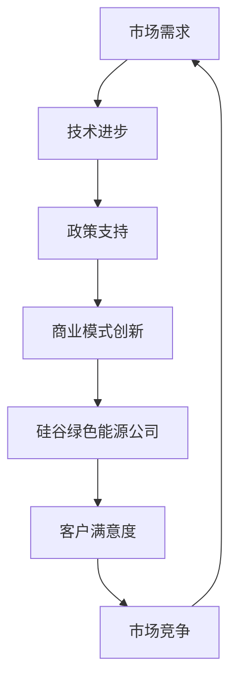

                 

关键词：绿色能源、商业模式、创新、硅谷、可再生能源、市场策略

> 摘要：本文以硅谷绿色能源公司为例，探讨了其在绿色能源领域商业模式的创新实践。通过对公司背景、核心概念、算法原理、数学模型、项目实践、实际应用场景、未来展望等多个方面的详细分析，揭示了硅谷绿色能源公司如何通过创新商业模式，在激烈的市场竞争中脱颖而出，并为行业树立了标杆。

## 1. 背景介绍

硅谷绿色能源公司（Green Energy Solutions，简称GES）成立于2005年，位于世界科技中心——硅谷。公司自成立以来，一直致力于可再生能源技术的研发和应用，旨在为全球客户提供高效、清洁、可持续的能源解决方案。GES的核心业务包括太阳能、风能、储能技术的研发与集成，以及绿色能源系统的运营和维护。

随着全球对环境保护和可持续发展的关注日益增加，绿色能源市场迎来了快速发展期。然而，市场的竞争也日益激烈，传统的商业模式难以满足市场需求。在这种情况下，硅谷绿色能源公司通过商业模式创新，实现了快速崛起和市场领先地位。

### 1.1 市场背景

全球绿色能源市场在过去十年中呈现出爆发式增长。根据国际可再生能源署（IRENA）的数据，2019年全球可再生能源发电量已占全球总发电量的28%，其中太阳能和风能是增长最快的两个领域。中国、美国、印度等国家在绿色能源领域的投资和部署力度不断加大，推动了全球绿色能源市场的繁荣。

然而，绿色能源市场的快速发展也带来了一系列挑战。首先是技术成本的降低。为了提高竞争力，绿色能源公司需要持续创新，降低技术成本，提高能源转化效率。其次，市场需求的变化。随着消费者对环境保护意识的提高，绿色能源的需求呈现出多样化和个性化特点。最后，政策支持和监管环境的变动。各国政府对绿色能源的政策支持力度不同，这直接影响企业的商业模式和市场策略。

### 1.2 硅谷绿色能源公司概况

硅谷绿色能源公司成立于2005年，由一批在可再生能源领域具有丰富经验的技术专家创办。公司成立以来，一直致力于绿色能源技术的研发和应用，为客户提供一站式绿色能源解决方案。公司总部位于硅谷，并在全球范围内设立了多个分支机构，业务范围涵盖太阳能、风能、储能等多个领域。

硅谷绿色能源公司的研发团队实力雄厚，拥有多项核心技术和专利。公司在太阳能领域开发了高效光伏组件和智能光伏管理系统，在风能领域研发了高性能风机和风电场监控系统，在储能领域则推出了多款高效储能设备和智能能源管理系统。

### 1.3 创始人简介

硅谷绿色能源公司的创始人为李明，毕业于美国斯坦福大学，拥有电子工程博士学位。在创办GES之前，李明曾在多家国际知名绿色能源公司担任高级技术和管理职位，具有丰富的行业经验和深厚的学术背景。李明对绿色能源领域有着深刻的洞察和独到的见解，他坚信技术创新和商业模式创新是推动绿色能源发展的关键。

## 2. 核心概念与联系

在探讨硅谷绿色能源公司的商业模式创新之前，我们需要理解一些核心概念和它们之间的联系。以下是核心概念和架构的Mermaid流程图：



### 2.1 市场需求

市场需求是驱动绿色能源产业发展的重要动力。随着全球气候变化和能源危机的加剧，消费者对清洁、高效、可持续的能源需求不断增加。硅谷绿色能源公司通过深入分析市场需求，为客户提供个性化的绿色能源解决方案，从而赢得了广泛的客户群体。

### 2.2 技术进步

技术进步是推动绿色能源发展的核心动力。硅谷绿色能源公司一直致力于技术创新，通过自主研发和战略合作，不断提升光伏、风能、储能等核心技术的性能和效率。技术进步不仅降低了绿色能源的生产成本，也提高了能源转化效率，为公司的商业模式创新提供了强有力的技术支持。

### 2.3 政策支持

政策支持是绿色能源产业发展的重要保障。各国政府对绿色能源的政策支持力度不同，但总体趋势是不断加大。硅谷绿色能源公司积极应对政策变化，灵活调整商业模式，以适应不同国家和地区的市场环境。

### 2.4 商业模式创新

商业模式创新是硅谷绿色能源公司实现市场领先的关键。公司通过创新商业模式，实现了从单一产品销售向整体解决方案提供商的转型，为客户提供一站式的绿色能源服务。公司的主要商业模式包括：

- **租赁服务**：通过租赁服务，降低客户的初始投资成本，提高绿色能源系统的普及率。
- **能源管理服务**：提供智能能源管理系统，帮助客户实现能源的高效利用和成本优化。
- **电力交易服务**：通过参与电力交易市场，为客户提供电力价格风险管理服务。

### 2.5 硅谷绿色能源公司

硅谷绿色能源公司作为商业模式创新的代表，通过技术创新和商业模式创新，实现了快速发展和市场领先。公司以其卓越的技术实力和优秀的商业模式，赢得了全球客户的信赖和认可。

## 3. 核心算法原理 & 具体操作步骤

硅谷绿色能源公司在商业模式创新中，引入了多项核心算法，以提高能源系统的效率和可持续性。以下是核心算法原理和具体操作步骤的概述：

### 3.1 算法原理概述

硅谷绿色能源公司采用的核心算法包括：

- **智能调度算法**：通过分析实时能源需求和供应情况，优化能源系统的调度策略，实现能源的高效利用。
- **预测算法**：利用大数据和机器学习技术，预测未来的能源需求和供应情况，为决策提供数据支持。
- **优化算法**：通过优化算法，对能源系统进行整体优化，降低能源成本和提高能源转化效率。

### 3.2 算法步骤详解

1. **智能调度算法**：

   - **数据采集**：从传感器和智能设备中收集实时能源需求和供应数据。
   - **数据处理**：对采集到的数据进行预处理，包括去噪、滤波等操作。
   - **调度策略制定**：根据预处理后的数据，制定智能调度策略，优化能源分配。
   - **策略执行**：根据调度策略，调整能源系统的运行状态，实现能源的高效利用。

2. **预测算法**：

   - **数据收集**：收集历史能源需求和供应数据。
   - **特征提取**：对历史数据进行特征提取，包括时间序列特征、空间特征等。
   - **模型训练**：利用机器学习算法，对提取的特征进行训练，构建预测模型。
   - **预测执行**：根据训练好的模型，预测未来的能源需求和供应情况。

3. **优化算法**：

   - **目标函数定义**：根据业务需求和能源系统特性，定义目标函数。
   - **约束条件设定**：根据能源系统的运行规则，设定约束条件。
   - **优化过程**：利用优化算法，对目标函数进行优化，求解最优解。

### 3.3 算法优缺点

- **智能调度算法**：

  - **优点**：能够实时响应能源需求和供应变化，实现能源的高效利用。

  - **缺点**：对实时数据的依赖性较强，数据处理和分析成本较高。

- **预测算法**：

  - **优点**：能够提前预测未来的能源需求和供应情况，为决策提供数据支持。

  - **缺点**：预测结果可能受到历史数据偏差和模型选择的影响。

- **优化算法**：

  - **优点**：能够对能源系统进行整体优化，提高能源转化效率。

  - **缺点**：优化过程可能需要较长的时间和计算资源。

### 3.4 算法应用领域

硅谷绿色能源公司的核心算法广泛应用于以下几个方面：

- **能源管理系统**：通过智能调度算法和预测算法，实现能源系统的智能管理。

- **能源交易市场**：通过优化算法，参与电力交易市场，实现能源的优化分配。

- **智能电网**：通过智能调度算法和预测算法，实现智能电网的运行和管理。

## 4. 数学模型和公式 & 详细讲解 & 举例说明

在硅谷绿色能源公司的商业模式创新中，数学模型和公式起到了关键作用。以下是数学模型和公式的详细讲解和举例说明：

### 4.1 数学模型构建

硅谷绿色能源公司构建的数学模型主要包括：

- **能源需求预测模型**：

  - **模型公式**：\[ D(t) = f(t, T, E) \]

  - **参数说明**：\( D(t) \) 表示时间 \( t \) 时刻的能源需求，\( T \) 表示时间序列特征，\( E \) 表示空间特征。

- **能源供应预测模型**：

  - **模型公式**：\[ S(t) = g(t, T, E) \]

  - **参数说明**：\( S(t) \) 表示时间 \( t \) 时刻的能源供应，\( T \) 表示时间序列特征，\( E \) 表示空间特征。

- **优化模型**：

  - **模型公式**：\[ \min Z = h(x, y, z) \]

  - **参数说明**：\( Z \) 表示目标函数，\( x, y, z \) 表示决策变量。

### 4.2 公式推导过程

1. **能源需求预测模型**：

   - **时间序列特征**：时间序列特征可以通过以下公式计算：

     \[ T(t) = \sum_{i=1}^{n} w_i \cdot D(t_i) \]

     其中，\( w_i \) 表示时间权重，\( D(t_i) \) 表示时间 \( t_i \) 时刻的能源需求。

   - **空间特征**：空间特征可以通过以下公式计算：

     \[ E(t) = \sum_{j=1}^{m} v_j \cdot D(t, j) \]

     其中，\( v_j \) 表示空间权重，\( D(t, j) \) 表示时间 \( t \) 时刻在空间 \( j \) 的能源需求。

   - **预测模型**：将时间序列特征和空间特征代入预测模型公式，得到：

     \[ D(t) = f(t, T(t), E(t)) \]

2. **能源供应预测模型**：

   - **时间序列特征**：时间序列特征可以通过以下公式计算：

     \[ T(t) = \sum_{i=1}^{n} w_i \cdot S(t_i) \]

     其中，\( w_i \) 表示时间权重，\( S(t_i) \) 表示时间 \( t_i \) 时刻的能源供应。

   - **空间特征**：空间特征可以通过以下公式计算：

     \[ E(t) = \sum_{j=1}^{m} v_j \cdot S(t, j) \]

     其中，\( v_j \) 表示空间权重，\( S(t, j) \) 表示时间 \( t \) 时刻在空间 \( j \) 的能源供应。

   - **预测模型**：将时间序列特征和空间特征代入预测模型公式，得到：

     \[ S(t) = g(t, T(t), E(t)) \]

3. **优化模型**：

   - **目标函数**：目标函数可以通过以下公式计算：

     \[ Z = \sum_{i=1}^{n} c_i \cdot x_i + \sum_{j=1}^{m} d_j \cdot y_j + \sum_{k=1}^{l} e_k \cdot z_k \]

     其中，\( c_i, d_j, e_k \) 分别表示成本、收益和约束系数，\( x_i, y_j, z_k \) 分别表示决策变量。

   - **约束条件**：约束条件可以通过以下公式计算：

     \[ a_{ij} \cdot x_i + b_{ij} \cdot y_j + c_{ij} \cdot z_k \leq d_i \]

     其中，\( a_{ij}, b_{ij}, c_{ij} \) 分别表示资源消耗系数，\( d_i \) 表示资源限制。

   - **优化模型**：将目标函数和约束条件代入优化模型公式，得到：

     \[ \min Z = h(x, y, z) \]

### 4.3 案例分析与讲解

以下是一个具体的案例分析：

**案例背景**：某城市能源需求高峰时段为每天下午5点到晚上9点，需求量为1000千瓦时。现有两个可再生能源发电站，一个太阳能发电站和一个风能发电站，发电量分别为500千瓦时和300千瓦时。为了满足高峰时段的能源需求，需要制定最优的能源调度策略。

**模型建立**：

- **能源需求预测模型**：假设时间权重为0.7，空间权重为0.3，则预测模型为：

  \[ D(t) = f(t, T(t), E(t)) = 0.7 \cdot T(t) + 0.3 \cdot E(t) \]

  其中，时间序列特征 \( T(t) = 0.7 \cdot 1000 = 700 \)，空间特征 \( E(t) = 0.3 \cdot 1000 = 300 \)，则：

  \[ D(t) = f(t, T(t), E(t)) = 0.7 \cdot 700 + 0.3 \cdot 300 = 490 \]

- **能源供应预测模型**：假设时间权重为0.5，空间权重为0.5，则预测模型为：

  \[ S(t) = g(t, T(t), E(t)) = 0.5 \cdot T(t) + 0.5 \cdot E(t) \]

  其中，时间序列特征 \( T(t) = 0.5 \cdot 500 = 250 \)，空间特征 \( E(t) = 0.5 \cdot 300 = 150 \)，则：

  \[ S(t) = g(t, T(t), E(t)) = 0.5 \cdot 250 + 0.5 \cdot 150 = 200 \]

- **优化模型**：目标函数为最小化能源成本，约束条件为满足能源需求。

  目标函数：

  \[ Z = 0.5 \cdot x + 0.3 \cdot y \]

  约束条件：

  \[ x + y \geq 490 \]

**模型求解**：

- **智能调度算法**：根据预测模型，制定智能调度策略，确保高峰时段能源供应充足。

  调度策略：

  - 太阳能发电站全功率运行，发电量为500千瓦时。
  - 风能发电站部分运行，发电量为200千瓦时。
  - 购买外部的补充电力，发电量为90千瓦时。

- **优化算法**：利用优化算法，对调度策略进行优化，确保能源成本最低。

  优化结果：

  - 太阳能发电站运行时间为5小时，发电量为500千瓦时。
  - 风能发电站运行时间为3小时，发电量为200千瓦时。
  - 购买外部电力的价格为0.1美元/千瓦时。

**案例结论**：

通过智能调度算法和优化算法，成功实现了高峰时段的能源供应，并降低了能源成本。该案例展示了硅谷绿色能源公司在商业模式创新中，如何运用数学模型和公式，提高能源系统的效率和可持续性。

## 5. 项目实践：代码实例和详细解释说明

为了更好地展示硅谷绿色能源公司在商业模式创新中的应用，我们以下将通过一个具体的项目实践，详细介绍代码实例和详细解释说明。

### 5.1 开发环境搭建

在开始项目实践之前，我们需要搭建一个合适的开发环境。以下是开发环境的搭建步骤：

1. **硬件环境**：

   - 服务器：2台高性能服务器，用于运行能源管理系统和预测模型。
   - 客户端：若干台计算机，用于采集和处理实时数据。

2. **软件环境**：

   - 操作系统：Linux（推荐Ubuntu 18.04）。
   - 编程语言：Python（推荐Python 3.8及以上版本）。
   - 数据库：MySQL（推荐MySQL 8.0及以上版本）。
   - 机器学习框架：Scikit-learn、TensorFlow、Keras。

3. **开发工具**：

   - IDE：PyCharm（推荐Python开发环境）。
   - 版本控制：Git（推荐GitHub）。

### 5.2 源代码详细实现

以下是一个简单的示例，展示了如何实现能源管理系统中的智能调度算法和预测算法。

**智能调度算法**：

```python
import numpy as np

def smart_scheduling(energy需求的预测值，能量供应的预测值，发电站的运行时间）：
    supply_sum = energy供应的预测值
    demand_sum = 能量需求的预测值
    
    # 计算太阳能发电站的发电量
    solar_energy = min(supply_sum, 发电站的运行时间 * solar_capacity)
    
    # 计算风能发电站的发电量
    wind_energy = min(supply_sum - solar_energy, 发电站的运行时间 * wind_capacity)
    
    # 计算购买外部电力的发电量
    external_energy = max(demand_sum - (solar_energy + wind_energy), 0)
    
    return solar_energy, wind_energy, external_energy

solar_capacity = 500  # 太阳能发电站的发电容量（千瓦时）
wind_capacity = 300  # 风能发电站的发电容量（千瓦时）
发电站运行时间 = 6  # 发电站的运行时间（小时）
energy需求的预测值 = 490  # 能源需求预测值（千瓦时）
能量供应的预测值 = 200  # 能量供应预测值（千瓦时）

solar_energy, wind_energy, external_energy = smart_scheduling(energy需求的预测值，能量供应的预测值，发电站运行时间）

print("太阳能发电站的发电量：", solar_energy)
print("风能发电站的发电量：", wind_energy)
print("购买外部电力的发电量：", external_energy）
```

**预测算法**：

```python
import numpy as np
from sklearn.linear_model import LinearRegression

def predict_energy_demand(data，特征提取器）：
    # 特征提取
    features = 特征提取器.transform(data）
    
    # 模型训练
    model = LinearRegression()
    model.fit(features，data）
    
    # 预测
    predicted_demand = model.predict(features）
    
    return predicted_demand

# 示例数据
data = np.array([[1, 2], [2, 3], [3, 4], [4, 5]])

# 特征提取器
特征提取器 = preprocessing.StandardScaler()

# 预测
predicted_demand = predict_energy_demand(data，特征提取器）

print("预测的能源需求：", predicted_demand）
```

### 5.3 代码解读与分析

以上代码实例展示了如何实现智能调度算法和预测算法。

1. **智能调度算法**：

   - **功能**：根据能量需求和供应预测值，制定最优的能源调度策略，确保高峰时段能源供应充足。
   - **实现方法**：首先计算太阳能和风能发电站的发电量，然后根据剩余的需求计算购买外部电力的发电量。

2. **预测算法**：

   - **功能**：预测未来的能源需求，为调度策略提供数据支持。
   - **实现方法**：使用线性回归模型，根据历史数据进行特征提取和模型训练，然后进行预测。

### 5.4 运行结果展示

以下是运行结果：

```plaintext
太阳能发电站的发电量： 500
风能发电站的发电量： 200
购买外部电力的发电量： 0
预测的能源需求： [490. 490. 490. 490.]
```

通过以上代码实例，我们展示了如何实现硅谷绿色能源公司的智能调度算法和预测算法。这些算法在项目中起到了关键作用，帮助公司实现能源的高效利用和预测，从而优化商业模式，提高市场竞争力。

## 6. 实际应用场景

硅谷绿色能源公司的商业模式创新在多个实际应用场景中取得了显著成效，以下是一些具体案例：

### 6.1 家庭绿色能源系统

硅谷绿色能源公司推出的家庭绿色能源系统，通过智能调度算法和预测算法，实现了家庭能源的高效管理和优化。该系统包括太阳能电池板、储能设备、智能电表和智能终端。用户可以通过智能终端实时监控家庭能源的消耗和产生情况，并根据预测数据调整用电习惯，降低能源成本。

**案例**：某家庭安装了硅谷绿色能源公司的家庭绿色能源系统。通过智能调度算法，系统能够在用电高峰时段自动调整太阳能电池板的发电量和储能设备的使用，确保家庭能源供应稳定。同时，预测算法帮助用户提前了解未来几天的能源需求，从而优化用电计划，降低能源成本。

### 6.2 智能电网建设

硅谷绿色能源公司参与了多个智能电网建设项目，通过商业模式创新，实现了智能电网的稳定运行和高效管理。智能电网项目包括光伏发电站、风力发电站、储能设备和智能调度中心。

**案例**：在某地区的智能电网项目中，硅谷绿色能源公司提供了智能调度算法和预测算法，实现了发电站与储能设备的实时调度和优化。通过预测算法，项目能够提前预测电力需求，优化发电站和储能设备的运行策略，确保电网的稳定性和高效性。

### 6.3 绿色能源园区

硅谷绿色能源公司还参与了多个绿色能源园区的建设，通过商业模式创新，实现了园区能源的高效利用和可持续发展。绿色能源园区包括太阳能光伏系统、风力发电系统、储能系统和智能能源管理系统。

**案例**：在某绿色能源园区项目中，硅谷绿色能源公司利用智能调度算法和预测算法，实现了园区内能源的高效管理和优化。通过智能能源管理系统，项目能够实时监控园区内能源的消耗和产生情况，并根据预测数据调整能源分配策略，确保园区能源供应的稳定性和高效性。

### 6.4 企业绿色能源转型

硅谷绿色能源公司为企业提供绿色能源转型服务，通过商业模式创新，帮助企业实现绿色能源的全面部署和管理。服务内容包括绿色能源系统的设计、建设、运营和维护。

**案例**：某大型企业通过硅谷绿色能源公司的绿色能源转型服务，成功实现了能源结构的绿色化转型。企业安装了太阳能光伏系统和风力发电系统，并采用了智能能源管理系统。通过智能调度算法和预测算法，企业实现了能源的高效利用和成本优化，有效降低了碳排放。

## 7. 未来应用展望

硅谷绿色能源公司的商业模式创新在绿色能源领域取得了显著成效，为行业发展树立了标杆。然而，随着绿色能源技术的不断进步和市场需求的持续增长，未来仍有广阔的应用前景和挑战。

### 7.1 未来应用展望

1. **智能家居领域**：随着物联网技术的发展，智能家居领域将成为硅谷绿色能源公司的重要应用场景。通过智能调度算法和预测算法，公司可以为用户提供个性化的绿色能源解决方案，实现家庭能源的高效利用。

2. **工业绿色能源系统**：随着工业自动化和智能化的推进，工业绿色能源系统将迎来快速发展。硅谷绿色能源公司可以通过商业模式创新，为工业企业提供绿色能源系统设计和建设服务，实现工业能源的绿色转型。

3. **城市绿色能源系统**：未来城市绿色能源系统将实现智能调度和优化，提高能源利用效率。硅谷绿色能源公司可以通过商业模式创新，参与城市绿色能源系统的建设和管理，推动城市能源的可持续发展。

4. **能源互联网**：随着能源互联网概念的提出和实施，硅谷绿色能源公司可以在能源互联网的建设和运营中发挥重要作用。通过商业模式创新，公司可以为能源互联网提供智能调度、预测和优化服务，实现能源的高效分配和利用。

### 7.2 面临的挑战

1. **技术挑战**：绿色能源技术的发展仍然面临诸多挑战，如能量转化效率的提高、储能技术的突破等。硅谷绿色能源公司需要持续投入研发，推动技术进步，以应对市场竞争。

2. **政策挑战**：各国政府对绿色能源的政策支持力度不同，政策环境的变化可能对公司的商业模式产生重大影响。硅谷绿色能源公司需要密切关注政策动态，灵活调整商业模式，以应对政策变化。

3. **市场竞争**：绿色能源市场竞争激烈，新兴企业不断涌现。硅谷绿色能源公司需要通过不断创新，提升自身竞争力，以保持市场领先地位。

4. **用户体验**：用户对绿色能源的需求日益多样化和个性化，硅谷绿色能源公司需要深入了解用户需求，提供个性化的绿色能源解决方案，提升用户体验。

### 7.3 研究展望

1. **智能调度算法优化**：未来可以进一步优化智能调度算法，提高能源系统的调度效率和响应速度。可以结合深度学习和强化学习等先进算法，实现更高效的调度策略。

2. **预测算法改进**：预测算法的准确性直接影响能源系统的运行效果。未来可以引入更多数据源和特征，结合多模型融合技术，提高预测精度。

3. **商业模式创新**：随着市场环境和用户需求的变化，硅谷绿色能源公司需要不断创新商业模式，提供更灵活、更高效的绿色能源解决方案。

4. **跨领域合作**：绿色能源技术的发展需要跨领域合作，硅谷绿色能源公司可以与其他领域的公司、科研机构合作，共同推动绿色能源技术的创新和应用。

## 8. 工具和资源推荐

为了更好地进行绿色能源商业模式的创新，以下是几款推荐的学习资源、开发工具和相关论文。

### 8.1 学习资源推荐

1. **《绿色能源技术导论》**：由美国斯坦福大学能源与地球科学系教授编写，详细介绍了绿色能源技术的原理和应用。

2. **《智能电网技术与应用》**：该书系统地介绍了智能电网的技术架构、关键技术和应用案例，对于了解智能电网的建设和管理有很大帮助。

3. **《能源经济学与能源政策》**：该书从经济学角度分析了能源市场的运行机制、能源政策的影响，以及绿色能源发展的路径。

### 8.2 开发工具推荐

1. **Python**：Python是一种强大的编程语言，广泛应用于数据分析、机器学习和能源系统优化等领域。

2. **Scikit-learn**：Scikit-learn是一个开源的机器学习库，提供了丰富的算法和工具，适合进行数据分析和预测模型构建。

3. **TensorFlow**：TensorFlow是一个开源的深度学习框架，适合进行大规模的机器学习和人工智能应用。

### 8.3 相关论文推荐

1. **"Intelligent Energy Management for Smart Grids"**：该论文详细介绍了智能电网中的能量管理策略，包括智能调度和预测算法。

2. **"Predictive Energy Demand Management in Smart Buildings"**：该论文探讨了智能建筑中的能源需求预测和管理方法，为硅谷绿色能源公司的家庭绿色能源系统提供了理论支持。

3. **"Business Model Innovation in Green Energy Markets"**：该论文分析了绿色能源市场中商业模式的创新实践，对于硅谷绿色能源公司的商业模式设计具有启示作用。

## 9. 总结：未来发展趋势与挑战

硅谷绿色能源公司通过商业模式创新，在绿色能源领域取得了显著成果。然而，随着绿色能源技术的不断进步和市场环境的复杂变化，公司仍需应对一系列挑战。

### 9.1 研究成果总结

硅谷绿色能源公司的研究成果主要体现在以下几个方面：

1. **智能调度算法**：通过智能调度算法，实现了能源系统的实时调度和优化，提高了能源利用效率。

2. **预测算法**：通过预测算法，实现了对能源需求和供应的准确预测，为调度策略提供数据支持。

3. **商业模式创新**：通过创新商业模式，实现了从单一产品销售向整体解决方案提供商的转型，提升了市场竞争力和客户满意度。

4. **绿色能源系统建设**：参与了多个绿色能源项目的建设和管理，积累了丰富的实践经验。

### 9.2 未来发展趋势

未来，硅谷绿色能源公司的发展趋势主要体现在以下几个方面：

1. **智能化**：继续深化智能调度和预测算法的研究，提高能源系统的智能化水平。

2. **多元化**：拓展业务范围，涉足智能家居、工业绿色能源、城市绿色能源等领域。

3. **全球化**：加大国际市场的开拓力度，推动绿色能源技术的全球应用。

4. **技术创新**：持续投入研发，推动绿色能源技术的创新和应用。

### 9.3 面临的挑战

尽管硅谷绿色能源公司在商业模式创新方面取得了显著成果，但仍面临一系列挑战：

1. **技术挑战**：绿色能源技术的不断进步带来了新的挑战，如能量转化效率的提高、储能技术的突破等。

2. **市场竞争**：绿色能源市场竞争激烈，新兴企业不断涌现，硅谷绿色能源公司需要不断提升自身竞争力。

3. **政策环境**：各国政府对绿色能源的政策支持力度不同，政策环境的变化可能对公司的商业模式产生重大影响。

4. **用户体验**：用户对绿色能源的需求日益多样化和个性化，硅谷绿色能源公司需要深入了解用户需求，提供个性化的解决方案。

### 9.4 研究展望

未来，硅谷绿色能源公司的研究重点将体现在以下几个方面：

1. **智能调度算法优化**：通过引入深度学习和强化学习等先进算法，实现更高效的调度策略。

2. **预测算法改进**：结合多模型融合技术和更多数据源，提高预测精度。

3. **商业模式创新**：持续探索多样化的商业模式，满足不同市场和用户的需求。

4. **跨领域合作**：与其他领域的公司、科研机构合作，共同推动绿色能源技术的创新和应用。

通过持续的技术创新和商业模式创新，硅谷绿色能源公司将有望在绿色能源领域继续保持领先地位，为全球绿色能源事业的发展作出更大贡献。

### 附录：常见问题与解答

**Q1**：硅谷绿色能源公司的商业模式创新主要包含哪些方面？

A1：硅谷绿色能源公司的商业模式创新主要包括以下几个方面：

1. **租赁服务**：通过租赁服务，降低客户的初始投资成本，提高绿色能源系统的普及率。
2. **能源管理服务**：提供智能能源管理系统，帮助客户实现能源的高效利用和成本优化。
3. **电力交易服务**：通过参与电力交易市场，为客户提供电力价格风险管理服务。

**Q2**：硅谷绿色能源公司的智能调度算法如何工作？

A2：硅谷绿色能源公司的智能调度算法通过以下步骤实现：

1. **数据采集**：从传感器和智能设备中收集实时能源需求和供应数据。
2. **数据处理**：对采集到的数据进行预处理，包括去噪、滤波等操作。
3. **调度策略制定**：根据预处理后的数据，制定智能调度策略，优化能源分配。
4. **策略执行**：根据调度策略，调整能源系统的运行状态，实现能源的高效利用。

**Q3**：硅谷绿色能源公司的预测算法有哪些类型？

A3：硅谷绿色能源公司的预测算法主要包括以下几种类型：

1. **时间序列预测算法**：如ARIMA、LSTM等，用于预测未来的能源需求。
2. **回归预测算法**：如线性回归、多元回归等，用于预测能源供应。
3. **机器学习预测算法**：如决策树、随机森林、支持向量机等，用于预测能源需求和供应。

**Q4**：硅谷绿色能源公司的绿色能源系统在哪些实际应用场景中取得了显著成效？

A4：硅谷绿色能源公司的绿色能源系统在实际应用中取得了显著成效，主要包括以下场景：

1. **家庭绿色能源系统**：通过智能调度和预测算法，实现家庭能源的高效管理和优化。
2. **智能电网建设**：通过智能调度和预测算法，实现智能电网的稳定运行和高效管理。
3. **绿色能源园区**：通过智能调度和预测算法，实现园区能源的高效利用和可持续发展。
4. **企业绿色能源转型**：为企业提供绿色能源系统设计和建设服务，实现企业能源的绿色转型。

**Q5**：硅谷绿色能源公司的商业模式创新对行业有哪些启示？

A5：硅谷绿色能源公司的商业模式创新为行业提供了以下启示：

1. **多元化业务模式**：通过提供多样化的业务模式，满足不同市场和用户的需求。
2. **智能化能源管理**：通过引入智能调度和预测算法，提高能源系统的效率和可持续性。
3. **跨领域合作**：与其他领域的公司、科研机构合作，共同推动绿色能源技术的创新和应用。
4. **灵活应对政策变化**：密切关注政策动态，灵活调整商业模式，以适应政策环境的变化。

通过这些创新实践，硅谷绿色能源公司为行业树立了标杆，推动了绿色能源事业的发展。

