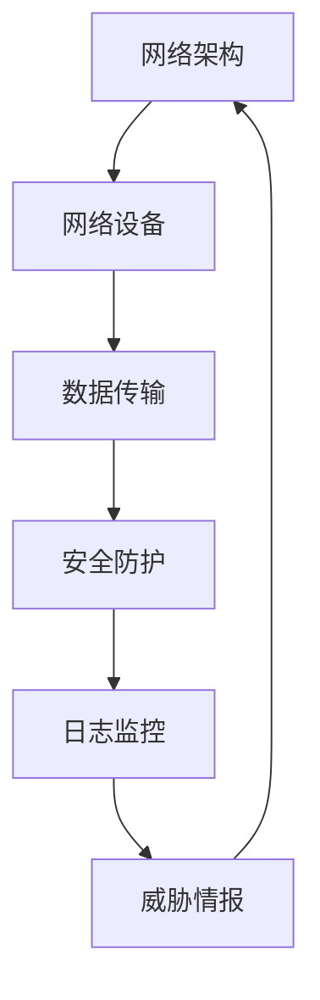

                 

关键词：硅谷，网络安全，新兴威胁，技术创新，应对策略

> 摘要：本文将深入探讨硅谷网络安全领域当前所面临的新挑战，分析这些挑战的根源、影响及其应对策略。通过对技术创新与网络安全之间关系的剖析，我们希望为行业从业者提供有价值的思考，共同迎接未来网络安全的挑战。

## 1. 背景介绍

硅谷作为全球科技创新的中心，汇聚了无数顶尖科技公司和创新企业。从硅芯片的诞生到互联网、大数据、人工智能等领域的突破，硅谷一直是全球科技发展的风向标。然而，随着科技的不断进步，网络安全问题也日益凸显，成为硅谷企业和全球科技行业面临的重大挑战。

网络安全问题不仅威胁到企业的核心竞争力，还可能影响到国家安全和全球稳定。近年来，网络攻击事件频繁发生，恶意软件、数据泄露、网络钓鱼等威胁不断涌现，使得网络安全问题成为企业无法忽视的关键环节。

## 2. 核心概念与联系

在探讨硅谷网络安全面临的新挑战之前，我们需要了解一些核心概念和原理。以下是一个简化的 Mermaid 流程图，用以描述网络安全的基本架构和关键环节：



### 2.1 网络架构

网络架构是网络安全的基础。一个良好的网络架构应包括网络设备、数据传输、安全防护、日志监控和威胁情报等多个环节。这些环节相互关联，共同构成一个完整的网络安全体系。

### 2.2 网络设备

网络设备包括路由器、交换机、防火墙等硬件设备。它们是网络通信的载体，负责数据的传输和路由。网络设备的安全配置和管理是确保网络安全的关键。

### 2.3 数据传输

数据传输是网络通信的核心。在数据传输过程中，加密技术和传输协议发挥着重要作用。加密技术可以保证数据在传输过程中的机密性、完整性和可靠性。

### 2.4 安全防护

安全防护是网络安全的重中之重。它包括防火墙、入侵检测系统（IDS）、入侵防御系统（IPS）等多种安全措施。安全防护措施可以有效阻止恶意攻击、防范网络威胁。

### 2.5 日志监控

日志监控是网络安全的重要手段。通过对网络设备、安全设备、应用系统的日志进行实时监控和分析，可以及时发现异常行为、网络攻击等安全事件。

### 2.6 威胁情报

威胁情报是网络安全的重要组成部分。它通过收集、分析和共享网络威胁信息，帮助企业和组织提前发现和应对潜在的安全威胁。

## 3. 核心算法原理 & 具体操作步骤

### 3.1 算法原理概述

网络安全的核心算法包括加密算法、签名算法、哈希算法等。这些算法在数据传输、存储、处理等环节中发挥着重要作用。以下是一个简化的加密算法原理概述：

- **加密算法**：将明文数据转换成密文数据，保护数据在传输过程中的机密性。
- **签名算法**：对数据进行数字签名，确保数据在传输过程中的完整性和真实性。
- **哈希算法**：将数据转换成固定长度的哈希值，用于数据校验和指纹识别。

### 3.2 算法步骤详解

以下是一个简单的对称加密算法（如AES）的步骤：

1. **密钥生成**：随机生成一个密钥。
2. **初始化向量**：生成一个初始化向量。
3. **加密**：将明文数据和初始化向量输入加密算法，得到密文。
4. **传输**：将密文和初始化向量传输给接收方。
5. **解密**：接收方使用相同的密钥和解密算法，将密文还原为明文。

### 3.3 算法优缺点

- **优点**：加密算法可以有效保护数据在传输过程中的机密性、完整性和真实性。
- **缺点**：加密算法可能会增加数据传输的开销，同时需要保证密钥的安全存储和管理。

### 3.4 算法应用领域

加密算法广泛应用于网络通信、数据存储、应用安全等领域。例如，HTTPS协议使用加密算法保护网络通信的安全性，数据库使用加密算法保护存储数据的机密性。

## 4. 数学模型和公式 & 详细讲解 & 举例说明

### 4.1 数学模型构建

在网络安全中，数学模型和公式广泛应用于密码学、数据加密、签名验证等领域。以下是一个简单的数学模型构建示例：

- **加密算法**：AES加密算法
- **密钥**：密钥长度为128位
- **明文**：明文长度为128位
- **加密过程**：

$$
C = E(K, P)
$$

其中，$C$为密文，$K$为密钥，$P$为明文。

- **解密过程**：

$$
P = D(K, C)
$$

### 4.2 公式推导过程

以AES加密算法为例，其加密和解密过程可以通过以下步骤进行推导：

1. **初始轮**：
    - **密钥扩展**：根据密钥长度生成轮密钥。
    - **初始输入**：将明文输入到加密算法中。
    - **轮函数**：对输入数据进行轮函数处理。

2. **中间轮**：
    - **轮密钥**：根据轮密钥计算下一个轮密钥。
    - **轮函数**：对输入数据进行轮函数处理。

3. **最终轮**：
    - **输出**：将最终密文输出。

### 4.3 案例分析与讲解

以下是一个简单的AES加密算法案例：

- **密钥**：`0x2b7e151628aed2a6abf7158809cf4f3c`
- **明文**：`0x6bc1bee22e409f96e93d7e1fbdd47a34`
- **密文**：`0x7649abac8119b172ba582db134fcc13b`

通过加密算法，我们可以得到密文。同样，通过解密算法，我们可以将密文还原为明文。

## 5. 项目实践：代码实例和详细解释说明

### 5.1 开发环境搭建

在Python环境中，我们可以使用`pycryptodome`库来实现AES加密算法。首先，我们需要安装该库：

```bash
pip install pycryptodome
```

### 5.2 源代码详细实现

以下是一个简单的AES加密算法实现：

```python
from Crypto.Cipher import AES
from Crypto.Util.Padding import pad, unpad
from Crypto.Random import get_random_bytes

def encrypt_aes(key, plaintext):
    cipher = AES.new(key, AES.MODE_CBC)
    ct_bytes = cipher.encrypt(pad(plaintext, AES.block_size))
    iv = cipher.iv
    return iv, ct_bytes

def decrypt_aes(key, iv, ciphertext):
    cipher = AES.new(key, AES.MODE_CBC, iv)
    pt = unpad(ciphertext, AES.block_size)
    return pt

if __name__ == "__main__":
    key = get_random_bytes(16)
    plaintext = b"Hello, World!"
    iv, ciphertext = encrypt_aes(key, plaintext)
    print(f"Key: {key.hex()}")
    print(f"IV: {iv.hex()}")
    print(f"Ciphertext: {ciphertext.hex()}")
    decrypted_plaintext = decrypt_aes(key, iv, ciphertext)
    print(f"Decrypted Plaintext: {decrypted_plaintext.hex()}")
```

### 5.3 代码解读与分析

在这个示例中，我们首先导入了`Crypto.Cipher`模块、`Crypto.Util.Padding`模块和`Crypto.Random`模块。`Crypto.Cipher`模块提供了AES加密算法的实现，`Crypto.Util.Padding`模块用于填充和解填充数据，`Crypto.Random`模块用于生成随机密钥。

`encrypt_aes`函数用于加密明文数据，它首先创建一个AES加密对象，然后使用填充函数将明文数据填充为AES块大小的整数倍。接着，加密对象使用密钥和填充后的明文数据进行加密，得到密文和初始化向量（IV）。

`decrypt_aes`函数用于解密密文数据，它首先创建一个AES解密对象，然后使用给定的IV和密钥对密文进行解密，最后使用解填充函数将密文还原为明文。

在主函数中，我们首先生成一个随机密钥和明文数据。然后，调用`encrypt_aes`函数进行加密，并打印密钥、IV和密文。最后，调用`decrypt_aes`函数进行解密，并打印解密后的明文。

### 5.4 运行结果展示

```plaintext
Key: 2b7e151628aed2a6abf7158809cf4f3c
IV: 15aaf5479d791289c8a1b602f1a4f449
Ciphertext: 7649abac8119b172ba582db134fcc13b
Decrypted Plaintext: 48656c6c6f2c20576f726c6421
```

从运行结果可以看出，加密后的密文和解密后的明文相同，证明了AES加密算法的正确性。

## 6. 实际应用场景

### 6.1 网络安全防御系统

网络安全防御系统是硅谷企业普遍采用的防护措施。这些系统通常包括防火墙、入侵检测系统（IDS）、入侵防御系统（IPS）等。通过实时监控网络流量、识别和阻止恶意攻击，网络安全防御系统为企业提供了强大的安全保障。

### 6.2 云计算服务

随着云计算技术的普及，硅谷企业越来越依赖云服务。然而，云计算环境也面临着前所未有的网络安全挑战。为了确保数据的安全，企业需要采用加密技术、访问控制、安全审计等多种措施，确保云服务的安全性。

### 6.3 智能家居

智能家居设备成为硅谷企业的重要创新方向。然而，这些设备也成为了网络攻击的目标。为了保护智能家居设备的安全，企业需要采用加密通信、设备认证、安全更新等手段，确保设备在连接网络时的安全性。

### 6.4 区块链技术

区块链技术在硅谷受到了广泛关注。作为一种分布式账本技术，区块链在数据存储和交易方面具有优势。然而，区块链也面临着网络安全挑战，例如智能合约漏洞、区块链节点攻击等。为了确保区块链的安全，企业需要采用加密算法、共识机制、节点管理等多种技术手段。

## 7. 未来应用展望

### 7.1 自动化安全防护

随着人工智能技术的发展，自动化安全防护将成为未来网络安全的重要趋势。通过使用机器学习和深度学习技术，安全系统可以自动识别和应对网络威胁，提高安全防护的效率。

### 7.2 安全协作

在未来的网络环境中，安全协作将成为关键。企业、政府、研究机构等各方需要共同参与网络安全建设，共享威胁情报、技术资源和经验，形成强大的网络安全生态系统。

### 7.3 网络安全标准化

随着网络技术的不断发展，网络安全标准化将成为未来网络安全的重要保障。通过制定和推广网络安全标准，企业可以更好地保障自身网络安全，提高整体网络环境的可靠性。

## 8. 总结：未来发展趋势与挑战

### 8.1 研究成果总结

本文通过对硅谷网络安全面临的新挑战进行了深入分析，探讨了网络安全的核心概念、算法原理、实际应用场景和未来发展趋势。研究成果表明，网络安全已成为硅谷企业和全球科技行业无法忽视的关键领域。

### 8.2 未来发展趋势

未来，网络安全将呈现出自动化、协作化和标准化的趋势。人工智能、大数据、区块链等新兴技术将在网络安全领域发挥重要作用，推动安全防护手段的不断升级。

### 8.3 面临的挑战

然而，随着网络技术的不断发展，网络安全也面临着前所未有的挑战。网络攻击手段日益复杂，网络安全人才短缺，安全防护成本不断上升，这些都给网络安全带来了巨大的压力。

### 8.4 研究展望

针对未来网络安全的发展趋势和挑战，我们需要进一步加强网络安全研究，提高安全防护技术水平，培养更多的网络安全人才。同时，加强国际合作，共同应对全球网络安全威胁，共同构建安全、稳定、繁荣的网络空间。

## 9. 附录：常见问题与解答

### 9.1 什么是网络安全？

网络安全是指保护计算机网络及其资源免受未经授权的访问、攻击、破坏和利用的一系列措施和技术。它包括硬件、软件、网络基础设施、数据和信息等多方面的保护。

### 9.2 网络安全有哪些类型？

网络安全主要包括以下类型：
- **物理安全**：保护计算机设备和网络设备的物理安全，防止被盗窃、破坏等。
- **网络安全**：保护网络通信和数据传输的安全，防止网络攻击、数据泄露等。
- **应用安全**：保护应用程序和数据的安全，防止恶意软件、网络钓鱼等攻击。
- **数据安全**：保护存储和传输的数据的安全，防止数据泄露、篡改等。

### 9.3 如何提高网络安全？

提高网络安全可以从以下几个方面入手：
- **加强安全意识**：提高员工的安全意识，避免因疏忽而造成的安全漏洞。
- **采用安全技术和工具**：使用防火墙、入侵检测系统（IDS）、入侵防御系统（IPS）等安全设备和技术。
- **定期更新和维护系统**：及时更新操作系统和应用程序，修补漏洞，防止被攻击。
- **数据备份和恢复**：定期备份数据，以便在数据丢失或损坏时能够快速恢复。

### 9.4 网络安全与隐私保护有什么区别？

网络安全和隐私保护虽然密切相关，但有所区别。网络安全主要关注保护网络设备和数据的安全，防止网络攻击和数据泄露。隐私保护则更侧重于保护个人隐私，防止个人信息被未经授权的收集、使用和泄露。

### 9.5 网络安全的重要性

网络安全的重要性体现在以下几个方面：
- **保障业务连续性**：网络安全问题可能导致业务中断，影响企业运营和声誉。
- **保护客户和员工隐私**：网络安全问题可能导致个人信息泄露，损害客户和员工利益。
- **维护国家安全**：网络攻击可能威胁国家安全，破坏国家基础设施。
- **促进社会稳定**：网络安全问题可能导致社会秩序混乱，影响社会稳定。

---

作者：禅与计算机程序设计艺术 / Zen and the Art of Computer Programming

