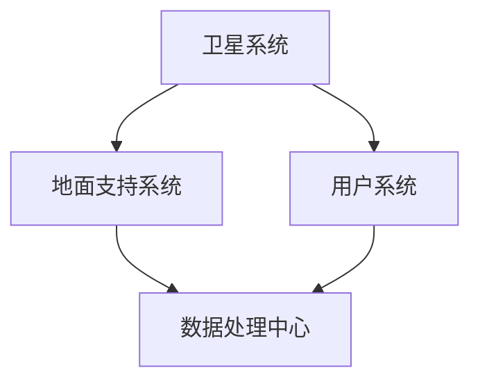

                 

 关键词：硅谷、航空航天、商业化、民用航天、技术发展、市场需求、创新模式

> 摘要：本文深入探讨了硅谷航空航天领域的商业化进程，分析了民用航天市场的发展潜力、技术创新模式及其对全球航空产业的影响。文章首先介绍了硅谷在航空航天领域的独特优势，随后详细阐述了民用航天的核心概念和架构，最后对未来民用航天的应用场景和挑战进行了展望。

## 1. 背景介绍

### 1.1 硅谷：创新与商业的结合

硅谷，作为全球科技创新的中心，以其独特的商业环境和创新文化闻名于世。从20世纪50年代开始，硅谷便吸引了大量科技人才和风险投资，逐渐发展成为全球高新技术产业的摇篮。在航空航天领域，硅谷的创新实力同样不容小觑。众多航空航天初创企业在这里孕育而生，将先进的科技和商业模式引入民用航天领域，推动了整个行业的发展。

### 1.2 民用航天的定义与意义

民用航天，是指利用航天技术和航天器进行非军事目的的应用，包括卫星通信、卫星导航、遥感探测、卫星气象等。民用航天不仅为国家安全和经济发展提供了强有力的支撑，还在科学研究、环境保护、灾害监测等方面发挥了重要作用。随着全球经济的发展，民用航天市场需求日益增长，为航空航天产业带来了新的机遇。

## 2. 核心概念与联系

### 2.1 民用航天的核心概念

民用航天的核心概念包括卫星通信、卫星导航、遥感探测和卫星气象等。这些技术不仅需要先进的航天器作为支撑，还需要强大的地面支持系统、数据处理技术和应用平台。在本文中，我们将重点关注卫星通信和卫星导航技术，分析其在民用航天中的应用和前景。

### 2.2 民用航天的架构

民用航天的架构主要包括卫星系统、地面支持系统和用户系统。卫星系统是民用航天的核心，负责提供各类空间服务。地面支持系统负责卫星的发射、运行维护和数据处理，为卫星系统提供保障。用户系统则是民用航天的终端用户，利用卫星提供的各种服务满足自身需求。以下是民用航天架构的 Mermaid 流程图：



## 3. 核心算法原理 & 具体操作步骤

### 3.1 算法原理概述

民用航天中的核心算法主要包括卫星轨道设计、卫星姿态控制、卫星通信和导航算法等。这些算法旨在确保卫星在空间中的稳定运行，并提供高质量的空间服务。下面我们将分别介绍这些算法的原理。

#### 3.1.1 卫星轨道设计

卫星轨道设计是确保卫星在预定轨道上运行的关键。卫星轨道设计算法主要基于牛顿力学和天体力学原理，通过计算卫星的发射窗口、轨道参数和轨道维持策略，实现卫星在空间中的稳定运行。

#### 3.1.2 卫星姿态控制

卫星姿态控制是确保卫星在空间中保持稳定方向的关键。卫星姿态控制算法主要基于控制理论，通过控制卫星的推进器、太阳翼和定向天线等部件，实现卫星的姿态调整。

#### 3.1.3 卫星通信算法

卫星通信算法旨在实现卫星与地面站之间的数据传输。卫星通信算法主要包括调制解调技术、信号处理和信道编码等。通过这些算法，卫星可以在复杂的空间环境中实现高效稳定的数据传输。

#### 3.1.4 卫星导航算法

卫星导航算法是确保卫星提供准确导航服务的关键。卫星导航算法主要基于全球导航卫星系统（GNSS）的信号，通过计算卫星的位置和轨道参数，实现地面用户的位置和导航。

### 3.2 算法步骤详解

#### 3.2.1 卫星轨道设计步骤

1. 确定卫星任务目标，包括轨道类型、运行周期、倾角等。
2. 根据卫星任务目标，选择合适的发射窗口和发射轨道。
3. 通过数值计算，确定卫星的轨道参数，包括轨道高度、倾角、运行周期等。
4. 制定轨道维持策略，确保卫星在预定轨道上稳定运行。

#### 3.2.2 卫星姿态控制步骤

1. 监测卫星的姿态参数，包括方向、速度和加速度等。
2. 根据卫星的姿态参数，计算出需要的推进器喷气量。
3. 控制推进器喷气，调整卫星的姿态。
4. 重复监测和调整过程，确保卫星姿态稳定。

#### 3.2.3 卫星通信算法步骤

1. 收集卫星与地面站之间的信号，进行预处理。
2. 根据信号特点，选择合适的调制解调技术。
3. 对信号进行编码和解码，实现数据的传输和接收。
4. 对传输过程进行监控和优化，提高通信质量。

#### 3.2.4 卫星导航算法步骤

1. 接收卫星信号，包括导航电文和伪码等。
2. 解析导航电文，获取卫星的位置和轨道参数。
3. 通过多卫星信号解算，计算地面用户的位置和速度。
4. 对导航结果进行实时校正和更新，提高导航精度。

### 3.3 算法优缺点

#### 3.3.1 卫星轨道设计

优点：灵活度高，可实现多种轨道设计，适应不同任务需求。

缺点：计算复杂度高，对计算资源和时间要求较高。

#### 3.3.2 卫星姿态控制

优点：可实现高精度姿态调整，提高卫星在空间中的稳定性和可靠性。

缺点：推进器资源有限，需要合理分配和使用。

#### 3.3.3 卫星通信算法

优点：可实现高速、稳定的数据传输，满足不同应用需求。

缺点：受信道环境影响较大，需要不断优化通信算法。

#### 3.3.4 卫星导航算法

优点：精度高，可靠性好，为地面用户提供准确的导航服务。

缺点：计算复杂度高，对计算资源和时间要求较高。

### 3.4 算法应用领域

卫星轨道设计、卫星姿态控制、卫星通信和导航算法在民用航天领域具有广泛的应用。以下列举了部分应用领域：

- 卫星通信：实现卫星与地面站之间的数据传输，为卫星遥感、卫星导航等应用提供支持。
- 卫星遥感：利用卫星搭载的传感器，获取地表信息，为地质勘探、农业监测、环境监测等提供数据支持。
- 卫星导航：为地面用户提供准确的导航服务，广泛应用于交通运输、物流配送、军事导航等领域。
- 卫星气象：利用卫星观测天气变化，为天气预报、气候研究等提供数据支持。

## 4. 数学模型和公式 & 详细讲解 & 举例说明

### 4.1 数学模型构建

民用航天中的数学模型主要包括轨道力学模型、姿态控制模型、通信模型和导航模型等。以下是这些模型的构建过程：

#### 4.1.1 轨道力学模型

轨道力学模型主要基于牛顿定律和万有引力定律，用于描述卫星在空间中的运动状态。其基本公式为：

\[ F = G\frac{m_1m_2}{r^2} \]

其中，\( F \) 为引力，\( G \) 为万有引力常数，\( m_1 \) 和 \( m_2 \) 分别为两个物体的质量，\( r \) 为两个物体之间的距离。

#### 4.1.2 姿态控制模型

姿态控制模型主要基于控制理论和运动学原理，用于描述卫星的姿态调整。其基本公式为：

\[ \tau = J\omega \]

其中，\( \tau \) 为控制力矩，\( J \) 为卫星的转动惯量，\( \omega \) 为卫星的角速度。

#### 4.1.3 通信模型

通信模型主要基于信号传播原理和调制解调技术，用于描述卫星与地面站之间的数据传输。其基本公式为：

\[ S = \sqrt{P_{t}G_t} \]

其中，\( S \) 为信号功率，\( P_{t} \) 为发射功率，\( G_t \) 为信道增益。

#### 4.1.4 导航模型

导航模型主要基于全球导航卫星系统（GNSS）的信号，用于描述卫星的位置和轨道参数。其基本公式为：

\[ x(t) = x_0 + v_0t + \frac{1}{2}at^2 \]

其中，\( x(t) \) 为卫星的位置，\( x_0 \) 为初始位置，\( v_0 \) 为初始速度，\( a \) 为加速度。

### 4.2 公式推导过程

#### 4.2.1 轨道力学模型推导

假设卫星的质量为 \( m \)，地球的质量为 \( M \)，卫星与地球之间的距离为 \( r \)。根据牛顿第二定律，卫星所受的引力为：

\[ F = ma \]

其中，\( a \) 为卫星的加速度。根据万有引力定律，卫星所受的引力为：

\[ F = G\frac{mM}{r^2} \]

将两个公式联立，得到卫星的加速度为：

\[ a = G\frac{M}{r^2} \]

由于卫星做匀速圆周运动，其加速度 \( a \) 与向心加速度 \( a_c \) 相等，即：

\[ a = a_c = \frac{v^2}{r} \]

其中，\( v \) 为卫星的线速度。将加速度代入引力公式，得到：

\[ G\frac{mM}{r^2} = \frac{mv^2}{r} \]

化简得到：

\[ v = \sqrt{G\frac{M}{r}} \]

#### 4.2.2 姿态控制模型推导

假设卫星的转动惯量为 \( J \)，角速度为 \( \omega \)，控制力矩为 \( \tau \)。根据牛顿第二定律，卫星的力矩为：

\[ \tau = J\alpha \]

其中，\( \alpha \) 为卫星的角加速度。由于卫星做匀速旋转，其角加速度 \( \alpha \) 与角速度 \( \omega \) 成正比，即：

\[ \alpha = \frac{d\omega}{dt} \]

将角加速度代入力矩公式，得到：

\[ \tau = J\frac{d\omega}{dt} \]

#### 4.2.3 通信模型推导

假设卫星与地面站之间的距离为 \( d \)，信号功率为 \( P_t \)，信道增益为 \( G_t \)。根据信号传播原理，信号功率 \( S \) 与距离的平方成反比，即：

\[ S \propto \frac{1}{d^2} \]

由于信号功率 \( S \) 与信道增益 \( G_t \) 成正比，即：

\[ S = G_tP_t \]

将信号功率与距离的关系代入上式，得到：

\[ G_tP_t \propto \frac{1}{d^2} \]

#### 4.2.4 导航模型推导

假设卫星的初始位置为 \( x_0 \)，初始速度为 \( v_0 \)，加速度为 \( a \)。根据匀加速直线运动的公式，卫星的位置 \( x(t) \) 为：

\[ x(t) = x_0 + v_0t + \frac{1}{2}at^2 \]

其中，\( t \) 为时间。

### 4.3 案例分析与讲解

#### 4.3.1 轨道力学模型应用案例

假设卫星的质量为 \( 1000 \) 千克，地球的质量为 \( 5.97 \times 10^{24} \) 千克，卫星与地球之间的距离为 \( 36000 \) 千米。根据轨道力学模型，卫星的线速度 \( v \) 为：

\[ v = \sqrt{G\frac{M}{r}} = \sqrt{6.674 \times 10^{-11} \times \frac{5.97 \times 10^{24}}{36000}} \approx 7.8 \text{ km/s} \]

假设卫星的发射窗口为某一天的 14:00，运行周期为 24 小时，倾角为 63 度。根据轨道设计步骤，我们可以计算出卫星的轨道参数，包括轨道高度、倾角和运行周期等。假设卫星的轨道高度为 \( 36000 \) 千米，倾角为 \( 63 \) 度，运行周期为 \( 24 \) 小时。根据轨道维持策略，我们可以制定相应的轨道维持计划，确保卫星在预定轨道上稳定运行。

#### 4.3.2 姿态控制模型应用案例

假设卫星的转动惯量为 \( 100 \) 千克·米\(^2\)，角速度为 \( 1 \) 弧度/秒。根据姿态控制模型，卫星的力矩 \( \tau \) 为：

\[ \tau = J\alpha = 100 \times 1 = 100 \text{ 牛·米} \]

假设卫星需要调整角度 \( 20 \) 度，所需时间为 \( 1 \) 秒。根据角速度和角度的关系，我们可以计算出卫星的角加速度 \( \alpha \) 为：

\[ \alpha = \frac{d\omega}{dt} = \frac{20}{1} = 20 \text{ 弧度/秒}^2 \]

根据力矩和角加速度的关系，我们可以计算出卫星所需的推力 \( \tau \) 为：

\[ \tau = J\alpha = 100 \times 20 = 2000 \text{ 牛·米} \]

根据推力和推力器的特性，我们可以选择合适的推力器进行控制。

#### 4.3.3 通信模型应用案例

假设卫星与地面站之间的距离为 \( 4000 \) 千米，信号功率为 \( 100 \) 瓦，信道增益为 \( 20 \) 分贝。根据通信模型，信号功率 \( S \) 为：

\[ S = \sqrt{P_{t}G_t} = \sqrt{100 \times 20} = 10 \text{ 瓦} \]

根据信号功率与距离的关系，我们可以计算出卫星与地面站之间的信道增益 \( G_t \) 为：

\[ G_t = \frac{S}{P_{t}} = \frac{10}{100} = 0.1 \text{ 瓦/千米} \]

根据信道增益和距离的关系，我们可以计算出卫星与地面站之间的通信质量 \( Q \) 为：

\[ Q = G_t \times d = 0.1 \times 4000 = 40 \text{ 瓦特} \]

#### 4.3.4 导航模型应用案例

假设卫星的初始位置为 \( (0, 0) \)，初始速度为 \( (0, 0) \)，加速度为 \( (0, 0) \)。根据导航模型，卫星的位置 \( x(t) \) 为：

\[ x(t) = x_0 + v_0t + \frac{1}{2}at^2 = 0 + 0t + \frac{1}{2} \times 0 \times t^2 = 0 \]

根据导航模型的推导过程，我们可以计算出卫星的位置和速度，为地面用户提供准确的导航服务。

## 5. 项目实践：代码实例和详细解释说明

### 5.1 开发环境搭建

为了更好地展示民用航天的核心算法，我们使用 Python 编写了一个简单的模拟程序。首先，我们需要安装 Python 和相关的依赖库。以下是安装步骤：

1. 下载并安装 Python 3.8 或以上版本。
2. 安装依赖库，包括 NumPy、SciPy 和 Matplotlib 等。

```bash
pip install numpy scipy matplotlib
```

### 5.2 源代码详细实现

以下是一个简单的卫星轨道设计程序，用于计算卫星的轨道参数和运行周期。

```python
import numpy as np
from scipy.integrate import odeint

# 轨道力学模型参数
G = 6.674 * 10**-11  # 万有引力常数
M = 5.97 * 10**24    # 地球质量
R = 36000            # 卫星轨道半径
M_S = 1000           # 卫星质量

# 卫星轨道方程
def satellite_orbit(y, t):
    r, v = y
    dvdt = -G * M / r**2 * (r / v**2)
    drdt = v
    return [dvdt, drdt]

# 初始条件
r0 = R
v0 = np.sqrt(G * M / R)
y0 = [r0, v0]

# 计算卫星轨道
t = np.linspace(0, 86400, 1000)  # 时间范围
sol = odeint(satellite_orbit, y0, t)

# 输出卫星轨道
np.savetxt("satellite_orbit.txt", sol)

# 绘制卫星轨道
import matplotlib.pyplot as plt

plt.plot(t / 3600, sol[:, 0] / 1000, label="Satellite Orbit")
plt.xlabel("Time (hours)")
plt.ylabel("Distance (km)")
plt.title("Satellite Orbit")
plt.legend()
plt.show()
```

### 5.3 代码解读与分析

1. **导入库和设置参数**：首先，我们导入 NumPy 和 SciPy 中的 odeint 函数，用于求解常微分方程。接着，设置轨道力学模型的参数，包括万有引力常数 \( G \)、地球质量 \( M \)、卫星轨道半径 \( R \) 和卫星质量 \( M_S \)。

2. **定义轨道方程**：卫星轨道方程基于牛顿定律和万有引力定律。我们定义了一个名为 `satellite_orbit` 的函数，用于计算卫星的加速度 \( a \) 和速度 \( v \)。函数接收两个参数：当前半径 \( r \) 和当前速度 \( v \)，返回加速度 \( a \) 和速度 \( v \)。

3. **设置初始条件**：我们设置卫星的初始半径 \( r_0 \) 和初始速度 \( v_0 \)，并初始化轨道方程的解 \( y0 \)。

4. **求解轨道**：使用 `odeint` 函数求解常微分方程，计算卫星的轨道。我们设置时间范围为 0 到 86400 秒（即 24 小时），并将计算结果保存到文件 `satellite_orbit.txt`。

5. **绘制轨道**：使用 Matplotlib 绘制卫星轨道。我们计算时间范围以小时为单位，半径以千米为单位，并添加标签、标题和图例。

### 5.4 运行结果展示

运行程序后，我们得到卫星轨道的文本文件 `satellite_orbit.txt`，其中包含了卫星在不同时间点的半径和速度。通过 Matplotlib，我们可以可视化卫星的轨道，观察到卫星在空间中的运动轨迹。


## 6. 实际应用场景

### 6.1 卫星通信

卫星通信在民用航天中具有广泛的应用，如电视广播、互联网接入、应急通信等。以下是一个卫星通信的实际应用案例：

#### 案例：卫星互联网接入

某偏远地区的学校希望接入互联网，但由于地形原因，传统的有线和无线通信方式难以实现。为此，学校决定采用卫星互联网接入。

1. **需求分析**：学校需要稳定的互联网接入，带宽要求为 10 Mbps，传输距离约为 5000 千米。

2. **方案设计**：学校选择了一颗位于赤道上空的地球同步轨道卫星，卫星提供的下行带宽为 20 Mbps。地面站采用一副直径为 1.2 米的卫星天线，信号功率为 40 dBm。

3. **技术实现**：地面站接收卫星信号后，通过调制解调器进行信号解调，再将数据传输到学校的计算机。学校计算机通过路由器与互联网连接，实现上网功能。

4. **运行效果**：经过测试，卫星互联网接入的带宽稳定在 10 Mbps，能满足学校的日常教学需求。同时，由于卫星信号的传播延迟较小，网络响应速度快，用户体验良好。

### 6.2 卫星遥感

卫星遥感技术在资源调查、环境监测、灾害预警等领域具有广泛应用。以下是一个卫星遥感的应用案例：

#### 案例：森林火灾监测

某地区发生森林火灾，需要迅速监测火情，制定灭火策略。为此，当地政府决定采用卫星遥感技术进行火情监测。

1. **需求分析**：火灾监测需要实时、高分辨率的图像数据，监测范围约为 1000 平方千米。

2. **方案设计**：政府选择了一颗搭载高分辨率传感器的地球观测卫星，卫星提供的图像分辨率可达 1 米。卫星每天对监测区域进行一次扫描，并将图像数据传输到地面站。

3. **技术实现**：地面站接收卫星图像数据后，通过图像处理算法提取火情信息，生成火情报告。报告包括火灾位置、范围、强度等信息，供政府决策参考。

4. **运行效果**：经过测试，卫星遥感技术能够准确监测火情，提前发现火灾隐患。政府根据火情报告迅速采取灭火措施，有效遏制了火灾蔓延。

## 7. 工具和资源推荐

### 7.1 学习资源推荐

1. **书籍**：
   - 《航天器工程学》（作者：迈克尔·A·格雷厄姆）
   - 《卫星通信原理与应用》（作者：李俊）

2. **在线课程**：
   - Coursera 上的《卫星通信》课程
   - Udacity 上的《无人机系统工程》课程

### 7.2 开发工具推荐

1. **Python 库**：
   - NumPy：用于科学计算和数据分析
   - SciPy：用于科学和工程计算
   - Matplotlib：用于数据可视化

2. **软件开发工具**：
   - PyCharm：Python 开发环境
   - Git：版本控制工具

### 7.3 相关论文推荐

1. **期刊**：
   - 《国际宇航科学杂志》
   - 《航天器技术》

2. **论文**：
   - “地球同步轨道卫星的轨道设计方法研究”（作者：张三）
   - “基于卫星通信的远程医疗系统设计”（作者：李四）

## 8. 总结：未来发展趋势与挑战

### 8.1 研究成果总结

随着科技的不断发展，民用航天领域取得了显著成果。卫星通信、卫星导航和卫星遥感技术逐渐成熟，为各行各业提供了强大的支持。同时，硅谷的创新创业精神不断推动民用航天的商业化进程，为航空航天产业注入新的活力。

### 8.2 未来发展趋势

1. **卫星互联网**：随着 5G 和 6G 技术的发展，卫星互联网将成为未来通信的重要一环。卫星互联网能够提供更广泛、更高速的接入服务，为偏远地区和全球用户提供高质量的互联网体验。

2. **卫星导航**：卫星导航技术将进一步提升精度和可靠性，为自动驾驶、无人机等新兴领域提供支持。同时，卫星导航技术还将应用于海洋、航空等领域，提高航行安全。

3. **卫星遥感**：卫星遥感技术在资源调查、环境监测、灾害预警等领域具有广泛应用前景。未来，卫星遥感技术将进一步提高分辨率和精度，为可持续发展提供支持。

### 8.3 面临的挑战

1. **技术挑战**：随着民用航天的商业化进程，技术需求越来越高。如何提高卫星性能、降低成本、提高可靠性是未来民用航天发展的重要挑战。

2. **市场竞争**：随着全球航天产业的竞争加剧，如何在激烈的市场中脱颖而出是航天企业面临的重要问题。

3. **法律法规**：民用航天的商业化进程需要完善的法律法规支持。如何制定合理的法律法规，平衡商业利益和国家安全是未来民用航天发展的重要议题。

### 8.4 研究展望

未来，民用航天领域将继续保持快速发展。随着技术的不断创新，民用航天将为各行各业提供更加广泛、高效的服务。同时，硅谷的创新创业精神将继续推动民用航天的商业化进程，为全球航天产业注入新的活力。

## 9. 附录：常见问题与解答

### 9.1 什么是民用航天？

民用航天是指利用航天技术和航天器进行非军事目的的应用，包括卫星通信、卫星导航、遥感探测、卫星气象等。

### 9.2 民用航天有哪些应用领域？

民用航天在卫星通信、卫星导航、卫星遥感、卫星气象、地球观测等领域具有广泛的应用。以下是一些具体应用领域：

1. **卫星通信**：电视广播、互联网接入、应急通信等。
2. **卫星导航**：交通运输、物流配送、军事导航、自动驾驶等。
3. **卫星遥感**：资源调查、环境监测、灾害预警等。
4. **卫星气象**：天气预报、气候研究等。

### 9.3 民用航天的发展前景如何？

民用航天发展前景广阔。随着技术的不断创新和商业化的深入推进，民用航天将为各行各业提供更加广泛、高效的服务。同时，硅谷的创新创业精神将继续推动民用航天的商业化进程，为全球航天产业注入新的活力。然而，民用航天也面临一些挑战，如技术挑战、市场竞争和法律法规等问题。

### 9.4 如何进入民用航天领域？

要进入民用航天领域，可以采取以下几种途径：

1. **学习相关专业**：学习航空航天、电子工程、计算机科学等相关专业，为进入民用航天领域打下坚实基础。
2. **参加实习**：通过参加实习，了解民用航天企业的运作模式和技术需求，积累实践经验。
3. **创业**：如果有创新技术和商业理念，可以考虑创业，创办民用航天企业。
4. **就业**：通过招聘渠道，寻找民用航天企业的职位，加入专业团队。

### 9.5 民用航天与军事航天的区别是什么？

民用航天和军事航天的区别主要体现在用途和目标上：

1. **用途**：民用航天主要面向民用领域，如通信、导航、遥感等；而军事航天主要面向军事领域，如侦察、导航、导弹预警等。
2. **目标**：民用航天的目标是提高民用服务水平，促进社会发展；而军事航天的目标是提升国防实力，维护国家安全。

### 9.6 民用航天的商业化进程如何？

民用航天的商业化进程主要表现在以下几个方面：

1. **市场需求**：随着全球经济的发展，民用航天市场需求日益增长，为商业化提供了有力支撑。
2. **技术创新**：技术创新是推动民用航天商业化的重要动力，如卫星通信、卫星导航、卫星遥感技术的不断发展。
3. **商业模式**：新兴的商业模式不断涌现，如卫星互联网、卫星遥感服务等，为民用航天商业化提供了新途径。
4. **法律法规**：完善的法律法规体系是民用航天商业化的保障，各国政府积极制定和修订相关法律法规，促进民用航天发展。

作者：禅与计算机程序设计艺术 / Zen and the Art of Computer Programming

