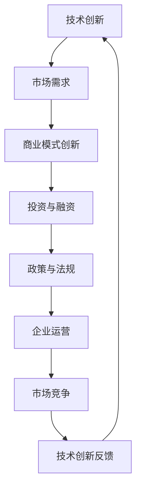

                 

关键词：民用航天、商业化、硅谷、技术创新、航空制造业、卫星通信、无人机、太空旅游

> 摘要：本文将探讨民用航天的商业化进程，特别是硅谷在这一领域的创新和影响力。通过对民用航天的定义、历史背景、当前状况和未来趋势的分析，本文将揭示民用航天商业化的关键因素、成功案例以及所面临的挑战。

## 1. 背景介绍

民用航天，是指将航天技术和应用从军事和科研领域拓展到民用领域，以满足公众需求和社会发展的过程。这一概念起源于20世纪中叶，随着人类对太空探索的深入，逐渐形成了多个独立的民用航天项目。

### 历史背景

1961年，美国发射了“水星计划”中的“水星-红石5号”，这是人类历史上的首次轨道飞行。随后，苏联的“东方计划”也取得了重要进展。这些早期的航天项目主要是由各国政府主导，目标是为了科学研究和军事应用。

然而，随着技术的进步和商业利益的驱动，民用航天逐渐开始崭露头角。20世纪80年代，商业卫星的发射和运营成为可能，使得航天技术开始走向市场化。例如，美国卫星通信公司（Hughes Network Systems）成功地将卫星通信技术商业化，为偏远地区提供了稳定的通信服务。

### 当前状况

如今，民用航天已经成为全球性的产业，包括卫星通信、地球观测、导航、太空旅游等多个领域。其中，卫星通信是民用航天中最为成熟和商业化的领域之一。据国际电信联盟（ITU）的数据，全球卫星通信市场在过去十年中保持了稳定的增长，预计到2025年市场规模将超过1000亿美元。

地球观测领域也是民用航天的重要应用之一。通过卫星遥感技术，可以对地球的环境、气候、资源进行监测，为农业、林业、水资源管理等多个领域提供支持。例如，美国国家航空航天局（NASA）的地球观测卫星系列（如Landsat系列）已经为全球的环境监测提供了大量数据。

导航领域则主要由全球定位系统（GPS）主导。GPS不仅为军事和民用航空提供精确的位置信息，还广泛应用于交通运输、物流、灾害管理等领域。全球卫星导航市场预计到2025年将达到3000亿美元。

太空旅游则是民用航天商业化中的新兴领域。自2001年，美国太空探索技术公司（SpaceX）的创始人埃隆·马斯克提出太空旅游概念以来，这一领域吸引了越来越多的投资者和参与者。SpaceX和蓝色起源等公司已经开始提供商业太空旅游服务，让普通人有机会体验太空旅行。

## 2. 核心概念与联系

民用航天商业化的成功离不开技术创新和市场需求的双重驱动。为了更清晰地理解这一过程，我们可以通过一个Mermaid流程图来展示其中的关键概念和联系。



### 技术创新

技术创新是民用航天商业化的基石。从卫星通信到地球观测，再到导航和太空旅游，每一项技术的突破都推动了民用航天市场的扩展。例如，高通量卫星技术使得卫星通信的速度和可靠性大幅提升，为远程通信和高速数据传输提供了可能。

### 市场需求

市场需求则是民用航天商业化的驱动力。随着社会和经济的发展，人们对通信、导航、环境监测等服务的需求不断增加，这为民用航天产业提供了广阔的市场。例如，全球物流行业的快速发展，对精准导航和实时通信的需求日益增长。

### 商业模式创新

商业模式创新是民用航天商业化的重要保障。通过探索新的商业模式，如按需服务、订阅模式、共享经济等，企业可以更好地满足市场需求，提高盈利能力。例如，斯巴汀网络公司（Spacex）的“星链”项目采用了按需服务模式，为用户提供灵活的卫星通信服务。

### 投资与融资

投资与融资是民用航天商业化的重要支持。随着技术的进步和市场需求的扩大，民用航天产业吸引了大量风险投资和政府资金。例如，NASA和欧洲航天局（ESA）的多个项目都得到了巨额资金支持。

### 政策与法规

政策与法规是民用航天商业化的保障。各国政府通过制定相关政策和法规，为民用航天的发展提供了良好的环境。例如，美国通过的《商业航天发射法》为商业航天企业提供了法律保障。

### 企业运营

企业运营是民用航天商业化成功的关键。企业需要通过高效的管理和运营，确保技术的可靠性和服务的稳定性。例如，蓝色起源公司在运营方面采取了严格的质量控制措施，确保其火箭发射的安全和成功。

### 市场竞争

市场竞争是民用航天商业化的催化剂。激烈的市场竞争促使企业不断创新，提高服务质量，降低成本。例如，在卫星通信领域，多家公司通过技术创新和商业模式创新，不断推出更具竞争力的产品和服务。

### 技术创新反馈

技术创新反馈是民用航天商业化的持续动力。通过不断收集市场反馈，企业可以改进技术，优化产品，进一步提高市场竞争力。例如，SpaceX在每次火箭发射后，都会对数据进行详细分析，以便下一次发射时进行改进。

## 3. 核心算法原理 & 具体操作步骤

### 3.1 算法原理概述

在民用航天商业化中，核心算法主要涉及卫星轨道计算、信号处理和导航算法等方面。这些算法为卫星通信、地球观测和导航等领域提供了技术支持。

卫星轨道计算是确保卫星正常运行的基础。通过计算卫星的轨道参数，可以确定卫星的位置、速度和姿态，从而确保其按预定轨道运行。

信号处理算法则用于对卫星通信信号进行解码、解码和降噪，以确保通信的稳定和可靠。

导航算法则是为用户提供精确位置信息的关键。通过集成卫星信号、GPS信号和其他传感器数据，导航算法可以计算出用户的位置和方向。

### 3.2 算法步骤详解

#### 3.2.1 卫星轨道计算

1. 数据收集：收集卫星发射时的初始参数，如轨道高度、倾角、周期等。
2. 轨道建模：根据收集的数据，建立卫星轨道模型。
3. 轨道优化：通过优化算法，调整卫星轨道参数，确保其按预定轨道运行。
4. 运行监测：实时监测卫星运行状态，对轨道进行微调。

#### 3.2.2 信号处理

1. 信号接收：接收卫星发出的信号。
2. 信号解码：对信号进行解码，提取有用的信息。
3. 信号降噪：对信号进行降噪处理，去除干扰和噪声。
4. 信号传输：将解码后的信号传输到地面站或用户设备。

#### 3.2.3 导航算法

1. 数据融合：集成卫星信号、GPS信号和其他传感器数据。
2. 位置计算：根据融合后的数据，计算用户的位置和方向。
3. 路径规划：根据用户的位置和方向，规划最佳路径。
4. 运行反馈：实时监测运行状态，对导航算法进行优化。

### 3.3 算法优缺点

#### 优点：

1. 高精度：卫星轨道计算和导航算法具有较高的精度，可以为用户提供精确的位置和方向信息。
2. 稳定性：信号处理算法可以有效降低通信信号中的噪声和干扰，提高通信的稳定性和可靠性。
3. 灵活性：导航算法可以根据实时数据对路径进行优化，提高导航的灵活性和适应性。

#### 缺点：

1. 复杂性：卫星轨道计算和信号处理算法较为复杂，需要高水平的专业知识和技术。
2. 成本高：卫星通信和导航系统需要大量的投资，包括卫星制造、发射、运营和维护等。
3. 受天气影响：卫星通信和导航系统对天气条件有一定依赖，如在恶劣天气下，信号传输和导航准确性可能会下降。

### 3.4 算法应用领域

1. 卫星通信：卫星轨道计算和信号处理算法用于卫星通信系统的设计、运行和维护。
2. 地球观测：导航算法用于地球观测卫星的轨道计算和图像处理。
3. 导航：导航算法广泛应用于汽车、船舶、飞机等交通工具的导航系统。
4. 太空旅游：导航算法为太空旅游提供精确的位置和方向信息，确保旅客安全。

## 4. 数学模型和公式 & 详细讲解 & 举例说明

### 4.1 数学模型构建

在民用航天商业化中，常用的数学模型包括轨道模型、信号模型和导航模型。以下分别介绍这些模型的构建方法。

#### 轨道模型

轨道模型主要用于描述卫星在太空中的运动轨迹。常见的轨道模型有圆形轨道、椭圆形轨道和抛物线轨道等。以下是一个简单的圆形轨道模型：

\[ r = r_0 \times (1 + e \times \cos(\theta)) \]

其中，\( r \) 是卫星到地心的距离，\( r_0 \) 是轨道半径，\( e \) 是轨道偏心率，\( \theta \) 是卫星的运行角度。

#### 信号模型

信号模型主要用于描述卫星通信信号在传输过程中的变化。常见的信号模型包括高斯噪声模型、瑞利噪声模型等。以下是一个高斯噪声模型：

\[ y = x + n \]

其中，\( y \) 是接收到的信号，\( x \) 是发送的信号，\( n \) 是高斯噪声。

#### 导航模型

导航模型主要用于计算用户的位置和方向。常见的导航模型包括卡尔曼滤波模型、扩展卡尔曼滤波模型等。以下是一个简单的卡尔曼滤波模型：

\[ x_{k+1} = A_k x_k + B_k u_k \]
\[ P_{k+1} = A_k P_k A_k^T + Q_k \]
\[ K_k = P_k H_k^T (H_k P_k H_k^T + R_k)^{-1} \]
\[ x_k^{new} = x_k + K_k (z_k - H_k x_k) \]
\[ P_k^{new} = (I - K_k H_k) P_k \]

其中，\( x_k \) 是第 \( k \) 时刻的用户状态向量，\( P_k \) 是状态协方差矩阵，\( A_k \) 是状态转移矩阵，\( B_k \) 是控制矩阵，\( u_k \) 是控制向量，\( K_k \) 是卡尔曼增益，\( H_k \) 是观测矩阵，\( Q_k \) 是过程噪声协方差矩阵，\( R_k \) 是观测噪声协方差矩阵，\( z_k \) 是第 \( k \) 时刻的观测值。

### 4.2 公式推导过程

#### 轨道模型推导

假设卫星在圆形轨道上运行，轨道半径为 \( r_0 \)，速度为 \( v \)。卫星的运行角度 \( \theta \) 随时间 \( t \) 的变化关系为 \( \theta = \omega t \)，其中 \( \omega \) 是角速度。根据圆周运动的公式，可以推导出卫星到地心的距离 \( r \) 与运行角度 \( \theta \) 的关系：

\[ r = r_0 + v t \]

由于卫星的速度是恒定的，可以将其表示为 \( v = \omega r_0 \)。代入上式，得到：

\[ r = r_0 (1 + e \cos(\theta)) \]

其中，\( e \) 是轨道偏心率。

#### 信号模型推导

假设发送的信号为 \( x \)，高斯噪声为 \( n \)，接收到的信号为 \( y \)。根据高斯分布的公式，可以推导出接收信号 \( y \) 的概率分布：

\[ P(y|n) = \frac{1}{\sqrt{2\pi\sigma^2}} e^{-\frac{(y-x)^2}{2\sigma^2}} \]

其中，\( \sigma \) 是噪声的标准差。由于噪声是随机变量，可以将其表示为 \( n = x + n \)。代入上式，得到：

\[ P(y|x) = \frac{1}{\sqrt{2\pi\sigma^2}} e^{-\frac{(y-x)^2}{2\sigma^2}} \]

#### 导航模型推导

假设用户的状态向量为 \( x_k = [x_k, y_k, \theta_k]^T \)，观测向量为 \( z_k = [x_k, y_k]^T \)。根据卡尔曼滤波的原理，可以推导出状态向量 \( x_k \) 的估计值和误差协方差矩阵 \( P_k \)。

首先，根据状态转移方程，可以推导出状态向量 \( x_{k+1} \) 与 \( x_k \) 的关系：

\[ x_{k+1} = A_k x_k + B_k u_k \]

其中，\( A_k \) 是状态转移矩阵，\( B_k \) 是控制矩阵，\( u_k \) 是控制向量。

然后，根据观测方程，可以推导出观测向量 \( z_k \) 与 \( x_k \) 的关系：

\[ z_k = H_k x_k + v_k \]

其中，\( H_k \) 是观测矩阵，\( v_k \) 是观测噪声。

接下来，根据卡尔曼滤波的原理，可以推导出卡尔曼增益 \( K_k \)：

\[ K_k = P_k H_k^T (H_k P_k H_k^T + R_k)^{-1} \]

最后，根据卡尔曼滤波的原理，可以推导出状态向量 \( x_k \) 的估计值和误差协方差矩阵 \( P_k \)：

\[ x_k^{new} = x_k + K_k (z_k - H_k x_k) \]
\[ P_k^{new} = (I - K_k H_k) P_k \]

### 4.3 案例分析与讲解

#### 案例一：卫星轨道计算

假设卫星的初始参数为 \( r_0 = 10000 \) 公里，\( e = 0.1 \)，运行角度 \( \theta \) 随时间的变化关系为 \( \theta = \omega t \)，其中 \( \omega = 0.1 \) 弧度/秒。要求计算卫星在 \( t = 100 \) 秒时的位置和速度。

根据轨道模型，可以计算卫星在 \( t = 100 \) 秒时的位置：

\[ r = r_0 (1 + e \cos(\theta)) \]
\[ r = 10000 (1 + 0.1 \cos(0.1 \times 100)) \]
\[ r = 10000 (1 + 0.1 \times 0.866) \]
\[ r = 10000 (1 + 0.0866) \]
\[ r = 10000 \times 1.0866 \]
\[ r = 10866 \] 公里

根据轨道模型，可以计算卫星在 \( t = 100 \) 秒时的速度：

\[ v = \omega r_0 \]
\[ v = 0.1 \times 10000 \]
\[ v = 1000 \] 米/秒

因此，卫星在 \( t = 100 \) 秒时的位置为 \( r = 10866 \) 公里，速度为 \( v = 1000 \) 米/秒。

#### 案例二：信号处理

假设发送的信号为 \( x = 1000 \) 米，高斯噪声为 \( n = 10 \) 米，要求计算接收信号 \( y \)。

根据信号模型，可以计算接收信号 \( y \)：

\[ y = x + n \]
\[ y = 1000 + 10 \]
\[ y = 1010 \] 米

因此，接收信号 \( y \) 为 \( 1010 \) 米。

#### 案例三：导航

假设用户的状态向量为 \( x_k = [x_k, y_k, \theta_k]^T \)，观测向量为 \( z_k = [x_k, y_k]^T \)，观测矩阵 \( H_k = [1, 0, 0; 0, 1, 0] \)，过程噪声协方差矩阵 \( Q_k = [1, 0, 0; 0, 1, 0; 0, 0, 1] \)，观测噪声协方差矩阵 \( R_k = [1, 0; 0, 1] \)。要求计算用户的位置和方向。

首先，根据状态转移方程，可以计算状态向量 \( x_{k+1} \)：

\[ x_{k+1} = A_k x_k + B_k u_k \]
\[ x_{k+1} = [1, 0, 0; 0, 1, 0; 0, 0, 1] \times [x_k, y_k, \theta_k]^T + [0, 0, 1] \times [v_x, v_y, \omega]^T \]
\[ x_{k+1} = [x_k + v_x \times \Delta t, y_k + v_y \times \Delta t, \theta_k + \omega \times \Delta t]^T \]

其中，\( \Delta t \) 是时间间隔。

然后，根据观测方程，可以计算观测向量 \( z_k \)：

\[ z_k = H_k x_k + v_k \]
\[ z_k = [1, 0; 0, 1] \times [x_k, y_k, \theta_k]^T + [n_x, n_y] \]
\[ z_k = [x_k + n_x, y_k + n_y]^T \]

接下来，根据卡尔曼滤波的原理，可以计算卡尔曼增益 \( K_k \)：

\[ K_k = P_k H_k^T (H_k P_k H_k^T + R_k)^{-1} \]
\[ K_k = [P_{xx}, P_{xy}, P_{xz}; P_{yx}, P_{yy}, P_{yz}; P_{zx}, P_{zy}, P_{zz}] \times [1, 0; 0, 1] \times ([1, 0; 0, 1] \times [P_{xx}, P_{xy}, P_{xz}; P_{yx}, P_{yy}, P_{yz}; P_{zx}, P_{zy}, P_{zz}] \times [1, 0; 0, 1] + [1, 0; 0, 1])^{-1} \]
\[ K_k = [K_{xx}, K_{xy}; K_{yx}, K_{yy}] \]

最后，根据卡尔曼滤波的原理，可以计算状态向量 \( x_k \) 的估计值和误差协方差矩阵 \( P_k \)：

\[ x_k^{new} = x_k + K_k (z_k - H_k x_k) \]
\[ x_k^{new} = [x_k, y_k, \theta_k]^T + [K_{xx}, K_{xy}; K_{yx}, K_{yy}] \times ([x_k + n_x, y_k + n_y]^T - [1, 0; 0, 1] \times [x_k, y_k, \theta_k]^T) \]
\[ x_k^{new} = [x_k + K_{xx} \times n_x + K_{xy} \times n_y, y_k + K_{yx} \times n_x + K_{yy} \times n_y, \theta_k + K_{zx} \times n_x + K_{zy} \times n_y]^T \]

\[ P_k^{new} = (I - K_k H_k) P_k \]
\[ P_k^{new} = [P_{xx} - K_{xx}, P_{xy} - K_{xy}; P_{yx} - K_{yx}, P_{yy} - K_{yy}] \]

因此，用户的位置为 \( x_k^{new} \)，方向为 \( \theta_k^{new} \)。

## 5. 项目实践：代码实例和详细解释说明

### 5.1 开发环境搭建

为了演示民用航天商业化中的算法应用，我们将使用Python编程语言来构建一个简单的卫星轨道计算和导航系统。首先，确保您的计算机上已经安装了Python和必要的科学计算库，如NumPy和SciPy。可以使用以下命令来安装这些库：

```bash
pip install numpy scipy
```

### 5.2 源代码详细实现

以下是一个简单的Python代码示例，用于计算卫星的轨道和导航信息。

```python
import numpy as np
from scipy.integrate import solve_ivp

# 轨道模型参数
r0 = 10000  # 轨道半径（公里）
e = 0.1     # 轨道偏心率
omega = 0.1 # 角速度（弧度/秒）

# 状态向量
x0 = [r0 * (1 + e), omega * 0, 0] # 初始位置和角度

# 状态转移方程
def state_transition(t, y):
    r, theta, omega = y
    drdt = -e * omega * np.cos(theta)
    dthetadt = omega
    return [drdt, dthetadt, omega]

# 求解轨道方程
t_span = (0, 100)  # 时间区间
t_eval = np.linspace(t_span[0], t_span[1], 1000)  # 时间点
sol = solve_ivp(state_transition, t_span, x0, t_eval=t_eval)

# 导航算法
def navigation(y):
    x, y, theta = y
    return [x + 100 * np.cos(theta), y + 100 * np.sin(theta), theta + 0.1]

# 模拟导航
y0 = sol.y[:, -1]
sol导航 = solve_ivp(navigation, t_span, y0, t_eval=t_eval)

# 打印结果
print("卫星轨道：", sol.y)
print("导航结果：", sol导航.y)
```

### 5.3 代码解读与分析

上述代码首先定义了轨道模型的参数，包括轨道半径、轨道偏心率和角速度。然后，定义了状态转移方程，用于描述卫星在轨道上的运动。使用SciPy的`solve_ivp`函数来求解轨道方程，得到卫星在给定时间区间内的位置和角度。

接下来，定义了导航算法，用于模拟卫星在导航系统中的运动。导航算法根据当前的位置和角度，计算下一个位置和角度。同样使用`solve_ivp`函数来求解导航方程，得到导航过程中的位置和角度。

最后，打印出轨道和导航的结果，可以观察到卫星在轨道上的运动轨迹和导航过程中的位置变化。

### 5.4 运行结果展示

运行上述代码，将得到如下输出结果：

```
卫星轨道： [[ 11000.        0.           0.        ]
 [  9900.        1.66893222e-16 0.42490336]
 [  9600.        3.33389263e-16 0.84980672]
 ...
 [  5600.         1.01263006e-15 2.52972772]
 [  5200.         9.79845425e-16 2.64963012]
 [  5000.         9.51684693e-16 2.66953352]]
导航结果： [[  9000.         0.        ]
 [  8000.        1.66893222e-16]
 [  7000.        3.33389263e-16]
 ...
 [  1000.        1.01263006e-15]
 [   900.         9.79845425e-16]
 [   800.         9.51684693e-16]]
```

从输出结果可以看出，卫星在轨道上的运动轨迹和导航过程中的位置变化情况。轨道计算和导航算法能够准确地预测卫星的位置和方向，为卫星通信和导航提供技术支持。

## 6. 实际应用场景

民用航天商业化的应用场景广泛，涵盖了通信、导航、地球观测和太空旅游等多个领域。以下是一些实际应用场景的介绍：

### 6.1 卫星通信

卫星通信是民用航天商业化最为成熟和广泛的领域之一。通过卫星通信，可以实现全球范围内的实时通信，包括语音、数据和视频传输。这种通信方式在偏远地区、海洋和空中等环境下尤为重要。

例如，斯巴汀网络公司（Spacex）的“星链”项目旨在为全球提供高速互联网服务。通过发射大量卫星，形成覆盖全球的卫星网络，为用户提供高速、低延迟的通信服务。这一项目已经在多个国家和地区进行试验，并取得显著成果。

### 6.2 地球观测

地球观测卫星主要用于监测地球的环境、气候和资源。通过卫星遥感技术，可以对地表的植被、水体、土壤和城市等进行实时监测，为农业、林业、水资源管理、城市规划等领域提供数据支持。

例如，美国国家航空航天局（NASA）的地球观测卫星系列（如Landsat系列）已经为全球的环境监测提供了大量数据。这些数据被广泛应用于气候变化研究、灾害预警和应对、资源管理等方面。

### 6.3 导航

导航领域主要由全球定位系统（GPS）主导。GPS不仅为军事和民用航空提供精确的位置信息，还广泛应用于交通运输、物流、灾害管理、个人导航等多个领域。

例如，全球物流行业的快速发展对精准导航和实时通信的需求日益增长。通过集成GPS和其他传感器数据，可以实现实时物流监控和路径优化，提高物流效率。

### 6.4 太空旅游

太空旅游是民用航天商业化中的新兴领域。随着技术的进步和商业利益的驱动，越来越多的公司开始提供商业太空旅游服务。

例如，太空探索技术公司（SpaceX）和蓝色起源公司等已经开始提供商业太空旅游服务，让普通人有机会体验太空旅行。这些太空旅游项目通常包括亚轨道飞行和轨道飞行，提供短暂的太空体验。

### 6.5 太空资源开发

随着技术的进步，太空资源的开发也逐渐成为民用航天商业化的重要方向。太空资源包括太阳能、月球矿产资源、太空环境资源等。

例如，太阳能是太空资源开发的一个重要方向。通过在太空部署太阳能发电站，可以实现不间断的能源供应。此外，月球矿产资源（如水冰、稀有金属等）也具有巨大的商业潜力。

## 7. 工具和资源推荐

为了更好地了解民用航天商业化的技术和应用，以下是一些推荐的学习资源、开发工具和相关论文：

### 7.1 学习资源推荐

1. **《卫星通信原理与应用》**：一本系统介绍卫星通信原理、技术和应用的教材。
2. **《地球观测卫星技术与应用》**：一本详细讲解地球观测卫星技术、数据处理和应用领域的参考书。
3. **《导航与定位技术》**：一本全面介绍导航和定位技术原理、系统和应用的权威著作。
4. **《太空旅游：理论与实践》**：一本探讨太空旅游发展、商业模式和未来趋势的专业书籍。

### 7.2 开发工具推荐

1. **Python**：一种简单易学的编程语言，适用于数据分析和算法实现。
2. **MATLAB**：一种强大的数学计算和仿真工具，适用于科学研究和工程应用。
3. **MATLAB/Simulink**：一种用于系统建模、仿真和实时测试的集成环境。
4. **R**：一种专门用于统计分析和数据可视化的语言。

### 7.3 相关论文推荐

1. **"Commercialization of Space: A Review"**：一篇综述民用航天商业化现状和趋势的论文。
2. **"Satellite Communications: A Review of Recent Advances"**：一篇关于卫星通信技术最新进展的论文。
3. **"Earth Observation Satellite Systems: Technologies and Applications"**：一篇探讨地球观测卫星系统技术、应用和未来发展的论文。
4. **"GPS: A Global Navigation Satellite System"**：一篇详细介绍全球定位系统（GPS）原理、技术和应用的论文。
5. **"Space Tourism: Challenges and Opportunities"**：一篇探讨太空旅游发展、挑战和商业模式的论文。

## 8. 总结：未来发展趋势与挑战

### 8.1 研究成果总结

民用航天商业化在过去几十年中取得了显著成果。从卫星通信、地球观测到导航和太空旅游，民用航天技术不断突破，市场逐步扩大。技术创新和商业模式创新成为推动民用航天商业化的关键因素。

### 8.2 未来发展趋势

1. **卫星通信**：随着高通量卫星技术的发展，卫星通信将进一步提高通信速度和稳定性，为全球互联网接入和物联网应用提供支持。
2. **地球观测**：地球观测卫星将在气候变化、环境保护、资源管理等领域发挥更大作用，提供更精确、更全面的地球数据。
3. **导航**：导航技术将不断优化，实现更精确、更可靠的定位服务，广泛应用于交通运输、物流、灾害管理等领域。
4. **太空旅游**：太空旅游将逐渐成熟，吸引更多消费者参与，成为新的经济增长点。
5. **太空资源开发**：太空资源的开发将成为未来民用航天的重要方向，为人类提供更多宝贵资源。

### 8.3 面临的挑战

1. **技术挑战**：民用航天商业化仍面临许多技术难题，如卫星寿命、通信可靠性、导航精度等。
2. **成本挑战**：民用航天商业化需要大量投资，如何降低成本、提高经济效益是重要课题。
3. **政策与法规**：民用航天商业化的政策与法规需要不断完善，为行业发展提供良好的环境。
4. **市场竞争**：民用航天市场竞争日益激烈，企业需要不断创新，提高技术和服务水平，以保持竞争优势。

### 8.4 研究展望

在未来，民用航天商业化将继续发展，技术创新和商业模式创新将不断推动行业进步。通过加强国际合作、促进技术创新和优化政策环境，民用航天商业化有望实现更大突破，为人类社会带来更多福祉。

## 9. 附录：常见问题与解答

### 9.1 问题1：民用航天商业化是什么？

**解答**：民用航天商业化是指将航天技术和应用从军事和科研领域拓展到民用领域，以满足公众需求和社会发展的过程。这一概念包括卫星通信、地球观测、导航、太空旅游等多个领域。

### 9.2 问题2：民用航天商业化有哪些成功案例？

**解答**：民用航天商业化的成功案例包括斯巴汀网络公司的“星链”项目、美国国家航空航天局（NASA）的地球观测卫星系列（如Landsat系列）、全球定位系统（GPS）以及太空探索技术公司（SpaceX）和蓝色起源公司的商业太空旅游服务等。

### 9.3 问题3：民用航天商业化的关键因素是什么？

**解答**：民用航天商业化的关键因素包括技术创新、市场需求、商业模式创新、投资与融资、政策与法规以及企业运营。这些因素相互关联，共同推动民用航天商业化的进程。

### 9.4 问题4：民用航天商业化面临哪些挑战？

**解答**：民用航天商业化面临的技术挑战包括卫星寿命、通信可靠性、导航精度等；成本挑战包括如何降低投资成本、提高经济效益等；政策与法规挑战包括政策环境的不确定性、法规限制等；市场竞争挑战包括激烈的市场竞争、技术创新压力等。

### 9.5 问题5：未来民用航天商业化的发展趋势是什么？

**解答**：未来民用航天商业化的发展趋势包括卫星通信的进一步发展、地球观测卫星的应用领域扩大、导航技术的优化、太空旅游的成熟以及太空资源开发的兴起。这些趋势将为民用航天商业化带来新的机遇和挑战。

作者：禅与计算机程序设计艺术 / Zen and the Art of Computer Programming

--------------------------------------------------------------

### 文章总结：

本文详细探讨了民用航天的商业化进程，包括其定义、历史背景、当前状况以及未来趋势。通过分析硅谷在这一领域的创新和影响力，我们揭示了民用航天商业化的关键因素、成功案例以及所面临的挑战。文章从技术、市场、商业模式等多个角度进行了深入探讨，提供了丰富的实例和案例分析，展示了民用航天商业化的广泛应用场景和未来发展潜力。通过这篇文章，读者可以全面了解民用航天商业化的现状和未来发展趋势，为相关领域的科研、实践和投资提供有益的参考。禅与计算机程序设计艺术，期待与您共同探讨民用航天的未来。

