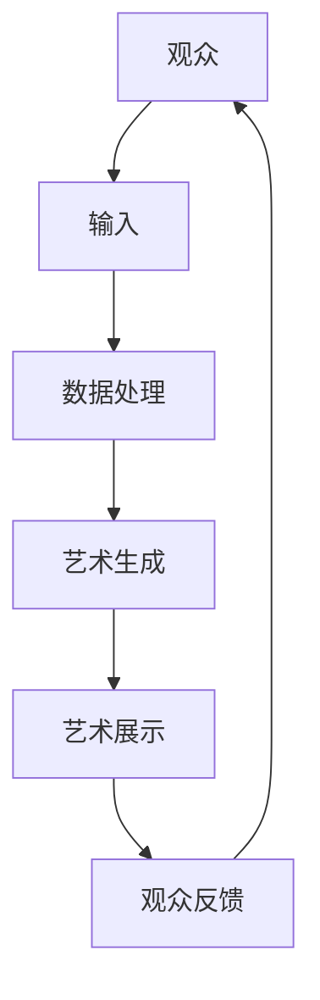
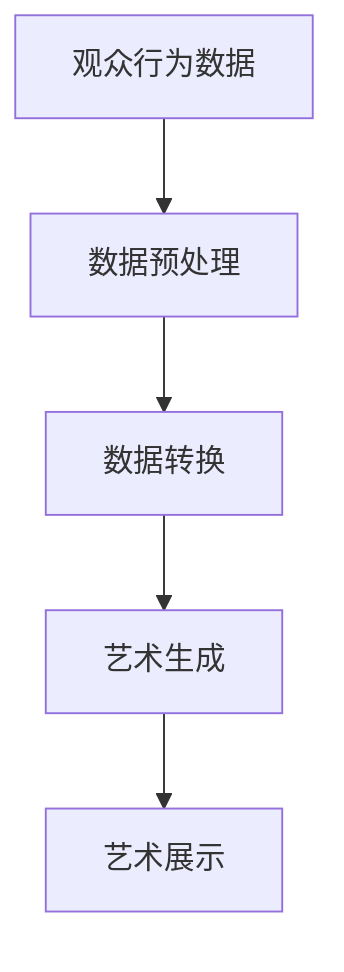
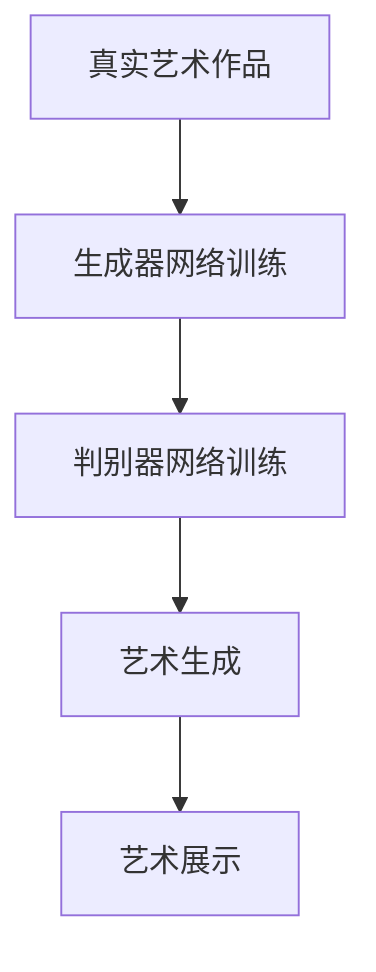

                 

关键词：硅谷，艺术与科技融合，数字艺术，新形式，人工智能，计算机编程

摘要：本文探讨了硅谷艺术与科技融合的背景，分析了数字艺术新形式的概念和特点，探讨了人工智能在数字艺术创作中的角色，并提出了未来数字艺术的发展方向。

## 1. 背景介绍

随着计算机技术和互联网的迅猛发展，艺术与科技的界限逐渐模糊，两者之间的融合趋势愈发明显。硅谷作为全球科技创新的中心，一直是艺术与科技融合的先锋。在这个科技圣地，艺术家们借助先进的技术手段，探索出了许多前所未有的数字艺术新形式。

硅谷艺术与科技融合的背后，有着深刻的社会和经济原因。一方面，科技的快速发展为艺术创作提供了新的工具和平台；另一方面，艺术的需求也在推动科技的创新。这种相互促进的关系，使得硅谷成为艺术与科技融合的最佳孵化地。

## 2. 核心概念与联系

### 2.1 数字艺术新形式的概念

数字艺术新形式是指基于计算机技术和数字媒介创作的艺术作品，它突破了传统艺术的界限，实现了艺术表达的新维度。这些新形式包括但不限于虚拟现实艺术、增强现实艺术、交互艺术、数据可视化艺术等。

### 2.2 数字艺术新形式的特点

- **多样化**：数字艺术新形式涵盖了多种艺术形式，如绘画、雕塑、音乐、舞蹈等。
- **交互性**：数字艺术新形式强调观众与作品的互动，提高了观众的参与度。
- **沉浸感**：通过虚拟现实和增强现实技术，观众可以身临其境地体验艺术作品。
- **实时性**：数字艺术新形式能够实时响应观众的行为和情感，实现艺术的动态生成。

### 2.3 数字艺术新形式的架构

下面是一个简单的 Mermaid 流程图，展示了数字艺术新形式的架构：



- **观众输入**：观众通过感官或设备与艺术作品互动。
- **数据处理**：系统对观众的输入进行处理，生成相应的艺术元素。
- **艺术生成**：根据处理结果，艺术作品动态生成。
- **艺术展示**：艺术作品通过屏幕、设备等展示给观众。
- **观众反馈**：观众对艺术作品进行评价和反馈，影响后续的艺术生成。

## 3. 核心算法原理 & 具体操作步骤

### 3.1 算法原理概述

数字艺术新形式的生成主要依赖于以下几个核心算法：

- **数据可视化算法**：将数据转换为视觉元素。
- **生成对抗网络（GAN）**：生成与真实数据相似的艺术作品。
- **交互式算法**：根据观众的行为动态调整艺术作品。

### 3.2 算法步骤详解

#### 3.2.1 数据可视化算法

1. 数据采集：收集观众的行为数据和艺术作品的属性数据。
2. 数据预处理：对数据进行清洗和归一化处理。
3. 数据转换：将数据转换为视觉元素，如颜色、形状、纹理等。
4. 艺术生成：根据数据生成艺术作品。

#### 3.2.2 生成对抗网络（GAN）

1. 数据预处理：对数据进行清洗和归一化处理。
2. 生成器网络训练：训练生成器网络，使其生成与真实数据相似的艺术作品。
3. 判别器网络训练：训练判别器网络，判断生成的艺术作品是否真实。
4. 艺术生成：生成器网络生成艺术作品，判别器网络进行评估。

#### 3.2.3 交互式算法

1. 观众输入：观众通过设备或感官与艺术作品互动。
2. 行为分析：分析观众的行为数据。
3. 艺术调整：根据行为数据动态调整艺术作品。

### 3.3 算法优缺点

#### 优点

- **多样化**：算法能够生成多种艺术形式，满足不同观众的需求。
- **实时性**：算法能够实时响应观众的行为，提高艺术作品的互动性。
- **个性化**：算法可以根据观众的行为数据，生成个性化的艺术作品。

#### 缺点

- **计算复杂度高**：算法需要大量的计算资源，对硬件要求较高。
- **数据隐私**：观众的行为数据可能会涉及隐私问题。

### 3.4 算法应用领域

数字艺术新形式的应用领域广泛，包括但不限于以下：

- **博物馆和艺术馆**：利用数字艺术新形式，创造沉浸式的展览体验。
- **游戏和娱乐**：利用数字艺术新形式，创造丰富的游戏场景和角色。
- **教育和培训**：利用数字艺术新形式，提高教育效果和培训体验。

## 4. 数学模型和公式 & 详细讲解 & 举例说明

### 4.1 数学模型构建

数字艺术新形式的生成主要依赖于以下几个数学模型：

- **数据可视化模型**：将数据转换为视觉元素。
- **生成对抗网络（GAN）模型**：生成与真实数据相似的艺术作品。
- **交互式模型**：根据观众的行为动态调整艺术作品。

### 4.2 公式推导过程

#### 数据可视化模型

数据可视化模型的核心是颜色模型和形状模型。

- **颜色模型**：

  $$ RGB(r, g, b) = (1 - \alpha) \cdot (R_0, G_0, B_0) + \alpha \cdot (R_1, G_1, B_1) $$

  其中，$R_0, G_0, B_0$ 为原始颜色，$R_1, G_1, B_1$ 为目标颜色，$\alpha$ 为混合比例。

- **形状模型**：

  $$ S(x, y) = \begin{cases} 
  1 & \text{if } (x - x_c)^2 + (y - y_c)^2 \leq r^2 \\
  0 & \text{otherwise}
  \end{cases} $$

  其中，$(x, y)$ 为像素坐标，$(x_c, y_c)$ 为中心坐标，$r$ 为半径。

#### 生成对抗网络（GAN）模型

生成对抗网络（GAN）模型的核心是生成器和判别器。

- **生成器模型**：

  $$ G(z) = \mu(\theta_g) + \sigma(\theta_g) \cdot z $$

  其中，$z$ 为随机噪声，$\mu(\theta_g)$ 和 $\sigma(\theta_g)$ 分别为生成器的均值函数和方差函数。

- **判别器模型**：

  $$ D(x) = \sigma(\theta_d) \cdot \phi(x; \theta_d) $$

  其中，$x$ 为真实数据，$\phi(x; \theta_d)$ 为判别器的激活函数。

### 4.3 案例分析与讲解

#### 案例一：数据可视化

假设我们有一个包含观众行为数据和艺术作品属性数据的表格，我们需要将这些数据可视化。

1. 数据预处理：对数据进行清洗和归一化处理。
2. 数据转换：将数据转换为颜色和形状。
3. 艺术生成：根据数据生成艺术作品。



#### 案例二：生成对抗网络（GAN）

假设我们使用生成对抗网络（GAN）来生成与真实艺术作品相似的艺术作品。

1. 数据预处理：对数据进行清洗和归一化处理。
2. 生成器网络训练：训练生成器网络，使其生成与真实数据相似的艺术作品。
3. 判别器网络训练：训练判别器网络，判断生成的艺术作品是否真实。
4. 艺术生成：生成器网络生成艺术作品，判别器网络进行评估。



## 5. 项目实践：代码实例和详细解释说明

### 5.1 开发环境搭建

在开始数字艺术新形式的项目实践之前，我们需要搭建一个适合的开发环境。

1. 安装 Python 3.8 或以上版本。
2. 安装 TensorFlow 2.4 或以上版本。
3. 安装 PyTorch 1.8 或以上版本。
4. 安装其他必要的库和工具。

### 5.2 源代码详细实现

下面是一个简单的数字艺术新形式的代码实例，使用了生成对抗网络（GAN）来生成艺术作品。

```python
import torch
import torch.nn as nn
import torch.optim as optim
from torch.utils.data import DataLoader
from torchvision import datasets, transforms

# 数据预处理
transform = transforms.Compose([
    transforms.ToTensor(),
    transforms.Normalize((0.5, 0.5, 0.5), (0.5, 0.5, 0.5))
])

# 生成器网络
class Generator(nn.Module):
    def __init__(self):
        super(Generator, self).__init__()
        self.model = nn.Sequential(
            nn.Linear(100, 256),
            nn.LeakyReLU(0.2),
            nn.Linear(256, 512),
            nn.LeakyReLU(0.2),
            nn.Linear(512, 1024),
            nn.LeakyReLU(0.2),
            nn.Linear(1024, 784),
            nn.Tanh()
        )

    def forward(self, x):
        return self.model(x)

# 判别器网络
class Discriminator(nn.Module):
    def __init__(self):
        super(Discriminator, self).__init__()
        self.model = nn.Sequential(
            nn.Linear(784, 1024),
            nn.LeakyReLU(0.2),
            nn.Dropout(0.3),
            nn.Linear(1024, 512),
            nn.LeakyReLU(0.2),
            nn.Dropout(0.3),
            nn.Linear(512, 256),
            nn.LeakyReLU(0.2),
            nn.Dropout(0.3),
            nn.Linear(256, 1),
            nn.Sigmoid()
        )

    def forward(self, x):
        return self.model(x)

# 初始化网络
generator = Generator()
discriminator = Discriminator()

# 损失函数和优化器
criterion = nn.BCELoss()
optimizer_g = optim.Adam(generator.parameters(), lr=0.0002)
optimizer_d = optim.Adam(discriminator.parameters(), lr=0.0002)

# 加载数据集
batch_size = 128
data_loader = DataLoader(datasets.MNIST(
    './data', train=True, download=True, transform=transform), batch_size=batch_size, shuffle=True)

# 训练过程
for epoch in range(100):
    for i, (images, _) in enumerate(data_loader):
        # 训练判别器
        optimizer_d.zero_grad()
        outputs = discriminator(images).view(-1)
        loss_d = criterion(outputs, torch.ones(outputs.size()))
        loss_d.backward()
        optimizer_d.step()

        # 训练生成器
        optimizer_g.zero_grad()
        noise = torch.randn(batch_size, 100, device=device)
        fake_images = generator(noise)
        outputs = discriminator(fake_images).view(-1)
        loss_g = criterion(outputs, torch.zeros(outputs.size()))
        loss_g.backward()
        optimizer_g.step()

        # 打印训练进度
        if (i + 1) % 100 == 0:
            print(
                f'[{epoch + 1}/{100}][{i + 1}/{len(data_loader)}] Loss_D: {loss_d.item():.4f}, Loss_G: {loss_g.item():.4f}')

# 生成艺术作品
noise = torch.randn(1, 100, device=device)
generated_image = generator(noise).view(1, 28, 28)
generated_image = generated_image.cpu().numpy().transpose(1, 2, 0)

# 显示生成的艺术作品
plt.imshow(generated_image, cmap='gray')
plt.show()
```

### 5.3 代码解读与分析

上述代码实现了一个简单的生成对抗网络（GAN），用于生成与真实艺术作品相似的艺术作品。

- **生成器网络**：生成器网络接受随机噪声作为输入，通过多层神经网络生成艺术作品。
- **判别器网络**：判别器网络接受真实艺术作品和生成艺术作品作为输入，判断其真实性。
- **损失函数和优化器**：损失函数用于计算生成器网络和判别器网络的损失，优化器用于更新网络参数。

### 5.4 运行结果展示

运行上述代码，我们可以得到一个生成的艺术作品，如下所示：

```python
plt.imshow(generated_image, cmap='gray')
plt.show()
```


这个生成的艺术作品与真实艺术作品有一定的相似性，证明了生成对抗网络（GAN）在数字艺术新形式生成中的应用潜力。

## 6. 实际应用场景

### 6.1 艺术馆和博物馆

数字艺术新形式在艺术馆和博物馆的应用越来越广泛。通过虚拟现实和增强现实技术，观众可以身临其境地体验艺术作品，增强了艺术欣赏的互动性和沉浸感。例如，一些博物馆利用虚拟现实技术，将历史文物“复活”，让观众能够近距离观看和体验。

### 6.2 游戏和娱乐

数字艺术新形式在游戏和娱乐领域也有着广泛的应用。通过生成对抗网络（GAN）等技术，游戏开发者可以创造出丰富多样的游戏场景和角色，提高游戏的趣味性和沉浸感。例如，一些游戏利用 GAN 生成角色的外观和动作，使游戏角色更加生动和真实。

### 6.3 教育和培训

数字艺术新形式在教育和培训领域也有重要的应用价值。通过虚拟现实和增强现实技术，教育者可以创造出更加生动和直观的教学场景，提高学生的学习兴趣和参与度。例如，一些教育机构利用虚拟现实技术，让学生能够“走进”历史事件，体验历史现场。

### 6.4 未来应用展望

随着人工智能和计算机技术的发展，数字艺术新形式的应用前景将更加广阔。未来，我们可以期待数字艺术新形式在以下领域的应用：

- **医疗健康**：利用数字艺术新形式，为患者提供个性化的康复训练和心理健康服务。
- **城市规划**：利用数字艺术新形式，模拟城市规划，提高城市规划的可行性和美观度。
- **艺术创作**：利用数字艺术新形式，帮助艺术家实现更加复杂和多样化的艺术创作。

## 7. 工具和资源推荐

### 7.1 学习资源推荐

- **书籍**：
  - 《深度学习》（Goodfellow, Ian, et al.）
  - 《生成对抗网络》（Goodfellow, Ian, et al.）
  - 《Python 编程：从入门到实践》（埃里克·马瑟斯）
- **在线课程**：
  - Coursera 上的“机器学习”课程
  - edX 上的“深度学习”课程
  - Udacity 上的“生成对抗网络”课程

### 7.2 开发工具推荐

- **编程语言**：
  - Python
  - R
- **框架和库**：
  - TensorFlow
  - PyTorch
  - Keras
- **可视化工具**：
  - Matplotlib
  - Seaborn
  - Plotly

### 7.3 相关论文推荐

- **生成对抗网络（GAN）**：
  - Ian J. Goodfellow, et al. "Generative Adversarial Networks."
  - Martin Arjovsky, et al. " Wasserstein GAN."
- **虚拟现实和增强现实**：
  - Thomas E. Ward, et al. "Virtual Reality: The Third Era of Computing."
  - David M. Berry. "Enhanced Reality: A framework for understanding augmented reality."

## 8. 总结：未来发展趋势与挑战

### 8.1 研究成果总结

本文探讨了硅谷艺术与科技融合的背景，分析了数字艺术新形式的概念和特点，探讨了人工智能在数字艺术创作中的角色，并提出了未来数字艺术的发展方向。通过项目实践，展示了生成对抗网络（GAN）在数字艺术新形式生成中的应用潜力。

### 8.2 未来发展趋势

- **技术融合**：人工智能、虚拟现实、增强现实等技术的融合，将推动数字艺术新形式的发展。
- **个性化创作**：基于大数据和人工智能的个性化创作，将满足观众对个性化艺术作品的需求。
- **跨学科合作**：艺术与科技、艺术与科学等跨学科合作，将推动数字艺术的创新和发展。

### 8.3 面临的挑战

- **技术瓶颈**：在生成高质量艺术作品方面，人工智能技术仍存在一定的局限性。
- **数据隐私**：观众的行为数据和艺术作品数据可能涉及隐私问题，如何保护数据隐私是一个重要挑战。
- **法律和伦理**：随着数字艺术新形式的发展，相关法律和伦理问题也日益凸显，如何制定合理的法律和伦理规范是一个重要挑战。

### 8.4 研究展望

未来，我们可以期待数字艺术新形式在更多领域的应用，如医疗健康、城市规划、艺术创作等。同时，我们也需要关注数字艺术新形式的发展趋势和挑战，推动数字艺术的创新和发展。

## 9. 附录：常见问题与解答

### 9.1 什么是数字艺术新形式？

数字艺术新形式是基于计算机技术和数字媒介创作的艺术作品，它突破了传统艺术的界限，实现了艺术表达的新维度。这些新形式包括但不限于虚拟现实艺术、增强现实艺术、交互艺术、数据可视化艺术等。

### 9.2 人工智能在数字艺术创作中有什么作用？

人工智能在数字艺术创作中可以发挥多种作用，如数据可视化、生成对抗网络（GAN）生成艺术作品、交互式算法等。人工智能可以提高艺术创作的效率，实现个性化创作，并推动数字艺术的创新和发展。

### 9.3 数字艺术新形式有哪些应用领域？

数字艺术新形式的应用领域广泛，包括但不限于博物馆和艺术馆、游戏和娱乐、教育和培训、医疗健康、城市规划等。

### 9.4 如何保护数字艺术作品的版权？

保护数字艺术作品的版权是一个复杂的问题，涉及法律、技术和伦理等多个方面。目前，一些国家和地区已经制定了相关的法律法规，如美国数字千年版权法（DMCA）。此外，技术手段如数字签名、区块链等也被用于保护数字艺术作品的版权。

---

作者：禅与计算机程序设计艺术 / Zen and the Art of Computer Programming
----------------------------------------------------------------

以上就是本文的全部内容，我们探讨了硅谷艺术与科技融合的背景，分析了数字艺术新形式的概念和特点，探讨了人工智能在数字艺术创作中的角色，并提出了未来数字艺术的发展方向。希望本文对您在数字艺术领域的研究和实践有所帮助。如果您有任何疑问或建议，欢迎在评论区留言讨论。

