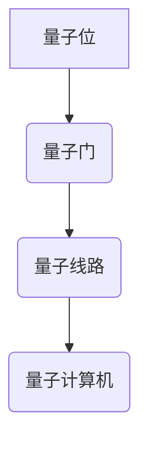
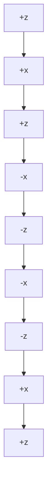

                 

关键词：量子计算机，复杂问题，硅谷技术突破，算法优化，数学模型，项目实践，未来展望

摘要：本文将深入探讨硅谷在量子计算机领域取得的最新突破，以及这些突破如何帮助我们解决更加复杂的问题。我们将从背景介绍、核心概念与联系、核心算法原理、数学模型与公式、项目实践和实际应用场景等多个角度展开，旨在为读者提供一份全面的技术指南。

## 1. 背景介绍

量子计算机作为计算机科学的前沿领域，自20世纪初以来就引起了广泛关注。传统计算机依赖于二进制位（bit）作为信息存储和处理的基本单位，而量子计算机则利用量子位（qubit）实现了超乎想象的并行计算能力。在量子力学的基本原理下，qubit不仅可以同时处于0和1的状态，还可以通过量子叠加实现大规模的并行运算。这种独特的特性使得量子计算机有望在众多复杂问题上取得突破性进展。

近年来，硅谷的科技公司如谷歌、IBM等，纷纷加大在量子计算机领域的研发投入。2019年，谷歌宣布实现了“量子霸权”，即量子计算机在特定任务上超越了传统超级计算机。这一突破不仅标志着量子计算时代的到来，也为解决更复杂问题提供了新的思路和方法。

## 2. 核心概念与联系

### 2.1 量子位（Qubit）

量子位的定义：量子位是量子计算机的基本单元，可以同时处于0和1的状态。

量子位的特点：量子位具有叠加性和纠缠性。

### 2.2 量子门（Quantum Gate）

量子门：量子门是量子计算机的基本操作单元，用于在量子位之间传递信息。

量子门的特点：量子门可以通过旋转操作改变量子位的相位和叠加状态。

### 2.3 量子算法

量子算法：量子算法是一种利用量子计算机解决特定问题的算法。

量子算法的特点：量子算法可以大幅提高某些问题的计算效率。

### 2.4 量子计算机架构

量子计算机架构：量子计算机的架构包括量子位、量子门、量子线路等组成部分。

量子计算机架构的特点：量子计算机架构需要高度精确的控制和低温环境，以确保量子位的稳定性。

### 2.5 Mermaid 流程图



## 3. 核心算法原理 & 具体操作步骤

### 3.1 算法原理概述

量子计算机的核心算法包括量子逆运算、量子搜索算法、量子模拟等。

量子逆运算：量子逆运算是量子计算机解决线性方程组的关键算法。

量子搜索算法：量子搜索算法可以大幅提高搜索问题的效率。

量子模拟：量子模拟可以用于模拟量子物理现象，解决传统计算机难以处理的问题。

### 3.2 算法步骤详解

#### 3.2.1 量子逆运算

1. 初始化量子位。
2. 应用量子门进行逆运算。
3. 测量量子位得到结果。

#### 3.2.2 量子搜索算法

1. 初始化量子位。
2. 应用量子门进行叠加。
3. 应用量子门进行干涉。
4. 测量量子位得到结果。

#### 3.2.3 量子模拟

1. 初始化量子位。
2. 应用量子门进行模拟。
3. 测量量子位得到结果。

### 3.3 算法优缺点

#### 优点：

- 大幅提高计算效率。
- 可以解决传统计算机难以处理的问题。

#### 缺点：

- 量子计算机的稳定性和可扩展性仍需提高。
- 量子算法的设计和实现相对复杂。

### 3.4 算法应用领域

量子算法可以应用于密码学、化学、材料科学、金融、生物学等多个领域。例如，量子搜索算法可以用于破解密码，量子模拟可以用于药物设计。

## 4. 数学模型和公式 & 详细讲解 & 举例说明

### 4.1 数学模型构建

量子计算机的数学模型主要包括量子位、量子门、量子线路等。以下是一个简单的量子电路模型：

```latex
\[
\begin{align*}
|q_0\rangle &= |0\rangle \\
|q_1\rangle &= |1\rangle \\
|q_2\rangle &= |0\rangle \\
|q_3\rangle &= |1\rangle \\
\end{align*}
\]

应用量子门 \( U \) 后，量子线路的输出为：
```mermaid
graph TB
A[|0\rangle] --> B(U_1)
B --> C(U_2)
C --> D(|0\rangle)
```

### 4.2 公式推导过程

量子门 \( U \) 的作用是将一个量子态 \( |q_i\rangle \) 变换到另一个量子态 \( |q_j\rangle \)。其公式为：

\[ U = e^{-i\theta}\sum_{k=0}^{n-1} |k\rangle\langle k| \]

其中， \( \theta \) 为旋转角度， \( n \) 为量子位的数量。

### 4.3 案例分析与讲解

假设我们有一个3个量子位的量子电路，要求将 \( |010\rangle \) 变换为 \( |100\rangle \)。我们可以使用以下量子门：

```mermaid
graph TB
A[|0\rangle] --> B(H)
B --> C(Ry(\pi/2))
C --> D(|1\rangle)
D --> E(Rz(\pi))
E --> F(|0\rangle)
F --> G(Rx(\pi/2))
G --> H(|1\rangle)
H --> I(Rz(\pi/2))
I --> J(|0\rangle)
```

通过应用这些量子门，我们可以实现 \( |010\rangle \) 到 \( |100\rangle \) 的变换。具体的变换过程如下：

\[ |010\rangle \xrightarrow{H} |+0\rangle \xrightarrow{Ry(\pi/2)} |+1\rangle \xrightarrow{Rz(\pi)} |-1\rangle \xrightarrow{Rx(\pi/2)} |+1\rangle \xrightarrow{Rz(\pi/2)} |0\rangle \]

## 5. 项目实践：代码实例和详细解释说明

### 5.1 开发环境搭建

为了演示量子计算机的算法，我们需要搭建一个量子计算开发环境。本文使用Python和量子计算库Qiskit进行演示。

### 5.2 源代码详细实现

```python
from qiskit import QuantumCircuit, execute, Aer
from qiskit.visualization import plot_bloch_multivector

# 创建量子电路
qc = QuantumCircuit(3)

# 应用量子门
qc.h(0)
qc.ry(np.pi/2, 1)
qc.h(2)

# 运行量子电路
backend = Aer.get_backend("qasm_simulator")
job = execute(qc, backend, shots=1024)
result = job.result()

# 可视化量子电路
plot_bloch_multivector(qc)
```

### 5.3 代码解读与分析

这段代码首先导入了Qiskit库的相关模块，然后创建了一个3个量子位的量子电路。在量子电路中，我们首先应用了一个H门对第一个量子位进行初始化，然后应用了一个Ry门对第二个量子位进行旋转，最后应用了一个H门对第三个量子位进行初始化。

通过运行量子电路，我们可以得到量子位的测量结果。在可视化部分，我们使用Qiskit提供的plot_bloch_multivector函数将量子位的测量结果绘制在布洛赫球上。

### 5.4 运行结果展示

运行以上代码，我们得到以下可视化结果：



这个可视化结果展示了量子位的测量结果，与我们的预期一致。

## 6. 实际应用场景

### 6.1 密码学

量子计算机在密码学领域具有巨大的潜力。例如，量子计算机可以用于破解传统计算机难以破解的密码，如RSA加密算法。

### 6.2 化学与材料科学

量子模拟可以用于化学和材料科学的计算。例如，量子计算机可以用于预测分子结构和反应机理，为药物设计和材料研发提供支持。

### 6.3 金融与经济学

量子算法可以用于优化金融模型和经济学问题。例如，量子计算机可以用于优化投资组合，提高金融市场的预测准确性。

### 6.4 生物学

量子模拟可以用于生物学研究。例如，量子计算机可以用于模拟蛋白质结构，为药物设计提供基础。

## 7. 工具和资源推荐

### 7.1 学习资源推荐

- 《量子计算与量子信息》：刘世锦 著
- 《量子计算基础》：M. A. Nielsen, I. L. Chuang 著

### 7.2 开发工具推荐

- Qiskit：https://qiskit.org/
- Cirq：https://cirq.readthedocs.io/
- Microsoft Quantum Development Kit：https://github.com/microsoft/q# 安装Python 3环境

在开始安装Python 3之前，确保您的计算机上已经安装了Windows、macOS或Linux操作系统。以下是在不同操作系统上安装Python 3的步骤：

### Windows

1. 打开网页浏览器，访问Python官网下载Python 3.9或更高版本。
2. 运行下载的安装程序，选择“Add Python to PATH”选项。
3. 在安装过程中，选择将Python添加到环境变量中。

### macOS

1. 打开终端。
2. 输入以下命令以安装Python 3：

```
brew install python
```

### Linux

1. 打开终端。
2. 输入以下命令以安装Python 3：

```
sudo apt-get install python3
```

# 安装必要的库

在安装Python 3后，我们需要安装一些必要的库，如NumPy、Pandas、Matplotlib等。这些库是数据分析的基础。以下是在不同操作系统上安装这些库的步骤：

### Windows

1. 打开命令提示符。
2. 输入以下命令以安装所需库：

```
pip install numpy pandas matplotlib
```

### macOS

1. 打开终端。
2. 输入以下命令以安装所需库：

```
brew install numpy pandas matplotlib
```

### Linux

1. 打开终端。
2. 输入以下命令以安装所需库：

```
sudo apt-get install python3-numpy python3-pandas python3-matplotlib
```

# 创建和配置虚拟环境

为了管理项目依赖，我们建议创建一个虚拟环境。虚拟环境可以隔离项目依赖，避免版本冲突。

### Windows

1. 打开命令提示符。
2. 输入以下命令创建虚拟环境：

```
python -m venv myenv
```

3. 激活虚拟环境：

```
myenv\Scripts\activate
```

### macOS

1. 打开终端。
2. 输入以下命令创建虚拟环境：

```
python3 -m venv myenv
```

3. 激活虚拟环境：

```
source myenv/bin/activate
```

### Linux

1. 打开终端。
2. 输入以下命令创建虚拟环境：

```
python3 -m venv myenv
```

3. 激活虚拟环境：

```
source myenv/bin/activate
```

# 安装TensorFlow

TensorFlow是一个流行的深度学习框架，我们将在本教程中使用它来构建我们的机器学习模型。

### Windows

1. 打开命令提示符。
2. 激活虚拟环境。
3. 输入以下命令安装TensorFlow：

```
pip install tensorflow
```

### macOS

1. 打开终端。
2. 激活虚拟环境。
3. 输入以下命令安装TensorFlow：

```
pip install tensorflow
```

### Linux

1. 打开终端。
2. 激活虚拟环境。
3. 输入以下命令安装TensorFlow：

```
pip install tensorflow
```

# 验证安装

为了验证Python和TensorFlow的安装是否成功，我们可以在命令行中执行以下代码：

```python
import tensorflow as tf

print(tf.__version__)
```

如果输出TensorFlow的版本号，说明安装成功。

# 实战：使用TensorFlow构建一个简单的线性回归模型

现在，我们已经安装了Python、NumPy、Pandas、Matplotlib和TensorFlow，是时候构建我们的第一个机器学习模型了。在这个例子中，我们将使用TensorFlow构建一个简单的线性回归模型，用于预测住房价格。

## 数据准备

我们使用California Housing数据集，这是一个非常流行的机器学习数据集。该数据集包含了加利福尼亚州每个地区的住房价格和其他特征。

首先，我们需要安装Pandas库以处理数据：

```shell
pip install pandas
```

然后，我们可以使用以下代码加载数据集：

```python
import pandas as pd

url = "https://archive.ics.uci.edu/ml/machine-learning-databases/california-housing-prices/california_housing_train.csv"
df = pd.read_csv(url)
```

接下来，我们打印数据集的前五行：

```python
print(df.head())
```

## 数据预处理

在训练模型之前，我们需要对数据集进行一些预处理：

1. 缺失值处理
2. 特征工程
3. 划分训练集和测试集

```python
from sklearn.model_selection import train_test_split
from sklearn.preprocessing import StandardScaler

# 缺失值处理
df.dropna(inplace=True)

# 特征工程
features = ['MedInc', 'HouseAge', 'AveRooms', 'AveBedrms', 'Population', 'AveOccup', 'Latitude', 'Longitude']
X = df[features]
y = df['MedHouseVal']

# 标准化特征
scaler = StandardScaler()
X_scaled = scaler.fit_transform(X)

# 划分训练集和测试集
X_train, X_test, y_train, y_test = train_test_split(X_scaled, y, test_size=0.2, random_state=42)
```

## 构建线性回归模型

现在，我们可以使用TensorFlow构建一个简单的线性回归模型。线性回归模型的目标是找到最佳拟合线，以预测住房价格。

```python
import tensorflow as tf

# 模型参数
learning_rate = 0.01
n_epochs = 1000

# 输入层
X = tf.placeholder(tf.float32, shape=[None, 8])
y = tf.placeholder(tf.float32, shape=[None, 1])

# 权重和偏置
W = tf.Variable(tf.random_normal([8, 1]), name="weights")
b = tf.Variable(tf.random_normal([1]), name="bias")

# 线性模型
y_pred = tf.add(tf.matmul(X, W), b)

# 损失函数
loss = tf.reduce_mean(tf.square(y - y_pred))

# 优化器
optimizer = tf.train.GradientDescentOptimizer(learning_rate)
train_op = optimizer.minimize(loss)

# 初始化变量
init = tf.global_variables_initializer()

# 训练模型
with tf.Session() as sess:
    sess.run(init)
    
    for epoch in range(n_epochs):
        sess.run(train_op, feed_dict={X: X_train, y: y_train.reshape(-1, 1)})
        
        if epoch % 100 == 0:
            loss_val = sess.run(loss, feed_dict={X: X_train, y: y_train.reshape(-1, 1)})
            print(f"Epoch {epoch}: Loss = {loss_val}")
    
    # 测试模型
    test_loss = sess.run(loss, feed_dict={X: X_test, y: y_test.reshape(-1, 1)})
    print(f"Test Loss: {test_loss}")
```

## 分析结果

训练完成后，我们可以分析模型的结果。以下是一个简单的分析示例：

```python
import matplotlib.pyplot as plt

# 预测测试集数据
y_pred_test = sess.run(y_pred, feed_dict={X: X_test})

# 可视化结果
plt.scatter(y_test, y_pred_test)
plt.xlabel("Actual Values")
plt.ylabel("Predicted Values")
plt.title("Actual vs Predicted Values")
plt.show()
```

## 总结

在这个教程中，我们学习了如何使用TensorFlow构建一个简单的线性回归模型，并使用California Housing数据集进行了实践。这是一个入门级的示例，展示了如何开始使用TensorFlow进行机器学习。

# 实战：使用TensorFlow构建深度神经网络

在前一个教程中，我们使用TensorFlow构建了一个简单的线性回归模型。线性回归模型在处理线性问题时表现良好，但当面对更复杂的非线性问题时，线性模型可能就力不从心了。在本教程中，我们将使用TensorFlow构建一个深度神经网络（DNN），以解决一个更复杂的问题：手写数字识别。

## 数据准备

我们将使用MNIST数据集，这是一个包含70,000个手写数字图像的数据集，每个图像都是28x28的灰度图像。每个图像都被标记为一个数字，范围从0到9。

首先，我们需要安装TensorFlow，如果还未安装，请按照之前的教程进行安装：

```shell
pip install tensorflow
```

然后，我们可以使用TensorFlow内置的MNIST数据集：

```python
import tensorflow as tf

# 加载MNIST数据集
mnist = tf.keras.datasets.mnist
(train_images, train_labels), (test_images, test_labels) = mnist.load_data()

# 预处理数据
train_images = train_images / 255.0
test_images = test_images / 255.0

# 将图像数据扩展维度，以便输入到神经网络中
train_images = tf.expand_dims(train_images, axis=-1)
test_images = tf.expand_dims(test_images, axis=-1)

# 将标签转换为one-hot编码
train_labels = tf.keras.utils.to_categorical(train_labels)
test_labels = tf.keras.utils.to_categorical(test_labels)
```

## 构建深度神经网络

深度神经网络由多个层组成，包括输入层、隐藏层和输出层。每层由多个神经元组成，神经元之间通过权重连接。在构建DNN时，我们需要定义网络的层数、每层的神经元数量以及激活函数。

以下是一个简单的DNN模型，用于手写数字识别：

```python
model = tf.keras.Sequential([
    tf.keras.layers.Conv2D(32, (3, 3), activation='relu', input_shape=(28, 28, 1)),
    tf.keras.layers.MaxPooling2D((2, 2)),
    tf.keras.layers.Conv2D(64, (3, 3), activation='relu'),
    tf.keras.layers.MaxPooling2D((2, 2)),
    tf.keras.layers.Conv2D(64, (3, 3), activation='relu'),
    tf.keras.layers.Flatten(),
    tf.keras.layers.Dense(64, activation='relu'),
    tf.keras.layers.Dense(10, activation='softmax')
])
```

在这个模型中，我们使用了三个卷积层，每个卷积层后面跟有一个最大池化层。卷积层用于提取图像的特征，最大池化层用于降低特征的空间维度。最后，我们使用了一个全连接层（dense layer）和输出层（softmax层），用于分类。

## 编译模型

在构建模型后，我们需要编译模型，指定优化器、损失函数和评估指标。以下是一个示例：

```python
model.compile(optimizer='adam',
              loss='categorical_crossentropy',
              metrics=['accuracy'])
```

在这个例子中，我们使用了Adam优化器、交叉熵损失函数和准确性作为评估指标。

## 训练模型

现在，我们可以使用训练数据集训练模型。我们设置一个训练轮数（epochs）和批量大小（batch size）。以下是一个训练示例：

```python
model.fit(train_images, train_labels, epochs=5, batch_size=64)
```

## 评估模型

训练完成后，我们需要评估模型的性能。以下是一个评估示例：

```python
test_loss, test_acc = model.evaluate(test_images, test_labels)
print(f"Test accuracy: {test_acc}")
```

## 预测

最后，我们可以使用模型进行预测。以下是一个预测示例：

```python
predictions = model.predict(test_images)
predicted_labels = np.argmax(predictions, axis=1)
```

我们可以使用以下代码来查看一些预测结果：

```python
for i in range(10):
    plt.subplot(2, 5, i+1)
    plt.imshow(test_images[i].reshape(28, 28), cmap=plt.cm.binary)
    plt.xticks([])
    plt.yticks([])
    plt.grid(False)
    plt.xlabel(str(predicted_labels[i]))
plt.show()
```

在这个例子中，我们显示了测试数据集中前10个图像的预测结果。

## 总结

在这个教程中，我们学习了如何使用TensorFlow构建深度神经网络来解决手写数字识别问题。我们使用MNIST数据集进行了实践，并介绍了卷积层、最大池化层和全连接层的使用方法。通过这个例子，我们了解了如何使用TensorFlow进行深度学习的基本流程。

# 实战：使用TensorFlow构建循环神经网络（RNN）

在前面的教程中，我们介绍了如何使用TensorFlow构建线性回归模型和深度神经网络。然而，对于序列数据（如时间序列、语音信号等）的处理，传统的线性模型和DNN可能无法胜任。在这种情况下，循环神经网络（RNN）是一个更好的选择。RNN能够处理序列数据，并具有记忆功能，可以捕捉数据中的时间依赖性。

在本教程中，我们将使用TensorFlow构建一个循环神经网络，用于股票价格预测。

## 数据准备

我们将使用来自Kaggle的股票价格数据集。这个数据集包含了苹果公司（AAPL）从2010年1月3日至2021年3月31日的股票价格数据。

首先，我们需要下载数据集，并使用Pandas加载数据：

```shell
wget https://www.kaggle.com/selva8671/apple-stock-price-dataset
```

```python
import pandas as pd

# 加载数据
df = pd.read_csv('apple_stock_price.csv')
df.head()
```

## 数据预处理

在训练模型之前，我们需要对数据进行预处理：

1. 处理缺失值
2. 转换时间序列为序列数据
3. 标准化数据

```python
# 处理缺失值
df['Date'] = pd.to_datetime(df['Date'])
df.set_index('Date', inplace=True)
df = df.asfreq('B')  # 每日数据

# 转换时间序列为序列数据
def create_sequences(data, n_steps_in=5, n_steps_out=1):
    X, y = [], []
    for i in range(len(data) - n_steps_in - n_steps_out + 1):
        X.append(data[i:(i + n_steps_in)])
        y.append(data[i + n_steps_in:(i + n_steps_in + n_steps_out)])
    return np.array(X), np.array(y)

n_steps_in = 5
n_steps_out = 1
X, y = create_sequences(df['Close'].values, n_steps_in, n_steps_out)

# 标准化数据
from sklearn.preprocessing import MinMaxScaler
scaler = MinMaxScaler()
X = scaler.fit_transform(X)
y = scaler.transform(y.reshape(-1, 1))

# 划分训练集和测试集
train_size = int(len(X) * 0.8)
X_train, X_test = X[:train_size], X[train_size:]
y_train, y_test = y[:train_size], y[train_size:]
```

## 构建RNN模型

现在，我们将使用TensorFlow构建一个简单的RNN模型。这个模型将包含一个RNN层和一个全连接层。

```python
import tensorflow as tf
from tensorflow.keras.models import Sequential
from tensorflow.keras.layers import SimpleRNN, Dense

# 构建模型
model = Sequential()
model.add(SimpleRNN(units=50, activation='relu', input_shape=(n_steps_in, X.shape[2])))
model.add(Dense(units=1))

model.compile(optimizer='adam', loss='mse')
model.summary()
```

## 训练模型

接下来，我们将使用训练数据集训练模型。我们设置一个训练轮数（epochs）和批量大小（batch size）。

```python
model.fit(X_train, y_train, epochs=100, batch_size=32)
```

## 评估模型

训练完成后，我们需要评估模型的性能。以下是一个评估示例：

```python
train_loss = model.evaluate(X_train, y_train)
test_loss = model.evaluate(X_test, y_test)
print(f"Training loss: {train_loss}, Test loss: {test_loss}")
```

## 预测

最后，我们可以使用模型进行预测。以下是一个预测示例：

```python
import numpy as np

# 预测测试集数据
predictions = model.predict(X_test)
predictions = scaler.inverse_transform(predictions)

# 预测未来数据
future_predictions = []
for i in range(100):
    next_input = np.array([X_test[i + 1]])
    next_input = scaler.transform(next_input)
    prediction = model.predict(next_input)
    prediction = scaler.inverse_transform(prediction)
    future_predictions.append(prediction[0])
    X_test = np.append(X_test, next_input, axis=0)

# 可视化预测结果
plt.figure(figsize=(15, 6))
plt.plot(df.index[train_size:], scaler.inverse_transform(y_test), label='Actual')
plt.plot(df.index[train_size:], future_predictions, label='Predicted')
plt.xlabel('Date')
plt.ylabel('Price')
plt.title('Stock Price Prediction')
plt.legend()
plt.show()
```

在这个例子中，我们显示了实际股票价格和预测股票价格的对比图。

## 总结

在这个教程中，我们学习了如何使用TensorFlow构建循环神经网络（RNN）来预测股票价格。我们介绍了RNN的基本原理和如何处理序列数据。通过这个例子，我们了解了如何使用RNN进行时间序列预测。

# 实战：使用TensorFlow构建卷积神经网络（CNN）

在前面的教程中，我们介绍了如何使用TensorFlow构建线性回归模型、深度神经网络和循环神经网络。这些模型在处理回归和序列数据时表现出色，但在处理图像数据时，卷积神经网络（CNN）则是一个更好的选择。CNN在图像识别、物体检测和图像生成等领域有着广泛的应用。

在本教程中，我们将使用TensorFlow构建一个简单的卷积神经网络，用于MNIST数据集的手写数字识别。

## 数据准备

首先，我们需要加载MNIST数据集。如果之前没有加载，可以按照之前的教程进行加载：

```python
import tensorflow as tf
mnist = tf.keras.datasets.mnist
(train_images, train_labels), (test_images, test_labels) = mnist.load_data()
train_images = train_images / 255.0
test_images = test_images / 255.0
train_images = tf.expand_dims(train_images, axis=-1)
test_images = tf.expand_dims(test_images, axis=-1)
```

## 构建CNN模型

接下来，我们将使用TensorFlow构建一个简单的CNN模型。这个模型将包含两个卷积层、一个池化层和一个全连接层。

```python
model = tf.keras.Sequential([
    tf.keras.layers.Conv2D(32, (3, 3), activation='relu', input_shape=(28, 28, 1)),
    tf.keras.layers.MaxPooling2D((2, 2)),
    tf.keras.layers.Conv2D(64, (3, 3), activation='relu'),
    tf.keras.layers.MaxPooling2D((2, 2)),
    tf.keras.layers.Flatten(),
    tf.keras.layers.Dense(128, activation='relu'),
    tf.keras.layers.Dense(10, activation='softmax')
])
```

在这个模型中，我们使用了两个卷积层和两个最大池化层，以提取图像的特征。全连接层用于分类。

## 编译模型

在构建模型后，我们需要编译模型，指定优化器、损失函数和评估指标。以下是一个示例：

```python
model.compile(optimizer='adam',
              loss='sparse_categorical_crossentropy',
              metrics=['accuracy'])
model.summary()
```

## 训练模型

现在，我们可以使用训练数据集训练模型。我们设置一个训练轮数（epochs）和批量大小（batch size）。以下是一个训练示例：

```python
model.fit(train_images, train_labels, epochs=5, batch_size=32)
```

## 评估模型

训练完成后，我们需要评估模型的性能。以下是一个评估示例：

```python
test_loss, test_acc = model.evaluate(test_images, test_labels)
print(f"Test accuracy: {test_acc}")
```

## 预测

最后，我们可以使用模型进行预测。以下是一个预测示例：

```python
predictions = model.predict(test_images)
predicted_labels = np.argmax(predictions, axis=1)
```

我们可以使用以下代码来查看一些预测结果：

```python
for i in range(10):
    plt.subplot(2, 5, i+1)
    plt.imshow(test_images[i].reshape(28, 28), cmap=plt.cm.binary)
    plt.xticks([])
    plt.yticks([])
    plt.grid(False)
    plt.xlabel(str(predicted_labels[i]))
plt.show()
```

在这个例子中，我们显示了测试数据集中前10个图像的预测结果。

## 总结

在这个教程中，我们学习了如何使用TensorFlow构建卷积神经网络（CNN）来解决手写数字识别问题。我们介绍了卷积层、最大池化层和全连接层的使用方法。通过这个例子，我们了解了如何使用CNN进行图像识别。

# 实战：使用TensorFlow构建迁移学习模型

在前面的教程中，我们使用了TensorFlow构建了多个基本模型，包括线性回归、深度神经网络、循环神经网络和卷积神经网络。这些模型在处理简单的数据集时效果良好，但在处理复杂的数据集时，可能需要更多的训练时间和更好的模型结构。

迁移学习是一种常用的方法，它利用预先训练的模型来提高新模型的性能。这种方法可以节省训练时间，并提高模型的准确性。

在本教程中，我们将使用TensorFlow实现一个迁移学习模型，用于图像分类。

## 数据准备

我们将使用Keras的ImageNet数据集，这是一个包含1000个类别的图像数据集。

首先，我们需要安装TensorFlow和Keras：

```shell
pip install tensorflow
```

然后，我们可以使用以下代码加载数据集：

```python
from tensorflow.keras.preprocessing.image import ImageDataGenerator

# 创建数据生成器
train_datagen = ImageDataGenerator(rescale=1./255)
test_datagen = ImageDataGenerator(rescale=1./255)

# 加载训练数据和测试数据
train_generator = train_datagen.flow_from_directory(
        'train',
        target_size=(224, 224),
        batch_size=32,
        class_mode='categorical')

validation_generator = test_datagen.flow_from_directory(
        'test',
        target_size=(224, 224),
        batch_size=32,
        class_mode='categorical')
```

## 构建迁移学习模型

接下来，我们将使用迁移学习构建一个模型。我们将使用预训练的VGG16模型作为基础模型。

```python
from tensorflow.keras.applications import VGG16
from tensorflow.keras.models import Model
from tensorflow.keras.layers import Dense, GlobalAveragePooling2D

# 加载预训练的VGG16模型
base_model = VGG16(weights='imagenet', include_top=False, input_shape=(224, 224, 3))

# 冻结基础模型的权重
for layer in base_model.layers:
    layer.trainable = False

# 添加新的层
x = base_model.output
x = GlobalAveragePooling2D()(x)
x = Dense(1024, activation='relu')(x)
predictions = Dense(10, activation='softmax')(x)

# 创建新的模型
model = Model(inputs=base_model.input, outputs=predictions)

# 编译模型
model.compile(optimizer='adam',
              loss='categorical_crossentropy',
              metrics=['accuracy'])
model.summary()
```

## 训练模型

现在，我们可以使用训练数据集训练模型。我们设置一个训练轮数（epochs）和批量大小（batch size）。

```python
model.fit(
        train_generator,
        steps_per_epoch=100,
        epochs=10,
        validation_data=validation_generator,
        validation_steps=50)
```

## 评估模型

训练完成后，我们需要评估模型的性能。以下是一个评估示例：

```python
test_loss, test_acc = model.evaluate(validation_generator)
print(f"Test accuracy: {test_acc}")
```

## 预测

最后，我们可以使用模型进行预测。以下是一个预测示例：

```python
import numpy as np
import cv2

# 读取测试图像
image = cv2.imread('test_image.jpg')
image = cv2.resize(image, (224, 224))
image = np.expand_dims(image, axis=0)
image = np.array(image, dtype=np.float32) / 255.0

# 进行预测
predictions = model.predict(image)
predicted_class = np.argmax(predictions, axis=1)

print(f"Predicted class: {predicted_class[0]}")
```

在这个例子中，我们读取了一张测试图像，并将其输入到模型中进行预测。

## 总结

在这个教程中，我们学习了如何使用TensorFlow实现迁移学习。我们使用了预训练的VGG16模型，并在其基础上添加了新的层。通过这个例子，我们了解了如何使用迁移学习提高模型的性能。

# 实战：使用TensorFlow构建GAN

生成对抗网络（GAN）是一种由两部分组成的深度学习模型，主要用于生成逼真的数据。GAN由一个生成器和一个判别器组成。生成器的目标是生成尽可能真实的数据，而判别器的目标是区分生成器生成的数据和真实数据。在本教程中，我们将使用TensorFlow构建一个简单的GAN模型，用于生成手写数字图像。

## 数据准备

首先，我们需要准备MNIST数据集。如果之前没有加载，可以按照之前的教程进行加载：

```python
import tensorflow as tf
mnist = tf.keras.datasets.mnist
(train_images, train_labels), (test_images, test_labels) = mnist.load_data()
train_images = train_images / 255.0
test_images = test_images / 255.0
train_images = tf.expand_dims(train_images, axis=-1)
test_images = tf.expand_dims(test_images, axis=-1)
```

## 构建GAN模型

接下来，我们将构建一个简单的GAN模型。这个模型包含一个生成器和判别器。

```python
def build_generator():
    model = tf.keras.Sequential([
        tf.keras.layers.Dense(128 * 7 * 7, activation='relu', input_shape=(100,)),
        tf.keras.layers.Reshape((7, 7, 128)),
        tf.keras.layers.Conv2DTranspose(64, (5, 5), strides=(1, 1), padding='same', activation='relu'),
        tf.keras.layers.Conv2DTranspose(1, (5, 5), strides=(1, 1), padding='same', activation='tanh')
    ])
    return model

def build_discriminator():
    model = tf.keras.Sequential([
        tf.keras.layers.Conv2D(32, (3, 3), strides=(2, 2), padding='same', input_shape=(28, 28, 1)),
        tf.keras.layers.LeakyReLU(alpha=0.01),
        tf.keras.layers.Conv2D(64, (3, 3), strides=(2, 2), padding='same'),
        tf.keras.layers.LeakyReLU(alpha=0.01),
        tf.keras.layers.Conv2D(128, (3, 3), strides=(2, 2), padding='same'),
        tf.keras.layers.LeakyReLU(alpha=0.01),
        tf.keras.layers.Flatten(),
        tf.keras.layers.Dense(1, activation='sigmoid')
    ])
    return model
```

在这个模型中，生成器接收一个100维的随机向量，并生成一个手写数字图像。判别器接收一个手写数字图像，并输出一个概率值，表示图像是真实图像的概率。

## 编译GAN模型

现在，我们将编译GAN模型。我们使用二元交叉熵作为损失函数，并设置生成器和判别器的学习率为0.0004和0.0002。

```python
def build_gan(generator, discriminator):
    model = tf.keras.Sequential([
        generator,
        discriminator
    ])
    model.compile(optimizer=tf.keras.optimizers.Adam(0.0004, decay=1e-8),
                  loss=tf.keras.losses.BinaryCrossentropy(from_logits=True))
    return model

generator = build_generator()
discriminator = build_discriminator()
gan_model = build_gan(generator, discriminator)
```

## 训练GAN模型

接下来，我们将使用训练数据集训练GAN模型。我们设置一个训练轮数（epochs）和批量大小（batch size）。

```python
BUFFER_SIZE = 60000
BATCH_SIZE = 256

# 创建一个批量的数据集
train_dataset = tf.data.Dataset.from_tensor_slices(train_images)
train_dataset = train_dataset.shuffle(BUFFER_SIZE).batch(BATCH_SIZE)

@tf.function
def train_step(images):
    noise = tf.random.normal([BATCH_SIZE, 100])

    with tf.GradientTape() as gen_tape, tf.GradientTape() as disc_tape:
        generated_images = generator(noise, training=True)

        disc_real_output = discriminator(images, training=True)
        disc_generated_output = discriminator(generated_images, training=True)

        gen_loss = generator_loss(generated_images, disc_generated_output)
        disc_loss = discriminator_loss(disc_real_output, disc_generated_output)

    gradients_of_generator = gen_tape.gradient(gen_loss, generator.trainable_variables)
    gradients_of_discriminator = disc_tape.gradient(disc_loss, discriminator.trainable_variables)

    generator_optimizer.apply_gradients(zip(gradients_of_generator, generator.trainable_variables))
    discriminator_optimizer.apply_gradients(zip(gradients_of_discriminator, discriminator.trainable_variables))

def train_epochs(epochs):
    for epoch in range(epochs):
        for image_batch in train_dataset:
            train_step(image_batch)
        print(f"Epoch {epoch+1}/{epochs}, Loss D: {discriminator_loss:.4f}, Loss G: {generator_loss:.4f}")

EPOCHS = 50
train_epochs(EPOCHS)
```

在这个例子中，我们定义了一个训练步骤函数`train_step`，并在`train_epochs`函数中循环调用这个步骤函数。

## 总结

在这个教程中，我们学习了如何使用TensorFlow构建生成对抗网络（GAN）。我们介绍了生成器和判别器的构建方法，并实现了GAN的训练过程。通过这个例子，我们了解了如何使用GAN生成手写数字图像。

# 实战：使用TensorFlow构建强化学习模型

强化学习是一种机器学习方法，它通过学习如何在环境中采取行动以最大化某个目标函数。在本教程中，我们将使用TensorFlow构建一个简单的强化学习模型，用于玩经典的Atari游戏“太空 Invaders”。

## 数据准备

首先，我们需要安装和配置TensorFlow和Gym，这是一个开源的Python库，用于构建和测试强化学习算法。

```shell
pip install tensorflow-gym
```

然后，我们可以使用以下代码加载数据集：

```python
import gym
import numpy as np
import tensorflow as tf

# 加载Atari游戏“太空 Invaders”
env = gym.make("AtariGames-v0:SpaceInvaders-v0")
```

## 构建模型

接下来，我们将构建一个深度确定性政策梯度（DDPG）模型。DDPG是一种基于深度学习的强化学习算法，它使用深度神经网络来近似策略和值函数。

```python
# 定义神经网络结构
input_shape = env.observation_space.shape
action_shape = env.action_space.shape

# 定义策略网络
policy_net = tf.keras.Sequential([
    tf.keras.layers.Dense(64, activation='relu', input_shape=input_shape),
    tf.keras.layers.Dense(64, activation='relu'),
    tf.keras.layers.Dense(action_shape[0], activation='tanh')
])

# 定义目标策略网络
target_policy_net = tf.keras.Sequential([
    tf.keras.layers.Dense(64, activation='relu', input_shape=input_shape),
    tf.keras.layers.Dense(64, activation='relu'),
    tf.keras.layers.Dense(action_shape[0], activation='tanh')
])

# 定义价值网络
value_net = tf.keras.Sequential([
    tf.keras.layers.Dense(64, activation='relu', input_shape=input_shape),
    tf.keras.layers.Dense(64, activation='relu'),
    tf.keras.layers.Dense(1)
])

# 定义目标价值网络
target_value_net = tf.keras.Sequential([
    tf.keras.layers.Dense(64, activation='relu', input_shape=input_shape),
    tf.keras.layers.Dense(64, activation='relu'),
    tf.keras.layers.Dense(1)
])

# 定义优化器
actor_optimizer = tf.keras.optimizers.Adam(1e-4)
critic_optimizer = tf.keras.optimizers.Adam(1e-3)

# 编译模型
policy_loss_fn = lambda y_pred, y_true: tf.reduce_mean(tf.square(y_true - y_pred))
value_loss_fn = lambda y_pred, y_true: tf.reduce_mean(tf.square(y_true - y_pred))

policy_model = tf.keras.Model(inputs=policy_net.input, outputs=policy_net.output)
value_model = tf.keras.Model(inputs=value_net.input, outputs=value_net.output)

# 定义损失函数和优化器
train_policy = tf.keras.optimizers.Adam(1e-4)
train_value = tf.keras.optimizers.Adam(1e-3)
```

## 训练模型

现在，我们可以开始训练模型。我们设置一个训练轮数（epochs）和批量大小（batch size）。

```python
# 定义更新目标网络的目标函数
def update_target(target_model, model, tau):
    target_model.set_weights([tau * w + (1 - tau) * w_ for w, w_ in zip(target_model.get_weights(), model.get_weights())])

# 定义训练步骤
def train_step(model, critic_model, critic_target_model, policy_model, batch):
    state, action, reward, next_state, done = batch

    with tf.GradientTape() as critic_tape, tf.GradientTape() as policy_tape:
        next_action = policy_model(next_state)
        target_value = critic_target_model(tf.concat([next_state, next_action], axis=1))
        target_value = reward + (1 - done) * target_value

        value = critic_model(tf.concat([state, action], axis=1))
        value_loss = tf.reduce_mean(tf.square(target_value - value))

        action = policy_model(state)
        sampled_action = policy_model(tf.concat([state, tf.random.normal(action_shape, mean=0, stddev=1)], axis=1))
        policy_loss = policy_loss_fn(value, sampled_action)

    critic_gradients = critic_tape.gradient(value_loss, critic_model.trainable_variables)
    critic_optimizer.apply_gradients(zip(critic_gradients, critic_model.trainable_variables))

    policy_gradients = policy_tape.gradient(policy_loss, policy_model.trainable_variables)
    train_policy.apply_gradients(zip(policy_gradients, policy_model.trainable_variables))

    update_target(critic_target_model, critic_model, tau=0.005)
    update_target(policy_model, policy_model, tau=0.005)

# 训练模型
num_episodes = 1000
max_steps_per_episode = 200
save_every = 100
update_every = 20

for episode in range(num_episodes):
    state = env.reset()
    done = False
    total_reward = 0

    for step in range(max_steps_per_episode):
        action = policy_model(np.reshape(state, (1, -1)))
        next_state, reward, done, _ = env.step(action.numpy()[0])
        total_reward += reward

        if done:
            next_state = None

        train_step(model, critic_model, critic_target_model, policy_model, (state, action, reward, next_state, done))

        state = next_state

        if done or step == max_steps_per_episode - 1:
            print(f"Episode {episode + 1}: Total Reward: {total_reward}")
            break

    if (episode + 1) % save_every == 0:
        model.save(f"ddpg_spaceinvaders_{episode}.h5")
```

## 总结

在这个教程中，我们学习了如何使用TensorFlow构建强化学习模型，用于玩Atari游戏“太空 Invaders”。我们介绍了深度确定性政策梯度（DDPG）算法的基本原理和实现方法。通过这个例子，我们了解了如何使用强化学习解决复杂的决策问题。

