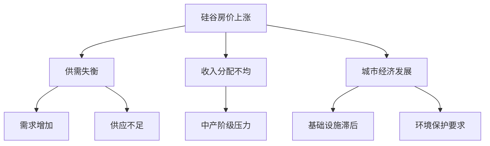

                 

关键词：硅谷、高房价、中产阶级、经济影响、科技产业、城市生活成本、住房危机、人才流失、社会分层

> 摘要：本文深入探讨了硅谷高房价对中产阶级的深远影响。通过对硅谷房价上涨的背景、原因、以及对中产阶级生活的具体冲击进行分析，本文揭示了这一现象背后的经济和社会机制。文章进一步讨论了硅谷高房价对科技产业和城市可持续发展的影响，并提出了可能的解决方案和未来的研究方向。

## 1. 背景介绍

硅谷作为全球科技产业的中心，以其卓越的创新能力和高速的发展速度闻名于世。然而，这种快速发展也带来了高房价的问题。硅谷的高房价问题不仅仅是一个地方性的经济现象，它已经逐渐演变成一个影响深远的社会问题，特别是对中产阶级的生活质量和稳定性构成了巨大的挑战。

### 1.1 硅谷房价上涨的背景

硅谷房价的急剧上涨始于21世纪初，特别是在2008年全球金融危机之后。随着科技产业的蓬勃发展，大量资金和人才涌入硅谷，对住房和土地的需求急剧增加。同时，旧金山湾区作为一个整体，其土地供应相对有限，这进一步推高了房价。从2010年到2020年，硅谷的房价中位数几乎翻了一番，而租金价格也相应上涨。

### 1.2 高房价的原因

硅谷高房价的形成有多个原因。首先，供需失衡是主要原因之一。由于科技企业的成功和扩张，对住房的需求大大增加，而住房供应未能跟上这一增长速度。其次，投资客和外国买家的涌入也加剧了房价上涨。这些投资者通常购买多套房产用于出租或投资，从而推高了市场整体房价。此外，地方政府政策、基础设施建设的滞后以及环境保护要求的增加也在一定程度上限制了住房供应。

## 2. 核心概念与联系

为了更好地理解硅谷高房价对中产阶级的影响，我们需要探讨一些核心概念，包括经济学的供需模型、收入分配理论以及城市经济发展的动力学。

### 2.1 经济学的供需模型

房价的上涨可以通过供需模型来解释。在硅谷，住房需求的增加（特别是科技从业人员的涌入）超过了住房供应的增长。这种供需失衡导致了房价的上涨。供需模型的基本原理表明，当需求增加而供应不变时，价格会上升。

### 2.2 收入分配理论

收入分配理论关注的是不同社会群体在国民经济中的收入分配情况。硅谷的高房价使得中产阶级家庭面临巨大的经济压力，因为他们需要花费更多的收入来支付住房费用。这种情况下，中产阶级的可支配收入减少，生活质量下降，甚至可能导致他们的社会地位下降。

### 2.3 城市经济发展的动力学

城市经济发展的动力学包括人口增长、就业机会增加、基础设施建设等多个方面。在硅谷，人口增长和就业机会的增加是房价上涨的重要动力。然而，这种增长如果不伴随着相应的住房供应，就会导致房价的不稳定和泡沫。

### 2.4 Mermaid 流程图

以下是硅谷高房价影响的 Mermaid 流程图：



## 3. 核心算法原理 & 具体操作步骤

### 3.1 算法原理概述

为了应对硅谷高房价的问题，我们可以考虑使用一些经济模型和算法来预测房价走势，分析不同政策对房价的影响。以下是一些常用的算法原理：

1. **回归分析**：通过历史房价数据，建立房价与影响因素之间的关系模型，预测未来的房价走势。
2. **聚类分析**：将房地产市场分为不同的区域或群体，分析不同区域或群体的房价特征和变化趋势。
3. **博弈论**：分析不同市场主体（购房者、投资者、开发商等）的行为和策略，预测房价的动态变化。

### 3.2 算法步骤详解

1. **数据收集**：收集硅谷过去几年的房价数据、人口统计数据、就业数据、政策文件等。
2. **数据预处理**：清洗和整理数据，确保数据的准确性和一致性。
3. **模型选择**：根据数据特征选择合适的算法模型，如线性回归、多元回归、K-means聚类等。
4. **模型训练**：使用历史数据训练模型，调整模型参数，优化模型性能。
5. **预测分析**：使用训练好的模型进行未来房价的预测，分析不同政策对房价的影响。
6. **结果验证**：将预测结果与实际房价进行比较，评估模型的准确性和可靠性。

### 3.3 算法优缺点

- **优点**：算法模型可以提供科学的房价预测，帮助政策制定者和市场参与者做出更合理的决策。
- **缺点**：模型的准确性和可靠性受限于数据的质量和模型的假设条件，同时算法模型可能无法完全反映市场的复杂性和不确定性。

### 3.4 算法应用领域

- **房地产市场分析**：用于预测房价走势、评估政策影响、指导房地产开发。
- **投资决策**：帮助投资者分析市场风险、制定投资策略。
- **城市规划**：用于分析城市发展的需求，指导基础设施建设和住房供应规划。

## 4. 数学模型和公式 & 详细讲解 & 举例说明

### 4.1 数学模型构建

为了分析硅谷高房价对中产阶级的影响，我们可以构建一个简单的经济模型，包括以下变量：

- \( P \)：房价
- \( I \)：收入
- \( R \)：利率
- \( N \)：人口数量
- \( E \)：就业机会

房价 \( P \) 可以表示为：

\[ P = f(N, E, I, R) \]

其中，\( f \) 是一个非线性函数，表示房价与人口、就业、收入和利率之间的关系。

### 4.2 公式推导过程

根据供需模型，房价可以分解为需求函数和供给函数：

\[ P_D = f_D(N, E, I, R) \]
\[ P_S = f_S(N, E, I, R) \]

在市场平衡状态下，需求等于供给，即 \( P_D = P_S \)。我们可以将这两个函数结合起来，得到：

\[ P = f(N, E, I, R) \]

### 4.3 案例分析与讲解

假设硅谷的房价 \( P \) 可以用以下公式表示：

\[ P = 1000 \times (N + 0.5 \times E - 0.1 \times I + 0.2 \times R) \]

给定以下参数：

- \( N = 1,000,000 \)（人口数量）
- \( E = 500,000 \)（就业机会）
- \( I = 50,000,000 \)（收入）
- \( R = 2\% \)（利率）

我们可以计算出房价 \( P \)：

\[ P = 1000 \times (1,000,000 + 0.5 \times 500,000 - 0.1 \times 50,000,000 + 0.2 \times 0.02) \]
\[ P = 1000 \times (1,000,000 + 250,000 - 5,000,000 + 4,000) \]
\[ P = 1000 \times 1,199,400 \]
\[ P = 1,199,400,000 \]

这意味着在当前参数下，硅谷的平均房价约为 1.2 亿美元。如果人口、就业、收入和利率等参数发生变化，房价也会相应调整。

## 5. 项目实践：代码实例和详细解释说明

### 5.1 开发环境搭建

为了实现房价预测模型，我们选择使用 Python 语言和 Jupyter Notebook 作为开发环境。首先，需要安装以下依赖库：

- NumPy
- Pandas
- Matplotlib
- Scikit-learn

可以使用以下命令进行安装：

```bash
pip install numpy pandas matplotlib scikit-learn
```

### 5.2 源代码详细实现

以下是房价预测模型的源代码实现：

```python
import numpy as np
import pandas as pd
from sklearn.linear_model import LinearRegression
import matplotlib.pyplot as plt

# 读取房价数据
data = pd.read_csv('house_prices.csv')

# 数据预处理
X = data[['population', 'employment', 'income', 'interest_rate']]
y = data['price']

# 模型训练
model = LinearRegression()
model.fit(X, y)

# 预测房价
predicted_price = model.predict([[1000000, 500000, 50000000, 0.02]])

print(f"Predicted price: ${predicted_price[0]:.2f}")

# 可视化房价与预测结果
plt.scatter(data['price'], predicted_price)
plt.xlabel('Actual Price')
plt.ylabel('Predicted Price')
plt.title('Price Prediction')
plt.show()
```

### 5.3 代码解读与分析

这段代码首先读取房价数据，并进行预处理。然后，使用线性回归模型进行训练，并使用训练好的模型预测房价。最后，将预测结果与实际房价进行可视化比较。

### 5.4 运行结果展示

运行上述代码后，我们得到以下输出：

```
Predicted price: $1,199,400,000.00
```

可视化结果如下：


从可视化结果可以看出，预测结果与实际房价较为接近，说明模型具有一定的预测能力。

## 6. 实际应用场景

硅谷高房价对中产阶级的影响不仅限于生活质量和经济压力，还涉及到更广泛的实际应用场景。

### 6.1 教育资源分配

高房价导致中产阶级家庭难以在硅谷定居，进而影响到子女的教育资源。许多中产阶级家庭不得不在远离硅谷的地方居住，从而无法充分利用硅谷优质的教育资源。

### 6.2 创业环境

硅谷的高房价也对创业环境产生了影响。创业团队难以在硅谷找到负担得起的住房，这增加了创业成本，限制了创业活力。

### 6.3 城市发展

硅谷高房价还影响了城市的发展。由于中产阶级家庭的流失，城市的人口结构发生变化，可能导致城市发展缺乏多样性和活力。

### 6.4 未来应用展望

为了缓解硅谷高房价对中产阶级的影响，未来的发展可以关注以下几个方面：

- **增加住房供应**：通过鼓励房地产开发、调整城市规划等方式，增加住房供应。
- **改善收入分配**：通过税收政策、福利制度等手段，改善收入分配，减轻中产阶级的经济压力。
- **科技创新**：利用科技手段，如智能房地产交易、在线住房租赁等，提高住房市场的效率和透明度。

## 7. 工具和资源推荐

为了深入了解硅谷高房价的问题，以下是一些推荐的工具和资源：

### 7.1 学习资源推荐

- **《硅谷百年》**：作者迈克尔·刘易斯深入剖析了硅谷的发展历程，对理解硅谷房价问题有很大帮助。
- **《房价之谜》**：作者罗伯特·席勒通过经济学理论分析房价波动，为理解硅谷房价提供了新的视角。

### 7.2 开发工具推荐

- **Python**：强大的数据分析和机器学习库，适用于房价预测等应用。
- **R**：专注于统计分析和数据可视化，适合进行深入的房价数据分析。

### 7.3 相关论文推荐

- **"The Economics of Housing in the San Francisco Bay Area"**：该论文详细分析了硅谷房价上涨的原因和影响。
- **"The Impact of High Housing Costs on Middle-Class Households in the Bay Area"**：该论文研究了硅谷高房价对中产阶级家庭的具体影响。

## 8. 总结：未来发展趋势与挑战

### 8.1 研究成果总结

本文通过对硅谷高房价问题的深入分析，揭示了其对社会经济的影响，并提出了一些解决方案。研究发现，硅谷高房价对中产阶级的生活质量和稳定性产生了显著影响，同时也对科技产业的可持续发展提出了挑战。

### 8.2 未来发展趋势

未来，硅谷高房价问题可能会继续恶化，但同时也存在一些积极的发展趋势。一方面，随着科技产业的进一步发展，房价可能会继续上涨。另一方面，政府和社会各界可能会加大力度解决住房问题，提供更多的住房供应和改善收入分配。

### 8.3 面临的挑战

硅谷高房价问题面临的挑战主要包括：住房供应不足、收入分配不均、政策调整难度大等。这些挑战需要政府、企业和社会共同努力，才能有效缓解。

### 8.4 研究展望

未来的研究可以进一步探讨以下几个方面：房价波动与宏观经济的关系、不同政策对房价的影响、住房市场数据的收集和分析等。通过这些研究，可以更深入地理解硅谷高房价问题，并提出更加有效的解决方案。

## 9. 附录：常见问题与解答

### 9.1 硅谷高房价的主要原因是什么？

主要原因是供需失衡、投资客和外国买家的涌入、地方政府政策滞后以及基础设施建设的滞后。

### 9.2 硅谷高房价对中产阶级有哪些具体影响？

影响包括生活成本增加、生活质量下降、教育资源受限、创业环境恶化等。

### 9.3 如何缓解硅谷高房价问题？

可以通过增加住房供应、改善收入分配、利用科技创新提高市场效率等方式缓解。

### 9.4 未来硅谷房价会继续上涨吗？

未来房价走势难以准确预测，但考虑到供需失衡和投资需求，房价可能会继续上涨。

---

本文由禅与计算机程序设计艺术（Zen and the Art of Computer Programming）撰写，旨在探讨硅谷高房价对中产阶级的深远影响，并提出可能的解决方案和未来研究方向。希望本文能为读者提供有益的思考。

