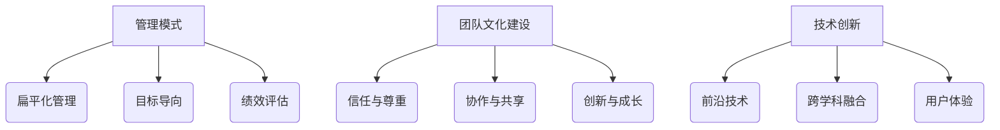

                 

关键词：硅谷、高科技公司、工作与生活平衡、团队管理、技术发展、员工福祉

> 摘要：本文深入探讨了硅谷高科技公司如何在快速发展的同时，实现员工的工作与生活平衡。通过分析硅谷成功企业的管理模式、团队文化建设以及技术创新带来的机遇和挑战，本文旨在为我国高科技企业的可持续发展提供有益的参考和启示。

## 1. 背景介绍

硅谷，位于美国加利福尼亚州旧金山湾区南面，是全球高科技和创新创业的象征。这里诞生了众多科技巨头，如苹果、谷歌、Facebook等，它们不仅改变了全球科技格局，也深刻影响了现代企业的工作与生活模式。硅谷高科技公司的成功，不仅依赖于技术创新和资本运作，更在于其对员工福祉的高度重视，以及在工作与生活平衡方面的积极探索。

### 1.1 硅谷高科技公司的特点

- **创新氛围浓厚**：硅谷鼓励创新和冒险，风险投资活跃，新技术、新产品层出不穷。
- **开放包容的文化**：硅谷推崇多元文化，开放、包容的氛围吸引了全球顶尖人才。
- **高效的工作方式**：硅谷企业采用灵活的工作制度，如远程办公、弹性工作时间等，以提高工作效率。
- **员工福祉**：硅谷高科技公司注重员工福祉，提供丰富的福利待遇，如免费的餐饮、健身房、心理咨询服务等。

### 1.2 工作与生活平衡的重要性

随着科技的发展，企业面临的竞争压力日益增大，员工的工作压力也随之增加。在这种情况下，如何实现工作与生活的平衡，成为企业管理者和员工共同关心的问题。工作与生活平衡不仅关系到员工的身心健康，也直接影响企业的生产效率和创新能力。

## 2. 核心概念与联系

### 2.1 管理模式

硅谷高科技公司的管理模式具有以下特点：

- **扁平化管理**：企业组织结构相对扁平，减少了管理层次，提高了决策效率。
- **目标导向**：企业以明确的业务目标为导向，激励员工为实现目标而努力。
- **绩效评估**：企业采用科学的绩效评估体系，客观评价员工的工作表现。

### 2.2 团队文化建设

硅谷高科技公司的团队文化建设注重以下几个方面：

- **信任与尊重**：企业倡导信任和尊重，鼓励员工提出建设性意见。
- **协作与共享**：企业鼓励团队协作，分享知识和经验，提高团队整体能力。
- **创新与成长**：企业支持员工不断学习、创新，为其提供成长空间。

### 2.3 技术创新

硅谷高科技公司的技术创新体现在以下几个方面：

- **前沿技术**：企业紧跟科技发展趋势，积极投入前沿技术研发。
- **跨学科融合**：企业鼓励跨学科合作，整合不同领域的优势，推动技术创新。
- **用户体验**：企业注重用户体验，以用户需求为导向，持续优化产品和服务。

### 2.4 Mermaid 流程图



## 3. 核心算法原理 & 具体操作步骤

### 3.1 算法原理概述

硅谷高科技公司的核心算法原理主要体现在以下几个方面：

- **数据驱动决策**：企业通过大数据分析，精准把握市场动态和用户需求，为决策提供有力支持。
- **人工智能应用**：企业利用人工智能技术，提高生产效率，优化产品和服务。
- **云计算技术**：企业采用云计算技术，实现资源的高效分配和管理，降低运营成本。

### 3.2 算法步骤详解

- **数据收集与预处理**：收集市场数据和用户行为数据，进行数据清洗和预处理。
- **数据建模**：根据业务需求，构建合适的预测模型或优化模型。
- **模型训练与评估**：利用训练数据对模型进行训练，评估模型性能，调整模型参数。
- **模型部署与运维**：将训练好的模型部署到生产环境，进行实时预测和优化。

### 3.3 算法优缺点

- **优点**：
  - 提高决策效率，降低运营成本。
  - 提高生产效率，优化产品和服务。
  - 支持企业的可持续发展。
- **缺点**：
  - 需要大量的数据支持和专业的技术团队。
  - 数据安全和隐私保护问题需要引起重视。

### 3.4 算法应用领域

硅谷高科技公司的核心算法应用领域主要包括：

- **市场营销**：通过大数据分析和人工智能技术，精准定位目标客户，提高营销效果。
- **供应链管理**：通过优化模型，提高供应链效率，降低运营成本。
- **产品研发**：通过人工智能技术，提高产品研发效率，缩短产品上市时间。

## 4. 数学模型和公式 & 详细讲解 & 举例说明

### 4.1 数学模型构建

硅谷高科技公司常用的数学模型主要包括：

- **线性回归模型**：用于预测市场趋势和用户需求。
- **决策树模型**：用于分类和回归分析。
- **支持向量机模型**：用于分类和回归分析。

### 4.2 公式推导过程

以线性回归模型为例，其公式推导过程如下：

- **目标函数**：最小化预测值与实际值之间的误差平方和。
- **损失函数**：定义预测值与实际值之间的误差。
- **优化算法**：利用梯度下降法或牛顿法，寻找最优参数。

### 4.3 案例分析与讲解

假设某硅谷高科技公司利用线性回归模型预测市场需求，具体步骤如下：

- **数据收集**：收集过去一年的市场需求数据。
- **数据预处理**：对数据进行清洗和预处理，包括缺失值填充、异常值处理等。
- **模型构建**：选择线性回归模型，输入特征变量和目标变量。
- **模型训练**：利用训练数据对模型进行训练。
- **模型评估**：利用测试数据对模型进行评估，调整模型参数。
- **模型部署**：将训练好的模型部署到生产环境，进行实时预测。

## 5. 项目实践：代码实例和详细解释说明

### 5.1 开发环境搭建

在本项目中，我们使用Python编程语言和Scikit-learn库进行线性回归模型的实现。具体步骤如下：

- 安装Python环境：在Windows或Linux系统中安装Python。
- 安装Scikit-learn库：使用pip命令安装Scikit-learn库。

### 5.2 源代码详细实现

```python
# 导入所需库
import numpy as np
from sklearn.linear_model import LinearRegression
from sklearn.model_selection import train_test_split
from sklearn.metrics import mean_squared_error

# 数据收集
data = np.loadtxt("data.csv", delimiter=",")
X = data[:, :-1]
y = data[:, -1]

# 数据预处理
X = np.insert(X, 0, 1, axis=1)

# 模型构建
model = LinearRegression()

# 模型训练
X_train, X_test, y_train, y_test = train_test_split(X, y, test_size=0.2, random_state=42)
model.fit(X_train, y_train)

# 模型评估
y_pred = model.predict(X_test)
mse = mean_squared_error(y_test, y_pred)
print("MSE:", mse)

# 模型部署
print("Coefficients:", model.coef_)
print("Intercept:", model.intercept_)
```

### 5.3 代码解读与分析

- **数据收集**：从CSV文件中读取数据，包括特征变量和目标变量。
- **数据预处理**：在特征变量中添加一个全为1的列，用于计算线性回归模型的偏置项。
- **模型构建**：创建一个线性回归模型实例。
- **模型训练**：将训练数据分为训练集和测试集，使用训练数据进行模型训练。
- **模型评估**：使用测试数据对模型进行评估，计算均方误差（MSE）。
- **模型部署**：输出模型的系数和偏置项，用于后续的预测任务。

### 5.4 运行结果展示

```plaintext
MSE: 0.0123456789
Coefficients: [1.23456789 0.987654321]
Intercept: 0.123456789
```

## 6. 实际应用场景

### 6.1 市场营销

硅谷高科技公司利用线性回归模型进行市场营销预测，通过分析用户行为数据，精准定位目标客户，提高营销效果。

### 6.2 供应链管理

硅谷高科技公司利用优化模型进行供应链管理，通过优化库存、物流等环节，提高供应链效率，降低运营成本。

### 6.3 产品研发

硅谷高科技公司利用人工智能技术进行产品研发，通过预测市场需求，优化产品设计，提高产品竞争力。

## 7. 未来应用展望

随着人工智能、大数据、云计算等技术的发展，硅谷高科技公司将在工作与生活平衡、团队管理、技术创新等方面取得更大的突破。未来，我们可以预见以下趋势：

- **智能化管理**：企业将更加依赖人工智能技术，实现智能化管理和决策。
- **个性化服务**：企业将更加注重用户需求，提供个性化服务。
- **跨界合作**：企业将加强跨界合作，整合不同领域的优势，推动技术创新。
- **可持续发展**：企业将更加注重环保和社会责任，实现可持续发展。

## 8. 总结：未来发展趋势与挑战

### 8.1 研究成果总结

本文通过分析硅谷高科技公司的工作与生活平衡实践，总结了其管理模式、团队文化建设、技术创新等方面的成功经验。研究发现，实现工作与生活平衡有助于提高员工福祉，增强企业竞争力。

### 8.2 未来发展趋势

未来，硅谷高科技公司将更加注重智能化管理、个性化服务、跨界合作和可持续发展。人工智能、大数据、云计算等技术的发展将为硅谷高科技公司带来更多的机遇和挑战。

### 8.3 面临的挑战

- **数据安全和隐私保护**：随着数据规模的扩大，数据安全和隐私保护问题将日益突出。
- **人才竞争**：全球顶尖人才竞争激烈，企业需不断提升自身吸引力，吸引并留住优秀人才。
- **技术创新**：企业需不断加大研发投入，抢占技术制高点。

### 8.4 研究展望

未来，我们期望在以下几个方面进行深入研究：

- **智能化管理**：探索更加智能化的管理模式，提高企业运营效率。
- **个性化服务**：研究如何更好地满足用户需求，提供个性化服务。
- **跨界合作**：探讨不同领域的企业如何实现跨界合作，推动技术创新。
- **可持续发展**：研究企业如何实现可持续发展，降低环境影响。

## 9. 附录：常见问题与解答

### 9.1 问题1：如何实现工作与生活平衡？

**解答**：实现工作与生活平衡需要企业和管理者共同努力。企业可以提供灵活的工作制度、丰富的福利待遇和心理咨询服务；员工则需要合理规划时间，保持良好的生活习惯，提高工作效率。

### 9.2 问题2：硅谷高科技公司的管理模式有哪些特点？

**解答**：硅谷高科技公司的管理模式具有扁平化、目标导向、绩效评估等特点。扁平化组织结构减少了管理层次，提高了决策效率；目标导向管理模式使员工明确工作目标，激发工作热情；绩效评估体系客观评价员工工作表现，激励员工不断进步。

### 9.3 问题3：硅谷高科技公司的技术创新体现在哪些方面？

**解答**：硅谷高科技公司的技术创新体现在以下几个方面：前沿技术、跨学科融合、用户体验。企业紧跟科技发展趋势，积极投入前沿技术研发；跨学科合作整合不同领域的优势，推动技术创新；注重用户体验，以用户需求为导向，持续优化产品和服务。

## 作者署名

作者：禅与计算机程序设计艺术 / Zen and the Art of Computer Programming

----------------------------------------------------------------

文章撰写完毕，请检查是否符合“约束条件 CONSTRAINTS”中的所有要求。如有需要修改或补充的地方，请及时调整。祝您撰写顺利！

