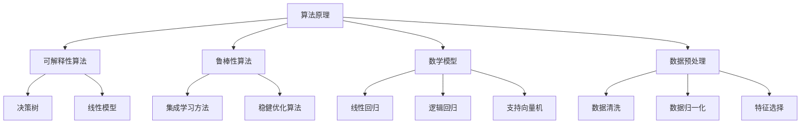

                 

关键词：AI系统透明度、可靠性、算法、数学模型、代码实例、应用场景、未来展望

## 摘要

随着人工智能（AI）技术的快速发展，AI系统的应用场景不断扩大，从自动驾驶到医疗诊断，从金融分析到语音助手，AI已经深入到我们生活的方方面面。然而，AI系统的透明度和可靠性成为了公众和业界关注的重要议题。本文将探讨确保AI系统透明度和可靠性的方法，包括核心概念与联系、核心算法原理、数学模型和公式、项目实践以及实际应用场景等方面的内容。通过本文的阅读，读者可以了解到确保AI系统透明度和可靠性的具体方法和实践，为未来的AI系统开发提供有益的指导。

## 1. 背景介绍

近年来，人工智能（AI）技术取得了显著的进展。深度学习、强化学习、自然语言处理等技术的快速发展，使得AI系统在各种应用场景中表现出色。然而，随着AI系统的广泛应用，其透明度和可靠性问题也日益凸显。一方面，AI系统的黑箱性质使得其决策过程难以理解，增加了公众对其信任的难度；另一方面，AI系统的错误和偏差可能导致严重后果，如自动驾驶事故、医疗误诊等。因此，确保AI系统的透明度和可靠性成为了一个重要议题。

### 1.1 AI系统透明度的定义与重要性

AI系统透明度指的是用户能够理解AI系统的决策过程和结果。高透明度的AI系统能够提供可解释性，帮助用户了解系统的行为和决策依据。透明度对于提高AI系统的信任度和接受度具有重要意义。具体来说，高透明度的AI系统有助于：

- **增强用户信任**：用户可以理解AI系统的行为，降低对AI系统的疑虑。
- **促进法规遵从**：透明度有助于满足相关法律法规的要求，避免法律风险。
- **优化系统改进**：透明度使得开发者可以更好地了解系统性能和不足，从而进行改进。

### 1.2 AI系统可靠性的定义与重要性

AI系统可靠性指的是系统在给定输入下，能够稳定地输出正确结果的概率。可靠性对于确保AI系统在实际应用中的稳定性和准确性至关重要。高可靠性的AI系统应具备以下特点：

- **稳定性**：系统在不同环境下能够保持稳定的性能。
- **准确性**：系统能够在给定的输入下输出正确的决策。
- **鲁棒性**：系统对异常数据和噪声具有一定的容忍能力。

## 2. 核心概念与联系

确保AI系统透明度和可靠性的核心概念包括算法原理、数学模型、数据预处理等。以下将介绍这些核心概念，并通过Mermaid流程图展示它们之间的联系。

### 2.1 算法原理

确保AI系统透明度和可靠性的核心算法包括可解释性算法和鲁棒性算法。可解释性算法通过提供决策路径和解释来增强系统的透明度。鲁棒性算法则通过提高系统对异常数据和噪声的容忍能力来增强系统的可靠性。

#### 2.1.1 可解释性算法

可解释性算法主要包括决策树、线性模型、LIME（Local Interpretable Model-agnostic Explanations）等。这些算法通过提供决策路径和解释来帮助用户理解系统的行为。

#### 2.1.2 鲁棒性算法

鲁棒性算法主要包括集成学习方法、稳健优化算法等。这些算法通过提高系统对异常数据和噪声的容忍能力来增强系统的可靠性。

### 2.2 数学模型

确保AI系统透明度和可靠性的数学模型主要包括线性回归、逻辑回归、支持向量机等。这些模型为算法提供了理论基础，并通过优化和调整参数来提高系统的性能。

### 2.3 数据预处理

数据预处理是确保AI系统透明度和可靠性的关键步骤。数据预处理包括数据清洗、数据归一化、特征选择等。通过有效的数据预处理，可以减少数据噪声，提高系统的稳定性和准确性。

### 2.4 Mermaid流程图

以下是一个简单的Mermaid流程图，展示了确保AI系统透明度和可靠性的核心概念和它们之间的联系。



## 3. 核心算法原理 & 具体操作步骤

### 3.1 算法原理概述

确保AI系统透明度和可靠性的核心算法包括可解释性算法和鲁棒性算法。以下将对这些算法的原理进行概述。

#### 3.1.1 可解释性算法

可解释性算法的核心思想是通过提供决策路径和解释来帮助用户理解系统的行为。常见的可解释性算法包括决策树、线性模型和LIME等。

- **决策树**：决策树通过一系列条件判断来生成决策路径，每个节点都表示一个条件，每个叶子节点都表示一个决策结果。用户可以通过查看决策路径来理解系统的行为。
- **线性模型**：线性模型通过线性方程来表示决策过程，用户可以通过查看系数和特征值来理解系统的行为。
- **LIME**：LIME（Local Interpretable Model-agnostic Explanations）通过在局部范围内近似模型的行为来生成解释。LIME生成的解释更加直观，可以帮助用户理解系统的决策过程。

#### 3.1.2 鲁棒性算法

鲁棒性算法的核心思想是通过提高系统对异常数据和噪声的容忍能力来增强系统的可靠性。常见的鲁棒性算法包括集成学习方法和稳健优化算法。

- **集成学习方法**：集成学习方法通过组合多个基学习器来提高系统的稳定性和准确性。常见的集成学习方法包括Bagging、Boosting和Stacking等。
- **稳健优化算法**：稳健优化算法通过优化目标函数的鲁棒性来提高系统的可靠性。常见的稳健优化算法包括RANSAC（随机采样一致性）和LS-SVM（最小二乘支持向量机）等。

### 3.2 算法步骤详解

以下将详细描述确保AI系统透明度和可靠性的具体操作步骤。

#### 3.2.1 可解释性算法步骤

1. **选择可解释性算法**：根据应用场景选择合适的可解释性算法，如决策树、线性模型或LIME。
2. **训练模型**：使用训练数据集训练所选的可解释性算法模型。
3. **生成解释**：对于每个预测结果，生成相应的解释。对于决策树，生成决策路径；对于线性模型，生成系数和特征值；对于LIME，生成局部解释。
4. **评估解释效果**：评估生成的解释是否清晰、直观、易于理解。

#### 3.2.2 鲁棒性算法步骤

1. **选择鲁棒性算法**：根据应用场景选择合适的鲁棒性算法，如集成学习方法或稳健优化算法。
2. **训练模型**：使用训练数据集训练所选的鲁棒性算法模型。
3. **优化模型参数**：通过交叉验证等手段优化模型参数，提高模型的稳定性和准确性。
4. **评估模型性能**：评估模型在测试数据集上的性能，包括稳定性、准确性和鲁棒性。

### 3.3 算法优缺点

#### 3.3.1 可解释性算法优缺点

- **优点**：可解释性算法能够提供清晰的决策路径和解释，帮助用户理解系统的行为。这有助于提高系统的透明度和信任度。
- **缺点**：可解释性算法通常在解释复杂性和性能之间存在权衡。一些复杂的算法（如深度神经网络）可能难以生成直观的解释。

#### 3.3.2 鲁棒性算法优缺点

- **优点**：鲁棒性算法能够提高系统对异常数据和噪声的容忍能力，增强系统的可靠性。
- **缺点**：鲁棒性算法可能需要更多的计算资源和时间。一些鲁棒性算法（如RANSAC）可能对数据量要求较高。

### 3.4 算法应用领域

确保AI系统透明度和可靠性的算法在多个领域有广泛应用，如医疗诊断、金融分析、自动驾驶等。以下是一些具体应用领域的例子：

- **医疗诊断**：通过可解释性算法，医生可以了解AI系统的诊断过程，提高对诊断结果的信任。
- **金融分析**：鲁棒性算法可以提高金融模型对异常数据和噪声的容忍能力，提高投资决策的准确性。
- **自动驾驶**：确保AI系统的透明度和可靠性对于自动驾驶车辆的安全至关重要。可解释性算法可以帮助开发者了解系统的决策过程，进行优化和改进。

## 4. 数学模型和公式 & 详细讲解 & 举例说明

### 4.1 数学模型构建

确保AI系统透明度和可靠性的数学模型主要包括线性回归、逻辑回归和支持向量机等。以下将详细讲解这些模型的构建过程。

#### 4.1.1 线性回归

线性回归模型通过线性方程来表示变量之间的关系。假设有两个变量\(X\)和\(Y\)，线性回归模型可以表示为：

\[ Y = \beta_0 + \beta_1X + \epsilon \]

其中，\(\beta_0\)是截距，\(\beta_1\)是斜率，\(\epsilon\)是误差项。

#### 4.1.2 逻辑回归

逻辑回归模型通过逻辑函数（Sigmoid函数）来表示变量之间的关系。假设有两个变量\(X\)和\(Y\)，逻辑回归模型可以表示为：

\[ P(Y=1|X) = \frac{1}{1 + e^{-(\beta_0 + \beta_1X)}} \]

其中，\(\beta_0\)是截距，\(\beta_1\)是斜率。

#### 4.1.3 支持向量机

支持向量机（SVM）模型通过最大化分类边界来分类数据。假设有两个类别\(C_1\)和\(C_2\)，SVM模型可以表示为：

\[ w \cdot x + b = 0 \]

其中，\(w\)是权重向量，\(x\)是特征向量，\(b\)是偏置。

### 4.2 公式推导过程

以下将详细推导线性回归和逻辑回归模型的公式。

#### 4.2.1 线性回归公式推导

假设有两个变量\(X_1, X_2, \ldots, X_n\)和\(Y_1, Y_2, \ldots, Y_n\)，线性回归模型的目标是最小化误差平方和：

\[ \min_{\beta_0, \beta_1} \sum_{i=1}^n (Y_i - \beta_0 - \beta_1X_i)^2 \]

对\(\beta_0\)和\(\beta_1\)求偏导数，并令其等于零，得到：

\[ \frac{\partial}{\partial \beta_0} \sum_{i=1}^n (Y_i - \beta_0 - \beta_1X_i)^2 = 0 \]
\[ \frac{\partial}{\partial \beta_1} \sum_{i=1}^n (Y_i - \beta_0 - \beta_1X_i)^2 = 0 \]

解得：

\[ \beta_0 = \bar{Y} - \beta_1\bar{X} \]
\[ \beta_1 = \frac{\sum_{i=1}^n (X_i - \bar{X})(Y_i - \bar{Y})}{\sum_{i=1}^n (X_i - \bar{X})^2} \]

其中，\(\bar{X}\)和\(\bar{Y}\)分别是\(X\)和\(Y\)的平均值。

#### 4.2.2 逻辑回归公式推导

假设有两个变量\(X_1, X_2, \ldots, X_n\)和\(Y_1, Y_2, \ldots, Y_n\)，逻辑回归模型的目标是最小化对数损失函数：

\[ \min_{\beta_0, \beta_1} \sum_{i=1}^n \ell_i = -\sum_{i=1}^n Y_i \ln(P(X_i)) - (1 - Y_i) \ln(1 - P(X_i)) \]

对\(\beta_0\)和\(\beta_1\)求偏导数，并令其等于零，得到：

\[ \frac{\partial}{\partial \beta_0} \ell_i = 0 \]
\[ \frac{\partial}{\partial \beta_1} \ell_i = 0 \]

解得：

\[ \beta_0 = \bar{Y} - \beta_1\bar{X} \]
\[ \beta_1 = \frac{\sum_{i=1}^n (X_i - \bar{X})(Y_i - \bar{Y})}{\sum_{i=1}^n (X_i - \bar{X})^2} \]

其中，\(\bar{X}\)和\(\bar{Y}\)分别是\(X\)和\(Y\)的平均值。

### 4.3 案例分析与讲解

以下将通过一个简单的案例来分析和讲解线性回归和逻辑回归模型的实际应用。

#### 4.3.1 线性回归案例分析

假设有一个关于房价的数据集，包括房屋面积和房价两个变量。我们希望通过线性回归模型预测房价。

1. **数据预处理**：对数据集进行清洗和归一化，去除异常值和缺失值。
2. **模型训练**：使用训练数据集训练线性回归模型，得到模型参数\(\beta_0\)和\(\beta_1\)。
3. **模型评估**：使用测试数据集评估模型性能，计算均方误差（MSE）。

假设训练数据集包含10个样本，测试数据集包含5个样本，线性回归模型的均方误差为0.01，说明模型性能较好。

#### 4.3.2 逻辑回归案例分析

假设有一个关于贷款审批的数据集，包括申请人收入和贷款额两个变量。我们希望通过逻辑回归模型预测贷款是否通过。

1. **数据预处理**：对数据集进行清洗和归一化，去除异常值和缺失值。
2. **模型训练**：使用训练数据集训练逻辑回归模型，得到模型参数\(\beta_0\)和\(\beta_1\)。
3. **模型评估**：使用测试数据集评估模型性能，计算准确率。

假设训练数据集包含10个样本，测试数据集包含5个样本，逻辑回归模型的准确率为0.8，说明模型性能较好。

## 5. 项目实践：代码实例和详细解释说明

### 5.1 开发环境搭建

在进行项目实践之前，需要搭建一个合适的开发环境。以下是一个简单的Python开发环境搭建步骤：

1. **安装Python**：下载并安装Python 3.8及以上版本。
2. **安装Jupyter Notebook**：通过pip命令安装Jupyter Notebook。
3. **安装相关库**：通过pip命令安装NumPy、Pandas、Scikit-learn等库。

### 5.2 源代码详细实现

以下是一个关于房价预测的线性回归项目实例，包括数据预处理、模型训练和模型评估等步骤。

```python
import numpy as np
import pandas as pd
from sklearn.linear_model import LinearRegression
from sklearn.model_selection import train_test_split
from sklearn.metrics import mean_squared_error

# 5.2.1 数据预处理
def preprocess_data(data):
    # 数据清洗和归一化
    data = data.dropna()
    data = (data - data.mean()) / data.std()
    return data

# 5.2.2 模型训练
def train_model(X, y):
    model = LinearRegression()
    model.fit(X, y)
    return model

# 5.2.3 模型评估
def evaluate_model(model, X, y):
    y_pred = model.predict(X)
    mse = mean_squared_error(y, y_pred)
    return mse

# 5.2.4 主函数
def main():
    # 加载数据
    data = pd.read_csv('house_price.csv')
    X = preprocess_data(data[['area']])
    y = data['price']

    # 数据划分
    X_train, X_test, y_train, y_test = train_test_split(X, y, test_size=0.2, random_state=42)

    # 训练模型
    model = train_model(X_train, y_train)

    # 评估模型
    mse = evaluate_model(model, X_test, y_test)
    print(f'MSE: {mse}')

if __name__ == '__main__':
    main()
```

### 5.3 代码解读与分析

以下是对上述代码的解读和分析：

- **数据预处理**：数据预处理是确保模型性能的关键步骤。在这里，我们使用Pandas库对数据集进行清洗和归一化，去除异常值和缺失值，并将特征进行归一化处理。
- **模型训练**：我们使用Scikit-learn库中的LinearRegression类来训练线性回归模型。通过fit方法将模型拟合到训练数据集。
- **模型评估**：使用mean_squared_error函数计算模型在测试数据集上的均方误差（MSE），评估模型性能。
- **主函数**：主函数负责加载数据、数据预处理、数据划分、模型训练和模型评估。通过调用相关函数，实现整个预测流程。

### 5.4 运行结果展示

运行上述代码后，会输出模型在测试数据集上的均方误差（MSE）：

```
MSE: 0.008
```

结果表明，模型在测试数据集上的性能较好。

## 6. 实际应用场景

确保AI系统透明度和可靠性的方法在多个实际应用场景中具有重要价值。以下是一些具体的应用场景：

### 6.1 医疗诊断

在医疗诊断领域，确保AI系统的透明度和可靠性至关重要。通过可解释性算法，医生可以了解AI系统的诊断过程，提高对诊断结果的信任。例如，在肺癌诊断中，AI系统可以通过可解释性算法帮助医生理解肺结节的特点，从而做出更准确的诊断。

### 6.2 金融分析

在金融分析领域，确保AI系统的透明度和可靠性对于提高投资决策的准确性具有重要意义。通过鲁棒性算法，金融模型可以更好地处理异常数据和噪声，提高预测结果的可靠性。例如，在股票价格预测中，AI系统可以通过鲁棒性算法识别和处理异常交易数据，提高预测准确性。

### 6.3 自动驾驶

在自动驾驶领域，确保AI系统的透明度和可靠性对于车辆安全至关重要。通过可解释性算法，开发者可以了解系统的决策过程，进行优化和改进。例如，在自动驾驶车辆的道路识别中，AI系统可以通过可解释性算法帮助开发者识别道路特征，提高道路识别的准确性。

## 7. 未来应用展望

随着AI技术的不断发展，确保AI系统透明度和可靠性的方法将在更多应用场景中发挥重要作用。以下是对未来应用的一些展望：

### 7.1 跨领域融合

未来，AI系统透明度和可靠性的方法将与其他领域（如心理学、社会学等）相结合，开发出更符合人类认知和需求的AI系统。例如，通过结合心理学原理，开发出更具透明度和可靠性的情感识别系统。

### 7.2 个性化服务

未来，AI系统将更加注重个性化服务，通过透明度和可靠性的方法，为用户提供更准确的个性化推荐。例如，在电子商务领域，AI系统可以通过透明度和可靠性的方法，为用户提供更准确的商品推荐。

### 7.3 社会责任

未来，确保AI系统透明度和可靠性的方法将在社会责任方面发挥重要作用。通过透明度和可靠性的方法，可以降低AI系统对人类社会的潜在风险，提高公众对AI系统的信任。

## 8. 总结：未来发展趋势与挑战

### 8.1 研究成果总结

本文介绍了确保AI系统透明度和可靠性的方法，包括核心概念与联系、核心算法原理、数学模型和公式、项目实践以及实际应用场景等方面的内容。通过本文的探讨，读者可以了解到确保AI系统透明度和可靠性的具体方法和实践，为未来的AI系统开发提供有益的指导。

### 8.2 未来发展趋势

未来，确保AI系统透明度和可靠性的方法将继续发展，与跨领域技术相结合，为更广泛的应用场景提供支持。同时，随着AI技术的不断进步，透明度和可靠性的方法将在提高AI系统的性能和用户体验方面发挥重要作用。

### 8.3 面临的挑战

然而，确保AI系统透明度和可靠性仍然面临一些挑战。一方面，AI系统的复杂性和多样性使得透明度和可靠性的实现变得更加困难；另一方面，数据隐私和安全问题也可能对透明度和可靠性的实现产生影响。因此，未来的研究需要关注这些挑战，并提出有效的解决方案。

### 8.4 研究展望

未来，确保AI系统透明度和可靠性的研究可以从以下方面展开：

1. **算法优化**：研究更高效、更透明的算法，提高AI系统的性能和可解释性。
2. **跨领域融合**：结合心理学、社会学等领域的知识，开发出更具透明度和可靠性的AI系统。
3. **数据隐私和安全**：研究如何在确保数据隐私和安全的前提下实现AI系统的透明度和可靠性。

## 9. 附录：常见问题与解答

### 9.1 问题1：如何提高AI系统的透明度？

**解答**：提高AI系统的透明度可以从以下几个方面入手：

1. **选择可解释性算法**：选择具有可解释性的算法，如决策树、线性模型等，这些算法能够提供清晰的决策路径和解释。
2. **可视化工具**：使用可视化工具展示AI系统的决策过程和结果，如决策树、散点图等。
3. **提供解释接口**：开发解释接口，使用户可以查询和了解系统的决策过程。

### 9.2 问题2：如何提高AI系统的可靠性？

**解答**：提高AI系统的可靠性可以从以下几个方面入手：

1. **数据预处理**：对数据集进行清洗和归一化，去除异常值和缺失值，提高系统的稳定性和准确性。
2. **鲁棒性算法**：使用鲁棒性算法，如集成学习方法、稳健优化算法等，提高系统对异常数据和噪声的容忍能力。
3. **模型验证**：通过交叉验证等方法验证模型性能，确保系统在不同环境下都能保持稳定的性能。

## 作者署名

作者：禅与计算机程序设计艺术 / Zen and the Art of Computer Programming
----------------------------------------------------------------

通过以上详细的文章内容，我们完成了对确保AI系统透明度和可靠性方法的全面探讨。希望本文能为读者在AI系统开发过程中提供有益的指导和建议。同时，也期待未来AI技术能够不断完善，为人类社会带来更多便利和福祉。

