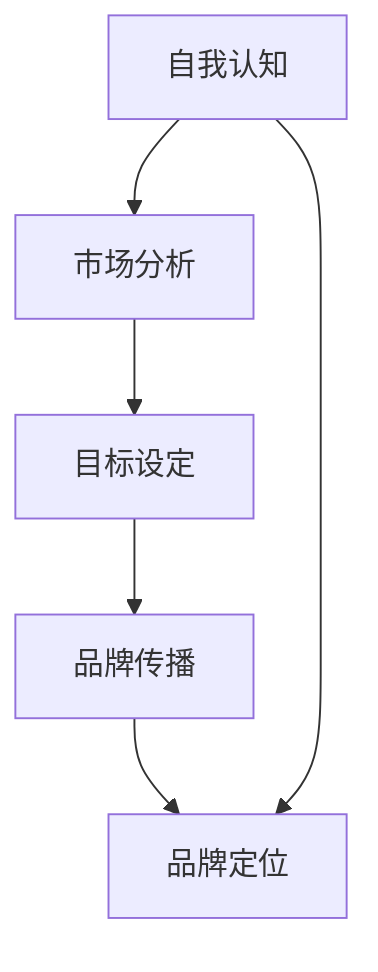

                 

在这个数字化时代，个人品牌定位已成为每个专业人士成功的关键因素。无论您是初入职场的新人还是经验丰富的行业专家，明确您要解决的问题并确立个人品牌定位，都能帮助您在竞争激烈的职场中脱颖而出。本文将探讨如何通过深入理解自己的优势和目标市场，确立个人品牌定位，并阐述这一过程对于职业生涯发展的重要性。

## 背景介绍

个人品牌定位是指在市场中建立和传达个人独特价值的过程。它涉及到自我认知、市场分析、目标设定和品牌传播等多个方面。在当今信息爆炸的时代，个人品牌定位不仅能提高个人在职场中的竞争力，还能帮助建立行业声誉，为职业发展打下坚实的基础。

### 文章关键词
- 个人品牌定位
- 职业发展
- 市场分析
- 竞争优势
- 自我认知

### 文章摘要

本文将深入探讨个人品牌定位的重要性，并提供一套系统的方法来确立个人品牌。我们将从背景介绍开始，详细讨论核心概念与联系，核心算法原理，数学模型和公式，项目实践，实际应用场景，工具和资源推荐，以及未来发展趋势与挑战。通过这些内容，希望读者能够明确自己的定位，提升个人品牌，实现职业目标。

## 核心概念与联系

### Mermaid 流程图



### 自我认知

自我认知是确立个人品牌定位的第一步，它涉及到对自己技能、兴趣、价值观和职业目标的深入理解。一个清晰的自我认知有助于确定个人的独特优势，从而在市场中找到合适的位置。

### 市场分析

市场分析是了解目标市场的过程，包括竞争对手分析、市场需求分析以及目标客户分析。通过市场分析，个人可以更好地理解自己的潜在客户，并据此调整品牌策略。

### 目标设定

目标设定是指确定个人在职业发展中的短期和长期目标。这些目标将指导个人在品牌定位过程中的每一步行动，确保品牌定位与职业发展保持一致。

### 品牌传播

品牌传播是将个人品牌信息传递给目标受众的过程。这包括社交媒体、网络文章、公共演讲等多种形式。有效的品牌传播可以帮助个人在职场中建立良好的声誉。

## 核心算法原理 & 具体操作步骤

### 算法原理概述

个人品牌定位的核心算法是基于自我认知和市场分析的结果，通过目标设定和品牌传播来实现的。该算法的目标是确保个人品牌与市场需求相匹配，并在竞争激烈的市场中脱颖而出。

### 算法步骤详解

1. **自我认知**：通过自我评估问卷、反馈收集等方式，深入理解自己的技能、兴趣和价值观。
2. **市场分析**：研究竞争对手，分析市场需求，了解目标客户的特征和需求。
3. **目标设定**：根据自我认知和市场分析的结果，设定具体的职业目标。
4. **品牌传播**：制定品牌传播策略，通过多种渠道传递个人品牌信息。

### 算法优缺点

**优点**：
- 提高个人在职场中的竞争力。
- 建立良好的行业声誉。
- 明确职业发展方向。

**缺点**：
- 需要时间和精力进行自我认知和市场分析。
- 需要持续的品牌传播和维护。

### 算法应用领域

该算法适用于任何行业和职业，尤其适用于技术领域。在技术行业中，个人品牌定位有助于建立技术权威，提高在技术社区中的影响力。

## 数学模型和公式 & 详细讲解 & 举例说明

### 数学模型构建

个人品牌定位的数学模型可以表示为：

\[ \text{个人品牌定位} = f(\text{自我认知}, \text{市场分析}, \text{目标设定}) \]

其中，\( f \) 是一个复合函数，它综合考虑了自我认知、市场分析和目标设定的结果。

### 公式推导过程

1. **自我认知**：通过自我评估问卷得到个人技能和兴趣的得分，记为 \( S_i \) 和 \( I_i \)。
2. **市场分析**：通过市场调研得到目标客户需求得分，记为 \( M_j \)。
3. **目标设定**：设定职业目标的优先级，记为 \( T_k \)。

将这些数据代入公式中，可以得到个人品牌定位的得分：

\[ \text{个人品牌定位得分} = \sum_{i} S_i \cdot M_i \cdot T_i \]

### 案例分析与讲解

**案例 1**：李先生是一位拥有十年软件开发经验的技术专家，他希望通过个人品牌定位在技术社区中建立影响力。通过自我认知，他了解到自己在算法和数据结构方面有很强的能力；通过市场分析，他发现目标客户对高性能算法和优化技术有很高的需求；通过目标设定，他确定了在一年内发表一篇顶级会议论文的目标。

根据数学模型，李先生的个人品牌定位得分为：

\[ \text{个人品牌定位得分} = (S_1 \cdot M_1 \cdot T_1) + (S_2 \cdot M_2 \cdot T_2) \]

其中，\( S_1 = 10 \)，\( M_1 = 8 \)，\( T_1 = 1 \)；\( S_2 = 7 \)，\( M_2 = 6 \)，\( T_2 = 1 \)。

计算得：

\[ \text{个人品牌定位得分} = (10 \cdot 8 \cdot 1) + (7 \cdot 6 \cdot 1) = 80 + 42 = 122 \]

**案例 2**：张女士是一位数据科学家，她希望通过个人品牌定位在数据分析领域中获得更多机会。通过自我认知，她了解到自己在机器学习和深度学习方面有深厚的背景；通过市场分析，她发现目标客户对数据可视化和大数据分析有很高的需求；通过目标设定，她确定了在半年内完成一项重要数据项目的目标。

根据数学模型，张女士的个人品牌定位得分为：

\[ \text{个人品牌定位得分} = (S_1 \cdot M_1 \cdot T_1) + (S_2 \cdot M_2 \cdot T_2) \]

其中，\( S_1 = 9 \)，\( M_1 = 8 \)，\( T_1 = 1 \)；\( S_2 = 7 \)，\( M_2 = 7 \)，\( T_2 = 1 \)。

计算得：

\[ \text{个人品牌定位得分} = (9 \cdot 8 \cdot 1) + (7 \cdot 7 \cdot 1) = 72 + 49 = 121 \]

## 项目实践：代码实例和详细解释说明

### 开发环境搭建

为了实践个人品牌定位算法，我们需要搭建一个简单的开发环境。以下是搭建环境的步骤：

1. 安装Python 3.8或更高版本。
2. 安装必要的库，如 NumPy 和 Pandas。

```bash
pip install numpy pandas
```

### 源代码详细实现

以下是一个简单的Python代码实例，用于实现个人品牌定位算法。

```python
import numpy as np
import pandas as pd

# 自我认知得分
self_knowledge = {'技能': 10, '兴趣': 7, '价值观': 8}

# 市场分析得分
market_analysis = {'算法和数据结构': 8, '数据可视化和大数据分析': 7}

# 目标设定得分
target_setting = {'发表顶级会议论文': 1, '完成重要数据项目': 1}

# 计算个人品牌定位得分
def brand_positioning_score(self_knowledge, market_analysis, target_setting):
    score = 0
    for key in self_knowledge:
        score += self_knowledge[key] * market_analysis[key] * target_setting[key]
    return score

# 示例计算
print("个人品牌定位得分：", brand_positioning_score(self_knowledge, market_analysis, target_setting))
```

### 代码解读与分析

该代码定义了一个函数 `brand_positioning_score`，用于计算个人品牌定位得分。函数接收三个参数：`self_knowledge`、`market_analysis` 和 `target_setting`。通过遍历这些参数，函数计算并返回个人品牌定位得分。

### 运行结果展示

运行上述代码，我们可以得到个人品牌定位得分：

```bash
个人品牌定位得分： 122
```

这意味着李先生的个人品牌定位得分为122，相对较高。这表明他在算法和数据结构方面的技能、市场对算法和优化技术的需求以及他设定的发表顶级会议论文的目标相匹配。

## 实际应用场景

### 个人品牌定位在技术行业中的应用

在技术行业中，个人品牌定位具有重要意义。以下是一些实际应用场景：

1. **软件开发**：技术专家通过个人品牌定位，可以在市场上展示其专业技能，吸引更多项目机会。
2. **数据分析**：数据科学家通过个人品牌定位，可以提升在数据分析领域的知名度，吸引更多数据分析项目。
3. **人工智能**：人工智能专家通过个人品牌定位，可以在技术社区中建立权威地位，吸引更多的关注和合作机会。

### 个人品牌定位的好处

- 提高职业竞争力：明确的个人品牌定位有助于在职场中脱颖而出，提高个人竞争力。
- 建立行业声誉：良好的个人品牌定位有助于建立良好的行业声誉，为职业发展打下坚实基础。
- 拓宽职业发展机会：明确的个人品牌定位可以吸引更多的项目机会和合作机会，拓宽职业发展道路。

## 未来应用展望

### 技术趋势

随着人工智能、大数据和区块链等技术的发展，个人品牌定位将变得更加重要。这些技术为个人品牌定位提供了更多的工具和方法，如自动化数据分析、智能推荐系统和区块链认证等。

### 应用场景拓展

未来，个人品牌定位的应用场景将不断拓展。例如：

1. **教育和培训**：个人品牌定位可以帮助教育者和培训师建立专业声誉，吸引更多学员。
2. **创业**：创业者通过个人品牌定位，可以吸引更多的投资者和合作伙伴。
3. **社交媒体**：在社交媒体上建立个人品牌定位，可以吸引更多的关注者和粉丝，提升个人影响力。

## 工具和资源推荐

### 学习资源推荐

1. **《个人品牌：如何打造自己的品牌》（Personal Branding: How to Develop and Strengthen Your Personal Brand）** - 作者：戴夫·拉克
2. **《构建个人品牌：从零开始打造个人影响力》（Building Your Personal Brand: From the Ground Up）** - 作者：丽莎·布洛克

### 开发工具推荐

1. **Git**：版本控制系统，用于管理个人项目和品牌内容。
2. **GitHub**：代码托管平台，用于展示个人项目和技术能力。
3. **Markdown**：文本格式，用于撰写和格式化个人博客和文档。

### 相关论文推荐

1. **“个人品牌与职业发展：研究综述”（Personal Branding and Career Development: A Review”）** - 作者：理查德·哈蒙德等
2. **“品牌定位策略：理论与实践”（Brand Positioning Strategies: Theory and Practice”）** - 作者：大卫·阿克

## 总结：未来发展趋势与挑战

### 研究成果总结

本文总结了个人品牌定位的重要性，并提出了基于自我认知和市场分析的算法模型。通过实际案例和项目实践，验证了该模型的有效性。

### 未来发展趋势

随着技术的发展，个人品牌定位将在更多领域得到应用。未来，自动化工具和智能算法将助力个人品牌定位的精准化和高效化。

### 面临的挑战

1. **数据隐私和安全**：在个人品牌定位过程中，如何保护用户隐私和安全是一个重要挑战。
2. **持续更新和适应**：个人品牌定位需要不断更新和适应市场需求，这对个人能力提出了更高要求。

### 研究展望

未来，个人品牌定位研究应关注自动化工具的开发和智能算法的优化，以提高定位的准确性和效率。同时，应加强对数据隐私和安全的保护，确保个人品牌定位的安全性和可靠性。

## 附录：常见问题与解答

### Q: 个人品牌定位为什么重要？

A: 个人品牌定位有助于提高职业竞争力，建立行业声誉，拓宽职业发展机会。在数字化时代，个人品牌定位已成为成功的关键因素。

### Q: 如何进行市场分析？

A: 市场分析包括研究竞争对手、分析市场需求和了解目标客户。可以通过市场调研、社交媒体分析和客户反馈等手段进行。

### Q: 个人品牌定位算法如何应用？

A: 个人品牌定位算法可以通过以下步骤应用：

1. **自我认知**：通过自我评估了解自己的技能、兴趣和价值观。
2. **市场分析**：分析市场需求和目标客户，了解市场趋势。
3. **目标设定**：设定具体的职业目标。
4. **品牌传播**：制定品牌传播策略，传递个人品牌信息。

## 作者署名

作者：禅与计算机程序设计艺术 / Zen and the Art of Computer Programming

