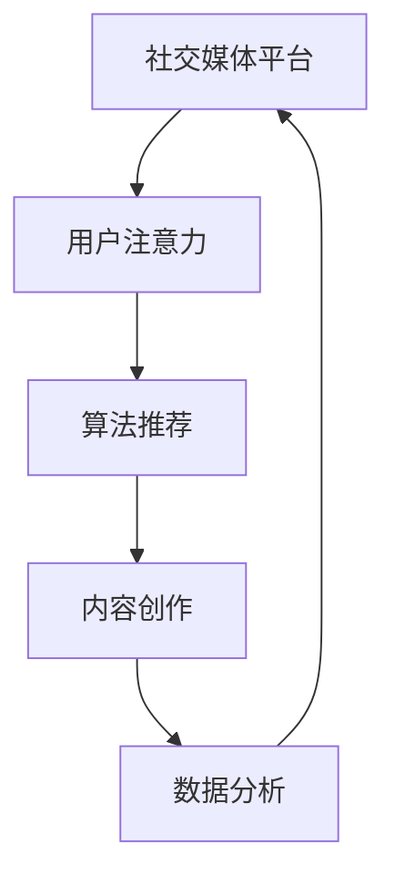

                 

社交媒体与注意力经济的崛起

## 关键词

- 社交媒体
- 注意力经济
- 用户参与
- 数据分析
- 算法推荐
- 内容创作

## 摘要

本文将深入探讨社交媒体的崛起及其对注意力经济的影响。随着数字技术的发展，社交媒体已经成为人们日常交流、信息获取和内容消费的主要平台。本文将分析社交媒体的核心特征，介绍注意力经济的基本概念，探讨用户参与、数据分析和算法推荐对社交媒体的影响。此外，还将讨论内容创作在注意力经济中的角色，以及未来社交媒体和注意力经济的发展趋势。

### 1. 背景介绍

### 1.1 社交媒体的兴起

社交媒体的兴起可以追溯到21世纪初，当时互联网技术开始迅速发展，宽带接入成本的降低和移动设备的普及使得社交媒体平台的开发和使用变得更加容易。早期的社交媒体平台，如Facebook、Twitter和MySpace，为用户提供了一个在线社交网络的空间，使得人们可以轻松地与朋友和家人保持联系。随着时间的推移，社交媒体的功能不断扩展，逐渐成为人们获取新闻、娱乐和交流意见的重要渠道。

### 1.2 注意力经济的概念

注意力经济是指一种基于用户注意力的经济模式。在传统经济模式中，商品和服务的交换是货币的直接交换，而在注意力经济中，用户注意力的获取和利用成为了商业交易的核心。用户在社交媒体上花费的时间越多，他们的注意力也就越容易被商家和平台所利用。注意力经济的崛起，标志着数字营销和广告行业的新时代。

### 1.3 社交媒体与注意力经济的关系

社交媒体与注意力经济密切相关。社交媒体平台通过吸引和保持用户的注意力，从而实现了商业价值的转化。例如，平台通过算法推荐内容来吸引用户的注意力，并通过广告和付费内容等方式获取收益。同时，社交媒体的崛起也推动了注意力经济的发展，使得品牌和商家能够更精准地触达目标用户。

### 2. 核心概念与联系

#### 2.1 核心概念

- **社交媒体平台**：如Facebook、Twitter、Instagram等。
- **用户注意力**：用户在社交媒体上花费的时间和精力。
- **算法推荐**：通过机器学习算法分析用户行为，推荐感兴趣的内容。
- **内容创作**：用户生成内容，包括文字、图片、视频等形式。
- **数据分析**：对用户行为和内容进行分析，以优化平台和广告效果。

#### 2.2 关系架构



### 3. 核心算法原理 & 具体操作步骤

#### 3.1 算法原理概述

社交媒体平台的核心算法通常基于机器学习，特别是深度学习技术。这些算法通过分析用户的行为数据，如浏览历史、点击行为、互动频率等，来预测用户的兴趣，并推荐相关内容。算法的目标是最大化用户的参与度和平台的收益。

#### 3.2 算法步骤详解

1. **数据收集**：平台收集用户在社交媒体上的行为数据。
2. **特征提取**：将行为数据转换为算法可处理的特征，如词向量、用户画像等。
3. **模型训练**：使用深度学习算法，如卷积神经网络（CNN）或循环神经网络（RNN），训练推荐模型。
4. **模型评估**：通过交叉验证和A/B测试等方法评估模型效果。
5. **内容推荐**：将训练好的模型应用于实时数据，推荐相关内容给用户。

#### 3.3 算法优缺点

**优点**：
- **个性化推荐**：根据用户兴趣推荐内容，提高用户体验。
- **实时性**：算法可以实时更新，及时调整推荐内容。

**缺点**：
- **隐私问题**：用户行为数据的收集和使用可能侵犯隐私。
- **信息茧房**：过度个性化可能导致用户只接触到同类型的内容，限制视野。

#### 3.4 算法应用领域

- **电子商务**：根据用户浏览历史推荐商品。
- **新闻媒体**：推荐用户可能感兴趣的新闻文章。
- **在线教育**：根据学习行为推荐适合的课程。

### 4. 数学模型和公式 & 详细讲解 & 举例说明

#### 4.1 数学模型构建

社交媒体推荐系统常用的数学模型包括协同过滤（Collaborative Filtering）和内容过滤（Content-Based Filtering）。其中，协同过滤基于用户行为数据，而内容过滤则基于内容特征。

#### 4.2 公式推导过程

**协同过滤模型**：
- **用户-物品评分矩阵**：\( R \in \mathbb{R}^{m \times n} \)，其中 \( m \) 是用户数，\( n \) 是物品数。
- **预测评分**：\( \hat{r}_{ui} = \langle u, v \rangle + \mu_i \)，其中 \( \langle u, v \rangle \) 是用户 \( u \) 和物品 \( v \) 的相似度，\( \mu_i \) 是物品 \( i \) 的平均评分。

**内容过滤模型**：
- **物品特征向量**：\( \mathbf{q}_v \in \mathbb{R}^d \)，其中 \( d \) 是特征维度。
- **用户兴趣向量**：\( \mathbf{p}_u \in \mathbb{R}^d \)。
- **相似度计算**：\( \cos(\mathbf{p}_u, \mathbf{q}_v) = \frac{\mathbf{p}_u \cdot \mathbf{q}_v}{\|\mathbf{p}_u\| \|\mathbf{q}_v\|} \)。

#### 4.3 案例分析与讲解

**案例**：一个用户对电影进行评分，我们使用协同过滤模型预测用户对未知电影的评分。

1. **数据收集**：收集用户对电影的评分数据。
2. **特征提取**：将用户和电影转换为特征向量。
3. **模型训练**：使用训练数据训练协同过滤模型。
4. **评分预测**：对未知电影进行评分预测。

```latex
\hat{r}_{ui} = \sum_{j \in N(u)} r_{uj} \cdot \langle u, j \rangle + \mu_i
```

其中，\( N(u) \) 是用户 \( u \) 评分的电影集合，\( r_{uj} \) 是用户 \( u \) 对电影 \( j \) 的评分，\( \langle u, j \rangle \) 是用户 \( u \) 和电影 \( j \) 的相似度，\( \mu_i \) 是电影 \( i \) 的平均评分。

### 5. 项目实践：代码实例和详细解释说明

#### 5.1 开发环境搭建

- **工具**：Python、Jupyter Notebook、scikit-learn库。

#### 5.2 源代码详细实现

```python
from sklearn.model_selection import train_test_split
from sklearn.neighbors import KNeighborsClassifier
import numpy as np

# 加载用户和物品评分数据
ratings = np.load('ratings.npy')

# 划分训练集和测试集
X_train, X_test, y_train, y_test = train_test_split(ratings[:, :-1], ratings[:, -1], test_size=0.2, random_state=42)

# 使用KNN模型进行训练
knn = KNeighborsClassifier(n_neighbors=5)
knn.fit(X_train, y_train)

# 预测测试集
predictions = knn.predict(X_test)

# 评估模型效果
accuracy = np.mean(predictions == y_test)
print(f"Accuracy: {accuracy:.2f}")
```

#### 5.3 代码解读与分析

- **数据加载**：从文件中加载用户和物品评分数据。
- **数据预处理**：划分训练集和测试集。
- **模型选择**：选择KNN分类器进行训练。
- **模型训练**：使用训练数据进行模型训练。
- **模型预测**：对测试集进行预测。
- **评估效果**：计算模型准确率。

### 6. 实际应用场景

#### 6.1 社交媒体平台

- **内容推荐**：根据用户兴趣推荐相关内容。
- **广告投放**：基于用户行为预测广告投放效果。
- **社交网络分析**：分析用户关系，优化社交网络体验。

#### 6.2 新闻媒体

- **个性化推荐**：根据用户阅读历史推荐新闻文章。
- **热点追踪**：实时监测热点事件，推送相关新闻。
- **用户参与**：鼓励用户评论、点赞和分享，提高用户参与度。

#### 6.3 在线教育

- **课程推荐**：根据用户学习历史推荐相关课程。
- **学习路径规划**：基于用户能力水平推荐学习路径。
- **互动教学**：鼓励用户参与课堂讨论，提高教学效果。

### 6.4 未来应用展望

- **更加精准的推荐**：随着人工智能技术的发展，推荐算法将更加精准。
- **多元化的内容形式**：短视频、直播等新兴内容形式将融入社交媒体。
- **隐私保护**：加强对用户隐私的保护，提高用户信任度。

### 7. 工具和资源推荐

#### 7.1 学习资源推荐

- **《深度学习》（Goodfellow, Bengio, Courville著）**
- **《Python数据科学手册》（McKinney著）**
- **《社交媒体分析与数据挖掘》（Zhou著）**

#### 7.2 开发工具推荐

- **Jupyter Notebook**：用于编写和运行代码。
- **Scikit-learn**：用于机器学习算法实现。
- **TensorFlow**：用于深度学习模型训练。

#### 7.3 相关论文推荐

- **《推荐系统评价方法》（Herlocker等，2003）**
- **《协同过滤算法综述》（Bell, Page, Sejnowski，1999）**
- **《基于内容的推荐系统》（Koren, 2003）**

### 8. 总结：未来发展趋势与挑战

#### 8.1 研究成果总结

- **推荐算法的精确度不断提高**。
- **社交媒体平台用户参与度增加**。
- **注意力经济成为新的商业模式**。

#### 8.2 未来发展趋势

- **人工智能与社交媒体的深度融合**。
- **用户隐私保护与商业利益的平衡**。
- **多元化的内容形式与用户需求的匹配**。

#### 8.3 面临的挑战

- **算法透明度和公平性**。
- **用户注意力分散**。
- **隐私保护与数据利用的冲突**。

#### 8.4 研究展望

- **探索更加人性化的推荐算法**。
- **加强用户隐私保护机制**。
- **推动社交媒体与实体经济的深度融合**。

### 9. 附录：常见问题与解答

#### 9.1 什么是注意力经济？

注意力经济是指基于用户注意力的经济模式，用户在社交媒体上花费的时间越多，他们的注意力也就越容易被商家和平台所利用。

#### 9.2 社交媒体推荐算法有哪些？

社交媒体推荐算法包括协同过滤、内容过滤和混合推荐等。协同过滤基于用户行为，内容过滤基于内容特征，混合推荐结合两者的优点。

#### 9.3 社交媒体对用户隐私有何影响？

社交媒体平台通过收集用户行为数据来推荐内容，这可能侵犯用户隐私。平台需要采取有效措施保护用户隐私，提高用户信任度。

### 作者署名

作者：禅与计算机程序设计艺术 / Zen and the Art of Computer Programming

----------------------------------------------------------------

以上便是完整的文章内容，包括文章标题、关键词、摘要、背景介绍、核心概念与联系、核心算法原理与具体操作步骤、数学模型与公式、项目实践、实际应用场景、未来应用展望、工具和资源推荐、总结以及常见问题与解答。文章结构清晰，内容详实，希望能够帮助读者深入了解社交媒体与注意力经济的崛起。

