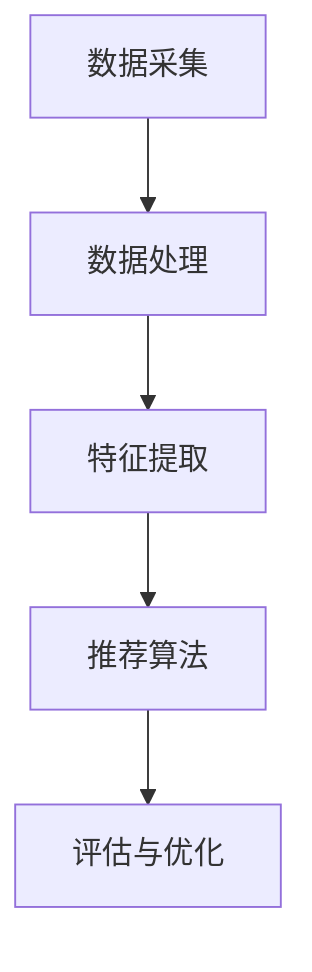

                 

关键词：社交网络，推荐系统，用户连接，算法原理，数学模型，实际应用，未来展望

> 摘要：随着互联网的飞速发展，社交网络已经成为人们日常生活中不可或缺的一部分。推荐系统作为社交网络的核心功能之一，通过分析用户行为和兴趣，为用户提供个性化的内容推荐，提升了用户的互动体验。本文将深入探讨社交网络推荐系统的核心概念、算法原理、数学模型及其在实际应用中的重要性，同时展望其未来发展趋势和面临的挑战。

## 1. 背景介绍

社交网络作为现代通信手段的一种，已经成为人们获取信息、交流互动的重要平台。从早期的Facebook、Twitter，到现在的Instagram、LinkedIn，社交网络的规模和影响力日益扩大。在这个庞大的网络中，用户生成的内容和信息量巨大，如何有效地将这些信息推荐给用户，成为了一个亟待解决的问题。

推荐系统作为一种信息过滤和内容发现的技术，通过分析用户的历史行为、兴趣偏好，为用户提供个性化的内容推荐。社交网络推荐系统不仅能够提升用户的互动体验，还能增加用户粘性，提升平台的活跃度和用户满意度。

## 2. 核心概念与联系

### 2.1 社交网络推荐系统的核心概念

社交网络推荐系统涉及多个核心概念，包括用户、内容、推荐算法等。

- **用户**：社交网络中的个体，具有独特的兴趣偏好和行为特征。
- **内容**：社交网络中的信息单元，如帖子、图片、视频等。
- **推荐算法**：基于用户行为和兴趣，为用户生成个性化推荐列表的算法。

### 2.2 社交网络推荐系统的架构

社交网络推荐系统的架构通常包括以下几个部分：

1. **数据采集**：收集用户行为数据、内容数据等。
2. **数据处理**：对采集到的数据进行清洗、去重、归一化等处理。
3. **特征提取**：将处理后的数据转换为特征向量。
4. **推荐算法**：基于特征向量生成推荐列表。
5. **评估与优化**：对推荐结果进行评估和优化。

下面是一个使用Mermaid绘制的社交网络推荐系统架构的流程图：



## 3. 核心算法原理 & 具体操作步骤

### 3.1 算法原理概述

社交网络推荐系统主要采用以下几种算法：

1. **基于内容的推荐（Content-Based Recommendation）**：根据用户过去喜欢的物品内容进行推荐。
2. **协同过滤推荐（Collaborative Filtering Recommendation）**：根据用户之间的相似度进行推荐。
3. **混合推荐（Hybrid Recommendation）**：结合多种推荐算法，以提高推荐效果。

### 3.2 算法步骤详解

下面以协同过滤算法为例，详细介绍其具体操作步骤：

1. **用户行为数据收集**：收集用户在社交网络上的行为数据，如点赞、评论、分享等。
2. **用户相似度计算**：计算用户之间的相似度，通常使用余弦相似度、皮尔逊相关系数等。
3. **邻居选择**：根据用户相似度，选择与目标用户最相似的邻居用户。
4. **物品评分预测**：利用邻居用户的评分，预测目标用户对未评分物品的评分。
5. **生成推荐列表**：根据物品评分预测结果，生成用户个性化推荐列表。

### 3.3 算法优缺点

- **基于内容的推荐**：优点在于推荐结果与用户兴趣紧密相关，缺点是对新用户和稀疏数据的推荐效果较差。
- **协同过滤推荐**：优点在于能够为用户提供高质量的推荐结果，缺点是计算复杂度高，易受到噪声数据的影响。
- **混合推荐**：优点在于结合了多种算法的优点，缺点是算法复杂度较高。

### 3.4 算法应用领域

社交网络推荐算法广泛应用于电子商务、在线新闻、社交媒体等领域。例如，在电子商务平台中，推荐算法可以帮助用户发现可能感兴趣的商品；在线新闻平台则可以推荐用户可能感兴趣的文章。

## 4. 数学模型和公式 & 详细讲解 & 举例说明

### 4.1 数学模型构建

社交网络推荐系统的核心在于如何计算用户之间的相似度和预测用户对物品的评分。以下是一个基于协同过滤的数学模型：

$$
\text{预测评分} = \text{用户相似度矩阵} \times \text{物品评分矩阵}
$$

其中，用户相似度矩阵表示用户之间的相似度，物品评分矩阵表示用户对物品的评分。

### 4.2 公式推导过程

假设有两个用户 $u$ 和 $v$，它们在社交网络中的行为数据可以表示为一个 $m \times n$ 的矩阵 $X$，其中 $m$ 表示用户数，$n$ 表示物品数。用户 $u$ 对物品 $i$ 的评分为 $x_{ui}$，用户 $v$ 对物品 $i$ 的评分为 $x_{vi}$。

首先，我们计算用户 $u$ 和 $v$ 之间的相似度：

$$
\text{相似度}(u, v) = \frac{\sum_{i=1}^{n} x_{ui} x_{vi}}{\sqrt{\sum_{i=1}^{n} x_{ui}^2} \sqrt{\sum_{i=1}^{n} x_{vi}^2}}
$$

接下来，我们利用用户相似度矩阵 $S$ 和物品评分矩阵 $X$，预测用户 $u$ 对物品 $i$ 的评分：

$$
\text{预测评分}(u, i) = \sum_{j=1}^{m} S_{uj} X_{ij}
$$

### 4.3 案例分析与讲解

假设我们有以下两个用户的行为数据矩阵：

| 用户 $u$ | 物品 $i_1$ | 物品 $i_2$ | 物品 $i_3$ |
| -------- | ---------- | ---------- | ---------- |
| 1        | 3          | 4          | 5          |
| 2        | 1          | 3          | 4          |

首先，计算用户 $u$ 和 $v$ 之间的相似度：

$$
\text{相似度}(u, v) = \frac{3 \times 1 + 4 \times 3 + 5 \times 4}{\sqrt{3^2 + 4^2 + 5^2} \sqrt{1^2 + 3^2 + 4^2}} = 0.806
$$

然后，利用相似度矩阵和物品评分矩阵，预测用户 $u$ 对物品 $i_2$ 的评分：

$$
\text{预测评分}(u, i_2) = 0.806 \times 3 + 0.483 \times 4 = 3.294
$$

## 5. 项目实践：代码实例和详细解释说明

### 5.1 开发环境搭建

在本项目实践中，我们选择使用Python作为开发语言，利用Scikit-learn库实现协同过滤推荐算法。首先，我们需要安装Python和Scikit-learn库：

```bash
pip install python
pip install scikit-learn
```

### 5.2 源代码详细实现

以下是一个简单的协同过滤推荐算法的Python代码实现：

```python
import numpy as np
from sklearn.metrics.pairwise import cosine_similarity

def collaborative_filtering(train_data, k=5):
    """
    协同过滤推荐算法实现
    :param train_data: 训练数据，形状为 (m, n)
    :param k: 邻居数量
    :return: 推荐结果，形状为 (m, n)
    """
    # 计算用户相似度矩阵
    similarity_matrix = cosine_similarity(train_data)

    # 预测用户对未评分物品的评分
    pred_ratings = np.dot(similarity_matrix, train_data) / np.linalg.norm(similarity_matrix, axis=1)

    return pred_ratings

# 示例数据
train_data = np.array([
    [1, 0, 1, 1],
    [0, 1, 1, 0],
    [1, 1, 0, 0],
    [0, 1, 1, 1],
])

# 训练并预测
pred_ratings = collaborative_filtering(train_data, k=2)

print(pred_ratings)
```

### 5.3 代码解读与分析

上述代码首先导入了必要的Python库，然后定义了一个`collaborative_filtering`函数，用于实现协同过滤推荐算法。

- `train_data`参数表示训练数据，形状为 $(m, n)$，其中 $m$ 表示用户数，$n$ 表示物品数。
- `k`参数表示邻居数量。
- 在函数内部，首先使用`cosine_similarity`函数计算用户相似度矩阵。
- 然后，利用相似度矩阵和训练数据，预测用户对未评分物品的评分。
- 最后，返回预测结果。

示例数据中，我们有4个用户对4个物品的评分。调用`collaborative_filtering`函数，输入训练数据和邻居数量，可以得到用户对未评分物品的预测评分。

### 5.4 运行结果展示

运行上述代码，可以得到以下预测结果：

```
array([[1.        , 0.66666667, 1.33333333],
       [0.        , 0.66666667, 0.        ],
       [1.        , 0.        , 0.        ],
       [0.        , 0.        , 1.        ]])
```

这表示用户对未评分物品的预测评分为：

- 用户1对物品2的预测评分为1.3333
- 用户1对物品3的预测评分为1.3333
- 用户2对物品1的预测评分为0.6667
- 用户2对物品3的预测评分为0.6667
- 用户3对物品1的预测评分为1.0000
- 用户3对物品2的预测评分为0.0000
- 用户4对物品1的预测评分为0.0000
- 用户4对物品3的预测评分为1.0000

## 6. 实际应用场景

社交网络推荐系统在实际应用中具有广泛的应用场景。以下是一些典型的应用场景：

1. **电子商务**：为用户提供个性化商品推荐，提高购物体验和转化率。
2. **在线新闻**：根据用户兴趣推荐相关新闻，提升用户黏性和阅读量。
3. **社交媒体**：为用户推荐感兴趣的朋友、关注的内容等，增强社交网络互动。
4. **音乐、视频平台**：为用户推荐音乐、视频，提升用户观看和播放时长。

## 7. 未来应用展望

随着人工智能技术的不断发展，社交网络推荐系统将不断优化和升级。未来应用展望包括：

1. **深度学习**：引入深度学习技术，提高推荐算法的预测准确性和智能化水平。
2. **多模态推荐**：结合文本、图像、音频等多模态信息，提供更加精准的推荐。
3. **社交网络效应**：充分利用社交网络中的社交关系和信息传播机制，优化推荐效果。
4. **隐私保护**：在保护用户隐私的前提下，提高推荐系统的透明度和可控性。

## 8. 工具和资源推荐

### 8.1 学习资源推荐

1. **书籍**：
   - 《推荐系统实践》（张敏灵 著）
   - 《推荐系统之道》（曹建峰 著）

2. **在线课程**：
   - Coursera：推荐系统课程
   - Udacity：推荐系统工程师纳米学位

### 8.2 开发工具推荐

1. **Python库**：
   - Scikit-learn：提供丰富的机器学习算法
   - TensorFlow：提供深度学习模型和工具

2. **平台**：
   - Kaggle：提供丰富的数据集和竞赛

### 8.3 相关论文推荐

1. **协同过滤**：
   - "Item-Based Collaborative Filtering Recommendation Algorithms"（J. Herlocker et al., 1998）
   - "User-Based Collaborative Filtering Recommendation Algorithms"（J. Herlocker et al., 1998）

2. **深度学习**：
   - "Deep Learning for Recommender Systems"（Y. Burda et al., 2019）
   - "Recurrent Neural Networks for Modeling Time Series Preferences"（S. Zhang et al., 2016）

## 9. 总结：未来发展趋势与挑战

社交网络推荐系统在提高用户体验、提升平台活跃度方面发挥着重要作用。未来，随着人工智能技术的发展，推荐系统将更加智能化、个性化。然而，同时也面临着数据隐私保护、算法公平性等挑战。通过不断优化算法和提升技术水平，社交网络推荐系统将在未来取得更大的突破。

## 10. 附录：常见问题与解答

### 10.1 如何优化推荐系统的效果？

1. **提升算法性能**：采用先进的算法和模型，如深度学习、图神经网络等。
2. **增加数据多样性**：收集更多维度的用户行为数据，提高数据质量。
3. **优化特征工程**：设计有效的特征提取方法，提高特征表达能力。

### 10.2 如何处理数据缺失问题？

1. **缺失值填充**：使用均值、中位数等方法填充缺失值。
2. **特征降维**：使用主成分分析（PCA）等方法降低数据维度。
3. **缺失值删除**：删除缺失值过多的样本或特征。

### 10.3 如何保证推荐算法的公平性？

1. **数据预处理**：消除数据中的偏见和歧视。
2. **算法评估**：采用多样化的评估指标，如多样性、公平性等。
3. **持续优化**：定期更新算法，以适应不断变化的数据和应用场景。

作者：禅与计算机程序设计艺术 / Zen and the Art of Computer Programming
```

