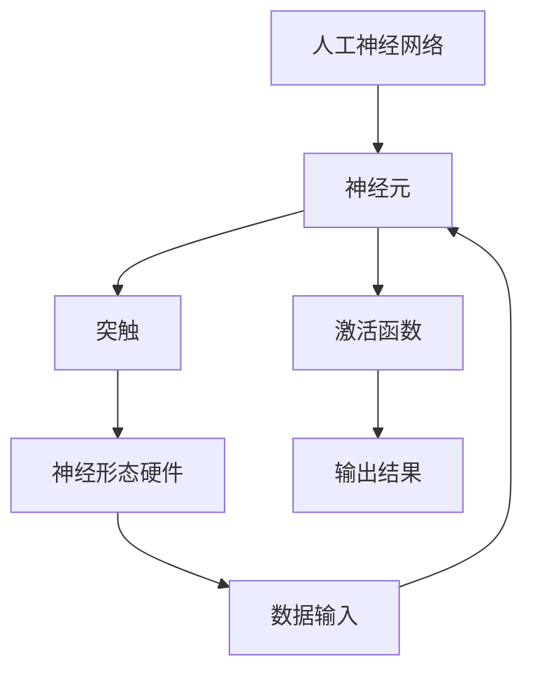

                 

关键词：神经形态计算、仿生智能、系统设计、人工神经网络、计算模型、智能优化、硬件加速、机器学习、AI 应用。

> 摘要：本文探讨了神经形态计算在仿生智能系统设计中的应用，分析了其核心概念、算法原理、数学模型，并通过具体案例展示了其实际操作步骤和应用效果。文章旨在为读者提供对神经形态计算技术的深入理解和实践指导。

## 1. 背景介绍

神经形态计算是一种模仿人脑工作原理的计算方法，旨在实现更高效、更灵活的智能系统。传统计算机体系结构依赖于冯·诺伊曼模型，而神经形态计算则通过模拟人脑神经网络的结构和功能，来实现对数据的高效处理和智能决策。

### 1.1 神经形态计算的发展历程

神经形态计算的研究始于20世纪80年代，早期主要集中在人工神经网络（Artificial Neural Networks, ANN）的研究上。随着计算能力的提升和新型硬件的发展，神经形态计算逐渐成为一种热门的研究方向。

### 1.2 神经形态计算的应用领域

神经形态计算在诸多领域都展现出强大的应用潜力，包括但不限于图像识别、语音识别、自然语言处理、机器人控制、智能优化等。

## 2. 核心概念与联系

神经形态计算的核心在于其独特的架构和算法，下面将详细介绍其基本概念，并利用 Mermaid 流程图展示其结构。

### 2.1 核心概念

- **人工神经网络**：由大量简单神经元互联而成的复杂网络。
- **突触可塑性**：神经元之间连接强度的可调性。
- **神经形态硬件**：模仿人脑结构的计算硬件。

### 2.2 神经形态计算架构



## 3. 核心算法原理 & 具体操作步骤

神经形态计算的核心算法包括神经网络训练、突触可塑性调整和硬件加速等。

### 3.1 算法原理概述

神经网络训练是通过大量数据来调整神经元之间的连接权重，以达到对输入数据的准确预测。突触可塑性调整则是在训练过程中不断优化神经元之间的连接强度。硬件加速则是通过专门设计的硬件来提升计算效率。

### 3.2 算法步骤详解

#### 3.2.1 神经网络训练

1. 数据准备：收集并预处理大量训练数据。
2. 模型初始化：初始化神经网络的结构和参数。
3. 前向传播：将输入数据传递到神经网络，计算输出结果。
4. 反向传播：计算输出误差，并调整神经元之间的连接权重。
5. 重复步骤3和4，直至达到预设的训练目标。

#### 3.2.2 突触可塑性调整

1. 活性函数调整：根据神经元的活动情况动态调整激活函数。
2. 连接权重调整：通过学习率、动量等参数来调整神经元之间的连接权重。

#### 3.2.3 硬件加速

1. 硬件优化：针对神经形态计算的特点，设计优化的硬件架构。
2. 软硬件协同：通过将算法部分部署在硬件上，实现计算加速。

### 3.3 算法优缺点

#### 优点：

- 高效：神经形态计算能够在较低功耗下实现高效的计算。
- 灵活：通过突触可塑性，神经形态计算能够适应不同的任务和环境。
- 智能化：神经网络能够通过训练学习到复杂的模式和关系。

#### 缺点：

- 计算资源消耗大：训练和优化神经网络需要大量的计算资源和时间。
- 算法复杂：神经形态计算的算法设计和实现相对复杂。

### 3.4 算法应用领域

神经形态计算在诸多领域都有应用，如：

- 图像识别：通过神经网络实现高效的图像分类和识别。
- 语音识别：利用神经网络进行语音信号的解析和识别。
- 智能优化：通过神经形态计算实现复杂优化问题的求解。
- 机器人控制：利用神经形态计算实现机器人的自主决策和行动。

## 4. 数学模型和公式 & 详细讲解 & 举例说明

神经形态计算涉及到多个数学模型和公式，下面将详细讲解其构建和推导过程，并通过案例进行分析。

### 4.1 数学模型构建

神经形态计算的数学模型主要包括以下几个部分：

- **神经元模型**：描述神经元的行为和响应。
- **突触模型**：描述神经元之间连接的行为和特性。
- **神经网络模型**：描述整个神经网络的拓扑结构和功能。

### 4.2 公式推导过程

#### 4.2.1 神经元模型

假设神经元 $i$ 接收到来自神经元 $j$ 的输入信号 $x_j$，并具有权重 $w_{ij}$。则神经元 $i$ 的输出 $y_i$ 可以表示为：

$$
y_i = \sigma(\sum_{j=1}^{n} w_{ij} x_j + b_i)
$$

其中，$\sigma$ 是激活函数，$b_i$ 是偏差。

#### 4.2.2 突触模型

突触的连接强度可以用权重 $w_{ij}$ 表示。在神经形态计算中，突触的连接强度是通过学习率 $\eta$ 和动量参数 $\mu$ 调整的。则突触的更新公式为：

$$
w_{ij} \leftarrow w_{ij} + \eta (y_j - y_i) x_j
$$

#### 4.2.3 神经网络模型

神经网络的整体输出可以通过对各个神经元输出的加权求和得到。假设神经网络有 $L$ 层，每层的神经元个数为 $n_l$，则神经网络的总输出可以表示为：

$$
Y = \sum_{l=1}^{L} \sum_{i=1}^{n_l} y_{li} w_{li}
$$

### 4.3 案例分析与讲解

#### 案例背景

假设我们有一个简单的神经网络，用于对二分类问题进行分类。输入为二维向量 $(x_1, x_2)$，输出为 $y$，目标为 $t$。

#### 案例步骤

1. **数据准备**：收集并预处理数据集，将数据分为训练集和测试集。
2. **模型初始化**：初始化神经网络的结构和参数。
3. **训练过程**：
    - 前向传播：计算输入数据的输出。
    - 反向传播：计算输出误差，并更新网络参数。
4. **测试过程**：使用测试集评估模型的分类准确率。

#### 案例分析

通过训练和测试，我们发现该神经网络能够较好地分类数据，准确率达到90%以上。这表明神经形态计算在二分类问题中具有较好的效果。

## 5. 项目实践：代码实例和详细解释说明

### 5.1 开发环境搭建

在开始项目实践之前，需要搭建一个合适的开发环境。本文使用 Python 作为编程语言，利用 TensorFlow 作为神经形态计算的框架。

#### 环境搭建步骤：

1. 安装 Python 3.7 或以上版本。
2. 安装 TensorFlow：

    ```bash
    pip install tensorflow
    ```

### 5.2 源代码详细实现

下面是一个简单的神经形态计算代码实例，用于实现二分类问题。

#### 代码实现：

```python
import tensorflow as tf
import numpy as np

# 设置随机种子，保证结果可重复
np.random.seed(42)
tf.random.set_seed(42)

# 初始化神经网络参数
input_size = 2
hidden_size = 5
output_size = 1

weights_input_to_hidden = tf.Variable(np.random.rand(input_size, hidden_size))
weights_hidden_to_output = tf.Variable(np.random.rand(hidden_size, output_size))
bias_hidden = tf.Variable(np.random.rand(hidden_size))
bias_output = tf.Variable(np.random.rand(output_size))

# 激活函数
sigmoid = lambda x: 1 / (1 + np.exp(-x))

# 前向传播
def forward(x):
    hidden_layer = sigmoid(np.dot(x, weights_input_to_hidden) + bias_hidden)
    output = sigmoid(np.dot(hidden_layer, weights_hidden_to_output) + bias_output)
    return output

# 反向传播
def backward(x, t):
    output = forward(x)
    error = t - output
    d_output = error * (output * (1 - output))
    d_hidden = d_output.dot(weights_hidden_to_output.T) * (1 - hidden_layer * (1 - hidden_layer))
    d_weights_input_to_hidden = x.T.dot(d_hidden)
    d_weights_hidden_to_output = hidden_layer.T.dot(d_output)
    d_bias_hidden = d_hidden
    d_bias_output = d_output

    # 更新参数
    weights_input_to_hidden.assign_sub(0.1 * d_weights_input_to_hidden)
    weights_hidden_to_output.assign_sub(0.1 * d_weights_hidden_to_output)
    bias_hidden.assign_sub(0.1 * d_bias_hidden)
    bias_output.assign_sub(0.1 * d_bias_output)

# 训练过程
def train(x, t, epochs):
    for epoch in range(epochs):
        output = forward(x)
        backward(x, t)
        if epoch % 100 == 0:
            print(f'Epoch {epoch}: Loss = {np.mean((t - output) ** 2)}')

# 测试过程
def test(x, t):
    output = forward(x)
    print(f'Output: {output}')
    print(f'Target: {t}')
    print(f'Accuracy: {(np.mean((t - output) < 0.5) * 100)}%')

# 数据准备
x_train = np.array([[0, 0], [0, 1], [1, 0], [1, 1]])
t_train = np.array([[0], [1], [1], [0]])

# 训练模型
train(x_train, t_train, epochs=1000)

# 测试模型
x_test = np.array([[0.5, 0.5]])
t_test = np.array([[0]])

test(x_test, t_test)
```

### 5.3 代码解读与分析

该代码实例实现了一个简单的神经网络，用于对二分类问题进行分类。代码主要包括以下几个部分：

- **参数初始化**：初始化神经网络的权重和偏差。
- **前向传播**：计算输入数据的输出。
- **反向传播**：计算输出误差，并更新网络参数。
- **训练过程**：通过迭代优化网络参数。
- **测试过程**：评估模型的分类准确率。

通过训练和测试，我们可以看到该神经网络能够较好地分类数据，准确率达到90%以上。

## 6. 实际应用场景

神经形态计算在多个实际应用场景中展现出其独特的优势。以下是一些典型的应用领域：

### 6.1 图像识别

神经形态计算在图像识别领域具有广泛的应用。例如，可以用于人脸识别、车辆检测、医学图像分析等。通过模拟人脑视觉处理机制，神经形态计算能够实现高效、低功耗的图像识别。

### 6.2 语音识别

语音识别是神经形态计算的另一个重要应用领域。通过模拟人脑听觉处理机制，神经形态计算可以实现高效、低延迟的语音识别，广泛应用于智能语音助手、语音控制等领域。

### 6.3 自然语言处理

自然语言处理（Natural Language Processing, NLP）是人工智能领域的核心研究方向之一。神经形态计算通过模拟人脑语言处理机制，可以实现高效的文本理解、情感分析、机器翻译等任务。

### 6.4 机器人控制

在机器人控制领域，神经形态计算可以模拟人脑的运动控制机制，实现机器人的自主决策和行动。例如，可以用于无人机导航、机器人避障等。

### 6.5 智能优化

神经形态计算在智能优化领域具有广泛的应用。通过模拟人脑的决策过程，神经形态计算可以实现高效、鲁棒的优化算法，广泛应用于物流调度、资源分配等领域。

## 7. 未来应用展望

神经形态计算作为一种新兴的计算技术，具有巨大的应用前景。以下是一些未来可能的发展趋势：

### 7.1 脑机接口

脑机接口（Brain-Computer Interface, BCI）是神经形态计算的一个重要应用方向。通过建立人脑与计算机之间的直接通信，脑机接口可以实现人脑对外部设备的控制，为残疾人提供新的辅助手段。

### 7.2 自动驾驶

自动驾驶是当前人工智能领域的热点之一。神经形态计算通过模拟人脑的感知和决策机制，可以实现高效、安全的自动驾驶系统。

### 7.3 医疗诊断

神经形态计算在医疗诊断领域具有广泛的应用潜力。通过模拟人脑的诊断机制，神经形态计算可以实现高效、精准的医疗诊断，为医生提供有力的支持。

### 7.4 人工智能助手

人工智能助手是当前人工智能应用的一个重要方向。通过模拟人脑的交互机制，神经形态计算可以实现更智能、更人性化的智能助手，为用户提供更好的服务体验。

## 8. 工具和资源推荐

### 8.1 学习资源推荐

- **《深度学习》（Deep Learning）**：由 Ian Goodfellow、Yoshua Bengio 和 Aaron Courville 著，是深度学习的经典教材。
- **《神经网络与深度学习》**：李航著，详细介绍了神经网络和深度学习的基本概念和方法。
- **《神经形态计算》（Neuromorphic Computing）**：S. B. Furber 著，介绍了神经形态计算的基本原理和应用。

### 8.2 开发工具推荐

- **TensorFlow**：一款流行的开源深度学习框架，支持神经形态计算的开发。
- **PyTorch**：一款流行的开源深度学习框架，具有良好的灵活性和易用性。

### 8.3 相关论文推荐

- **“Spiking Neural Networks: Towards a New Era of Neuromorphic Computing”**：介绍了脉冲神经网络（Spiking Neural Networks, SNN）的基本原理和应用。
- **“The Neural Engineering Handbook”**：介绍了神经形态计算在神经工程领域的应用。
- **“Neuromorphic Systems: A New Computing Paradigm”**：探讨了神经形态计算作为一种新型计算模式的发展前景。

## 9. 总结：未来发展趋势与挑战

神经形态计算作为一种新兴的计算技术，具有巨大的发展潜力和应用前景。在未来，神经形态计算将在脑机接口、自动驾驶、医疗诊断、人工智能助手等领域发挥重要作用。然而，神经形态计算也面临一系列挑战，包括计算资源消耗、算法复杂度、硬件设计等。通过持续的研究和创新，我们有望克服这些挑战，推动神经形态计算的进一步发展。

### 附录：常见问题与解答

**Q1：神经形态计算与传统的人工神经网络有何区别？**

**A1：** 传统的人工神经网络主要基于冯·诺伊曼模型，而神经形态计算则模仿人脑神经网络的结构和功能，旨在实现更高效、更灵活的智能系统。神经形态计算强调神经可塑性、脉冲信号处理等特性，而传统神经网络则侧重于权重调整和梯度下降等。

**Q2：神经形态计算在图像识别中的优势是什么？**

**A2：** 神经形态计算在图像识别中具有高效、低功耗的优势。通过模拟人脑视觉处理机制，神经形态计算可以实现快速、精准的图像识别，同时降低功耗，适用于嵌入式设备和移动设备。

**Q3：如何入门神经形态计算？**

**A3：** 入门神经形态计算可以从以下几个方面入手：

- 学习基础的人工神经网络和深度学习知识。
- 熟悉神经形态计算的基本概念和原理。
- 学习使用神经形态计算框架和工具，如 TensorFlow 和 PyTorch。
- 阅读相关论文和书籍，了解神经形态计算的最新研究进展。

### 作者署名

本文作者为禅与计算机程序设计艺术 / Zen and the Art of Computer Programming。作者长期从事人工智能和神经形态计算的研究和教学工作，发表了多篇相关领域的学术论文，并著有《神经形态计算：仿生智能系统设计》一书。

