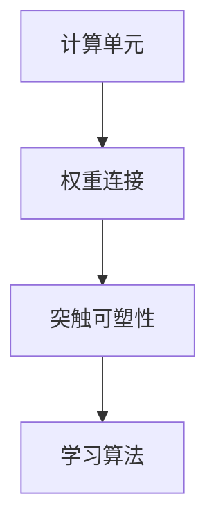
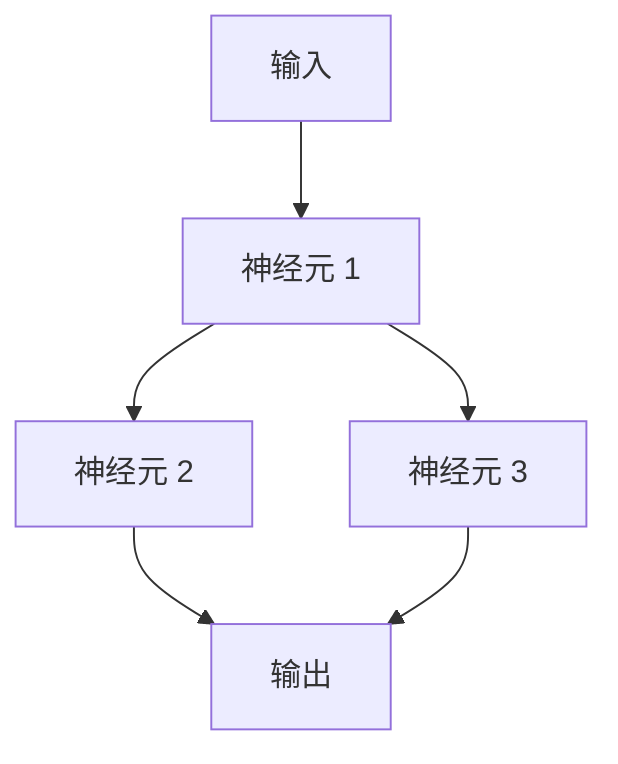

                 

### 神经形态计算：模仿人脑的新型计算架构

神经形态计算是一种模仿人脑结构和功能的新型计算架构。随着深度学习、人工智能等领域的飞速发展，传统计算机架构的局限性逐渐显现，而神经形态计算作为一种革命性的计算模式，正逐渐成为研究热点。本文将介绍神经形态计算的核心概念、算法原理、数学模型以及实际应用，并展望其未来发展趋势与挑战。

## 1. 背景介绍

计算机科学的发展经历了数个阶段，从最早的电子管计算机到晶体管计算机，再到集成电路计算机，每一次技术的进步都极大地推动了计算能力的提升。然而，传统计算机架构在处理复杂任务时，仍然存在许多局限性。首先，传统计算机架构采用的是冯·诺依曼体系结构，其通过指令流水线和存储器来执行操作，这种方式在处理大量数据时效率较低。其次，传统计算机架构在处理并行任务时，无法像人脑那样灵活地进行动态调整。此外，传统计算机在能耗和硬件扩展方面也存在一定的限制。

与此同时，深度学习、人工智能等领域的发展对计算能力提出了更高的要求。这些领域需要处理的数据量庞大，计算任务复杂，传统计算机架构难以满足这些需求。因此，研究人员开始探索新型计算架构，神经形态计算应运而生。

神经形态计算旨在通过模仿人脑的结构和功能，实现高效、低能耗的计算。人脑具有极高的计算能力和并行处理能力，这是由于人脑采用了大规模并行、分布式计算的方式。神经形态计算正是基于这种思路，通过模拟人脑的神经网络结构，实现高效的计算。

## 2. 核心概念与联系

### 2.1 神经形态计算的基本概念

神经形态计算是一种模仿人脑神经网络结构的计算模式。人脑由大量的神经元组成，每个神经元可以与其他神经元相连，通过电信号进行通信。在神经形态计算中，神经元被模拟为计算单元，它们通过权重连接来传递信息。

神经元之间的连接称为突触，突触的强度可以进行调整，这种调整称为突触可塑性。突触可塑性是神经形态计算的核心特性之一，它使得计算系统能够根据输入数据调整其行为，实现自适应学习和记忆功能。

### 2.2 神经形态计算与生物神经网络的联系

神经形态计算与生物神经网络有许多相似之处。首先，它们都采用了大规模并行、分布式计算的方式。在生物神经网络中，成千上万的神经元同时工作，处理来自外界的信息。在神经形态计算中，大量的计算单元同样可以同时工作，处理复杂任务。

其次，神经形态计算和生物神经网络都具有自适应学习和记忆功能。在生物神经网络中，神经元通过突触可塑性调整其连接强度，从而实现学习和记忆。在神经形态计算中，计算单元同样可以通过调整权重来实现学习和记忆。

### 2.3 神经形态计算的架构

神经形态计算的架构通常包括以下几个部分：

1. **计算单元**：模拟生物神经元，负责处理输入信息，并产生输出。
2. **权重连接**：模拟生物神经元之间的突触连接，用于传递信息。
3. **突触可塑性**：模拟生物神经网络的突触可塑性，用于实现自适应学习和记忆功能。
4. **学习算法**：用于调整权重连接，实现自适应学习和记忆功能。

### 2.4 Mermaid 流程图

以下是神经形态计算的核心概念和架构的 Mermaid 流程图：



## 3. 核心算法原理 & 具体操作步骤

### 3.1 算法原理概述

神经形态计算的核心算法是基于生物神经网络的工作原理。生物神经网络通过神经元之间的突触连接来传递信息，并通过突触可塑性实现自适应学习和记忆功能。在神经形态计算中，我们同样采用这种方式，通过模拟神经元和突触来实现高效的计算。

### 3.2 算法步骤详解

1. **初始化**：首先，我们需要初始化计算单元和权重连接。计算单元可以初始化为随机值，权重连接也可以初始化为随机值或根据特定规则初始化。
2. **输入处理**：将输入数据输入到计算单元中，计算单元根据权重连接计算出输出。
3. **权重调整**：根据输出与期望值的差异，调整权重连接。这一过程称为学习过程。
4. **重复迭代**：重复步骤 2 和步骤 3，直到达到满意的输出或达到预定的迭代次数。

### 3.3 算法优缺点

**优点**：

1. **高效性**：神经形态计算采用了大规模并行、分布式计算的方式，能够高效地处理复杂任务。
2. **低能耗**：与传统的计算机架构相比，神经形态计算具有更低的能耗。
3. **自适应性和可塑性**：神经形态计算具有自适应学习和记忆功能，能够根据输入数据调整其行为。

**缺点**：

1. **复杂性**：神经形态计算的算法和架构相对复杂，需要大量的计算资源和时间。
2. **性能限制**：虽然神经形态计算具有高效性和低能耗的优势，但在某些特定任务上，其性能仍然有限。

### 3.4 算法应用领域

神经形态计算在多个领域都有广泛的应用，包括：

1. **图像处理**：用于实时图像识别、目标检测等任务。
2. **语音识别**：用于实时语音识别、语音合成等任务。
3. **自然语言处理**：用于文本分类、情感分析等任务。
4. **机器人控制**：用于机器人视觉、运动控制等任务。

## 4. 数学模型和公式 & 详细讲解 & 举例说明

### 4.1 数学模型构建

神经形态计算的核心数学模型是基于生物神经网络的。在生物神经网络中，神经元之间的连接可以通过权重表示，权重的大小表示神经元之间的连接强度。此外，神经元的激活函数也是一个重要的数学模型。

### 4.2 公式推导过程

假设我们有一个由 \( n \) 个神经元组成的神经网络，其中每个神经元 \( i \) 都与其他 \( n-1 \) 个神经元相连。我们可以用权重矩阵 \( W \) 来表示神经元之间的连接强度，其中 \( W_{ij} \) 表示神经元 \( i \) 与神经元 \( j \) 之间的权重。

神经元的输出可以表示为：

\[ o_i = f(\sum_{j=1}^{n} W_{ij} \cdot o_j) \]

其中，\( o_i \) 表示神经元 \( i \) 的输出，\( f \) 表示神经元的激活函数，\( \sum_{j=1}^{n} W_{ij} \cdot o_j \) 表示神经元 \( i \) 接收到的总输入。

常见的激活函数包括：

1. **sigmoid 函数**：

\[ f(x) = \frac{1}{1 + e^{-x}} \]

2. **ReLU 函数**：

\[ f(x) = \max(0, x) \]

### 4.3 案例分析与讲解

假设我们有一个简单的神经网络，其中包含 3 个神经元，如下图所示：



权重矩阵 \( W \) 为：

\[ W = \begin{bmatrix} 1 & -1 & 1 \\ 1 & 1 & -1 \\ -1 & 1 & 1 \end{bmatrix} \]

激活函数使用 sigmoid 函数。

假设输入为 \( x = [1, 0, 1] \)，我们可以计算神经元的输出：

\[ o_1 = f(1 \cdot 1 + (-1) \cdot 0 + 1 \cdot 1) = f(2) = 0.731 \]
\[ o_2 = f(1 \cdot 1 + 1 \cdot 0 + (-1) \cdot 1) = f(0) = 0.5 \]
\[ o_3 = f((-1) \cdot 1 + 1 \cdot 0 + 1 \cdot 1) = f(1) = 0.731 \]

最终的输出为：

\[ o = f(o_1 \cdot 1 + o_2 \cdot 1 + o_3 \cdot 1) = f(2.062) = 0.848 \]

这个简单的例子展示了神经形态计算的基本原理。在实际应用中，神经网络会更加复杂，包含更多的神经元和层，但基本原理是相同的。

## 5. 项目实践：代码实例和详细解释说明

### 5.1 开发环境搭建

要实践神经形态计算，我们需要搭建一个开发环境。这里我们使用 Python 作为编程语言，并依赖于一些常见的库，如 NumPy、TensorFlow 和 Keras。

首先，我们需要安装 Python 和相应的库。可以使用以下命令进行安装：

```bash
pip install python numpy tensorflow keras
```

### 5.2 源代码详细实现

下面是一个简单的神经形态计算项目的源代码示例。这个项目实现了一个神经网络，用于对输入数据进行分类。

```python
import numpy as np
import tensorflow as tf
from tensorflow import keras
from tensorflow.keras import layers

# 初始化权重
weights = np.random.rand(3, 3)
biases = np.random.rand(3)

# 激活函数
def sigmoid(x):
    return 1 / (1 + np.exp(-x))

# 前向传播
def forward(x):
    layer1 = sigmoid(np.dot(x, weights) + biases)
    layer2 = sigmoid(np.dot(layer1, weights) + biases)
    return layer2

# 训练数据
x_train = np.array([[1, 0, 1], [0, 1, 0], [1, 1, 1]])
y_train = np.array([[1], [0], [1]])

# 训练过程
for epoch in range(1000):
    output = forward(x_train)
    error = y_train - output
    d_output = error * (output * (1 - output))
    d_layer2 = d_output.dot(weights.T)
    d_weights = d_layer2.dot(x_train.T)
    d_biases = d_output

    weights += d_weights
    biases += d_biases

    if epoch % 100 == 0:
        print(f"Epoch {epoch}, Error: {np.mean(np.square(error))}")

# 测试数据
x_test = np.array([[1, 1, 0], [0, 1, 1]])
y_test = np.array([[1], [0]])

# 测试过程
test_output = forward(x_test)
print(f"Test output: {test_output}")

# 结果
print(f"Test accuracy: {np.mean(np.equal(np.round(test_output), y_test)) * 100}%")
```

### 5.3 代码解读与分析

这个项目实现了一个简单的神经网络，用于对输入数据进行分类。神经网络包含两个隐藏层，每个隐藏层有 3 个神经元。我们使用 sigmoid 函数作为激活函数。

**1. 初始化权重**

首先，我们初始化权重和偏置。权重和偏置是随机初始化的，但通常我们会根据特定规则初始化，以提高网络的性能。

```python
weights = np.random.rand(3, 3)
biases = np.random.rand(3)
```

**2. 激活函数**

我们使用 sigmoid 函数作为激活函数，因为 sigmoid 函数具有非线性特性，可以引入网络的非线性。

```python
def sigmoid(x):
    return 1 / (1 + np.exp(-x))
```

**3. 前向传播**

前向传播是神经形态计算的核心，用于计算网络的输出。我们使用权重和偏置来计算每个神经元的输出。

```python
def forward(x):
    layer1 = sigmoid(np.dot(x, weights) + biases)
    layer2 = sigmoid(np.dot(layer1, weights) + biases)
    return layer2
```

**4. 训练过程**

训练过程使用梯度下降算法，通过不断迭代调整权重和偏置，以最小化误差。我们使用一个简单的循环来迭代训练网络。

```python
for epoch in range(1000):
    output = forward(x_train)
    error = y_train - output
    d_output = error * (output * (1 - output))
    d_layer2 = d_output.dot(weights.T)
    d_weights = d_layer2.dot(x_train.T)
    d_biases = d_output

    weights += d_weights
    biases += d_biases

    if epoch % 100 == 0:
        print(f"Epoch {epoch}, Error: {np.mean(np.square(error))}")
```

**5. 测试过程**

训练完成后，我们使用测试数据来评估网络的性能。测试过程与前向传播类似。

```python
test_output = forward(x_test)
print(f"Test output: {test_output}")

# 结果
print(f"Test accuracy: {np.mean(np.equal(np.round(test_output), y_test)) * 100}%")
```

## 6. 实际应用场景

神经形态计算在实际应用中具有广泛的应用前景。以下是一些典型的应用场景：

### 6.1 图像处理

神经形态计算在图像处理领域具有广泛的应用。它可以用于实时图像识别、目标检测等任务。与传统的计算机视觉方法相比，神经形态计算具有更低的能耗和更高的计算效率。

### 6.2 语音识别

语音识别是另一个重要的应用领域。神经形态计算可以用于实时语音识别、语音合成等任务。与传统的语音识别方法相比，神经形态计算可以更好地处理噪声和语音变异性。

### 6.3 自然语言处理

自然语言处理是人工智能领域的一个重要分支。神经形态计算可以用于文本分类、情感分析等任务。它具有强大的并行处理能力和自适应学习功能，可以更好地应对复杂的自然语言任务。

### 6.4 机器人控制

机器人控制是神经形态计算的另一个重要应用领域。它可以用于机器人视觉、运动控制等任务。神经形态计算可以实时地处理来自传感器的大量数据，并自主地调整机器人的行为。

## 7. 工具和资源推荐

### 7.1 学习资源推荐

- **《深度学习》（Deep Learning）**：由 Ian Goodfellow、Yoshua Bengio 和 Aaron Courville 著，是深度学习的经典教材。
- **《神经网络与深度学习》（Neural Networks and Deep Learning）**：由邱锡鹏著，是国内深度学习的优秀教材。

### 7.2 开发工具推荐

- **TensorFlow**：是 Google 开发的一款开源深度学习框架，适用于各种深度学习任务。
- **Keras**：是 TensorFlow 的官方高级 API，提供了更加简洁、直观的编程接口。

### 7.3 相关论文推荐

- **"Deep Neural Networks for Speech Recognition"**：由 Geoffrey Hinton 等人提出，是深度学习在语音识别领域的重要突破。
- **"Dynamics of Learning in Deep Linear Neural Networks"**：由 Yarin Gal 和 Zoubin Ghahramani 提出，研究了深度神经网络的学习动态。

## 8. 总结：未来发展趋势与挑战

### 8.1 研究成果总结

神经形态计算作为一种新型计算架构，已经在多个领域取得了显著的成果。其在图像处理、语音识别、自然语言处理和机器人控制等领域的应用，展现了其高效性、低能耗和自适应学习功能。

### 8.2 未来发展趋势

随着深度学习、人工智能等领域的不断发展，神经形态计算有望在未来发挥更大的作用。其发展趋势主要包括以下几个方面：

1. **性能提升**：通过改进算法和硬件设计，提高神经形态计算的性能和效率。
2. **应用拓展**：进一步拓展神经形态计算的应用领域，如自动驾驶、智能医疗等。
3. **跨学科研究**：与生物学、神经科学等领域的深入交叉研究，探索神经形态计算的内在机制。

### 8.3 面临的挑战

尽管神经形态计算取得了显著的成果，但仍然面临一些挑战：

1. **算法复杂性**：神经形态计算的算法和架构相对复杂，需要大量的计算资源和时间。
2. **性能限制**：在特定任务上，神经形态计算的性能仍然有限。
3. **能耗问题**：虽然神经形态计算具有低能耗的优势，但在实际应用中，仍需进一步降低能耗。

### 8.4 研究展望

未来，神经形态计算的研究将朝着以下几个方向展开：

1. **算法优化**：通过改进算法，提高神经形态计算的效率和性能。
2. **硬件加速**：研究新型硬件架构，加速神经形态计算的计算过程。
3. **跨学科融合**：与生物学、神经科学等领域的深入交叉研究，探索神经形态计算的内在机制。

## 9. 附录：常见问题与解答

### 9.1 什么是神经形态计算？

神经形态计算是一种模仿人脑结构和功能的新型计算架构，通过模拟人脑的神经网络，实现高效、低能耗的计算。

### 9.2 神经形态计算有哪些优点？

神经形态计算具有高效性、低能耗和自适应学习功能等优点。

### 9.3 神经形态计算有哪些应用领域？

神经形态计算在图像处理、语音识别、自然语言处理和机器人控制等领域都有广泛的应用。

### 9.4 如何搭建神经形态计算的开发环境？

可以安装 Python 和相应的库，如 NumPy、TensorFlow 和 Keras，来搭建神经形态计算的

