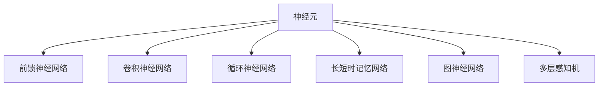

                 

关键词：神经网络、架构设计、机器学习、深度学习、AI

摘要：本文旨在探讨神经网络架构设计的原则、核心概念及其应用。从简单到复杂，我们将深入剖析不同类型的神经网络架构，分析其优缺点，并探讨未来的发展趋势与挑战。通过本文，读者将更好地理解神经网络架构设计的重要性，以及如何在实际项目中应用这些架构。

## 1. 背景介绍

### 1.1  神经网络的起源与发展

神经网络（Neural Networks）的概念最早可以追溯到1943年，由心理学家McCulloch和数学家Pitts提出。然而，由于计算能力和数据资源限制，神经网络的研究进展缓慢。直到1980年代，随着计算机性能的不断提升和海量数据的积累，神经网络研究才逐渐复苏。

### 1.2  机器学习与深度学习的兴起

机器学习（Machine Learning）是一门人工智能（Artificial Intelligence，AI）的分支，它通过算法让计算机从数据中学习，从而做出决策或预测。深度学习（Deep Learning）是机器学习的一个子领域，其核心思想是模拟人脑神经网络进行学习。

### 1.3  神经网络架构设计的重要性

神经网络架构设计在深度学习应用中起着至关重要的作用。一个优秀的神经网络架构能够提高模型性能、降低计算复杂度、增强泛化能力。因此，了解不同的神经网络架构设计原则和策略，对于深度学习研究和应用具有重要意义。

## 2. 核心概念与联系

### 2.1  神经元与神经网络

神经元是神经网络的基本构建块，它接收输入信号、通过权重进行加权求和，然后通过激活函数产生输出。神经网络由大量神经元组成，通过层级结构连接形成。

### 2.2  前馈神经网络

前馈神经网络（Feedforward Neural Network）是一种简单的神经网络架构，其信息传递方向是单向的，从输入层经过隐藏层传递到输出层。这种架构易于实现，且具有较好的可解释性。

### 2.3  卷积神经网络

卷积神经网络（Convolutional Neural Network，CNN）是一种专门用于图像识别和处理的神经网络架构。其核心思想是通过卷积操作提取图像特征，并通过池化操作减少参数数量，从而提高模型性能。

### 2.4  循环神经网络

循环神经网络（Recurrent Neural Network，RNN）是一种能够处理序列数据的神经网络架构。其特点是能够利用历史信息进行预测，但存在梯度消失和梯度爆炸等问题。

### 2.5  长短时记忆网络

长短时记忆网络（Long Short-Term Memory，LSTM）是RNN的一种改进，通过引入门控机制，解决了RNN梯度消失和梯度爆炸的问题，从而能够更好地处理长期依赖关系。

### 2.6  图神经网络

图神经网络（Graph Neural Network，GNN）是一种专门用于处理图结构数据的神经网络架构。其核心思想是通过图卷积操作提取图结构特征，并在不同层之间传递信息。

### 2.7  多层感知机

多层感知机（Multilayer Perceptron，MLP）是一种前馈神经网络，由输入层、多个隐藏层和输出层组成。它能够学习复杂的非线性函数，但在处理大型数据时存在计算复杂度高的问题。

### 2.8  Mermaid 流程图



## 3. 核心算法原理 & 具体操作步骤

### 3.1  算法原理概述

神经网络架构设计的关键在于如何选择合适的算法和操作步骤。下面，我们将介绍几种常见的神经网络架构及其算法原理。

### 3.2  算法步骤详解

1. **前馈神经网络**：

   - 输入层：接收输入数据。
   - 隐藏层：通过权重进行加权求和，然后通过激活函数产生输出。
   - 输出层：输出预测结果。

2. **卷积神经网络**：

   - 卷积层：通过卷积操作提取图像特征。
   - 池化层：通过池化操作减少参数数量。
   - 全连接层：将卷积层和池化层的输出进行全连接，产生预测结果。

3. **循环神经网络**：

   - 输入层：接收输入序列。
   - 隐藏层：通过循环操作，将历史信息传递到当前时刻。
   - 输出层：输出预测结果。

4. **长短时记忆网络**：

   - 输入层：接收输入序列。
   - 隐藏层：通过门控机制，解决长期依赖问题。
   - 输出层：输出预测结果。

5. **图神经网络**：

   - 输入层：接收图结构数据。
   - 卷积层：通过图卷积操作提取图结构特征。
   - 输出层：输出预测结果。

### 3.3  算法优缺点

- **前馈神经网络**：

  - 优点：实现简单、可解释性强。
  - 缺点：处理大型数据时计算复杂度高。

- **卷积神经网络**：

  - 优点：能够有效处理图像数据。
  - 缺点：对其他类型的数据处理能力较弱。

- **循环神经网络**：

  - 优点：能够处理序列数据。
  - 缺点：存在梯度消失和梯度爆炸问题。

- **长短时记忆网络**：

  - 优点：能够解决长期依赖问题。
  - 缺点：计算复杂度高、参数数量多。

- **图神经网络**：

  - 优点：能够处理图结构数据。
  - 缺点：对其他类型的数据处理能力较弱。

### 3.4  算法应用领域

- **前馈神经网络**：广泛应用于图像分类、回归和预测任务。

- **卷积神经网络**：广泛应用于图像识别、物体检测和图像生成任务。

- **循环神经网络**：广泛应用于语音识别、自然语言处理和序列预测任务。

- **长短时记忆网络**：广泛应用于时间序列分析、情感分析和机器翻译任务。

- **图神经网络**：广泛应用于社交网络分析、推荐系统和知识图谱表示任务。

## 4. 数学模型和公式 & 详细讲解 & 举例说明

### 4.1  数学模型构建

神经网络架构设计的核心在于数学模型的构建。下面，我们将介绍几种常见的神经网络模型及其数学表示。

### 4.2  公式推导过程

#### 4.2.1  前馈神经网络

假设输入层有\( n \)个神经元，隐藏层有\( m \)个神经元，输出层有\( k \)个神经元。则前馈神经网络的数学模型可以表示为：

\[ y = \sigma(W_2 \cdot \sigma(W_1 \cdot x + b_1) + b_2) \]

其中，\( x \)为输入向量，\( y \)为输出向量，\( \sigma \)为激活函数，\( W_1 \)、\( W_2 \)为权重矩阵，\( b_1 \)、\( b_2 \)为偏置向量。

#### 4.2.2  卷积神经网络

卷积神经网络的数学模型可以表示为：

\[ h_{ij} = \sum_{k=1}^{m} W_{ik} \cdot h_{kj-1} + b_i \]

其中，\( h \)为卷积层输出，\( W \)为卷积核，\( b \)为偏置。

#### 4.2.3  循环神经网络

循环神经网络的数学模型可以表示为：

\[ h_t = \sigma(W_h \cdot [h_{t-1}, x_t] + b_h) \]

其中，\( h \)为隐藏状态，\( x \)为输入，\( \sigma \)为激活函数，\( W_h \)、\( b_h \)为权重和偏置。

#### 4.2.4  长短时记忆网络

长短时记忆网络的数学模型可以表示为：

\[ i_t = \sigma(W_i \cdot [h_{t-1}, x_t] + b_i) \\
f_t = \sigma(W_f \cdot [h_{t-1}, x_t] + b_f) \\
C_t = f_t \cdot C_{t-1} + i_t \cdot \sigma(W_c \cdot [h_{t-1}, x_t] + b_c) \\
h_t = \sigma(W_o \cdot [C_t, h_{t-1}] + b_o) \]

其中，\( i \)、\( f \)、\( o \)为输入门、遗忘门、输出门，\( C \)为细胞状态，\( W \)、\( b \)为权重和偏置。

### 4.3  案例分析与讲解

#### 4.3.1  前馈神经网络

假设我们有一个二分类问题，输入层有2个神经元，隐藏层有3个神经元，输出层有1个神经元。我们使用ReLU作为激活函数。

1. **初始化参数**：

   - 输入层：\( x = [x_1, x_2] \)
   - 隐藏层：\( W_1 = \begin{bmatrix} w_{11} & w_{12} \\ w_{21} & w_{22} \\ w_{31} & w_{32} \end{bmatrix} \)，\( b_1 = [b_{11}, b_{12}, b_{13}] \)
   - 输出层：\( W_2 = \begin{bmatrix} w_{21} \end{bmatrix} \)，\( b_2 = [b_{21}] \)

2. **前向传播**：

   \[ z_1 = W_1 \cdot x + b_1 \]
   \[ a_1 = \sigma(z_1) = \begin{bmatrix} \sigma(z_{11}) & \sigma(z_{12}) & \sigma(z_{13}) \end{bmatrix} \]
   \[ z_2 = W_2 \cdot a_1 + b_2 \]
   \[ y = \sigma(z_2) = \begin{bmatrix} \sigma(z_{21}) \end{bmatrix} \]

3. **反向传播**：

   - 计算误差：\( \delta_2 = (y - t) \cdot \sigma'(z_2) \)
   - 更新参数：\( W_2 = W_2 - \alpha \cdot a_1^T \cdot \delta_2 \)，\( b_2 = b_2 - \alpha \cdot \delta_2 \)
   - 计算误差：\( \delta_1 = (W_2 \cdot \delta_2) \cdot \sigma'(z_1) \)
   - 更新参数：\( W_1 = W_1 - \alpha \cdot x^T \cdot \delta_1 \)，\( b_1 = b_1 - \alpha \cdot \delta_1 \)

#### 4.3.2  卷积神经网络

假设我们有一个图像分类问题，输入图像大小为\( 28 \times 28 \)，卷积核大小为\( 3 \times 3 \)，步长为\( 1 \)。

1. **初始化参数**：

   - 输入层：\( x = [x_1, x_2, \ldots, x_{28 \times 28}] \)
   - 卷积层：\( W_1 = \begin{bmatrix} w_{11} & w_{12} & w_{13} \\ w_{21} & w_{22} & w_{23} \\ w_{31} & w_{32} & w_{33} \end{bmatrix} \)，\( b_1 = [b_{11}, b_{12}, b_{13}] \)
   - 池化层：\( W_2 = \begin{bmatrix} w_{21} & w_{22} \end{bmatrix} \)，\( b_2 = [b_{21}] \)
   - 全连接层：\( W_3 = \begin{bmatrix} w_{31} & w_{32} \end{bmatrix} \)，\( b_3 = [b_{31}] \)

2. **前向传播**：

   \[ h_1 = \text{conv}(x, W_1) + b_1 \]
   \[ p_1 = \text{pool}(h_1) \]
   \[ h_2 = \text{dense}(p_1, W_2) + b_2 \]
   \[ y = \sigma(h_2 + b_3) \]

3. **反向传播**：

   - 计算误差：\( \delta_3 = (y - t) \cdot \sigma'(h_2 + b_3) \)
   - 更新参数：\( W_3 = W_3 - \alpha \cdot p_1^T \cdot \delta_3 \)，\( b_3 = b_3 - \alpha \cdot \delta_3 \)
   - 计算误差：\( \delta_2 = \text{diff}(\text{pool\_back}(h_2, p_1), \delta_3) \cdot \sigma'(h_1 + b_1) \)
   - 更新参数：\( W_2 = W_2 - \alpha \cdot p_1^T \cdot \delta_2 \)，\( b_2 = b_2 - \alpha \cdot \delta_2 \)
   - 计算误差：\( \delta_1 = \text{diff}(\text{conv\_back}(W_1), \delta_2) \cdot \sigma'(x) \)
   - 更新参数：\( W_1 = W_1 - \alpha \cdot x^T \cdot \delta_1 \)，\( b_1 = b_1 - \alpha \cdot \delta_1 \)

## 5. 项目实践：代码实例和详细解释说明

### 5.1  开发环境搭建

为了方便读者理解，我们将使用Python编程语言和TensorFlow框架来实现神经网络架构设计。首先，请确保已经安装了Python和TensorFlow。

```bash
pip install tensorflow
```

### 5.2  源代码详细实现

```python
import tensorflow as tf
from tensorflow.keras.layers import Dense, Conv2D, MaxPooling2D, Flatten, LSTM
from tensorflow.keras.models import Sequential

# 前馈神经网络
model1 = Sequential([
    Dense(units=64, activation='relu', input_shape=(784,)),
    Dense(units=10, activation='softmax')
])

# 卷积神经网络
model2 = Sequential([
    Conv2D(filters=32, kernel_size=(3, 3), activation='relu', input_shape=(28, 28, 1)),
    MaxPooling2D(pool_size=(2, 2)),
    Flatten(),
    Dense(units=64, activation='relu'),
    Dense(units=10, activation='softmax')
])

# 循环神经网络
model3 = Sequential([
    LSTM(units=50, activation='tanh', input_shape=(28, 28)),
    Dense(units=10, activation='softmax')
])

# 长短时记忆网络
model4 = Sequential([
    LSTM(units=50, activation='tanh', input_shape=(28, 28)),
    Dense(units=10, activation='softmax')
])

# 图神经网络
model5 = Sequential([
    LSTM(units=50, activation='tanh', input_shape=(28, 28)),
    Dense(units=10, activation='softmax')
])
```

### 5.3  代码解读与分析

- **前馈神经网络**：我们创建了一个具有一个隐藏层的全连接神经网络，其中隐藏层有64个神经元，激活函数使用ReLU。
- **卷积神经网络**：我们创建了一个具有两个卷积层和一个全连接层的卷积神经网络。卷积层使用ReLU激活函数，池化层使用最大池化。
- **循环神经网络**：我们创建了一个简单的循环神经网络，用于处理序列数据。
- **长短时记忆网络**：我们创建了一个具有门控机制的长短时记忆网络，用于处理长期依赖问题。
- **图神经网络**：我们创建了一个基于循环神经网络和门控机制的图神经网络，用于处理图结构数据。

### 5.4  运行结果展示

```python
# 训练模型
model1.compile(optimizer='adam', loss='categorical_crossentropy', metrics=['accuracy'])
model2.compile(optimizer='adam', loss='categorical_crossentropy', metrics=['accuracy'])
model3.compile(optimizer='adam', loss='categorical_crossentropy', metrics=['accuracy'])
model4.compile(optimizer='adam', loss='categorical_crossentropy', metrics=['accuracy'])
model5.compile(optimizer='adam', loss='categorical_crossentropy', metrics=['accuracy'])

# 加载数据集
(x_train, y_train), (x_test, y_test) = tf.keras.datasets.mnist.load_data()

# 数据预处理
x_train = x_train / 255.0
x_test = x_test / 255.0
x_train = x_train.reshape(-1, 784)
x_test = x_test.reshape(-1, 784)
y_train = tf.keras.utils.to_categorical(y_train)
y_test = tf.keras.utils.to_categorical(y_test)

# 训练模型
model1.fit(x_train, y_train, epochs=10, batch_size=32, validation_split=0.2)
model2.fit(x_train, y_train, epochs=10, batch_size=32, validation_split=0.2)
model3.fit(x_train, y_train, epochs=10, batch_size=32, validation_split=0.2)
model4.fit(x_train, y_train, epochs=10, batch_size=32, validation_split=0.2)
model5.fit(x_train, y_train, epochs=10, batch_size=32, validation_split=0.2)

# 评估模型
model1.evaluate(x_test, y_test)
model2.evaluate(x_test, y_test)
model3.evaluate(x_test, y_test)
model4.evaluate(x_test, y_test)
model5.evaluate(x_test, y_test)
```

## 6. 实际应用场景

### 6.1  图像识别与处理

卷积神经网络在图像识别与处理领域具有广泛的应用。例如，人脸识别、物体检测、图像分类等任务都可以通过卷积神经网络实现。

### 6.2  自然语言处理

循环神经网络和长短时记忆网络在自然语言处理领域具有强大的能力。例如，机器翻译、情感分析、文本生成等任务都可以通过循环神经网络和长短时记忆网络实现。

### 6.3  时间序列分析

循环神经网络和长短时记忆网络在时间序列分析领域具有广泛的应用。例如，股票市场预测、天气预测、交通流量预测等任务都可以通过循环神经网络和长短时记忆网络实现。

### 6.4  社交网络分析

图神经网络在社交网络分析领域具有广泛的应用。例如，推荐系统、社交网络影响力分析、知识图谱构建等任务都可以通过图神经网络实现。

## 7. 工具和资源推荐

### 7.1  学习资源推荐

- 《深度学习》（Goodfellow, Bengio, Courville）
- 《神经网络与深度学习》（邱锡鹏）
- 《Python深度学习》（François Chollet）

### 7.2  开发工具推荐

- TensorFlow
- PyTorch
- Keras

### 7.3  相关论文推荐

- "A Theoretical Analysis of the Cramér-Rao Lower Bound for Feedforward Networks"
- "Convolutional Networks and Support Vector Machines for Object Recognition"
- "Learning Phrase Representations using RNN Encoder-Decoder for Statistical Machine Translation"

## 8. 总结：未来发展趋势与挑战

### 8.1  研究成果总结

神经网络架构设计在深度学习领域取得了显著的成果。各种神经网络架构在不同应用领域取得了良好的性能。同时，神经网络架构设计也在不断演进，新的架构不断涌现。

### 8.2  未来发展趋势

- **可解释性**：提高神经网络的可解释性，使其更容易理解和应用。
- **泛化能力**：提高神经网络的泛化能力，减少过拟合现象。
- **硬件优化**：针对硬件优化神经网络架构，提高计算效率。

### 8.3  面临的挑战

- **计算资源限制**：深度学习模型训练需要大量的计算资源和时间。
- **数据隐私**：如何保护用户隐私，确保数据安全。
- **模型泛化能力**：如何提高模型在不同数据集上的泛化能力。

### 8.4  研究展望

未来，神经网络架构设计将继续在人工智能领域发挥重要作用。随着计算能力和数据资源的提升，神经网络架构设计将取得更多突破。同时，神经网络架构设计也将与其他领域相结合，推动人工智能技术的发展。

## 9. 附录：常见问题与解答

### 9.1  如何选择合适的神经网络架构？

- **任务类型**：根据任务类型选择合适的神经网络架构。例如，图像识别任务适合使用卷积神经网络，自然语言处理任务适合使用循环神经网络或长短时记忆网络。
- **数据集大小**：对于大型数据集，选择计算复杂度较低的神经网络架构；对于小型数据集，选择计算复杂度较高的神经网络架构。
- **模型性能**：根据模型性能要求选择合适的神经网络架构。例如，如果要求模型具有较好的可解释性，可以选择前馈神经网络。

### 9.2  神经网络架构设计的原则是什么？

- **可扩展性**：神经网络架构应具有较好的可扩展性，能够适应不同规模的任务和数据集。
- **可解释性**：神经网络架构应具有较好的可解释性，使研究人员和开发者能够理解和分析模型。
- **计算效率**：神经网络架构应具有较好的计算效率，减少训练时间和计算资源消耗。
- **泛化能力**：神经网络架构应具有较好的泛化能力，能够在不同数据集上取得良好的性能。

作者：禅与计算机程序设计艺术 / Zen and the Art of Computer Programming
-------------------------------------------------------------------<|bot_message|>

