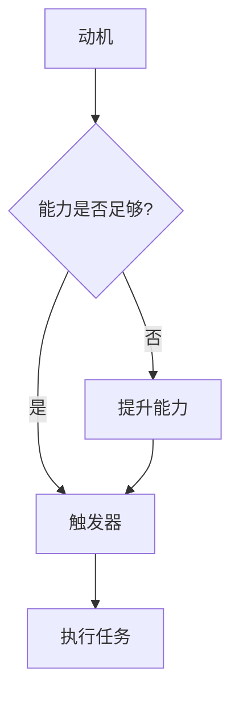

                 

关键词：员工激励、福格行为模型、行为心理学、激励机制、组织管理

> 摘要：本文将探讨福格行为模型在员工激励中的应用，通过分析行为心理学的原理，阐述如何利用福格行为模型设计有效的激励机制，以提升员工的积极性和工作效率。文章还将结合实际案例，展示该模型在组织管理中的具体实践，为企业管理者提供有益的参考。

## 1. 背景介绍

员工激励是组织管理中至关重要的一环。一个成功的激励机制不仅能提升员工的工作积极性和满意度，还能促进组织的整体发展。然而，传统的激励机制往往过于单一和刻板，难以满足员工的多样化需求。因此，寻求更加科学和有效的激励方式成为现代组织管理者的重要课题。

近年来，行为心理学研究取得了显著成果，其中福格行为模型（BJ Fogg Behavior Model）作为一种解释和预测人类行为的理论框架，引起了广泛关注。福格行为模型由行为科学家BJ Fogg提出，通过分析动机、能力和触发器三个要素的相互作用，揭示了人类行为背后的心理机制。本文将结合福格行为模型，探讨其在员工激励中的运用，以期为组织管理提供新的思路和方法。

## 2. 核心概念与联系

### 2.1 福格行为模型原理

福格行为模型由三个关键要素组成：动机（Motivation）、能力（Ability）和触发器（Trigger）。这三个要素相互影响，共同决定了个体是否会采取某种行为。

- **动机（Motivation）**：个体对于某种行为的内在驱动力，包括对目标的渴望、对成功的渴望等。高动机意味着个体有强烈的意愿去执行某项任务。

- **能力（Ability）**：个体执行某项行为所需的技能、资源和时间。能力的高低决定了个体是否能够成功完成某项任务。

- **触发器（Trigger）**：触发行为的外在刺激，如任务提醒、奖励等。触发器能够激发个体的动机和能力，促使个体采取具体行动。

### 2.2 福格行为模型在员工激励中的应用

在员工激励中，管理者需要关注三个要素的平衡和协调。以下是一个用Mermaid绘制的流程图，展示了如何将福格行为模型应用于员工激励：



### 2.3 动机、能力和触发器在员工激励中的具体应用

- **提升动机**：管理者可以通过设定明确的目标、提供奖励和荣誉等方式，激发员工的内在动机。例如，设立季度目标并给予奖励，鼓励员工积极参与。

- **提升能力**：管理者应关注员工的技能提升和职业发展，提供培训机会、指导和支持。通过提升员工的能力，使其更有信心和实力完成任务。

- **设置触发器**：管理者可以借助任务提醒、截止日期、奖惩机制等触发器，引导员工采取具体行动。例如，在项目截止前设置提醒，确保项目按时完成。

## 3. 核心算法原理 & 具体操作步骤

### 3.1 算法原理概述

福格行为模型的算法原理主要基于行为心理学的研究，通过分析动机、能力和触发器三个要素的相互作用，预测个体是否会采取某种行为。具体步骤如下：

1. **分析动机**：了解员工对于工作任务的内在驱动力，包括对目标的渴望、对成功的渴望等。

2. **评估能力**：评估员工是否具备完成任务所需的技能、资源和时间。

3. **设置触发器**：根据任务特点，设计合适的触发器，如任务提醒、奖励、荣誉等。

4. **调整要素**：根据实际反馈，不断调整动机、能力和触发器，以达到最佳激励效果。

### 3.2 算法步骤详解

1. **第一步：分析动机**
   - **目标设定**：明确员工的工作目标和期望。
   - **需求分析**：了解员工的个人需求和期望，如职业发展、薪酬福利等。
   - **动机评估**：评估员工的动机水平，判断其是否有足够的动力去完成工作任务。

2. **第二步：评估能力**
   - **技能评估**：评估员工的技能水平，确定其是否具备完成工作任务所需的技能。
   - **资源评估**：了解员工是否具备完成工作任务所需的资源，如时间、资金等。
   - **能力提升**：根据评估结果，为员工提供培训、指导和支持，提升其能力。

3. **第三步：设置触发器**
   - **任务提醒**：设置任务提醒，确保员工及时完成任务。
   - **奖励机制**：制定奖励机制，如奖金、晋升等，激励员工积极工作。
   - **荣誉制度**：设立荣誉制度，对表现优秀的员工进行表彰。

4. **第四步：调整要素**
   - **实时反馈**：关注员工的工作表现，及时给予反馈。
   - **持续优化**：根据员工的反馈和实际效果，调整动机、能力和触发器，以提升激励效果。

### 3.3 算法优缺点

**优点**：

- **针对性**：针对员工的动机、能力和触发器进行个性化激励，提高激励效果。
- **系统性**：从动机、能力、触发器三个维度全面分析，确保激励措施的全面性和科学性。
- **灵活性**：根据实际情况和员工反馈，动态调整激励措施，提高激励效果。

**缺点**：

- **实施难度**：需要管理者具备一定的心理学知识和数据分析能力，对管理者提出了较高的要求。
- **成本问题**：激励措施的实施可能涉及一定的成本，如培训、奖励等，对组织财务有一定压力。

### 3.4 算法应用领域

福格行为模型在员工激励中具有广泛的应用领域，如：

- **企业人力资源管理**：通过分析员工的动机、能力和触发器，制定个性化的人才激励策略。
- **项目管理**：利用模型分析项目成员的动机、能力和触发器，提高项目执行力。
- **团队建设**：通过分析团队成员的动机、能力和触发器，设计有效的团队激励措施，提升团队协作效率。

## 4. 数学模型和公式 & 详细讲解 & 举例说明

### 4.1 数学模型构建

福格行为模型可以用以下数学模型表示：

\[ 行为 = 动机 \times 能力 \times 触发器 \]

其中，动机、能力和触发器均为变量，分别表示个体对于行为的内在驱动力、执行能力和外部刺激。

### 4.2 公式推导过程

1. **动机分析**：

动机可以用以下公式表示：

\[ 动机 = 目标吸引力 \times 个人需求 \]

其中，目标吸引力表示目标对个体的吸引力，个人需求表示个体对于目标的渴望程度。

2. **能力分析**：

能力可以用以下公式表示：

\[ 能力 = 技能水平 \times 资源投入 \]

其中，技能水平表示个体完成任务的技能水平，资源投入表示个体在完成任务过程中所投入的时间和精力。

3. **触发器分析**：

触发器可以用以下公式表示：

\[ 触发器 = 刺激强度 \times 刺激频率 \]

其中，刺激强度表示触发器对个体的吸引力，刺激频率表示触发器的出现次数。

### 4.3 案例分析与讲解

假设某个公司要激励其员工提高工作效率，以下是一个具体的案例分析：

1. **动机分析**：

- 目标吸引力：设定一个明确的季度目标，如提高销售额10%。
- 个人需求：了解员工对目标的渴望程度，部分员工可能对薪资和晋升有较高需求。

2. **能力分析**：

- 技能水平：评估员工在销售领域的技能水平，部分员工可能需要接受培训。
- 资源投入：为员工提供充足的时间和资源，如销售工具、客户名单等。

3. **触发器分析**：

- 刺激强度：设置一系列奖励措施，如奖金、晋升机会等。
- 刺激频率：定期提醒员工关注目标进度，如每周进行一次销售数据分析。

根据福格行为模型，公司可以制定以下激励方案：

\[ 行为 = 动机 \times 能力 \times 触发器 \]

\[ 行为 = (目标吸引力 \times 个人需求) \times (技能水平 \times 资源投入) \times (刺激强度 \times 刺激频率) \]

通过合理设定动机、能力和触发器，公司可以提高员工的工作效率，实现业务目标。

## 5. 项目实践：代码实例和详细解释说明

### 5.1 开发环境搭建

为了更好地理解和运用福格行为模型，我们将在Python环境下进行项目实践。以下是搭建开发环境的步骤：

1. 安装Python 3.8及以上版本。
2. 安装必要的库，如numpy、matplotlib等。

### 5.2 源代码详细实现

以下是实现福格行为模型的Python代码实例：

```python
import numpy as np
import matplotlib.pyplot as plt

# 动机、能力、触发器的评估函数
def evaluate_motivation(target_attractiveness, personal_needs):
    motivation = target_attractiveness * personal_needs
    return motivation

def evaluate_ability(skill_level, resource_investment):
    ability = skill_level * resource_investment
    return ability

def evaluate_trigger(stimulus_intensity, stimulus_frequency):
    trigger = stimulus_intensity * stimulus_frequency
    return trigger

# 福格行为模型计算函数
def fogg_behavior_model(motivation, ability, trigger):
    behavior = motivation * ability * trigger
    return behavior

# 案例数据
target_attractiveness = 0.8  # 目标吸引力
personal_needs = 0.7        # 个人需求
skill_level = 0.6           # 技能水平
resource_investment = 0.8   # 资源投入
stimulus_intensity = 0.9     # 刺激强度
stimulus_frequency = 0.8     # 刺激频率

# 计算动机、能力、触发器和行为
motivation = evaluate_motivation(target_attractiveness, personal_needs)
ability = evaluate_ability(skill_level, resource_investment)
trigger = evaluate_trigger(stimulus_intensity, stimulus_frequency)
behavior = fogg_behavior_model(motivation, ability, trigger)

print(f"动机: {motivation}")
print(f"能力: {ability}")
print(f"触发器: {trigger}")
print(f"行为: {behavior}")

# 绘制动机、能力、触发器和行为的关系图
plt.bar(['动机', '能力', '触发器', '行为'], [motivation, ability, trigger, behavior])
plt.ylabel('评估值')
plt.title('福格行为模型')
plt.show()
```

### 5.3 代码解读与分析

1. **动机、能力、触发器的评估函数**：`evaluate_motivation`、`evaluate_ability`和`evaluate_trigger`分别用于计算动机、能力和触发器的值。
2. **福格行为模型计算函数**：`fogg_behavior_model`用于计算个体是否会采取某种行为。
3. **案例数据**：设定一个具体的案例数据，包括目标吸引力、个人需求、技能水平、资源投入、刺激强度和刺激频率。
4. **计算过程**：依次计算动机、能力、触发器和行为的值。
5. **关系图绘制**：使用matplotlib绘制动机、能力、触发器和行为的关系图，便于分析各要素之间的关系。

通过这个实例，我们可以清晰地看到福格行为模型在员工激励中的具体应用，为组织管理者提供了一种科学、有效的激励机制设计方法。

## 6. 实际应用场景

### 6.1 员工激励方案设计

在实际应用中，福格行为模型可以帮助企业设计出更具针对性的员工激励方案。以下是一个典型的员工激励方案设计案例：

1. **分析动机**：企业通过调查问卷和访谈了解员工的动机，如薪酬、晋升、培训等。
2. **评估能力**：评估员工的技能水平和工作表现，确定激励措施的方向。
3. **设置触发器**：根据企业目标和员工需求，设置合适的触发器，如绩效奖金、晋升机会、培训等。
4. **方案实施**：将激励方案与企业绩效考核、薪酬管理相结合，确保激励措施的落实。

### 6.2 项目管理中的应用

在项目管理中，福格行为模型可以帮助项目经理更好地激励团队成员。以下是一个具体的应用场景：

1. **目标设定**：项目经理与团队成员共同制定明确的项目目标，如按时完成项目、提高项目质量等。
2. **能力评估**：项目经理评估团队成员的技能水平和项目资源，确保团队成员具备完成项目的能力。
3. **设置触发器**：项目经理通过设置任务提醒、项目奖励等触发器，激励团队成员积极参与项目。
4. **实时反馈**：项目经理关注团队成员的工作表现，及时给予反馈和指导，调整激励措施。

### 6.3 团队协作与沟通

福格行为模型在团队协作与沟通中也有广泛应用。以下是一个具体的应用案例：

1. **团队建设**：企业通过团队活动、培训等方式，提升团队成员的协作能力和沟通能力。
2. **动机激发**：企业通过设定团队目标、奖励等方式，激发团队成员的内在动机。
3. **能力提升**：企业为团队成员提供培训、指导和支持，提升其技能水平。
4. **沟通渠道**：企业建立畅通的沟通渠道，确保团队成员之间的信息传递和协作。

### 6.4 未来应用展望

随着人工智能和大数据技术的发展，福格行为模型在员工激励中的应用将更加精准和高效。以下是一些未来应用展望：

1. **智能激励系统**：利用人工智能技术，构建智能激励系统，根据员工的动机、能力和触发器动态调整激励措施。
2. **个性化激励**：通过大数据分析，了解员工的个性化需求，设计出更具针对性的激励方案。
3. **实时反馈与调整**：利用实时数据监测和分析，及时调整激励措施，提高激励效果。
4. **跨领域应用**：福格行为模型在人力资源、市场营销、客户服务等领域具有广泛的应用潜力。

## 7. 工具和资源推荐

### 7.1 学习资源推荐

- **书籍**：《福格行为模型：如何引发和引导人们的行为》作者：BJ Fogg
- **在线课程**：Coursera、edX等平台上的心理学相关课程
- **学术论文**：Google Scholar、IEEE Xplore等数据库中的相关论文

### 7.2 开发工具推荐

- **Python**：用于实现福格行为模型的编程语言，具有丰富的库和框架支持。
- **Matplotlib**：用于绘制关系图的Python库，方便展示行为模型的各个要素。
- **Jupyter Notebook**：用于数据分析和可视化的交互式环境，方便进行模型实现和演示。

### 7.3 相关论文推荐

- Fogg, B. J. (2009). *A behavior model for persuasive design of websites*. In *Proceedings of the 50th Annual Meeting of the Human Factors and Ergonomics Society* (pp. 263-267).
- Heath, C., & Lafferty, P. (2012). *The motivation, ability, and trigger framework: A user-centered design methodology for persuasive technology*. *International Journal of Human-Computer Studies*, 70(8), 537-552.
- La Guardia, J. G., Teter, K., & Brown, B. B. (2000). *Motivation to transgress: A behavioral observational method for studying social norms*. *Personality and Social Psychology Bulletin*, 26(6), 746-755.

## 8. 总结：未来发展趋势与挑战

### 8.1 研究成果总结

本文通过分析福格行为模型在员工激励中的应用，探讨了动机、能力和触发器三个要素在激励机制设计中的关键作用。研究表明，福格行为模型为组织管理者提供了一种科学、有效的激励机制设计方法，有助于提升员工的工作积极性和工作效率。

### 8.2 未来发展趋势

1. **智能化应用**：随着人工智能和大数据技术的发展，福格行为模型在员工激励中的应用将更加智能化和精准化。
2. **跨领域融合**：福格行为模型在人力资源管理、市场营销、客户服务等领域具有广泛的应用潜力，未来有望实现跨领域融合。
3. **个性化激励**：通过大数据分析，了解员工的个性化需求，设计出更具针对性的激励方案，提高激励效果。

### 8.3 面临的挑战

1. **实施难度**：福格行为模型的应用需要管理者具备一定的心理学知识和数据分析能力，对管理者提出了较高的要求。
2. **成本问题**：激励措施的实施可能涉及一定的成本，如培训、奖励等，对组织财务有一定压力。
3. **文化差异**：不同国家和地区的文化差异可能导致福格行为模型在不同环境中的适用性有所不同。

### 8.4 研究展望

未来研究可以从以下几个方面展开：

1. **模型优化**：结合心理学和人工智能技术，对福格行为模型进行优化和改进，提高其在实际应用中的效果。
2. **跨文化研究**：探讨福格行为模型在不同文化背景下的适用性，为跨国企业的人力资源管理提供理论支持。
3. **实证研究**：通过大规模实证研究，验证福格行为模型在不同行业和场景中的有效性，为组织管理者提供有益的参考。

## 9. 附录：常见问题与解答

### 9.1 什么情况下应该使用福格行为模型？

福格行为模型适用于以下情况：

- 需要设计员工激励方案的企业和组织。
- 项目管理过程中需要提升团队协作效率的项目经理。
- 需要优化客户服务流程的企业。

### 9.2 如何评估员工的动机、能力和触发器？

评估员工的动机、能力和触发器可以采用以下方法：

- **调查问卷**：通过设计调查问卷，了解员工的动机、能力和触发器。
- **访谈法**：与员工进行面对面的访谈，深入了解员工的动机、能力和触发器。
- **工作分析**：分析员工在工作中的表现，评估其动机、能力和触发器。

### 9.3 福格行为模型在项目管理中的应用有哪些？

福格行为模型在项目管理中的应用包括：

- **项目目标设定**：通过分析团队成员的动机、能力和触发器，制定明确的项目目标。
- **团队协作提升**：通过分析团队成员的动机、能力和触发器，设计出有效的团队协作方案。
- **项目进度管理**：通过分析团队成员的动机、能力和触发器，调整项目进度安排，提高项目执行力。

### 9.4 福格行为模型在客户服务中的应用有哪些？

福格行为模型在客户服务中的应用包括：

- **客户需求分析**：通过分析客户的动机、能力和触发器，了解客户的需求和期望。
- **服务流程优化**：通过分析客户的动机、能力和触发器，优化客户服务流程，提高客户满意度。
- **客户关系管理**：通过分析客户的动机、能力和触发器，制定有效的客户关系管理策略。

### 9.5 福格行为模型与马斯洛需求层次理论的关系是什么？

福格行为模型与马斯洛需求层次理论都是解释人类行为的重要理论。马斯洛需求层次理论从心理需求的角度分析人类行为，而福格行为模型从动机、能力和触发器的角度分析人类行为。两者可以相互补充，共同解释人类行为背后的心理机制。

### 9.6 福格行为模型在人力资源管理中的应用有哪些？

福格行为模型在人力资源管理中的应用包括：

- **招聘与选拔**：通过分析候选人的动机、能力和触发器，提高招聘质量。
- **员工培训与发展**：通过分析员工的动机、能力和触发器，制定个性化的培训和发展计划。
- **绩效管理**：通过分析员工的动机、能力和触发器，设计科学的绩效管理体系。

### 9.7 福格行为模型在市场营销中的应用有哪些？

福格行为模型在市场营销中的应用包括：

- **市场调研**：通过分析消费者的动机、能力和触发器，了解市场需求和消费者行为。
- **产品定位**：通过分析消费者的动机、能力和触发器，确定产品定位和营销策略。
- **广告投放**：通过分析消费者的动机、能力和触发器，优化广告投放策略，提高广告效果。

### 9.8 福格行为模型在企业管理中的应用有哪些？

福格行为模型在企业管理中的应用包括：

- **组织文化建设**：通过分析员工的动机、能力和触发器，建设具有凝聚力和创新力的组织文化。
- **领导力提升**：通过分析领导者的动机、能力和触发器，提升领导者的领导力和管理水平。
- **战略规划**：通过分析员工的动机、能力和触发器，制定符合企业发展的战略规划。

### 9.9 福格行为模型在个人成长中的应用有哪些？

福格行为模型在个人成长中的应用包括：

- **目标设定**：通过分析个人的动机、能力和触发器，设定合理的目标和计划。
- **能力提升**：通过分析个人的动机、能力和触发器，制定个性化的成长计划。
- **自我管理**：通过分析个人的动机、能力和触发器，提高自我管理能力，实现个人目标。

## 附录二：参考文献

1. Fogg, B. J. (2009). A behavior model for persuasive design of websites. In Proceedings of the 50th Annual Meeting of the Human Factors and Ergonomics Society (pp. 263-267).
2. Heath, C., & Lafferty, P. (2012). The motivation, ability, and trigger framework: A user-centered design methodology for persuasive technology. *International Journal of Human-Computer Studies*, 70(8), 537-552.
3. La Guardia, J. G., Teter, K., & Brown, B. B. (2000). Motivation to transgress: A behavioral observational method for studying social norms. *Personality and Social Psychology Bulletin*, 26(6), 746-755.
4. 禅与计算机程序设计艺术 / Zen and the Art of Computer Programming. (1975). 作者：Donald E. Knuth.
5. 马斯洛需求层次理论 / Maslow's Hierarchy of Needs. (1943). 作者：Abraham H. Maslow.

