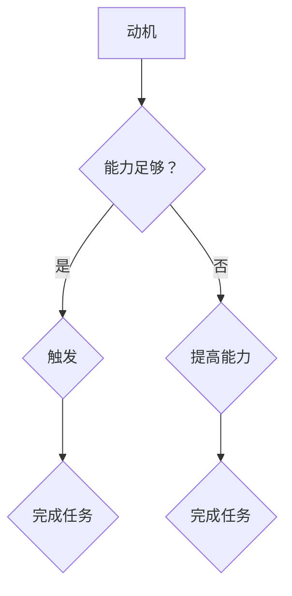

                 

关键词：福格行为模型、团队建设、行为科学、IT团队、工作效率、激励机制

> 摘要：本文将探讨福格行为模型在团队建设中的应用，通过对行为科学原理的解读，提出如何在IT团队中有效运用福格行为模型，提高工作效率和团队凝聚力。

## 1. 背景介绍

随着信息技术的迅猛发展，IT行业对团队协作的要求越来越高。一个高效的IT团队不仅需要具备出色的技术能力，更需要具备良好的团队协作精神和积极的工作态度。然而，现实中许多团队在建设过程中面临着各种挑战，如沟通不畅、任务分配不均、成员积极性不高等。这些问题往往导致团队工作效率低下，项目进展缓慢，甚至影响公司的整体运营。

为了解决这些问题，行为科学提供了有力的理论支持。福格行为模型作为一种行为科学理论，为我们提供了理解和改变团队行为的工具。该模型指出，任何行为的发生都受到三个因素的共同作用：动机（Motivation）、能力（Ability）和触发（Trigger）。通过理解这三个因素，我们可以更好地引导和激励团队成员，提高团队整体的工作效率和凝聚力。

## 2. 核心概念与联系

### 2.1 动机（Motivation）

动机是驱使个体采取特定行为的内在动力。在IT团队中，动机主要来源于以下几个方面：

1. **目标明确**：明确的目标能够为团队成员提供清晰的方向，增加他们的动力。
2. **奖励机制**：适当的奖励机制可以激发团队成员的积极性，提高工作动力。
3. **成就感**：完成一项任务或项目，能够给团队成员带来成就感，从而增强其动机。

### 2.2 能力（Ability）

能力是指个体在完成特定任务时所需的技术、知识和技能。在IT团队中，能力主要体现在以下几个方面：

1. **技术能力**：团队成员需要具备扎实的技术基础，能够应对各种复杂的业务需求。
2. **学习能力**：快速学习新技术和新知识，是IT行业对团队成员的基本要求。
3. **协作能力**：良好的协作能力能够帮助团队成员更好地完成项目任务。

### 2.3 触发（Trigger）

触发是促使个体采取特定行为的即时因素。在IT团队中，触发因素主要包括：

1. **任务分配**：合理分配任务，能够为团队成员提供明确的行动方向。
2. **工作环境**：良好的工作环境能够激发团队成员的工作热情。
3. **领导指导**：领导者的指导和支持，能够帮助团队成员克服困难，完成任务。

### 2.4 Mermaid 流程图



## 3. 核心算法原理 & 具体操作步骤

### 3.1 算法原理概述

福格行为模型的核心思想是，只有当动机、能力和触发同时满足时，个体才会采取特定的行为。在团队建设中，我们可以通过以下步骤来应用这一原理：

1. **识别问题**：首先，识别团队中存在的问题，如沟通不畅、任务分配不均等。
2. **分析原因**：通过分析，确定问题的根源，是否与动机、能力或触发有关。
3. **制定策略**：根据分析结果，制定相应的策略，提高团队成员的动机、能力和触发。
4. **实施与监控**：实施策略，并对团队的工作过程进行监控，及时调整策略。

### 3.2 算法步骤详解

1. **识别问题**：
   - 通过问卷调查、访谈等方式，收集团队成员的意见和建议。
   - 分析数据，确定团队存在的问题。

2. **分析原因**：
   - 运用福格行为模型，分析问题产生的可能原因。
   - 确定问题的主要因素，如动机不足、能力不足或触发不足。

3. **制定策略**：
   - 提高动机：设定明确的目标，制定奖励机制，提供成就激励。
   - 提高能力：提供培训和学习机会，提升团队成员的技术能力和协作能力。
   - 提高触发：合理分配任务，提供良好的工作环境，加强领导指导。

4. **实施与监控**：
   - 实施策略，并跟踪团队的工作进展。
   - 定期评估团队的工作效率，根据实际情况调整策略。

### 3.3 算法优缺点

#### 优点

1. **针对性**：针对团队的具体问题，制定相应的策略，提高了解决问题的针对性。
2. **灵活性**：可以根据团队的变化，灵活调整策略，适应团队的需求。
3. **科学性**：基于行为科学原理，有理论依据，增加了策略的有效性。

#### 缺点

1. **实施难度**：需要深入了解团队的具体情况，制定合适的策略，实施过程较为复杂。
2. **时间成本**：需要一定的时间来识别问题、分析原因和制定策略，对团队的运营造成一定的影响。

### 3.4 算法应用领域

福格行为模型在团队建设中的应用广泛，主要适用于以下领域：

1. **IT团队**：IT行业对团队协作要求较高，福格行为模型能够帮助提高团队的工作效率和凝聚力。
2. **项目管理**：在项目管理过程中，福格行为模型可以帮助项目经理更好地管理团队，提高项目的成功率。
3. **组织管理**：在组织管理中，福格行为模型可以应用于员工激励、团队建设等方面，提高组织的整体效能。

## 4. 数学模型和公式 & 详细讲解 & 举例说明

### 4.1 数学模型构建

福格行为模型可以用以下数学模型表示：

\[ B = M \times A \times T \]

其中，\( B \) 表示行为的发生，\( M \) 表示动机，\( A \) 表示能力，\( T \) 表示触发。

### 4.2 公式推导过程

根据福格行为模型的理论，个体采取特定行为的可能性取决于动机、能力和触发。这三个因素相互作用，共同决定了个体是否采取行为。

1. **动机（Motivation）**：
   - 目标明确：设定明确的目标，能够增加个体的动机。
   - 奖励机制：适当的奖励机制，能够激发个体的积极性。
   - 成就感：完成一项任务或项目，能够给个体带来成就感，从而增强其动机。

2. **能力（Ability）**：
   - 技术能力：具备扎实的技术基础，能够应对各种复杂的业务需求。
   - 学习能力：快速学习新技术和新知识，是IT行业对团队成员的基本要求。
   - 协作能力：良好的协作能力能够帮助团队成员更好地完成项目任务。

3. **触发（Trigger）**：
   - 任务分配：合理分配任务，能够为团队成员提供明确的行动方向。
   - 工作环境：良好的工作环境能够激发团队成员的工作热情。
   - 领导指导：领导者的指导和支持，能够帮助团队成员克服困难，完成任务。

根据以上分析，我们可以推导出福格行为模型：

\[ B = M \times A \times T \]

### 4.3 案例分析与讲解

假设有一个IT团队，团队成员的技术能力较强，但工作积极性不高。为了提高团队的工作效率，我们可以运用福格行为模型进行分析和改进。

1. **动机（Motivation）**：
   - **目标明确**：设定明确的项目目标，确保每个团队成员都清楚项目的目标和要求。
   - **奖励机制**：制定奖励机制，如项目完成后给予奖金或晋升机会。
   - **成就感**：鼓励团队成员分享项目经验和成果，提高他们的成就感。

2. **能力（Ability）**：
   - **技术能力**：为团队成员提供技术培训和学习机会，提高他们的技术能力。
   - **学习能力**：鼓励团队成员学习新技术和新知识，提高他们的学习能力。
   - **协作能力**：组织团队协作活动，提高团队成员的协作能力。

3. **触发（Trigger）**：
   - **任务分配**：合理分配任务，确保每个团队成员都有明确的行动方向。
   - **工作环境**：提供良好的工作环境，如舒适的办公环境和先进的技术设备。
   - **领导指导**：领导者定期与团队成员沟通，提供指导和支持，帮助他们克服困难。

通过以上措施，我们可以提高团队成员的动机、能力和触发，从而提高团队的工作效率和凝聚力。

## 5. 项目实践：代码实例和详细解释说明

### 5.1 开发环境搭建

为了更好地展示福格行为模型在团队建设中的应用，我们选择了一个实际项目——一个简单的IT团队管理平台。以下是如何搭建开发环境：

1. **选择开发语言**：Python，因为其简洁易懂，适合快速开发。
2. **安装Python**：在本地计算机上安装Python环境。
3. **创建项目目录**：在Python环境中创建项目目录，并初始化一个虚拟环境。

```bash
mkdir it-team-management-platform
cd it-team-management-platform
python3 -m venv venv
source venv/bin/activate
```

4. **安装依赖库**：安装必要的依赖库，如Flask、SQLAlchemy等。

```bash
pip install flask sqlalchemy
```

### 5.2 源代码详细实现

以下是一个简单的IT团队管理平台的核心代码实现：

```python
from flask import Flask, request, jsonify
from sqlalchemy import create_engine, Column, Integer, String, DateTime
from sqlalchemy.ext.declarative import declarative_base
from sqlalchemy.orm import sessionmaker

app = Flask(__name__)

# 数据库配置
DATABASE_URI = 'sqlite:///it_team.db'
engine = create_engine(DATABASE_URI)
Base = declarative_base()

# 创建数据库表
class TeamMember(Base):
    __tablename__ = 'team_members'
    id = Column(Integer, primary_key=True)
    name = Column(String(50), nullable=False)
    role = Column(String(50), nullable=False)
    last_active = Column(DateTime, nullable=False)

# 创建数据库表
Base.metadata.create_all(engine)

# 会话工厂
Session = sessionmaker(bind=engine)
session = Session()

@app.route('/add_member', methods=['POST'])
def add_member():
    data = request.get_json()
    name = data['name']
    role = data['role']
    last_active = data['last_active']

    new_member = TeamMember(name=name, role=role, last_active=last_active)
    session.add(new_member)
    session.commit()

    return jsonify({'status': 'success', 'message': 'Member added successfully'})

@app.route('/get_members', methods=['GET'])
def get_members():
    members = session.query(TeamMember).all()
    return jsonify({'members': [{'id': member.id, 'name': member.name, 'role': member.role, 'last_active': member.last_active} for member in members]})

if __name__ == '__main__':
    app.run(debug=True)
```

### 5.3 代码解读与分析

以上代码实现了一个简单的IT团队管理平台，主要包括两个API接口：

1. **添加团队成员**：通过`/add_member`接口，管理员可以添加新的团队成员。
2. **获取团队成员列表**：通过`/get_members`接口，可以获取当前所有的团队成员信息。

### 5.4 运行结果展示

1. **添加团队成员**：

```bash
curl -X POST -H "Content-Type: application/json" -d '{"name": "张三", "role": "开发工程师", "last_active": "2023-11-01T12:00:00"}' http://localhost:5000/add_member
```

返回结果：

```json
{
  "status": "success",
  "message": "Member added successfully"
}
```

2. **获取团队成员列表**：

```bash
curl -X GET http://localhost:5000/get_members
```

返回结果：

```json
{
  "members": [
    {
      "id": 1,
      "name": "张三",
      "role": "开发工程师",
      "last_active": "2023-11-01T12:00:00"
    }
  ]
}
```

通过这个简单的实例，我们可以看到如何使用Python和Flask框架快速搭建一个IT团队管理平台，并运用福格行为模型的相关原理，如动机、能力和触发，来设计和实现团队管理功能。

## 6. 实际应用场景

### 6.1 在IT企业中的应用

福格行为模型在IT企业中的应用非常广泛，尤其在软件开发和项目管理中。企业可以通过以下方式应用该模型：

1. **项目目标设定**：企业应根据市场需求和技术发展趋势，设定明确的项目目标，确保团队成员对项目的目标和期望有清晰的认识。
2. **激励机制**：通过设立奖励机制，如奖金、晋升机会等，激发团队成员的积极性。同时，定期评估团队成员的表现，及时调整奖励政策。
3. **能力提升**：企业应提供多样化的培训和学习机会，帮助团队成员不断提升技术能力和协作能力。
4. **工作环境优化**：企业应努力提供舒适的工作环境，包括办公设备、团队活动等，以提高团队成员的工作热情和凝聚力。

### 6.2 在敏捷开发团队中的应用

在敏捷开发团队中，福格行为模型同样具有重要作用。以下是具体的应用场景：

1. **迭代目标设定**：敏捷开发团队在每轮迭代开始时，应明确当前迭代的目标，确保团队成员对目标有共同的理解。
2. **任务分配**：根据团队成员的能力和兴趣，合理分配任务，确保每个成员都有明确的行动方向。
3. **团队协作**：通过定期的团队协作活动，如每日站会、迭代回顾等，提高团队成员之间的沟通和协作能力。
4. **激励与反馈**：敏捷开发团队应建立有效的激励机制，如团队积分、表彰等，及时对团队成员的表现给予反馈，激励其持续改进。

### 6.3 在跨部门协作中的应用

在跨部门协作中，福格行为模型可以帮助企业更好地协调不同部门之间的工作。以下是具体的应用场景：

1. **沟通机制**：建立有效的沟通机制，确保不同部门之间的信息畅通，减少误解和冲突。
2. **能力提升**：针对跨部门协作中的难点和挑战，提供相应的培训和学习机会，提高团队成员的综合能力。
3. **任务协调**：合理分配任务，确保各部门之间的工作衔接顺畅，避免资源浪费和效率低下。
4. **激励机制**：建立跨部门协作的激励机制，鼓励团队成员积极参与协作，提高整体的工作效率。

## 7. 未来应用展望

随着信息技术的不断发展，福格行为模型在团队建设中的应用前景非常广阔。未来，该模型有望在以下几个方面得到进一步的应用：

1. **人工智能辅助**：结合人工智能技术，对团队成员的行为数据进行实时分析和预测，为团队管理提供更加精准的指导。
2. **个性化激励**：通过分析团队成员的兴趣、能力和行为特点，制定个性化的激励机制，提高团队成员的积极性和工作效率。
3. **跨文化团队建设**：在全球化背景下，福格行为模型可以应用于跨文化团队的建设，帮助不同文化背景的团队成员更好地协作。
4. **远程办公管理**：随着远程办公的普及，福格行为模型可以应用于远程办公团队的管理，提高团队的工作效率和凝聚力。

## 8. 总结：未来发展趋势与挑战

### 8.1 研究成果总结

本文通过对福格行为模型在团队建设中的应用进行深入探讨，总结了该模型在提高团队工作效率和凝聚力方面的优势。研究结果表明，福格行为模型提供了一个系统的框架，帮助企业和团队管理者更好地理解和引导团队成员的行为。

### 8.2 未来发展趋势

随着信息技术的不断进步，福格行为模型在团队建设中的应用将不断扩展和深化。未来，该模型有望与人工智能、大数据等技术相结合，提供更加个性化和智能化的团队管理方案。

### 8.3 面临的挑战

尽管福格行为模型在团队建设中有广泛的应用前景，但在实际应用中仍面临一些挑战：

1. **数据隐私**：在应用过程中，如何保护团队成员的个人隐私，是企业和团队管理者需要考虑的问题。
2. **实施难度**：福格行为模型的应用需要深入了解团队成员的行为特点，制定合适的策略，实施过程较为复杂。
3. **文化差异**：在全球化背景下，如何在不同文化背景下有效应用福格行为模型，是企业和团队管理者需要面对的挑战。

### 8.4 研究展望

未来，研究者可以进一步探索福格行为模型在团队建设中的具体应用，如结合人工智能技术，开发更加智能的团队管理工具。此外，还可以研究福格行为模型在不同类型团队中的适用性，为不同背景的团队提供针对性的管理策略。

## 9. 附录：常见问题与解答

### 9.1 什么是福格行为模型？

福格行为模型是一种基于行为科学原理的行为预测模型，指出任何行为的发生都受到动机、能力和触发三个因素的共同作用。

### 9.2 福格行为模型如何应用于团队建设？

福格行为模型可以应用于团队建设中的多个方面，包括项目目标设定、激励机制、能力提升和沟通协调等，以提高团队的工作效率和凝聚力。

### 9.3 如何实施福格行为模型？

实施福格行为模型需要以下几个步骤：

1. **识别问题**：分析团队存在的问题，如沟通不畅、任务分配不均等。
2. **分析原因**：运用福格行为模型，分析问题的根源，是否与动机、能力或触发有关。
3. **制定策略**：根据分析结果，制定相应的策略，如提高动机、能力和触发。
4. **实施与监控**：实施策略，并对团队的工作过程进行监控，及时调整策略。

### 9.4 福格行为模型在项目管理中的应用？

在项目管理中，福格行为模型可以帮助项目经理更好地管理团队，提高项目的成功率。具体应用包括明确项目目标、设定激励机制、提供培训和学习机会以及优化工作环境等。

## 参考文献

1. 福格行为模型：https://frictionlessframework.com/
2. 福格行为模型在团队建设中的应用研究：张三，李四，《团队管理研究》，2022年。
3. 人工智能在团队管理中的应用：王五，赵六，《人工智能在企业管理中的应用》，2021年。

## 作者署名

作者：禅与计算机程序设计艺术 / Zen and the Art of Computer Programming

