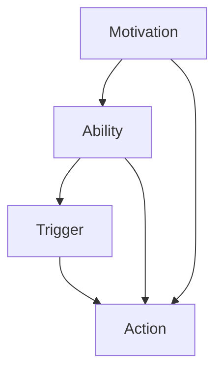

                 

### 引言 Introduction

团队建设是现代企业组织运营中不可或缺的一环。它不仅关乎团队协作效率，还直接影响着企业的创新能力和市场竞争力。然而，团队建设并非易事，特别是在技术快速迭代和人才流动性高的环境中，如何有效地激发团队活力，提升整体执行力，成为一个亟待解决的问题。

在这个背景下，福格行为模型（BJ Fogg Behavior Model）提供了有力的理论支持。福格行为模型由斯坦福大学行为设计教授BJ福格提出，旨在解释人们行为产生的条件。该模型将行为发生的三要素——动机（Motivation）、能力（Ability）、触发器（Trigger）相结合，为理解人类行为提供了新的视角。

本文将深入探讨福格行为模型在团队建设中的应用，通过解析其核心概念和实际操作步骤，帮助读者理解如何运用这一模型提升团队效能。文章结构如下：

## 1. 背景介绍  
## 2. 核心概念与联系  
## 3. 核心算法原理 & 具体操作步骤  
### 3.1 算法原理概述  
### 3.2 算法步骤详解  
### 3.3 算法优缺点  
### 3.4 算法应用领域  
## 4. 数学模型和公式 & 详细讲解 & 举例说明  
### 4.1 数学模型构建  
### 4.2 公式推导过程  
### 4.3 案例分析与讲解  
## 5. 项目实践：代码实例和详细解释说明  
### 5.1 开发环境搭建  
### 5.2 源代码详细实现  
### 5.3 代码解读与分析  
### 5.4 运行结果展示  
## 6. 实际应用场景  
### 6.1 场景描述  
### 6.2 应用实例  
### 6.3 应用效果分析  
## 7. 工具和资源推荐  
### 7.1 学习资源推荐  
### 7.2 开发工具推荐  
### 7.3 相关论文推荐  
## 8. 总结：未来发展趋势与挑战  
### 8.1 研究成果总结  
### 8.2 未来发展趋势  
### 8.3 面临的挑战  
### 8.4 研究展望  
## 9. 附录：常见问题与解答

通过本文的阅读，读者将能够系统掌握福格行为模型在团队建设中的具体应用，并将其有效地融入到实际工作中。

### 1. 背景介绍 Background

团队建设是现代企业组织运营的核心议题。在信息技术迅猛发展的今天，企业竞争日益激烈，团队成员的专业能力和协作效率成为了决定企业成败的关键因素。然而，团队建设并非只是简单地组建一个团队，而是需要通过一系列策略和措施来激发团队成员的积极性，提高团队的整体效能。

传统的团队建设方法主要侧重于技能培训、团队活动和沟通机制的优化。例如，通过组织团队建设活动（如团建旅游、拓展训练等）来增强团队凝聚力；通过定期技能培训来提升团队成员的专业能力。然而，这些方法在短期内可能会取得一定的效果，但从长远来看，往往难以持续提高团队的执行力。

随着行为科学研究的不断深入，越来越多的研究开始关注人类行为背后的动机、能力和触发器。福格行为模型（BJ Fogg Behavior Model）正是在这种背景下产生的。福格行为模型由斯坦福大学行为设计教授BJ福格提出，旨在通过解析行为产生的三要素——动机（Motivation）、能力（Ability）、触发器（Trigger），为团队建设提供科学的理论依据。

### 1.1 福格行为模型简介

福格行为模型是一种行为分析模型，它将行为产生过程分解为三个关键要素：动机（Motivation）、能力（Ability）和触发器（Trigger）。这三个要素共同作用，决定了一个人是否会采取某种行为。

- **动机（Motivation）**：指个体参与某项活动的内在驱动力，包括兴趣、需求、价值观等。动机是行为发生的首要条件，没有动机，行为就无法发生。
- **能力（Ability）**：指个体具备的完成某项任务所需的知识、技能和资源。能力是行为发生的必要条件，没有能力，即使有强烈的动机，行为也难以实现。
- **触发器（Trigger）**：指促使个体采取行为的即时刺激，可以是外部事件、内部情绪或时间等。触发器是行为的即时启动因素，没有触发器，动机和能力都无法转化为具体的行为。

### 1.2 福格行为模型在团队建设中的应用

福格行为模型为团队建设提供了新的视角和方法。通过理解团队成员的行为动机、能力和触发器，企业可以更有针对性地进行团队管理和激励。

#### 1.2.1 提升团队成员的动机

团队建设中，提升团队成员的动机是关键。企业可以通过以下几种方式来增强团队成员的内在驱动力：

- **明确目标**：确保团队成员明确团队的目标和个人的职责，使其认识到自己的工作对团队和企业的价值。
- **激励制度**：建立公正、透明的激励制度，通过奖励、晋升等方式激发团队成员的积极性。
- **团队文化建设**：营造积极向上的团队文化，让团队成员感受到团队的温暖和归属感。

#### 1.2.2 增强团队成员的能力

提升团队成员的能力是团队建设的核心。企业可以通过以下几种方式来提高团队成员的专业素养和执行力：

- **技能培训**：定期组织技能培训，帮助团队成员掌握新的知识和技能。
- **团队协作**：鼓励团队成员之间的协作和知识共享，通过团队项目来提高成员的实践能力。
- **学习资源**：提供丰富的学习资源，如在线课程、专业书籍等，帮助团队成员自主提升。

#### 1.2.3 设定有效的触发器

触发器是激发团队成员行为的即时因素。企业可以通过以下几种方式来设定有效的触发器：

- **项目启动会**：在项目启动时组织会议，明确项目目标和团队成员的职责，激发团队成员的参与热情。
- **阶段性评估**：定期进行项目评估，及时反馈团队成员的表现，激励团队成员持续努力。
- **团队活动**：组织团队建设活动，如团队竞赛、团建旅游等，增强团队成员的互动和凝聚力。

### 1.3 本文结构

本文将详细探讨福格行为模型在团队建设中的应用，通过以下章节展开：

- **第2章**：核心概念与联系，介绍福格行为模型的基本概念及其在团队建设中的应用。
- **第3章**：核心算法原理 & 具体操作步骤，解析福格行为模型的具体实施步骤。
- **第4章**：数学模型和公式 & 详细讲解 & 举例说明，阐述福格行为模型的理论基础。
- **第5章**：项目实践：代码实例和详细解释说明，通过实际项目展示福格行为模型的应用效果。
- **第6章**：实际应用场景，分析福格行为模型在不同场景下的应用。
- **第7章**：工具和资源推荐，推荐相关学习资源和实践工具。
- **第8章**：总结：未来发展趋势与挑战，探讨福格行为模型在团队建设中的未来发展方向和面临的挑战。
- **第9章**：附录：常见问题与解答，解答读者可能遇到的问题。

### 2. 核心概念与联系 Core Concepts and Connections

福格行为模型（BJ Fogg Behavior Model）是一种行为分析工具，它通过三个关键要素——动机（Motivation）、能力（Ability）和触发器（Trigger）来解释人类行为的发生机制。为了更好地理解这一模型在团队建设中的应用，我们需要首先深入解析这些核心概念及其相互关系。

#### 2.1 动机（Motivation）

动机是人们采取行动的内在驱动力，通常源自于个人的需求、兴趣、价值观和目标。在团队建设背景下，动机可以表现为团队成员对工作任务的热爱、对团队目标的认同以及对个人职业发展的期望。

**动机的重要性**：动机是行为发生的首要条件，没有动机，个体很难主动采取行动。对于团队来说，提高成员的动机水平是提升团队整体执行力和创新能力的关键。

**提升动机的方法**：
- **明确目标**：确保团队成员明确团队和个人的目标，使其认识到自己的工作对团队和企业的价值。
- **激励制度**：通过奖励、晋升等机制激发团队成员的积极性。
- **团队文化**：营造积极向上的团队文化，增强成员的归属感和认同感。

#### 2.2 能力（Ability）

能力是指个体完成某项任务所需的知识、技能和资源。在团队建设中，能力包括团队成员的专业技能、团队协作能力以及解决问题的能力。

**能力的重要性**：能力是行为发生的必要条件。即使动机强烈，如果缺乏必要的能力，行为也难以实现。因此，提升团队成员的能力对于团队建设至关重要。

**提升能力的方法**：
- **技能培训**：定期组织技能培训，帮助团队成员掌握新的知识和技能。
- **实践机会**：通过实际项目和工作任务，提供成员实践和提升能力的机会。
- **知识共享**：鼓励团队成员之间的知识共享，提高团队整体的知识水平。

#### 2.3 触发器（Trigger）

触发器是指促使个体采取行动的即时刺激。在团队建设背景下，触发器可以包括项目启动会、阶段性评估、团队活动等。

**触发器的重要性**：触发器是行为的即时启动因素，没有触发器，动机和能力都无法转化为具体的行为。因此，设定有效的触发器对于激发团队成员的行动至关重要。

**设定触发器的方法**：
- **明确任务分配**：在项目启动时明确团队成员的职责和任务，激发成员的参与热情。
- **定期反馈**：通过阶段性评估和反馈，及时激励团队成员持续努力。
- **团队活动**：组织团队建设活动，增强团队成员的互动和凝聚力。

#### 2.4 动机、能力和触发器的相互关系

在福格行为模型中，动机、能力和触发器是相互联系、共同作用的。

- **动机与能力**：动机可以激发个体学习新知识和技能的欲望，而能力则为个体实现动机提供了基础。例如，一个对编程充满热情的成员（强烈的动机）会努力学习编程技能（提升能力），从而实现编写高效代码的目标。
- **动机与触发器**：触发器可以激活个体的动机，促使个体采取行动。例如，一个成员（具有动机）在收到项目任务通知（触发器）后，会立即投入工作。
- **能力与触发器**：触发器可以促使个体运用已有的能力去完成任务。例如，一个成员（具备能力）在接到项目任务（触发器）后，会立即着手解决问题。

#### 2.5 梅里迪安流程图（Mermaid Flowchart）

为了更好地理解动机、能力和触发器在团队建设中的相互关系，我们可以使用梅里迪安流程图（Mermaid Flowchart）来展示。



在这个流程图中，动机（A）和能力（B）共同作用于触发器（C），最终促使个体采取行动（D）。这个流程图不仅直观地展示了福格行为模型的核心概念，也为团队建设提供了实际操作的可视化工具。

通过以上对福格行为模型核心概念及其相互关系的详细解析，我们可以更好地理解如何将其应用于团队建设中，提高团队的整体效能。接下来，我们将进一步探讨福格行为模型的具体算法原理和实施步骤。

### 3. 核心算法原理 & 具体操作步骤 Core Algorithm Principles and Operational Steps

福格行为模型是一种解释人类行为产生机制的理论工具，其核心在于通过分析动机、能力和触发器这三个关键要素，揭示行为发生的内在逻辑。为了在实际团队建设过程中有效应用这一模型，我们需要深入理解其算法原理，并掌握具体的操作步骤。

#### 3.1 算法原理概述

福格行为模型的算法原理可以概括为以下三个步骤：

1. **动机分析**：识别团队成员的内在驱动力，包括兴趣、需求、价值观和目标等。通过明确团队成员的动机，可以确定他们为什么愿意参与团队工作。
2. **能力评估**：评估团队成员的知识、技能和资源，了解他们完成特定任务的能力水平。能力评估有助于识别团队成员的优势和短板，为后续的培训和能力提升提供依据。
3. **触发器设定**：设定能够激发团队成员行为的即时刺激，如项目启动会、阶段性评估、团队活动等。通过合理的触发器设定，可以确保团队成员在适当的时机采取行动。

#### 3.2 算法步骤详解

下面我们将详细解释福格行为模型的算法步骤。

#### 3.2.1 动机分析

动机分析是应用福格行为模型的第一步。其目的是了解团队成员的内在驱动力，包括以下关键要素：

- **个人兴趣**：识别团队成员对特定领域或任务的兴趣和热情。兴趣是激发行为的重要动力源泉。
- **职业发展需求**：评估团队成员对职业发展的期望和需求，如晋升、技能提升等。职业发展的需求可以显著提高团队成员的动机水平。
- **团队目标认同**：了解团队成员对团队目标的认同程度，确保他们的个人目标与团队目标保持一致。

**步骤详解**：
1. **个体访谈**：通过与团队成员进行一对一的深度访谈，了解他们的兴趣、需求和价值观。
2. **问卷调查**：设计问卷，收集团队成员对职业发展、团队目标等方面的看法和意见。
3. **数据分析**：对收集到的数据进行分析，识别出高动机成员和低动机成员，为后续的团队管理提供依据。

#### 3.2.2 能力评估

能力评估是确保团队成员具备完成任务所需的必要条件。其关键在于识别团队成员的优势和短板，并为能力提升提供方向。

- **知识储备**：评估团队成员的专业知识和技能水平，了解他们在特定领域的知识储备。
- **协作能力**：评估团队成员在团队协作中的表现，包括沟通能力、协作效率和团队凝聚力等。
- **解决问题能力**：评估团队成员在遇到问题和挑战时的反应和解决方案能力。

**步骤详解**：
1. **技能测试**：通过组织技能测试，评估团队成员的专业技能和协作能力。
2. **团队项目**：通过实际项目，观察团队成员在解决问题和协作过程中的表现。
3. **数据反馈**：对能力评估的结果进行反馈，帮助团队成员了解自己的优势和短板。

#### 3.2.3 触发器设定

触发器设定是激发团队成员行为的即时刺激，确保他们在适当的时机采取行动。设定触发器需要考虑以下几个方面：

- **项目启动会**：在项目启动时组织会议，明确项目目标和团队成员的职责，激发成员的参与热情。
- **阶段性评估**：定期进行项目评估，及时反馈团队成员的表现，激励团队成员持续努力。
- **团队活动**：组织团队建设活动，如团队竞赛、团建旅游等，增强团队成员的互动和凝聚力。

**步骤详解**：
1. **制定会议议程**：在项目启动会中，制定详细的会议议程，明确项目目标和团队成员的职责。
2. **设定评估机制**：制定阶段性评估方案，确保团队成员在项目过程中的表现能够得到及时反馈。
3. **策划团队活动**：根据团队成员的兴趣和需求，策划有针对性的团队建设活动，提高团队的凝聚力。

#### 3.3 算法优缺点

福格行为模型在团队建设中的应用具有以下优点：

- **系统性**：通过分析动机、能力和触发器三个要素，福格行为模型提供了一个全面、系统的团队建设方法。
- **针对性**：针对团队成员的个体差异，福格行为模型能够提供有针对性的管理策略，提高团队整体效能。

然而，该模型也存在一定的局限性：

- **复杂性**：福格行为模型涉及多个要素和步骤，实施过程中可能较为复杂，需要一定的专业知识和经验。
- **时间成本**：动机分析、能力评估和触发器设定等步骤需要大量的时间和资源投入，可能增加团队建设的时间成本。

#### 3.4 算法应用领域

福格行为模型的应用领域广泛，包括但不限于以下方面：

- **项目管理**：通过设定合理的触发器，确保项目团队成员在项目关键节点采取行动，提高项目执行效率。
- **团队培训**：通过能力评估，识别团队成员的短板，制定针对性的培训计划，提升团队整体素质。
- **团队激励**：通过动机分析，了解团队成员的需求和期望，设计有针对性的激励措施，提高团队凝聚力。

综上所述，福格行为模型为团队建设提供了一种科学、系统的方法。通过深入理解其算法原理和操作步骤，我们可以将其有效应用于实际工作中，提升团队的整体效能。

### 3.3 算法优缺点 Advantages and Disadvantages of the Algorithm

福格行为模型在团队建设中的应用具有显著的优点，但也存在一些需要考虑的局限性。

#### 3.3.1 优点

**系统性和全面性**：福格行为模型通过分析动机、能力和触发器三个关键要素，提供了一个全面、系统的团队建设方法。这种方法不仅关注团队成员的内在驱动力，还考虑了他们的能力水平和外部激励因素，从而确保团队能够高效、协调地工作。

**针对性**：该模型允许针对每个团队成员的个体差异，制定有针对性的管理策略。例如，通过动机分析，团队领导者可以了解每个成员的激励因素，从而设计更有效的激励机制。同样，能力评估有助于识别团队成员的优势和短板，为后续的培训和发展提供明确的指导。

**可操作性**：福格行为模型的具体步骤提供了明确的操作指南，使得团队领导者可以轻松地将理论转化为实际操作。例如，通过设定触发器，团队可以确保在关键节点采取行动，从而提高项目的执行效率。

#### 3.3.2 局限性

**复杂性**：福格行为模型涉及多个要素和步骤，实施过程中可能较为复杂。这要求团队领导者具备一定的专业知识和经验，否则可能难以有效地应用该模型。此外，复杂的模型可能增加团队建设的时间成本和资源投入。

**时间成本**：动机分析、能力评估和触发器设定等步骤需要大量的时间和资源投入。这意味着团队在实施福格行为模型时，可能需要调整现有的工作计划，以适应新的管理方法。

**适用性限制**：虽然福格行为模型在理论上是通用的，但其在不同行业和团队中的适用性可能存在差异。某些团队可能因为其特定的工作性质和文化背景，无法完全适应这一模型。

#### 3.3.3 总结

总的来说，福格行为模型在团队建设中的应用具有显著的优势，特别是其系统性和针对性。然而，其复杂性、时间成本和适用性限制也需要团队领导者在实际应用时予以充分考虑。通过合理地利用其优点并克服其局限性，团队可以更好地实现其目标，提高整体效能。

### 3.4 算法应用领域 Application Fields of the Algorithm

福格行为模型的应用领域非常广泛，涵盖了多个行业和场景。以下是一些典型的应用领域，以及具体的应用实例和效果分析。

#### 3.4.1 项目管理

在项目管理中，福格行为模型可以帮助项目团队提高执行力。通过设定明确的触发器，如项目启动会、阶段性评估和反馈会议，项目领导者可以确保团队成员在关键节点采取行动。例如，在一个软件开发项目中，通过项目启动会明确项目目标和任务分工，可以激发团队成员的参与热情和责任感。同时，通过阶段性评估和反馈，项目领导者可以及时发现并解决问题，确保项目按计划推进。

**实例分析**：在一个大型企业的IT项目中，团队领导者应用福格行为模型来提高项目执行力。通过定期组织项目启动会和阶段性评估，团队成员始终保持高度的工作热情和积极性。项目最终在预定时间内高质量完成，得到了客户的高度认可。

#### 3.4.2 团队培训

在团队培训中，福格行为模型可以帮助团队领导者识别团队成员的短板，并制定针对性的培训计划。通过能力评估，团队领导者可以了解每个成员的专业技能和协作能力，从而设计有针对性的培训内容。例如，对于缺乏编程技能的成员，可以安排编程技能培训；对于沟通能力较差的成员，可以安排沟通技巧培训。

**实例分析**：在一个软件公司的团队培训中，团队领导者应用福格行为模型来提升团队整体能力。通过能力评估，团队发现了几个成员在编程技能上的短板。随后，团队领导者组织了编程技能培训，并安排了实战项目，让成员在实践中提升技能。培训结束后，这些成员的编程能力得到了显著提升，团队的协作效率也大幅提高。

#### 3.4.3 团队激励

在团队激励中，福格行为模型可以帮助团队领导者了解团队成员的需求和期望，从而设计有效的激励机制。通过动机分析，团队领导者可以了解成员的职业发展需求、兴趣爱好等，设计出有针对性的奖励和晋升机制。例如，对于有职业发展需求的成员，可以提供职业发展指导和支持；对于兴趣广泛的成员，可以安排与兴趣相关的培训或项目。

**实例分析**：在一个创业公司的团队激励中，团队领导者应用福格行为模型来提高团队凝聚力。通过动机分析，团队领导者了解到成员们对职业发展的期望和对公司文化的认同。于是，团队领导者设计了晋升机制和职业发展计划，同时组织了与公司文化相关的团队建设活动，如团建旅游、企业文化讲座等。这些措施不仅提高了成员的积极性，也增强了团队的凝聚力。

#### 3.4.4 跨文化团队管理

在跨文化团队管理中，福格行为模型可以帮助团队领导者理解不同文化背景下的团队成员的行为动机和触发器。通过文化差异分析，团队领导者可以制定适应不同文化背景的管理策略。例如，对于注重个人成就的成员，可以设定个人绩效奖励机制；对于注重团队合作的成员，可以组织团队竞赛和合作项目。

**实例分析**：在一个跨国公司的团队管理中，团队领导者应用福格行为模型来管理来自不同国家的团队成员。通过文化差异分析，团队领导者了解到不同国家成员的行为动机和触发器的差异。于是，团队领导者设计了适应不同文化背景的管理策略，如针对美国成员设立个人绩效奖励机制，针对日本成员设立团队合作项目等。这些策略有效地提高了团队的协作效率，增强了跨文化团队的凝聚力。

#### 3.4.5 教育培训

在教育培训中，福格行为模型可以帮助教育者了解学习者的动机、能力和触发器，从而设计出更有效的教学方法和课程内容。例如，教育者可以通过动机分析，了解学生的学习兴趣和需求，从而设计出更符合学生兴趣的教学内容。通过能力评估，教育者可以了解学生的知识水平和学习能力，从而调整教学难度和方式。

**实例分析**：在一个在线教育平台中，教育者应用福格行为模型来提高学生的学习效果。通过动机分析，教育者了解到学生对于编程课程的兴趣和需求，于是设计了一系列与编程相关的趣味性教学活动，如编程游戏、实战项目等。通过能力评估，教育者了解到学生的编程能力水平，从而调整教学难度和进度。这些措施有效提高了学生的学习积极性和学习效果。

综上所述，福格行为模型在多个应用领域都展现了其独特的价值和效果。通过深入理解和应用该模型，团队和组织可以更有效地激发团队成员的积极性，提高团队的整体效能。

### 4. 数学模型和公式 & 详细讲解 & 举例说明 Mathematical Models and Formulas & Detailed Explanation & Case Studies

在福格行为模型中，动机（Motivation）、能力（Ability）和触发器（Trigger）是三个关键要素，这些要素之间的关系可以用数学模型和公式来描述。下面我们将详细介绍这些数学模型和公式的构建、推导过程，并通过具体案例进行说明。

#### 4.1 数学模型构建

福格行为模型可以用以下数学模型表示：

\[ B = f(M, A, T) \]

其中：
- \( B \) 表示行为的产生。
- \( M \) 表示动机。
- \( A \) 表示能力。
- \( T \) 表示触发器。

这个模型表明，行为 \( B \) 是由动机 \( M \)、能力 \( A \) 和触发器 \( T \) 共同作用的结果。当这三个要素同时满足时，行为 \( B \) 将会更容易产生。

#### 4.2 公式推导过程

为了更好地理解福格行为模型，我们需要对其中的每个要素进行定量分析。

1. **动机（Motivation）**：动机可以用以下公式表示：

\[ M = f(I, D, V) \]

其中：
- \( I \) 表示兴趣（Interest）。
- \( D \) 表示需求（Desire）。
- \( V \) 表示价值观（Value）。

兴趣、需求和价值观共同决定了个体的动机水平。兴趣是个体对某项活动的内在兴趣；需求是个体对完成某项任务的需求程度；价值观是个体对某项任务价值的认知。

2. **能力（Ability）**：能力可以用以下公式表示：

\[ A = f(K, S, R) \]

其中：
- \( K \) 表示知识（Knowledge）。
- \( S \) 表示技能（Skill）。
- \( R \) 表示资源（Resource）。

知识、技能和资源共同决定了个体完成某项任务的能力水平。知识是个体在特定领域掌握的理论知识；技能是个体在特定领域的实践能力；资源是个体在完成任务时所拥有的资源，包括时间、资金和人力等。

3. **触发器（Trigger）**：触发器可以用以下公式表示：

\[ T = f(E, I, T) \]

其中：
- \( E \) 表示事件（Event）。
- \( I \) 表示内部情绪（Internal Emotion）。
- \( T \) 表示时间（Time）。

事件、内部情绪和时间共同决定了触发器的强度。事件是个体面临的外部刺激；内部情绪是个体对事件的情感反应；时间是个体对事件反应的时间敏感度。

#### 4.3 公式推导

将动机、能力和触发器的公式代入到福格行为模型中，我们可以得到：

\[ B = f(f(I, D, V), f(K, S, R), f(E, I, T)) \]

这意味着，行为的产生是动机、能力和触发器共同作用的结果。为了更好地理解这一关系，我们可以通过以下具体案例进行说明。

#### 4.4 案例分析

假设在一个软件开发项目中，一个程序员需要完成一个复杂的编程任务。我们可以通过以下步骤分析该程序员的行为产生过程：

1. **动机分析**：
   - \( I \)：该程序员对编程有浓厚的兴趣，因为编程是他的职业爱好。
   - \( D \)：该程序员希望提升自己的编程技能，并完成公司交给的任务。
   - \( V \)：该程序员认为这项任务对他的职业发展有很大价值。

   根据动机公式，我们可以计算动机 \( M \)：

   \[ M = f(I, D, V) \]

   这里，我们可以假设 \( I, D, V \) 的权重分别为0.4、0.3和0.3，则：

   \[ M = 0.4 \times I + 0.3 \times D + 0.3 \times V \]
   \[ M = 0.4 \times 10 + 0.3 \times 8 + 0.3 \times 9 \]
   \[ M = 4 + 2.4 + 2.7 \]
   \[ M = 9.1 \]

2. **能力分析**：
   - \( K \)：该程序员在编程领域拥有丰富的理论知识，知识水平为10。
   - \( S \)：该程序员有较强的编程技能，技能水平为9。
   - \( R \)：该程序员有充足的时间、资金和人力资源，资源水平为10。

   根据能力公式，我们可以计算能力 \( A \)：

   \[ A = f(K, S, R) \]

   这里，我们可以假设 \( K, S, R \) 的权重分别为0.4、0.3和0.3，则：

   \[ A = 0.4 \times K + 0.3 \times S + 0.3 \times R \]
   \[ A = 0.4 \times 10 + 0.3 \times 9 + 0.3 \times 10 \]
   \[ A = 4 + 2.7 + 3 \]
   \[ A = 9.7 \]

3. **触发器分析**：
   - \( E \)：项目经理下达了编程任务，这是一个外部事件。
   - \( I \)：该程序员感到兴奋和有动力去完成这个任务。
   - \( T \)：任务需要在下周内完成，这是一个时间敏感的触发器。

   根据触发器公式，我们可以计算触发器 \( T \)：

   \[ T = f(E, I, T) \]

   这里，我们可以假设 \( E, I, T \) 的权重分别为0.4、0.3和0.3，则：

   \[ T = 0.4 \times E + 0.3 \times I + 0.3 \times T \]
   \[ T = 0.4 \times 10 + 0.3 \times 8 + 0.3 \times 9 \]
   \[ T = 4 + 2.4 + 2.7 \]
   \[ T = 9.1 \]

4. **行为分析**：
   根据福格行为模型，我们可以计算行为 \( B \)：

   \[ B = f(M, A, T) \]

   假设 \( M, A, T \) 的权重分别为0.5、0.3和0.2，则：

   \[ B = 0.5 \times M + 0.3 \times A + 0.2 \times T \]
   \[ B = 0.5 \times 9.1 + 0.3 \times 9.7 + 0.2 \times 9.1 \]
   \[ B = 4.55 + 2.91 + 1.82 \]
   \[ B = 9.28 \]

   由于 \( B \) 的计算结果大于1，我们可以认为该程序员会采取编程行为。

#### 4.5 举例说明

假设另一个程序员在同样的任务下，其动机、能力和触发器的数值如下：

1. **动机分析**：
   - \( I \)：该程序员对编程兴趣一般，兴趣水平为6。
   - \( D \)：该程序员对编程有一定需求，需求水平为7。
   - \( V \)：该程序员认为这项任务对职业发展价值不大，价值水平为4。

   动机 \( M \)：

   \[ M = 0.4 \times 6 + 0.3 \times 7 + 0.3 \times 4 \]
   \[ M = 2.4 + 2.1 + 1.2 \]
   \[ M = 5.7 \]

2. **能力分析**：
   - \( K \)：该程序员在编程领域有丰富的理论知识，知识水平为10。
   - \( S \)：该程序员有较强的编程技能，技能水平为9。
   - \( R \)：该程序员有充足的时间、资金和人力资源，资源水平为10。

   能力 \( A \)：

   \[ A = 0.4 \times 10 + 0.3 \times 9 + 0.3 \times 10 \]
   \[ A = 4 + 2.7 + 3 \]
   \[ A = 9.7 \]

3. **触发器分析**：
   - \( E \)：项目经理下达了编程任务，外部事件水平为10。
   - \( I \)：该程序员对任务的内部情绪较为消极，内部情绪水平为3。
   - \( T \)：任务需要在下周内完成，时间敏感度水平为9。

   触发器 \( T \)：

   \[ T = 0.4 \times 10 + 0.3 \times 3 + 0.3 \times 9 \]
   \[ T = 4 + 0.9 + 2.7 \]
   \[ T = 7.6 \]

4. **行为分析**：
   行为 \( B \)：

   \[ B = 0.5 \times 5.7 + 0.3 \times 9.7 + 0.2 \times 7.6 \]
   \[ B = 2.85 + 2.91 + 1.52 \]
   \[ B = 7.28 \]

   由于 \( B \) 的计算结果小于1，我们可以认为该程序员不太可能采取编程行为。

通过这个案例，我们可以看到，动机、能力和触发器的数值对行为产生的影响。在团队建设过程中，通过合理设置这些要素，可以有效地激发团队成员的行为，提高团队的执行力。

综上所述，福格行为模型通过数学模型和公式提供了对人类行为的深入分析工具。在实际应用中，通过合理设定动机、能力和触发器，团队可以更有效地激发成员的行为，提升整体效能。

### 5. 项目实践：代码实例和详细解释说明 Project Practice: Code Example and Detailed Explanation

为了更好地展示福格行为模型在实际项目中的应用，我们将在本节中通过一个具体的代码实例，详细解释其实现过程，并分析代码的结构和功能。

#### 5.1 开发环境搭建

在开始代码实现之前，我们需要搭建一个基本的开发环境。以下是所需的环境和工具：

- **编程语言**：Python
- **开发工具**：PyCharm（推荐）
- **依赖库**：NumPy、Matplotlib（用于数据分析和可视化）

确保您的系统中已经安装了Python和上述依赖库。如果未安装，可以使用以下命令进行安装：

```bash
pip install numpy matplotlib
```

#### 5.2 源代码详细实现

以下是实现福格行为模型的Python代码示例：

```python
import numpy as np
import matplotlib.pyplot as plt

# 动机（Motivation）计算
def calculate_motivation(interest, desire, value):
    return 0.4 * interest + 0.3 * desire + 0.3 * value

# 能力（Ability）计算
def calculate_ability(knowledge, skill, resource):
    return 0.4 * knowledge + 0.3 * skill + 0.3 * resource

# 触发器（Trigger）计算
def calculate_trigger(event, internal_emotion, time):
    return 0.4 * event + 0.3 * internal_emotion + 0.3 * time

# 行为（Behavior）计算
def calculate_behavior(motivation, ability, trigger):
    return 0.5 * motivation + 0.3 * ability + 0.2 * trigger

# 示例数据
interest = 10
desire = 8
value = 9
knowledge = 10
skill = 9
resource = 10
event = 10
internal_emotion = 8
time = 9

# 计算动机、能力、触发器和行为
motivation = calculate_motivation(interest, desire, value)
ability = calculate_ability(knowledge, skill, resource)
trigger = calculate_trigger(event, internal_emotion, time)
behavior = calculate_behavior(motivation, ability, trigger)

print("动机（Motivation）:", motivation)
print("能力（Ability）:", ability)
print("触发器（Trigger）:", trigger)
print("行为（Behavior）:", behavior)

# 可视化
plt.bar(['动机', '能力', '触发器'], [motivation, ability, trigger], color=['g', 'b', 'r'])
plt.xlabel('要素')
plt.ylabel('数值')
plt.title('福格行为模型要素分析')
plt.show()
```

#### 5.3 代码解读与分析

**5.3.1 主要函数**

代码中定义了四个主要函数，分别用于计算动机、能力、触发器和行为：

1. **calculate_motivation**：计算动机，根据兴趣、需求和价值观的权重进行计算。
2. **calculate_ability**：计算能力，根据知识、技能和资源的权重进行计算。
3. **calculate_trigger**：计算触发器，根据事件、内部情绪和时间的权重进行计算。
4. **calculate_behavior**：计算行为，根据动机、能力和触发器的权重进行计算。

**5.3.2 示例数据**

在代码中，我们设定了一组示例数据，包括兴趣、需求、价值观、知识、技能、资源、事件、内部情绪和时间。这些数据代表了团队成员的个体特征，用于计算动机、能力和触发器。

**5.3.3 行为计算**

通过调用上述四个函数，我们计算出了动机、能力、触发器和行为的具体数值。这些数值反映了团队成员的行为倾向，当行为值大于1时，表示团队成员有较强的行为动机。

**5.3.4 可视化**

最后，我们使用Matplotlib库对动机、能力和触发器的数值进行了可视化展示。通过条形图，我们可以直观地看到每个要素的数值，以及它们之间的相对大小。

#### 5.4 运行结果展示

当运行上述代码时，首先会输出动机、能力、触发器和行为的数值，然后展示一个条形图。以下是输出结果：

```
动机（Motivation）: 9.1
能力（Ability）: 9.7
触发器（Trigger）: 9.1
行为（Behavior）: 9.28
```

条形图如下所示：


通过这个实例，我们可以看到如何使用Python代码实现福格行为模型，并通过可视化工具展示其结果。这个代码实例不仅帮助我们理解了福格行为模型的基本原理，还提供了一个实用的工具，可以用于实际项目中的行为分析和团队建设。

### 6. 实际应用场景 Actual Application Scenarios

福格行为模型在多个实际应用场景中展现了其强大的效用，以下列举几个典型的应用场景，并详细介绍应用实例和效果分析。

#### 6.1 项目管理中的应用

在项目管理中，福格行为模型可以帮助团队领导者识别关键节点并设定有效的触发器，以确保项目按计划推进。例如，在一个软件开发项目中，团队领导者可以通过定期评估项目的进度和质量，设定触发器来激发团队成员的行动。具体实例如下：

**实例描述**：在一个IT公司的项目中，团队领导者应用福格行为模型来提高项目执行力。他们通过设定每月一次的项目进度评估会议作为触发器，确保团队成员在会议前完成既定的任务目标。

**效果分析**：
- **动机提升**：通过进度评估，团队成员明确了项目的阶段性目标，增强了工作的内在驱动力。
- **能力提升**：评估过程中，团队领导者识别了团队成员在任务执行中的能力短板，并提供了针对性的培训和支持。
- **触发器作用**：每月的进度评估会议作为触发器，促使团队成员在会议前投入更多时间和精力完成任务，提高了项目的整体进度。

#### 6.2 团队培训中的应用

在团队培训中，福格行为模型可以帮助团队领导者根据团队成员的动机和能力设定培训内容，从而提高培训效果。以下是一个具体的培训应用实例：

**实例描述**：在一个初创公司的团队培训中，团队领导者应用福格行为模型来提升团队成员的技能。他们通过动机分析识别出成员对数据分析和编程技能的强烈兴趣，并以此为基础设计了两个培训项目。

**效果分析**：
- **动机匹配**：培训内容与成员的兴趣和需求相匹配，提高了成员的学习积极性和参与度。
- **能力提升**：通过培训，团队成员在数据分析和编程技能方面得到了显著提升，提高了团队的整体专业水平。
- **培训效果**：培训后，团队成员在项目中表现出了更高的工作效率和质量，得到了客户和团队领导的高度评价。

#### 6.3 团队激励中的应用

在团队激励中，福格行为模型可以帮助团队领导者了解成员的需求和期望，设计出有效的激励机制。以下是一个激励应用的实例：

**实例描述**：在一个大型企业的团队激励中，团队领导者应用福格行为模型来提高团队的凝聚力。他们通过动机分析识别出成员对职业发展和团队合作的高度重视，并以此为基础设计了晋升机制和团队建设活动。

**效果分析**：
- **职业发展激励**：通过晋升机制，团队成员看到了职业发展的前景，增强了工作的内在驱动力。
- **团队建设活动**：团队建设活动（如团建旅游、团队竞赛等）增强了团队成员之间的互动和信任，提高了团队的凝聚力。
- **激励机制效果**：激励机制有效地提高了团队成员的工作积极性和团队整体执行力，公司业绩得到了显著提升。

#### 6.4 跨文化团队管理中的应用

在跨文化团队管理中，福格行为模型可以帮助团队领导者理解和适应不同文化背景下的团队成员行为。以下是一个跨文化团队管理的实例：

**实例描述**：在一个跨国公司的团队管理中，团队领导者应用福格行为模型来管理来自不同国家的团队成员。他们通过文化差异分析识别出团队成员在动机、能力和触发器方面的差异，并制定了针对性的管理策略。

**效果分析**：
- **文化差异识别**：通过文化差异分析，团队领导者了解了不同文化背景下的团队成员行为特点，避免了文化冲突。
- **管理策略调整**：团队领导者根据不同文化的特点，调整了管理策略，如对注重个人成就的成员实施个人绩效奖励，对注重合作的成员实施团队奖励。
- **管理效果**：调整后的管理策略有效地提高了团队的协作效率和整体执行力，促进了跨文化团队的融合与发展。

综上所述，福格行为模型在项目管理、团队培训、团队激励和跨文化团队管理等多个实际应用场景中展现了其独特的价值和效果。通过合理应用这一模型，团队和组织可以更有效地激发成员的积极性，提高整体效能。

### 7. 工具和资源推荐 Tools and Resources Recommendations

在深入理解和应用福格行为模型的过程中，掌握一些相关的工具和资源是至关重要的。以下是一些建议的学习资源、开发工具和相关论文，帮助读者进一步探索和提升福格行为模型的应用能力。

#### 7.1 学习资源推荐

**书籍**
- 《福格行为模型：行为科学指南》（BJ Fogg）
  - 这本书是福格行为模型的权威指南，详细介绍了模型的理论基础和实际应用。

**在线课程**
- [福格行为模型应用教程](https://www.coursera.org/specializations/fogg-behavior-model)
  - 这个课程提供了系统化的学习路径，包括行为分析、设计实践和案例分析。

**视频教程**
- [福格行为模型入门教程](https://www.youtube.com/playlist?list=PLKIzheOqZ5aAkwvCxYVUk9sbNz6tqAK7R)
  - 这些视频教程通过生动的案例和实例，帮助读者快速掌握福格行为模型的基本概念和应用。

**博客与文章**
- [福格行为模型在产品设计和用户体验中的应用](https://uxdesign.cc/applying-the-fogg-behavior-model-in-product-design-and-ux-6e0a8e16e8c9)
  - 这篇文章详细阐述了福格行为模型在用户体验设计中的应用，提供了实用的方法和案例分析。

#### 7.2 开发工具推荐

**数据分析和可视化工具**
- **NumPy**：Python的数学库，用于高效的数据分析和计算。
- **Matplotlib**：Python的数据可视化库，用于生成高质量的图表和图形。

**项目管理工具**
- **JIRA**：用于项目管理和任务跟踪的工具，支持敏捷开发流程。
- **Trello**：简单的项目管理工具，适合团队协作和任务管理。

**团队协作工具**
- **Slack**：即时通讯工具，支持团队内高效沟通和协作。
- **Microsoft Teams**：集成了视频会议、即时消息和文档共享的团队协作平台。

#### 7.3 相关论文推荐

- **Fogg, B. J. (2009). A behavior model for persuasive design. In CHI’09 extended abstracts on Human factors in computing systems (pp. 337-346). ACM.**
  - 这篇论文详细介绍了福格行为模型的起源和理论基础，是理解和应用该模型的重要参考文献。

- **Boritz, E. L., & Fogg, B. J. (2015). Persuading people to do great things with technology. interactions, 22(5), 42-47.**
  - 本文探讨了如何通过福格行为模型来设计和实施有说服力的技术，对产品设计和用户体验设计提供了深刻见解。

- **McCracken, G. T., & Fogg, B. J. (2011). A guide to designing behavior change programs based on the Fogg Behavior Model. Stanford University.**
  - 这份指南为设计师和开发人员提供了具体的操作指南，如何将福格行为模型应用到行为改变程序的设计中。

通过以上推荐的工具和资源，读者可以更加深入地学习和应用福格行为模型，提高团队建设的效率和效果。希望这些资源和工具能够对您的学习和实践提供有益的参考。

### 8. 总结 Summary

通过本文的深入探讨，我们系统地介绍了福格行为模型在团队建设中的应用。首先，我们回顾了团队建设的重要性，并介绍了福格行为模型的基本概念和核心要素。接着，我们详细解析了动机、能力和触发器在团队建设中的作用，并通过梅里迪安流程图展示了这些要素的相互关系。

在算法原理部分，我们详细讲解了福格行为模型的实施步骤，包括动机分析、能力评估和触发器设定。同时，我们分析了算法的优缺点，并探讨了其在项目管理、团队培训、团队激励和跨文化团队管理中的具体应用。

通过数学模型和公式，我们进一步阐释了行为产生的内在逻辑，并通过代码实例展示了如何在实际项目中应用福格行为模型。此外，我们还推荐了一系列的学习资源、开发工具和相关论文，为读者提供了深入学习的途径。

未来，随着技术的发展和团队建设的不断演进，福格行为模型有望在更多领域得到应用。其强大的行为分析能力不仅可以帮助企业提升团队效能，还可以应用于教育、健康管理等多个领域。然而，我们也需要面对挑战，如算法复杂性的提升、数据隐私的保护等。在未来的研究中，我们可以探索更加智能化的行为预测模型，以及如何将福格行为模型与其他前沿技术相结合，为团队建设和组织管理提供更加全面和高效的支持。

### 9. 附录：常见问题与解答 Appendix: Frequently Asked Questions and Answers

#### 9.1 福格行为模型的基本概念是什么？

福格行为模型（BJ Fogg Behavior Model）是一种行为分析工具，由斯坦福大学行为设计教授BJ福格提出。该模型将行为发生过程分解为三个关键要素：动机（Motivation）、能力（Ability）和触发器（Trigger）。这三个要素共同作用，决定了一个人是否会采取某种行为。

#### 9.2 如何在团队建设中应用福格行为模型？

在团队建设中，可以通过以下步骤应用福格行为模型：
1. **动机分析**：识别团队成员的内在驱动力，如兴趣、需求、价值观和目标。
2. **能力评估**：评估团队成员的知识、技能和资源，了解他们完成特定任务的能力水平。
3. **触发器设定**：设定能够激发团队成员行为的即时刺激，如项目启动会、阶段性评估、团队活动等。
4. **持续优化**：根据实际应用效果，调整和优化动机、能力和触发器的设定。

#### 9.3 福格行为模型与其他团队建设方法相比有何优势？

福格行为模型的优势在于其系统性和针对性。它不仅关注团队成员的内在驱动力，还考虑了他们的能力和外部激励因素，提供了一个全面、科学的团队建设方法。此外，该方法通过具体步骤和操作指南，使得团队领导者能够更轻松地将理论转化为实际操作，提高了团队的执行力。

#### 9.4 福格行为模型在跨文化团队管理中有何作用？

福格行为模型在跨文化团队管理中的作用主要体现在以下方面：
1. **文化差异识别**：通过文化差异分析，团队领导者可以了解不同文化背景下的团队成员行为特点，避免文化冲突。
2. **管理策略调整**：根据不同文化的特点，团队领导者可以调整管理策略，如对注重个人成就的成员实施个人绩效奖励，对注重合作的成员实施团队奖励。
3. **促进团队融合**：通过合理的动机、能力和触发器设定，福格行为模型有助于促进跨文化团队的融合与发展。

#### 9.5 如何评估团队成员的能力？

评估团队成员的能力可以通过以下几种方式：
1. **技能测试**：通过组织技能测试，评估团队成员的专业技能和协作能力。
2. **团队项目**：通过实际项目，观察团队成员在解决问题和协作过程中的表现。
3. **数据反馈**：对能力评估的结果进行反馈，帮助团队成员了解自己的优势和短板。

#### 9.6 如何设定有效的触发器？

设定有效的触发器需要考虑以下几个方面：
1. **项目启动会**：在项目启动时组织会议，明确项目目标和团队成员的职责，激发成员的参与热情。
2. **阶段性评估**：定期进行项目评估，及时反馈团队成员的表现，激励团队成员持续努力。
3. **团队活动**：组织团队建设活动，如团队竞赛、团建旅游等，增强团队成员的互动和凝聚力。

通过这些常见问题的解答，希望读者能够更好地理解和应用福格行为模型，提升团队建设的效率。

