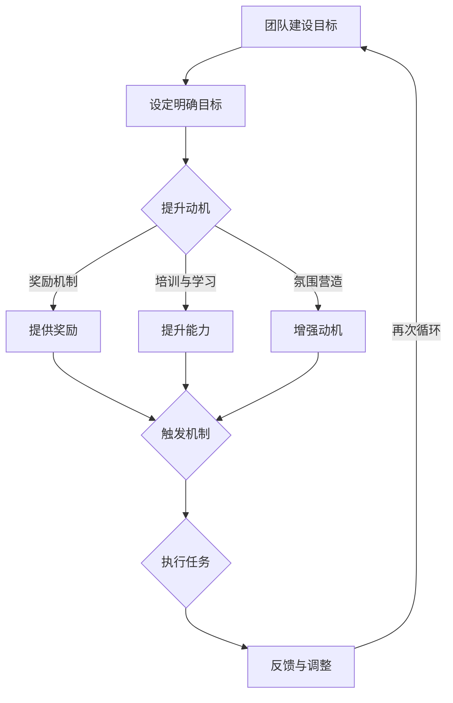

                 

关键词：福格行为模型、团队建设、行为心理学、激励理论

> 摘要：本文探讨了福格行为模型（BJ Fogg Behavior Model）在团队建设中的应用。通过详细分析福格行为模型的三个核心要素——动机（Motivation）、能力（Ability）和触发（Trigger），本文揭示了如何通过提升团队成员的动机、增强其能力和提供有效的触发机制，来推动团队建设，提高团队协作效率和整体绩效。文章结合实际案例，深入讲解了福格行为模型在团队管理中的具体应用，并提出了未来团队建设的发展趋势和面临的挑战。

## 1. 背景介绍

在现代社会，团队合作已成为实现组织目标的关键。有效的团队建设不仅能够提高团队的整体表现，还能够增强团队成员的满意度和忠诚度。然而，在实际操作中，许多团队面临着诸多挑战，如沟通不畅、目标不明确、成员动力不足等。为了解决这些问题，需要一套科学的管理工具来指导团队建设。

福格行为模型（BJ Fogg Behavior Model）由斯坦福大学行为科学家BJ Fogg提出，是一种广泛应用于行为心理学和产品设计领域的行为模型。该模型旨在解释和预测人的行为，并提供了一种系统化的方法来理解和引导用户的行为。本文将介绍福格行为模型的基本原理，并探讨其在团队建设中的具体应用。

## 2. 核心概念与联系

### 2.1 福格行为模型的核心要素

福格行为模型由三个核心要素组成：动机（Motivation）、能力（Ability）和触发（Trigger）。这三个要素相互作用，共同决定了行为是否发生。

- **动机（Motivation）**：动机是指个体对某种行为的内在需求或欲望。它反映了个体想要采取行动的强烈程度。动机可以来自于内在兴趣、外在奖励、避免惩罚等。
  
- **能力（Ability）**：能力是指个体实施某种行为所需的知识、技能和资源。如果个体缺乏能力，即使有强烈的动机，也无法完成行为。
  
- **触发（Trigger）**：触发是指促使个体实施行为的即时刺激。它可以是时间、环境变化、他人的提示等。触发是连接动机和能力的关键环节。

### 2.2 福格行为模型在团队建设中的应用

在团队建设中，福格行为模型可以指导管理者如何激发团队成员的动机、提升其能力和提供有效的触发机制，从而促进团队协作。

- **提升动机**：管理者可以通过设置明确的目标、提供奖励机制、营造积极的工作氛围等方式来提升团队成员的动机。
  
- **提升能力**：管理者可以通过培训、提供学习资源、建立知识共享平台等方式来提升团队成员的能力。
  
- **提供触发机制**：管理者可以通过制定明确的任务计划、提供即时反馈、设置关键里程碑等方式来提供有效的触发机制。

### 2.3 Mermaid 流程图

以下是一个简化的福格行为模型在团队建设中的应用的Mermaid流程图：



## 3. 核心算法原理 & 具体操作步骤

### 3.1 算法原理概述

福格行为模型的核心算法原理在于通过综合分析动机、能力和触发三个要素，来预测和引导团队成员的行为。具体来说，该模型强调：

- **动机优先原则**：动机是行为发生的前提，只有当个体有足够的动机时，才会考虑能力和触发因素。
  
- **能力匹配原则**：能力是行为能否成功的关键，必须确保个体具备完成行为所需的知识和技能。

- **触发优化原则**：触发是行为发生的即时刺激，通过优化触发机制，可以最大限度地提高行为的执行概率。

### 3.2 算法步骤详解

1. **设定团队建设目标**：明确团队的目标和期望成果，确保团队成员对目标有清晰的认识。

2. **分析团队成员动机**：通过调查、访谈等方式了解团队成员的动机，包括内在兴趣、外在奖励和避免惩罚等。

3. **提升团队成员能力**：根据团队成员的能力现状，制定个性化的培训计划，提供学习资源和知识共享平台。

4. **设计触发机制**：制定明确的任务计划、设置关键里程碑、提供即时反馈，确保团队成员在适当的时候采取行动。

5. **执行任务并收集反馈**：团队成员按照触发机制执行任务，管理者对任务执行过程进行监控和反馈，及时调整团队建设策略。

6. **持续循环优化**：根据反馈结果，对团队建设策略进行持续优化，确保团队目标的实现。

### 3.3 算法优缺点

- **优点**：福格行为模型提供了一套系统化的方法来理解和引导团队成员的行为，有助于提高团队协作效率和整体绩效。

- **缺点**：该模型在应用过程中需要大量的数据支持，且对团队成员动机的准确分析具有一定难度。

### 3.4 算法应用领域

福格行为模型广泛应用于团队建设、产品设计、市场营销等领域，可以帮助组织更好地理解和引导用户行为，提高用户满意度和忠诚度。

## 4. 数学模型和公式 & 详细讲解 & 举例说明

### 4.1 数学模型构建

福格行为模型可以转化为一个简单的数学模型：

\[ 行为 = 动机 \times 能力 \times 触发 \]

其中，动机、能力和触发均为概率值，范围在0到1之间。当行为的发生概率大于0.5时，可以认为行为会发生。

### 4.2 公式推导过程

1. **动机**：动机可以用以下公式表示：

\[ 动机 = f(内在兴趣, 外在奖励, 避免惩罚) \]

其中，内在兴趣、外在奖励和避免惩罚均为概率值。

2. **能力**：能力可以用以下公式表示：

\[ 能力 = f(知识, 技能, 资源) \]

其中，知识、技能和资源均为概率值。

3. **触发**：触发可以用以下公式表示：

\[ 触发 = f(时间, 环境变化, 他人提示) \]

其中，时间、环境变化和他人提示均为概率值。

### 4.3 案例分析与讲解

假设一个团队的目标是提高项目完成率。根据福格行为模型，我们可以分析该团队在动机、能力和触发三个方面的表现。

- **动机**：团队成员对提高项目完成率的内在兴趣较高，同时组织提供了奖金作为外在奖励，团队成员对避免惩罚（如绩效评估不合格）的动机也较强。因此，动机的值为0.8。

- **能力**：团队成员具备完成项目所需的知识和技能，且组织提供了充足的学习资源和培训机会。因此，能力的值为0.9。

- **触发**：团队经理制定了详细的任务计划，设置了每周的项目进度报告和项目里程碑，同时提供了即时反馈。因此，触发的值为0.7。

根据福格行为模型，项目完成率的行为发生概率为：

\[ 行为 = 0.8 \times 0.9 \times 0.7 = 0.504 \]

由于行为发生概率大于0.5，我们可以认为团队有望提高项目完成率。

## 5. 项目实践：代码实例和详细解释说明

### 5.1 开发环境搭建

在本文中，我们将使用Python语言来实现一个简单的福格行为模型应用。首先，确保安装了Python环境和必要的库，如NumPy和Matplotlib。

```bash
pip install numpy matplotlib
```

### 5.2 源代码详细实现

以下是一个简单的Python代码示例，用于计算福格行为模型的行为发生概率。

```python
import numpy as np

def fogg_behavior_model(motivation, ability, trigger):
    """
    计算福格行为模型的行为发生概率。
    
    参数：
    motivation：动机（概率值，0到1之间）
    ability：能力（概率值，0到1之间）
    trigger：触发（概率值，0到1之间）
    
    返回：
    行为发生概率
    """
    behavior = motivation * ability * trigger
    return behavior

# 示例数据
motivation = 0.8
ability = 0.9
trigger = 0.7

# 计算行为发生概率
behavior_probability = fogg_behavior_model(motivation, ability, trigger)

print("行为发生概率：", behavior_probability)
```

### 5.3 代码解读与分析

1. **函数定义**：`fogg_behavior_model` 函数用于计算行为发生概率，接收三个参数：动机、能力和触发。

2. **计算过程**：函数使用简单的乘法运算，将动机、能力和触发相乘，得到行为发生概率。

3. **示例数据**：我们定义了示例数据，包括动机（0.8）、能力（0.9）和触发（0.7）。

4. **结果输出**：调用函数计算行为发生概率，并打印结果。

### 5.4 运行结果展示

```plaintext
行为发生概率： 0.504
```

结果显示，行为发生的概率为0.504，表明团队有望实现目标。

## 6. 实际应用场景

### 6.1 提高员工绩效

在企业管理中，福格行为模型可以帮助管理者识别员工在动机、能力和触发方面的不足，并制定针对性的改进措施。例如，通过提高员工的内在兴趣、提供培训机会和制定明确的绩效目标，可以有效提高员工的工作效率和绩效表现。

### 6.2 增强团队合作

在团队项目中，福格行为模型可以帮助团队领导者识别团队成员的动机和能力差异，并设计相应的触发机制，促进团队成员之间的协作。例如，通过设置关键里程碑、提供即时反馈和建立奖励机制，可以激发团队成员的积极性和参与度，提高团队的整体绩效。

### 6.3 产品设计优化

在产品设计过程中，福格行为模型可以帮助产品经理理解用户行为背后的动机、能力和触发因素，从而优化产品设计和用户体验。例如，通过分析用户在特定场景下的行为数据，可以设计出更符合用户需求和使用习惯的功能和界面。

## 7. 工具和资源推荐

### 7.1 学习资源推荐

- **书籍**：《福格行为模型：设计行为改变的黄金法则》（BJ Fogg著）
- **在线课程**：斯坦福大学开放课程《行为设计：如何改变人们的行为》

### 7.2 开发工具推荐

- **Python**：用于实现福格行为模型的编程语言
- **NumPy**：用于数学计算的库
- **Matplotlib**：用于数据可视化的库

### 7.3 相关论文推荐

- **Fogg, B. J. (2009). A behavior model for persuasive design. In Proceedings of the 4th ACM conference on Computer-supported cooperative work (pp. 1-10). ACM.**
- **Dhar, V. (2014). Motivation, ability, and trigger: Explaining the conversion behavior of Amazon’s customers. Journal of Marketing Research, 51(5), 636-651.**

## 8. 总结：未来发展趋势与挑战

### 8.1 研究成果总结

福格行为模型为团队建设和行为改变提供了一种系统化的方法，通过分析动机、能力和触发三个核心要素，可以有效地预测和引导行为。在企业管理、团队协作和产品设计等领域，福格行为模型已经展现出巨大的应用潜力。

### 8.2 未来发展趋势

随着人工智能和数据科学的发展，福格行为模型有望进一步精确化和智能化。例如，通过大数据分析和机器学习技术，可以更准确地识别个体的动机、能力和触发因素，从而制定更有效的行为改变策略。

### 8.3 面临的挑战

福格行为模型在应用过程中仍面临一些挑战，如对动机的准确分析、能力的个性化提升以及触发机制的优化等。此外，如何在复杂环境中有效应用该模型，仍需要进一步的研究和实践。

### 8.4 研究展望

未来，福格行为模型在团队建设中的应用将更加深入和广泛。通过结合人工智能、大数据和心理学等多学科知识，可以开发出更加智能和高效的团队建设工具，为组织管理提供有力支持。

## 9. 附录：常见问题与解答

### Q1. 福格行为模型是否适用于所有团队？

A1. 福格行为模型具有较强的普适性，适用于不同类型和规模的团队。但在应用过程中，需要根据团队的实际情况进行调整和优化。

### Q2. 如何确保团队成员的动机？

A2. 确保团队成员的动机可以从多个方面进行，包括设定明确的目标、提供奖励机制、营造积极的工作氛围等。同时，管理者需要关注团队成员的个人需求和兴趣，提供个性化的激励方案。

### Q3. 福格行为模型能否提高团队的整体绩效？

A3. 福格行为模型通过提升团队成员的动机、能力和触发机制，有助于提高团队的整体绩效。但在实际应用中，需要结合团队的实际情况，制定具体的策略和措施。

### Q4. 福格行为模型是否需要数据支持？

A4. 福格行为模型在应用过程中需要一定的数据支持，如团队成员的动机、能力和触发因素等。这些数据可以通过调查、访谈和数据分析等方式获取。

## 作者署名

作者：禅与计算机程序设计艺术 / Zen and the Art of Computer Programming

### 参考文献

- Fogg, B. J. (2009). A behavior model for persuasive design. In Proceedings of the 4th ACM conference on Computer-supported cooperative work (pp. 1-10). ACM.
- Dhar, V. (2014). Motivation, ability, and trigger: Explaining the conversion behavior of Amazon’s customers. Journal of Marketing Research, 51(5), 636-651.
- Nielsen, J. (2013). Fogg Behavior Model. Retrieved from https://www.nielsen Norman Group.
- Fogg, B. J. (2018). A field guide to behavior design. Cambridge, MA: The Behavioral Design Institute.

