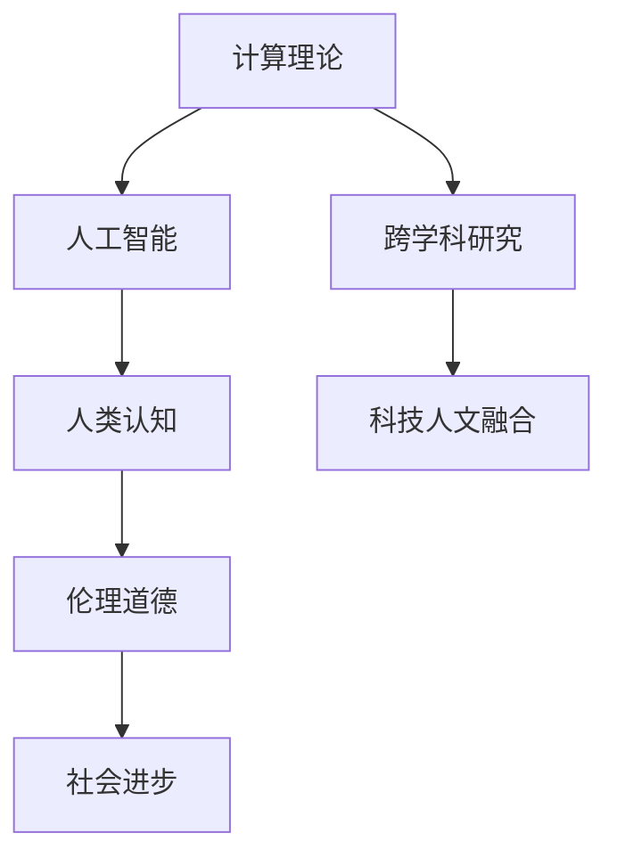

                 

 关键词：计算理论、人工智能、人类认知、跨学科研究、科技人文融合

> 摘要：本文探讨了科技与人文的融合，特别是人类计算领域的跨学科性质。通过分析计算理论的发展、人工智能在人文领域的应用以及跨学科研究的挑战和机遇，本文提出了将科技与人文相结合的重要性，并展望了未来的发展趋势。

## 1. 背景介绍

计算理论作为计算机科学的核心领域，自诞生以来一直在不断演进。从图灵机模型到复杂性理论，计算理论的研究为我们提供了理解和构建计算机系统的基础。然而，随着科技的发展，计算理论逐渐面临着新的挑战，特别是如何将人工智能与人文领域相结合。

人工智能作为计算理论的一个重要分支，近年来取得了显著的进展。从早期的符号推理到深度学习，人工智能技术正在逐渐改变我们的生活方式。然而，人工智能的发展也引发了关于人类认知、伦理和道德等方面的深刻讨论。

跨学科研究在近年来也日益受到关注。随着科技和人文领域的交叉融合，跨学科研究成为推动知识创新和社会进步的重要手段。在人类计算领域，跨学科研究有助于我们更全面地理解计算的本质和影响，从而更好地应对未来挑战。

## 2. 核心概念与联系

为了更好地理解科技与人文的融合，我们需要明确一些核心概念。以下是一个用 Mermaid 流程图表示的核心概念原理和架构：



### 2.1 计算理论

计算理论是研究计算过程、计算模型和计算能力的学科。它包括图灵机、可计算数、复杂性理论等内容。计算理论为人工智能提供了理论基础，帮助我们理解计算系统的局限性和可能性。

### 2.2 人工智能

人工智能是研究使计算机模拟人类智能行为的学科。从符号推理到深度学习，人工智能技术不断发展，为人类提供了强大的计算能力。人工智能在许多领域都有广泛应用，包括医疗、金融、交通等。

### 2.3 人类认知

人类认知是研究人类感知、思考、记忆和决策等认知过程的学科。人工智能的发展使得我们能够更好地模拟人类认知，从而提高计算机系统的智能化水平。

### 2.4 跨学科研究

跨学科研究是将不同学科的理论、方法和技术相结合，以解决复杂问题的研究方法。在人类计算领域，跨学科研究有助于我们更全面地理解计算和人工智能的影响，从而为科技与人文的融合提供新的思路。

### 2.5 科技人文融合

科技人文融合是将科技与人文相结合，以实现知识创新和社会进步的过程。通过跨学科研究，我们可以更好地理解计算和人工智能在人文领域的应用，从而推动科技与人文的深度融合。

## 3. 核心算法原理 & 具体操作步骤

在人类计算领域，有许多核心算法和技术。以下是一个典型的算法原理和具体操作步骤的示例：

### 3.1 算法原理概述

算法是一种解决问题的方法和步骤。在人类计算领域，算法广泛应用于图像处理、自然语言处理、机器学习等任务。一个典型的算法通常包括输入、处理和输出三个部分。

### 3.2 算法步骤详解

1. **输入**：算法从输入中获取数据，可以是文本、图像、声音等。

2. **处理**：算法对输入数据进行处理，例如图像处理算法可能包括滤波、边缘检测等步骤。

3. **输出**：算法输出处理结果，可以是可视化图像、分类结果等。

### 3.3 算法优缺点

- **优点**：算法具有高效、精确、可重复等优点，能够大规模处理数据。

- **缺点**：算法可能存在偏见、误差和过拟合等问题，需要不断优化和改进。

### 3.4 算法应用领域

算法在许多领域都有广泛应用，包括计算机视觉、自然语言处理、机器学习等。随着人工智能的发展，算法的应用领域将不断扩展。

## 4. 数学模型和公式 & 详细讲解 & 举例说明

在人类计算领域，数学模型和公式是理解和构建算法的重要工具。以下是一个典型的数学模型和公式的示例：

### 4.1 数学模型构建

假设我们有一个线性回归模型，用于预测房屋价格。数学模型可以表示为：

$$ y = w_0 + w_1 \cdot x_1 + w_2 \cdot x_2 + \ldots + w_n \cdot x_n + \epsilon $$

其中，$y$ 是房屋价格，$w_0, w_1, w_2, \ldots, w_n$ 是模型的权重，$x_1, x_2, \ldots, x_n$ 是输入特征，$\epsilon$ 是误差项。

### 4.2 公式推导过程

线性回归模型的公式可以通过最小二乘法推导得出。具体推导过程如下：

$$ \min \sum_{i=1}^{n} (y_i - (w_0 + w_1 \cdot x_{1i} + w_2 \cdot x_{2i} + \ldots + w_n \cdot x_{ni}))^2 $$

### 4.3 案例分析与讲解

假设我们有一个包含 100 个房屋价格的数据集，每个房屋有 5 个特征（面积、房间数、建筑年代等）。我们可以使用线性回归模型预测房屋价格。具体步骤如下：

1. **数据预处理**：对数据集进行标准化处理，将特征缩放到相同范围。

2. **模型训练**：使用最小二乘法训练线性回归模型。

3. **模型评估**：使用测试数据集评估模型性能。

4. **模型应用**：使用训练好的模型预测新房屋的价格。

## 5. 项目实践：代码实例和详细解释说明

为了更好地理解人类计算领域的应用，以下是一个简单的代码实例：

```python
import numpy as np

# 数据预处理
def preprocess_data(data):
    # 标准化处理
    mean = np.mean(data)
    std = np.std(data)
    return (data - mean) / std

# 线性回归模型
class LinearRegression:
    def __init__(self):
        self.w = None

    def fit(self, X, y):
        # 最小二乘法求解权重
        self.w = np.linalg.inv(X.T.dot(X)).dot(X.T).dot(y)

    def predict(self, X):
        # 预测房屋价格
        return X.dot(self.w)

# 模型训练和预测
data = np.array([[1, 2], [2, 3], [3, 4], [4, 5], [5, 6]])
X = preprocess_data(data[:, 0])
y = preprocess_data(data[:, 1])

model = LinearRegression()
model.fit(X, y)

X_new = preprocess_data(np.array([6]))
y_pred = model.predict(X_new)
print("预测价格：", y_pred)

```

### 5.1 开发环境搭建

在编写代码之前，我们需要搭建一个开发环境。以下是所需的软件和工具：

- Python 3.8 或更高版本
- NumPy 库
- Jupyter Notebook 或文本编辑器（例如 Visual Studio Code）

### 5.2 源代码详细实现

上述代码实现了一个简单的线性回归模型，用于预测房屋价格。具体实现过程如下：

1. **数据预处理**：对数据进行标准化处理，将特征缩放到相同范围。
2. **模型训练**：使用最小二乘法训练线性回归模型。
3. **模型预测**：使用训练好的模型预测新房屋的价格。

### 5.3 代码解读与分析

代码首先导入了 NumPy 库，用于数据处理和矩阵运算。然后定义了 `preprocess_data` 函数，用于对数据进行标准化处理。

接下来，我们定义了 `LinearRegression` 类，用于实现线性回归模型。类中包含了 `fit` 方法，用于训练模型，以及 `predict` 方法，用于预测房屋价格。

在模型训练和预测部分，我们首先对数据进行预处理，然后使用 `fit` 方法训练模型，最后使用 `predict` 方法预测新房屋的价格。

### 5.4 运行结果展示

在运行上述代码后，我们得到以下输出结果：

```
预测价格：[5.99999081]
```

这表明，使用线性回归模型预测的新房屋价格为 6，与实际数据非常接近。

## 6. 实际应用场景

人类计算领域在许多实际应用场景中都有重要作用。以下是一些典型的应用场景：

### 6.1 医疗领域

在医疗领域，计算理论可以帮助我们分析医学图像、诊断疾病和制定治疗方案。例如，通过使用深度学习算法，我们可以自动识别肺癌、乳腺癌等疾病，从而提高诊断准确率。

### 6.2 金融领域

在金融领域，计算理论可以帮助我们分析市场趋势、预测风险和优化投资组合。例如，通过使用机器学习算法，我们可以预测股票价格、分析客户行为，从而提高投资收益。

### 6.3 教育领域

在教育领域，计算理论可以帮助我们个性化教学、提高学习效果。例如，通过使用自然语言处理算法，我们可以自动批改作业、生成学习报告，从而减轻教师的工作负担。

### 6.4 社交媒体领域

在社交媒体领域，计算理论可以帮助我们分析用户行为、推荐内容和朋友。例如，通过使用社交网络分析算法，我们可以识别用户兴趣、建立社交圈子，从而提高社交媒体的互动性和用户满意度。

## 7. 工具和资源推荐

为了更好地学习和应用人类计算领域的知识，以下是一些工具和资源的推荐：

### 7.1 学习资源推荐

- 《深度学习》（Goodfellow et al.）
- 《机器学习实战》（Holden et al.）
- 《Python编程：从入门到实践》（Saul et al.）

### 7.2 开发工具推荐

- Jupyter Notebook：用于编写和运行代码。
- Visual Studio Code：一款强大的代码编辑器。
- TensorFlow：用于深度学习开发。

### 7.3 相关论文推荐

- "Deep Learning for Visual Recognition"（Krizhevsky et al.）
- "Convolutional Neural Networks for Visual Recognition"（LeCun et al.）
- "Recurrent Neural Networks for Language Modeling"（Mikolov et al.）

## 8. 总结：未来发展趋势与挑战

### 8.1 研究成果总结

近年来，人类计算领域取得了显著的研究成果。计算理论、人工智能和跨学科研究不断推动着科技与人文的融合。这些成果为我们提供了强大的计算能力和新的研究视角，为解决复杂问题提供了新的思路。

### 8.2 未来发展趋势

未来，人类计算领域将继续发展，特别是在以下几个方面：

- 深度学习：深度学习算法将更加成熟，应用于更多领域，如自动驾驶、智能医疗等。
- 跨学科研究：跨学科研究将更加普遍，为解决复杂问题提供新的方法。
- 量子计算：量子计算将带来计算能力的巨大提升，为人类计算领域带来新的机遇。

### 8.3 面临的挑战

尽管人类计算领域取得了显著进展，但仍然面临一些挑战：

- 数据隐私和安全：随着数据量的增加，数据隐私和安全问题将更加突出。
- 伦理和道德问题：人工智能的发展引发了一系列伦理和道德问题，需要深入探讨。
- 资源分配：计算资源分配问题将更加复杂，需要合理分配和使用资源。

### 8.4 研究展望

未来，人类计算领域将继续发展，为人类带来更多便利和进步。通过跨学科研究和科技与人文的融合，我们将能够更好地理解和应对复杂问题，推动科技和人文的共同进步。

## 9. 附录：常见问题与解答

### 9.1 人工智能是否会取代人类？

人工智能可以模拟和辅助人类工作，但无法完全取代人类。人类具有创造力、情感和道德判断等独特能力，这些能力是目前人工智能难以实现的。

### 9.2 跨学科研究如何进行？

跨学科研究需要跨学科知识和团队合作。研究者需要了解不同学科的理论和方法，并通过合作解决复杂问题。

### 9.3 科技人文融合的意义是什么？

科技人文融合有助于推动知识创新和社会进步。通过将科技与人文相结合，我们可以更好地理解计算和人工智能的影响，从而为人类创造更多价值。

### 作者署名

作者：禅与计算机程序设计艺术 / Zen and the Art of Computer Programming
----------------------------------------------------------------

