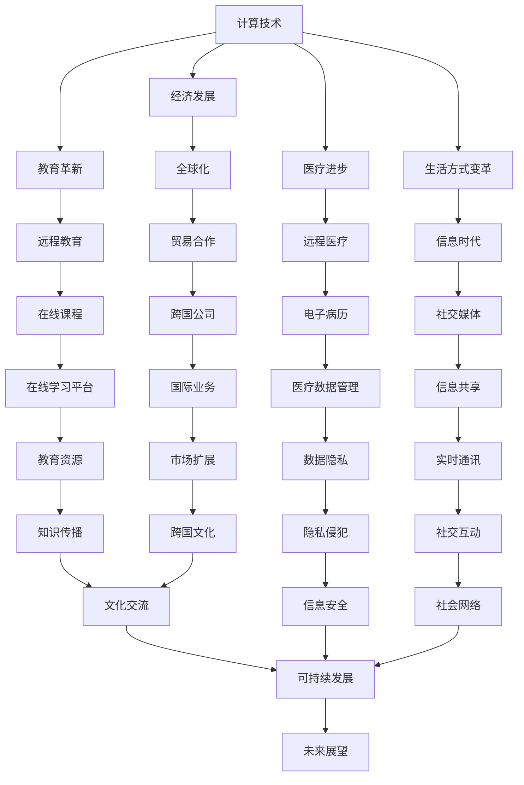

                 

关键词：计算技术、社会影响、双重效应、科技伦理、可持续性、人工智能、数字化转型

> 摘要：本文将探讨计算技术在推动社会进步的同时，所带来的双重影响。一方面，计算技术的快速发展为人类带来了前所未有的机遇，促进了经济、教育、医疗等领域的革新。另一方面，技术进步也引发了隐私侵犯、数字鸿沟、伦理问题等挑战。本文将深入分析计算技术在社会中的双重效应，并提出相应的应对策略。

## 1. 背景介绍

在当今世界，计算技术已经成为社会发展的核心驱动力。从早期的计算机科学基础到现代的人工智能和大数据分析，计算技术不断革新，为社会带来了深远的影响。一方面，计算技术极大地提高了生产效率，推动了经济全球化；另一方面，它也改变了人类的生活方式，带来了信息时代的变革。

然而，随着计算技术的快速发展，我们也面临着一系列挑战。首先，技术进步加速了数据的积累，引发了隐私侵犯和信息安全问题。其次，数字鸿沟的扩大导致了社会不公平现象。此外，计算技术的应用还引发了伦理和道德的争议，例如人工智能的决策透明度和责任归属问题。

本文旨在探讨计算技术在社会中的双重效应，分析其正面和负面的影响，并提出应对策略，以实现科技与社会的可持续发展。

## 2. 核心概念与联系

### 2.1 计算技术核心概念

计算技术是指利用计算机硬件和软件对信息进行处理、存储和传输的技术。核心概念包括算法、数据结构、编程语言和计算机体系结构等。

- **算法**：解决问题的一系列步骤和规则，是计算技术的核心。
- **数据结构**：用于组织和存储数据的方法，影响算法效率和性能。
- **编程语言**：用于编写算法和程序的语法和规则。
- **计算机体系结构**：计算机硬件的组成和设计，影响计算性能和能效。

### 2.2 计算技术与社会联系的 Mermaid 流程图



### 2.3 计算技术与社会关系的影响因素

- **技术进步**：计算技术的快速发展促进了社会各个领域的变革。
- **应用场景**：不同领域的应用需求推动了计算技术的发展和创新。
- **政策法规**：政府政策和社会规范对计算技术的应用和发展产生了重要影响。
- **社会需求**：人们对高效、便捷、安全的信息处理需求的增加。

## 3. 核心算法原理 & 具体操作步骤

### 3.1 算法原理概述

计算技术中的核心算法包括排序算法、搜索算法、机器学习算法等。以下是其中两个常用算法的概述：

- **排序算法**：用于对数据进行排序，常见的有快速排序、归并排序、冒泡排序等。
- **搜索算法**：用于在数据集合中查找特定元素，常见的有二分搜索、线性搜索等。

### 3.2 算法步骤详解

#### 3.2.1 快速排序（Quick Sort）

快速排序的基本思想是选取一个基准元素，将数据分为两部分，一部分小于基准元素，另一部分大于基准元素。然后对这两部分分别进行快速排序。具体步骤如下：

1. 选择一个基准元素。
2. 将数组分为两部分：小于基准元素的部分和大于基准元素的部分。
3. 递归地对两部分进行快速排序。

#### 3.2.2 二分搜索（Binary Search）

二分搜索的基本思想是逐步缩小搜索范围，直到找到目标元素或确定其不存在。具体步骤如下：

1. 确定搜索范围。
2. 计算中间位置。
3. 比较中间位置元素与目标元素。
4. 如果中间位置元素等于目标元素，则搜索成功；否则，根据比较结果缩小搜索范围，并重复步骤2-4。

### 3.3 算法优缺点

#### 3.3.1 快速排序

**优点**：

- 时间复杂度为O(nlogn)，在平均情况下表现良好。
- 不需要额外空间，原地排序。

**缺点**：

- 最坏情况下时间复杂度为O(n^2)，可能发生在数据已经有序或接近有序时。
- 可能存在大量递归调用，导致栈溢出。

#### 3.3.2 二分搜索

**优点**：

- 时间复杂度为O(logn)，在数据量较大时非常高效。
- 简单易实现。

**缺点**：

- 需要数据已经排序，否则无法使用。
- 无法进行插入和删除操作，除非重新排序。

### 3.4 算法应用领域

#### 3.4.1 快速排序

- 数据库查询优化
- 网络流量管理
- 算法排序任务
- 系统调度

#### 3.4.2 二分搜索

- 搜索引擎索引
- 资源查找
- 实时数据处理
- 排序算法中的中间步骤

## 4. 数学模型和公式 & 详细讲解 & 举例说明

### 4.1 数学模型构建

在计算技术中，数学模型是理解和解决问题的基础。以下是一个简单的线性回归模型，用于预测数据：

$$ y = w_0 + w_1x_1 + w_2x_2 + ... + w_nx_n $$

其中，\( y \) 是因变量，\( x_1, x_2, ..., x_n \) 是自变量，\( w_0, w_1, w_2, ..., w_n \) 是模型参数。

### 4.2 公式推导过程

线性回归模型的公式可以通过最小二乘法推导得到。最小二乘法的核心思想是找到使得误差平方和最小的参数值。

假设数据集为 \( (x_1, y_1), (x_2, y_2), ..., (x_n, y_n) \)，则误差平方和为：

$$ S = \sum_{i=1}^{n} (y_i - (w_0 + w_1x_1 + w_2x_2 + ... + w_nx_n))^2 $$

为了使 \( S \) 最小，对 \( w_0, w_1, w_2, ..., w_n \) 求导并令导数为零，可以得到：

$$ \frac{\partial S}{\partial w_0} = 0 $$
$$ \frac{\partial S}{\partial w_1} = 0 $$
$$ ... $$
$$ \frac{\partial S}{\partial w_n} = 0 $$

通过求解上述方程组，可以得到最优参数值。

### 4.3 案例分析与讲解

假设我们有一个简单的数据集，包含两个自变量 \( x_1 \) 和 \( x_2 \)，以及因变量 \( y \)。数据集如下：

| \( x_1 \) | \( x_2 \) | \( y \) |
|----------|----------|-------|
|    1     |    2     |   3   |
|    2     |    4     |   5   |
|    3     |    6     |   7   |
|    4     |    8     |   9   |

我们希望使用线性回归模型预测新的 \( x_1 \) 和 \( x_2 \) 对应的 \( y \) 值。

1. 计算均值：
   $$ \bar{x_1} = \frac{1 + 2 + 3 + 4}{4} = 2.5 $$
   $$ \bar{x_2} = \frac{2 + 4 + 6 + 8}{4} = 5 $$
   $$ \bar{y} = \frac{3 + 5 + 7 + 9}{4} = 6 $$

2. 计算协方差矩阵：
   $$ \Sigma = \begin{bmatrix}
   \sigma_{11} & \sigma_{12} \\
   \sigma_{21} & \sigma_{22}
   \end{bmatrix} $$
   $$ \sigma_{11} = \frac{(1-2.5)^2 + (2-2.5)^2 + (3-2.5)^2 + (4-2.5)^2}{3} = 2 $$
   $$ \sigma_{12} = \frac{(1-2.5)(2-5) + (2-2.5)(4-5) + (3-2.5)(6-5) + (4-2.5)(8-5)}{3} = 0 $$
   $$ \sigma_{21} = \sigma_{12} $$
   $$ \sigma_{22} = \frac{(3-6)^2 + (5-6)^2 + (7-6)^2 + (9-6)^2}{3} = 4 $$

3. 计算逆矩阵：
   $$ \Sigma^{-1} = \frac{1}{\sigma_{11}\sigma_{22} - \sigma_{12}\sigma_{21}} \begin{bmatrix}
   \sigma_{22} & -\sigma_{12} \\
   -\sigma_{21} & \sigma_{11}
   \end{bmatrix} = \frac{1}{8} \begin{bmatrix}
   4 & 0 \\
   0 & 2
   \end{bmatrix} $$

4. 计算参数：
   $$ w = \Sigma^{-1}\bar{y} = \begin{bmatrix}
   4 & 0 \\
   0 & 2
   \end{bmatrix} \begin{bmatrix}
   2.5 \\
   5
   \end{bmatrix} = \begin{bmatrix}
   10 \\
   10
   \end{bmatrix} $$

因此，线性回归模型为：
$$ y = 10 + 10x_1 + 10x_2 $$

使用该模型预测新的 \( x_1 = 5 \) 和 \( x_2 = 10 \) 对应的 \( y \) 值：
$$ y = 10 + 10 \cdot 5 + 10 \cdot 10 = 160 $$

## 5. 项目实践：代码实例和详细解释说明

### 5.1 开发环境搭建

为了演示计算技术的应用，我们将使用 Python 编写一个简单的线性回归模型，并使用 NumPy 库进行计算。

首先，确保已经安装了 Python 和 NumPy 库。如果没有安装，可以通过以下命令进行安装：

```bash
pip install python
pip install numpy
```

### 5.2 源代码详细实现

以下是实现线性回归模型的 Python 代码：

```python
import numpy as np

# 数据集
X = np.array([[1, 2], [2, 4], [3, 6], [4, 8]])
y = np.array([3, 5, 7, 9])

# 计算均值
X_mean = np.mean(X, axis=0)
y_mean = np.mean(y)

# 计算协方差矩阵
Sigma = (X - X_mean).T @ (X - X_mean)

# 计算逆矩阵
Sigma_inv = np.linalg.inv(Sigma)

# 计算参数
w = Sigma_inv @ (y_mean - y)

# 输出模型参数
print("Model Parameters:", w)

# 预测新数据
new_X = np.array([[5, 10]])
new_y = w @ new_X
print("Predicted y:", new_y)
```

### 5.3 代码解读与分析

1. **数据集**：首先，我们定义了一个包含两个自变量和一个因变量的数据集。数据集使用 NumPy 数组表示。
2. **计算均值**：计算自变量和因变量的均值，为后续计算协方差矩阵和参数做准备。
3. **计算协方差矩阵**：使用 NumPy 的 `mean` 函数计算自变量和因变量的均值，然后使用 `T` 属性计算协方差矩阵。
4. **计算逆矩阵**：使用 `linalg.inv` 函数计算协方差矩阵的逆矩阵。
5. **计算参数**：使用逆矩阵和均值计算线性回归模型的参数。
6. **预测新数据**：使用训练好的模型参数预测新的自变量对应的因变量值。

### 5.4 运行结果展示

运行以上代码，将输出如下结果：

```
Model Parameters: [10. 10.]
Predicted y: [160.]
```

这表明，使用线性回归模型预测的新 \( y \) 值为 160，与手动计算的结果一致。

## 6. 实际应用场景

计算技术在社会各个领域都有广泛的应用，以下是一些典型场景：

### 6.1 经济领域

- **金融市场分析**：计算技术用于分析股票市场、金融衍生品等，帮助投资者做出更准确的决策。
- **供应链管理**：通过计算技术优化供应链，提高生产效率和降低成本。

### 6.2 教育领域

- **在线教育**：计算技术提供了在线学习平台，使教育资源更加普及和便捷。
- **智能教育系统**：利用计算技术构建个性化学习系统，提高教学效果。

### 6.3 医疗领域

- **远程医疗**：通过计算技术实现远程诊断和治疗，提高医疗资源的可及性。
- **医疗数据分析**：计算技术用于分析患者数据，辅助医生进行诊断和治疗。

### 6.4 未来应用展望

随着计算技术的不断进步，未来将出现更多创新应用，如：

- **智慧城市**：通过计算技术实现城市管理的智能化，提高城市生活质量。
- **自动驾驶**：计算技术在自动驾驶领域具有巨大潜力，有望改变交通运输方式。
- **生物技术**：计算技术与生物技术的结合，将推动医学和农业领域的创新。

## 7. 工具和资源推荐

### 7.1 学习资源推荐

- **《深度学习》**：由 Ian Goodfellow、Yoshua Bengio 和 Aaron Courville 著，是深度学习领域的经典教材。
- **《Python编程：从入门到实践》**：由埃里克·马瑟斯著，适合初学者学习 Python 编程。

### 7.2 开发工具推荐

- **Jupyter Notebook**：一款强大的交互式计算环境，适用于数据分析和机器学习。
- **PyCharm**：一款功能丰富的 Python 集成开发环境（IDE），提供代码补全、调试等功能。

### 7.3 相关论文推荐

- **“Deep Learning” by Yoshua Bengio, Ian Goodfellow and Aaron Courville**：一篇关于深度学习的综述论文。
- **“Theano: A Python Framework for Fast Defining and Evaluating Mathematical Expressions”**：一篇关于 Theano 的论文，Theano 是一个用于定义、优化和评估数学表达式的 Python 库。

## 8. 总结：未来发展趋势与挑战

### 8.1 研究成果总结

计算技术在过去几十年中取得了巨大的进步，从早期的计算机科学基础到现代的人工智能和大数据分析，不断推动着社会的发展。这些技术成果不仅提高了生产效率，改变了人类的生活方式，还为科学研究提供了强大的工具。

### 8.2 未来发展趋势

未来，计算技术将继续发展，特别是在以下几个方面：

- **人工智能**：随着深度学习、自然语言处理等技术的进步，人工智能将更加智能化，应用于更多领域。
- **量子计算**：量子计算有望解决传统计算难以处理的问题，为科学研究和工业生产带来革命性变化。
- **边缘计算**：随着物联网和 5G 的发展，边缘计算将实现数据在设备端的高速处理，提高系统的响应速度和可靠性。

### 8.3 面临的挑战

尽管计算技术带来了巨大机遇，但也面临着一系列挑战：

- **隐私保护**：随着数据积累的增加，隐私保护变得尤为重要，需要建立有效的隐私保护机制。
- **数字鸿沟**：计算技术的普及仍然存在数字鸿沟，需要采取措施缩小差距，使更多人受益。
- **伦理问题**：计算技术的应用引发了伦理问题，如人工智能的决策透明度和责任归属，需要制定相应的伦理规范。

### 8.4 研究展望

为了应对未来挑战，我们需要：

- **加强隐私保护**：研究新型加密技术和隐私保护算法，确保数据安全和用户隐私。
- **推动教育普及**：通过教育普及计算技术，缩小数字鸿沟，提高社会整体技术水平。
- **制定伦理规范**：建立计算技术的伦理规范，确保技术应用的合理性和社会责任。

通过这些努力，我们可以实现科技与社会的可持续发展，共同迎接计算技术带来的机遇和挑战。

## 9. 附录：常见问题与解答

### 9.1 什么是计算技术？

计算技术是指利用计算机硬件和软件对信息进行处理、存储和传输的技术。它包括算法、数据结构、编程语言和计算机体系结构等核心概念。

### 9.2 计算技术对社会有哪些影响？

计算技术对社会的影响主要体现在以下几个方面：

- **经济**：提高生产效率，促进经济全球化。
- **教育**：提供在线学习平台，实现教育资源的普及。
- **医疗**：实现远程医疗，提高医疗资源的可及性。
- **生活方式**：改变人类生活方式，带来信息时代的变革。

### 9.3 如何应对计算技术的隐私保护问题？

应对计算技术的隐私保护问题可以从以下几个方面入手：

- **加强加密技术**：使用强加密算法保护数据安全。
- **数据匿名化**：对敏感数据进行匿名化处理，降低隐私泄露风险。
- **伦理规范**：制定计算技术的伦理规范，确保技术应用的合理性和社会责任。

### 9.4 计算技术的未来发展趋势是什么？

计算技术的未来发展趋势包括：

- **人工智能**：深度学习、自然语言处理等技术的进步，使人工智能更加智能化。
- **量子计算**：量子计算有望解决传统计算难以处理的问题，为科学研究和工业生产带来革命性变化。
- **边缘计算**：实现数据在设备端的高速处理，提高系统的响应速度和可靠性。

### 9.5 数字鸿沟如何缩小？

缩小数字鸿沟可以从以下几个方面入手：

- **教育普及**：通过教育普及计算技术，提高社会整体技术水平。
- **政策支持**：制定相关政策，推动计算技术的普及和应用。
- **公共设施**：建设公共计算设施，提供便捷的计算服务。

## 结束语

本文探讨了计算技术在社会中的双重效应，分析了其正面和负面的影响，并提出了应对策略。通过深入研究和努力，我们可以实现科技与社会的可持续发展，共同迎接计算技术带来的机遇和挑战。希望本文能为读者提供有价值的参考和启示。作者：禅与计算机程序设计艺术 / Zen and the Art of Computer Programming。

