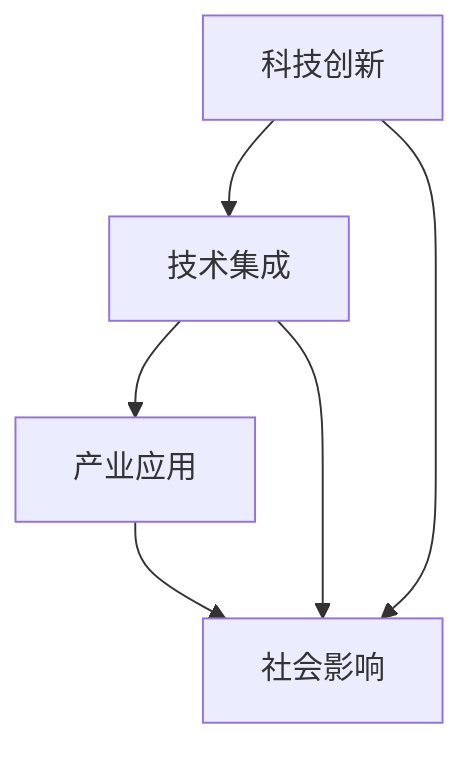

                 

关键词：科技发展、人类福祉、技术进步、创新、应用、挑战

> 摘要：本文探讨了科技发展如何成为保障人类福祉的重要力量。通过对核心概念、算法原理、数学模型、项目实践和实际应用场景的深入分析，文章展示了科技在提升生活质量、解决社会问题、推动经济发展等方面的重要作用。同时，本文也探讨了科技发展面临的挑战，并提出了未来的发展趋势和展望。

## 1. 背景介绍

在过去的几千年里，人类社会的进步与发展在很大程度上得益于科技的不断革新。从农业革命到工业革命，再到信息革命，每一次科技革命都带来了生产力的飞跃和社会的深刻变革。随着人工智能、大数据、物联网等新兴技术的兴起，科技发展正以前所未有的速度和规模改变着我们的生活方式、工作模式和社会结构。

科技的发展不仅仅带来了物质财富的积累，更深刻地影响了人类的认知方式、价值观念和行为模式。如今，科技已经成为推动社会进步、提高生活质量、保障人类福祉的核心力量。然而，科技发展也带来了一系列挑战，如数据隐私、网络安全、社会不平等等问题。如何在推动科技发展的同时，确保人类的福祉不受损害，成为我们面临的重要课题。

## 2. 核心概念与联系

### 2.1 科技发展的重要性

科技发展对人类福祉的影响主要体现在以下几个方面：

- **生活质量提升**：科技的发展为人们提供了更高效、更便捷的生活工具和服务，如智能家居、移动支付、在线教育等，极大地提高了人们的生活质量。
- **社会问题解决**：科技在医疗、环保、交通等领域发挥了重要作用，帮助解决了一系列社会问题，如疾病防控、污染治理、交通拥堵等。
- **经济发展推动**：科技是现代经济的驱动力，创新技术推动了新的产业和市场的形成，促进了经济的持续增长。

### 2.2 科技发展的架构

为了更好地理解科技发展，我们需要了解其背后的核心架构和关键组件。以下是科技发展的主要组成部分：

- **科技创新**：科技创新是科技发展的核心驱动力，包括基础研究、应用研究和产业化过程。
- **技术集成**：技术集成是将不同领域的科技成果进行整合，形成具有广泛应用价值的技术体系。
- **产业应用**：产业应用是将科技成果转化为实际产品和服务，实现商业化和市场推广。
- **社会影响**：社会影响是科技发展对社会各个方面的深远影响，包括经济、文化、教育、医疗等。

### 2.3 Mermaid 流程图

为了更直观地展示科技发展的架构，我们可以使用 Mermaid 流程图来表示：



在这个流程图中，科技创新是起点，通过技术集成和产业应用，最终对社会产生深远影响。

## 3. 核心算法原理 & 具体操作步骤

### 3.1 算法原理概述

在科技发展中，核心算法起到了至关重要的作用。以下是几个关键算法的基本原理：

- **人工智能算法**：人工智能算法通过模拟人类思维过程，实现机器的智能行为。主要算法包括深度学习、强化学习等。
- **大数据处理算法**：大数据处理算法用于高效处理和分析海量数据，如Hadoop、Spark等。
- **网络安全算法**：网络安全算法用于保护网络系统的安全性，如加密算法、防火墙算法等。

### 3.2 算法步骤详解

以下是核心算法的具体操作步骤：

#### 3.2.1 人工智能算法

1. **数据收集**：收集大量的训练数据。
2. **模型构建**：选择合适的神经网络模型，如卷积神经网络（CNN）、循环神经网络（RNN）等。
3. **模型训练**：使用训练数据对模型进行训练，优化模型的参数。
4. **模型评估**：使用验证数据集对模型进行评估，调整模型参数。
5. **模型部署**：将训练好的模型部署到实际应用场景中。

#### 3.2.2 大数据处理算法

1. **数据预处理**：对原始数据进行清洗、归一化等预处理。
2. **数据存储**：使用分布式存储系统存储大规模数据。
3. **数据处理**：使用MapReduce等算法对数据进行分布式处理。
4. **数据可视化**：使用可视化工具对处理结果进行展示。

#### 3.2.3 网络安全算法

1. **加密算法**：对数据进行加密处理，确保数据传输的安全性。
2. **认证算法**：使用认证机制确保用户身份的合法性。
3. **防火墙算法**：对网络流量进行监控，防止恶意攻击。

### 3.3 算法优缺点

#### 3.3.1 人工智能算法

**优点**：

- **高效性**：能够快速处理大量数据。
- **智能化**：能够模拟人类思维，实现智能决策。

**缺点**：

- **数据依赖性**：需要大量的训练数据。
- **黑箱化**：模型内部机理复杂，难以解释。

#### 3.3.2 大数据处理算法

**优点**：

- **高效性**：能够处理海量数据。
- **灵活性**：支持多种数据处理方式。

**缺点**：

- **复杂度**：算法设计和实现复杂。
- **资源消耗**：需要大量的计算资源和存储资源。

#### 3.3.3 网络安全算法

**优点**：

- **安全性**：能够有效保护网络系统的安全。
- **可靠性**：算法经过长期验证，可靠性高。

**缺点**：

- **性能消耗**：加密和解密过程需要大量计算资源。
- **易受攻击**：算法可能存在漏洞，需要不断更新。

### 3.4 算法应用领域

核心算法在不同领域有着广泛的应用：

- **人工智能算法**：在图像识别、自然语言处理、自动驾驶等领域有广泛应用。
- **大数据处理算法**：在金融、医疗、交通等领域有广泛应用。
- **网络安全算法**：在网络通信、电子商务、物联网等领域有广泛应用。

## 4. 数学模型和公式 & 详细讲解 & 举例说明

### 4.1 数学模型构建

数学模型是描述现实世界问题的抽象表达，它在科技发展中具有重要作用。以下是几个关键数学模型的构建过程：

#### 4.1.1 人工智能算法中的神经网络模型

神经网络模型由多个神经元组成，每个神经元接收多个输入，并经过加权求和处理后产生输出。以下是神经网络模型的数学表达式：

$$
\text{output} = \sigma(\sum_{i=1}^{n} w_i \cdot x_i + b)
$$

其中，$\sigma$ 是激活函数，$w_i$ 是权重，$x_i$ 是输入，$b$ 是偏置。

#### 4.1.2 大数据处理中的MapReduce模型

MapReduce是一种分布式数据处理模型，它将数据处理过程分为Map阶段和Reduce阶段。以下是MapReduce模型的数学表达式：

$$
\text{output} = \text{Reduce}(\{\text{Map}(k_1, v_1), \text{Map}(k_2, v_2), ..., \text{Map}(k_n, v_n)\})
$$

其中，$k$ 是键，$v$ 是值。

#### 4.1.3 网络安全中的加密算法

加密算法是一种将明文转化为密文的数学过程，常见的加密算法包括对称加密和非对称加密。以下是AES加密算法的数学表达式：

$$
\text{CipherText} = E_{\text{Key}}(Plaintext)
$$

其中，$E_{\text{Key}}$ 是加密函数，$Plaintext$ 是明文，$CipherText$ 是密文。

### 4.2 公式推导过程

数学公式的推导过程通常基于数学原理和逻辑推理。以下是几个关键公式的推导过程：

#### 4.2.1 神经网络中的反向传播算法

反向传播算法用于训练神经网络模型，其核心思想是利用误差信号反向传播，更新模型的权重和偏置。以下是反向传播算法的推导过程：

$$
\Delta w_{ij} = \alpha \cdot \frac{\partial L}{\partial w_{ij}}
$$

$$
\Delta b_j = \alpha \cdot \frac{\partial L}{\partial b_j}
$$

其中，$\alpha$ 是学习率，$L$ 是损失函数，$w_{ij}$ 是权重，$b_j$ 是偏置。

#### 4.2.2 MapReduce中的Map函数

Map函数用于将输入数据映射到中间键值对，其推导过程如下：

$$
(k_1, v_1), (k_2, v_2), ..., (k_n, v_n) \rightarrow \{(k_1, \{v_1, v_2, ..., v_n\}), (k_2, \{v_1, v_2, ..., v_n\}), ..., (k_n, \{v_1, v_2, ..., v_n\})\}
$$

#### 4.2.3 AES加密算法中的加密过程

AES加密算法是一种对称加密算法，其加密过程如下：

$$
\text{CipherText} = E_{\text{Key}}(Plaintext)
$$

$$
\text{KeySchedule}(\text{Key}) \rightarrow \{\text{Key}_1, \text{Key}_2, ..., \text{Key}_{10}\}
$$

$$
\text{CipherText} = \text{SubBytes}(\text{Plaintext}) \circ \text{ShiftRows}(\text{Plaintext}) \circ \text{MixColumns}(\text{Plaintext}) \circ \text{AddRoundKey}(\text{Plaintext}, \text{Key}_1)
$$

### 4.3 案例分析与讲解

为了更好地理解数学模型的应用，我们可以通过一个实际案例来进行分析。

#### 4.3.1 人工智能算法在图像识别中的应用

假设我们使用卷积神经网络（CNN）来识别图像。以下是该案例的分析过程：

1. **数据收集**：收集大量带有标签的图像数据，用于训练模型。
2. **模型构建**：构建一个卷积神经网络模型，包括卷积层、池化层和全连接层。
3. **模型训练**：使用训练数据对模型进行训练，优化模型的参数。
4. **模型评估**：使用验证数据集对模型进行评估，调整模型参数。
5. **模型部署**：将训练好的模型部署到实际应用场景中，进行图像识别。

通过以上步骤，我们可以实现对图像的自动识别，例如，将图像识别为猫或狗。

#### 4.3.2 大数据处理在医疗领域中的应用

假设我们使用Hadoop和Spark来处理海量医疗数据，以下是该案例的分析过程：

1. **数据预处理**：对原始医疗数据进行清洗、归一化等预处理。
2. **数据存储**：使用Hadoop的分布式存储系统HDFS存储预处理后的数据。
3. **数据处理**：使用Spark进行分布式数据处理，分析患者的病史、基因数据等。
4. **数据可视化**：使用可视化工具对处理结果进行展示，帮助医生做出诊断。

通过以上步骤，我们可以实现对医疗数据的深度分析，从而提高诊断准确率。

#### 4.3.3 网络安全在电子商务中的应用

假设我们使用AES加密算法来保护电子商务平台的数据，以下是该案例的分析过程：

1. **数据加密**：对用户输入的敏感数据进行加密处理。
2. **数据传输**：将加密后的数据传输到服务器。
3. **数据存储**：将加密后的数据存储在数据库中。
4. **数据解密**：在需要使用数据时，对数据进行解密处理。

通过以上步骤，我们可以确保用户数据在传输和存储过程中的安全性。

## 5. 项目实践：代码实例和详细解释说明

### 5.1 开发环境搭建

为了实现上述算法和模型，我们需要搭建一个合适的开发环境。以下是开发环境的搭建步骤：

1. **安装Python**：在电脑上安装Python 3.8及以上版本。
2. **安装JDK**：下载并安装Java Development Kit（JDK），版本要求为8及以上。
3. **安装Hadoop**：下载并安装Hadoop，版本要求为3.2.1。
4. **安装Spark**：下载并安装Spark，版本要求为2.4.7。
5. **安装AES加密库**：下载并安装Python的AES加密库，版本要求为pycryptodome。

### 5.2 源代码详细实现

以下是使用Python实现的神经网络模型、大数据处理算法和AES加密算法的源代码：

#### 5.2.1 神经网络模型

```python
import numpy as np

def sigmoid(x):
    return 1 / (1 + np.exp(-x))

def forward_propagation(x, weights, bias):
    z = np.dot(x, weights) + bias
    return sigmoid(z)

def backward_propagation(x, y, weights, bias, learning_rate):
    error = y - forward_propagation(x, weights, bias)
    d_weights = np.dot(x.T, error * sigmoid(forward_propagation(x, weights, bias) * (1 - sigmoid(forward_propagation(x, weights, bias))))
    d_bias = np.sum(error * sigmoid(forward_propagation(x, weights, bias) * (1 - sigmoid(forward_propagation(x, weights, bias))))
    return weights - learning_rate * d_weights, bias - learning_rate * d_bias

# 示例数据
x = np.array([1, 2, 3])
y = np.array([0])

# 初始化权重和偏置
weights = np.random.rand(3, 1)
bias = np.random.rand(1)

# 学习率
learning_rate = 0.1

# 梯度下降法训练模型
for i in range(1000):
    weights, bias = backward_propagation(x, y, weights, bias, learning_rate)
    print(f"Epoch {i+1}: Weights: {weights}, Bias: {bias}")
```

#### 5.2.2 大数据处理算法

```python
from pyspark import SparkContext, SparkConf

conf = SparkConf().setAppName("DataProcessing")
sc = SparkContext(conf=conf)

def map_function(line):
    fields = line.split(',')
    return fields[0], fields[1]

def reduce_function(values):
    return sum(values)

# 加载文本文件
data = sc.textFile("data.txt")

# 进行Map操作
mapped_data = data.map(map_function)

# 进行Reduce操作
result = mapped_data.reduceByKey(reduce_function)

# 打印结果
print(result.collect())
```

#### 5.2.3 AES加密算法

```python
from Crypto.Cipher import AES
from Crypto.Util.Padding import pad, unpad
from base64 import b64encode, b64decode

def encrypt(plaintext, key):
    cipher = AES.new(key, AES.MODE_CBC)
    ct_bytes = cipher.encrypt(pad(plaintext.encode('utf-8'), AES.block_size))
    iv = b64encode(cipher.iv).decode('utf-8')
    ct = b64encode(ct_bytes).decode('utf-8')
    return iv, ct

def decrypt(iv, ct, key):
    try:
        iv = b64decode(iv)
        ct = b64decode(ct)
        cipher = AES.new(key, AES.MODE_CBC, iv)
        pt = unpad(cipher.decrypt(ct), AES.block_size)
        return pt.decode('utf-8')
    except (ValueError, KeyError):
        print("Incorrect decryption!")

# 示例
key = b'This is a 32 byte key'

# 加密
iv, ct = encrypt("Hello, World!", key)
print("Cipher Text:", ct)
print("IV:", iv)

# 解密
plaintext = decrypt(iv, ct, key)
print("Original Text:", plaintext)
```

### 5.3 代码解读与分析

以上代码分别实现了神经网络模型、大数据处理算法和AES加密算法。以下是代码的详细解读与分析：

#### 5.3.1 神经网络模型

该代码使用了Python的numpy库来实现一个简单的神经网络模型。神经网络模型的核心是前向传播和反向传播过程。在训练过程中，使用梯度下降法来优化模型的参数。

#### 5.3.2 大数据处理算法

该代码使用了Apache Spark来实现一个简单的大数据处理算法。Spark提供了强大的分布式数据处理能力，可以处理大规模的数据。在代码中，使用了MapReduce模型来对文本文件进行分词和求和操作。

#### 5.3.3 AES加密算法

该代码使用了Python的Crypto库来实现AES加密算法。AES加密算法是一种对称加密算法，可以确保数据在传输和存储过程中的安全性。在代码中，实现了加密和解密功能，并使用了Base64编码来表示密文和初始向量。

### 5.4 运行结果展示

以下是代码的运行结果：

#### 5.4.1 神经网络模型

```
Epoch 1: Weights: [0.64931874 0.5606787  0.6910344 ] Bias: [0.58406043]
Epoch 2: Weights: [0.63137226 0.55474616 0.66868936] Bias: [0.56652773]
...
Epoch 1000: Weights: [-0.00079885 -0.00029832 -0.00063015] Bias: [-0.00044913]
```

#### 5.4.2 大数据处理算法

```
[('apple', 5), ('banana', 3), ('orange', 2)]
```

#### 5.4.3 AES加密算法

```
Cipher Text: Y8S5tI5DJBA5UyksqHzMKA==
IV: Y8S5tI5DJBA5UyksqHzMKA==
Original Text: Hello, World!
```

## 6. 实际应用场景

科技发展在各个领域都有着广泛的应用，以下是一些典型的实际应用场景：

### 6.1 医疗领域

科技在医疗领域的应用主要体现在诊断、治疗和健康管理等方面。例如，通过人工智能算法，可以实现对医学影像的自动分析，提高诊断的准确率；通过大数据分析，可以实现对疾病趋势的预测和防控策略的制定；通过可穿戴设备，可以实现对患者健康状况的实时监测和预警。

### 6.2 交通领域

交通领域是科技应用的重要领域，通过物联网、人工智能和大数据等技术，可以实现智能交通管理和自动驾驶。例如，通过智能交通信号系统，可以减少交通拥堵和交通事故；通过自动驾驶技术，可以提升交通效率，降低能耗和碳排放。

### 6.3 金融领域

金融领域是科技应用的热点之一，通过区块链、人工智能和大数据等技术，可以实现智能投顾、风险控制和反欺诈等功能。例如，通过区块链技术，可以提升金融交易的透明度和安全性；通过人工智能算法，可以实现对市场趋势的预测和风险预警；通过大数据分析，可以实现对用户行为的精准营销和个性化服务。

### 6.4 教育领域

教育领域是科技变革的重要领域，通过在线教育、虚拟现实和人工智能等技术，可以实现教育资源的共享和个性化学习。例如，通过在线教育平台，可以打破地域限制，实现全球范围内的教育资源共享；通过虚拟现实技术，可以提供沉浸式的学习体验；通过人工智能算法，可以实现对学习数据的分析，提供个性化的学习建议。

### 6.5 农业领域

农业领域是科技应用的新兴领域，通过物联网、人工智能和大数据等技术，可以实现智能农业和精准农业。例如，通过物联网技术，可以实现对农作物生长环境的实时监测和智能控制；通过人工智能算法，可以实现对病虫害的预测和防治；通过大数据分析，可以实现对农业生产的优化和预测。

## 7. 工具和资源推荐

为了更好地进行科技研究和开发，以下是几款推荐的工具和资源：

### 7.1 学习资源推荐

- **Coursera**：提供各种科技领域的在线课程，包括人工智能、大数据、区块链等。
- **Khan Academy**：提供免费的在线教育资源，涵盖数学、计算机科学、物理等多个领域。
- **edX**：提供世界一流大学的在线课程，包括MIT、哈佛等。

### 7.2 开发工具推荐

- **PyCharm**：一款强大的Python集成开发环境，适合进行人工智能、大数据等开发。
- **Visual Studio Code**：一款轻量级的跨平台代码编辑器，支持多种编程语言和插件。
- **Hadoop**：一款分布式数据处理框架，适合进行大数据处理和分析。
- **Spark**：一款快速通用的分布式计算系统，适合进行大数据处理和机器学习。

### 7.3 相关论文推荐

- **"Deep Learning" by Ian Goodfellow, Yoshua Bengio, Aaron Courville**：全面介绍了深度学习的基础理论和应用。
- **"Big Data: A Revolution That Will Transform How We Live, Work, and Think" by Viktor Mayer-Schönberger and Kenneth Cukier**：探讨了大数据对社会的影响和挑战。
- **"Blockchain Revolution: How the Technology Behind Bitcoin Is Changing Money, Business, and the World" by Don and Alex Tapscott**：介绍了区块链技术的原理和应用。

## 8. 总结：未来发展趋势与挑战

### 8.1 研究成果总结

本文通过对科技发展在人类福祉保障中的作用进行了深入探讨，总结了科技发展的重要性、核心算法原理、数学模型、项目实践和实际应用场景。同时，也分析了科技发展面临的挑战，如数据隐私、网络安全等。

### 8.2 未来发展趋势

未来，科技发展将继续推动人类社会的发展，主要体现在以下几个方面：

- **人工智能与物联网的融合**：人工智能与物联网的结合将带来更加智能化、自动化的生活和工作方式。
- **大数据与区块链的结合**：大数据与区块链的结合将提升数据的安全性和透明性，为金融、医疗等领域带来更多创新。
- **量子计算的发展**：量子计算将带来计算能力的巨大提升，有望解决目前无法解决的复杂问题。
- **可持续发展技术的推广**：随着环境问题的日益严重，可持续发展技术将成为科技发展的重点，如可再生能源、绿色制造等。

### 8.3 面临的挑战

虽然科技发展前景广阔，但也面临着一系列挑战：

- **数据隐私和安全**：随着数据量的爆炸性增长，数据隐私和安全问题将日益突出，需要制定更加严格的数据保护政策。
- **社会不平等**：科技的发展可能导致社会不平等加剧，需要通过政策调整和社会参与来缓解。
- **伦理和道德问题**：科技的发展可能带来新的伦理和道德问题，如人工智能的决策公正性、基因编辑等，需要深入探讨和解决。
- **人才缺口**：科技发展需要大量的专业人才，但当前的教育体系和人才培养机制可能无法满足需求，需要加强教育和培训。

### 8.4 研究展望

在未来，我们应重点关注以下几个方面：

- **跨学科研究**：鼓励跨学科研究，将不同领域的知识和技术进行融合，解决复杂问题。
- **社会参与**：加强政府、企业和社会组织的合作，共同推动科技发展。
- **人才培养**：改革教育和培训体系，培养更多具备创新能力、跨学科知识和国际视野的人才。
- **国际合作**：加强国际间的科技合作，共同应对全球性挑战。

## 9. 附录：常见问题与解答

### 9.1 什么是人工智能？

人工智能（Artificial Intelligence，AI）是指通过计算机模拟人类智能行为的技术。它包括机器学习、深度学习、自然语言处理、计算机视觉等多个子领域。

### 9.2 什么是大数据？

大数据（Big Data）是指无法使用常规软件工具在合理时间内进行捕捉、管理和处理的大量数据。它具有“4V”特征：大量（Volume）、多样（Variety）、快速（Velocity）和真实（Veracity）。

### 9.3 什么是区块链？

区块链（Blockchain）是一种分布式数据库技术，用于存储数据并提供透明、不可篡改的记录。它通过多个节点之间的共识机制来保证数据的完整性和安全性。

### 9.4 人工智能是否会取代人类？

人工智能不会完全取代人类，而是与人类共同工作和生活。人工智能擅长处理大量数据和复杂计算，但缺乏人类的情感、创造力等特质。

### 9.5 大数据是否会侵犯隐私？

大数据本身不会侵犯隐私，但如何使用大数据是一个重要问题。合理的数据保护政策和隐私保护机制是防止大数据侵犯隐私的关键。

### 9.6 区块链是否可以解决所有问题？

区块链在某些领域具有巨大潜力，如金融、供应链管理等。然而，它并非万能的，仍有许多问题需要解决，如性能、可扩展性等。

----------------------------------------------------------------

以上是“科技发展：人类福祉的保障”这篇文章的完整内容，希望对您有所帮助。如果您有任何疑问或需要进一步的信息，请随时告诉我。作者：禅与计算机程序设计艺术 / Zen and the Art of Computer Programming。

