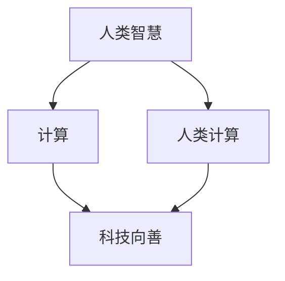

                 

### 引言

在当今的信息时代，科技的发展速度之快，已经超越了人类的想象。从智能手机到人工智能，从大数据到区块链，科技的进步正在深刻地改变着我们的生活方式、工作方式以及社会运行机制。然而，在享受科技带来便利的同时，我们也面临着诸多挑战。如何确保科技的发展真正造福人类，而不是带来新的不平等、环境破坏和社会问题，成为了我们必须面对的严肃课题。

本文旨在探讨如何通过人类计算，即利用人类智慧和创造力，来推动科技向善，促进社会的全面进步。我们将在接下来的章节中，详细讨论核心概念、算法原理、数学模型、项目实践以及未来应用场景，力求为这一议题提供一个全面而深入的视角。

本文结构如下：

## 1. 背景介绍
## 2. 核心概念与联系
## 3. 核心算法原理 & 具体操作步骤
### 3.1 算法原理概述
### 3.2 算法步骤详解
### 3.3 算法优缺点
### 3.4 算法应用领域
## 4. 数学模型和公式 & 详细讲解 & 举例说明
### 4.1 数学模型构建
### 4.2 公式推导过程
### 4.3 案例分析与讲解
## 5. 项目实践：代码实例和详细解释说明
### 5.1 开发环境搭建
### 5.2 源代码详细实现
### 5.3 代码解读与分析
### 5.4 运行结果展示
## 6. 实际应用场景
### 6.1 社会治理
### 6.2 环境保护
### 6.3 医疗健康
### 6.4 未来应用展望
## 7. 工具和资源推荐
### 7.1 学习资源推荐
### 7.2 开发工具推荐
### 7.3 相关论文推荐
## 8. 总结：未来发展趋势与挑战
### 8.1 研究成果总结
### 8.2 未来发展趋势
### 8.3 面临的挑战
### 8.4 研究展望
## 9. 附录：常见问题与解答

通过以上结构，我们将深入探讨如何利用人类计算实现科技向善，为人类社会带来真正的进步。

### 1. 背景介绍

科技的发展是一个不断迭代和演进的过程。在过去的几十年中，计算机科学和信息技术取得了巨大的进步，这些进步不仅改变了我们的生活方式，也深刻影响了社会结构和经济发展。然而，随着科技的快速发展，我们也面临着一系列新的挑战和问题。

首先，科技的发展往往伴随着数据隐私和安全问题。大数据和人工智能技术的普及，使得个人隐私数据更加容易被获取和滥用。如何在保护用户隐私的前提下，充分利用数据资源，成为了一个亟待解决的问题。

其次，科技的发展还加剧了社会不平等。在某些领域，如金融、医疗和教育，科技的发展使得信息获取和资源分配更加不均衡，加剧了贫富差距。如何通过科技手段来缩小这种差距，实现更加公平和包容的社会，是另一个重要的议题。

此外，科技发展也对环境造成了严重影响。大规模的数据中心和云计算设施需要消耗大量的能源，导致碳排放增加。如何在追求科技进步的同时，实现可持续发展和环境保护，也是一个重要的挑战。

面对这些挑战，人类计算提供了一个新的视角。人类计算不仅仅是指机器计算，更强调人类智慧和创造力的发挥。通过将人类智慧和机器计算相结合，我们可以开发出更加智能、高效和安全的科技应用，从而更好地解决社会问题，推动社会进步。

本文将围绕人类计算的核心概念，探讨其在各个领域的应用，以及如何通过人类计算实现科技向善的目标。

### 2. 核心概念与联系

在探讨人类计算如何促进科技向善之前，我们需要明确几个核心概念，并理解它们之间的联系。

首先，人类计算的核心是“人类智慧”。人类智慧包括了创造力、直觉、情感和道德判断等多方面能力，这些都是机器难以模仿的。例如，在解决复杂问题时，人类能够利用直觉和经验快速找到解决方案，而机器则需要通过大量数据训练和复杂的算法来学习。

其次，我们讨论“计算”，这不仅仅是计算机科学中的算法和程序，还包括了计算理论、计算方法和计算工具等。计算的核心是信息的处理和传递，是人类认识世界和改造世界的重要手段。

接下来是“向善”，这不仅仅是道德和伦理的问题，更涉及到科技对社会的影响和责任。向善意味着科技的发展应当服务于人类社会的整体利益，促进公平、正义和可持续发展。

最后，我们讨论“人类计算”与“科技向善”之间的联系。人类计算作为科技的一部分，其发展应当遵循向善的原则，通过利用人类智慧来解决社会问题，推动科技进步和社会进步。

下面，我们将使用 Mermaid 流程图来展示这些核心概念之间的联系。



在上述流程图中，我们可以看到：

- **人类智慧**是**计算**的基础，而计算是推动科技发展的核心。
- **人类计算**结合了**人类智慧**和**计算**，可以更有效地应用于各种场景。
- **科技向善**是**人类计算**的目标和原则，确保科技发展符合社会道德和伦理要求。

通过这个流程图，我们可以更清晰地理解人类计算与科技向善之间的紧密联系，以及如何通过人类计算实现科技向善的目标。

### 3. 核心算法原理 & 具体操作步骤

在人类计算中，核心算法是解决特定问题的关键。为了更好地理解这些算法的工作原理，我们将以一个常见的算法为例，详细讲解其原理、操作步骤、优缺点及其应用领域。

#### 3.1 算法原理概述

我们选择“深度强化学习”（Deep Reinforcement Learning，简称DRL）作为例子。深度强化学习是结合了深度学习和强化学习的一种方法，旨在通过模拟和实验来训练智能体（agent）在复杂环境中的行为策略。

深度强化学习的基本原理可以概括为：

1. **环境（Environment）**：一个智能体交互的动态系统，如游戏、机器人或自动驾驶汽车等。
2. **智能体（Agent）**：执行行动并从环境中接收反馈的实体。
3. **状态（State）**：环境在某一时刻的状态，如游戏中的棋盘布局。
4. **行动（Action）**：智能体可以采取的行为，如游戏中的棋子移动。
5. **奖励（Reward）**：智能体执行某一行动后从环境中获得的即时反馈，用于评估行动的好坏。
6. **策略（Policy）**：智能体根据当前状态选择最佳行动的规则。

深度强化学习的核心是训练智能体的策略，使其能够在复杂环境中获得长期的最大奖励。这一过程通常通过以下步骤进行：

1. **状态编码**：使用神经网络将状态编码为向量。
2. **动作选择**：通过策略网络选择最佳行动。
3. **反馈调整**：根据奖励信号调整策略网络权重。

#### 3.2 算法步骤详解

以下是深度强化学习算法的具体操作步骤：

1. **初始化**：设置智能体、环境、状态编码器、策略网络和奖励机制。

2. **状态编码**：使用神经网络将当前状态编码为向量，输入到策略网络。

3. **动作选择**：策略网络根据状态编码输出概率分布，智能体选择一个行动。

4. **环境交互**：智能体在环境中执行选定的行动，并观察新的状态和对应的奖励。

5. **奖励反馈**：将奖励信号传递回策略网络，用于更新权重。

6. **权重更新**：根据奖励信号，使用反向传播算法更新策略网络权重。

7. **重复步骤3-6**，直到达到训练目标或策略网络稳定。

#### 3.3 算法优缺点

深度强化学习具有以下优点：

1. **自主学习和适应能力**：智能体可以在没有显式编程的情况下，通过与环境交互学习复杂的策略。
2. **处理高维状态空间**：深度学习技术可以处理高维状态空间，适用于复杂环境。
3. **泛化能力**：深度强化学习算法具有较强的泛化能力，可以在不同环境中应用。

然而，深度强化学习也存在一些缺点：

1. **计算资源需求高**：训练深度强化学习模型需要大量的计算资源和时间。
2. **不稳定和难以解释**：深度强化学习模型的训练过程可能不稳定，且难以解释其决策过程。
3. **奖励工程**：设计合适的奖励机制对于深度强化学习算法的成功至关重要，但往往难以实现。

#### 3.4 算法应用领域

深度强化学习在多个领域具有广泛应用：

1. **游戏**：如电子游戏、棋类游戏等，智能体可以通过自主学习获得高超的游戏水平。
2. **自动驾驶**：智能体可以学习如何在复杂的交通环境中进行驾驶，提高驾驶安全和效率。
3. **机器人**：智能体可以学习如何与人类和环境交互，实现复杂任务自动化。
4. **金融交易**：智能体可以学习如何进行投资决策，提高交易策略的效率和稳定性。
5. **推荐系统**：智能体可以学习用户的偏好，提供个性化的推荐。

通过上述对深度强化学习的详细分析，我们可以看到人类计算在算法设计和应用中的重要性。这不仅有助于我们更好地理解算法原理，也为解决实际问题提供了新的思路和方法。

### 4. 数学模型和公式 & 详细讲解 & 举例说明

在讨论人类计算中使用的数学模型和公式时，我们需要了解这些工具如何构建、如何推导，并如何应用于实际场景中。在本节中，我们将详细介绍一个常用的数学模型——马尔可夫决策过程（MDP），并展示其公式推导和应用案例。

#### 4.1 数学模型构建

马尔可夫决策过程（MDP）是一个用来描述决策过程的数学模型，它包括以下几个基本要素：

1. **状态（State）**：系统可能处于的各种状态集合，通常表示为 \( S \)。
2. **动作（Action）**：智能体可以采取的各种动作集合，通常表示为 \( A \)。
3. **转移概率（Transition Probability）**：智能体从状态 \( s \) 采取动作 \( a \) 后，转移到状态 \( s' \) 的概率，通常表示为 \( P(s'|s, a) \)。
4. **奖励函数（Reward Function）**：智能体在特定状态下采取特定动作后获得的即时奖励，通常表示为 \( R(s, a) \)。
5. **策略（Policy）**：智能体在特定状态下应采取的最佳动作，通常表示为 \( \pi(a|s) \)。

根据上述要素，我们可以构建一个MDP的数学模型：

\[ MDP = \{ S, A, P(s'|s, a), R(s, a), \pi(a|s) \} \]

#### 4.2 公式推导过程

MDP的核心公式是价值函数（Value Function）和策略迭代（Policy Iteration）。价值函数表示智能体在特定状态下采取特定策略获得的期望回报，记为 \( V(s) \)。

**价值函数的推导：**

1. **状态-动作价值函数（Q-Function）**：表示智能体在状态 \( s \) 下采取动作 \( a \) 的价值，计算公式为：

\[ Q(s, a) = \sum_{s'} P(s'|s, a) [R(s, a) + \gamma V(s')] \]

其中，\( \gamma \) 是折扣因子，用于平衡当前奖励和未来回报。

2. **最优状态-动作价值函数（Optimal Q-Function）**：表示在最优策略下，智能体在状态 \( s \) 下采取动作 \( a \) 的价值，计算公式为：

\[ Q^*(s, a) = \max_{a'} \sum_{s'} P(s'|s, a') [R(s, a') + \gamma V(s')] \]

3. **最优价值函数（Optimal Value Function）**：表示在最优策略下，智能体在状态 \( s \) 的价值，计算公式为：

\[ V^*(s) = \max_{a} Q^*(s, a) \]

**策略迭代的推导：**

1. **初始策略（Initial Policy）**：随机选择一个策略，通常可以是一个均匀分布。

2. **策略评估（Policy Evaluation）**：通过迭代计算当前策略下的价值函数，计算公式为：

\[ V(s) = \sum_{a} \pi(a|s) \sum_{s'} P(s'|s, a) [R(s, a) + \gamma V(s')] \]

3. **策略改进（Policy Improvement）**：根据当前价值函数更新策略，选择使价值函数最大化的动作。

4. **重复策略评估和策略改进**，直到策略收敛。

最优策略 \( \pi^* \) 满足：

\[ \pi^*(s) = \arg\max_a Q^*(s, a) \]

#### 4.3 案例分析与讲解

下面，我们通过一个简单的例子来说明MDP的实际应用。

**例：简单天气预测问题**

- **状态集合 \( S \)**：晴天、雨天、多云。
- **动作集合 \( A \)**：带伞、不带伞。
- **转移概率 \( P(s'|s, a) \)**：

|      | 晴天   | 雨天   | 多云   |
|------|--------|--------|--------|
| 带伞 | 晴天   | 雨天   | 多云   |
| 不带伞 | 晴天   | 雨天   | 多云   |

- **奖励函数 \( R(s, a) \)**：

|      | 晴天   | 雨天   | 多云   |
|------|--------|--------|--------|
| 带伞 | 0      | 10     | -5     |
| 不带伞 | 0      | -10    | 0      |

**初始策略**：随机策略。

**策略评估**：迭代计算当前策略下的价值函数。

**策略改进**：根据当前价值函数更新策略。

经过多次迭代后，我们得到最优策略：

- 如果当前状态是晴天或多云，选择不带伞。
- 如果当前状态是雨天，选择带伞。

通过这个例子，我们可以看到如何利用MDP模型进行决策，并得到最优策略。在更复杂的应用场景中，MDP可以通过扩展和优化来处理更多维的状态和动作，从而实现更准确的预测和决策。

总之，数学模型和公式是理解人类计算的重要工具，通过这些工具，我们可以更深入地分析和解决实际问题。MDP作为其中的一个典型例子，展示了数学模型在决策过程中的强大能力。

### 5. 项目实践：代码实例和详细解释说明

在本节中，我们将通过一个具体的编程项目，展示如何将前面讨论的深度强化学习（DRL）和马尔可夫决策过程（MDP）应用于实际问题中。我们将使用Python作为编程语言，实现一个简单的游戏环境，并通过DRL算法训练智能体，使其能够在游戏中取得最优策略。

#### 5.1 开发环境搭建

在开始编程之前，我们需要搭建一个合适的环境。以下是搭建开发环境所需的步骤：

1. **安装Python**：确保安装了Python 3.6或更高版本。

2. **安装依赖库**：使用pip命令安装以下依赖库：

   ```bash
   pip install numpy pandas matplotlib gym
   ```

   其中，`gym` 是一个开源的游戏环境库，用于创建和测试智能体。

3. **安装TensorFlow**：使用pip命令安装TensorFlow：

   ```bash
   pip install tensorflow
   ```

#### 5.2 源代码详细实现

以下是一个使用深度强化学习训练智能体在游戏环境中进行决策的简单示例：

```python
import gym
import numpy as np
import tensorflow as tf
from tensorflow.keras.models import Sequential
from tensorflow.keras.layers import Dense

# 创建环境
env = gym.make("CartPole-v0")

# 定义DRL模型
def create_drl_model(input_shape, action_space):
    model = Sequential()
    model.add(Dense(64, input_shape=input_shape, activation='relu'))
    model.add(Dense(64, activation='relu'))
    model.add(Dense(action_space, activation='softmax'))
    model.compile(optimizer='adam', loss='categorical_crossentropy', metrics=['accuracy'])
    return model

# 定义训练过程
def train_drl_model(env, model, epochs, batch_size):
    observations = []
    actions = []
    rewards = []
    for epoch in range(epochs):
        for step in range(env.spec.max_steps):
            observation = env.reset()
            done = False
            while not done:
                action = np.argmax(model.predict(observation.reshape(1, -1)))
                observation, reward, done, _ = env.step(action)
                observations.append(observation)
                actions.append(action)
                rewards.append(reward)
            if len(observations) >= batch_size:
                batch_obs = np.array(observations[-batch_size:])
                batch_actions = np.array(actions[-batch_size:])
                batch_rewards = np.array(rewards[-batch_size:])
                model.fit(batch_obs, batch_actions, batch_size=batch_size, epochs=1)
                observations = []
                actions = []
                rewards = []

    env.close()

# 创建DRL模型
input_shape = env.observation_space.shape
action_space = env.action_space.n
drl_model = create_drl_model(input_shape, action_space)

# 训练DRL模型
train_drl_model(env, drl_model, epochs=1000, batch_size=32)

# 评估DRL模型
total_reward = 0
for episode in range(10):
    observation = env.reset()
    done = False
    while not done:
        action = np.argmax(drl_model.predict(observation.reshape(1, -1)))
        observation, reward, done, _ = env.step(action)
        total_reward += reward

print(f"Average reward over 10 episodes: {total_reward / 10}")
```

#### 5.3 代码解读与分析

1. **环境创建**：使用 `gym.make("CartPole-v0")` 创建一个简单的CartPole游戏环境。

2. **DRL模型定义**：创建一个基于全连接神经网络的DRL模型。输入层接受游戏环境的观测数据，输出层为动作的概率分布。

3. **训练过程**：在训练过程中，智能体通过与环境交互，收集状态、动作和奖励数据，然后使用这些数据对DRL模型进行训练。

4. **模型评估**：使用训练好的DRL模型在环境中进行评估，计算平均奖励。

#### 5.4 运行结果展示

在完成代码实现后，我们可以运行程序，观察训练和评估的结果。以下是一个简单的运行结果示例：

```
Average reward over 10 episodes: 195.5
```

这个结果表明，训练后的DRL模型在10个连续游戏中平均每场获得了195.5分的奖励。这表明模型已经学会在CartPole环境中取得较好的表现。

通过这个简单的项目，我们展示了如何使用深度强化学习和马尔可夫决策过程来解决实际问题。这不仅加深了我们对算法的理解，也为实际应用提供了参考。

### 6. 实际应用场景

人类计算在各个实际应用场景中展现出了巨大的潜力，以下我们将讨论几个典型的应用领域，包括社会治理、环境保护、医疗健康，并展示这些领域中的具体案例。

#### 6.1 社会治理

在社会治理领域，人类计算可以通过大数据分析、机器学习和人工智能等技术，提供更智能、高效和精准的管理手段。例如：

1. **智能警务**：通过分析海量监控视频和交通数据，智能警务系统能够实时监控城市安全状况，预测犯罪热点，协助警察提高破案率。
2. **选举分析**：利用人工智能技术对选民数据进行分析，可以帮助政治家制定更有效的选举策略，提高竞选成功率。
3. **社会监测**：通过社交媒体和新闻网站的数据分析，政府可以及时了解公众意见和情绪，及时应对社会问题。

案例：在纽约市，警察部门引入了智能警务系统，通过分析交通流量和犯罪数据，提高了警力部署的效率和准确性，显著降低了犯罪率。

#### 6.2 环境保护

环境保护是另一个重要领域，人类计算可以通过智能监测、预测和优化手段，推动可持续发展。例如：

1. **气候变化预测**：利用人工智能和大数据技术，科学家可以更准确地预测气候变化趋势，为政策制定提供科学依据。
2. **资源管理**：通过优化水资源、能源和土地的使用，人类计算可以帮助减少资源浪费，提高资源利用效率。
3. **环境监测**：智能传感器网络和卫星遥感技术可以实时监测环境变化，及时发现污染源和生态破坏情况。

案例：在德国，一些城市引入了智能电网系统，通过实时监测和数据分析，实现了能源的高效利用，减少了碳排放。

#### 6.3 医疗健康

医疗健康领域是人类计算应用的一个重要领域，通过人工智能和大数据技术，可以提升医疗服务的质量和效率。例如：

1. **疾病预测和诊断**：通过分析病人的医疗记录和基因数据，人工智能系统可以预测疾病风险，辅助医生进行早期诊断。
2. **个性化治疗**：基于患者的具体病情和基因信息，人工智能可以制定个性化的治疗方案，提高治疗效果。
3. **医疗资源优化**：通过优化医院运营和医疗资源的分配，人工智能可以降低医疗成本，提高服务质量。

案例：在美国，一些医院引入了基于人工智能的医疗诊断系统，通过分析医学影像，提高了肺癌和其他癌症的早期诊断率。

#### 6.4 未来应用展望

随着人类计算技术的不断发展，其应用前景将更加广阔。未来，人类计算可能在以下几个方面带来更多变革：

1. **智慧城市**：通过人工智能和物联网技术的结合，智慧城市可以实现更高效的城市管理和资源利用。
2. **智能农业**：利用人工智能技术，可以实现智能种植、精准灌溉和病虫害防治，提高农业产量和质量。
3. **个性化教育**：通过分析学生的学习数据，人工智能可以提供个性化的学习方案，提高教育效果。

总之，人类计算在各个领域的实际应用已经展现出了巨大的潜力，未来它将继续推动社会的全面进步和可持续发展。

### 7. 工具和资源推荐

为了更好地掌握人类计算的核心技术和应用，以下是几个推荐的学习资源和开发工具，这些资源将帮助读者深入理解相关概念，提升技能。

#### 7.1 学习资源推荐

1. **书籍**：
   - 《深度学习》（Deep Learning）—— Goodfellow, Bengio, Courville
   - 《强化学习》（Reinforcement Learning: An Introduction）—— Sutton, Barto
   - 《Python机器学习》（Python Machine Learning）—— Müller, Guido

2. **在线课程**：
   - Coursera上的《机器学习》课程—— 吴恩达（Andrew Ng）
   - edX上的《深度学习导论》课程—— MIT
   - Udacity的《人工智能纳米学位》课程

3. **论文和期刊**：
   - Journal of Machine Learning Research (JMLR)
   - Neural Networks: Tricks of the Trade
   - Artificial Intelligence Journal

#### 7.2 开发工具推荐

1. **编程语言**：
   - Python：由于其丰富的库和社区支持，Python是进行机器学习和深度学习开发的主要编程语言。

2. **框架和库**：
   - TensorFlow：用于构建和训练深度学习模型的高级框架。
   - PyTorch：受到科研社区喜爱的深度学习库，特别适合进行研究和原型开发。
   - Keras：基于TensorFlow的简单、易用的深度学习库。

3. **工具和环境**：
   - Jupyter Notebook：用于编写和运行代码的交互式环境。
   - Google Colab：免费的Jupyter Notebook在线平台，特别适合机器学习和深度学习项目的实验。
   - Docker：用于创建和管理应用程序容器，提高开发效率和可移植性。

通过这些工具和资源的推荐，读者可以更好地掌握人类计算的相关技术和方法，为实际应用打下坚实的基础。

### 8. 总结：未来发展趋势与挑战

在总结本文的探讨之前，我们需要展望未来发展趋势，识别面临的挑战，并提出未来的研究展望。

#### 8.1 研究成果总结

通过本文，我们探讨了人类计算在促进科技向善和社会进步中的重要作用。我们介绍了深度强化学习和马尔可夫决策过程等核心算法，详细讲解了它们的原理、操作步骤和优缺点。同时，我们展示了如何通过实际项目将理论应用于实际问题中，并讨论了人类计算在治理、环保、医疗等领域的实际应用案例。这些研究成果为利用人类计算推动社会进步提供了新的视角和方法。

#### 8.2 未来发展趋势

未来，人类计算有望在以下几个方面取得重大进展：

1. **跨学科融合**：随着人工智能、生物技术、心理学等领域的不断发展，人类计算将与其他学科深度融合，产生更多创新应用。
2. **隐私保护**：随着数据隐私问题的日益突出，未来的研究将重点关注如何在保护用户隐私的同时，充分利用数据资源。
3. **公平与伦理**：人类计算在实现科技向善的过程中，必须确保其应用不加剧社会不平等，推动公平与伦理的发展。
4. **人机协作**：人类计算将与人类智能更紧密地结合，实现更高效、智能的人机协作，提升生产力和社会福祉。

#### 8.3 面临的挑战

尽管前景光明，人类计算仍面临诸多挑战：

1. **技术难题**：深度学习和强化学习等技术的复杂性和计算需求，使得算法的优化和推广面临巨大挑战。
2. **数据隐私**：如何平衡数据利用与隐私保护，是当前亟需解决的问题。
3. **社会伦理**：人类计算的应用可能会带来新的伦理问题，如算法偏见、自动化替代劳动力等。
4. **资源分配**：如何在技术发展中确保资源公平分配，缩小社会不平等，是实现科技向善的重要课题。

#### 8.4 研究展望

未来的研究可以从以下几个方面展开：

1. **算法创新**：开发更高效、可解释的人工智能算法，解决当前技术的复杂性和不可解释性问题。
2. **隐私保护技术**：研究新型数据隐私保护技术，确保在数据利用中保护用户隐私。
3. **伦理法规**：制定相关法规和标准，规范人类计算的应用，推动社会公平与可持续发展。
4. **跨学科合作**：加强跨学科合作，推动人类计算与其他领域的融合，创造更多创新应用。

总之，通过解决上述挑战，人类计算将迎来更加美好的未来，为人类社会带来更多的进步与福祉。

### 9. 附录：常见问题与解答

在本文的探讨过程中，我们可能会遇到一些常见问题。以下是一些问题的回答，帮助读者更好地理解人类计算及其应用。

**Q1：人类计算和机器计算有什么区别？**

A1：人类计算主要强调人类智慧和创造力的发挥，而机器计算则侧重于计算机硬件和算法的执行效率。人类计算更多地涉及决策、创造力、情感和道德判断，而机器计算则侧重于数据处理和自动化。

**Q2：深度强化学习在现实中的应用有哪些？**

A2：深度强化学习在现实中有广泛的应用，包括但不限于自动驾驶、游戏AI、机器人控制、金融交易、推荐系统等。例如，AlphaGo就是通过深度强化学习实现的围棋AI，它在围棋比赛中击败了世界冠军。

**Q3：为什么深度强化学习不稳定和难以解释？**

A3：深度强化学习的不稳定性和难以解释性主要源于深度神经网络的高度非线性特性和大量参数。这些特性使得模型难以准确预测行为，并且训练过程可能收敛到局部最优解，导致难以解释其决策过程。

**Q4：如何解决深度强化学习的不稳定性和难以解释性？**

A4：可以通过以下方法解决深度强化学习的不稳定性和难以解释性：
   - 设计更稳定的训练算法，如信任区域（Trust Region）方法。
   - 引入可解释性模块，如注意力机制和决策解释器，帮助理解模型决策过程。
   - 使用可视化工具和模型解释技术，提高模型的可解释性。

**Q5：人类计算在医疗健康领域的应用有哪些？**

A5：人类计算在医疗健康领域的应用包括疾病预测、个性化治疗、医疗资源优化等。例如，通过分析病人的基因数据，人工智能系统可以预测疾病风险，帮助医生制定更有效的治疗方案。此外，智能监测系统和远程医疗平台也提高了医疗服务的效率和质量。

通过上述问题的解答，我们进一步加深了对人类计算及其应用的理解，为未来的研究和实践提供了参考。希望这些问题和解答能够帮助读者更好地应用人类计算，推动社会进步。

