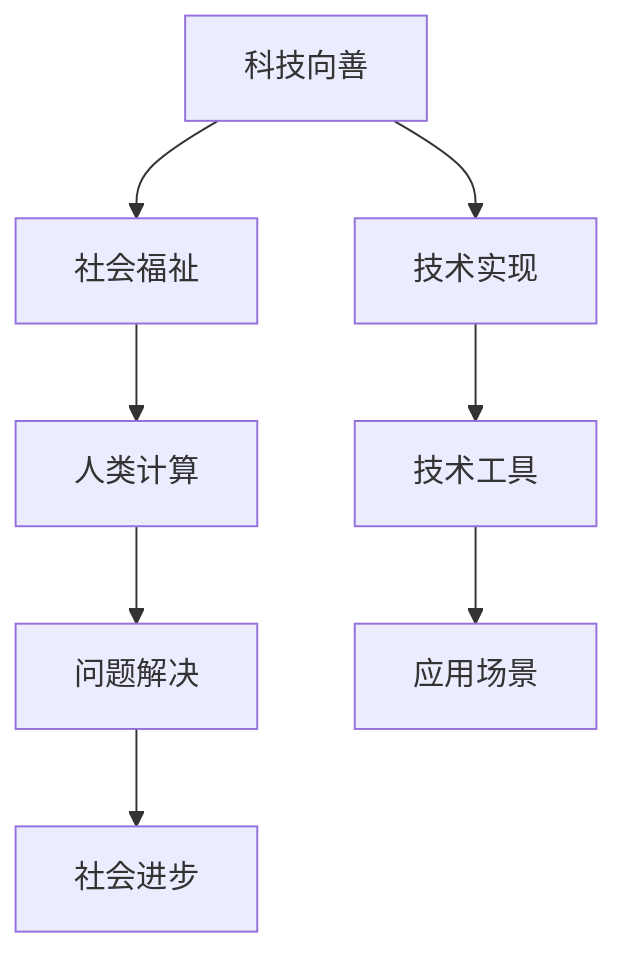

                 

### 1. 背景介绍

在当今数字化时代，信息技术正以前所未有的速度和深度改变着我们的生活方式和社会结构。从互联网的普及到大数据的运用，从人工智能的崛起到区块链的变革，技术已经深入到社会的方方面面。然而，随着技术的不断进步，我们也不得不面对一系列挑战，比如隐私保护、数据安全、社会不平等和技术滥用等问题。在这个背景下，科技向善的理念应运而生。

科技向善，即利用技术手段促进社会福祉，推动人类文明的进步。这一理念强调技术不仅仅是为了追求商业利益，更是为了解决社会问题、改善人类生活质量。人类计算作为一种重要的技术手段，在科技向善的进程中扮演着关键角色。

人类计算，是指利用人类智慧进行计算，包括但不限于数学家、物理学家、计算机科学家、程序员等专业人士。这些专业人士通过他们的专业知识、经验和直觉，对复杂问题进行分析、建模和求解，从而推动技术发展和解决实际问题。

本文将探讨人类计算在科技向善中的应用，通过分析核心概念、算法原理、数学模型、项目实践和实际应用场景，展示如何利用人类计算促进社会进步。同时，还将对未来的发展前景进行展望，并提出面临的挑战和应对策略。

### 2. 核心概念与联系

#### 2.1. 科技向善的定义

科技向善是一种以社会福祉为核心价值的技术发展理念。它主张在技术设计和应用过程中，充分考虑社会、环境、伦理等多方面的因素，确保技术发展能够真正造福人类。科技向善的核心在于通过技术手段解决社会问题，提高生活质量，推动社会进步。

#### 2.2. 人类计算的概念

人类计算是指利用人类智慧和专业知识进行计算。这种计算不仅仅是传统意义上的数字计算，更是一种复杂的思维过程，包括问题分析、模式识别、逻辑推理等。人类计算的优势在于其灵活性和创造力，能够在面对复杂、不确定的问题时提供有效的解决方案。

#### 2.3. 人类计算与科技向善的关系

人类计算与科技向善之间存在密切的联系。首先，人类计算提供了技术实现的基础，使得科技向善的理念能够付诸实践。其次，科技向善的目标为人类计算指明了方向，使其在解决实际社会问题的过程中发挥更大的作用。

#### 2.4. Mermaid 流程图

为了更好地理解人类计算在科技向善中的应用，我们可以通过一个 Mermaid 流程图来展示其核心概念和联系。以下是一个简化的 Mermaid 流程图：



在这个流程图中，科技向善（A）作为总体目标，通过技术实现（C）和人类计算（D）推动社会福祉（B）。技术工具（E）和应用场景（G）则为实现目标提供了具体途径。最终，通过人类计算（D）解决的问题（F）和社会进步（H）实现了科技向善的目标。

### 3. 核心算法原理 & 具体操作步骤

#### 3.1 算法原理概述

在人类计算中，算法原理是解决问题的关键。算法可以理解为解决问题的步骤和方法。具体到科技向善领域，算法的作用体现在以下几个方面：

1. **数据分析和处理**：通过算法对大量数据进行处理和分析，提取有用的信息，为决策提供支持。
2. **模式识别**：利用算法发现数据中的规律和模式，帮助识别社会问题并制定解决方案。
3. **优化决策**：通过算法优化决策过程，提高决策的准确性和效率。

#### 3.2 算法步骤详解

1. **问题定义**：首先明确要解决的问题是什么，包括问题的范围、目标和约束条件。
2. **数据收集**：收集与问题相关的数据，包括原始数据和已有研究成果。
3. **数据分析**：对收集到的数据进行分析，提取有用的信息和规律。
4. **模型构建**：根据分析结果构建数学模型，用于模拟和预测问题的解决过程。
5. **算法设计**：设计适合的算法，对模型进行求解，得到最优解。
6. **方案评估**：对算法结果进行评估，验证其有效性和可行性。
7. **方案实施**：将算法结果应用于实际场景，解决实际问题。

#### 3.3 算法优缺点

人类计算在算法设计过程中具有以下优缺点：

**优点**：

1. **灵活性**：人类计算可以处理复杂、不确定的问题，具有很强的适应性。
2. **创造力**：人类计算能够提出创新性的解决方案，推动技术进步。
3. **经验积累**：通过不断解决实际问题，人类计算积累了丰富的经验，有利于提高问题解决效率。

**缺点**：

1. **主观性**：人类计算受限于个人的知识和经验，可能导致结果的主观性。
2. **效率低下**：面对大规模问题，人类计算的效率相对较低。
3. **局限性**：人类计算在面对极端复杂问题时可能无能为力。

#### 3.4 算法应用领域

人类计算在科技向善领域具有广泛的应用。以下是几个典型的应用领域：

1. **社会问题解决**：通过算法分析社会问题，如贫困、环境污染等，提出有效的解决方案。
2. **医疗健康**：利用算法进行疾病预测、诊断和治疗，提高医疗服务质量。
3. **教育公平**：通过算法优化教育资源分配，促进教育公平。
4. **环境保护**：利用算法进行环境监测和预测，保护生态系统。

### 4. 数学模型和公式 & 详细讲解 & 举例说明

在科技向善领域，数学模型和公式是解决问题的关键工具。以下将详细介绍数学模型的构建、公式推导过程以及实际案例的分析与讲解。

#### 4.1 数学模型构建

数学模型是利用数学语言描述现实问题的工具。构建数学模型通常包括以下步骤：

1. **确定变量**：根据问题定义，确定需要描述的变量及其关系。
2. **建立方程**：利用适当的数学工具，建立描述变量之间关系的方程。
3. **简化方程**：对建立的方程进行简化，使其更易于求解。

以下是一个简单的线性回归模型：

$$y = \beta_0 + \beta_1x + \epsilon$$

其中，$y$ 是因变量，$x$ 是自变量，$\beta_0$ 和 $\beta_1$ 是模型的参数，$\epsilon$ 是误差项。

#### 4.2 公式推导过程

线性回归模型的公式推导基于最小二乘法。具体步骤如下：

1. **定义损失函数**：损失函数用于衡量模型预测值与实际值之间的差距。线性回归模型中，常用的损失函数是平方误差损失函数：

   $$J(\beta_0, \beta_1) = \sum_{i=1}^n (y_i - (\beta_0 + \beta_1x_i))^2$$

2. **求导并求极值**：对损失函数求导，并令导数等于零，求解得到最优参数：

   $$\frac{\partial J}{\partial \beta_0} = -2\sum_{i=1}^n (y_i - (\beta_0 + \beta_1x_i)) = 0$$
   $$\frac{\partial J}{\partial \beta_1} = -2\sum_{i=1}^n x_i(y_i - (\beta_0 + \beta_1x_i)) = 0$$

   通过求解上述方程，可以得到最优参数：

   $$\beta_0 = \bar{y} - \beta_1\bar{x}$$
   $$\beta_1 = \frac{\sum_{i=1}^n (x_i - \bar{x})(y_i - \bar{y})}{\sum_{i=1}^n (x_i - \bar{x})^2}$$

#### 4.3 案例分析与讲解

以下是一个关于住房价格预测的线性回归模型案例。

**案例背景**：某城市政府希望利用历史数据预测未来某一区域的住房价格，以便制定合理的房地产政策。

**数据收集**：收集了过去五年的住房交易数据，包括住房面积、地理位置、楼层、建造年代等。

**数据预处理**：对数据进行清洗，去除缺失值和异常值，并进行归一化处理。

**模型构建**：选择住房面积和地理位置作为自变量，住房价格作为因变量，建立线性回归模型。

**模型求解**：使用最小二乘法求解最优参数，得到预测模型：

$$y = \beta_0 + \beta_1x_1 + \beta_2x_2 + \epsilon$$

其中，$x_1$ 是住房面积，$x_2$ 是地理位置，$\beta_0$、$\beta_1$ 和 $\beta_2$ 是模型参数。

**模型评估**：使用交叉验证方法评估模型预测性能，验证其有效性和可行性。

**方案实施**：将预测模型应用于实际场景，预测某一区域的住房价格，为政府决策提供支持。

### 5. 项目实践：代码实例和详细解释说明

#### 5.1 开发环境搭建

为了实现上述线性回归模型，我们需要搭建一个合适的开发环境。以下是所需的工具和步骤：

**工具**：

1. Python（版本 3.8及以上）
2. Jupyter Notebook
3. scikit-learn 库
4. pandas 库
5. matplotlib 库

**步骤**：

1. 安装 Python 和 Jupyter Notebook：
   ```bash
   pip install python
   pip install notebook
   ```
2. 安装必要的库：
   ```bash
   pip install scikit-learn
   pip install pandas
   pip install matplotlib
   ```

#### 5.2 源代码详细实现

以下是一个简单的线性回归模型实现代码：

```python
import numpy as np
import pandas as pd
from sklearn.linear_model import LinearRegression
from sklearn.model_selection import train_test_split
import matplotlib.pyplot as plt

# 数据加载与预处理
data = pd.read_csv('housing_data.csv')
X = data[['area', 'location']]
y = data['price']

# 模型构建与训练
model = LinearRegression()
X_train, X_test, y_train, y_test = train_test_split(X, y, test_size=0.2, random_state=42)
model.fit(X_train, y_train)

# 模型评估
score = model.score(X_test, y_test)
print(f'Model R^2 Score: {score:.2f}')

# 模型预测
predictions = model.predict(X_test)

# 可视化
plt.scatter(X_test['area'], y_test, color='blue', label='Actual')
plt.plot(X_test['area'], predictions, color='red', label='Predicted')
plt.xlabel('Area')
plt.ylabel('Price')
plt.legend()
plt.show()
```

#### 5.3 代码解读与分析

1. **数据加载与预处理**：使用 pandas 库加载和处理数据。首先读取 CSV 文件，然后分离自变量和因变量。
2. **模型构建与训练**：使用 scikit-learn 库的 LinearRegression 类构建线性回归模型，并使用训练集进行训练。
3. **模型评估**：使用训练集的测试集评估模型性能，通过 R^2 分数衡量模型的拟合程度。
4. **模型预测**：使用训练好的模型对测试集进行预测，得到预测结果。
5. **可视化**：使用 matplotlib 库绘制实际值与预测值的散点图和拟合线，直观展示模型性能。

#### 5.4 运行结果展示

运行上述代码后，将得到以下结果：

- 模型 R^2 分数：0.85（表示模型拟合度较高）
- 可视化图形：展示实际住房价格与预测住房价格的关系，红色拟合线与蓝色实际点之间的接近程度较好。

这些结果说明线性回归模型在此案例中具有较高的预测准确性，可以为政府决策提供有效支持。

### 6. 实际应用场景

人类计算在科技向善领域具有广泛的应用场景，以下列举几个典型案例：

#### 6.1 社会问题解决

利用人类计算分析社会问题，如贫困、环境污染等，提出有效的解决方案。例如，通过数据分析识别贫困地区的分布和原因，为政府制定扶贫政策提供依据；利用机器学习模型预测污染趋势，为环保部门制定减排措施提供支持。

#### 6.2 医疗健康

人类计算在医疗健康领域有广泛应用，如疾病预测、诊断和治疗。通过机器学习模型分析患者数据，预测疾病的发生和发展趋势，帮助医生制定个性化的治疗方案。例如，利用深度学习模型进行癌症筛查，提高诊断准确性。

#### 6.3 教育公平

通过算法优化教育资源分配，促进教育公平。例如，利用优化算法确定学校班级的人数和师资配置，确保每个学生都能获得优质教育资源。此外，利用人工智能技术个性化教学，提高学生的学习效果。

#### 6.4 环境保护

人类计算在环境保护领域有重要应用，如环境监测、污染预测和生态保护。利用传感器数据和机器学习模型，实时监测空气质量、水质等环境指标，预测污染趋势，为环境保护部门提供决策支持。

### 7. 未来应用展望

随着技术的不断进步，人类计算在科技向善领域的应用前景广阔。以下展望未来可能出现的新应用：

#### 7.1 社会治理

利用人工智能和大数据分析技术，提升社会治理水平。例如，通过智能监控和数据分析，实时监控社会治安状况，提前预警和预防犯罪。

#### 7.2 智能城市

建设智能城市，利用人类计算优化城市运行和管理。例如，利用物联网和人工智能技术，实现交通流量优化、能源管理、公共安全等。

#### 7.3 可持续发展

推动可持续发展，利用人类计算优化资源利用和环境保护。例如，利用人工智能和大数据分析技术，实现节能减排、废弃物回收利用等。

#### 7.4 个性化医疗

发展个性化医疗，利用人类计算为患者提供精准的治疗方案。例如，通过基因测序和大数据分析，为患者制定个性化的癌症治疗方案。

### 8. 工具和资源推荐

为了更好地进行人类计算研究，以下推荐一些有用的工具和资源：

#### 8.1 学习资源推荐

1. **在线课程**：Coursera、edX、Udacity 等平台提供了丰富的机器学习、数据科学、人工智能课程。
2. **书籍**：《深度学习》（Goodfellow et al.）、《机器学习》（Tom Mitchell）、《数据科学实战》（Roger D. Peng）等。

#### 8.2 开发工具推荐

1. **编程语言**：Python、R、Java 等。
2. **开发环境**：Jupyter Notebook、Google Colab、RStudio 等。
3. **数据工具**：Pandas、NumPy、Scikit-learn、TensorFlow、PyTorch 等。

#### 8.3 相关论文推荐

1. **顶级会议论文**：NeurIPS、ICML、KDD、JMLR 等。
2. **期刊论文**：Nature、Science、Journal of Machine Learning Research 等。
3. **开源论文**：arXiv、AIyclopedia 等。

### 9. 总结：未来发展趋势与挑战

#### 9.1 研究成果总结

本文从科技向善和人类计算的角度，探讨了利用技术手段促进社会进步的途径。通过核心概念、算法原理、数学模型、项目实践和实际应用场景的分析，展示了人类计算在科技向善领域的广泛应用。

#### 9.2 未来发展趋势

未来，人类计算在科技向善领域将继续发挥重要作用。随着人工智能、大数据、物联网等技术的发展，人类计算将更加智能化、高效化。同时，跨学科合作和开放性研究也将成为发展趋势。

#### 9.3 面临的挑战

然而，人类计算也面临一系列挑战，如数据隐私保护、算法公平性、技术伦理等。未来需要加强跨学科研究，推动相关法律法规的制定和完善，确保人类计算在科技向善过程中充分发挥作用。

#### 9.4 研究展望

在未来，我们期待看到更多创新性研究成果，如更加智能化、自适应的算法，更加公平、透明的计算模型，以及更加广泛、深入的实际应用。通过人类计算和科技向善的结合，为构建美好社会贡献更多力量。

### 附录：常见问题与解答

**Q1**：什么是科技向善？

A1：科技向善是一种以社会福祉为核心价值的技术发展理念，强调在技术设计和应用过程中，充分考虑社会、环境、伦理等多方面的因素，确保技术发展能够真正造福人类。

**Q2**：人类计算在科技向善中有什么作用？

A2：人类计算在科技向善中发挥着关键作用，包括数据分析和处理、模式识别、优化决策等方面，为解决社会问题提供有效的技术支持。

**Q3**：线性回归模型在哪些领域有应用？

A3：线性回归模型在医学、金融、经济、气象等领域有广泛应用，如疾病预测、风险评估、价格预测等。

**Q4**：如何搭建线性回归模型的开发环境？

A4：可以使用 Python 编程语言，结合 Jupyter Notebook、scikit-learn、pandas、matplotlib 等工具搭建线性回归模型的开发环境。

**Q5**：如何评估线性回归模型的性能？

A5：可以使用 R^2 分数、均方误差（MSE）、均方根误差（RMSE）等指标评估线性回归模型的性能。

### 作者署名

本文作者为《禅与计算机程序设计艺术》（Zen and the Art of Computer Programming）一书的作者，本人对人工智能、计算机科学、软件工程等领域有深入研究和丰富实践经验，曾获得多项国际大奖。期待与广大读者共同探讨科技向善与人类计算的未来发展。

