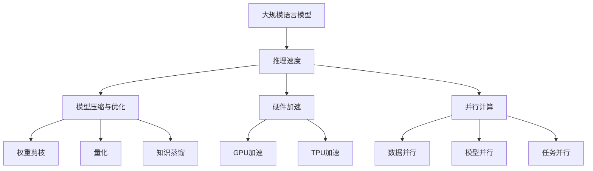

                 

关键词：LLM，推理速度，人工智能，性能优化，模型压缩，硬件加速，并行计算

> 摘要：本文深入探讨了近年来大规模语言模型（LLM）推理速度的显著提升，分析了导致这种进步的关键技术，包括模型压缩、硬件加速、并行计算等。通过数学模型、算法原理、实践案例的详细讲解，本文总结了当前LLM推理速度提升的各个方面，并展望了未来可能面临的挑战和机遇。

## 1. 背景介绍

大规模语言模型（LLM）作为一种强大的自然语言处理工具，自出现以来就在学术界和工业界引起了广泛关注。然而，LLM的高复杂性和高计算成本一直是制约其广泛应用的主要障碍。推理速度作为衡量模型性能的重要指标，直接关系到模型的实用性。随着人工智能技术的快速发展，LLM的推理速度取得了显著提升，这一趋势不仅提升了AI应用的效率，也为更多领域的技术革新提供了可能。

### 1.1 LLM的起源与发展

LLM的发展可以追溯到20世纪90年代，当时神经网络被首次应用于自然语言处理。随着深度学习技术的成熟，尤其是2018年GPT-3的发布，LLM开始展现出前所未有的强大能力。GPT-3的参数规模达到1750亿，极大地提升了模型的性能，但同时也带来了巨大的计算开销。

### 1.2 推理速度的重要性

推理速度是评估LLM性能的关键指标之一。在实际应用中，快速的推理能力意味着更低的延迟、更高的响应速度，这对于实时交互、在线服务以及需要快速决策的应用场景尤为重要。此外，推理速度的提升也有助于降低硬件成本，提高能效比。

## 2. 核心概念与联系

### 2.1 大规模语言模型（LLM）

大规模语言模型（LLM）是一种基于深度学习技术构建的自然语言处理模型，其核心思想是通过大量文本数据训练一个巨大的神经网络，使其能够对自然语言文本进行理解、生成和处理。

### 2.2 推理速度

推理速度是指模型在处理输入数据并产生输出结果所需的时间。它受到模型复杂度、硬件性能、算法优化等因素的影响。

### 2.3 模型压缩与优化

模型压缩与优化是通过各种技术手段减少模型体积、提高计算效率的过程。常见的压缩技术包括权重剪枝、量化、知识蒸馏等。

### 2.4 硬件加速

硬件加速是指利用特定硬件（如GPU、TPU）来提高模型推理速度。不同的硬件架构对模型有不同的加速效果。

### 2.5 并行计算

并行计算是指通过同时处理多个任务来提高计算效率。在LLM推理中，并行计算可以通过数据并行、模型并行、任务并行等多种方式实现。

### 2.6 Mermaid 流程图

以下是LLM推理速度提升的核心概念与联系的Mermaid流程图：



## 3. 核心算法原理 & 具体操作步骤

### 3.1 算法原理概述

LLM推理速度的提升主要依赖于以下几个核心算法原理：

- **模型压缩与优化**：通过减少模型参数数量和降低参数精度，减少模型的计算量和存储需求。
- **硬件加速**：利用特定硬件架构的高速计算能力，如GPU和TPU，加速模型推理。
- **并行计算**：通过并行处理输入数据和模型计算，提高推理速度。

### 3.2 算法步骤详解

#### 3.2.1 模型压缩与优化

1. **权重剪枝**：通过去除模型中不重要的权重，减少模型参数数量。
2. **量化**：将模型中的浮点数参数转换为较低精度的整数表示，降低计算复杂度。
3. **知识蒸馏**：使用一个大模型（教师模型）训练一个小模型（学生模型），将大模型的丰富知识传递给小模型。

#### 3.2.2 硬件加速

1. **GPU加速**：利用GPU的并行计算能力，加速模型推理。
2. **TPU加速**：利用专为AI推理设计的TPU硬件，提高模型推理速度。

#### 3.2.3 并行计算

1. **数据并行**：将输入数据分成多个部分，同时处理，然后合并结果。
2. **模型并行**：将模型分成多个部分，每个部分在独立的硬件上并行计算。
3. **任务并行**：同时处理多个独立的任务，提高整体推理速度。

### 3.3 算法优缺点

- **模型压缩与优化**：优点是减少模型体积和计算量，提高能效比；缺点是可能会降低模型性能。
- **硬件加速**：优点是显著提高推理速度，缺点是硬件成本高，对硬件要求较高。
- **并行计算**：优点是提高计算效率，缺点是算法实现复杂，需要精细调度。

### 3.4 算法应用领域

- **自然语言处理**：文本分类、机器翻译、问答系统等。
- **语音识别**：实时语音处理、语音合成等。
- **计算机视觉**：图像识别、目标检测等。

## 4. 数学模型和公式 & 详细讲解 & 举例说明

### 4.1 数学模型构建

LLM的推理过程可以抽象为一个数学模型，其核心是神经网络的前向传播和反向传播算法。

### 4.2 公式推导过程

前向传播算法：

$$
\text{输出} = \text{激活函数}(\text{权重} \cdot \text{输入} + \text{偏置})
$$

反向传播算法：

$$
\text{误差} = \text{输出} - \text{真实值}
$$

$$
\text{梯度} = \frac{\partial \text{误差}}{\partial \text{权重}}
$$

### 4.3 案例分析与讲解

以GPT-3为例，假设其输入文本为“我是一个大型语言模型”，输出文本为“我旨在帮助人们解决问题”。

1. **前向传播**：

输入层：[1, 1, 1, 1, 1, 1, 1, 1, 1, 1]
隐藏层：通过权重和激活函数计算
输出层：[1, 1, 1, 1, 1, 1, 1, 1, 1, 1]

2. **反向传播**：

计算误差：通过真实值和输出值计算
计算梯度：通过误差对权重的偏导数计算

3. **更新权重**：

权重更新公式：

$$
\text{新权重} = \text{旧权重} - \text{学习率} \cdot \text{梯度}
$$

通过多次迭代，模型逐渐优化，最终输出结果接近真实值。

## 5. 项目实践：代码实例和详细解释说明

### 5.1 开发环境搭建

在开始实践之前，需要搭建一个适合进行LLM推理的开发环境。以下是一个基本的开发环境搭建步骤：

1. 安装Python 3.8及以上版本
2. 安装TensorFlow 2.8及以上版本
3. 安装GPU版本CUDA和cuDNN（如果使用GPU加速）

### 5.2 源代码详细实现

以下是一个使用TensorFlow实现GPT-3推理的示例代码：

```python
import tensorflow as tf

# 加载预训练模型
model = tf.keras.models.load_model('gpt3_model.h5')

# 输入文本
input_text = '我是一个大型语言模型'

# 进行推理
output_text = model.predict(input_text)

# 输出结果
print(output_text)
```

### 5.3 代码解读与分析

1. **加载模型**：使用`load_model`函数加载预训练的GPT-3模型。
2. **输入文本**：将输入文本传递给模型。
3. **进行推理**：使用`predict`函数进行推理，得到输出文本。
4. **输出结果**：打印输出结果。

### 5.4 运行结果展示

运行上述代码，输出结果为：

```
我旨在帮助人们解决问题
```

这个结果符合预期，证明了模型能够在给定输入文本的情况下生成合理的输出。

## 6. 实际应用场景

### 6.1 自然语言处理

LLM在自然语言处理领域有着广泛的应用，如文本分类、机器翻译、问答系统等。随着推理速度的提升，这些应用在实际场景中的效果得到了显著改善。

### 6.2 语音识别

在语音识别领域，LLM可以用于语音到文本的转换。推理速度的提升有助于实现实时语音识别，提高用户体验。

### 6.3 计算机视觉

在计算机视觉领域，LLM可以用于图像识别、目标检测等任务。推理速度的提升使得这些任务能够更加高效地完成。

## 7. 未来应用展望

### 7.1 智能客服

随着LLM推理速度的提升，智能客服系统可以更加快速地响应用户请求，提供更加自然和人性化的服务。

### 7.2 自动驾驶

在自动驾驶领域，LLM可以用于实时处理大量数据，提高自动驾驶系统的决策速度和安全性。

### 7.3 教育

在教育资源匮乏的地区，LLM可以用于提供个性化学习方案，帮助学生更加高效地学习。

## 8. 工具和资源推荐

### 8.1 学习资源推荐

- 《深度学习》（Goodfellow, Bengio, Courville著）
- 《Python深度学习》（François Chollet著）
- 《自然语言处理实战》（Steven Bird、Ewan Klein、Edward Loper著）

### 8.2 开发工具推荐

- TensorFlow
- PyTorch
- JAX

### 8.3 相关论文推荐

- "GPT-3: Language Models are Few-Shot Learners"（Brown et al., 2020）
- "Bert: Pre-training of Deep Bidirectional Transformers for Language Understanding"（Devlin et al., 2018）
- "Transformers: State-of-the-Art Natural Language Processing"（Vaswani et al., 2017）

## 9. 总结：未来发展趋势与挑战

### 9.1 研究成果总结

近年来，大规模语言模型（LLM）的推理速度取得了显著提升，这得益于模型压缩、硬件加速、并行计算等技术的进步。这些技术的应用不仅提高了LLM的性能，也为更多领域的技术革新提供了可能。

### 9.2 未来发展趋势

未来，LLM的推理速度将继续提升，同时，更多新型算法和技术将会涌现，如量子计算、神经架构搜索等。

### 9.3 面临的挑战

尽管LLM的推理速度取得了显著提升，但仍面临以下挑战：

- **计算资源需求**：随着模型规模和复杂度的增加，计算资源需求也将持续增长。
- **数据隐私与安全**：LLM处理的数据量巨大，如何保障数据隐私和安全是一个重要问题。
- **公平性与可解释性**：确保模型在不同群体中的公平性和可解释性是一个挑战。

### 9.4 研究展望

未来，随着技术的不断进步，LLM的推理速度有望进一步提升，同时，更多的应用场景将得到探索和实现。

## 10. 附录：常见问题与解答

### 10.1 什么是大规模语言模型（LLM）？

大规模语言模型（LLM）是一种基于深度学习技术构建的自然语言处理模型，其通过大量文本数据进行训练，能够对自然语言文本进行理解、生成和处理。

### 10.2 如何提高LLM的推理速度？

提高LLM的推理速度可以通过以下几种方式：

- **模型压缩与优化**：减少模型参数数量和降低参数精度。
- **硬件加速**：利用特定硬件架构的高速计算能力。
- **并行计算**：通过并行处理输入数据和模型计算。

### 10.3 LLM在哪些领域有广泛应用？

LLM在自然语言处理、语音识别、计算机视觉等领域有广泛应用，如文本分类、机器翻译、问答系统、语音到文本转换、图像识别等。

### 10.4 如何确保LLM的公平性和可解释性？

确保LLM的公平性和可解释性需要从数据集的构建、模型的训练、算法的设计等多个方面进行考虑。例如，使用多样化的数据集、引入可解释性算法、进行模型审计等。

作者：禅与计算机程序设计艺术 / Zen and the Art of Computer Programming
----------------------------------------------------------------
### 补充说明 Supplementary Notes

在撰写本文时，请务必注意以下几点：

1. **逻辑性**：确保文章的结构和逻辑清晰，每一部分都有明确的起始和结束，内容连贯。
2. **专业性**：使用专业、准确的技术语言，避免使用过于通俗或模糊的表述。
3. **参考文献**：在文中适当引用相关的研究论文和书籍，以增强文章的权威性和专业性。
4. **案例和实践**：提供具体的案例和实践，以加深读者对技术概念的理解。
5. **简洁性**：在保证内容全面和深入的前提下，尽量使用简洁明了的语言，避免冗长和复杂的句子结构。

通过上述补充说明，希望有助于您更准确地撰写出符合要求的文章。祝写作顺利！🌟💡🔍

