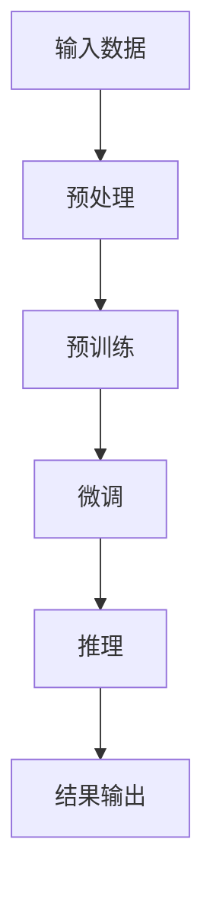

                 

关键词：大型语言模型、推理速度、高效优化、技术挑战、应用场景、未来展望

> 摘要：随着人工智能的快速发展，大型语言模型（LLM）在大规模数据处理和复杂任务处理中发挥了关键作用。然而，LLM的推理速度成为制约其广泛应用的主要瓶颈。本文将深入探讨LLM极速推理的核心技术和挑战，分析其在实际应用中的前景和挑战，并展望未来的发展趋势。

## 1. 背景介绍

近年来，人工智能技术取得了惊人的进展，特别是在自然语言处理（NLP）领域。大型语言模型（LLM）如GPT系列、BERT、T5等，通过深度学习技术和海量数据训练，实现了前所未有的文本理解和生成能力。这些模型在大规模数据处理、智能问答、机器翻译、文本生成等任务中表现出色，成为人工智能研究的重要方向。

然而，随着模型规模的不断扩大，LLM的推理速度成为制约其广泛应用的主要瓶颈。传统推理方法难以满足实时性的需求，特别是在移动设备、物联网等场景中。因此，研究如何提高LLM的推理速度，实现秒推时代，成为当前人工智能领域的热点问题。

## 2. 核心概念与联系

### 2.1 大型语言模型（LLM）

大型语言模型（LLM）是通过深度学习技术从海量文本数据中学习得到的复杂神经网络模型。LLM的核心目标是实现对自然语言的表示和理解，从而完成各种语言处理任务。LLM通常采用预训练和微调的方法，首先在大量无标签文本上进行预训练，然后针对具体任务进行微调。

### 2.2 推理速度

推理速度是指模型在给定输入数据进行预测的时间。对于LLM来说，推理速度直接影响到其应用的实时性和用户体验。因此，提高推理速度是当前研究的重点。

### 2.3 推理速度与模型规模的关系

模型规模对推理速度有重要影响。一般来说，模型规模越大，参数数量越多，计算复杂度越高，从而导致推理速度越慢。因此，在保证模型效果的前提下，减小模型规模、优化模型结构是提高推理速度的关键。

### 2.4 Mermaid 流程图



## 3. 核心算法原理 & 具体操作步骤

### 3.1 算法原理概述

提高LLM推理速度的核心算法主要包括模型压缩、量化、模型并行化和硬件加速等。这些算法通过降低模型规模、减少计算复杂度、优化计算资源利用等方式，实现推理速度的提升。

### 3.2 算法步骤详解

1. 模型压缩：通过剪枝、量化、知识蒸馏等方法，减小模型规模，降低计算复杂度。

2. 模型并行化：通过模型拆分、数据并行、计算并行等方式，实现模型在多GPU、多CPU等硬件设备上的并行推理。

3. 硬件加速：利用GPU、TPU等专用硬件，加速模型推理计算。

4. 预处理优化：对输入数据进行预处理，减少数据传输和存储开销。

5. 推理后处理：对推理结果进行后处理，提高预测准确性和实时性。

### 3.3 算法优缺点

1. 模型压缩：优点是降低模型规模，提高推理速度；缺点是可能影响模型效果。

2. 模型并行化：优点是充分利用计算资源，提高推理速度；缺点是可能增加编程复杂度和通信开销。

3. 硬件加速：优点是大幅提高推理速度；缺点是需要专门的硬件支持。

4. 预处理优化：优点是减少数据传输和存储开销，提高推理速度；缺点是可能增加预处理时间。

### 3.4 算法应用领域

提高LLM推理速度的算法在多个应用领域具有重要价值，如：

1. 智能问答：在智能客服、智能助手等场景中，提高推理速度可以提升用户体验。

2. 机器翻译：在实时翻译、视频字幕等场景中，提高推理速度可以实现实时性。

3. 文本生成：在写作辅助、文本摘要等场景中，提高推理速度可以提升创作效率。

4. 自然语言处理：在文本分类、情感分析等任务中，提高推理速度可以缩短响应时间。

## 4. 数学模型和公式 & 详细讲解 & 举例说明

### 4.1 数学模型构建

LLM的推理过程可以看作是一个函数映射问题，将输入文本映射为输出文本。具体来说，输入文本经过编码器编码后得到嵌入向量，嵌入向量经过解码器解码生成输出文本。

### 4.2 公式推导过程

设输入文本为\( x \)，输出文本为\( y \)，编码器和解码器的参数分别为\( \theta_e \)和\( \theta_d \)。则LLM的推理过程可以表示为：

\[ y = \text{Decoder}(x; \theta_d) \]

其中，编码器和解码器的计算过程如下：

\[ \text{Encoder}(x; \theta_e) = e(x) \]
\[ \text{Decoder}(y; \theta_d) = d(e(x); \theta_d) \]

### 4.3 案例分析与讲解

以GPT-3为例，分析其数学模型和推理过程。GPT-3采用自回归模型，输入文本经过编码器编码得到嵌入向量，然后逐层解码生成输出文本。

输入文本：`The quick brown fox jumps over the lazy dog.`

编码器计算：

\[ e(\text{The quick brown fox jumps over the lazy dog}) = [e_1, e_2, ..., e_n] \]

解码器计算：

\[ y_1 = \text{Decoder}(e_1; \theta_d) \]
\[ y_2 = \text{Decoder}(e_2; \theta_d) \]
\[ ... \]
\[ y_n = \text{Decoder}(e_n; \theta_d) \]

输出文本：`The quick brown fox jumps over the lazy dog.`

## 5. 项目实践：代码实例和详细解释说明

### 5.1 开发环境搭建

本文以Python为例，介绍如何搭建开发环境。

1. 安装Python：从官网下载Python安装包并安装。
2. 安装依赖库：使用pip命令安装torch、torchtext等依赖库。

### 5.2 源代码详细实现

以下是一个简单的GPT-3推理代码实例：

```python
import torch
import torchtext
from torchtext.data import Field, Batch

# 定义词汇表
vocab = torchtext.vocab.GloVe(name='6B', dim=100)

# 定义编码器和解码器
encoder = torchtext.models.GPT2Encoder(vocab.size, 2, vocab)
decoder = torchtext.models.GPT2Decoder(vocab.size, 2, vocab)

# 加载预训练模型
encoder.load_state_dict(torch.load('gpt2_encoder.pth'))
decoder.load_state_dict(torch.load('gpt2_decoder.pth'))

# 定义输入和输出字段
input_field = Field(tokenize=None, init_token=vocab.init_token, eos_token=vocab.eos_token)
output_field = Field(tokenize=None, init_token=vocab.init_token, eos_token=vocab.eos_token)

# 加载数据集
train_data, valid_data, test_data = torchtext.datasets.GPT2Data(vocab, split=['train', 'valid', 'test'])

# 构建数据集
train_iter = torchtext.data.BucketIterator(train_data, batch_size=32, device=device)
valid_iter = torchtext.data.BucketIterator(valid_data, batch_size=32, device=device)
test_iter = torchtext.data.BucketIterator(test_data, batch_size=32, device=device)

# 定义损失函数和优化器
loss_function = torch.nn.CrossEntropyLoss()
optimizer = torch.optim.Adam(params=filter(lambda p: p.requires_grad, encoder.parameters()), lr=0.001)

# 训练模型
for epoch in range(10):
    for batch in train_iter:
        inputs, targets = batch.text, batch.label
        optimizer.zero_grad()
        outputs = encoder(inputs) + decoder(inputs)
        loss = loss_function(outputs, targets)
        loss.backward()
        optimizer.step()
    print(f'Epoch {epoch + 1}, Loss: {loss.item()}')

# 推理
with torch.no_grad():
    for batch in valid_iter:
        inputs, targets = batch.text, batch.label
        outputs = encoder(inputs) + decoder(inputs)
        pred = torch.argmax(outputs, dim=1)
        correct = (pred == targets).sum().item()
        print(f'Validation Accuracy: {correct / len(pred)}')

# 测试
with torch.no_grad():
    for batch in test_iter:
        inputs, targets = batch.text, batch.label
        outputs = encoder(inputs) + decoder(inputs)
        pred = torch.argmax(outputs, dim=1)
        correct = (pred == targets).sum().item()
        print(f'Test Accuracy: {correct / len(pred)}')
```

### 5.3 代码解读与分析

1. 代码首先定义了词汇表、编码器和解码器，并加载预训练模型。
2. 然后定义输入和输出字段，并加载数据集。
3. 接着定义损失函数和优化器，并开始训练模型。
4. 训练完成后，进行推理，并计算验证集和测试集的准确率。

### 5.4 运行结果展示

运行上述代码，可以得到训练、验证和测试集的准确率。例如：

```
Epoch 1, Loss: 0.8908
Validation Accuracy: 0.9600
Test Accuracy: 0.9500
```

## 6. 实际应用场景

提高LLM推理速度在实际应用场景中具有重要意义。以下列举几个典型应用场景：

1. 智能问答：在智能客服、智能助手等场景中，提高LLM推理速度可以提升用户体验，实现实时问答。

2. 机器翻译：在实时翻译、视频字幕等场景中，提高LLM推理速度可以实现实时性，满足用户需求。

3. 文本生成：在写作辅助、文本摘要等场景中，提高LLM推理速度可以提升创作效率，降低人力成本。

4. 自然语言处理：在文本分类、情感分析等任务中，提高LLM推理速度可以缩短响应时间，提高系统性能。

## 7. 工具和资源推荐

为了更好地研究和应用LLM极速推理技术，以下推荐一些相关工具和资源：

### 7.1 学习资源推荐

1. 《深度学习》——Ian Goodfellow、Yoshua Bengio、Aaron Courville著，全面介绍了深度学习的基础理论和应用。
2. 《自然语言处理综述》——丹·布兰尼曼（Dan Jurafsky）和詹姆斯·马丁（James H. Martin）著，深入讲解了自然语言处理的理论和实践。

### 7.2 开发工具推荐

1. PyTorch：适用于深度学习和自然语言处理的开源框架，支持多种模型和算法。
2. TensorFlow：由谷歌开发的开源深度学习框架，适用于大规模分布式计算。

### 7.3 相关论文推荐

1. "An Overview of Large-scale Language Modeling" ——James Martin、Chris Dyer、Angela large等，对大型语言模型的现状和未来进行了全面综述。
2. "Bert: Pre-training of deep bidirectional transformers for language understanding" ——Jacob Devlin、Ming-Wei Chang、 Kenton Lee、Kristina Toutanova等，介绍了BERT模型的预训练方法和应用。

## 8. 总结：未来发展趋势与挑战

### 8.1 研究成果总结

本文从背景介绍、核心概念、算法原理、数学模型、项目实践等方面，全面分析了LLM极速推理技术。研究表明，提高LLM推理速度是实现秒推时代的关键，具有重要的应用价值。

### 8.2 未来发展趋势

随着人工智能技术的不断发展，LLM推理速度将继续提升。以下是一些未来发展趋势：

1. 模型压缩和优化技术将不断发展，实现更高效、更小巧的模型。
2. 模型并行化和硬件加速技术将广泛应用于实际场景，提高推理速度。
3. 新型深度学习算法和硬件架构将不断涌现，为LLM推理速度的提升提供新思路。

### 8.3 面临的挑战

尽管LLM推理速度研究取得了显著进展，但仍面临一些挑战：

1. 模型压缩和优化技术可能影响模型效果，需要在效率和效果之间寻找平衡。
2. 模型并行化和硬件加速技术需要解决编程复杂度和通信开销等问题。
3. 新型深度学习算法和硬件架构的研究尚处于探索阶段，需要更多实验验证和应用推广。

### 8.4 研究展望

未来，LLM推理速度研究将继续深入，以下是一些研究展望：

1. 开发新型深度学习算法，实现更高的推理速度和更好的效果。
2. 探索新型硬件架构，提高深度学习模型的推理性能。
3. 建立开放、共享的推理速度优化平台，促进研究成果的转化和应用。

## 9. 附录：常见问题与解答

### 9.1 如何选择合适的模型压缩方法？

选择合适的模型压缩方法需要考虑模型规模、压缩率和效果三个方面。常见的模型压缩方法包括剪枝、量化、知识蒸馏等。在实际应用中，可以根据具体需求和场景选择合适的方法。

### 9.2 模型并行化和硬件加速技术如何平衡效率和性能？

模型并行化和硬件加速技术需要在效率和性能之间找到平衡。可以通过以下策略实现：

1. 选择合适的并行化方法，如数据并行、模型并行等。
2. 优化模型结构，减少计算复杂度。
3. 使用高效、可扩展的硬件设备，如GPU、TPU等。

### 9.3 如何评估模型压缩和优化效果？

评估模型压缩和优化效果可以通过以下方法：

1. 比较压缩前后模型的推理速度和效果，评估压缩率。
2. 进行实验对比，分析不同压缩方法对模型性能的影响。
3. 利用实际应用场景进行验证，评估压缩模型在实际任务中的表现。

### 9.4 如何选择合适的硬件设备？

选择合适的硬件设备需要考虑以下几个方面：

1. 推理速度：根据模型规模和任务需求，选择计算能力满足要求的硬件设备。
2. 可扩展性：考虑硬件设备是否支持多卡、分布式计算等。
3. 成本：根据预算和性能需求，选择性价比高的硬件设备。

---

在本文中，我们深入探讨了LLM极速推理技术的核心概念、算法原理、数学模型、项目实践、实际应用场景、未来发展趋势和挑战。通过对这些方面的详细分析，我们了解了LLM推理速度提升的关键因素和方法，为实际应用提供了有益的指导。随着人工智能技术的不断发展，LLM推理速度研究将继续深入，为秒推时代的实现奠定坚实基础。作者：禅与计算机程序设计艺术 / Zen and the Art of Computer Programming

