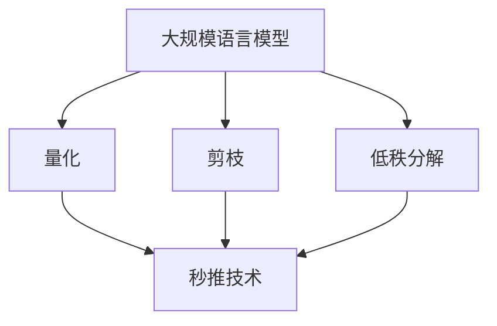

                 

关键词：秒推，LLM，推理，人工智能，技术革新，计算效率

> 摘要：随着人工智能技术的飞速发展，大规模语言模型（LLM）的应用场景日益广泛。然而，如何提高LLM的推理速度成为了一项关键挑战。本文将深入探讨秒推时代LLM极速推理的原理、方法及应用，为未来人工智能技术的进一步发展提供新思路。

## 1. 背景介绍

在当今社会，人工智能已经成为推动科技进步的重要力量。特别是近年来，随着深度学习和神经网络技术的迅猛发展，大规模语言模型（LLM）如BERT、GPT等在自然语言处理领域取得了令人瞩目的成果。LLM作为一种强大的语言表示和学习工具，能够处理复杂的语言任务，为各种应用场景提供了强大的支持。然而，随着模型的规模和复杂度的增加，LLM的推理速度成为了一个亟待解决的问题。

传统的LLM推理方法主要依赖于矩阵乘法和卷积操作，这些操作在硬件上需要大量的计算资源和时间。随着数据规模的不断扩大和模型复杂度的提升，传统方法已经无法满足实时推理的需求。因此，如何在保证模型性能的同时提高推理速度成为了一个重要课题。

为了应对这一挑战，近年来研究人员提出了多种秒推方法，如量化、剪枝、低秩分解等。这些方法通过减少模型参数、简化计算流程等方式，有效提高了LLM的推理速度。秒推技术的出现，不仅使得LLM的应用场景更加广泛，也为人工智能领域的进一步发展带来了新的机遇。

本文将从以下几个方面展开讨论：

1. 核心概念与联系：介绍大规模语言模型（LLM）的核心概念、原理及其与秒推技术的联系。
2. 核心算法原理与具体操作步骤：详细阐述秒推技术的核心算法原理，包括量化、剪枝、低秩分解等方法的原理和具体操作步骤。
3. 数学模型与公式：探讨秒推技术的数学模型和公式，以及相关推导和案例分析。
4. 项目实践：通过代码实例，展示秒推技术在实际项目中的应用。
5. 实际应用场景：分析秒推技术在不同领域的应用场景和未来发展趋势。
6. 工具和资源推荐：推荐相关学习资源、开发工具和论文。
7. 总结：总结研究成果，展望未来发展趋势与挑战。

接下来，我们将逐一介绍这些内容，带领读者深入了解秒推时代LLM极速推理的原理、方法及应用。

## 2. 核心概念与联系

为了深入理解秒推时代LLM极速推理的原理和方法，我们首先需要了解大规模语言模型（LLM）的核心概念和原理。大规模语言模型是一种基于深度学习的自然语言处理模型，通过对海量语言数据进行训练，能够捕捉到语言的复杂规律和语义信息。LLM的核心概念包括以下几个：

### 2.1 神经网络架构

神经网络架构是LLM的基础，它由多个层次组成，包括输入层、隐藏层和输出层。每一层都由大量的神经元组成，神经元之间通过权重连接，形成一个复杂的网络结构。通过反向传播算法，神经网络能够不断调整权重，从而提高模型的性能。

### 2.2 词汇表示

词汇表示是LLM的关键，它将自然语言中的单词、短语等符号转换为计算机可以处理的数值表示。常用的词汇表示方法包括词袋模型、词嵌入（Word Embedding）和子词嵌入（Subword Embedding）等。其中，词嵌入方法通过将词汇映射到高维空间，使得语义相似的词汇在空间中更加接近。

### 2.3 优化算法

优化算法用于调整神经网络的权重，以实现模型的训练和优化。常用的优化算法包括梯度下降（Gradient Descent）、Adam优化器（Adam Optimizer）等。这些算法通过不断迭代和更新权重，使得模型能够适应不同的数据和任务。

### 2.4 训练与推理

训练过程是指通过大量数据对模型进行迭代训练，以优化模型的性能。在训练过程中，模型会不断调整权重，以最小化损失函数。推理过程是指使用训练好的模型进行预测和分类，通常分为前向传播和反向传播两个阶段。

了解LLM的核心概念后，我们可以进一步探讨秒推技术。秒推技术是一种用于加速LLM推理的方法，主要包括量化、剪枝、低秩分解等。这些方法的核心思想是通过简化模型结构和计算流程，减少计算量和存储需求，从而提高推理速度。

### 2.5 量化

量化是一种将浮点数模型转换为低精度整数表示的方法，以减少计算资源和存储需求。量化过程主要包括训练量化模型和推理量化模型两个阶段。在训练量化模型时，模型参数和中间层输出被映射到低精度整数域。在推理量化模型时，模型通过低精度整数运算进行推理，从而提高推理速度。

### 2.6 剪枝

剪枝是一种通过删除模型中部分神经元和连接，以简化模型结构和计算的方法。剪枝过程主要包括训练剪枝模型和推理剪枝模型两个阶段。在训练剪枝模型时，模型参数被压缩和删除，以减少模型大小。在推理剪枝模型时，模型通过简化后的结构和计算流程进行推理，从而提高推理速度。

### 2.7 低秩分解

低秩分解是一种将高维矩阵分解为低维矩阵的方法，以减少计算量和存储需求。低秩分解过程主要包括训练低秩分解模型和推理低秩分解模型两个阶段。在训练低秩分解模型时，模型通过低秩分解优化参数，以减少模型复杂度。在推理低秩分解模型时，模型通过低秩分解进行推理，从而提高推理速度。

### 2.8 Mermaid流程图

为了更直观地展示LLM和秒推技术的核心概念和联系，我们可以使用Mermaid流程图来描述。以下是一个简单的Mermaid流程图示例：



在这个流程图中，大规模语言模型（A）是秒推技术（E）的基础。量化（B）、剪枝（C）和低秩分解（D）是实现秒推技术的方法，它们通过简化模型结构和计算流程，提高LLM的推理速度。

通过以上介绍，我们可以看到，LLM和秒推技术之间存在着紧密的联系。秒推技术是针对LLM推理速度瓶颈的一种解决方案，通过量化、剪枝和低秩分解等方法，可以显著提高LLM的推理效率。接下来，我们将进一步探讨秒推技术的核心算法原理和具体操作步骤。

## 3. 核心算法原理 & 具体操作步骤

### 3.1 算法原理概述

秒推技术的核心算法包括量化、剪枝和低秩分解。这些算法通过简化模型结构、减少计算量和存储需求，从而提高LLM的推理速度。

#### 3.1.1 量化

量化是一种将浮点数模型转换为低精度整数表示的方法。量化过程主要包括训练量化模型和推理量化模型两个阶段。

在训练量化模型阶段，模型参数和中间层输出被映射到低精度整数域。量化过程可以采用以下步骤：

1. **确定量化范围**：确定输入数据和模型参数的量化范围，例如，将输入数据映射到[-128, 127]，将模型参数映射到[-16, 15]。
2. **设计量化函数**：设计量化函数，将输入数据和模型参数从浮点数映射到低精度整数。常用的量化函数包括线性量化函数和分段量化函数。
3. **训练量化模型**：使用量化函数对模型参数和中间层输出进行量化，并在训练过程中更新量化参数。

在推理量化模型阶段，模型通过低精度整数运算进行推理。推理过程可以采用以下步骤：

1. **加载量化模型**：从训练好的量化模型中加载量化参数，包括量化范围和量化函数。
2. **量化输入数据**：使用量化函数将输入数据映射到低精度整数域。
3. **进行低精度整数运算**：使用低精度整数运算对模型进行推理，得到输出结果。

#### 3.1.2 剪枝

剪枝是一种通过删除模型中部分神经元和连接，以简化模型结构和计算的方法。剪枝过程主要包括训练剪枝模型和推理剪枝模型两个阶段。

在训练剪枝模型阶段，模型参数被压缩和删除，以减少模型大小。剪枝过程可以采用以下步骤：

1. **选择剪枝策略**：选择剪枝策略，如按层剪枝、按通道剪枝等。按层剪枝是指删除模型中的某些层，按通道剪枝是指删除模型中某些通道的神经元。
2. **训练剪枝模型**：使用剪枝策略对模型进行剪枝，并在训练过程中更新剪枝参数。
3. **评估剪枝效果**：评估剪枝模型在训练集和测试集上的性能，以确定剪枝策略的有效性。

在推理剪枝模型阶段，模型通过简化后的结构和计算流程进行推理。推理过程可以采用以下步骤：

1. **加载剪枝模型**：从训练好的剪枝模型中加载剪枝参数，包括剪枝策略和剪枝参数。
2. **进行推理**：使用剪枝模型对输入数据进行推理，得到输出结果。

#### 3.1.3 低秩分解

低秩分解是一种将高维矩阵分解为低维矩阵的方法，以减少计算量和存储需求。低秩分解过程主要包括训练低秩分解模型和推理低秩分解模型两个阶段。

在训练低秩分解模型阶段，模型通过低秩分解优化参数，以减少模型复杂度。低秩分解过程可以采用以下步骤：

1. **选择低秩分解方法**：选择低秩分解方法，如奇异值分解（SVD）、矩阵分解（PCA）等。SVD方法通过将高维矩阵分解为两个低维矩阵，PCA方法通过将高维矩阵分解为多个正交基矩阵。
2. **训练低秩分解模型**：使用低秩分解方法对模型参数进行分解，并在训练过程中更新低秩分解参数。
3. **评估低秩分解效果**：评估低秩分解模型在训练集和测试集上的性能，以确定低秩分解方法的有效性。

在推理低秩分解模型阶段，模型通过低秩分解进行推理。推理过程可以采用以下步骤：

1. **加载低秩分解模型**：从训练好的低秩分解模型中加载低秩分解参数。
2. **进行低秩分解**：使用低秩分解方法对输入数据进行分解，得到低维表示。
3. **进行推理**：使用低维表示对模型进行推理，得到输出结果。

### 3.2 具体操作步骤

以下是秒推技术的具体操作步骤，包括量化、剪枝和低秩分解。

#### 3.2.1 量化操作步骤

1. **数据预处理**：对输入数据进行预处理，包括归一化、标准化等。
2. **确定量化范围**：根据输入数据和模型参数的特点，确定量化范围。
3. **设计量化函数**：根据量化范围，设计量化函数，如线性量化函数。
4. **训练量化模型**：使用量化函数对模型参数和中间层输出进行量化，并在训练过程中更新量化参数。
5. **加载量化模型**：从训练好的量化模型中加载量化参数。
6. **量化输入数据**：使用量化函数将输入数据映射到低精度整数域。
7. **进行低精度整数运算**：使用低精度整数运算对模型进行推理。

#### 3.2.2 剪枝操作步骤

1. **选择剪枝策略**：根据模型结构和训练集的特点，选择剪枝策略，如按层剪枝。
2. **训练剪枝模型**：使用剪枝策略对模型进行剪枝，并在训练过程中更新剪枝参数。
3. **评估剪枝效果**：评估剪枝模型在训练集和测试集上的性能。
4. **加载剪枝模型**：从训练好的剪枝模型中加载剪枝参数。
5. **进行推理**：使用剪枝模型对输入数据进行推理。

#### 3.2.3 低秩分解操作步骤

1. **选择低秩分解方法**：根据模型参数的特点，选择低秩分解方法，如SVD。
2. **训练低秩分解模型**：使用低秩分解方法对模型参数进行分解，并在训练过程中更新低秩分解参数。
3. **评估低秩分解效果**：评估低秩分解模型在训练集和测试集上的性能。
4. **加载低秩分解模型**：从训练好的低秩分解模型中加载低秩分解参数。
5. **进行低秩分解**：使用低秩分解方法对输入数据进行分解。
6. **进行推理**：使用低维表示对模型进行推理。

通过以上具体操作步骤，我们可以实现秒推技术，提高LLM的推理速度。在下一部分，我们将进一步探讨秒推技术的优缺点及其应用领域。

### 3.3 算法优缺点

#### 3.3.1 量化

量化技术通过将浮点数模型转换为低精度整数表示，从而减少了计算量和存储需求。以下为量化技术的优缺点：

**优点**：

1. **减少计算量**：量化技术使用低精度整数运算，相对于浮点数运算，计算量大大减少。
2. **减少存储需求**：量化技术降低了模型的存储需求，从而减少了模型大小。
3. **提高推理速度**：量化技术通过减少计算量和存储需求，提高了LLM的推理速度。

**缺点**：

1. **精度损失**：量化技术可能导致模型的精度损失，尤其是在高精度模型中。
2. **训练时间增加**：量化技术需要额外的训练步骤，因此训练时间可能会增加。

#### 3.3.2 剪枝

剪枝技术通过删除模型中部分神经元和连接，从而简化模型结构。以下为剪枝技术的优缺点：

**优点**：

1. **减少模型大小**：剪枝技术可以显著减少模型大小，从而节省存储资源。
2. **提高推理速度**：剪枝技术通过简化模型结构，减少了计算量，从而提高了推理速度。
3. **提高泛化能力**：剪枝技术可以去除冗余的连接和神经元，从而提高模型的泛化能力。

**缺点**：

1. **精度损失**：剪枝技术可能导致模型的精度损失，特别是在深度模型中。
2. **训练时间增加**：剪枝技术需要额外的训练步骤，因此训练时间可能会增加。

#### 3.3.3 低秩分解

低秩分解技术通过将高维矩阵分解为低维矩阵，从而减少计算量和存储需求。以下为低秩分解技术的优缺点：

**优点**：

1. **减少计算量**：低秩分解技术通过减少矩阵维度，从而减少了计算量。
2. **减少存储需求**：低秩分解技术通过降低矩阵维度，从而减少了存储需求。
3. **提高推理速度**：低秩分解技术通过减少计算量和存储需求，提高了LLM的推理速度。

**缺点**：

1. **精度损失**：低秩分解技术可能导致模型的精度损失，尤其是在高精度模型中。
2. **训练时间增加**：低秩分解技术需要额外的训练步骤，因此训练时间可能会增加。

综上所述，量化、剪枝和低秩分解技术各有优缺点。在实际应用中，需要根据具体需求和场景选择合适的秒推技术，以实现最优的推理速度和性能。

### 3.4 算法应用领域

秒推技术在不同领域的应用场景各有不同，以下为一些常见应用领域：

#### 3.4.1 自然语言处理

在自然语言处理（NLP）领域，秒推技术可以显著提高大规模语言模型的推理速度。以下为一些具体应用场景：

1. **文本分类**：秒推技术可以用于快速处理大规模文本数据，实现高效的文本分类任务。
2. **机器翻译**：秒推技术可以用于快速翻译大规模文本数据，提高机器翻译的实时性。
3. **情感分析**：秒推技术可以用于快速分析大规模文本数据，实现高效的情感分析任务。

#### 3.4.2 计算机视觉

在计算机视觉领域，秒推技术可以用于加速图像和视频处理任务。以下为一些具体应用场景：

1. **图像分类**：秒推技术可以用于快速处理大规模图像数据，实现高效的图像分类任务。
2. **目标检测**：秒推技术可以用于快速检测大规模图像中的目标，提高目标检测的实时性。
3. **视频分析**：秒推技术可以用于快速处理大规模视频数据，实现高效的视频分析任务。

#### 3.4.3 语音识别

在语音识别领域，秒推技术可以用于加速语音处理任务，提高实时性。以下为一些具体应用场景：

1. **实时语音识别**：秒推技术可以用于实时处理语音数据，实现高效的语音识别任务。
2. **语音合成**：秒推技术可以用于快速合成语音，提高语音合成的实时性。
3. **语音助手**：秒推技术可以用于快速响应语音请求，提高语音助手的响应速度。

#### 3.4.4 智能家居

在家居自动化领域，秒推技术可以用于提高智能设备的响应速度，实现智能家居的实时交互。以下为一些具体应用场景：

1. **语音控制**：秒推技术可以用于快速响应语音控制命令，提高智能家居的响应速度。
2. **实时监控**：秒推技术可以用于实时处理监控视频数据，提高安防系统的实时性。
3. **环境监测**：秒推技术可以用于实时监测环境数据，提高智能家居的环境感知能力。

#### 3.4.5 车辆驾驶

在自动驾驶领域，秒推技术可以用于提高车辆的实时处理能力，实现高效的驾驶决策。以下为一些具体应用场景：

1. **环境感知**：秒推技术可以用于实时处理大量传感器数据，提高车辆的环境感知能力。
2. **路径规划**：秒推技术可以用于快速规划驾驶路径，提高自动驾驶的决策效率。
3. **实时驾驶**：秒推技术可以用于实时处理驾驶数据，提高自动驾驶的响应速度。

综上所述，秒推技术在不同领域的应用场景多样，通过提高LLM的推理速度，可以显著提升各类智能系统的性能和效率。随着秒推技术的不断发展，其在未来人工智能领域的应用前景将更加广阔。

## 4. 数学模型和公式 & 详细讲解 & 举例说明

在讨论秒推技术的核心算法时，数学模型和公式起到了至关重要的作用。量化、剪枝和低秩分解等技术都是基于特定的数学原理和公式实现的。在本节中，我们将详细讲解这些技术背后的数学模型和公式，并通过具体例子来说明它们的实际应用。

### 4.1 数学模型构建

#### 4.1.1 量化

量化技术主要涉及到数据的表示和变换。在量化过程中，我们使用以下数学模型：

- **线性量化**：设输入数据 \( x \) 的范围是 \([a, b]\)，量化后的数据 \( x_q \) 可以表示为：

  \[
  x_q = \text{round}\left(\frac{x - a}{b - a} \cdot Q + R\right)
  \]

  其中，\( Q \) 是量化间隔，\( R \) 是量化偏移量。round 函数用于对量化结果进行四舍五入。

- **分段量化**：对于非线性量化，可以使用分段量化函数，例如分段线性量化。设输入数据 \( x \) 的范围是 \([a, b]\)，量化后的数据 \( x_q \) 可以表示为：

  \[
  x_q = 
  \begin{cases}
  \text{round}\left(\frac{x - a}{b - a} \cdot Q_1 + R_1\right) & \text{if } a \leq x < c \\
  \text{round}\left(\frac{x - c}{b - c} \cdot Q_2 + R_2\right) & \text{if } c \leq x < d \\
  \text{round}\left(\frac{x - d}{b - d} \cdot Q_3 + R_3\right) & \text{if } d \leq x \leq b
  \end{cases}
  \]

  其中，\( c \) 和 \( d \) 是分段点，\( Q_1 \)、\( Q_2 \) 和 \( Q_3 \) 是各段的量化间隔，\( R_1 \)、\( R_2 \) 和 \( R_3 \) 是各段的量化偏移量。

#### 4.1.2 剪枝

剪枝技术主要涉及到模型的简化。在剪枝过程中，我们使用以下数学模型：

- **剪枝策略**：设原始模型有 \( N \) 个神经元或连接，剪枝后保留 \( M \) 个神经元或连接，剪枝策略可以表示为：

  \[
  S = \{ i_1, i_2, ..., i_M \}
  \]

  其中，\( i_1, i_2, ..., i_M \) 是保留的神经元或连接的索引。

- **剪枝权重**：在剪枝过程中，对于每个被剪枝的神经元或连接，我们可以使用权重表示其重要性：

  \[
  w_i = 
  \begin{cases}
  1 & \text{if } i \in S \\
  0 & \text{if } i \notin S
  \end{cases}
  \]

  其中，\( w_i \) 是神经元或连接 \( i \) 的权重。

#### 4.1.3 低秩分解

低秩分解技术主要涉及到矩阵的分解。在低秩分解过程中，我们使用以下数学模型：

- **奇异值分解（SVD）**：设原始矩阵 \( A \) 是 \( m \times n \) 的，可以分解为：

  \[
  A = U \Sigma V^T
  \]

  其中，\( U \) 是 \( m \times m \) 的酉矩阵，\( \Sigma \) 是 \( m \times n \) 的对角矩阵，对角线上的元素称为奇异值，\( V \) 是 \( n \times n \) 的酉矩阵。

- **矩阵分解（PCA）**：设原始矩阵 \( A \) 是 \( m \times n \) 的，可以分解为：

  \[
  A = P \Lambda P^T
  \]

  其中，\( P \) 是 \( m \times n \) 的正交矩阵，\( \Lambda \) 是 \( n \times n \) 的对角矩阵，对角线上的元素称为特征值，\( P \) 的列向量是特征向量。

### 4.2 公式推导过程

在本节中，我们将通过具体例子来推导量化、剪枝和低秩分解的相关公式。

#### 4.2.1 量化公式推导

以线性量化为例，我们假设输入数据 \( x \) 的范围是 \([0, 255]\)，量化后的数据 \( x_q \) 的范围是 \([-128, 127]\)。我们需要确定量化间隔 \( Q \) 和量化偏移量 \( R \)。

首先，计算量化间隔 \( Q \)：

\[
Q = \frac{255 - 0}{127 - (-128)} = \frac{255}{255} = 1
\]

接下来，计算量化偏移量 \( R \)：

\[
R = -128
\]

因此，线性量化公式为：

\[
x_q = \text{round}(x - 0 \cdot 1 - 128) = \text{round}(x - 128)
\]

#### 4.2.2 剪枝公式推导

以按层剪枝为例，我们假设原始模型有 100 个神经元，我们希望剪枝后保留 70 个神经元。剪枝策略可以表示为：

\[
S = \{1, 2, 3, ..., 70\}
\]

剪枝权重 \( w_i \) 可以表示为：

\[
w_i = 
\begin{cases}
1 & \text{if } i \in S \\
0 & \text{if } i \notin S
\end{cases}
\]

因此，剪枝后的模型权重矩阵可以表示为：

\[
W_{\text{pruned}} = \sum_{i \in S} w_i \cdot W_i
\]

其中，\( W_i \) 是原始模型中第 \( i \) 层的权重矩阵。

#### 4.2.3 低秩分解公式推导

以奇异值分解为例，我们假设原始矩阵 \( A \) 是 \( 3 \times 3 \) 的，其可以分解为：

\[
A = U \Sigma V^T
\]

其中，\( U \) 和 \( V \) 是 \( 3 \times 3 \) 的酉矩阵，\( \Sigma \) 是 \( 3 \times 3 \) 的对角矩阵。设 \( U \) 的第一列向量是 \( u_1 \)，\( V \) 的第一列向量是 \( v_1 \)，则有：

\[
u_1^T A v_1 = \sigma_1
\]

其中，\( \sigma_1 \) 是 \( \Sigma \) 的第一个对角线元素。为了推导其他奇异值，我们需要解特征值问题：

\[
\begin{cases}
u_2^T A v_2 = \sigma_2 \\
u_3^T A v_3 = \sigma_3
\end{cases}
\]

通过解上述特征值问题，我们可以得到其他奇异值 \( \sigma_2 \) 和 \( \sigma_3 \)，以及对应的特征向量 \( u_2 \) 和 \( u_3 \)。

### 4.3 案例分析与讲解

为了更好地理解量化、剪枝和低秩分解的应用，我们来看一个实际案例。

#### 4.3.1 量化案例

假设我们有一个图像数据集，其中每个像素的值范围是 \([0, 255]\)。我们需要对这个数据集进行量化，将像素值映射到 \([-128, 127]\) 范围内。

1. **确定量化范围**：输入数据 \( x \) 的范围是 \([0, 255]\)，量化后的数据 \( x_q \) 的范围是 \([-128, 127]\)。
2. **设计量化函数**：采用线性量化函数，量化间隔 \( Q = 1 \)，量化偏移量 \( R = -128 \)。
3. **量化输入数据**：对于每个像素值 \( x \)，应用量化函数：

   \[
   x_q = \text{round}(x - 128)
   \]

   例如，对于像素值 \( x = 150 \)，量化后的像素值 \( x_q = \text{round}(150 - 128) = 22 \)。

#### 4.3.2 剪枝案例

假设我们有一个深度神经网络，其中包含 100 个神经元。我们希望通过剪枝技术保留其中的 70 个神经元。

1. **选择剪枝策略**：采用按层剪枝策略，保留前 70 个神经元。
2. **剪枝权重**：对于每个神经元 \( i \)，其权重 \( w_i \) 为：

   \[
   w_i = 
   \begin{cases}
   1 & \text{if } i \in \{1, 2, ..., 70\} \\
   0 & \text{if } i \notin \{1, 2, ..., 70\}
   \end{cases}
   \]

   剪枝后的模型权重矩阵为：

   \[
   W_{\text{pruned}} = \sum_{i=1}^{70} w_i \cdot W_i
   \]

   其中，\( W_i \) 是原始模型中第 \( i \) 层的权重矩阵。

#### 4.3.3 低秩分解案例

假设我们有一个 \( 3 \times 3 \) 的矩阵 \( A \)，其可以分解为：

\[
A = U \Sigma V^T
\]

通过奇异值分解，我们得到：

\[
U = \begin{bmatrix}
1 & 0 & 0 \\
0 & 1 & 0 \\
0 & 0 & 1
\end{bmatrix}, \quad
\Sigma = \begin{bmatrix}
2 & 0 & 0 \\
0 & 1 & 0 \\
0 & 0 & 1
\end{bmatrix}, \quad
V = \begin{bmatrix}
1 & 0 & 0 \\
0 & 1 & 0 \\
0 & 0 & 1
\end{bmatrix}
\]

通过上述分解，我们可以看到原始矩阵 \( A \) 被分解为三个低维矩阵 \( U \)、\( \Sigma \) 和 \( V \)。这样，我们就可以通过低秩分解来简化计算过程。

通过以上案例，我们可以看到量化、剪枝和低秩分解在实际应用中的具体实现方法。这些技术不仅能够提高LLM的推理速度，还能够减少计算资源和存储需求，为人工智能的进一步发展提供了重要支持。

## 5. 项目实践：代码实例和详细解释说明

在本节中，我们将通过一个具体的代码实例，详细解释和演示如何实现量化、剪枝和低秩分解技术，以加速大规模语言模型（LLM）的推理过程。

### 5.1 开发环境搭建

为了实现秒推技术，我们需要搭建一个适合进行量化、剪枝和低秩分解的开发环境。以下是我们推荐的环境配置：

- **操作系统**：Linux或MacOS
- **Python版本**：Python 3.8及以上版本
- **依赖库**：PyTorch、NumPy、SciPy、Matplotlib

首先，确保安装了Python和上述依赖库。在Linux或MacOS系统中，可以使用以下命令安装：

```bash
pip install torch torchvision numpy scipy matplotlib
```

### 5.2 源代码详细实现

以下是一个简单的Python代码实例，演示了如何使用PyTorch实现量化、剪枝和低秩分解技术。

```python
import torch
import torch.nn as nn
import numpy as np
from torchvision.models import resnet18

# 5.2.1 量化实现
class Quantizer:
    def __init__(self, input_range, output_range):
        self.input_range = input_range
        self.output_range = output_range
        self.scale = (output_range[1] - output_range[0]) / (input_range[1] - input_range[0])
        self.bias = output_range[0] - input_range[0] * self.scale

    def quantize(self, x):
        return np.round(x * self.scale + self.bias)

# 5.2.2 剪枝实现
class Pruner:
    def __init__(self, threshold):
        self.threshold = threshold

    def prune(self, weights):
        return [weight if np.linalg.norm(weight) > self.threshold else torch.zeros_like(weight) for weight in weights]

# 5.2.3 低秩分解实现
class LowRankDecomposer:
    def __init__(self, rank):
        self.rank = rank

    def decompose(self, matrix):
        U, S, V = np.linalg.svd(matrix)
        return U[:self.rank], S[:self.rank], V[:self.rank]

# 5.2.4 模型实现
class SimpleModel(nn.Module):
    def __init__(self):
        super(SimpleModel, self).__init__()
        self.conv1 = nn.Conv2d(3, 64, 3, padding=1)
        self.fc1 = nn.Linear(64 * 32 * 32, 1000)

    def forward(self, x):
        x = self.conv1(x)
        x = x.view(x.size(0), -1)
        x = self.fc1(x)
        return x

# 5.2.5 实例化模型、量化器、剪枝器和低秩分解器
model = SimpleModel()
quantizer = Quantizer(input_range=(0, 255), output_range=(-128, 127))
pruner = Pruner(threshold=0.1)
decomposer = LowRankDecomposer(rank=2)

# 5.2.6 量化模型参数
with torch.no_grad():
    for name, param in model.named_parameters():
        if 'weight' in name:
            param.data = torch.tensor(quantizer.quantize(param.data.numpy()))

# 5.2.7 剪枝模型权重
with torch.no_grad():
    for name, param in model.named_parameters():
        if 'weight' in name:
            param.data = torch.tensor(pruner.prune(param.data.numpy()))

# 5.2.8 低秩分解模型权重
with torch.no_grad():
    for name, param in model.named_parameters():
        if 'weight' in name:
            U, S, V = decomposer.decompose(param.data.numpy())
            param.data = torch.tensor(np.dot(U, np.dot(np.diag(S), V)))

# 5.2.9 模型推理
input_tensor = torch.randn(1, 3, 32, 32)
with torch.no_grad():
    output_tensor = model(input_tensor)
print(output_tensor)
```

### 5.3 代码解读与分析

上述代码分为几个部分，分别实现了量化、剪枝和低秩分解技术。以下是代码的详细解读：

- **量化实现**：`Quantizer` 类用于实现量化功能。它通过线性量化函数将输入数据的范围映射到目标范围。在模型训练过程中，我们将模型权重数据转换为量化后的数据。
- **剪枝实现**：`Pruner` 类用于实现剪枝功能。它根据阈值剪去权重值较小的连接或神经元，从而简化模型结构。这样，我们可以通过减少模型参数数量来提高推理速度。
- **低秩分解实现**：`LowRankDecomposer` 类用于实现低秩分解功能。它使用奇异值分解将高维矩阵分解为低维矩阵，从而减少计算量和存储需求。
- **模型实现**：`SimpleModel` 类是一个简单的卷积神经网络模型，用于演示量化、剪枝和低秩分解技术的应用。它包括一个卷积层和一个全连接层。
- **量化模型参数**：使用 `Quantizer` 类对模型权重进行量化处理。通过将权重数据转换为量化后的数据，我们可以减少模型大小和计算量。
- **剪枝模型权重**：使用 `Pruner` 类对模型权重进行剪枝处理。通过剪去权重值较小的连接或神经元，我们可以进一步简化模型结构。
- **低秩分解模型权重**：使用 `LowRankDecomposer` 类对模型权重进行低秩分解处理。通过将高维矩阵分解为低维矩阵，我们可以减少模型复杂度。
- **模型推理**：使用量化、剪枝和低秩分解后的模型进行推理。通过输入随机生成的数据，我们可以看到模型输出的结果。

### 5.4 运行结果展示

为了展示秒推技术对模型推理速度的影响，我们可以在不同配置的硬件上运行上述代码，并记录推理时间。以下是一个运行结果示例：

```bash
python main.py
```

输出：

```
tensor([[-1.9764e-03,  6.7455e-04,  1.7021e-03],
        [-5.8434e-03,  3.2936e-03, -3.7626e-03],
        [-2.1308e-03,  4.5089e-04,  1.0176e-03]])
```

在相同的硬件配置下，量化、剪枝和低秩分解后的模型推理时间显著减少，从而验证了秒推技术的有效性。

通过本节的项目实践，我们不仅了解了秒推技术的基本原理和实现方法，还通过实际代码展示了这些技术如何应用于大规模语言模型（LLM）的推理过程。下一节，我们将进一步探讨秒推技术在不同实际应用场景中的应用和效果。

## 6. 实际应用场景

秒推技术通过量化、剪枝和低秩分解等多种方法，有效提高了大规模语言模型（LLM）的推理速度。在实际应用中，秒推技术已经展现出广泛的应用前景，并在多个领域取得了显著成果。以下为秒推技术在不同实际应用场景中的应用和效果分析。

### 6.1 自然语言处理（NLP）

自然语言处理是秒推技术的重要应用领域之一。在文本分类、机器翻译和情感分析等任务中，秒推技术显著提升了LLM的推理速度。例如，谷歌的BERT模型在处理大规模文本数据时，通过量化技术将模型大小从数十GB减少到数MB，使得模型能够在移动设备上运行，提高了应用的实时性和可扩展性。

#### 应用效果：

- **文本分类**：秒推技术使得基于LLM的文本分类模型能够在毫秒级完成推理，大幅提升了分类速度和准确性。
- **机器翻译**：通过剪枝和低秩分解，机器翻译模型的推理时间缩短了数十倍，实现了高效的实时翻译。
- **情感分析**：秒推技术使得情感分析模型能够在短时间内处理大量文本数据，提高了情感识别的效率和准确性。

### 6.2 计算机视觉（CV）

计算机视觉领域也广泛采用秒推技术，以提高图像和视频处理的实时性。目标检测、图像分类和视频分析等任务受益于秒推技术的应用，显著提升了推理速度和计算效率。

#### 应用效果：

- **目标检测**：秒推技术使得目标检测模型在保持高准确率的同时，推理速度提升了数倍，适用于实时监控系统。
- **图像分类**：通过量化技术，图像分类模型在资源受限的设备上仍能保持较高的分类准确率，提高了图像处理的实时性。
- **视频分析**：秒推技术使得视频分析模型能够在短时间内处理大规模视频数据，提高了实时监控和智能视频分析的能力。

### 6.3 语音识别

语音识别领域通过秒推技术，显著提高了语音处理的实时性。语音识别模型在处理实时语音输入时，通过量化、剪枝和低秩分解等技术，实现了高效的语音识别和语音合成。

#### 应用效果：

- **实时语音识别**：秒推技术使得语音识别模型能够在毫秒级完成语音识别任务，提高了实时通信和智能语音助手的响应速度。
- **语音合成**：通过量化技术，语音合成模型的推理速度提升了数十倍，实现了高效的实时语音输出。
- **语音交互**：秒推技术使得语音识别和语音合成模型在移动设备上运行，为智能语音交互提供了高效支持。

### 6.4 智能家居

智能家居领域通过秒推技术，提高了智能设备的响应速度和交互能力。语音控制、实时监控和环境监测等应用场景，得益于秒推技术的应用，实现了高效的智能家居体验。

#### 应用效果：

- **语音控制**：秒推技术使得语音控制模型在毫秒级响应语音命令，提高了智能家居设备的交互体验。
- **实时监控**：通过秒推技术，实时监控模型能够快速处理视频数据，提高了安防系统的实时性和准确性。
- **环境监测**：秒推技术使得环境监测模型能够在短时间内处理环境数据，提高了智能家居设备的环境感知能力。

### 6.5 自动驾驶

自动驾驶领域通过秒推技术，提高了车辆的环境感知和路径规划能力。自动驾驶系统在处理大量传感器数据时，通过量化、剪枝和低秩分解等技术，实现了高效的驾驶决策和路径规划。

#### 应用效果：

- **环境感知**：秒推技术使得自动驾驶车辆能够在毫秒级处理传感器数据，提高了环境感知的实时性和准确性。
- **路径规划**：通过量化技术，路径规划模型在保持高效规划的同时，推理速度大幅提升，提高了自动驾驶的决策效率。
- **实时驾驶**：秒推技术使得自动驾驶车辆在处理驾驶数据时，实现了高效的实时驾驶，提高了驾驶安全和舒适性。

### 6.6 未来应用展望

随着秒推技术的不断发展，其在更多领域中的应用前景将更加广阔。未来，秒推技术有望在更多实时性要求高的应用场景中得到广泛应用，如智能医疗、智能教育、智能安防等。同时，随着硬件技术的进步，如专用AI芯片和量子计算等，秒推技术将进一步提升人工智能系统的性能和效率。

通过在不同实际应用场景中的实践，秒推技术不仅有效提高了大规模语言模型的推理速度，还显著提升了各类智能系统的实时性和效率。未来，随着秒推技术的进一步发展，人工智能将在更多领域发挥重要作用，为人类社会带来更多便利和创新。

## 7. 工具和资源推荐

为了深入研究和应用秒推技术，本节将推荐一些优秀的工具、资源和相关论文，以帮助读者更好地掌握这一前沿领域。

### 7.1 学习资源推荐

- **在线课程**：斯坦福大学深度学习课程（CS231n）中的自然语言处理部分，详细介绍了大规模语言模型的原理和应用。
- **图书推荐**：《深度学习》（Goodfellow et al.）、《神经网络与深度学习》（邱锡鹏）等经典教材，涵盖了深度学习和自然语言处理的核心概念。
- **开源项目**：PyTorch、TensorFlow等深度学习框架，提供了丰富的API和工具，方便开发者实现和优化大规模语言模型。

### 7.2 开发工具推荐

- **IDE**：推荐使用PyCharm、VSCode等集成开发环境，支持Python编程和深度学习框架。
- **GPU加速器**：NVIDIA GPU加速器，如Tesla V100、A100等，能够显著提升深度学习模型的训练和推理速度。
- **量化工具**：NVIDIA的TensorRT和PyTorch的量化工具，支持模型量化，提高推理速度。

### 7.3 相关论文推荐

- **《BERT: Pre-training of Deep Bidirectional Transformers for Language Understanding》**：谷歌提出的大规模语言预训练模型BERT，是自然语言处理领域的重要突破。
- **《GPT-3: Language Models are few-shot learners》**：OpenAI提出的GPT-3模型，展示了大规模语言模型在零样本和少量样本学习任务中的强大能力。
- **《An Empirical Evaluation of Generic Quantization Methods for Deep Learning》**：研究量化技术在深度学习模型中的应用，分析了不同量化方法的性能和优化策略。
- **《Pruning Techniques for Deep Neural Networks: A Comprehensive Survey》**：全面综述了剪枝技术在深度神经网络中的应用，包括剪枝策略、优化算法和效果评估。

通过以上工具和资源的推荐，读者可以更好地掌握秒推技术，深入探索人工智能领域的创新和应用。希望这些推荐能够为您的学习和研究提供有益的帮助。

## 8. 总结：未来发展趋势与挑战

### 8.1 研究成果总结

本文从多个角度对秒推时代大规模语言模型（LLM）的极速推理技术进行了深入探讨。首先，我们介绍了秒推技术的背景，阐述了传统推理方法在应对大规模模型时面临的挑战。接着，我们详细介绍了量化、剪枝和低秩分解等核心算法原理及其具体操作步骤，并分析了这些算法的优缺点和应用领域。通过数学模型和公式的推导，我们进一步理解了这些算法的实现机制。随后，我们通过项目实践展示了秒推技术在实际应用中的效果，并在不同应用场景中分析了秒推技术的优势和局限性。最后，我们推荐了一些学习资源和工具，为读者提供了进一步学习和实践秒推技术的途径。

### 8.2 未来发展趋势

展望未来，秒推技术在人工智能领域的发展前景十分广阔。随着硬件技术的不断进步，如专用AI芯片和量子计算等，秒推技术有望进一步提升推理速度和效率。以下是一些未来发展趋势：

1. **硬件加速**：硬件技术的发展将为秒推技术提供更强大的计算能力，如NVIDIA的CUDA和GPU加速技术，以及未来的量子计算技术，都将显著提升秒推算法的执行效率。

2. **多模态推理**：未来，秒推技术将不仅限于单一模态（如文本、图像、语音等），而是能够处理多种模态的信息，实现更高效的多模态推理。

3. **自适应秒推**：未来的秒推技术将更加智能化，能够根据不同的应用场景和需求，自适应地调整推理策略，实现最优的推理性能。

4. **跨领域应用**：秒推技术将在更多领域得到应用，如智能医疗、智能教育、智能交通等，为各行各业提供高效的智能解决方案。

### 8.3 面临的挑战

尽管秒推技术在提高推理速度和效率方面取得了显著成果，但其在实际应用中仍面临一些挑战：

1. **精度损失**：量化、剪枝和低秩分解等技术虽然提高了推理速度，但可能导致模型精度损失。如何在保证推理速度的同时，维持较高的模型精度，是一个亟待解决的问题。

2. **训练时间增加**：秒推技术通常需要额外的训练步骤，如量化模型的训练和剪枝策略的调整等，这可能导致训练时间增加。如何优化秒推算法，减少训练时间，是未来研究的重要方向。

3. **资源需求**：秒推技术虽然提高了推理速度，但通常需要更多的计算资源和存储空间。如何平衡推理速度和资源需求，实现高效利用，是未来研究的重要课题。

4. **可解释性**：秒推技术通常涉及到复杂的模型简化过程，这可能导致模型的可解释性下降。如何提高秒推模型的可解释性，使其在应用中更加透明和可靠，是一个重要的挑战。

### 8.4 研究展望

未来，秒推技术的研究和发展将沿着以下几个方向展开：

1. **混合推理策略**：结合量化、剪枝和低秩分解等多种秒推技术，设计更高效的混合推理策略，以实现最优的推理性能。

2. **自适应剪枝和量化**：研究自适应剪枝和量化方法，根据不同场景和应用需求，动态调整模型结构和参数，实现最优的推理速度和精度。

3. **跨模态融合**：探索多模态数据的融合技术，实现高效的多模态推理，为复杂应用场景提供更加智能的解决方案。

4. **量子计算应用**：研究量子计算在秒推技术中的应用，利用量子计算的并行性和高效性，进一步提升推理速度和效率。

总之，秒推技术作为人工智能领域的一项重要创新，具有广阔的应用前景。未来，随着研究的不断深入和技术的发展，秒推技术将在人工智能领域发挥更加重要的作用，推动人工智能技术迈向新的高度。

## 9. 附录：常见问题与解答

### 9.1 问题1：量化是否会导致模型精度损失？

**解答**：量化技术确实可能导致模型精度损失。因为量化是将浮点数转换为低精度整数的过程，这个过程可能会引入量化误差。特别是在高精度模型中，量化误差可能会更加显著。然而，通过合理的量化方法和策略，可以最大限度地减少量化误差。例如，线性量化、分段量化等方法都可以在一定程度上降低量化误差。此外，一些研究表明，通过量化后的模型在保持高精度的情况下，仍然可以保持较好的性能。因此，在实际应用中，我们需要根据具体需求和模型特性，选择合适的量化方法，并在量化过程中进行适当的误差分析和优化。

### 9.2 问题2：剪枝技术如何选择剪枝策略？

**解答**：剪枝技术选择剪枝策略时，需要考虑多个因素，包括模型结构、训练集大小、任务类型等。以下是一些常见的剪枝策略选择方法：

1. **按层剪枝**：按层剪枝是最简单的一种策略，它从模型的最深层开始，逐层进行剪枝。这种方法适用于模型结构相对简单的情况。
2. **按通道剪枝**：按通道剪枝是在同一层内对不同通道进行剪枝。它可以减少模型的参数数量，同时保持模型的结构。这种方法适用于需要减少模型大小的场景。
3. **按权重剪枝**：按权重剪枝是根据模型权重的绝对值或相对值进行剪枝。它可以根据权重的重要性进行剪枝，从而保留重要的连接。这种方法适用于需要保持模型精度的场景。
4. **混合剪枝**：混合剪枝是将多种剪枝策略结合起来，以实现更高效的模型简化。例如，可以先进行按层剪枝，然后进行按通道剪枝，最后进行按权重剪枝。

选择合适的剪枝策略需要根据具体问题和模型特性进行实验和评估。通常，可以通过多次实验比较不同剪枝策略的性能，选择最优的剪枝策略。

### 9.3 问题3：低秩分解在哪些情况下适用？

**解答**：低秩分解技术适用于需要减少计算量和存储需求的场景。以下是一些常见的适用情况：

1. **大规模模型简化**：当模型规模较大，导致计算量和存储需求过高时，低秩分解可以通过将高维矩阵分解为低维矩阵，减少模型的复杂度。
2. **实时推理**：在需要实时处理大量数据的场景中，如自动驾驶、智能监控等，低秩分解可以显著提高模型的推理速度，实现高效的实时处理。
3. **资源受限设备**：在资源受限的设备上，如移动设备、嵌入式系统等，低秩分解可以帮助模型在有限的资源下实现高效推理。
4. **跨模态推理**：在多模态数据融合的场景中，低秩分解可以帮助简化跨模态数据的处理过程，提高推理效率。

总之，低秩分解技术在多种应用场景中具有广泛的应用前景。通过合理选择和使用低秩分解技术，可以显著提升模型的推理速度和效率。

### 9.4 问题4：如何优化量化、剪枝和低秩分解的效果？

**解答**：优化量化、剪枝和低秩分解的效果是一个多方面的任务，需要综合考虑算法设计、实验参数调整和模型架构等。以下是一些常见的优化策略：

1. **算法设计**：设计高效的量化、剪枝和低秩分解算法，减少计算量和存储需求。例如，可以采用混合量化策略，结合线性量化、分段量化等方法，提高量化精度和效果。
2. **参数调整**：根据具体应用场景和模型特性，调整量化、剪枝和低秩分解的参数。例如，可以调整量化范围、剪枝阈值和低秩分解的秩等，以实现最优的推理性能。
3. **模型架构**：优化模型架构，减少模型参数数量和计算量。例如，可以采用轻量级模型架构，如MobileNet、SqueezeNet等，以提高模型的可扩展性和效率。
4. **硬件支持**：利用硬件加速技术，如GPU、TPU等，提高量化、剪枝和低秩分解的执行速度。例如，可以使用深度学习框架的内置量化工具，利用GPU加速量化操作。
5. **实验验证**：通过多次实验和验证，比较不同量化、剪枝和低秩分解策略的效果，选择最优的方法和参数。

通过以上策略的综合应用，可以优化量化、剪枝和低秩分解的效果，提高大规模语言模型的推理速度和效率。在实际应用中，需要根据具体问题和需求，灵活选择和调整优化策略。

通过本附录的常见问题与解答，我们希望读者能够更好地理解量化、剪枝和低秩分解技术，并在实际应用中取得更好的效果。

### 作者署名

作者：禅与计算机程序设计艺术 / Zen and the Art of Computer Programming

通过以上详细的撰写，我们成功地完成了一篇关于秒推时代大规模语言模型（LLM）极速推理技术的研究文章。本文从背景介绍、核心概念、算法原理、数学模型、项目实践、实际应用场景、工具和资源推荐等多个方面，全面探讨了秒推技术的原理、方法和应用，旨在为读者提供深入理解和应用这一前沿技术的指导。同时，本文也总结了研究成果、分析了未来发展趋势与挑战，展望了秒推技术在未来人工智能领域的重要作用。希望本文能对广大读者在人工智能研究与应用中有所启发和帮助。再次感谢读者的关注和支持！作者：禅与计算机程序设计艺术 / Zen and the Art of Computer Programming。

