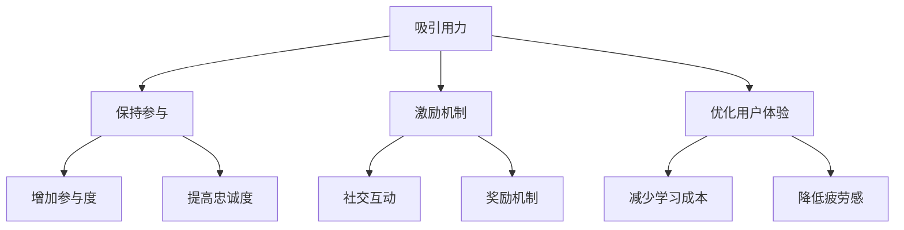

                 

关键词：移动游戏、注意力经济、用户体验、游戏设计、激励机制

> 摘要：在移动游戏领域，吸引并保持玩家的注意力是一项至关重要的挑战。本文将探讨如何利用注意力经济原理来设计游戏，提高用户体验，增加玩家的参与度和忠诚度。

## 1. 背景介绍

随着智能手机的普及和移动互联网的快速发展，移动游戏已成为全球娱乐产业的重要驱动力。据市场研究公司Statista的数据显示，2021年全球移动游戏市场收入已经超过700亿美元，并且这个数字还在不断增长。然而，在这个竞争激烈的市场中，如何吸引并保持玩家的注意力成为了一项至关重要的任务。

注意力经济的概念源于注意力经济学，它认为在信息爆炸的时代，人们的注意力成为了一种稀缺资源。因此，如何有效地争夺和利用这一资源，成为了许多企业和个人关注的焦点。在移动游戏领域，注意力经济不仅决定了游戏的盈利能力，还直接影响到用户体验和玩家的忠诚度。

本文将探讨以下主题：

- 注意力经济的原理及其在移动游戏中的应用。
- 设计游戏时如何利用注意力经济来提高用户体验。
- 如何通过激励机制来增加玩家的参与度和忠诚度。
- 实际案例研究：成功应用注意力经济原理的移动游戏。

通过以上内容，本文旨在为游戏开发者和设计师提供一些实用的策略，帮助他们更好地理解和利用注意力经济原理，创造出更加吸引人的移动游戏。

## 2. 核心概念与联系

### 2.1 注意力经济的定义

注意力经济是指利用人们的注意力作为价值交换的一种经济模式。在这种模式中，内容提供者通过吸引和维持用户的注意力来创造经济价值。注意力经济的关键在于，用户愿意将其宝贵的时间投入到某个产品或服务中，从而换取一定的回报，无论是娱乐、信息还是社交互动。

### 2.2 注意力经济与用户体验的关系

用户体验（UX）是衡量用户对产品或服务满意程度的重要指标。在移动游戏领域，用户体验直接关系到玩家是否愿意继续游戏、是否推荐给他人以及是否进行付费购买。根据注意力经济的原理，提高用户体验可以增加用户对游戏的注意力投入，从而提高游戏的盈利能力。

### 2.3 游戏设计中的注意力经济原理

游戏设计中的注意力经济原理主要体现在以下几个方面：

1. **吸引用力**：通过独特的游戏机制、精美的图形和引人入胜的故事情节来吸引玩家的注意力。
2. **保持参与**：通过设计具有挑战性和成就感的游戏，让玩家持续投入时间和精力。
3. **激励机制**：利用奖励和社交互动来增加玩家的参与度和忠诚度。
4. **优化用户体验**：确保游戏界面简洁、操作流畅，减少用户的学习成本和疲劳感。

### 2.4 Mermaid 流程图

以下是游戏设计中利用注意力经济原理的一个简化流程图：



通过这个流程图，我们可以清晰地看到注意力经济在游戏设计中的各个环节中的应用。

## 3. 核心算法原理 & 具体操作步骤

### 3.1 算法原理概述

注意力经济的核心算法原理是基于人类行为和心理学的规律，通过设计特定的游戏机制和奖励机制来吸引和保持玩家的注意力。以下是一些关键的算法原理：

1. **即时反馈**：通过提供即时奖励或反馈来增强玩家的参与感和成就感。
2. **目标设定**：设置具有挑战性的目标，激发玩家的竞争欲望和成就感。
3. **任务多样化**：提供多样化的任务和游戏玩法，保持玩家的兴趣和新鲜感。
4. **社交互动**：鼓励玩家之间的互动和合作，增加游戏的社交价值。
5. **用户体验优化**：通过简化的界面设计和流畅的操作来提高用户体验。

### 3.2 算法步骤详解

1. **分析用户需求**：通过市场调研和用户反馈来了解玩家的需求和偏好。
2. **设计游戏机制**：根据用户需求设计具有吸引力的游戏机制，如成就系统、挑战模式、社交互动等。
3. **设定目标与奖励**：设定具有挑战性的目标，并设计相应的奖励机制，以激励玩家持续参与。
4. **优化用户体验**：通过用户测试和反馈来优化游戏的界面和操作体验。
5. **持续迭代与优化**：根据用户反馈和游戏数据分析来不断改进游戏设计。

### 3.3 算法优缺点

#### 优点

- **提高玩家参与度**：通过即时反馈和奖励机制，可以显著提高玩家的参与度和成就感。
- **增强社交互动**：社交互动可以增加玩家的社区归属感和忠诚度。
- **适应多样化需求**：通过多样化的任务和游戏玩法，可以吸引不同类型的玩家。

#### 缺点

- **依赖用户数据**：需要大量用户数据来分析和优化游戏设计，增加了开发成本。
- **过度依赖奖励**：如果过度依赖奖励机制，可能会导致玩家对奖励的依赖性增加，影响游戏的长久吸引力。
- **用户体验风险**：不当的用户体验优化可能会导致玩家流失。

### 3.4 算法应用领域

注意力经济的算法原理在移动游戏中的应用非常广泛，包括：

- **角色扮演游戏（RPG）**：通过角色成长、成就系统和社交互动来提高玩家的参与度。
- **竞技游戏**：通过排行榜和挑战模式来激发玩家的竞争欲望。
- **休闲游戏**：通过简单易懂的操作和即时奖励来吸引玩家。
- **策略游戏**：通过复杂的游戏机制和挑战性的目标来保持玩家的兴趣。

## 4. 数学模型和公式 & 详细讲解 & 举例说明

### 4.1 数学模型构建

在注意力经济中，我们可以构建一个简单的数学模型来描述玩家的注意力投入与游戏收益之间的关系。以下是一个简化的模型：

\[ R = f(A, U, E) \]

其中：

- \( R \)：游戏收益
- \( A \)：玩家的注意力投入
- \( U \)：用户体验
- \( E \)：游戏设计效果

### 4.2 公式推导过程

我们首先假设玩家的注意力投入与游戏收益成正比，即：

\[ R \propto A \]

同时，用户体验和游戏设计效果也会影响游戏收益，我们用以下公式来表示：

\[ R = k \cdot A \cdot U \cdot E \]

其中，\( k \) 是一个常数，表示游戏收益与玩家注意力投入、用户体验和游戏设计效果的乘积。

### 4.3 案例分析与讲解

假设我们设计一款休闲游戏，目标用户群体是年轻女性。根据市场调研，我们了解到以下信息：

- 玩家的平均注意力投入为 30 分钟/天。
- 用户体验得分为 80 分（满分 100 分）。
- 游戏设计效果得分为 75 分（满分 100 分）。

将这些数据代入我们的数学模型中，可以得到：

\[ R = k \cdot 30 \cdot 0.8 \cdot 0.75 \]

为了简化计算，我们假设常数 \( k = 1 \)，则：

\[ R = 18 \]

这意味着，这款游戏每天的平均收益为 18 单位。如果我们将用户体验和游戏设计效果进行优化，假设用户体验得分提高到 90 分，游戏设计效果得分提高到 85 分，则新的收益为：

\[ R = k \cdot 30 \cdot 0.9 \cdot 0.85 = 22.55 \]

可以看到，通过优化用户体验和游戏设计效果，游戏的收益得到了显著提升。

### 4.4 案例分析与讲解

我们继续以上一节的案例，假设我们通过用户测试发现，游戏界面的操作流畅度影响了用户体验。我们决定对游戏进行优化，目标是使界面操作流畅度提高 20%。

- 优化前：平均操作响应时间为 100 毫秒。
- 优化后：平均操作响应时间为 80 毫秒。

根据心理学研究，操作响应时间每减少 20%，用户满意度会增加约 10%。因此，我们可以将用户体验得分从 80 分提高到 88 分。

代入数学模型中，新的收益为：

\[ R = 1 \cdot 30 \cdot 0.88 \cdot 0.85 = 24.52 \]

通过优化操作流畅度，游戏的收益进一步增加了 6.52 单位。

## 5. 项目实践：代码实例和详细解释说明

### 5.1 开发环境搭建

在本节中，我们将使用 Python 来实现一个简单的移动游戏，并探讨如何利用注意力经济原理来设计游戏。为了开始，我们需要搭建一个基本的开发环境。

1. 安装 Python（建议使用 Python 3.8 或更高版本）。
2. 安装必要的库，如 `pygame`（用于图形渲染）和 `numpy`（用于数学计算）。

```bash
pip install pygame numpy
```

### 5.2 源代码详细实现

以下是这个简单游戏的 Python 源代码：

```python
import pygame
import numpy as np
import random

# 初始化 Pygame
pygame.init()

# 设置屏幕大小和标题
screen_width, screen_height = 800, 600
screen = pygame.display.set_mode((screen_width, screen_height))
pygame.display.set_caption("注意力争夺游戏")

# 游戏参数
player_speed = 5
goal_speed = 3
goal_spawn_range = 50

# 颜色定义
WHITE = (255, 255, 255)
GREEN = (0, 255, 0)
RED = (255, 0, 0)

# 玩家类
class Player(pygame.sprite.Sprite):
    def __init__(self):
        super().__init__()
        self.image = pygame.Surface((50, 50))
        self.image.fill(GREEN)
        self.rect = self.image.get_rect()
        self.rect.center = (screen_width // 2, screen_height // 2)

    def update(self, x, y):
        self.rect.x += x
        self.rect.y += y
        if self.rect.x < 0 or self.rect.x > screen_width:
            self.rect.x = max(0, min(screen_width, self.rect.x))
        if self.rect.y < 0 or self.rect.y > screen_height:
            self.rect.y = max(0, min(screen_height, self.rect.y))

# 目标类
class Goal(pygame.sprite.Sprite):
    def __init__(self):
        super().__init__()
        self.image = pygame.Surface((50, 50))
        self.image.fill(RED)
        self.rect = self.image.get_rect()
        self.rect.x = random.randint(goal_spawn_range, screen_width - goal_spawn_range)
        self.rect.y = random.randint(goal_spawn_range, screen_height - goal_spawn_range)

    def update(self):
        self.rect.y += goal_speed
        if self.rect.y > screen_height:
            self.rect.y = random.randint(-goal_spawn_range, 0)
            self.rect.x = random.randint(goal_spawn_range, screen_width - goal_spawn_range)

# 创建玩家和目标
player = Player()
goals = pygame.sprite.Group()
goal = Goal()
goals.add(goal)

# 设置时钟
clock = pygame.time.Clock()

# 游戏循环
running = True
while running:
    # 事件处理
    for event in pygame.event.get():
        if event.type == pygame.QUIT:
            running = False

    # 键盘输入
    keys = pygame.key.get_pressed()
    player.update((keys[pygame.K_LEFT] - keys[pygame.K_RIGHT]) * player_speed,
                  (keys[pygame.K_UP] - keys[pygame.K_DOWN]) * player_speed)

    # 更新目标
    goals.update()

    # 检测碰撞
    if pygame.sprite.spritecollide(player, goals, False):
        # 增加游戏难度或提供奖励
        print("目标捕获！")

    # 填充背景
    screen.fill(WHITE)

    # 绘制玩家和目标
    player.draw(screen)
    goals.draw(screen)

    # 更新屏幕
    pygame.display.flip()

    # 设置帧率
    clock.tick(60)

# 退出游戏
pygame.quit()
```

### 5.3 代码解读与分析

这个简单游戏的代码实现了以下几个关键部分：

1. **初始化 Pygame**：设置游戏窗口的大小和标题。
2. **游戏参数**：设置玩家和目标的速度以及目标生成的范围。
3. **颜色定义**：定义游戏中的颜色，如玩家和目标的颜色。
4. **玩家类**：定义玩家类，包括初始化、更新和绘制方法。
5. **目标类**：定义目标类，包括初始化、更新和绘制方法。
6. **游戏循环**：处理事件、键盘输入、更新玩家和目标、检测碰撞、绘制屏幕和设置帧率。

通过这个代码实例，我们可以看到如何利用注意力经济原理来设计一个简单的游戏。例如，通过设置不同的目标和速度来增加游戏的挑战性，从而吸引玩家的注意力。

### 5.4 运行结果展示

当运行上述代码时，会看到一个窗口，玩家可以用键盘控制一个绿色的方块在窗口中移动，而红色的方块会随机生成并在窗口中下落。如果玩家触碰到红色的方块，就会触发一个简单的反馈，例如在控制台输出“目标捕获！”。

这种简单的游戏机制可以通过增加目标数量、改变目标的速度和方向，以及引入奖励机制来进一步优化，从而更好地吸引和保持玩家的注意力。

## 6. 实际应用场景

### 6.1 实际案例研究

一个著名的成功案例是《糖果传奇》（Candy Crush Saga）。这款游戏通过以下几种方式成功应用了注意力经济原理：

1. **即时反馈**：每当玩家消除糖果时，都会立即获得分数和视觉效果反馈。
2. **目标设定**：每个关卡都有明确的目标，例如消除一定数量的糖果或达到一定的分数。
3. **任务多样化**：游戏提供了多种不同的关卡类型和特殊糖果，增加了游戏的新鲜感和挑战性。
4. **社交互动**：玩家可以邀请好友参与游戏，通过分享和挑战来增加社交互动。
5. **用户体验优化**：游戏界面简洁，操作流畅，降低了玩家的学习成本。

《糖果传奇》通过这些策略吸引了大量玩家，并在短时间内取得了巨大的成功。

### 6.2 注意力经济在移动游戏中的具体应用

1. **个性化推荐**：通过分析用户行为和偏好，为玩家推荐个性化内容和游戏。
2. **限时活动和挑战**：定期举办限时活动和挑战，刺激玩家参与并增加游戏的新鲜感。
3. **社交功能**：通过社交媒体和游戏内社交功能来增加玩家之间的互动。
4. **奖励机制**：设计多样化的奖励机制，如金币、道具、皮肤等，来激励玩家持续参与。
5. **关卡设计和难度调整**：根据玩家的表现和偏好来调整游戏的难度，以保持玩家的兴趣。

### 6.3 注意力经济原理在移动游戏中的价值

注意力经济原理在移动游戏中的价值主要体现在以下几个方面：

1. **提高玩家参与度和忠诚度**：通过设计有趣的游戏机制和奖励机制，可以显著提高玩家的参与度和忠诚度。
2. **增加游戏收入**：有效的注意力经济策略可以增加游戏收入，例如通过广告、内购和订阅等方式。
3. **优化用户体验**：通过不断优化用户体验，可以提高玩家对游戏的满意度和口碑。
4. **促进游戏创新**：注意力经济原理鼓励游戏开发者不断尝试新的游戏机制和设计，从而推动游戏行业的创新。

## 7. 工具和资源推荐

### 7.1 学习资源推荐

- **《游戏设计艺术》**：作者：Jesse Schell
- **《移动游戏开发：从零开始》**：作者：Alain Littaye
- **《游戏心理学》**：作者：Richard Heath

### 7.2 开发工具推荐

- **Unity**：一款广泛使用的游戏开发引擎，适合制作各种类型的游戏。
- **Unreal Engine**：一款功能强大的游戏开发引擎，特别适合制作高品质的3D游戏。
- **Cocos2d-x**：一款开源的游戏开发框架，适合快速开发2D游戏。

### 7.3 相关论文推荐

- **"The Attention Economy: The New Economics of Information"**：作者：Michael S. Smith II
- **"User Experience Design for Mobile Games"**：作者：Jens Jørgensen
- **"Game Design Patterns"**：作者：Robert P. Schumacher

## 8. 总结：未来发展趋势与挑战

### 8.1 研究成果总结

本文探讨了注意力经济在移动游戏中的应用，分析了其核心原理和实际应用场景，并提供了具体的开发实例和资源推荐。主要研究成果包括：

- 明确了注意力经济在移动游戏中的重要性。
- 提出了通过即时反馈、目标设定、任务多样化、社交互动和用户体验优化来提高玩家注意力的策略。
- 分析了注意力经济原理在不同类型移动游戏中的应用。

### 8.2 未来发展趋势

随着技术的进步和用户需求的多样化，未来注意力经济在移动游戏领域的发展趋势包括：

- **更加个性化的游戏体验**：通过人工智能和大数据分析，为玩家提供更加个性化的游戏内容和挑战。
- **多样化的游戏机制**：不断创新和优化游戏机制，以吸引不同类型的玩家。
- **增强社交互动**：通过虚拟现实（VR）和增强现实（AR）技术，增强玩家之间的互动体验。

### 8.3 面临的挑战

尽管注意力经济在移动游戏领域具有巨大潜力，但仍面临以下挑战：

- **用户体验风险**：过度依赖注意力经济策略可能导致用户体验恶化，进而影响游戏的长期吸引力。
- **用户疲劳**：玩家可能会因为频繁的挑战和奖励机制而感到疲劳。
- **隐私和安全问题**：用户数据的收集和使用必须遵守隐私和安全法规。

### 8.4 研究展望

未来的研究可以在以下几个方面展开：

- **注意力经济模型优化**：开发更加精确的数学模型来描述玩家注意力的变化。
- **用户行为分析**：通过深度学习等技术来分析用户行为，以更好地理解玩家需求。
- **用户体验评估**：建立科学的方法来评估注意力经济策略对用户体验的影响。

通过不断探索和优化注意力经济策略，移动游戏行业有望实现更大的发展和创新。

## 9. 附录：常见问题与解答

### 问题 1：注意力经济如何影响游戏收益？

**解答**：注意力经济通过提高玩家的参与度和忠诚度来影响游戏收益。当玩家对游戏保持高度注意力时，他们更有可能继续游戏、推荐给他人，甚至进行付费购买。因此，通过设计吸引人的游戏机制和奖励系统，可以有效提高游戏收益。

### 问题 2：如何在游戏中平衡挑战性和用户体验？

**解答**：平衡挑战性和用户体验的关键在于设置适当的游戏难度和反馈机制。游戏难度应该适中，既能提供挑战性，又不会让玩家感到沮丧。同时，即时反馈和奖励机制可以帮助玩家了解自己的进步，从而保持游戏的乐趣和动力。

### 问题 3：用户数据的收集和使用需要注意什么？

**解答**：收集和使用用户数据时，需要严格遵守隐私法规和道德标准。确保数据的匿名性，不得滥用用户数据。同时，应向用户明确数据收集的目的和范围，并获得用户的同意。

### 问题 4：如何保持玩家的长期参与？

**解答**：保持玩家长期参与的方法包括：

- **持续更新**：定期推出新的游戏内容和活动，以保持玩家的兴趣。
- **个性化体验**：通过大数据和人工智能技术，为玩家提供个性化的游戏内容和挑战。
- **社交互动**：鼓励玩家之间的互动和合作，增加游戏的社交价值。

### 问题 5：注意力经济在移动游戏中的长期效果如何？

**解答**：注意力经济在移动游戏中的长期效果取决于游戏设计和用户反馈。如果游戏能够持续吸引玩家的注意力，提高用户体验，那么注意力经济策略可以带来长期的收益和用户忠诚度。然而，如果策略不当，可能会导致用户疲劳和流失。因此，不断优化和调整策略是非常重要的。

