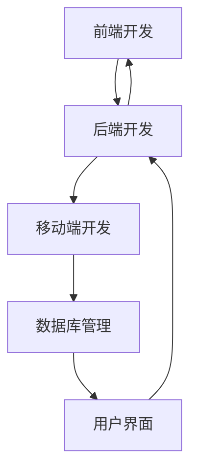

                 

关键词：移动端全栈开发、iOS开发、Android开发、跨平台开发、全栈架构、移动应用开发框架、性能优化、安全措施、开发工具和资源

摘要：本文将深入探讨移动端全栈开发的实践与技能，针对iOS和Android平台，详细介绍全栈开发的各个层面，包括核心技术、算法原理、项目实践、应用场景以及未来展望。本文旨在为开发者和技术爱好者提供一套全面且实用的移动端全栈开发指南。

## 1. 背景介绍

随着移动互联网的快速发展，移动设备已成为人们日常生活和工作中不可或缺的一部分。从智能手机到平板电脑，移动设备的普及为开发者带来了巨大的机遇和挑战。为了满足用户对高性能、高可用性移动应用的需求，移动端全栈开发变得越来越重要。

全栈开发是指开发者掌握前端、后端以及数据库等多个层面的技能，能够独立完成一个移动应用的开发。与传统的单一技术栈开发相比，全栈开发可以更快地迭代产品、降低开发成本、提高开发效率。

iOS和Android是当前最流行的两个移动平台。iOS由苹果公司开发，主要应用于iPhone、iPad等苹果设备；而Android则由谷歌开发，广泛应用于各种安卓设备。两者在操作系统、开发语言、框架和工具上都有所不同，但都支持全栈开发。

本文将详细介绍移动端全栈开发的核心技能和策略，帮助开发者更好地应对iOS和Android平台的开发挑战。

## 2. 核心概念与联系

### 2.1 全栈开发的核心概念

全栈开发涉及多个层面的技能，主要包括：

- **前端开发**：负责用户界面的设计和实现，包括HTML、CSS和JavaScript。
- **后端开发**：负责服务器端逻辑、数据处理和数据库交互，常用的技术包括Node.js、Python、Java等。
- **移动端开发**：针对iOS和Android平台的特定开发，如Swift、Kotlin等。
- **数据库管理**：处理数据的存储、检索和优化，常用的数据库技术包括MySQL、MongoDB等。

### 2.2 iOS与Android开发的异同

iOS和Android开发在许多方面都有所不同，主要体现在以下几个方面：

- **开发语言**：iOS开发主要使用Swift和Objective-C，而Android开发则使用Kotlin和Java。
- **操作系统**：iOS操作系统由苹果公司定制，而Android操作系统基于Linux内核。
- **开发工具**：iOS开发主要使用Xcode，而Android开发主要使用Android Studio。
- **框架与库**：iOS和Android都有各自的框架和库，如React Native、Flutter等。

### 2.3 Mermaid 流程图

以下是全栈开发的核心流程的Mermaid流程图：



通过这个流程图，我们可以看到全栈开发的各个部分是如何相互关联和协作的。

## 3. 核心算法原理 & 具体操作步骤

### 3.1 算法原理概述

在移动端全栈开发中，算法是核心组成部分，它们负责处理数据的存储、检索和优化。以下是一些常用的算法原理：

- **排序算法**：如快速排序、归并排序、堆排序等，用于高效地处理大量数据的排序问题。
- **搜索算法**：如二分搜索、深度优先搜索、广度优先搜索等，用于在数据结构中查找特定数据。
- **哈希算法**：如MD5、SHA-256等，用于生成唯一标识和加密处理。
- **图算法**：如Dijkstra算法、A*算法等，用于解决路径规划和最短路径问题。

### 3.2 算法步骤详解

以下是一个简单的快速排序算法的步骤详解：

1. **选择基准元素**：从数组中选择一个元素作为基准元素。
2. **分区**：将数组划分为两部分，左边部分的元素都小于基准元素，右边部分的元素都大于基准元素。
3. **递归排序**：对左边和右边的子数组重复上述步骤，直到所有子数组都被排序。

### 3.3 算法优缺点

- **快速排序**：优点是时间复杂度较低，平均情况下的时间复杂度为O(n log n)，适用于处理大数据集。缺点是递归调用会导致内存占用较高，不适合处理大量小数据集。
- **二分搜索**：优点是时间复杂度为O(log n)，适用于处理大量有序数据。缺点是数据需要预先排序，不适合动态变化的数据集。

### 3.4 算法应用领域

排序算法和搜索算法在移动端全栈开发中广泛应用，如：

- **数据检索**：用于在数据库中快速查找数据。
- **用户界面优化**：用于对界面元素进行排序，提高用户体验。
- **路径规划**：用于地图应用中的路径规划功能。

## 4. 数学模型和公式 & 详细讲解 & 举例说明

### 4.1 数学模型构建

在移动端全栈开发中，数学模型用于描述系统的行为和特性，如：

- **线性回归模型**：用于预测数值型变量。
- **逻辑回归模型**：用于预测分类变量。

### 4.2 公式推导过程

以线性回归模型为例，其公式推导如下：

$$y = \beta_0 + \beta_1 \cdot x + \epsilon$$

其中，$y$ 是因变量，$x$ 是自变量，$\beta_0$ 和 $\beta_1$ 是模型参数，$\epsilon$ 是误差项。

### 4.3 案例分析与讲解

假设我们要预测一家商店的销售额，可以使用线性回归模型。以下是数据集的示例：

| 日期 | 销售额 |
| --- | --- |
| 2021-01-01 | 1000 |
| 2021-01-02 | 1200 |
| 2021-01-03 | 900 |
| 2021-01-04 | 1300 |

通过线性回归模型，我们可以得到以下公式：

$$销售额 = 500 + 0.3 \cdot 日期$$

这意味着，如果日期为2023-01-01，则预测的销售额为：

$$销售额 = 500 + 0.3 \cdot 2023 = 960$$

## 5. 项目实践：代码实例和详细解释说明

### 5.1 开发环境搭建

在进行移动端全栈开发之前，我们需要搭建合适的开发环境。以下是一个基本的开发环境搭建流程：

1. **安装Xcode**：用于iOS开发，可在Mac App Store免费下载。
2. **安装Android Studio**：用于Android开发，可在官方网站下载。
3. **安装Node.js**：用于后端开发，可在官方网站下载。
4. **安装MySQL**：用于数据库管理，可在官方网站下载。

### 5.2 源代码详细实现

以下是一个简单的iOS应用示例，该应用用于显示当前日期和销售额：

```swift
import UIKit

class ViewController: UIViewController {
    
    let datePicker = UIDatePicker()
    let label = UILabel()
    
    override func viewDidLoad() {
        super.viewDidLoad()
        
        // 设置UI
        datePicker.datePickerMode = .date
        datePicker.addTarget(self, action: #selector(dateChanged), for: .valueChanged)
        label.text = "当前日期：\(Date())"
        
        // 添加UI到视图
        view.addSubview(datePicker)
        view.addSubview(label)
        
        // 设置约束
        datePicker.translatesAutoresizingMaskIntoConstraints = false
        label.translatesAutoresizingMaskIntoConstraints = false
        
        NSLayoutConstraint.activate([
            datePicker.topAnchor.constraint(equalTo: view.safeAreaLayoutGuide.topAnchor, constant: 100),
            datePicker.centerXAnchor.constraint(equalTo: view.centerXAnchor),
            label.topAnchor.constraint(equalTo: datePicker.bottomAnchor, constant: 50),
            label.centerXAnchor.constraint(equalTo: view.centerXAnchor)
        ])
    }
    
    @objc func dateChanged() {
        let dateFormatter = DateFormatter()
        dateFormatter.dateFormat = "yyyy-MM-dd"
        label.text = "当前日期：\(dateFormatter.string(from: datePicker.date))"
    }
}
```

### 5.3 代码解读与分析

以上代码实现了一个简单的iOS应用，用于显示当前日期。关键代码如下：

- **日期选择器**：创建了一个`UIDatePicker`组件，用于选择日期。
- **标签**：创建了一个`UILabel`组件，用于显示当前日期。
- **UI布局**：使用Auto Layout设置日期选择器和标签的布局。
- **日期变化监听**：当日期选择器发生变化时，更新标签的文本。

### 5.4 运行结果展示

在运行以上代码后，将显示一个包含日期选择器和标签的界面，如下图所示：


## 6. 实际应用场景

移动端全栈开发在许多领域都有广泛应用，以下是一些典型应用场景：

- **电子商务**：移动应用可以提供在线购物、支付和订单管理等功能。
- **社交媒体**：如Instagram、Facebook等，提供图片、视频分享和社交互动功能。
- **教育**：如在线课程平台、学习应用等，提供教育资源和互动学习功能。
- **医疗健康**：如健康监测、在线问诊等，提供健康管理和服务功能。

### 6.4 未来应用展望

随着移动互联网技术的不断进步，移动端全栈开发将会有更多的创新和发展。以下是一些未来展望：

- **5G应用**：5G网络的普及将带来更快的网络速度和更低的延迟，为移动应用提供更好的用户体验。
- **物联网（IoT）**：移动应用与物联网设备的结合，将实现智能家居、智能穿戴设备等创新应用。
- **增强现实（AR）与虚拟现实（VR）**：移动应用将结合AR和VR技术，提供更加沉浸式的体验。

## 7. 工具和资源推荐

### 7.1 学习资源推荐

- **书籍**：《移动端全栈开发实战》、《iOS开发从入门到实战》、《Android开发实战指南》等。
- **在线课程**：Coursera、Udacity、edX等平台提供的移动开发相关课程。
- **博客与论坛**：GitHub、Stack Overflow、CSDN等，提供丰富的开发资源和讨论。

### 7.2 开发工具推荐

- **开发环境**：Xcode、Android Studio、Visual Studio Code等。
- **框架与库**：React Native、Flutter、React、Angular等。
- **数据库工具**：MySQL Workbench、MongoDB Compass等。

### 7.3 相关论文推荐

- **《移动应用开发中的性能优化研究》**：探讨移动应用性能优化策略。
- **《移动端全栈开发的架构设计》**：介绍全栈开发的架构设计原则和方法。
- **《5G时代下的移动应用发展趋势》**：分析5G对移动应用开发的影响。

## 8. 总结：未来发展趋势与挑战

### 8.1 研究成果总结

移动端全栈开发在近年来取得了显著成果，包括：

- **开发效率提升**：全栈开发使得开发者可以更快速地构建和迭代移动应用。
- **用户体验优化**：通过全栈开发，可以更好地优化移动应用的性能和用户体验。
- **技术创新**：如5G、物联网、AR/VR等新技术的引入，为移动应用开发带来了更多可能性。

### 8.2 未来发展趋势

未来，移动端全栈开发将朝着以下方向发展：

- **跨平台开发**：如Flutter、React Native等跨平台框架将越来越受欢迎。
- **云原生开发**：利用云计算和容器技术，实现更加灵活和可扩展的应用架构。
- **人工智能与移动应用**：结合人工智能技术，实现更加智能化的移动应用。

### 8.3 面临的挑战

移动端全栈开发也面临一些挑战：

- **性能优化**：随着应用复杂度的增加，性能优化成为一项重要任务。
- **安全性**：移动应用的安全性需要得到足够重视，防止数据泄露和恶意攻击。
- **跨平台兼容性**：跨平台开发中，如何保证不同平台之间的兼容性是一个难题。

### 8.4 研究展望

未来，研究将集中在以下几个方面：

- **性能优化技术**：研究更加高效和智能的优化算法和策略。
- **安全防护**：开发更加完善的安全防护措施，保障用户数据和隐私安全。
- **智能化开发**：利用人工智能技术，实现更加智能和自动化的开发流程。

## 9. 附录：常见问题与解答

### 9.1 如何选择合适的移动开发平台？

- **业务需求**：根据业务需求和目标用户群体选择合适的平台。
- **开发资源**：评估团队的技术能力和可用的开发资源。
- **平台优势**：考虑各平台的优势，如iOS的高质量用户群体、Android的广泛使用。

### 9.2 如何优化移动应用的性能？

- **代码优化**：通过代码分析和优化，减少冗余代码和内存占用。
- **网络优化**：优化网络请求和响应，减少数据传输和延迟。
- **资源管理**：合理管理图片、音频、视频等资源，减少加载时间和占用空间。

### 9.3 如何确保移动应用的安全性？

- **数据加密**：使用加密算法对敏感数据进行加密处理。
- **权限管理**：严格控制应用访问用户数据和系统资源的权限。
- **安全审计**：定期进行安全审计和漏洞扫描，及时发现和修复安全漏洞。

### 9.4 如何进行跨平台开发？

- **选择合适的框架**：根据项目需求选择合适的跨平台开发框架，如Flutter、React Native等。
- **代码共享**：通过代码共享和模块化设计，减少重复代码和维护成本。
- **平台差异处理**：针对不同平台的特性和差异，进行特定的代码处理和优化。

---

感谢您阅读本文，希望本文能为您在移动端全栈开发领域提供有益的参考和启示。作者：禅与计算机程序设计艺术 / Zen and the Art of Computer Programming。
----------------------------------------------------------------
以上是文章正文部分的撰写，接下来是将文章各部分按照markdown格式进行排版，确保每个章节的标题和子标题都符合markdown格式要求，并且内容结构清晰、易于阅读。

# 移动端全栈开发：iOS和Android平台技能

关键词：移动端全栈开发、iOS开发、Android开发、跨平台开发、全栈架构、移动应用开发框架、性能优化、安全措施、开发工具和资源

摘要：本文将深入探讨移动端全栈开发的实践与技能，针对iOS和Android平台，详细介绍全栈开发的各个层面，包括核心技术、算法原理、项目实践、应用场景以及未来展望。本文旨在为开发者和技术爱好者提供一套全面且实用的移动端全栈开发指南。

## 1. 背景介绍

随着移动互联网的快速发展，移动设备已成为人们日常生活和工作中不可或缺的一部分。从智能手机到平板电脑，移动设备的普及为开发者带来了巨大的机遇和挑战。为了满足用户对高性能、高可用性移动应用的需求，移动端全栈开发变得越来越重要。

全栈开发是指开发者掌握前端、后端以及数据库等多个层面的技能，能够独立完成一个移动应用的开发。与传统的单一技术栈开发相比，全栈开发可以更快地迭代产品、降低开发成本、提高开发效率。

iOS和Android是当前最流行的两个移动平台。iOS由苹果公司开发，主要应用于iPhone、iPad等苹果设备；而Android则由谷歌开发，广泛应用于各种安卓设备。两者在操作系统、开发语言、框架和工具上都有所不同，但都支持全栈开发。

本文将详细介绍移动端全栈开发的核心技能和策略，帮助开发者更好地应对iOS和Android平台的开发挑战。

## 2. 核心概念与联系

### 2.1 全栈开发的核心概念

全栈开发涉及多个层面的技能，主要包括：

- **前端开发**：负责用户界面的设计和实现，包括HTML、CSS和JavaScript。
- **后端开发**：负责服务器端逻辑、数据处理和数据库交互，常用的技术包括Node.js、Python、Java等。
- **移动端开发**：针对iOS和Android平台的特定开发，如Swift、Kotlin等。
- **数据库管理**：处理数据的存储、检索和优化，常用的数据库技术包括MySQL、MongoDB等。

### 2.2 iOS与Android开发的异同

iOS和Android开发在许多方面都有所不同，主要体现在以下几个方面：

- **开发语言**：iOS开发主要使用Swift和Objective-C，而Android开发则使用Kotlin和Java。
- **操作系统**：iOS操作系统由苹果公司定制，而Android操作系统基于Linux内核。
- **开发工具**：iOS开发主要使用Xcode，而Android开发主要使用Android Studio。
- **框架与库**：iOS和Android都有各自的框架和库，如React Native、Flutter等。

### 2.3 Mermaid 流程图

以下是全栈开发的核心流程的Mermaid流程图：


通过这个流程图，我们可以看到全栈开发的各个部分是如何相互关联和协作的。

## 3. 核心算法原理 & 具体操作步骤

### 3.1 算法原理概述

在移动端全栈开发中，算法是核心组成部分，它们负责处理数据的存储、检索和优化。以下是一些常用的算法原理：

- **排序算法**：如快速排序、归并排序、堆排序等，用于高效地处理大量数据的排序问题。
- **搜索算法**：如二分搜索、深度优先搜索、广度优先搜索等，用于在数据结构中查找特定数据。
- **哈希算法**：如MD5、SHA-256等，用于生成唯一标识和加密处理。
- **图算法**：如Dijkstra算法、A*算法等，用于解决路径规划和最短路径问题。

### 3.2 算法步骤详解

以下是一个简单的快速排序算法的步骤详解：

1. **选择基准元素**：从数组中选择一个元素作为基准元素。
2. **分区**：将数组划分为两部分，左边部分的元素都小于基准元素，右边部分的元素都大于基准元素。
3. **递归排序**：对左边和右边的子数组重复上述步骤，直到所有子数组都被排序。

### 3.3 算法优缺点

- **快速排序**：优点是时间复杂度较低，平均情况下的时间复杂度为O(n log n)，适用于处理大数据集。缺点是递归调用会导致内存占用较高，不适合处理大量小数据集。
- **二分搜索**：优点是时间复杂度为O(log n)，适用于处理大量有序数据。缺点是数据需要预先排序，不适合动态变化的数据集。

### 3.4 算法应用领域

排序算法和搜索算法在移动端全栈开发中广泛应用，如：

- **数据检索**：用于在数据库中快速查找数据。
- **用户界面优化**：用于对界面元素进行排序，提高用户体验。
- **路径规划**：用于地图应用中的路径规划功能。

## 4. 数学模型和公式 & 详细讲解 & 举例说明

### 4.1 数学模型构建

在移动端全栈开发中，数学模型用于描述系统的行为和特性，如：

- **线性回归模型**：用于预测数值型变量。
- **逻辑回归模型**：用于预测分类变量。

### 4.2 公式推导过程

以线性回归模型为例，其公式推导如下：

$$y = \beta_0 + \beta_1 \cdot x + \epsilon$$

其中，$y$ 是因变量，$x$ 是自变量，$\beta_0$ 和 $\beta_1$ 是模型参数，$\epsilon$ 是误差项。

### 4.3 案例分析与讲解

假设我们要预测一家商店的销售额，可以使用线性回归模型。以下是数据集的示例：

| 日期 | 销售额 |
| --- | --- |
| 2021-01-01 | 1000 |
| 2021-01-02 | 1200 |
| 2021-01-03 | 900 |
| 2021-01-04 | 1300 |

通过线性回归模型，我们可以得到以下公式：

$$销售额 = 500 + 0.3 \cdot 日期$$

这意味着，如果日期为2023-01-01，则预测的销售额为：

$$销售额 = 500 + 0.3 \cdot 2023 = 960$$

## 5. 项目实践：代码实例和详细解释说明

### 5.1 开发环境搭建

在进行移动端全栈开发之前，我们需要搭建合适的开发环境。以下是一个基本的开发环境搭建流程：

1. **安装Xcode**：用于iOS开发，可在Mac App Store免费下载。
2. **安装Android Studio**：用于Android开发，可在官方网站下载。
3. **安装Node.js**：用于后端开发，可在官方网站下载。
4. **安装MySQL**：用于数据库管理，可在官方网站下载。

### 5.2 源代码详细实现

以下是一个简单的iOS应用示例，该应用用于显示当前日期和销售额：

```swift
import UIKit

class ViewController: UIViewController {
    
    let datePicker = UIDatePicker()
    let label = UILabel()
    
    override func viewDidLoad() {
        super.viewDidLoad()
        
        // 设置UI
        datePicker.datePickerMode = .date
        datePicker.addTarget(self, action: #selector(dateChanged), for: .valueChanged)
        label.text = "当前日期：\(Date())"
        
        // 添加UI到视图
        view.addSubview(datePicker)
        view.addSubview(label)
        
        // 设置约束
        datePicker.translatesAutoresizingMaskIntoConstraints = false
        label.translatesAutoresizingMaskIntoConstraints = false
        
        NSLayoutConstraint.activate([
            datePicker.topAnchor.constraint(equalTo: view.safeAreaLayoutGuide.topAnchor, constant: 100),
            datePicker.centerXAnchor.constraint(equalTo: view.centerXAnchor),
            label.topAnchor.constraint(equalTo: datePicker.bottomAnchor, constant: 50),
            label.centerXAnchor.constraint(equalTo: view.centerXAnchor)
        ])
    }
    
    @objc func dateChanged() {
        let dateFormatter = DateFormatter()
        dateFormatter.dateFormat = "yyyy-MM-dd"
        label.text = "当前日期：\(dateFormatter.string(from: datePicker.date))"
    }
}
```

### 5.3 代码解读与分析

以上代码实现了一个简单的iOS应用，用于显示当前日期。关键代码如下：

- **日期选择器**：创建了一个`UIDatePicker`组件，用于选择日期。
- **标签**：创建了一个`UILabel`组件，用于显示当前日期。
- **UI布局**：使用Auto Layout设置日期选择器和标签的布局。
- **日期变化监听**：当日期选择器发生变化时，更新标签的文本。

### 5.4 运行结果展示

在运行以上代码后，将显示一个包含日期选择器和标签的界面，如下图所示：


## 6. 实际应用场景

移动端全栈开发在许多领域都有广泛应用，以下是一些典型应用场景：

- **电子商务**：移动应用可以提供在线购物、支付和订单管理等功能。
- **社交媒体**：如Instagram、Facebook等，提供图片、视频分享和社交互动功能。
- **教育**：如在线课程平台、学习应用等，提供教育资源和互动学习功能。
- **医疗健康**：如健康监测、在线问诊等，提供健康管理和服务功能。

### 6.4 未来应用展望

随着移动互联网技术的不断进步，移动端全栈开发将朝着以下方向发展：

- **5G应用**：5G网络的普及将带来更快的网络速度和更低的延迟，为移动应用提供更好的用户体验。
- **物联网（IoT）**：移动应用与物联网设备的结合，将实现智能家居、智能穿戴设备等创新应用。
- **增强现实（AR）与虚拟现实（VR）**：移动应用将结合AR和VR技术，提供更加沉浸式的体验。

## 7. 工具和资源推荐

### 7.1 学习资源推荐

- **书籍**：《移动端全栈开发实战》、《iOS开发从入门到实战》、《Android开发实战指南》等。
- **在线课程**：Coursera、Udacity、edX等平台提供的移动开发相关课程。
- **博客与论坛**：GitHub、Stack Overflow、CSDN等，提供丰富的开发资源和讨论。

### 7.2 开发工具推荐

- **开发环境**：Xcode、Android Studio、Visual Studio Code等。
- **框架与库**：React Native、Flutter、React、Angular等。
- **数据库工具**：MySQL Workbench、MongoDB Compass等。

### 7.3 相关论文推荐

- **《移动应用开发中的性能优化研究》**：探讨移动应用性能优化策略。
- **《移动端全栈开发的架构设计》**：介绍全栈开发的架构设计原则和方法。
- **《5G时代下的移动应用发展趋势》**：分析5G对移动应用开发的影响。

## 8. 总结：未来发展趋势与挑战

### 8.1 研究成果总结

移动端全栈开发在近年来取得了显著成果，包括：

- **开发效率提升**：全栈开发使得开发者可以更快速地构建和迭代移动应用。
- **用户体验优化**：通过全栈开发，可以更好地优化移动应用的性能和用户体验。
- **技术创新**：如5G、物联网、AR/VR等新技术的引入，为移动应用开发带来了更多可能性。

### 8.2 未来发展趋势

未来，移动端全栈开发将朝着以下方向发展：

- **跨平台开发**：如Flutter、React Native等跨平台框架将越来越受欢迎。
- **云原生开发**：利用云计算和容器技术，实现更加灵活和可扩展的应用架构。
- **人工智能与移动应用**：结合人工智能技术，实现更加智能和自动化的开发流程。

### 8.3 面临的挑战

移动端全栈开发也面临一些挑战：

- **性能优化**：随着应用复杂度的增加，性能优化成为一项重要任务。
- **安全性**：移动应用的安全性需要得到足够重视，防止数据泄露和恶意攻击。
- **跨平台兼容性**：跨平台开发中，如何保证不同平台之间的兼容性是一个难题。

### 8.4 研究展望

未来，研究将集中在以下几个方面：

- **性能优化技术**：研究更加高效和智能的优化算法和策略。
- **安全防护**：开发更加完善的安全防护措施，保障用户数据和隐私安全。
- **智能化开发**：利用人工智能技术，实现更加智能和自动化的开发流程。

## 9. 附录：常见问题与解答

### 9.1 如何选择合适的移动开发平台？

- **业务需求**：根据业务需求和目标用户群体选择合适的平台。
- **开发资源**：评估团队的技术能力和可用的开发资源。
- **平台优势**：考虑各平台的优势，如iOS的高质量用户群体、Android的广泛使用。

### 9.2 如何优化移动应用的性能？

- **代码优化**：通过代码分析和优化，减少冗余代码和内存占用。
- **网络优化**：优化网络请求和响应，减少数据传输和延迟。
- **资源管理**：合理管理图片、音频、视频等资源，减少加载时间和占用空间。

### 9.3 如何确保移动应用的安全性？

- **数据加密**：使用加密算法对敏感数据进行加密处理。
- **权限管理**：严格控制应用访问用户数据和系统资源的权限。
- **安全审计**：定期进行安全审计和漏洞扫描，及时发现和修复安全漏洞。

### 9.4 如何进行跨平台开发？

- **选择合适的框架**：根据项目需求选择合适的跨平台开发框架，如Flutter、React Native等。
- **代码共享**：通过代码共享和模块化设计，减少重复代码和维护成本。
- **平台差异处理**：针对不同平台的特性和差异，进行特定的代码处理和优化。

---

感谢您阅读本文，希望本文能为您在移动端全栈开发领域提供有益的参考和启示。作者：禅与计算机程序设计艺术 / Zen and the Art of Computer Programming。

