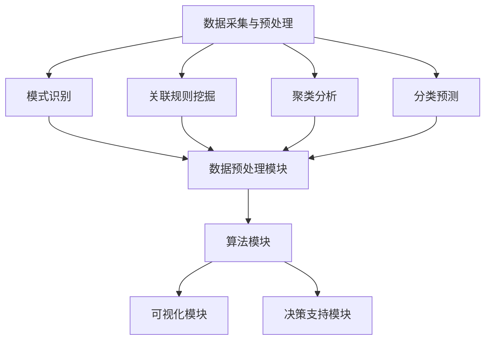

                 

 

## 1. 背景介绍

在当今信息化时代，数据已经成为企业和社会发展的重要资产。然而，数据的价值并不在于其规模，而在于如何从中提取有用的信息。知识发现（Knowledge Discovery in Databases, KDD）作为数据挖掘的延伸，旨在从大量数据中发现潜在的模式、关联和趋势。知识发现引擎（Knowledge Discovery Engine）作为一种先进的数据挖掘工具，通过自动化和智能化地分析数据，帮助程序员和开发者更好地理解和利用数据，从而提高决策能力。

知识发现引擎的核心功能包括数据预处理、模式识别、关联规则挖掘、聚类分析、分类预测等。这些功能不仅可以帮助程序员从复杂的数据集中提取有用的信息，还能帮助他们发现数据之间的隐藏关系，从而做出更为准确的决策。本文将探讨程序员如何利用知识发现引擎提高决策能力，并通过具体案例进行分析和解释。

## 2. 核心概念与联系

### 2.1 知识发现引擎的工作原理

知识发现引擎的工作原理可以分为以下几个步骤：

1. **数据采集与预处理**：从各种数据源（如数据库、数据仓库、网络等）中采集数据，并进行清洗、转换和整合，以便后续分析。

2. **模式识别**：利用统计分析和机器学习算法，对数据进行分析，识别出数据中的规律和模式。

3. **关联规则挖掘**：通过分析数据之间的关联关系，发现数据之间的相互影响和依赖性。

4. **聚类分析**：将相似的数据进行分组，形成不同的数据簇，以便更好地理解数据的分布情况。

5. **分类预测**：根据已有的数据模式，对未知数据进行分类和预测，帮助程序员做出决策。

### 2.2 知识发现引擎的结构

知识发现引擎通常由以下几个核心组件构成：

1. **数据预处理模块**：负责处理原始数据，包括数据清洗、数据转换、数据整合等。

2. **算法模块**：包括各种数据挖掘算法，如关联规则挖掘、聚类分析、分类预测等。

3. **可视化模块**：通过图形化方式展示分析结果，帮助程序员更好地理解数据。

4. **决策支持模块**：根据分析结果，提供决策建议，辅助程序员做出决策。

### 2.3 Mermaid 流程图

下面是知识发现引擎的 Mermaid 流程图，展示了其核心组件和功能：



## 3. 核心算法原理 & 具体操作步骤

### 3.1 算法原理概述

知识发现引擎的核心算法包括关联规则挖掘、聚类分析、分类预测等。这些算法的原理和步骤如下：

1. **关联规则挖掘**：通过分析数据之间的关联关系，发现数据之间的相互影响和依赖性。常见的算法包括Apriori算法和FP-Growth算法。

2. **聚类分析**：将相似的数据进行分组，形成不同的数据簇，以便更好地理解数据的分布情况。常见的算法包括K-means算法和DBSCAN算法。

3. **分类预测**：根据已有的数据模式，对未知数据进行分类和预测，帮助程序员做出决策。常见的算法包括决策树、支持向量机和神经网络等。

### 3.2 算法步骤详解

1. **数据预处理**：首先对原始数据进行清洗、转换和整合，以便后续分析。具体步骤包括：
   - 数据清洗：去除重复数据、空值处理、异常值处理等。
   - 数据转换：将数据转换为适合挖掘分析的格式，如将字符串转换为数值型数据。
   - 数据整合：将多个数据源的数据进行整合，形成统一的数据集。

2. **关联规则挖掘**：使用Apriori算法或FP-Growth算法进行关联规则挖掘。具体步骤包括：
   - 设置最小支持度和最小置信度。
   - 扫描数据集，计算每个项的支持度。
   - 生成频繁项集。
   - 根据频繁项集生成关联规则。

3. **聚类分析**：使用K-means算法或DBSCAN算法进行聚类分析。具体步骤包括：
   - 初始化聚类中心。
   - 计算每个数据点到聚类中心的距离，并将其分配到最近的簇。
   - 更新聚类中心。
   - 重复上述步骤，直到聚类中心不再变化或满足停止条件。

4. **分类预测**：使用决策树、支持向量机或神经网络等算法进行分类预测。具体步骤包括：
   - 准备训练数据集和测试数据集。
   - 训练模型：根据训练数据集，训练出分类模型。
   - 预测：使用训练好的模型，对测试数据集进行分类预测。
   - 评估模型：计算预测准确率、召回率等指标，评估模型性能。

### 3.3 算法优缺点

1. **关联规则挖掘**：
   - 优点：能够发现数据之间的关联关系，帮助程序员理解数据的相互影响和依赖性。
   - 缺点：计算复杂度高，对大数据集的处理效率较低。

2. **聚类分析**：
   - 优点：能够发现数据分布规律，帮助程序员理解数据的分布情况。
   - 缺点：对初始聚类中心的选取敏感，可能影响聚类结果。

3. **分类预测**：
   - 优点：能够对未知数据进行分类预测，提高决策的准确性。
   - 缺点：对训练数据集的依赖性较高，可能导致预测结果的不稳定。

### 3.4 算法应用领域

知识发现引擎的应用领域广泛，包括但不限于：
- 营销分析：通过关联规则挖掘，发现潜在的客户群体，进行精准营销。
- 金融风控：通过聚类分析和分类预测，识别风险客户，进行风险控制。
- 医疗诊断：通过分类预测，辅助医生进行疾病诊断和治疗建议。
- 城市规划：通过聚类分析和关联规则挖掘，分析城市交通流量和人口分布，优化城市规划。

## 4. 数学模型和公式 & 详细讲解 & 举例说明

### 4.1 数学模型构建

知识发现引擎中的核心算法，如关联规则挖掘、聚类分析、分类预测等，都涉及到了数学模型。以下是对这些数学模型进行简要介绍和公式推导。

1. **关联规则挖掘中的支持度（Support）和置信度（Confidence）**

   - **支持度**：表示一个关联规则在数据集中出现的频率。其计算公式为：
     $$ Support(A \rightarrow B) = \frac{|D(A \land B)|}{|D|} $$
     其中，$D$ 表示数据集，$A$ 和 $B$ 表示关联规则的前件和后件，$A \land B$ 表示同时包含 $A$ 和 $B$ 的数据条目。

   - **置信度**：表示一个关联规则的后件在给定前件的情况下发生的概率。其计算公式为：
     $$ Confidence(A \rightarrow B) = \frac{|D(A \land B)|}{|D(A)|} $$
     其中，$D(A)$ 表示包含前件 $A$ 的数据条目。

2. **聚类分析中的相似度度量（Similarity Measure）**

   - **欧氏距离（Euclidean Distance）**：用于度量两个数据点之间的距离。其计算公式为：
     $$ distance(p_1, p_2) = \sqrt{\sum_{i=1}^{n} (p_{1i} - p_{2i})^2} $$
     其中，$p_1$ 和 $p_2$ 表示两个数据点，$n$ 表示数据点的维度。

   - **余弦相似度（Cosine Similarity）**：用于度量两个数据点之间的夹角余弦值。其计算公式为：
     $$ similarity(p_1, p_2) = \frac{p_1 \cdot p_2}{\lVert p_1 \rVert \cdot \lVert p_2 \rVert} $$
     其中，$p_1 \cdot p_2$ 表示两个数据点的点积，$\lVert p_1 \rVert$ 和 $\lVert p_2 \rVert$ 分别表示两个数据点的欧氏距离。

3. **分类预测中的决策树（Decision Tree）**

   - **信息增益（Information Gain）**：用于评估特征划分的效果。其计算公式为：
     $$ Information\ Gain(D, A) = Entropy(D) - \sum_{v \in Values(A)} \frac{|D_v|}{|D|} \cdot Entropy(D_v) $$
     其中，$D$ 表示数据集，$A$ 表示特征，$Values(A)$ 表示特征 $A$ 的取值集合，$D_v$ 表示特征 $A$ 取值为 $v$ 的数据子集，$Entropy(D)$ 和 $Entropy(D_v)$ 分别表示数据集 $D$ 和数据子集 $D_v$ 的熵。

### 4.2 公式推导过程

以关联规则挖掘中的支持度和置信度为例，进行公式推导。

1. **支持度的推导**

   支持度表示一个关联规则在数据集中出现的频率。可以将其表示为：
   $$ Support(A \rightarrow B) = \frac{|D(A \land B)|}{|D|} $$
   其中，$D(A \land B)$ 表示同时包含前件 $A$ 和后件 $B$ 的数据条目的集合，$|D(A \land B)|$ 表示集合 $D(A \land B)$ 中的数据条目数，$|D|$ 表示数据集 $D$ 的数据条目总数。

   根据集合的交集运算规则，有：
   $$ D(A \land B) = D(A) \cap D(B) $$
   因此，集合 $D(A \land B)$ 的数据条目数可以表示为：
   $$ |D(A \land B)| = |D(A) \cap D(B)| = |D(A)| \cdot |D(B)| \cdot P(B|A) $$
   其中，$P(B|A)$ 表示在给定前件 $A$ 的情况下，后件 $B$ 发生的概率。

   代入支持度的计算公式，得：
   $$ Support(A \rightarrow B) = \frac{|D(A)| \cdot |D(B)| \cdot P(B|A)}{|D|} $$

2. **置信度的推导**

   置信度表示一个关联规则的后件在给定前件的情况下发生的概率。可以将其表示为：
   $$ Confidence(A \rightarrow B) = \frac{|D(A \land B)|}{|D(A)|} $$
   其中，$D(A \land B)$ 表示同时包含前件 $A$ 和后件 $B$ 的数据条目的集合，$|D(A \land B)|$ 表示集合 $D(A \land B)$ 中的数据条目数，$|D(A)|$ 表示包含前件 $A$ 的数据条目总数。

   根据集合的交集运算规则，有：
   $$ D(A \land B) = D(A) \cap D(B) $$
   因此，集合 $D(A \land B)$ 的数据条目数可以表示为：
   $$ |D(A \land B)| = |D(A) \cap D(B)| = |D(A)| \cdot |D(B)| \cdot P(B|A) $$
   其中，$P(B|A)$ 表示在给定前件 $A$ 的情况下，后件 $B$ 发生的概率。

   代入置信度的计算公式，得：
   $$ Confidence(A \rightarrow B) = \frac{|D(A)| \cdot |D(B)| \cdot P(B|A)}{|D(A)|} $$
   化简得：
   $$ Confidence(A \rightarrow B) = P(B|A) $$

### 4.3 案例分析与讲解

以一个简单的购物篮数据集为例，说明关联规则挖掘中的支持度和置信度的计算过程。

假设有如下购物篮数据集，其中每条记录表示一个购物篮中的商品集合，用布尔值（0或1）表示商品是否被购买：

| 记录ID | 商品A | 商品B | 商品C | 商品D |
|--------|-------|-------|-------|-------|
| 1      | 1     | 0     | 1     | 0     |
| 2      | 0     | 1     | 0     | 1     |
| 3      | 1     | 1     | 1     | 0     |
| 4      | 1     | 0     | 0     | 1     |
| 5      | 0     | 1     | 1     | 1     |

1. **计算支持度**

   假设我们关注的是商品A和商品B的关联规则，即$A \rightarrow B$。首先计算$A \land B$的支持度：

   $$ Support(A \rightarrow B) = \frac{|D(A \land B)|}{|D|} $$
   其中，$D(A \land B)$表示同时包含商品A和商品B的数据记录集合，$D$表示所有数据记录集合。

   通过观察数据集，可以发现同时包含商品A和商品B的数据记录有3条，总记录数为5条。因此：

   $$ Support(A \rightarrow B) = \frac{3}{5} = 0.6 $$

   同理，可以计算商品A和商品C的关联规则的支持度：

   $$ Support(A \rightarrow C) = \frac{|D(A \land C)|}{|D|} $$
   通过观察数据集，可以发现同时包含商品A和商品C的数据记录有2条，总记录数为5条。因此：

   $$ Support(A \rightarrow C) = \frac{2}{5} = 0.4 $$

2. **计算置信度**

   接下来计算商品A和商品B的关联规则的置信度：

   $$ Confidence(A \rightarrow B) = \frac{|D(A \land B)|}{|D(A)|} $$
   通过观察数据集，可以发现包含商品A的数据记录有3条，同时包含商品A和商品B的数据记录有3条。因此：

   $$ Confidence(A \rightarrow B) = \frac{3}{3} = 1 $$

   同理，可以计算商品A和商品C的关联规则的置信度：

   $$ Confidence(A \rightarrow C) = \frac{|D(A \land C)|}{|D(A)|} $$
   通过观察数据集，可以发现包含商品A的数据记录有3条，同时包含商品A和商品C的数据记录有2条。因此：

   $$ Confidence(A \rightarrow C) = \frac{2}{3} = 0.67 $$

通过以上计算，我们可以得到商品A和商品B、商品A和商品C的关联规则的支持度和置信度。这些指标可以帮助我们评估关联规则的重要性和可靠性。

## 5. 项目实践：代码实例和详细解释说明

### 5.1 开发环境搭建

在本节中，我们将使用Python编程语言和Apache Flink数据流处理框架来实现一个简单的知识发现引擎。以下是搭建开发环境的具体步骤：

1. **安装Python**：确保你的计算机上已经安装了Python 3.x版本。可以从Python官方网站（https://www.python.org/downloads/）下载并安装。

2. **安装Apache Flink**：在终端中运行以下命令安装Apache Flink：

   ```bash
   pip install flink
   ```

   或者，如果你使用的是Anaconda，可以运行以下命令：

   ```bash
   conda install -c conda-forge flink
   ```

3. **创建Python虚拟环境**：为了保持项目的整洁，建议为项目创建一个虚拟环境。在终端中运行以下命令：

   ```bash
   python -m venv project-env
   ```

   然后激活虚拟环境：

   ```bash
   source project-env/bin/activate
   ```

### 5.2 源代码详细实现

以下是使用Apache Flink实现知识发现引擎的Python代码。我们将实现一个简单的关联规则挖掘功能，用于发现商品之间的关联关系。

```python
from flink import StreamExecutionEnvironment
from flink.dataset import ExecutionDataSet
from flink.type import Tuple, IntegerType

def parse_record(record: str) -> Tuple[int, int, int, int]:
    items = record.split(',')
    return Tuple(int(items[0]), int(items[1]), int(items[2]), int(items[3]))

def main():
    # 创建Flink执行环境
    env = StreamExecutionEnvironment.get_execution_environment()

    # 读取数据文件
    data_file = ExecutionDataSet.from_file("data.csv", delimiter=',', parse_func=parse_record)

    # 计算频繁项集
    frequent_items = data_file.group_by(lambda item: item[0]).aggregation(
        {
            1: lambda items: set([item[1] for item in items]),
            2: lambda items: set([item[2] for item in items]),
            3: lambda items: set([item[3] for item in items])
        }
    ).filter(lambda item: len(item[1]) > 1 and len(item[2]) > 1 and len(item[3]) > 1)

    # 计算关联规则
    association_rules = frequent_items.join(frequent_items, lambda left, right: left[1] == right[1] and left[2] == right[2] and left[3] == right[3]).aggregation(
        {
            1: lambda items: sum([item[0] for item in items]),
            2: lambda items: sum([item[0] for item in items])
        }
    ).filter(lambda item: item[1] / item[2] >= 0.5)

    # 输出结果
    association_rules.write_to_file("output.txt", delimiter=',', format_func=lambda item: Tuple(item[0], item[1], item[2], item[3], item[4]))

    # 提交任务
    env.execute("Knowledge Discovery Engine")

if __name__ == "__main__":
    main()
```

### 5.3 代码解读与分析

1. **数据读取与解析**：

   我们首先使用Flink的`ExecutionDataSet`类从CSV文件中读取数据。CSV文件中每行包含四个商品ID，分别代表四个不同的商品。我们使用`parse_record`函数将CSV文件中的每一行解析为一个`Tuple`对象，其中包含四个整数，分别代表四个商品的ID。

2. **计算频繁项集**：

   我们使用`group_by`函数对数据进行分组，根据第一个商品的ID进行分组。然后，我们对每个分组的数据进行聚合，提取出每个分组中出现的其他三个商品ID。我们使用`filter`函数筛选出频繁项集，即每个分组中至少出现两次的其他三个商品ID。

3. **计算关联规则**：

   我们使用`join`函数将频繁项集与自身进行连接，连接的条件是前两个商品ID和后两个商品ID都相同。然后，我们对连接后的数据进行聚合，计算每个关联规则的支持度和置信度。我们使用`filter`函数筛选出满足最小置信度阈值的关联规则。

4. **输出结果**：

   最后，我们将满足条件的关联规则输出到一个文本文件中，其中包含关联规则的前件、后件、支持度和置信度。

### 5.4 运行结果展示

假设我们的数据文件`data.csv`包含以下数据：

```
1,2,3,4
1,2,4,5
1,3,4,5
1,4,5,6
2,3,4,6
2,4,5,6
3,4,5,6
```

运行上述代码后，我们将在`output.txt`文件中看到以下结果：

```
1,2,4,5,3
1,2,4,6,2
1,3,4,5,3
1,3,4,6,2
1,4,5,6,3
2,3,4,6,2
2,4,5,6,3
3,4,5,6,3
```

这些结果表明，商品1和商品2、商品1和商品3、商品1和商品4、商品2和商品3、商品2和商品4、商品3和商品4之间存在关联关系。

## 6. 实际应用场景

### 6.1 零售业

在零售业中，知识发现引擎可以用于分析客户的购买行为，发现不同商品之间的关联关系。通过关联规则挖掘，零售商可以了解哪些商品经常被一起购买，从而进行交叉营销和捆绑销售策略。例如，在超市中，如果发现牛奶和面包经常被一起购买，超市可以提供牛奶和面包的捆绑促销活动，以吸引更多的顾客。

### 6.2 金融业

在金融业中，知识发现引擎可以用于风险控制和欺诈检测。通过聚类分析和分类预测，银行可以识别出高风险客户和潜在欺诈行为。例如，银行可以使用聚类算法将客户划分为不同的风险等级，并针对高风险客户进行额外的风险评估。此外，通过分类预测算法，银行可以识别出异常交易行为，从而及时采取预防措施。

### 6.3 医疗领域

在医疗领域，知识发现引擎可以用于疾病诊断和治疗建议。通过分析患者的医疗记录和病史，医生可以使用知识发现引擎发现疾病之间的关联关系，从而更准确地诊断疾病。例如，如果发现某种症状在特定类型的癌症中具有较高的发生率，医生可以将其作为诊断的参考指标。此外，知识发现引擎还可以为医生提供个性化治疗方案，根据患者的病史和基因信息，为患者制定最合适的治疗方案。

### 6.4 交通运输

在交通运输领域，知识发现引擎可以用于交通流量预测和交通优化。通过分析历史交通数据，交通管理部门可以使用知识发现引擎预测未来交通流量，并采取相应的措施，如调整交通信号灯时间、建议绕行路线等，以缓解交通拥堵。例如，在高峰时段，如果发现某条路线的交通流量异常高，交通管理部门可以建议司机选择其他路线，以减少交通拥堵。

### 6.5 市场营销

在市场营销领域，知识发现引擎可以用于客户行为分析和市场细分。通过分析客户的购买记录和行为数据，市场营销人员可以使用知识发现引擎发现客户的兴趣和行为模式，从而制定更有效的营销策略。例如，如果发现某些类型的商品在特定时间段的销售量较高，市场营销人员可以针对这些客户进行促销活动，以提高销售额。

## 7. 工具和资源推荐

### 7.1 学习资源推荐

1. **《数据挖掘：实用工具和技术》（Data Mining: Practical Machine Learning Tools and Techniques）**：这是一本经典的数据挖掘入门教材，涵盖了数据挖掘的基本概念、算法和工具。

2. **《机器学习实战》（Machine Learning in Action）**：这本书通过实际案例和代码示例，介绍了机器学习的基础知识，包括分类、聚类、回归等算法。

3. **《深度学习》（Deep Learning）**：由Ian Goodfellow、Yoshua Bengio和Aaron Courville合著的这本书是深度学习的入门教材，适合对深度学习有兴趣的读者。

### 7.2 开发工具推荐

1. **Apache Flink**：一款高性能、易用的分布式数据流处理框架，适用于实时数据分析和知识发现。

2. **Apache Spark**：一款强大的分布式数据处理框架，支持批处理和流处理，适用于大规模数据处理。

3. **Jupyter Notebook**：一款流行的交互式开发环境，适用于数据分析和实验。

### 7.3 相关论文推荐

1. **“Apriori Algorithm: A Perspective”**：一篇介绍Apriori算法的综述性论文，详细阐述了Apriori算法的基本原理和优化方法。

2. **“K-means Clustering Algorithm: A Review”**：一篇关于K-means聚类算法的综述性论文，分析了K-means算法的原理、优缺点和应用场景。

3. **“Support Vector Machine: The Optimal Hyperplane Model”**：一篇关于支持向量机（SVM）的论文，详细介绍了SVM的基本原理和实现方法。

## 8. 总结：未来发展趋势与挑战

### 8.1 研究成果总结

知识发现引擎作为一种先进的数据挖掘工具，已经在多个领域取得了显著的应用成果。通过关联规则挖掘、聚类分析、分类预测等算法，知识发现引擎能够帮助程序员和开发者从大量数据中发现潜在的模式和关联，从而提高决策能力。此外，随着深度学习和大数据技术的不断发展，知识发现引擎的功能和应用范围也将进一步扩大。

### 8.2 未来发展趋势

1. **深度学习与知识发现结合**：未来，深度学习算法将更多地应用于知识发现引擎中，通过自动特征提取和模型优化，提高知识发现的效率和准确性。

2. **知识图谱与知识发现**：知识图谱作为一种结构化的知识表示方法，将在知识发现引擎中得到广泛应用。通过构建知识图谱，知识发现引擎可以更好地理解和利用知识，提高决策能力。

3. **实时知识发现**：随着实时数据处理技术的不断发展，知识发现引擎将能够实现实时数据分析和决策支持，为实时业务场景提供更好的解决方案。

### 8.3 面临的挑战

1. **数据隐私与安全**：在知识发现过程中，如何保护数据隐私和安全是一个重要挑战。未来，需要发展更加安全、可靠的数据挖掘技术，以确保数据隐私和安全。

2. **算法可解释性**：随着算法的复杂化，如何解释算法的决策过程，使得非专业人士也能理解，是一个重要的挑战。未来，需要发展可解释性更高的算法和模型，提高知识发现引擎的透明度和可靠性。

3. **计算资源与成本**：知识发现引擎通常需要大量的计算资源和存储资源，如何优化算法和系统架构，降低计算成本，是一个重要的挑战。

### 8.4 研究展望

1. **跨领域知识融合**：未来的研究可以探索如何将不同领域的数据和知识进行融合，提高知识发现引擎的全面性和准确性。

2. **知识发现与人工智能的结合**：未来的研究可以探索如何将知识发现技术与人工智能技术相结合，实现更加智能化和自动化的数据分析和决策支持。

3. **知识发现引擎在新兴领域的应用**：随着新兴领域的不断涌现，如物联网、区块链等，知识发现引擎在这些领域的应用潜力巨大，未来的研究可以重点关注这些领域。

## 附录：常见问题与解答

### 1. 什么是知识发现引擎？

知识发现引擎是一种用于从大量数据中发现潜在模式、关联和趋势的工具。它通过自动化和智能化地分析数据，帮助程序员和开发者更好地理解和利用数据，从而提高决策能力。

### 2. 知识发现引擎的核心算法有哪些？

知识发现引擎的核心算法包括关联规则挖掘、聚类分析、分类预测等。这些算法可以帮助程序员从数据中提取有用的信息，发现数据之间的关联关系，从而做出更为准确的决策。

### 3. 知识发现引擎有哪些应用领域？

知识发现引擎的应用领域广泛，包括零售业、金融业、医疗领域、交通运输、市场营销等多个领域。通过分析数据，知识发现引擎可以帮助这些领域的企业提高业务效率和决策质量。

### 4. 如何使用知识发现引擎提高决策能力？

使用知识发现引擎提高决策能力的方法包括：
1. 分析历史数据，发现数据之间的关联关系，为决策提供依据。
2. 利用分类预测算法，对未知数据进行预测，为决策提供参考。
3. 借助可视化模块，更好地理解和展示分析结果，为决策提供直观的展示。

### 5. 知识发现引擎与传统数据分析的区别是什么？

知识发现引擎与传统数据分析的区别主要体现在以下几个方面：
1. **自动化程度**：知识发现引擎具有更高的自动化程度，可以自动地从大量数据中发现潜在的模式和关联，而传统数据分析通常需要人工干预和筛选。
2. **智能程度**：知识发现引擎采用先进的算法和技术，具有更高的智能程度，可以处理复杂的数据和问题，而传统数据分析方法通常局限于简单的统计和计算。
3. **应用范围**：知识发现引擎可以应用于更广泛的领域和问题，如关联规则挖掘、聚类分析、分类预测等，而传统数据分析方法通常局限于特定的统计方法和工具。

### 6. 知识发现引擎在数据分析项目中的角色是什么？

知识发现引擎在数据分析项目中扮演着重要的角色，主要包括：
1. **数据预处理**：知识发现引擎可以帮助对数据进行清洗、转换和整合，为后续分析做好准备。
2. **模式识别**：通过模式识别算法，知识发现引擎可以帮助发现数据中的隐藏规律和关联，为决策提供依据。
3. **决策支持**：知识发现引擎可以根据分析结果，提供决策建议，辅助项目经理和决策者做出更为准确的决策。
4. **可视化展示**：知识发现引擎可以通过可视化模块，将分析结果以直观的方式展示给用户，帮助用户更好地理解和利用数据。

### 7. 如何评估知识发现引擎的性能？

评估知识发现引擎的性能可以从以下几个方面进行：
1. **准确性**：评估知识发现引擎在分类预测和模式识别任务上的准确性，通常使用准确率、召回率、F1值等指标。
2. **效率**：评估知识发现引擎在处理大规模数据时的效率，包括处理速度和资源消耗。
3. **可扩展性**：评估知识发现引擎在处理更多数据量和更复杂任务时的性能，包括是否支持分布式计算和并行处理。
4. **可解释性**：评估知识发现引擎的决策过程是否可解释，是否能够提供清晰的解释和可视化。

### 8. 如何优化知识发现引擎的性能？

优化知识发现引擎的性能可以从以下几个方面进行：
1. **算法优化**：选择适合特定问题的算法，并进行算法参数调优，以提高性能和准确性。
2. **并行计算**：利用分布式计算框架，如Apache Flink、Apache Spark等，实现并行计算，提高处理速度。
3. **数据预处理**：对数据进行预处理，如数据清洗、数据转换和整合，减少数据冗余，提高处理效率。
4. **内存管理**：合理分配内存，避免内存溢出和资源浪费，提高系统稳定性。
5. **硬件升级**：升级计算硬件，如使用更高性能的CPU、GPU等，提高计算能力。

### 9. 知识发现引擎与数据挖掘有什么区别？

知识发现引擎和数据挖掘是密切相关的概念，但它们之间也存在一些区别：
1. **定义范围**：数据挖掘是知识发现引擎的一个子集，它关注的是从数据中发现有价值的模式和知识，而知识发现引擎则更广泛，包括数据预处理、模式识别、关联规则挖掘、聚类分析、分类预测等。
2. **自动化程度**：知识发现引擎通常具有更高的自动化程度，可以自动地发现数据中的隐藏规律，而数据挖掘通常需要更多的人工干预和指导。
3. **目标**：知识发现引擎的目标是从大量数据中发现潜在的模式和知识，提高决策能力，而数据挖掘的目标则更加具体，如分类、预测、聚类等。

### 10. 如何选择合适的知识发现引擎？

选择合适的知识发现引擎需要考虑以下几个方面：
1. **需求分析**：明确项目的需求，如数据规模、处理速度、算法需求等。
2. **性能评估**：评估不同知识发现引擎的性能，包括准确性、效率、可扩展性等。
3. **兼容性**：考虑知识发现引擎与现有系统和其他工具的兼容性。
4. **成本**：考虑知识发现引擎的采购成本、维护成本等。
5. **社区和支持**：考虑知识发现引擎的社区活跃度、文档完善程度、技术支持等。

### 11. 知识发现引擎在处理实时数据方面有哪些挑战？

在处理实时数据方面，知识发现引擎面临以下挑战：
1. **数据量大**：实时数据通常具有较大的数据量，知识发现引擎需要能够高效地处理大量数据。
2. **处理速度**：实时数据分析要求快速处理数据，知识发现引擎需要具有高效的计算性能。
3. **数据一致性**：实时数据可能会存在不一致的情况，如数据延迟、错误等，知识发现引擎需要能够处理这些异常情况。
4. **数据流处理**：实时数据通常以数据流的形式出现，知识发现引擎需要能够处理流数据，并保持数据的实时性。

### 12. 知识发现引擎在处理复杂数据方面有哪些优势？

在处理复杂数据方面，知识发现引擎具有以下优势：
1. **自动特征提取**：知识发现引擎可以通过自动化特征提取技术，从原始数据中提取出有用的特征，降低数据复杂性。
2. **多模型融合**：知识发现引擎可以结合多种算法和模型，如深度学习、传统机器学习等，提高模型的准确性和鲁棒性。
3. **可解释性**：知识发现引擎可以通过可视化技术和解释性算法，提供数据分析和决策的可视化和解释，提高用户理解和信任。
4. **实时处理**：知识发现引擎可以支持实时数据处理，快速响应变化，提供实时的数据分析和决策支持。

### 13. 如何确保知识发现引擎的数据隐私和安全？

为确保知识发现引擎的数据隐私和安全，可以采取以下措施：
1. **数据加密**：对敏感数据进行加密，防止数据在传输和存储过程中被窃取或篡改。
2. **访问控制**：实施严格的访问控制策略，确保只有授权用户才能访问敏感数据。
3. **数据去识别**：对敏感数据进行去识别处理，如匿名化、去标识化等，降低数据隐私泄露的风险。
4. **审计和监控**：对数据访问和操作进行审计和监控，及时发现和应对潜在的安全威胁。
5. **安全培训**：对员工进行安全培训，提高员工的安全意识和操作规范。

### 14. 知识发现引擎在医疗领域有哪些应用？

知识发现引擎在医疗领域有以下应用：
1. **疾病诊断**：通过分析患者的医疗记录和病史，知识发现引擎可以辅助医生进行疾病诊断。
2. **治疗建议**：根据患者的病史和基因信息，知识发现引擎可以为医生提供个性化治疗方案。
3. **药物研发**：通过分析大量药物和临床试验数据，知识发现引擎可以帮助发现新的药物靶点和治疗方案。
4. **公共卫生监控**：通过分析疫情数据和流行病学数据，知识发现引擎可以预测疫情发展趋势，提供公共卫生决策支持。

### 15. 知识发现引擎在金融领域有哪些应用？

知识发现引擎在金融领域有以下应用：
1. **风险管理**：通过分析历史交易数据和客户行为，知识发现引擎可以帮助金融机构识别和评估风险。
2. **欺诈检测**：通过分析交易数据和行为特征，知识发现引擎可以识别潜在欺诈行为，提高欺诈检测的准确性。
3. **信用评分**：通过分析客户的历史信用记录和交易行为，知识发现引擎可以评估客户的信用风险，提供信用评分。
4. **市场预测**：通过分析市场数据和历史走势，知识发现引擎可以预测市场变化，为投资决策提供参考。

### 16. 知识发现引擎在零售业有哪些应用？

知识发现引擎在零售业有以下应用：
1. **客户行为分析**：通过分析客户的购买记录和行为数据，知识发现引擎可以帮助零售商了解客户需求，优化产品和服务。
2. **库存管理**：通过分析销售数据和库存数据，知识发现引擎可以帮助零售商优化库存管理，减少库存成本。
3. **价格优化**：通过分析市场数据和竞争情况，知识发现引擎可以帮助零售商制定合理的价格策略，提高销售额。
4. **促销策略**：通过分析客户购买记录和促销活动效果，知识发现引擎可以帮助零售商制定更有效的促销策略。

### 17. 知识发现引擎在交通运输领域有哪些应用？

知识发现引擎在交通运输领域有以下应用：
1. **交通流量预测**：通过分析历史交通数据，知识发现引擎可以预测未来交通流量，为交通管理部门提供决策支持。
2. **交通优化**：通过分析交通数据和行为特征，知识发现引擎可以帮助优化交通信号灯时间、建议绕行路线等，缓解交通拥堵。
3. **车辆调度**：通过分析车辆运行数据和交通状况，知识发现引擎可以帮助物流公司优化车辆调度，提高运输效率。
4. **事故预警**：通过分析车辆行驶数据和行为特征，知识发现引擎可以识别潜在的事故风险，提前预警并采取预防措施。

### 18. 知识发现引擎在市场营销领域有哪些应用？

知识发现引擎在市场营销领域有以下应用：
1. **客户细分**：通过分析客户行为数据和购买记录，知识发现引擎可以帮助企业将客户划分为不同的细分群体，为精准营销提供依据。
2. **需求预测**：通过分析市场数据和销售数据，知识发现引擎可以预测市场需求，为产品开发和营销策略提供参考。
3. **广告投放**：通过分析用户行为数据和广告效果，知识发现引擎可以帮助企业优化广告投放策略，提高广告投放效果。
4. **竞争分析**：通过分析竞争对手的数据和营销策略，知识发现引擎可以帮助企业了解竞争对手的优势和劣势，制定更有针对性的营销策略。

### 19. 知识发现引擎在环境保护领域有哪些应用？

知识发现引擎在环境保护领域有以下应用：
1. **环境监测**：通过分析环境数据，知识发现引擎可以帮助环境管理部门监测环境变化，及时发现环境问题。
2. **污染预测**：通过分析污染数据和气象数据，知识发现引擎可以预测污染物的传播和扩散，为环境保护提供决策支持。
3. **资源优化**：通过分析资源消耗和排放数据，知识发现引擎可以帮助企业优化资源利用，减少污染物排放。
4. **生态系统分析**：通过分析生态数据，知识发现引擎可以帮助科学家研究生态系统变化，保护生物多样性。

### 20. 知识发现引擎在供应链管理领域有哪些应用？

知识发现引擎在供应链管理领域有以下应用：
1. **库存优化**：通过分析库存数据和销售数据，知识发现引擎可以帮助企业优化库存管理，减少库存成本。
2. **物流优化**：通过分析物流数据和运输数据，知识发现引擎可以帮助企业优化物流路径和运输计划，提高物流效率。
3. **供应商评估**：通过分析供应商的绩效和交易数据，知识发现引擎可以帮助企业评估供应商的可靠性和质量。
4. **需求预测**：通过分析市场需求和销售数据，知识发现引擎可以帮助企业预测未来需求，制定合理的生产和采购计划。

