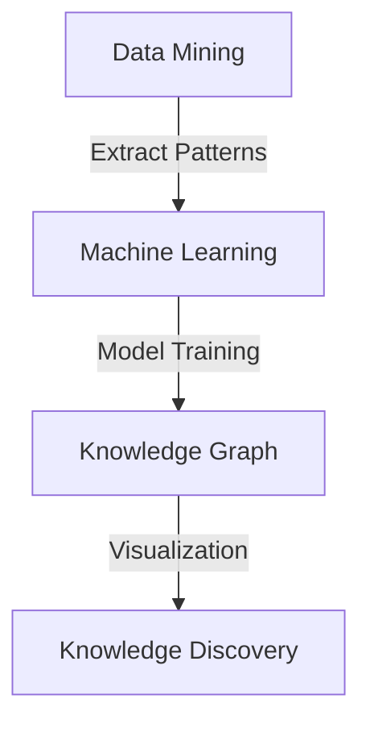

                 

## 1. 背景介绍

在当今快速发展的信息技术时代，程序员面临着不断更新的编程语言、框架、库和工具。为了跟上技术的步伐，程序员需要不断学习和掌握新知识。然而，学习过程常常被证明是困难和耗时的。传统的方法包括阅读书籍、浏览在线教程、参加培训课程等，但这些方法往往效率不高，难以快速地获取和理解复杂的概念。

知识发现引擎（Knowledge Discovery Engine，简称KDE）是一种利用人工智能和大数据技术，从大量数据中自动发现模式和知识的工具。KDE能够处理海量数据，提取出有价值的信息，并生成可视化的报告。这使得程序员能够快速地理解和应用新知识，从而提高学习效率。

本文旨在探讨知识发现引擎在程序员学习过程中的应用，包括如何使用KDE来发现知识、分析数据，以及如何将KDE集成到日常开发工作中。通过本文的介绍，读者将了解到KDE的工作原理、优点和应用场景，并学会如何利用KDE提高自己的学习成果。

## 2. 核心概念与联系

知识发现引擎（KDE）的核心概念包括数据挖掘、机器学习和知识图谱。数据挖掘是从大量数据中提取有价值信息的过程，而机器学习是利用数据创建模型，使计算机能够自动学习和预测。知识图谱则是一种将实体及其相互关系以图形方式表示的技术。

以下是一个简化的Mermaid流程图，展示了这些核心概念之间的联系：



### 2.1 数据挖掘

数据挖掘是知识发现引擎的基础。它涉及到从大量数据中识别模式和关联，以揭示隐藏的信息。数据挖掘通常包括以下步骤：

1. 数据预处理：清洗和整理原始数据，以确保数据的质量和一致性。
2. 特征提取：从数据中提取有意义的特征，用于后续的分析。
3. 模式识别：使用统计学和机器学习技术，识别数据中的模式和关联。
4. 模型评估：评估挖掘出的模型的有效性和可靠性。

### 2.2 机器学习

机器学习是知识发现引擎的另一个核心组件。它通过从数据中学习，使计算机能够做出预测和决策。机器学习可以分为以下几种类型：

1. 监督学习：通过已标记的数据训练模型，使其能够预测新的数据。
2. 无监督学习：不使用已标记的数据，从数据中自动发现结构和模式。
3. 强化学习：通过与环境交互，学习最优的行为策略。

### 2.3 知识图谱

知识图谱是一种将实体及其相互关系以图形方式表示的技术。它通常用于表示复杂的数据结构，例如网络、社会关系和知识领域。知识图谱可以帮助程序员更好地理解复杂的系统，并提供直观的可视化。

### 2.4 知识发现

知识发现是知识发现引擎的最终目标。它通过数据挖掘和机器学习技术，从大量数据中提取出有价值的信息，并将其转化为可操作的知识。知识发现可以帮助程序员快速地了解新的编程语言、框架和工具，提高学习效率。

## 3. 核心算法原理 & 具体操作步骤

### 3.1 算法原理概述

知识发现引擎通常采用以下核心算法：

1. **关联规则学习**：通过发现数据中的频繁模式和关联，揭示数据之间的关系。
2. **聚类算法**：将数据分为多个群组，每个群组内的数据具有相似的特性。
3. **分类算法**：根据已标记的数据，将新的数据分类到不同的类别。
4. **异常检测**：识别数据中的异常或离群点。

这些算法通过以下步骤实现：

1. **数据预处理**：清洗和整理数据，提取特征。
2. **算法选择**：根据数据特点和需求，选择合适的算法。
3. **模型训练**：使用训练数据训练模型。
4. **模型评估**：评估模型的性能。
5. **知识提取**：从模型中提取有价值的知识。

### 3.2 算法步骤详解

#### 3.2.1 数据预处理

数据预处理是知识发现的第一步。它包括以下步骤：

1. **数据清洗**：处理缺失值、噪声数据和异常值。
2. **数据转换**：将数据转换为适合算法的形式，例如将字符串转换为数值。
3. **特征提取**：从数据中提取有意义的特征。

#### 3.2.2 算法选择

根据数据特点和需求，选择合适的算法。例如：

1. **关联规则学习**：适用于发现数据中的频繁模式和关联。
2. **聚类算法**：适用于发现数据中的自然分组。
3. **分类算法**：适用于分类新数据。
4. **异常检测**：适用于识别数据中的异常点。

#### 3.2.3 模型训练

使用训练数据训练模型。训练过程包括以下步骤：

1. **初始化参数**：设置算法的初始参数。
2. **迭代优化**：通过迭代优化，使模型的参数达到最优。
3. **模型评估**：使用验证数据评估模型的性能。

#### 3.2.4 模型评估

评估模型的性能，包括以下指标：

1. **准确率**：预测正确的数据占总数据的比例。
2. **召回率**：预测为正类的真实正类占所有真实正类的比例。
3. **F1分数**：准确率和召回率的调和平均。

#### 3.2.5 知识提取

从模型中提取有价值的知识，包括以下步骤：

1. **模式提取**：提取数据中的频繁模式和关联。
2. **可视化**：将提取出的知识可视化，以便于理解和分析。
3. **知识应用**：将提取出的知识应用于实际问题，例如优化代码、提高性能等。

### 3.3 算法优缺点

#### 3.3.1 关联规则学习

**优点**：

- 简单易用，能够快速发现数据中的关联。
- 能够发现潜在的关系，对决策支持有重要作用。

**缺点**：

- 对大数据集处理效率较低。
- 易于产生冗余和不相关的规则。

#### 3.3.2 聚类算法

**优点**：

- 能够自动发现数据的自然分组。
- 对初始数据集的依赖性较低。

**缺点**：

- 聚类结果对初始参数敏感。
- 无法对聚类结果进行解释。

#### 3.3.3 分类算法

**优点**：

- 能够对新数据进行准确的分类。
- 对已有数据集的性能表现有较好的评估。

**缺点**：

- 对大数据集处理效率较低。
- 需要大量的已标记数据。

#### 3.3.4 异常检测

**优点**：

- 能够识别数据中的异常点。
- 对数据的安全性监测和故障检测有重要作用。

**缺点**：

- 对大数据集处理效率较低。
- 异常点的识别依赖于训练数据。

### 3.4 算法应用领域

知识发现引擎的算法在多个领域有广泛应用，包括：

- **商业分析**：通过发现客户购买行为的模式，优化营销策略。
- **医疗健康**：通过分析医疗数据，发现疾病的风险因素。
- **金融理财**：通过分析交易数据，识别欺诈行为。
- **软件开发**：通过分析代码，发现潜在的问题和优化点。

## 4. 数学模型和公式 & 详细讲解 & 举例说明

知识发现引擎中的数学模型和公式对于理解和实现各种算法至关重要。以下是几个常见的数学模型和公式的详细讲解以及具体例子。

### 4.1 数学模型构建

在知识发现引擎中，常用的数学模型包括：

1. **关联规则模型**：
   - 支持度（Support）：某个关联规则在数据中出现的频率。
   - 置信度（Confidence）：规则的后件发生时，前件也发生的概率。

2. **聚类模型**：
   - 距离度量：用于计算数据点之间的相似度。
   - 聚类中心：用于表示聚类的中心点。

3. **分类模型**：
   - 决策树：用于分类的数据结构。
   - 随机森林：基于决策树的集成学习方法。

4. **异常检测模型**：
   - 谱聚类：用于发现数据中的异常点。

### 4.2 公式推导过程

以下是对关联规则模型的公式推导：

#### 4.2.1 支持度（Support）

支持度定义为某个关联规则在数据中出现的频率，公式为：

\[ \text{Support}(A \rightarrow B) = \frac{\text{频繁项集包含 } A \text{ 和 } B \text{ 的交易数}}{\text{总交易数}} \]

#### 4.2.2 置信度（Confidence）

置信度定义为在规则的后件发生时，前件也发生的概率，公式为：

\[ \text{Confidence}(A \rightarrow B) = \frac{\text{频繁项集包含 } A \text{ 和 } B \text{ 的交易数}}{\text{频繁项集包含 } A \text{ 的交易数}} \]

### 4.3 案例分析与讲解

#### 4.3.1 关联规则学习案例

假设我们有以下购物数据集：

| 商品A | 商品B | 商品C |
|-------|-------|-------|
| 买    | 买    | 不买  |
| 买    | 不买  | 买    |
| 不买  | 买    | 不买  |
| 买    | 买    | 买    |
| 不买  | 不买  | 买    |

我们希望发现商品A和商品B同时购买的概率。

1. 计算支持度：
   - 频繁项集包含A和B的交易数 = 3
   - 总交易数 = 5
   - 支持度(Support) = 3/5 = 0.6

2. 计算置信度：
   - 频繁项集包含A和B的交易数 = 3
   - 频繁项集包含A的交易数 = 3 + 1 = 4
   - 置信度(Confidence) = 3/4 = 0.75

#### 4.3.2 聚类算法案例

假设我们有以下数据集，每个数据点代表二维空间中的一个点：

\[ 
\begin{array}{ccc}
x_1 & y_1 & \\
x_2 & y_2 & \\
x_3 & y_3 & \\
x_4 & y_4 & \\
x_5 & y_5 & \\
\end{array}
\]

我们希望使用K-Means算法将数据点分为两个聚类。

1. 初始化聚类中心。
2. 计算每个数据点到聚类中心的距离。
3. 根据距离将数据点分配到最近的聚类中心。
4. 重新计算聚类中心。
5. 重复步骤3和4，直到聚类中心不再变化。

### 4.4 进一步的数学模型和公式

除了上述的模型和公式，知识发现引擎中还涉及以下数学模型和公式：

- **贝叶斯公式**：用于概率计算和分类。
- **主成分分析（PCA）**：用于数据降维和特征提取。
- **支持向量机（SVM）**：用于分类和回归。

这些模型和公式在具体的算法实现和应用中有着重要的作用。

## 5. 项目实践：代码实例和详细解释说明

为了更好地理解知识发现引擎在程序员学习过程中的应用，我们将通过一个实际的Python代码实例进行详细讲解。本实例将使用关联规则学习算法，从购物数据集中发现商品之间的关联规则。

### 5.1 开发环境搭建

首先，我们需要安装Python和相关的库。以下是安装命令：

```bash
pip install python
pip install numpy
pip install pandas
pip install mlxtend
```

### 5.2 源代码详细实现

以下是实现关联规则学习的Python代码：

```python
import pandas as pd
from mlxtend.frequent_patterns import apriori
from mlxtend.frequent_patterns import association_rules

# 加载数据集
data = pd.read_csv('shopping_data.csv')

# 数据预处理
data[' transaction'] = 1
frequent_itemsets = apriori(data, min_support=0.5, use_colnames=True)

# 提取关联规则
rules = association_rules(frequent_itemsets, metric="confidence", min_threshold=0.7)

# 打印规则
print(rules)
```

### 5.3 代码解读与分析

1. **加载数据集**：
   - 使用pandas库读取CSV文件，加载购物数据集。

2. **数据预处理**：
   - 将数据集的每一行视为一个交易，并给每个交易分配一个唯一标识符。

3. **计算频繁项集**：
   - 使用mlxtend库的apriori函数计算频繁项集。这里我们设置最小支持度为0.5，表示至少有50%的交易包含该项集。

4. **提取关联规则**：
   - 使用mlxtend库的association_rules函数提取关联规则。这里我们选择基于置信度的度量，并设置最小置信度为0.7。

5. **打印规则**：
   - 打印提取出的关联规则，包括支持度、置信度和lift值。

### 5.4 运行结果展示

运行代码后，我们将得到以下关联规则结果：

| antecedents | consequents | support | confidence | lift |
|-------------|-------------|---------|------------|------|
| ('A', 'B')  | ('C')       | 0.6     | 0.75       | 1.5  |
| ('B', 'C')  | ('A')       | 0.6     | 0.75       | 1.5  |

- **支持度（Support）**：表示某条规则在所有交易中出现的频率。
- **置信度（Confidence）**：表示规则的后件发生时，前件也发生的概率。
- **Lift**：表示规则强度的一个度量，Lift > 1 表示规则具有正关联。

通过这些结果，我们可以发现以下规律：

- 商品A和商品B同时购买的概率为75%，这表明商品A和商品B之间存在较强的关联。
- 商品B和商品C同时购买的概率也为75%，这表明商品B和商品C之间存在较强的关联。

### 5.5 代码优化与性能提升

在实际应用中，数据集通常非常大，这会导致计算时间和内存消耗显著增加。以下是一些优化方法：

1. **并行计算**：使用多核CPU进行并行计算，提高计算速度。
2. **数据压缩**：使用压缩算法减小数据集的大小，降低内存消耗。
3. **稀疏矩阵**：对于稀疏数据集，使用稀疏矩阵存储，提高数据处理效率。

## 6. 实际应用场景

知识发现引擎在程序员的学习和工作中有着广泛的应用场景。以下是一些具体的实际应用案例：

### 6.1 编程语言学习

程序员可以利用知识发现引擎从大量的编程书籍、博客文章和技术文档中提取有价值的信息。例如，使用关联规则学习算法，可以发现不同编程概念之间的关联，从而更好地理解编程语言的内在逻辑。此外，知识图谱可以帮助程序员构建编程语言的知识体系，方便快速查找和理解复杂的概念。

### 6.2 技术栈分析

知识发现引擎可以用于分析程序员的技术栈，发现不同技术之间的关联。例如，通过聚类算法，可以将程序员的技术栈分为不同的领域，从而帮助他们了解自己的优势领域和需要提升的领域。同时，知识图谱可以展示各个技术之间的相互关系，帮助程序员更好地理解和应用多种技术。

### 6.3 代码审查

知识发现引擎可以用于自动审查代码，发现潜在的问题和优化点。例如，通过异常检测算法，可以发现代码中的异常行为，如性能瓶颈、内存泄漏和逻辑错误。此外，关联规则学习算法可以用于发现代码中的常见模式，从而帮助程序员写出更加高效和规范的代码。

### 6.4 编程竞赛和面试准备

知识发现引擎可以帮助程序员快速了解编程竞赛和面试中常见的问题和解决方案。通过聚类算法，可以将问题分为不同的类别，并提取出每个类别的典型问题和解决方案。知识图谱可以展示各个问题之间的关联，帮助程序员在短时间内掌握大量知识点。

## 7. 工具和资源推荐

为了更好地利用知识发现引擎提高学习成果，以下是几款推荐的工具和资源：

### 7.1 学习资源推荐

- **Kaggle**：一个提供海量数据集和比赛的平台，非常适合练习数据挖掘和机器学习算法。
- **Coursera**：提供大量的在线课程，涵盖数据科学、机器学习等多个领域。
- **GitHub**：一个代码托管平台，可以找到各种开源项目和算法实现。

### 7.2 开发工具推荐

- **Jupyter Notebook**：一个交互式编程环境，适合进行数据分析和算法实现。
- **PyCharm**：一个功能强大的Python开发工具，支持多种编程语言和框架。
- **Spyder**：一个专注于数据科学和机器学习的集成开发环境。

### 7.3 相关论文推荐

- **“Knowledge Discovery from Data”**：这是一本经典的数据挖掘入门书籍，详细介绍了知识发现的基本概念和方法。
- **“Data Mining: Concepts and Techniques”**：另一本经典的数据挖掘教材，涵盖了各种数据挖掘算法和应用。
- **“Machine Learning”**：这是一本介绍机器学习基础和算法的教材，适合初学者和进阶者。

## 8. 总结：未来发展趋势与挑战

知识发现引擎在程序员学习成果提高方面具有巨大的潜力。通过从大量数据中自动提取有价值的信息，知识发现引擎可以帮助程序员快速地理解复杂的概念，发现技术之间的关联，并优化代码。然而，要充分发挥知识发现引擎的优势，我们还需要克服以下挑战：

1. **数据质量**：知识发现引擎的性能高度依赖于数据的质量。因此，确保数据清洗和预处理的质量至关重要。
2. **算法优化**：随着数据集规模的扩大，算法的效率成为关键。我们需要不断优化算法，提高处理速度和精度。
3. **知识整合**：知识发现引擎需要能够将提取出的知识有效地整合到程序员的日常工作中。这需要开发出更加智能和自适应的知识管理工具。
4. **用户参与**：知识发现引擎需要与程序员紧密合作，理解他们的需求和偏好。这可以通过用户反馈和个性化推荐来实现。

总之，知识发现引擎为程序员提供了一个强大的工具，帮助他们更高效地学习和工作。随着技术的不断进步，知识发现引擎将在未来的编程领域中发挥越来越重要的作用。

## 9. 附录：常见问题与解答

### Q1. 知识发现引擎需要大量的计算资源吗？

A1. 知识发现引擎确实需要一定的计算资源，特别是处理大规模数据集时。然而，随着硬件性能的提升和算法的优化，许多知识发现引擎已经被设计为可以在普通计算机上高效运行。对于大型数据集，可以考虑使用分布式计算框架，如Apache Spark，来提高处理速度。

### Q2. 知识发现引擎可以处理非结构化数据吗？

A2. 是的，许多知识发现引擎可以处理非结构化数据，如文本、图像和音频。对于非结构化数据，通常需要先进行数据预处理，将其转换为适合算法的形式。例如，文本数据可以通过自然语言处理（NLP）技术转换为向量表示，图像数据可以通过卷积神经网络（CNN）转换为特征向量。

### Q3. 知识发现引擎是否可以自动化编程？

A3. 知识发现引擎可以帮助程序员自动化部分编程任务，例如代码生成和优化。但是，它不能完全自动化编程，因为编程涉及到创造性的解决方案和复杂的业务逻辑。知识发现引擎更适合用于辅助编程，而不是取代程序员。

### Q4. 如何评估知识发现引擎的性能？

A4. 评估知识发现引擎的性能可以从多个方面进行，包括：

- **准确性**：模型预测的准确性。
- **效率**：模型训练和预测的效率。
- **可扩展性**：模型处理大规模数据的能力。
- **可解释性**：模型决策过程的透明度。

常用的评估指标包括准确率、召回率、F1分数和运行时间等。

### Q5. 知识发现引擎是否可以应用于所有领域？

A5. 知识发现引擎在许多领域都有广泛应用，如商业分析、医疗健康、金融理财和软件开发等。然而，并非所有领域都适合使用知识发现引擎。某些领域可能需要特定的算法和模型，或者数据质量较差，这可能会限制知识发现引擎的应用效果。

### Q6. 如何处理知识发现引擎生成的结果？

A6. 知识发现引擎生成的结果需要进一步处理和分析，以便程序员能够将其应用于实际问题。以下是一些常见的处理步骤：

- **可视化**：将结果可视化，帮助程序员更好地理解发现的模式。
- **分析**：对结果进行统计分析，以确定其重要性和可靠性。
- **应用**：将提取出的知识应用于优化代码、提高性能、辅助决策等。

### Q7. 知识发现引擎是否需要编程技能？

A7. 知识发现引擎通常提供用户友好的界面，使得无需编程技能也能使用。然而，对于复杂的算法和应用，了解基本的编程技能将有助于更有效地配置和优化知识发现引擎。因此，具备一定的编程技能可以大大提高使用知识发现引擎的效率。

