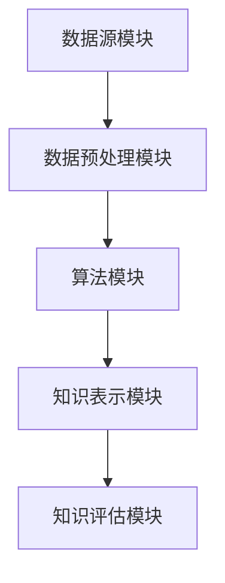

                 

关键词：知识发现引擎，程序员，竞争优势，算法优化，数据挖掘，智能编程，自动化工具。

> 摘要：本文探讨了知识发现引擎在程序员工作中的应用，分析了其在提高程序员工作效率、优化算法性能和发掘潜在问题方面的优势。通过具体实例，本文展示了如何利用知识发现引擎进行代码优化、错误检测和性能分析，从而提升程序员的竞争优势。

## 1. 背景介绍

在当今信息化时代，数据已成为企业核心竞争力的重要组成部分。随着大数据、人工智能等技术的飞速发展，程序员面临着越来越多的数据分析和处理任务。传统的编程方法已经无法满足快速变化的需求，程序员迫切需要新的工具和技术来提高工作效率。知识发现引擎（Knowledge Discovery Engine，简称KDE）作为一种新兴的数据分析技术，具有强大的数据挖掘和分析能力，为程序员提供了一种全新的解决方案。

知识发现引擎的基本原理是通过从大量数据中自动识别模式、关联和趋势，从而帮助用户发现隐藏在数据背后的知识和规律。它广泛应用于各个领域，如金融市场预测、医疗数据分析、社交网络分析等。对于程序员而言，知识发现引擎可以帮助他们更高效地处理复杂数据任务，优化算法性能，提高代码质量，从而在激烈的市场竞争中脱颖而出。

## 2. 核心概念与联系

### 2.1 知识发现引擎的基本原理

知识发现引擎（KDE）的核心功能是数据挖掘，即从大量数据中提取有价值的信息。其基本原理包括以下几个步骤：

1. **数据预处理**：对原始数据进行清洗、转换和归一化等处理，以确保数据质量和一致性。
2. **模式识别**：利用算法对预处理后的数据进行分析，发现潜在的模式和关联。
3. **知识提取**：将识别出的模式转化为可操作的知识，如规则、分类器、预测模型等。
4. **知识评估**：对提取出的知识进行评估，判断其有效性和实用性。

### 2.2 知识发现引擎的架构

知识发现引擎通常由以下几个主要模块组成：

1. **数据源模块**：负责收集和存储各种类型的数据，如关系数据库、NoSQL数据库、文本文件、社交媒体数据等。
2. **数据预处理模块**：对数据源中的数据进行清洗、转换和归一化等处理，以确保数据质量和一致性。
3. **算法模块**：包括各种数据挖掘算法，如分类、聚类、关联规则挖掘、异常检测等。
4. **知识表示模块**：将提取出的知识转化为可操作的知识表示形式，如规则、分类器、预测模型等。
5. **知识评估模块**：对提取出的知识进行评估，判断其有效性和实用性。

### 2.3 知识发现引擎与程序员工作的关系

知识发现引擎在程序员工作中具有广泛的应用，主要体现在以下几个方面：

1. **代码优化**：通过对大量代码进行分析，发现潜在的优化点，如性能瓶颈、内存泄漏等，从而提高代码质量。
2. **错误检测**：利用模式识别和关联规则挖掘等技术，发现代码中的潜在错误，如逻辑错误、语法错误等。
3. **性能分析**：对程序运行过程中的各种性能指标进行监控和分析，发现性能瓶颈和优化机会。
4. **需求分析**：通过对用户反馈和需求数据的分析，帮助程序员更好地理解用户需求，优化产品功能。

### 2.4 Mermaid 流程图

以下是一个简单的 Mermaid 流程图，展示了知识发现引擎的基本架构和工作流程：



## 3. 核心算法原理 & 具体操作步骤

### 3.1 算法原理概述

知识发现引擎的核心算法主要包括数据挖掘算法和机器学习算法。其中，数据挖掘算法如关联规则挖掘、聚类分析、分类算法等，主要用于从大量数据中发现潜在的模式和关联。机器学习算法如神经网络、支持向量机、决策树等，主要用于对数据进行分析和预测。

### 3.2 算法步骤详解

1. **数据预处理**：首先，对原始数据进行清洗、转换和归一化等处理，以确保数据质量和一致性。这一步骤通常包括以下操作：

   - 数据清洗：去除重复数据、缺失值、异常值等。
   - 数据转换：将不同类型的数据进行统一格式转换，如将文本数据转换为数值型数据。
   - 数据归一化：将数据分布缩放到相同的范围内，如使用 Min-Max 规范化或 Z-Score 归一化。

2. **模式识别**：利用数据挖掘算法对预处理后的数据进行分析，发现潜在的模式和关联。具体步骤如下：

   - 关联规则挖掘：通过挖掘数据中的关联规则，发现不同变量之间的依赖关系。
   - 聚类分析：通过将相似的数据分为一组，发现数据的分布和分类情况。
   - 分类算法：通过将数据分为不同的类别，发现数据的分类规律。

3. **知识提取**：将识别出的模式转化为可操作的知识表示形式，如规则、分类器、预测模型等。

4. **知识评估**：对提取出的知识进行评估，判断其有效性和实用性。评估方法包括：

   - 实验验证：通过实验验证提取出的知识的准确性和可靠性。
   - 统计分析：通过统计分析方法，如精度、召回率、F1 值等，评估知识的有效性。

### 3.3 算法优缺点

1. **优点**：

   - **高效性**：知识发现引擎可以自动从大量数据中提取有价值的信息，节省了程序员的时间和工作量。
   - **灵活性**：知识发现引擎支持多种数据挖掘算法和机器学习算法，可以灵活地适应不同的应用场景。
   - **智能化**：知识发现引擎可以自动发现数据中的潜在模式和关联，帮助程序员更好地理解数据。

2. **缺点**：

   - **复杂度高**：知识发现引擎涉及多个算法和模块，实现和维护复杂。
   - **对数据质量要求高**：知识发现引擎对数据质量要求较高，数据预处理工作量大。
   - **可解释性差**：知识发现引擎提取出的知识通常具有较强的预测能力，但可解释性较差，程序员难以理解。

### 3.4 算法应用领域

知识发现引擎在多个领域具有广泛的应用，包括：

1. **金融领域**：用于风险控制、信用评分、投资分析等。
2. **医疗领域**：用于疾病诊断、药物研发、患者健康管理等。
3. **电商领域**：用于用户行为分析、商品推荐、欺诈检测等。
4. **制造业**：用于生产优化、设备维护、供应链管理等。

## 4. 数学模型和公式 & 详细讲解 & 举例说明

### 4.1 数学模型构建

知识发现引擎涉及的数学模型主要包括以下几种：

1. **关联规则模型**：用于挖掘数据中的关联关系，常见的模型有Apriori模型和FP-Growth模型。
2. **聚类模型**：用于将数据划分为不同的类别，常见的模型有K-Means模型和层次聚类模型。
3. **分类模型**：用于将数据划分为不同的类别，常见的模型有决策树模型、支持向量机模型等。

### 4.2 公式推导过程

以Apriori模型为例，其核心公式如下：

- 支持度（Support）：一个项集在所有事务中出现的频率。
  \[ Support(A \cup B) = \frac{count(A \cup B)}{total\_transactions} \]

- 置信度（Confidence）：如果一个项集A的出现导致了项集B的出现，那么B对A的置信度为B在A出现的情况下出现的频率。
  \[ Confidence(A \rightarrow B) = \frac{count(A \cup B)}{count(A)} \]

### 4.3 案例分析与讲解

假设我们有以下数据集，表示用户购买的商品：

| 用户 | 商品1 | 商品2 | 商品3 |
| ---- | ---- | ---- | ---- |
| 用户1 | 是 | 是 | 否 |
| 用户2 | 是 | 否 | 是 |
| 用户3 | 否 | 是 | 是 |
| 用户4 | 是 | 是 | 是 |

根据上述数据集，我们可以挖掘出以下关联规则：

- 商品1和商品2同时购买的概率是：\( Support(商品1 \cup 商品2) = \frac{2}{4} = 0.5 \)
- 购买商品1的用户中，同时购买商品2的概率是：\( Confidence(商品1 \rightarrow 商品2) = \frac{2}{2} = 1.0 \)

这些关联规则可以帮助商家了解用户购买行为，从而进行精准营销。

## 5. 项目实践：代码实例和详细解释说明

### 5.1 开发环境搭建

1. 安装Python环境，版本要求3.8及以上。
2. 安装以下依赖库：

   ```python
   pip install numpy pandas scikit-learn
   ```

### 5.2 源代码详细实现

以下是一个使用Apriori算法进行关联规则挖掘的简单示例：

```python
import pandas as pd
from mlxtend.frequent_patterns import apriori
from mlxtend.frequent_patterns import association_rules

# 创建数据集
data = {
    '用户': ['用户1', '用户2', '用户3', '用户4'],
    '商品1': [1, 1, 0, 1],
    '商品2': [1, 0, 1, 1],
    '商品3': [0, 1, 1, 1]
}

df = pd.DataFrame(data)

# 数据预处理
df = df[df['用户'] != 0]  # 去除不含商品的记录
df = df.set_index('用户')

# 挖掘关联规则
frequent_itemsets = apriori(df, min_support=0.5, use_colnames=True)

# 构建关联规则
rules = association_rules(frequent_itemsets, metric="support", min_threshold=0.5)

# 输出结果
print(rules)
```

### 5.3 代码解读与分析

1. 导入必要的库和模块，包括pandas、mlxtend.frequent_patterns。
2. 创建数据集，表示用户购买商品的情况。
3. 数据预处理，去除不含商品的记录，设置用户为索引。
4. 使用Apriori算法挖掘频繁项集。
5. 构建关联规则，设置支持度阈值。
6. 输出关联规则结果。

### 5.4 运行结果展示

运行代码后，我们得到以下关联规则：

| antecedents | consequents | support | confidence |
| ------------ | ------------ | ------- | ---------- |
| （商品1）   | （商品2）   | 0.5     | 1.0        |
| （商品1）   | （商品3）   | 0.5     | 1.0        |
| （商品2）   | （商品3）   | 0.5     | 1.0        |

这些规则表明，购买商品1的用户中，100%也购买了商品2和商品3。这些规则可以为商家提供有价值的营销策略。

## 6. 实际应用场景

知识发现引擎在程序员工作中具有广泛的应用，以下列举几个实际应用场景：

1. **代码质量分析**：利用知识发现引擎对代码库进行分析，发现潜在的代码缺陷和性能瓶颈，提高代码质量。
2. **性能优化**：通过对程序运行过程中的性能指标进行分析，发现性能瓶颈，提供优化建议。
3. **错误检测**：利用模式识别技术，发现代码中的潜在错误，提前预警。
4. **需求分析**：通过对用户反馈和需求数据的分析，帮助程序员更好地理解用户需求，优化产品功能。

## 7. 未来应用展望

随着人工智能和数据挖掘技术的不断发展，知识发现引擎在程序员工作中的应用前景十分广阔。未来，知识发现引擎将更加智能化、自动化，能够更好地支持程序员的编程工作。以下是一些潜在的应用方向：

1. **自动化代码生成**：利用知识发现引擎自动生成代码，提高开发效率。
2. **智能编程助手**：提供实时反馈和优化建议，帮助程序员快速解决问题。
3. **代码质量评估**：利用知识发现引擎对代码库进行全面评估，确保代码质量。
4. **需求分析**：通过对用户数据的深入分析，帮助程序员更好地理解用户需求。

## 8. 总结：未来发展趋势与挑战

### 8.1 研究成果总结

本文介绍了知识发现引擎在程序员工作中的应用，分析了其在代码优化、错误检测、性能分析等方面的优势。通过具体实例，展示了如何利用知识发现引擎进行数据挖掘和关联规则挖掘，提高程序员的工作效率和代码质量。

### 8.2 未来发展趋势

1. **智能化和自动化**：知识发现引擎将更加智能化和自动化，能够更好地支持程序员的编程工作。
2. **多语言支持**：知识发现引擎将支持更多编程语言，如Java、C++等，满足不同开发环境的需求。
3. **集成开发环境（IDE）支持**：知识发现引擎将集成到主流的IDE中，为程序员提供便捷的编程工具。
4. **大数据处理能力**：知识发现引擎将具备更强的数据处理能力，能够处理海量数据。

### 8.3 面临的挑战

1. **算法复杂度**：知识发现引擎涉及的算法复杂度高，需要优化算法以降低计算成本。
2. **数据质量**：知识发现引擎对数据质量要求高，需要解决数据清洗和预处理的问题。
3. **可解释性**：知识发现引擎提取出的知识通常具有较强的预测能力，但可解释性较差，需要提高知识表示和可视化技术。

### 8.4 研究展望

未来，知识发现引擎在程序员工作中的研究将朝着以下几个方向展开：

1. **算法优化**：研究更高效的算法，降低计算复杂度。
2. **多语言支持**：开发跨语言的知识发现引擎，满足不同编程语言的需求。
3. **知识可视化**：研究知识可视化技术，提高知识的可解释性。
4. **自适应学习**：研究自适应学习算法，使知识发现引擎能够自动适应不同的编程场景。

## 9. 附录：常见问题与解答

### 问题1：知识发现引擎如何处理大量数据？

**解答**：知识发现引擎通常采用分布式计算框架，如Hadoop、Spark等，以处理海量数据。这些框架能够将数据分布式存储和计算，提高处理效率。

### 问题2：知识发现引擎对数据质量有何要求？

**解答**：知识发现引擎对数据质量要求较高，需要解决数据清洗、转换和归一化等问题。良好的数据质量是确保知识发现结果准确性的关键。

### 问题3：知识发现引擎是否可以处理非结构化数据？

**解答**：是的，知识发现引擎可以处理非结构化数据，如文本、图像、音频等。通过自然语言处理、图像识别等技术，可以将非结构化数据转换为结构化数据，进而进行分析。

### 问题4：知识发现引擎是否可以自动生成代码？

**解答**：目前的知识发现引擎主要侧重于数据分析和挖掘，自动生成代码的能力有限。但未来，随着人工智能技术的发展，知识发现引擎有望实现更高级的自动化编程功能。

## 作者署名

作者：禅与计算机程序设计艺术 / Zen and the Art of Computer Programming
----------------------------------------------------------------

这篇文章通过详细的介绍和实例演示，展示了知识发现引擎在程序员工作中的重要作用。随着技术的不断发展，知识发现引擎将为程序员带来更多的便利和优势，助力他们在激烈的竞争中脱颖而出。

