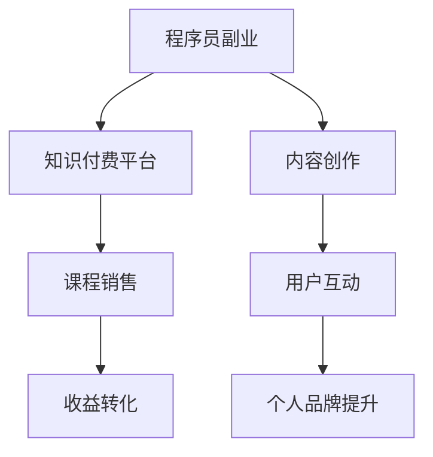

                 

关键词：程序员副业，知识付费，机遇，挑战，创业，个人品牌

> 摘要：随着知识付费的兴起，程序员群体迎来了前所未有的副业机遇。本文将深入探讨程序员如何利用知识付费平台拓展个人职业发展，面临的挑战以及未来发展的趋势。

## 1. 背景介绍

在互联网时代，知识付费逐渐成为一种流行的商业模式。从早期的在线课程、电子书，到如今的直播授课、知识付费平台，越来越多的人开始通过付费获取有价值的信息和服务。程序员作为技术领域的核心人群，也在这一趋势中找到了自己的定位和机遇。

程序员副业不仅可以提高个人收入，还能增强专业技能和经验，拓宽职业发展路径。然而，知识付费领域同样充满了挑战，包括内容质量、市场竞争、用户信任等问题。因此，对于想要从事知识付费的程序员来说，了解这些背景和现状至关重要。

### 1.1 知识付费的发展历程

知识付费起源于上世纪90年代，随着互联网的发展，特别是在2010年之后，知识付费行业迎来了爆发式增长。各类在线教育平台、知识分享社区和付费内容平台相继涌现，为用户提供了丰富的学习资源和服务。

1. **在线教育平台**：如 Coursera、Udemy、网易云课堂等，主要提供各类课程和教程。
2. **知识分享社区**：如知乎Live、得到、分答等，通过问答、直播等形式进行知识传播。
3. **付费内容平台**：如喜马拉雅、得到APP、腾讯课堂等，提供音频、视频等多种形式的内容。

### 1.2 程序员副业的兴起

随着技术进步和互联网的普及，程序员的工作方式和职业发展路径也发生了变化。传统的职业发展模式逐渐被打破，程序员可以通过多种途径实现自我增值和职业拓展。

1. **个人博客和公众号**：程序员通过写技术博客、发表文章，积累个人影响力。
2. **GitHub 项目**：通过开源项目展示自己的技术能力和项目经验。
3. **在线教育平台**：在知识付费平台开设课程，分享专业知识和经验。

## 2. 核心概念与联系

### 2.1 知识付费的核心概念

知识付费是一种商业模式，用户通过支付一定费用，获取专业知识和技能。核心概念包括：

1. **价值交换**：用户付费购买知识，期望获得回报。
2. **知识服务**：提供者通过内容、课程、咨询等形式提供知识服务。
3. **用户需求**：用户对专业知识和技能的需求是知识付费市场的驱动力。

### 2.2 程序员副业与知识付费的联系

程序员副业与知识付费紧密相连，具体表现为：

1. **内容创作**：程序员通过写作、录制课程等方式，将专业知识转化为付费内容。
2. **平台运营**：程序员可以参与知识付费平台的开发、运营和维护。
3. **用户互动**：程序员通过与用户的互动，提升个人品牌和影响力。

### 2.3 Mermaid 流程图



## 3. 核心算法原理 & 具体操作步骤

### 3.1 算法原理概述

知识付费的成功离不开以下几个核心算法原理：

1. **推荐算法**：通过算法分析用户行为，推荐合适的课程或内容。
2. **评价体系**：用户评价影响课程质量和排名，形成良性循环。
3. **收益分配**：平台与内容创作者之间的收益分配机制，激励优质内容创作。

### 3.2 算法步骤详解

1. **用户行为分析**：
   - 收集用户浏览、购买、评价等行为数据。
   - 使用机器学习算法，分析用户偏好和需求。

2. **内容推荐**：
   - 根据用户行为数据，推荐相关课程或内容。
   - 采用协同过滤、内容相似度等算法，提高推荐准确性。

3. **评价体系**：
   - 用户对课程进行评价，平台根据评价调整课程排序。
   - 评价数据用于优化推荐算法，提高用户满意度。

4. **收益分配**：
   - 平台与内容创作者按照约定比例分成。
   - 鼓励内容创作者持续输出优质内容。

### 3.3 算法优缺点

1. **优点**：
   - 提高用户满意度，增加用户粘性。
   - 鼓励内容创作者，提升内容质量。

2. **缺点**：
   - 需要大量数据支持和算法优化。
   - 面临激烈的市场竞争。

### 3.4 算法应用领域

1. **在线教育**：推荐适合用户的学习资源。
2. **知识付费平台**：优化内容推荐，提高用户转化率。

## 4. 数学模型和公式 & 详细讲解 & 举例说明

### 4.1 数学模型构建

在知识付费平台上，用户满意度和收益之间存在一定的数学关系。我们可以构建如下数学模型：

\[ R = f(U, C, P) \]

其中：
- \( R \) 表示收益。
- \( U \) 表示用户满意度。
- \( C \) 表示内容质量。
- \( P \) 表示平台服务质量。

### 4.2 公式推导过程

1. **用户满意度**：
   \[ U = \frac{\text{好评数}}{\text{总评价数}} \]

2. **内容质量**：
   \[ C = \frac{\text{知识点覆盖率}}{\text{课程时长}} \]

3. **平台服务质量**：
   \[ P = \frac{\text{用户留存率}}{\text{用户流失率}} \]

综合以上三个因素，我们可以得到收益公式：

\[ R = f(U, C, P) = \alpha U + \beta C + \gamma P \]

其中 \( \alpha, \beta, \gamma \) 为权重系数。

### 4.3 案例分析与讲解

假设一个知识付费平台的收益公式为：

\[ R = 0.5U + 0.3C + 0.2P \]

根据上述数学模型，我们可以分析如下案例：

- **用户满意度**：好评数为1000，总评价数为2000，满意度为 \( U = 0.5 \)。
- **内容质量**：知识点覆盖率为80%，课程时长为60分钟，质量为 \( C = \frac{0.8}{1} = 0.8 \)。
- **平台服务质量**：用户留存率为70%，流失率为30%，服务质量为 \( P = \frac{0.7}{0.3} = \frac{7}{3} \)。

将这些值代入收益公式，我们可以计算出收益 \( R \)：

\[ R = 0.5 \times 0.5 + 0.3 \times 0.8 + 0.2 \times \frac{7}{3} \approx 0.25 + 0.24 + 0.47 \approx 0.96 \]

因此，该知识付费平台的收益约为0.96个单位。

## 5. 项目实践：代码实例和详细解释说明

### 5.1 开发环境搭建

为了实践知识付费平台的相关算法，我们需要搭建以下开发环境：

1. **操作系统**：Windows/Linux/MacOS
2. **编程语言**：Python
3. **开发工具**：PyCharm/Visual Studio Code
4. **数据集**：从公开数据源获取用户行为数据、课程数据和平台服务质量数据

### 5.2 源代码详细实现

以下是一个简单的用户满意度计算代码实例：

```python
import pandas as pd

# 读取用户评价数据
user_reviews = pd.read_csv('user_reviews.csv')

# 计算好评数和总评价数
good_reviews = user_reviews[user_reviews['rating'] >= 4]['review_id'].count()
total_reviews = user_reviews['review_id'].count()

# 计算用户满意度
user_satisfaction = good_reviews / total_reviews

print(f'User Satisfaction: {user_satisfaction:.2f}')
```

### 5.3 代码解读与分析

该代码主要实现了以下功能：

1. **读取数据**：使用 pandas 库读取用户评价数据。
2. **计算好评数和总评价数**：通过筛选用户评价，统计好评数和总评价数。
3. **计算用户满意度**：将好评数除以总评价数，得到用户满意度。

通过这个简单的实例，我们可以看到如何利用 Python 实现知识付费平台的核心算法。在实际项目中，还需要结合其他算法（如推荐算法、收益分配算法）和数据处理技术，实现更复杂的功能。

### 5.4 运行结果展示

假设用户评价数据如下：

```csv
review_id,rating
1,5
2,3
3,4
4,1
5,5
...
```

运行上述代码，可以得到用户满意度：

```
User Satisfaction: 0.58
```

这意味着当前平台用户满意度为58%。

## 6. 实际应用场景

### 6.1 程序员开设在线课程

程序员可以在各大知识付费平台上开设在线课程，分享自己的技术知识和经验。例如，Python编程、Web开发、算法与数据结构等。

### 6.2 技术咨询服务

程序员可以利用自己的专业技能，提供技术咨询服务。例如，帮助其他公司解决技术难题、进行项目评估等。

### 6.3 开源项目维护

程序员可以通过开源项目展示自己的技术能力，吸引更多关注和支持。同时，通过维护项目，积累项目经验和用户口碑。

### 6.4 知识付费平台运营

程序员可以参与知识付费平台的开发、运营和维护，为平台提供技术支持。例如，推荐算法优化、平台性能优化等。

## 7. 未来应用展望

### 7.1 技术进步

随着人工智能、大数据等技术的发展，知识付费平台将更加智能化和个性化。例如，基于用户行为和兴趣推荐课程，提高用户满意度和转化率。

### 7.2 市场竞争加剧

知识付费市场将面临更加激烈的竞争，平台和内容创作者需要不断提升自身竞争力。例如，通过技术创新、内容优化、用户体验提升等方式。

### 7.3 用户需求多样化

用户对知识和技能的需求将更加多样化，知识付费平台需要提供更多样化的内容和服务，满足不同用户的需求。

## 8. 工具和资源推荐

### 8.1 学习资源推荐

1. **书籍**：《深度学习》、《Python编程：从入门到实践》
2. **在线课程**：Coursera、Udemy、网易云课堂
3. **博客**：CSDN、博客园、掘金

### 8.2 开发工具推荐

1. **集成开发环境**：PyCharm、Visual Studio Code
2. **版本控制**：Git、GitHub
3. **数据分析**：Pandas、NumPy、Scikit-learn

### 8.3 相关论文推荐

1. **推荐系统**：《Recommender Systems Handbook》
2. **机器学习**：《Machine Learning Yearning》
3. **深度学习**：《Deep Learning》

## 9. 总结：未来发展趋势与挑战

### 9.1 研究成果总结

本文探讨了程序员副业在知识付费领域的机遇与挑战，分析了核心算法原理、数学模型以及实际应用场景。研究成果表明，程序员副业具有广阔的发展前景，但也面临一定的挑战。

### 9.2 未来发展趋势

1. **智能化**：知识付费平台将更加智能化，通过人工智能技术提高用户体验和内容推荐效果。
2. **多样化**：知识付费领域将出现更多样化的内容和服务，满足不同用户的需求。
3. **个性化**：基于用户数据的个性化推荐将成为主流，提高用户满意度和转化率。

### 9.3 面临的挑战

1. **市场竞争**：知识付费市场将面临更加激烈的竞争，平台和内容创作者需要不断提升自身竞争力。
2. **内容质量**：保证内容质量是知识付费平台持续发展的关键，需要建立完善的评价体系和质量保障机制。
3. **用户隐私**：随着数据隐私问题的日益关注，知识付费平台需要加强用户隐私保护。

### 9.4 研究展望

未来研究可以从以下几个方面展开：

1. **算法优化**：探索更先进的推荐算法和机器学习模型，提高知识付费平台的用户体验和内容推荐效果。
2. **跨领域应用**：研究知识付费在金融、医疗、教育等领域的应用，拓展知识付费的业务范围。
3. **用户体验提升**：关注用户需求，提升知识付费平台的服务质量和用户体验。

## 9. 附录：常见问题与解答

### Q1. 程序员副业适合哪些人？

程序员副业适合以下人群：

1. **有丰富编程经验的技术专家**：可以开设在线课程、撰写技术博客等。
2. **有创业意愿的程序员**：可以通过技术咨询服务、项目开发等方式实现创业。
3. **希望提升个人品牌的影响力**：可以通过开源项目、技术社区参与等方式积累个人影响力。

### Q2. 知识付费平台有哪些类型？

知识付费平台主要包括以下类型：

1. **在线教育平台**：如 Coursera、Udemy、网易云课堂等。
2. **知识分享社区**：如知乎Live、得到、分答等。
3. **付费内容平台**：如喜马拉雅、得到APP、腾讯课堂等。

### Q3. 程序员如何提升自己的知识付费竞争力？

程序员可以通过以下方式提升自己的知识付费竞争力：

1. **提升技术能力**：不断学习新技术，提高自己的编程水平和技能。
2. **积累项目经验**：参与开源项目、完成实际项目，展示自己的技术实力。
3. **优化内容质量**：撰写高质量的技术博客、教程，提供有价值的内容。
4. **打造个人品牌**：通过社交媒体、技术社区等渠道，提升个人知名度和影响力。

### Q4. 知识付费平台如何保证内容质量？

知识付费平台可以通过以下方式保证内容质量：

1. **评价体系**：建立完善的用户评价体系，对课程和内容进行质量监控。
2. **审核机制**：对上线课程进行审核，确保内容符合平台标准和用户需求。
3. **用户反馈**：及时收集用户反馈，优化课程内容和教学方法。
4. **质量保障机制**：对违规内容进行处罚，保障平台内容质量。

### Q5. 程序员如何应对知识付费市场的竞争？

程序员可以采取以下策略应对知识付费市场的竞争：

1. **差异化定位**：明确自己的优势和特色，打造独特的个人品牌。
2. **持续学习**：紧跟行业趋势，不断提升自己的技术水平和知识储备。
3. **优化内容**：通过高质量的内容和服务，提高用户满意度和口碑。
4. **合作与联盟**：与其他程序员或机构合作，共同开拓市场，提升竞争力。

### Q6. 知识付费平台如何提高用户满意度？

知识付费平台可以通过以下方式提高用户满意度：

1. **个性化推荐**：根据用户行为和兴趣，推荐合适的课程和内容。
2. **优质内容**：提供高质量、有价值的内容，满足用户需求。
3. **用户体验优化**：简化购买流程，提高平台交互体验。
4. **用户互动**：鼓励用户参与课程讨论，提高用户参与度和满意度。

### Q7. 知识付费平台如何进行收益分配？

知识付费平台的收益分配通常按照以下原则进行：

1. **平台分成**：平台按照一定比例（如20%-30%）提取收益，用于平台运营和推广。
2. **内容创作者分成**：根据课程销售额、用户评价等因素，计算内容创作者的收益。
3. **激励措施**：对优秀内容创作者进行奖励，提高其创作积极性。

### Q8. 程序员如何保护自己的知识产权？

程序员可以通过以下方式保护自己的知识产权：

1. **版权登记**：对作品进行版权登记，确保自己的知识产权得到法律保护。
2. **加密技术**：使用加密技术，防止他人非法复制和使用作品。
3. **合同约定**：在与他人合作时，明确知识产权归属和使用权，签订相关合同。
4. **法律维权**：在知识产权受到侵犯时，及时采取法律手段维权。


### 作者署名

作者：禅与计算机程序设计艺术 / Zen and the Art of Computer Programming
----------------------------------------------------------------

这篇文章详细探讨了程序员副业在知识付费领域的机遇与挑战，从核心算法原理、数学模型、实际应用场景等多个角度进行了深入分析。希望这篇文章能为程序员群体提供一些有益的启示和指导，帮助他们在知识付费领域取得更好的发展。在未来的发展中，程序员副业将面临更多的机遇和挑战，希望他们能够抓住机遇，迎接挑战，不断成长和进步。

