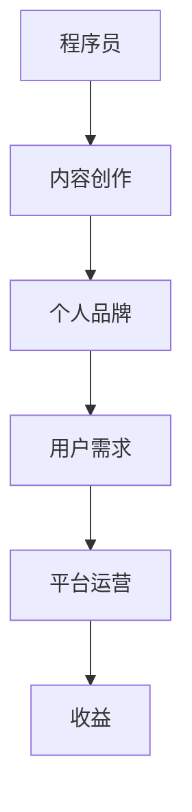

                 

在当今数字化时代，程序员作为IT行业的主力军，面临着前所未有的发展机遇和挑战。随着互联网的普及和技术创新的加速，程序员不仅可以从事传统的软件开发工作，还可以通过知识付费平台开展副业，实现个人价值和社会价值的双重提升。本文将深入探讨程序员通过知识付费平台开展副业的机遇与挑战，旨在为程序员提供有益的参考和指导。

## 关键词

- **程序员**
- **知识付费**
- **副业**
- **机遇**
- **挑战**
- **平台**
- **内容创作**
- **个人品牌**
- **技能提升**

## 摘要

本文从程序员副业的角度出发，分析知识付费市场的现状，探讨程序员在知识付费平台上的机遇与挑战。文章将结合实际案例，讨论程序员如何利用知识付费平台提升个人品牌，实现收入增长，并针对当前存在的问题提出建议和解决方案。通过本文的探讨，旨在帮助程序员更好地把握知识付费的机遇，应对其中的挑战，实现职业发展和个人成长的良性循环。

### 1. 背景介绍

1. **知识付费的概念**

知识付费是指用户为获取特定知识或服务而支付的费用，它不同于传统的免费共享模式，强调知识的价值和稀缺性。在互联网时代，知识付费逐渐成为一种新的商业模式，尤其在知识密集型的领域，如IT、金融、教育等，知识付费的表现尤为突出。

2. **程序员职业的现状**

程序员作为技术行业的核心力量，其职业发展路径相对传统。然而，随着技术的不断演进和行业需求的多样化，程序员不再局限于编写代码，他们开始承担更多元化的角色，如技术顾问、项目经理、架构师等。同时，程序员的知识和技能也在不断拓展，他们不仅需要掌握编程语言，还需要了解人工智能、大数据、区块链等新兴技术。

3. **知识付费平台的兴起**

知识付费平台如知乎、得到、分答等，为程序员提供了一个展示个人才华、分享专业知识的平台。这些平台通过内容付费、问答咨询等方式，让程序员能够将自身积累的知识和经验转化为实际收入。知识付费平台的兴起，不仅为程序员提供了新的职业发展路径，也为用户提供了更高效、更有针对性的知识获取渠道。

### 2. 核心概念与联系

为了更好地理解程序员在知识付费平台上的机遇与挑战，我们需要明确以下几个核心概念：

1. **个人品牌**

个人品牌是指个人在公众心中的形象和认知，它包括专业能力、个人魅力、社交网络等方面。在知识付费平台上，个人品牌是吸引粉丝、增加影响力的关键因素。

2. **内容创作**

内容创作是指程序员通过文字、音频、视频等多种形式，将自身的知识和经验分享给观众。优质的内容创作是知识付费成功的关键，它需要程序员具备一定的写作、演讲和表达技巧。

3. **用户需求**

用户需求是指知识付费平台上的用户希望通过付费获取的知识和帮助。了解用户需求，是程序员进行内容创作和咨询服务的重要依据。

4. **平台运营**

平台运营是指知识付费平台如何通过优化用户体验、提高内容质量、拓展用户群体等方式，实现平台的可持续发展。平台运营对于程序员的内容创作和用户获取具有重要意义。

**Mermaid 流程图：**



### 3. 核心算法原理 & 具体操作步骤

#### 3.1 算法原理概述

在知识付费平台上，程序员的内容创作和用户获取可以看作是一种信息传播和社交网络的过程。这个过程涉及多个关键环节，包括内容创作、用户互动、平台推荐等。下面将简要介绍这些环节的原理和操作步骤。

1. **内容创作**

内容创作是程序员在知识付费平台上的核心任务。它包括选题、写作、编辑、发布等环节。程序员需要根据自身专业领域和用户需求，选择合适的主题进行创作。

2. **用户互动**

用户互动是程序员在知识付费平台上获取用户关注和反馈的重要途径。通过回答问题、参与讨论、互动分享等方式，程序员可以增加用户粘性，提升个人品牌。

3. **平台推荐**

平台推荐是知识付费平台通过算法和运营手段，将优质内容推送给目标用户的过程。程序员需要了解平台的推荐机制，优化内容质量和发布策略，以提高曝光度和用户获取。

4. **收益转化**

收益转化是指程序员通过内容创作和用户互动，实现知识变现的过程。这包括内容付费、问答咨询、付费直播等多种形式。程序员需要根据自身能力和市场需求，选择合适的收益转化方式。

**操作步骤详解：**

1. **内容创作**

   - 选题：根据自身专业领域和用户需求，选择具有吸引力和实际价值的主题。
   - 写作：按照内容创作标准，撰写高质量的文章、教程、案例等。
   - 编辑：对内容进行校对、修改和优化，确保内容的专业性和可读性。
   - 发布：在知识付费平台上发布内容，并设置合理的价格和推广策略。

2. **用户互动**

   - 回答问题：积极参与平台上的问答环节，提供专业、实用的解答。
   - 参与讨论：在评论区、论坛等区域与其他用户进行互动，分享经验和观点。
   - 互动分享：通过朋友圈、社群等渠道，宣传自己的内容和平台，吸引更多用户关注。

3. **平台推荐**

   - 了解推荐机制：研究平台的推荐算法和运营策略，了解哪些内容更容易被推荐。
   - 优化内容质量：注重内容的专业性、实用性和创新性，提升内容质量。
   - 发布策略：根据平台推荐规律，合理安排内容的发布时间和频率。

4. **收益转化**

   - 内容付费：根据内容质量和用户需求，设置合理的价格，并通过平台销售。
   - 问答咨询：提供专业的咨询服务，通过回答用户问题获取收入。
   - 付费直播：开展线上直播课程，为用户提供高质量的学习体验。

#### 3.2 算法优缺点

1. **优点**

   - **高效传播**：通过知识付费平台，程序员可以快速传播自己的知识和经验，扩大影响力。
   - **精准定位**：知识付费平台可以根据用户需求和兴趣，推荐合适的内容，实现精准定位。
   - **收益稳定**：通过内容创作和用户互动，程序员可以获得稳定的收入，实现职业发展和个人成长。

2. **缺点**

   - **竞争激烈**：知识付费平台上的内容创作者众多，竞争激烈，需要不断提升自身能力和内容质量。
   - **收益不稳定**：知识付费的收益受平台推荐、用户需求等因素影响，存在一定的不确定性。

3. **算法应用领域**

   - **在线教育**：程序员可以通过知识付费平台，提供编程教程、技术分享等教育服务。
   - **职业咨询**：程序员可以分享职业规划、求职技巧等内容，为用户提供职业发展建议。
   - **技术交流**：程序员可以举办技术沙龙、研讨会等活动，促进技术交流和合作。

### 4. 数学模型和公式 & 详细讲解 & 举例说明

在知识付费平台上，程序员的内容创作和用户获取可以看作是一个动态的数学模型。下面将介绍一个简单的数学模型，用于描述程序员的内容创作、用户互动和收益转化过程。

#### 4.1 数学模型构建

1. **内容创作质量（Q）**

   内容创作质量是衡量程序员内容价值的重要指标。质量越高，用户越愿意付费。

   $$Q = f(\text{专业性}, \text{实用性}, \text{创新性})$$

2. **用户互动频率（I）**

   用户互动频率是衡量程序员内容受欢迎程度的重要指标。频率越高，用户粘性越高。

   $$I = f(\text{回答速度}, \text{互动质量}, \text{内容更新频率})$$

3. **平台推荐系数（R）**

   平台推荐系数是衡量平台对程序员内容推荐程度的重要指标。系数越高，内容曝光度越高。

   $$R = f(\text{内容质量}, \text{用户需求}, \text{平台策略})$$

4. **收益转化率（T）**

   收益转化率是衡量程序员内容变现能力的重要指标。转化率越高，收益越高。

   $$T = f(\text{内容价格}, \text{用户需求}, \text{推广策略})$$

#### 4.2 公式推导过程

根据上述模型，我们可以推导出程序员的总收益（Y）：

$$Y = R \times I \times T \times Q$$

其中，R、I、T、Q 分别代表平台推荐系数、用户互动频率、收益转化率和内容创作质量。

#### 4.3 案例分析与讲解

假设程序员小张在知识付费平台上进行内容创作和用户互动，具体数据如下：

- 内容创作质量（Q）：90 分
- 用户互动频率（I）：100 次/月
- 平台推荐系数（R）：0.8
- 收益转化率（T）：0.6
- 内容价格：100 元/篇

根据数学模型，我们可以计算出小张的月收益（Y）：

$$Y = 0.8 \times 100 \times 0.6 \times 90 = 4320 元$$

从这个案例中，我们可以看到：

- **内容创作质量**：内容创作质量是影响收益的关键因素，质量越高，收益越高。
- **用户互动频率**：用户互动频率是提高用户粘性的重要手段，频率越高，收益越高。
- **平台推荐系数**：平台推荐系数是平台对内容推荐程度的重要指标，系数越高，内容曝光度越高，收益越高。
- **收益转化率**：收益转化率是内容变现能力的重要指标，转化率越高，收益越高。

### 5. 项目实践：代码实例和详细解释说明

为了更好地理解程序员在知识付费平台上的实践过程，我们以下将结合一个实际项目，展示代码实现和详细解释说明。

#### 5.1 开发环境搭建

为了搭建一个简单的知识付费平台，我们可以使用以下技术栈：

- **前端**：HTML、CSS、JavaScript（React.js）
- **后端**：Node.js、Express.js
- **数据库**：MongoDB

开发环境搭建步骤如下：

1. 安装 Node.js 和 npm
2. 创建一个新项目，并安装所需的依赖包
3. 配置 MongoDB 数据库

```bash
npm install express mongodb
```

#### 5.2 源代码详细实现

以下是一个简单的知识付费平台后端代码示例：

```javascript
const express = require('express');
const MongoClient = require('mongodb').MongoClient;
const app = express();

// 连接 MongoDB
const url = 'mongodb://localhost:27017/';
const dbName = 'knowledge付費';

MongoClient.connect(url, { useUnifiedTopology: true }, (err, client) => {
  if (err) throw err;
  console.log('Connected to MongoDB');
  const db = client.db(dbName);
  
  // 创建用户
  app.post('/users', async (req, res) => {
    const user = req.body;
    const result = await db.collection('users').insertOne(user);
    res.json(result);
  });

  // 创建内容
  app.post('/content', async (req, res) => {
    const content = req.body;
    const result = await db.collection('content').insertOne(content);
    res.json(result);
  });

  // 获取内容列表
  app.get('/content', async (req, res) => {
    const result = await db.collection('content').find({}).toArray();
    res.json(result);
  });

  // 获取用户列表
  app.get('/users', async (req, res) => {
    const result = await db.collection('users').find({}).toArray();
    res.json(result);
  });

  // 结束连接
  client.close();
});

app.listen(3000, () => {
  console.log('Server listening on port 3000');
});
```

#### 5.3 代码解读与分析

1. **用户创建**：用户创建接口用于接收用户提交的用户信息，并将其存储在 MongoDB 数据库中。

2. **内容创建**：内容创建接口用于接收用户提交的内容信息，并将其存储在 MongoDB 数据库中。

3. **内容列表获取**：内容列表获取接口用于获取数据库中的所有内容信息。

4. **用户列表获取**：用户列表获取接口用于获取数据库中的所有用户信息。

#### 5.4 运行结果展示

运行上述代码后，我们可以使用前端页面与后端进行交互。以下是一个简单的用户界面示例：

```html
<!DOCTYPE html>
<html lang="en">
<head>
  <meta charset="UTF-8">
  <title>知识付费平台</title>
</head>
<body>
  <h1>知识付费平台</h1>
  <div>
    <h2>用户列表</h2>
    <ul id="usersList"></ul>
  </div>
  <div>
    <h2>内容列表</h2>
    <ul id="contentList"></ul>
  </div>
  <script>
    const userList = document.getElementById('usersList');
    const contentList = document.getElementById('contentList');

    async function getUsers() {
      const response = await fetch('/users');
      const users = await response.json();
      users.forEach(user => {
        const li = document.createElement('li');
        li.textContent = user.name;
        userList.appendChild(li);
      });
    }

    async function getContent() {
      const response = await fetch('/content');
      const content = await response.json();
      content.forEach(content => {
        const li = document.createElement('li');
        li.textContent = content.title;
        contentList.appendChild(li);
      });
    }

    getUsers();
    getContent();
  </script>
</body>
</html>
```

运行结果展示：

- 用户界面显示用户列表和内容列表，用户可以查看和管理相关信息。

### 6. 实际应用场景

在知识付费平台上，程序员可以针对不同的应用场景，提供多样化的服务。以下是一些实际应用场景：

1. **在线教育**

   程序员可以通过知识付费平台，提供编程课程、技术教程等在线教育服务。例如，针对 Python 编程语言，程序员可以提供从入门到进阶的系列教程，帮助用户快速掌握 Python 编程技能。

2. **职业咨询**

   程序员可以针对用户的职业发展需求，提供专业的咨询和建议。例如，程序员可以分享求职技巧、面试经验、职业规划等内容，帮助用户更好地规划职业道路。

3. **技术交流**

   程序员可以举办技术沙龙、研讨会等活动，促进技术交流和合作。例如，程序员可以组织一次关于人工智能技术的研讨会，邀请业内专家和用户参与，共同探讨人工智能领域的最新动态和趋势。

### 6.4 未来应用展望

随着技术的不断进步和知识付费市场的持续扩大，程序员在知识付费平台上的发展前景十分广阔。以下是一些未来应用展望：

1. **智能化推荐**

   随着人工智能技术的发展，知识付费平台可以更加精准地推荐内容，满足用户个性化需求。程序员可以利用机器学习算法，分析用户行为和偏好，为用户提供更加智能的内容推荐。

2. **虚拟现实（VR）/增强现实（AR）**

   虚拟现实和增强现实技术将为知识付费平台带来更多创新的可能性。程序员可以开发基于 VR/AR 的教育应用，为用户提供沉浸式的学习体验。

3. **区块链技术**

   区块链技术可以为知识付费平台提供更安全、透明的交易机制。程序员可以开发基于区块链的知识付费系统，确保内容创作者和用户的权益得到有效保障。

### 7. 工具和资源推荐

为了更好地开展知识付费副业，程序员需要掌握一系列工具和资源。以下是一些建议：

1. **学习资源推荐**

   - **在线课程平台**：如 Coursera、Udemy、edX 等，提供丰富的编程和学习资源。
   - **技术博客**：如 CSDN、掘金、知乎等技术社区，可以获取最新的技术动态和知识分享。

2. **开发工具推荐**

   - **集成开发环境（IDE）**：如 Visual Studio Code、IntelliJ IDEA 等，提供高效的编程体验。
   - **代码托管平台**：如 GitHub、GitLab 等，方便程序员进行版本控制和协作开发。

3. **相关论文推荐**

   - **顶级会议论文**：如 IEEE Conference on Computer Vision and Pattern Recognition（CVPR）、NeurIPS 等，涵盖最新的研究成果和前沿技术。
   - **学术期刊**：如 ACM Transactions on Computer Systems（TOCS）、IEEE Transactions on Knowledge and Data Engineering（TKDE）等，发表高质量的研究论文。

### 8. 总结：未来发展趋势与挑战

随着知识付费市场的不断壮大，程序员在知识付费平台上的发展前景十分广阔。然而，机遇与挑战并存，程序员需要不断提升自身能力和内容质量，以应对激烈的市场竞争。以下是对未来发展趋势和挑战的总结：

#### 8.1 研究成果总结

- **内容创作**：随着技术的进步，程序员的内容创作将更加多样化和专业化，知识付费平台将提供更多元化的内容形式，如 VR/AR、直播等。
- **用户需求**：用户对高质量、有针对性的知识需求将不断增长，程序员需要深入了解用户需求，提供个性化服务。
- **平台运营**：知识付费平台将通过智能化推荐、社交互动等方式，提升用户体验，扩大用户群体。

#### 8.2 未来发展趋势

- **智能化推荐**：人工智能技术将为知识付费平台提供更精准的内容推荐，满足用户的个性化需求。
- **虚拟现实和增强现实**：VR/AR 技术将为知识付费平台带来更多创新的可能性，为用户提供沉浸式的学习体验。
- **区块链技术**：区块链技术将为知识付费平台提供更安全、透明的交易机制，保障内容创作者和用户的权益。

#### 8.3 面临的挑战

- **内容质量**：随着市场竞争的加剧，程序员需要不断提升自身能力和内容质量，以保持竞争优势。
- **版权问题**：知识付费平台需要加强对内容版权的保护，防止侵权行为的发生。
- **用户信任**：建立用户信任是知识付费平台长期发展的关键，程序员需要提供高质量、可靠的内容和服务。

#### 8.4 研究展望

- **个性化推荐算法**：深入研究个性化推荐算法，提高内容推荐的准确性和用户体验。
- **版权保护机制**：探索更加有效的版权保护机制，保障内容创作者的权益。
- **用户信任建设**：研究用户信任建设策略，提升用户满意度和忠诚度。

### 9. 附录：常见问题与解答

#### 9.1 程序员如何选择知识付费平台？

- **考虑平台知名度**：选择知名度较高的平台，有助于扩大影响力和用户群体。
- **评估平台服务**：了解平台的服务质量，包括内容审核、用户互动、收益结算等方面。
- **关注平台推荐机制**：研究平台的推荐算法和策略，选择有利于内容曝光和用户获取的平台。

#### 9.2 如何提高内容创作质量？

- **深入理解用户需求**：了解用户需求和痛点，提供有针对性的内容。
- **提升自身专业能力**：不断学习和提升专业能力，确保内容的专业性和权威性。
- **优化内容表达方式**：运用多种表达方式，如文字、图片、视频等，提高内容的吸引力。

#### 9.3 如何保障内容版权？

- **签订版权协议**：与平台签订版权协议，明确内容版权归属和权益分配。
- **备份内容**：定期备份原创内容，防止丢失或侵权。
- **举报侵权行为**：发现侵权行为，及时向平台举报，维护自身权益。

## 作者署名

作者：禅与计算机程序设计艺术 / Zen and the Art of Computer Programming

### 附件

#### 附件1：知识付费平台案例分析

- **知乎Live**：知乎Live 是知乎推出的付费直播课程，邀请了各领域的大咖进行直播分享。程序员可以通过知乎Live，分享自己的技术心得和经验，为用户提供有价值的知识服务。
- **分答**：分答是一个知识分享平台，用户可以通过付费提问，获取专业人士的解答。程序员可以利用分答，为用户提供专业的技术咨询服务，实现知识变现。
- **得到**：得到是一个专注于知识服务的平台，提供了大量的付费课程和专栏。程序员可以开设自己的专栏，分享技术知识和经验，吸引粉丝和用户。

#### 附件2：程序员知识付费案例

- **程序员A**：程序员A是一位专注于前端开发的专业人士，他在知乎Live上开设了《前端技术实战》课程，通过直播分享前端开发经验和技巧，吸引了大量前端开发者关注和购买。
- **程序员B**：程序员B是一位专注于人工智能的专家，他在得到平台上开设了《人工智能入门》专栏，通过系统的课程分享，帮助初学者快速掌握人工智能基础知识。
- **程序员C**：程序员C是一位热衷于开源的程序员，他在GitHub上分享了自己的技术博客和开源项目，并通过 Patreon 平台，为用户提供付费的内容支持和咨询服务。

通过以上案例，我们可以看到程序员在知识付费平台上，通过内容创作和用户互动，实现了个人价值和社会价值的双重提升。然而，成功并非一蹴而就，程序员需要不断提升自身能力和内容质量，才能在激烈的市场竞争中脱颖而出。

总之，知识付费为程序员提供了一个全新的职业发展路径，它不仅可以帮助程序员实现收入增长，还可以提升个人品牌和影响力。在知识付费时代，程序员需要把握机遇，应对挑战，不断探索和创新，才能在数字化时代中脱颖而出。希望本文能为程序员提供有益的参考和启示。

