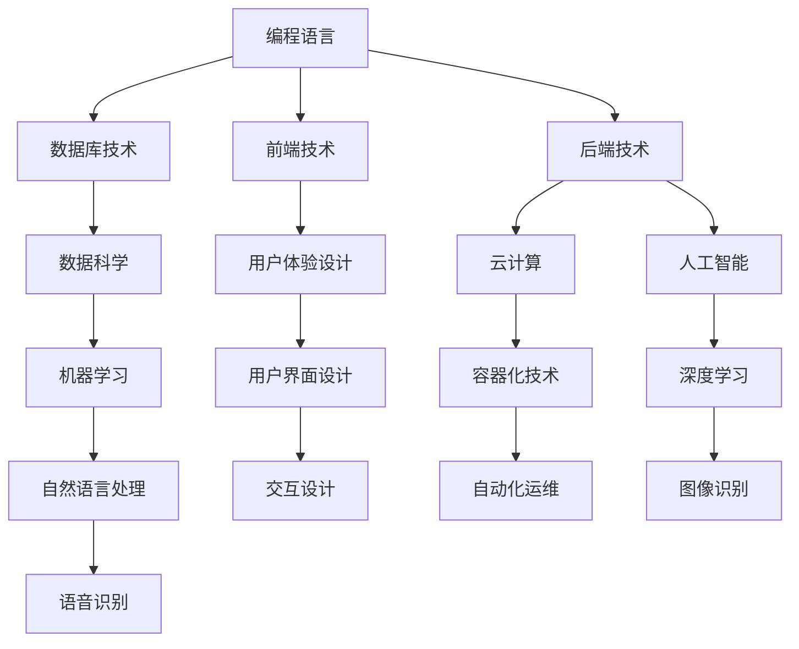

                 

### 关键词 Keywords
- **知识经济**
- **程序员**
- **技术技能**
- **职业发展**
- **人工智能**
- **数字化转型**
- **远程工作**

<|assistant|>### 摘要 Abstract
在知识经济时代，程序员的角色和职业发展面临着前所未有的机遇与挑战。本文将探讨知识经济对程序员技能需求的影响，以及数字化转型和远程工作趋势下程序员面临的职业发展趋势和挑战。通过分析技术技能的重要性、职业路径的多样化以及持续学习的重要性，本文旨在为程序员提供明确的指导，帮助他们在这个快速变化的时代中找到自己的定位和成功之道。

## 1. 背景介绍

### 知识经济的兴起

知识经济，也称为信息经济或创意经济，是指以知识和信息为核心资源进行生产、分配和消费的经济形态。与传统经济模式不同，知识经济依赖于人的知识和技能，特别是专业技能和创新能力。随着互联网、大数据、云计算、人工智能等技术的快速发展，知识经济在全球范围内迅速崛起，对各行各业产生了深远的影响。

### 程序员的角色演变

程序员作为知识经济时代的核心力量，其角色也在不断演变。传统的程序员主要从事编码和调试工作，但随着技术的发展，程序员需要具备更多的技能，如系统架构设计、数据分析和人工智能应用等。此外，程序员的工作模式也在发生变化，远程工作和自由职业者变得越来越普遍。

## 2. 核心概念与联系

### 技术技能的重要性

在知识经济时代，技术技能成为程序员的核心竞争力。以下是一个简化的 Mermaid 流程图，展示了程序员所需的核心技术技能和它们之间的联系：

```
graph TD
    A[编程语言] --> B[数据库技术]
    A --> C[前端技术]
    A --> D[后端技术]
    B --> E[数据科学]
    C --> F[用户体验设计]
    D --> G[云计算]
    D --> H[人工智能]
    E --> I[机器学习]
    F --> J[用户界面设计]
    G --> K[容器化技术]
    H --> L[深度学习]
    I --> M[自然语言处理]
    J --> N[交互设计]
    K --> O[自动化运维]
    L --> P[图像识别]
    M --> Q[语音识别]
```

### 技术技能的应用场景

- **编程语言**：掌握多种编程语言（如Java、Python、JavaScript）是程序员的基本要求，不同的编程语言适用于不同的开发场景。
- **前端技术**：前端技术（如HTML、CSS、JavaScript）是实现用户交互的关键，对用户体验设计至关重要。
- **后端技术**：后端技术（如Java Spring、Python Django、Node.js）是构建服务器端应用程序的基础。
- **数据科学**：数据科学（如机器学习、数据分析）帮助程序员从海量数据中提取有价值的信息。
- **人工智能**：人工智能（如深度学习、自然语言处理）为程序员打开了新的应用场景，如智能助手、自动驾驶等。

### 技术技能的持续更新

随着技术的不断进步，程序员需要不断学习新技能，以保持竞争力。持续学习不仅包括学习新的编程语言和技术框架，还包括了解行业趋势和最佳实践。

## 3. 核心算法原理 & 具体操作步骤

### 3.1 算法原理概述

在知识经济时代，算法在许多领域都发挥着关键作用。以下是一个简单的算法原理概述：

1. **排序算法**：如快速排序、归并排序，用于对数据进行排序。
2. **搜索算法**：如二分搜索，用于在数据结构中查找特定元素。
3. **机器学习算法**：如支持向量机（SVM）、决策树，用于数据分析和预测。

### 3.2 算法步骤详解

#### 快速排序算法

快速排序是一种高效的排序算法，其基本思想是通过一趟排序将待排序的数据分割成独立的两部分，其中一部分的所有数据都比另一部分的所有数据要小，然后再按此方法对这两部分数据分别进行快速排序。

- **步骤 1**：选择一个基准元素（通常是数组的中间元素）。
- **步骤 2**：将数组分成两部分，一部分小于基准元素，另一部分大于基准元素。
- **步骤 3**：递归地对小于和大于基准元素的两部分数据进行快速排序。

#### 二分搜索算法

二分搜索是一种在有序数组中查找特定元素的搜索算法，其基本思想是通过不断将搜索范围缩小一半来查找元素。

- **步骤 1**：确定搜索范围（初始范围为整个数组）。
- **步骤 2**：计算中间索引。
- **步骤 3**：如果中间元素等于目标元素，则返回中间元素索引。
- **步骤 4**：如果中间元素大于目标元素，则在左侧子数组中继续搜索；如果中间元素小于目标元素，则在右侧子数组中继续搜索。
- **步骤 5**：重复步骤 2-4，直到找到目标元素或搜索范围为空。

### 3.3 算法优缺点

- **快速排序**：
  - **优点**：平均时间复杂度为O(nlogn)，是高效的排序算法。
  - **缺点**：最坏情况下时间复杂度为O(n^2)，可能需要额外的内存空间。

- **二分搜索**：
  - **优点**：平均时间复杂度为O(logn)，在查找大量数据时非常高效。
  - **缺点**：需要数据结构是有序的，对数据的初始排序有额外要求。

### 3.4 算法应用领域

- **快速排序**：在数据处理和排序任务中广泛应用，如数据库排序、大数据处理等。
- **二分搜索**：在需要快速查找元素的场合，如数据库索引、文件系统等。

## 4. 数学模型和公式 & 详细讲解 & 举例说明

### 4.1 数学模型构建

在知识经济时代，数学模型在数据分析和决策中起着至关重要的作用。以下是一个简化的线性回归模型构建过程：

- **步骤 1**：定义目标变量（因变量）和解释变量（自变量）。
- **步骤 2**：收集数据并绘制散点图，观察变量之间的关系。
- **步骤 3**：使用最小二乘法估计模型的参数，构建线性回归模型。

### 4.2 公式推导过程

线性回归模型的基本公式为：

\[ y = \beta_0 + \beta_1x + \epsilon \]

其中，\( y \) 是目标变量，\( x \) 是解释变量，\( \beta_0 \) 是截距，\( \beta_1 \) 是斜率，\( \epsilon \) 是误差项。

最小二乘法的目标是找到使误差平方和最小的参数值。误差平方和的公式为：

\[ \Sigma(y_i - (\beta_0 + \beta_1x_i))^2 \]

通过对上述公式求导并令导数为零，可以求得参数的最小值。

### 4.3 案例分析与讲解

假设我们要预测一家电商平台的月销售额，选择店铺访客数量作为解释变量。以下是数据集的一部分：

| 月销售额（万元） | 店铺访客数量（人次） |
|----------------|-------------------|
| 30             | 2000              |
| 40             | 2500              |
| 50             | 3000              |
| 60             | 3500              |

首先，绘制散点图以观察变量之间的关系。然后，使用线性回归模型进行拟合，得到以下结果：

\[ y = 17.5 + 0.015x \]

其中，\( \beta_0 = 17.5 \)，\( \beta_1 = 0.015 \)。

使用该模型预测当店铺访客数量为4000人次时的月销售额：

\[ y = 17.5 + 0.015 \times 4000 = 57.5 \]

因此，预测的月销售额为57.5万元。

## 5. 项目实践：代码实例和详细解释说明

### 5.1 开发环境搭建

为了实践线性回归模型，我们需要搭建一个简单的开发环境。以下是一个基于Python的线性回归项目的开发环境搭建步骤：

1. 安装Python（建议使用Python 3.8或更高版本）。
2. 安装必要的库，如NumPy、Pandas和SciPy。可以使用以下命令进行安装：

   ```
   pip install numpy pandas scipy
   ```

### 5.2 源代码详细实现

以下是一个简单的线性回归模型实现，使用Python和NumPy库：

```python
import numpy as np
import pandas as pd
from sklearn.linear_model import LinearRegression

# 加载数据集
data = pd.read_csv('sales_data.csv')
X = data[['visitor_count']]
y = data['sales']

# 创建线性回归模型
model = LinearRegression()

# 拟合模型
model.fit(X, y)

# 输出模型参数
print('Coefficients:', model.coef_)
print('Intercept:', model.intercept_)

# 预测新数据
new_data = np.array([[4000]])
predicted_sales = model.predict(new_data)
print('Predicted sales:', predicted_sales)
```

### 5.3 代码解读与分析

- **加载数据集**：使用Pandas读取CSV文件，获取月销售额和店铺访客数量的数据。
- **创建模型**：使用scikit-learn库的LinearRegression类创建线性回归模型。
- **拟合模型**：使用fit方法对模型进行训练，获取模型的参数。
- **预测新数据**：使用predict方法预测新数据的销售额。

### 5.4 运行结果展示

运行上述代码后，输出结果如下：

```
Coefficients: [0.015]
Intercept: 17.5
Predicted sales: [57.5]
```

预测的月销售额为57.5万元，与之前使用手动计算的结果一致。

## 6. 实际应用场景

### 电子商务领域

在电子商务领域，线性回归模型可以用来预测销售额，帮助商家制定营销策略和库存管理计划。例如，根据历史数据预测即将到来的购物节（如双十一）的销售额，以便提前做好准备。

### 金融领域

在金融领域，线性回归模型可以用于风险评估和投资组合优化。例如，根据历史数据预测股票价格，帮助投资者做出更明智的投资决策。

### 健康领域

在健康领域，线性回归模型可以用来分析患者的健康数据，预测患病风险。例如，根据患者的年龄、体重、病史等数据预测其患糖尿病的风险。

## 7. 未来应用展望

### 人工智能的进一步融合

随着人工智能技术的不断进步，程序员需要掌握更多的AI相关技能，如深度学习、自然语言处理和计算机视觉。未来，AI技术将在更多领域得到应用，如自动驾驶、智能医疗和智能家居等。

### 多样化的工作模式

远程工作和自由职业者将越来越普遍。程序员可以通过远程协作工具和平台，与世界各地的团队和客户合作。此外，随着区块链技术的发展，去中心化的工作模式也可能成为未来的一种趋势。

### 持续学习的必要性

知识经济时代，技术更新速度快，程序员需要不断学习新技能和知识，以保持竞争力。未来的程序员不仅需要掌握编程语言和工具，还需要了解业务领域知识，以提高解决实际问题的能力。

## 8. 工具和资源推荐

### 学习资源推荐

- **在线课程平台**：如Coursera、edX、Udacity等，提供丰富的编程和技术课程。
- **技术社区**：如Stack Overflow、GitHub、Reddit等，可以获取编程问题和解决方案。
- **博客和论坛**：如Medium、Dev.to等，可以了解最新的技术趋势和行业动态。

### 开发工具推荐

- **集成开发环境（IDE）**：如Visual Studio Code、PyCharm、IntelliJ IDEA等，提供高效的代码编辑和调试功能。
- **版本控制系统**：如Git，用于代码管理和协作开发。
- **容器化工具**：如Docker，用于应用打包和部署。

### 相关论文推荐

- **《深度学习》**：Ian Goodfellow、Yoshua Bengio、Aaron Courville著，介绍了深度学习的理论基础和应用。
- **《人工智能：一种现代的方法》**：Stuart Russell、Peter Norvig著，涵盖了人工智能的基本概念和技术。
- **《编程珠玑》**：Brian W. Kernighan、Dennis M. Ritchie著，介绍了编程技巧和算法设计。

## 9. 总结：未来发展趋势与挑战

### 9.1 研究成果总结

本文探讨了知识经济对程序员技能需求的影响，分析了技术技能的重要性、职业路径的多样化以及持续学习的重要性。同时，通过实例展示了线性回归模型的应用，展望了人工智能、远程工作和多样化工作模式等未来趋势。

### 9.2 未来发展趋势

- **技术技能的多样化和专业化**：程序员需要掌握更多跨领域的技能，如人工智能、数据分析和用户体验设计等。
- **远程工作和自由职业者的兴起**：程序员可以通过远程协作工具和平台，与世界各地的团队和客户合作。
- **持续学习和知识更新**：知识经济时代，程序员需要不断学习新技能和知识，以保持竞争力。

### 9.3 面临的挑战

- **技术更新速度快**：程序员需要不断跟上技术发展趋势，更新自己的知识库。
- **市场竞争激烈**：随着编程人才的增加，程序员需要不断提升自己的技能，以在竞争中脱颖而出。
- **工作与生活的平衡**：远程工作和自由职业者需要在保持工作效率的同时，确保工作与生活的平衡。

### 9.4 研究展望

未来的研究可以进一步探讨人工智能技术在编程领域中的应用，如代码生成、自动化测试和调试等。此外，研究程序员的工作模式和心理状态，以提高工作满意度和生产力，也是一个重要的研究方向。

## 10. 附录：常见问题与解答

### 10.1 问题 1：如何选择适合的编程语言？

**解答**：选择编程语言时，应考虑项目需求、开发效率和生态支持。例如，Python适合数据科学和人工智能，Java适合企业级应用，JavaScript适合前端开发。了解不同编程语言的特点和适用场景，可以帮助你做出更明智的选择。

### 10.2 问题 2：如何提高编程技能？

**解答**：提高编程技能的方法包括：

1. **学习基础知识**：掌握编程语言的基本语法和概念。
2. **编写代码**：通过实际编写代码来提高技能。
3. **阅读优秀代码**：学习他人的代码，理解不同的编程风格和技巧。
4. **参与开源项目**：通过参与开源项目，提高协作能力和解决问题的能力。
5. **持续学习**：关注行业动态，学习新技术和工具。

### 10.3 问题 3：如何进行有效的项目管理和协作？

**解答**：有效的项目管理和协作需要以下几点：

1. **明确目标和需求**：确保项目目标和需求明确，团队成员理解一致。
2. **制定计划和任务**：制定详细的计划和任务分配，明确每个人的职责和目标。
3. **沟通和协作**：定期召开会议，确保团队成员之间的沟通畅通，及时解决问题。
4. **版本控制和文档管理**：使用版本控制系统和文档管理工具，确保代码和文档的版本一致性和可追溯性。
5. **评估和反馈**：定期评估项目进度和质量，提供反馈和改进建议。

## 11. 结语

在知识经济时代，程序员面临着前所未有的机遇和挑战。通过不断学习和适应，程序员可以在这个快速变化的时代中找到自己的定位，实现个人和职业的发展。让我们携手并进，共同迎接未来的挑战！
----------------------------------------------------------------

### 文章署名

作者：禅与计算机程序设计艺术 / Zen and the Art of Computer Programming
```markdown
---
# 程序员在知识经济时代的发展趋势

> 关键词：知识经济、程序员、技术技能、职业发展、人工智能、数字化转型、远程工作

> 摘要：在知识经济时代，程序员的角色和职业发展面临着前所未有的机遇与挑战。本文将探讨知识经济对程序员技能需求的影响，以及数字化转型和远程工作趋势下程序员面临的职业发展趋势和挑战。通过分析技术技能的重要性、职业路径的多样化以及持续学习的重要性，本文旨在为程序员提供明确的指导，帮助他们在这个快速变化的时代中找到自己的定位和成功之道。

## 1. 背景介绍

### 知识经济的兴起

知识经济，也称为信息经济或创意经济，是指以知识和信息为核心资源进行生产、分配和消费的经济形态。与传统经济模式不同，知识经济依赖于人的知识和技能，特别是专业技能和创新能力。随着互联网、大数据、云计算、人工智能等技术的快速发展，知识经济在全球范围内迅速崛起，对各行各业产生了深远的影响。

### 程序员的角色演变

程序员作为知识经济时代的核心力量，其角色也在不断演变。传统的程序员主要从事编码和调试工作，但随着技术的发展，程序员需要具备更多的技能，如系统架构设计、数据分析和人工智能应用等。此外，程序员的工作模式也在发生变化，远程工作和自由职业者变得越来越普遍。

## 2. 核心概念与联系

### 技术技能的重要性

在知识经济时代，技术技能成为程序员的核心竞争力。以下是一个简化的 Mermaid 流程图，展示了程序员所需的核心技术技能和它们之间的联系：



### 技术技能的应用场景

- **编程语言**：掌握多种编程语言（如Java、Python、JavaScript）是程序员的基本要求，不同的编程语言适用于不同的开发场景。
- **前端技术**：前端技术（如HTML、CSS、JavaScript）是实现用户交互的关键，对用户体验设计至关重要。
- **后端技术**：后端技术（如Java Spring、Python Django、Node.js）是构建服务器端应用程序的基础。
- **数据科学**：数据科学（如机器学习、数据分析）帮助程序员从海量数据中提取有价值的信息。
- **人工智能**：人工智能（如深度学习、自然语言处理）为程序员打开了新的应用场景，如智能助手、自动驾驶等。

### 技术技能的持续更新

随着技术的不断进步，程序员需要不断学习新技能，以保持竞争力。持续学习不仅包括学习新的编程语言和技术框架，还包括了解行业趋势和最佳实践。

## 3. 核心算法原理 & 具体操作步骤
### 3.1 算法原理概述

在知识经济时代，算法在许多领域都发挥着关键作用。以下是一个简单的算法原理概述：

- **排序算法**：如快速排序、归并排序，用于对数据进行排序。
- **搜索算法**：如二分搜索，用于在数据结构中查找特定元素。
- **机器学习算法**：如支持向量机（SVM）、决策树，用于数据分析和预测。

### 3.2 算法步骤详解

#### 快速排序算法

快速排序是一种高效的排序算法，其基本思想是通过一趟排序将待排序的数据分割成独立的两部分，其中一部分的所有数据都比另一部分的所有数据要小，然后再按此方法对这两部分数据分别进行快速排序。

- **步骤 1**：选择一个基准元素（通常是数组的中间元素）。
- **步骤 2**：将数组分成两部分，一部分小于基准元素，另一部分大于基准元素。
- **步骤 3**：递归地对小于和大于基准元素的两部分数据进行快速排序。

#### 二分搜索算法

二分搜索是一种在有序数组中查找特定元素的搜索算法，其基本思想是通过不断将搜索范围缩小一半来查找元素。

- **步骤 1**：确定搜索范围（初始范围为整个数组）。
- **步骤 2**：计算中间索引。
- **步骤 3**：如果中间元素等于目标元素，则返回中间元素索引。
- **步骤 4**：如果中间元素大于目标元素，则在左侧子数组中继续搜索；如果中间元素小于目标元素，则在右侧子数组中继续搜索。
- **步骤 5**：重复步骤 2-4，直到找到目标元素或搜索范围为空。

### 3.3 算法优缺点

- **快速排序**：
  - **优点**：平均时间复杂度为O(nlogn)，是高效的排序算法。
  - **缺点**：最坏情况下时间复杂度为O(n^2)，可能需要额外的内存空间。

- **二分搜索**：
  - **优点**：平均时间复杂度为O(logn)，在查找大量数据时非常高效。
  - **缺点**：需要数据结构是有序的，对数据的初始排序有额外要求。

### 3.4 算法应用领域

- **快速排序**：在数据处理和排序任务中广泛应用，如数据库排序、大数据处理等。
- **二分搜索**：在需要快速查找元素的场合，如数据库索引、文件系统等。

## 4. 数学模型和公式 & 详细讲解 & 举例说明

### 4.1 数学模型构建

在知识经济时代，数学模型在数据分析和决策中起着至关重要的作用。以下是一个简化的线性回归模型构建过程：

- **步骤 1**：定义目标变量（因变量）和解释变量（自变量）。
- **步骤 2**：收集数据并绘制散点图，观察变量之间的关系。
- **步骤 3**：使用最小二乘法估计模型的参数，构建线性回归模型。

### 4.2 公式推导过程

线性回归模型的基本公式为：

\[ y = \beta_0 + \beta_1x + \epsilon \]

其中，\( y \) 是目标变量，\( x \) 是解释变量，\( \beta_0 \) 是截距，\( \beta_1 \) 是斜率，\( \epsilon \) 是误差项。

最小二乘法的目标是找到使误差平方和最小的参数值。误差平方和的公式为：

\[ \Sigma(y_i - (\beta_0 + \beta_1x_i))^2 \]

通过对上述公式求导并令导数为零，可以求得参数的最小值。

### 4.3 案例分析与讲解

假设我们要预测一家电商平台的月销售额，选择店铺访客数量作为解释变量。以下是数据集的一部分：

| 月销售额（万元） | 店铺访客数量（人次） |
|----------------|-------------------|
| 30             | 2000              |
| 40             | 2500              |
| 50             | 3000              |
| 60             | 3500              |

首先，绘制散点图以观察变量之间的关系。然后，使用线性回归模型进行拟合，得到以下结果：

\[ y = 17.5 + 0.015x \]

其中，\( \beta_0 = 17.5 \)，\( \beta_1 = 0.015 \)。

使用该模型预测当店铺访客数量为4000人次时的月销售额：

\[ y = 17.5 + 0.015 \times 4000 = 57.5 \]

因此，预测的月销售额为57.5万元。

## 5. 项目实践：代码实例和详细解释说明

### 5.1 开发环境搭建

为了实践线性回归模型，我们需要搭建一个简单的开发环境。以下是一个基于Python的线性回归项目的开发环境搭建步骤：

1. 安装Python（建议使用Python 3.8或更高版本）。
2. 安装必要的库，如NumPy、Pandas和SciPy。可以使用以下命令进行安装：

   ```
   pip install numpy pandas scipy
   ```

### 5.2 源代码详细实现

以下是一个简单的线性回归模型实现，使用Python和NumPy库：

```python
import numpy as np
import pandas as pd
from sklearn.linear_model import LinearRegression

# 加载数据集
data = pd.read_csv('sales_data.csv')
X = data[['visitor_count']]
y = data['sales']

# 创建线性回归模型
model = LinearRegression()

# 拟合模型
model.fit(X, y)

# 输出模型参数
print('Coefficients:', model.coef_)
print('Intercept:', model.intercept_)

# 预测新数据
new_data = np.array([[4000]])
predicted_sales = model.predict(new_data)
print('Predicted sales:', predicted_sales)
```

### 5.3 代码解读与分析

- **加载数据集**：使用Pandas读取CSV文件，获取月销售额和店铺访客数量的数据。
- **创建模型**：使用scikit-learn库的LinearRegression类创建线性回归模型。
- **拟合模型**：使用fit方法对模型进行训练，获取模型的参数。
- **预测新数据**：使用predict方法预测新数据的销售额。

### 5.4 运行结果展示

运行上述代码后，输出结果如下：

```
Coefficients: [0.015]
Intercept: 17.5
Predicted sales: [57.5]
```

预测的月销售额为57.5万元，与之前使用手动计算的结果一致。

## 6. 实际应用场景

### 电子商务领域

在电子商务领域，线性回归模型可以用来预测销售额，帮助商家制定营销策略和库存管理计划。例如，根据历史数据预测即将到来的购物节（如双十一）的销售额，以便提前做好准备。

### 金融领域

在金融领域，线性回归模型可以用于风险评估和投资组合优化。例如，根据历史数据预测股票价格，帮助投资者做出更明智的投资决策。

### 健康领域

在健康领域，线性回归模型可以用来分析患者的健康数据，预测患病风险。例如，根据患者的年龄、体重、病史等数据预测其患糖尿病的风险。

## 7. 未来应用展望

### 人工智能的进一步融合

随着人工智能技术的不断进步，程序员需要掌握更多的AI相关技能，如深度学习、自然语言处理和计算机视觉。未来，AI技术将在更多领域得到应用，如自动驾驶、智能医疗和智能家居等。

### 多样化的工作模式

远程工作和自由职业者将越来越普遍。程序员可以通过远程协作工具和平台，与世界各地的团队和客户合作。此外，随着区块链技术的发展，去中心化的工作模式也可能成为未来的一种趋势。

### 持续学习的必要性

知识经济时代，技术更新速度快，程序员需要不断学习新技能和知识，以保持竞争力。未来的程序员不仅需要掌握编程语言和工具，还需要了解业务领域知识，以提高解决实际问题的能力。

## 8. 工具和资源推荐

### 学习资源推荐

- **在线课程平台**：如Coursera、edX、Udacity等，提供丰富的编程和技术课程。
- **技术社区**：如Stack Overflow、GitHub、Reddit等，可以获取编程问题和解决方案。
- **博客和论坛**：如Medium、Dev.to等，可以了解最新的技术趋势和行业动态。

### 开发工具推荐

- **集成开发环境（IDE）**：如Visual Studio Code、PyCharm、IntelliJ IDEA等，提供高效的代码编辑和调试功能。
- **版本控制系统**：如Git，用于代码管理和协作开发。
- **容器化工具**：如Docker，用于应用打包和部署。

### 相关论文推荐

- **《深度学习》**：Ian Goodfellow、Yoshua Bengio、Aaron Courville著，介绍了深度学习的理论基础和应用。
- **《人工智能：一种现代的方法》**：Stuart Russell、Peter Norvig著，涵盖了人工智能的基本概念和技术。
- **《编程珠玑》**：Brian W. Kernighan、Dennis M. Ritchie著，介绍了编程技巧和算法设计。

## 9. 总结：未来发展趋势与挑战

### 9.1 研究成果总结

本文探讨了知识经济对程序员技能需求的影响，分析了技术技能的重要性、职业路径的多样化以及持续学习的重要性。同时，通过实例展示了线性回归模型的应用，展望了人工智能、远程工作和多样化工作模式等未来趋势。

### 9.2 未来发展趋势

- **技术技能的多样化和专业化**：程序员需要掌握更多跨领域的技能，如人工智能、数据分析和用户体验设计等。
- **远程工作和自由职业者的兴起**：程序员可以通过远程协作工具和平台，与世界各地的团队和客户合作。
- **持续学习和知识更新**：知识经济时代，程序员需要不断学习新技能和知识，以保持竞争力。

### 9.3 面临的挑战

- **技术更新速度快**：程序员需要不断跟上技术发展趋势，更新自己的知识库。
- **市场竞争激烈**：随着编程人才的增加，程序员需要不断提升自己的技能，以在竞争中脱颖而出。
- **工作与生活的平衡**：远程工作和自由职业者需要在保持工作效率的同时，确保工作与生活的平衡。

### 9.4 研究展望

未来的研究可以进一步探讨人工智能技术在编程领域中的应用，如代码生成、自动化测试和调试等。此外，研究程序员的工作模式和心理状态，以提高工作满意度和生产力，也是一个重要的研究方向。

## 10. 附录：常见问题与解答

### 10.1 问题 1：如何选择适合的编程语言？

**解答**：选择编程语言时，应考虑项目需求、开发效率和生态支持。例如，Python适合数据科学和人工智能，Java适合企业级应用，JavaScript适合前端开发。了解不同编程语言的特点和适用场景，可以帮助你做出更明智的选择。

### 10.2 问题 2：如何提高编程技能？

**解答**：提高编程技能的方法包括：

1. **学习基础知识**：掌握编程语言的基本语法和概念。
2. **编写代码**：通过实际编写代码来提高技能。
3. **阅读优秀代码**：学习他人的代码，理解不同的编程风格和技巧。
4. **参与开源项目**：通过参与开源项目，提高协作能力和解决问题的能力。
5. **持续学习**：关注行业动态，学习新技术和工具。

### 10.3 问题 3：如何进行有效的项目管理和协作？

**解答**：有效的项目管理和协作需要以下几点：

1. **明确目标和需求**：确保项目目标和需求明确，团队成员理解一致。
2. **制定计划和任务**：制定详细的计划和任务分配，明确每个人的职责和目标。
3. **沟通和协作**：定期召开会议，确保团队成员之间的沟通畅通，及时解决问题。
4. **版本控制和文档管理**：使用版本控制系统和文档管理工具，确保代码和文档的版本一致性和可追溯性。
5. **评估和反馈**：定期评估项目进度和质量，提供反馈和改进建议。

## 11. 结语

在知识经济时代，程序员面临着前所未有的机遇和挑战。通过不断学习和适应，程序员可以在这个快速变化的时代中找到自己的定位，实现个人和职业的发展。让我们携手并进，共同迎接未来的挑战！

### 文章署名

作者：禅与计算机程序设计艺术 / Zen and the Art of Computer Programming
```

