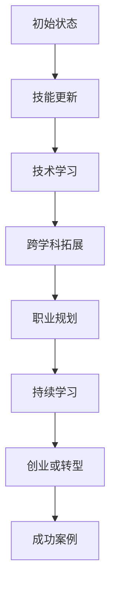

                 

关键词：知识经济、职业转型、程序员、技能更新、技术发展

> 摘要：随着知识经济的崛起和技术的飞速发展，程序员的职业路径和技能需求发生了显著变化。本文将探讨在知识经济时代，程序员如何实现职业转型，提升自身竞争力，并在不断变化的技术环境中保持领先地位。

## 1. 背景介绍

在过去的几十年里，信息技术行业经历了前所未有的增长。从最初的个人计算机革命到互联网的普及，再到移动设备和云计算的兴起，技术不断推动着商业和社会的进步。然而，随着知识经济的到来，技术的变革速度更加迅猛，传统职业角色和技能要求正在被重新定义。

知识经济是以知识为主要生产要素的经济形态，它强调创新和知识产权的重要性。在这个时代，信息的获取和利用成为经济增长的关键动力。程序员作为知识经济的重要参与者，他们的角色和职责也随之发生了转变。

首先，技术发展对程序员提出了更高的要求。程序员不仅需要掌握传统的编程技能，还需要不断学习新技术，如人工智能、大数据、区块链等。其次，知识经济要求程序员具备跨学科的知识，如数据科学、设计思维和商业知识。此外，程序员的职业路径也不再局限于开发工作，而是需要向更广泛的领域扩展，如项目管理、产品管理和创业等。

## 2. 核心概念与联系

在探讨程序员在知识经济时代的职业转型之前，我们首先需要明确一些核心概念，这些概念构成了转型的基础。

### 2.1 知识经济

知识经济（Knowledge Economy）是一种以知识为核心的经济形态。与传统以自然资源和劳动力为主的经济模式不同，知识经济强调智力资源的开发和利用。知识成为生产、分配和消费的主导因素，知识的创造、传播和应用成为经济增长的主要驱动力。

### 2.2 技能更新

技能更新（Skill Upgrading）是指个人或组织通过学习和培训，提高自身技能水平的过程。在知识经济时代，技能更新的频率和速度前所未有，程序员需要不断学习新技术和工具，以保持竞争力。

### 2.3 技术发展

技术发展（Technological Development）是指信息技术和科学领域的进步，包括新技术的研发、应用和推广。技术发展不仅改变了程序员的日常工作，也改变了他们的职业路径和机会。

### 2.4 跨学科知识

跨学科知识（Interdisciplinary Knowledge）是指在不同学科领域之间建立联系和综合运用的知识。在知识经济时代，程序员需要具备跨学科的知识，以便更好地理解和解决复杂问题。

### 2.5 Mermaid 流程图

以下是一个Mermaid流程图，展示了程序员在知识经济时代的职业转型路径：



## 3. 核心算法原理 & 具体操作步骤

### 3.1 算法原理概述

在知识经济时代，程序员的职业转型需要一套系统的策略和方法。以下是一种可能的算法原理：

#### 3.1.1 自我评估

- **确定兴趣和优势**：通过评估个人兴趣和优势，明确职业转型的方向。
- **分析市场需求**：研究当前市场需求，了解哪些技能和知识是迫切需要的。

#### 3.1.2 技能提升

- **学习新技术**：根据市场需求，选择合适的技术进行学习，如人工智能、大数据等。
- **实践应用**：通过项目实践，将所学知识应用到实际工作中。

#### 3.1.3 跨学科拓展

- **学习相关学科知识**：如数据科学、设计思维、商业知识等。
- **建立跨学科网络**：与不同领域的专家建立联系，扩大知识面。

#### 3.1.4 职业规划

- **设定职业目标**：明确短期和长期职业目标。
- **规划学习路径**：根据职业目标，制定详细的学习计划。

### 3.2 算法步骤详解

#### 3.2.1 自我评估

1. **确定兴趣和优势**：通过反思个人兴趣和过往工作经验，找出最适合自己的职业转型方向。
2. **分析市场需求**：查阅行业报告、招聘信息等，了解当前市场对程序员技能的需求。

#### 3.2.2 技能提升

1. **学习新技术**：选择具有市场前景的技术，如人工智能、大数据等。
2. **实践应用**：通过开源项目、实习或兼职等方式，将所学知识应用到实际工作中。

#### 3.2.3 跨学科拓展

1. **学习相关学科知识**：报名参加相关课程或研讨会，如数据科学、设计思维等。
2. **建立跨学科网络**：参加行业活动，与不同领域的专家交流。

#### 3.2.4 职业规划

1. **设定职业目标**：明确短期和长期职业目标，如晋升、创业等。
2. **规划学习路径**：根据职业目标，制定详细的学习计划。

### 3.3 算法优缺点

#### 优点

- **针对性**：通过自我评估，可以更明确地找到适合自己的职业转型方向。
- **灵活性**：技能提升和跨学科拓展提供了多种选择，可以根据个人兴趣和市场变化进行调整。

#### 缺点

- **时间成本**：技能提升和跨学科拓展需要投入大量的时间和精力。
- **竞争压力**：在知识经济时代，程序员需要不断学习，否则很容易被市场淘汰。

### 3.4 算法应用领域

- **软件开发**：程序员可以通过技能提升和跨学科拓展，提高软件开发的质量和效率。
- **项目管理**：程序员可以转型为项目经理，利用技术背景和管理知识，推动项目成功。
- **创业**：程序员可以运用所学知识和技术，创业或加入初创公司，实现职业价值最大化。

## 4. 数学模型和公式 & 详细讲解 & 举例说明

在程序员的职业转型过程中，数学模型和公式可以帮助我们更科学地制定和评估转型策略。以下是一个简单的数学模型：

### 4.1 数学模型构建

假设程序员的技能水平可以用一个变量`S`表示，市场需求可以用变量`D`表示，程序员的职业满意度可以用变量`M`表示。那么，数学模型可以表示为：

\[ M = f(S, D) \]

其中，`f`是一个函数，表示技能水平`S`和市场需求`D`对职业满意度`M`的影响。

### 4.2 公式推导过程

1. **技能水平`S`的计算**：

   \[ S = \sum_{i=1}^{n} s_i \cdot w_i \]

   其中，`s_i`表示第`i`项技能的水平，`w_i`表示第`i`项技能的权重。

2. **市场需求`D`的计算**：

   \[ D = \sum_{j=1}^{m} d_j \cdot v_j \]

   其中，`d_j`表示第`j`个市场需求的大小，`v_j`表示第`j`个市场需求的权重。

3. **职业满意度`M`的计算**：

   \[ M = \frac{S \cdot D}{C} \]

   其中，`C`是一个常数，用于调整职业满意度的范围。

### 4.3 案例分析与讲解

假设程序员小张目前具有以下技能和市场需求：

- 技能水平：前端开发（权重0.5）、后端开发（权重0.3）、项目管理（权重0.2）
- 市场需求：前端开发（大小0.6）、后端开发（大小0.3）、项目管理（大小0.1）

根据数学模型，我们可以计算出小张的职业满意度：

1. **计算技能水平`S`**：

   \[ S = 0.5 \cdot 5 + 0.3 \cdot 4 + 0.2 \cdot 3 = 3.6 \]

2. **计算市场需求`D`**：

   \[ D = 0.6 \cdot 5 + 0.3 \cdot 4 + 0.1 \cdot 3 = 3.3 \]

3. **计算职业满意度`M`**：

   \[ M = \frac{3.6 \cdot 3.3}{C} \]

   由于常数`C`未给定，我们假设为1，那么：

   \[ M = 3.6 \cdot 3.3 = 11.88 \]

根据这个数学模型，我们可以看出，小张的职业满意度较高，他的技能水平和市场需求都很匹配。如果小张想要提高职业满意度，可以考虑提升后端开发技能或增加项目管理经验。

## 5. 项目实践：代码实例和详细解释说明

### 5.1 开发环境搭建

为了实践程序员的职业转型，我们将使用Python语言编写一个简单的项目——一个基于Web的留言板。首先，我们需要搭建开发环境。

1. 安装Python：从官方网站下载并安装Python。
2. 安装依赖库：使用pip安装Flask，一个轻量级的Web框架。

```bash
pip install flask
```

### 5.2 源代码详细实现

```python
# 导入Flask库
from flask import Flask, render_template, request

# 创建Flask应用
app = Flask(__name__)

# 主页面路由
@app.route('/')
def index():
    return render_template('index.html')

# 留言页面路由
@app.route('/message', methods=['GET', 'POST'])
def message():
    if request.method == 'POST':
        name = request.form['name']
        message = request.form['message']
        return render_template('message.html', name=name, message=message)
    return render_template('message.html')

# 启动Flask应用
if __name__ == '__main__':
    app.run(debug=True)
```

### 5.3 代码解读与分析

这个项目包含两个主要的文件：`app.py`（应用程序代码）和`templates`（HTML模板文件）。

1. **应用程序代码`app.py`**：

   - 导入Flask库。
   - 创建Flask应用实例。
   - 定义主页面路由`index()`，用于渲染主页面的模板。
   - 定义留言页面路由`message()`，用于处理用户提交的留言信息。

2. **模板文件`templates`**：

   - `index.html`：主页面的模板，包含导航栏和留言板的入口。
   - `message.html`：留言页面的模板，用于显示用户的留言信息。

### 5.4 运行结果展示

1. 启动Flask应用：

   ```bash
   python app.py
   ```

2. 在浏览器中访问本地服务器的地址（通常为`http://127.0.0.1:5000/`），可以看到留言板的主页面。

3. 输入用户名和留言内容，提交后，可以看到留言页面显示用户留言的信息。

## 6. 实际应用场景

程序员的职业转型在许多实际应用场景中发挥着重要作用。以下是一些典型的应用场景：

1. **创业**：许多程序员选择自主创业，利用自己的技术背景和知识，开发创新的产品或服务。例如，Google的联合创始人拉里·佩奇和谢尔盖·布林都是计算机科学家，他们利用技术改变了搜索引擎行业。

2. **项目管理**：程序员可以转型为项目经理，利用技术背景和项目管理知识，领导团队实现项目目标。例如，亚马逊的首席项目总监杰夫·贝索斯就是一个成功的案例。

3. **技术咨询**：许多程序员选择成为技术咨询顾问，为企业提供技术解决方案和指导。他们利用丰富的技术经验和行业知识，帮助企业提高技术水平和业务效率。

4. **技术培训**：程序员可以转型为技术培训师，为其他程序员提供技术和职业发展培训。他们通过教学和分享经验，帮助更多程序员成长。

## 6.4 未来应用展望

随着知识经济的不断发展和技术的持续创新，程序员的职业转型将继续深化和扩展。以下是未来应用的一些展望：

1. **人工智能与编程的结合**：人工智能技术将更加深入地融入编程领域，程序员需要掌握人工智能相关的技能，如机器学习、深度学习等。

2. **云计算的广泛应用**：云计算技术的普及将使程序员在云平台上的工作变得更加重要，他们需要掌握云架构、容器化技术等。

3. **区块链技术的开发**：区块链技术的兴起为程序员提供了新的职业机会，他们需要掌握区块链的开发和运维技能。

4. **多学科交叉**：随着技术的进步，程序员需要具备更多跨学科的知识，如心理学、设计、商业等，以便更好地理解和解决复杂问题。

## 7. 工具和资源推荐

### 7.1 学习资源推荐

- **在线课程平台**：Coursera、edX、Udemy等提供丰富的编程和技术课程。
- **技术博客**：GitHub、Medium、Stack Overflow等技术博客，提供最新的技术文章和开源项目。
- **书籍**：《代码大全》、《算法导论》、《深度学习》等经典技术书籍。

### 7.2 开发工具推荐

- **集成开发环境**：Visual Studio Code、IntelliJ IDEA、Eclipse等。
- **版本控制工具**：Git、GitHub、GitLab等。
- **云服务平台**：AWS、Azure、Google Cloud等。

### 7.3 相关论文推荐

- **人工智能领域**：Nature、Science、AI Journal等期刊。
- **大数据领域**：《大数据技术导论》、《大数据科学》等。
- **区块链领域**：《区块链：从数字货币到智能合约》、《区块链技术与应用》等。

## 8. 总结：未来发展趋势与挑战

### 8.1 研究成果总结

本文探讨了程序员在知识经济时代的职业转型，分析了核心概念、算法原理和实际应用场景，并展望了未来的发展趋势。

### 8.2 未来发展趋势

1. 技术融合：人工智能、大数据、云计算等技术将更加深入地融入编程领域。
2. 跨学科：程序员需要具备更多跨学科的知识，以应对复杂问题。
3. 自我驱动：持续学习和自我提升将成为程序员的必备素质。

### 8.3 面临的挑战

1. 技术快速更新：程序员需要不断学习新技术，以保持竞争力。
2. 市场竞争：随着程序员数量的增加，市场竞争将更加激烈。
3. 跨学科学习：跨学科的知识积累需要时间和精力。

### 8.4 研究展望

未来的研究可以进一步探讨程序员在知识经济时代下的职业路径和技能需求，以及如何通过有效的培训和激励机制，帮助程序员实现职业转型。

## 9. 附录：常见问题与解答

### 9.1 问题1：程序员如何选择学习新技术？

**解答**：首先，了解市场需求和个人兴趣，然后选择具有市场前景的技术进行学习。可以通过在线课程、书籍、技术博客等途径获取知识。

### 9.2 问题2：程序员在转型过程中如何保持动力？

**解答**：设定明确的职业目标，保持学习动力。同时，与同行交流，分享经验和成果，增强自我成就感。

### 9.3 问题3：程序员如何应对技术快速更新的挑战？

**解答**：建立良好的学习习惯，定期学习新技术，并关注行业动态。同时，培养解决问题的能力和创新思维，以提高适应能力。

----------------------------------------------------------------

以上就是本文的完整内容，希望对您在知识经济时代的职业转型有所帮助。祝您在技术领域取得更大的成就！作者：禅与计算机程序设计艺术 / Zen and the Art of Computer Programming。

