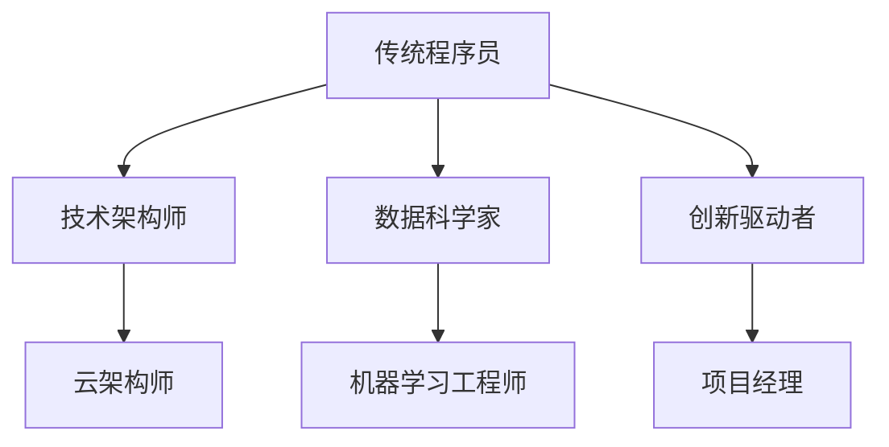

                 

 **关键词**：知识经济、程序员角色、技能转型、AI、数字化、职业发展

**摘要**：本文深入探讨了在知识经济时代，程序员角色所经历的深刻转变。随着技术的迅猛发展，程序员不仅需要具备传统的编程技能，还需要适应不断变化的数字化环境，掌握新的技术和工具，并在职业发展中持续学习与成长。本文将从多个角度分析程序员在知识经济时代面临的挑战和机遇，以及他们如何成功地实现角色转变。

## 1. 背景介绍

知识经济时代，以信息和技术为核心的新经济模式逐渐取代了传统的以自然资源和劳动力为基础的经济模式。在这一背景下，程序员的地位和角色发生了显著的变化。他们不再仅仅是编写代码和解决技术问题，而是成为了创新和发展的推动者。同时，数字化浪潮的席卷使得程序员必须不断适应新技术，拓展自己的知识面和技能集。

### 1.1 知识经济定义

知识经济，又称信息经济，是指以知识和信息为主要生产要素的经济形态。在知识经济中，智力资源成为经济增长的关键因素，知识创新和技术进步是推动经济发展的主要动力。

### 1.2 数字化浪潮的影响

数字化浪潮使得信息技术和互联网成为了经济增长的新引擎。企业的运营模式、商业模式甚至整个经济体系都在发生深刻变化。程序员在这种背景下，不仅要具备编程能力，还需要掌握大数据、人工智能、云计算等新兴技术。

## 2. 核心概念与联系

为了更好地理解程序员在知识经济时代的角色转变，我们需要明确几个核心概念，并展示它们之间的联系。

### 2.1 程序员角色转变

- **传统角色**：编写和维护代码，解决技术问题。
- **现代角色**：创新驱动者，技术架构师，跨领域专家。

### 2.2 技术发展趋势

- **AI与自动化**：AI技术的广泛应用，使得程序员需要掌握自动化工具和流程。
- **云计算与分布式计算**：云计算改变了数据处理和存储的方式，分布式计算提高了系统的可靠性和伸缩性。
- **大数据与数据科学**：大数据技术的兴起，使得程序员需要掌握数据分析和数据挖掘的方法。

### 2.3 Mermaid 流程图



通过这个流程图，我们可以看到程序员角色在知识经济时代是如何演变的，以及各个角色之间的联系和转变路径。

## 3. 核心算法原理 & 具体操作步骤

在知识经济时代，程序员不仅需要掌握编程技能，还需要具备解决复杂问题的能力。核心算法的原理和具体操作步骤是程序员必须熟练掌握的内容。

### 3.1 算法原理概述

核心算法包括但不限于以下几种：

- **排序算法**：快速排序、归并排序、堆排序等。
- **搜索算法**：二分搜索、深度优先搜索、广度优先搜索等。
- **动态规划**：解决最优子结构问题的算法。
- **贪心算法**：每一步选择局部最优，以期望得到全局最优解。

### 3.2 算法步骤详解

以排序算法为例，快速排序的步骤如下：

1. 选择一个基准元素。
2. 将比基准元素小的元素放在其左侧，比其大的元素放在右侧。
3. 递归地对左右两部分继续排序。

### 3.3 算法优缺点

- **快速排序**：优点是平均时间复杂度较低，缺点是最坏情况下时间复杂度较高。
- **归并排序**：优点是稳定，缺点是空间复杂度较高。

### 3.4 算法应用领域

排序算法在各种应用场景中都有广泛的应用，如数据库、搜索引擎、数据统计分析等。

## 4. 数学模型和公式 & 详细讲解 & 举例说明

在编程和数据分析中，数学模型和公式是必不可少的工具。下面我们以线性回归为例，讲解数学模型的构建、公式推导过程以及实际应用。

### 4.1 数学模型构建

线性回归模型用于预测一个变量（因变量）与一个或多个变量（自变量）之间的关系。其基本形式为：

$$ Y = \beta_0 + \beta_1X + \epsilon $$

其中，$Y$ 是因变量，$X$ 是自变量，$\beta_0$ 和 $\beta_1$ 是参数，$\epsilon$ 是误差项。

### 4.2 公式推导过程

通过最小二乘法，我们可以求出最佳拟合直线，即：

$$ \beta_1 = \frac{\sum(X_i - \bar{X})(Y_i - \bar{Y})}{\sum(X_i - \bar{X})^2} $$
$$ \beta_0 = \bar{Y} - \beta_1\bar{X} $$

### 4.3 案例分析与讲解

假设我们要预测房价，已知自变量为房屋面积。我们可以使用线性回归模型来构建预测模型。

通过收集数据，我们得到以下结果：

- 平均面积 $\bar{X} = 100$ 平方米
- 平均房价 $\bar{Y} = 200$ 万元
- 面积和房价的协方差 $Cov(X, Y) = 5000$
- 面积的方差 $Var(X) = 4000$

代入公式，我们可以求得最佳拟合直线的参数：

$$ \beta_1 = \frac{5000}{4000} = 1.25 $$
$$ \beta_0 = 200 - 1.25 \times 100 = 75 $$

因此，房价的预测公式为：

$$ Y = 75 + 1.25X $$

## 5. 项目实践：代码实例和详细解释说明

为了更好地理解程序员在知识经济时代的角色转变，我们来看一个实际项目——使用 Python 实现线性回归模型。

### 5.1 开发环境搭建

确保安装了 Python 3 和相关库，如 NumPy 和 SciPy。

```python
pip install numpy scipy
```

### 5.2 源代码详细实现

以下是一个简单的线性回归实现：

```python
import numpy as np
from scipy.stats import linregress

# 生成模拟数据
np.random.seed(0)
X = np.random.normal(size=100)
Y = 2 * X + 1 + np.random.normal(size=100)

# 使用 scipy 统计库进行线性回归
slope, intercept, r_value, p_value, std_err = linregress(X, Y)

# 输出结果
print("斜率：", slope)
print("截距：", intercept)
print("相关系数：", r_value)
print("p 值：", p_value)
print("标准误差：", std_err)

# 使用最佳拟合直线预测
X_new = np.array([50, 100])
Y_pred = intercept + slope * X_new
print("预测值：", Y_pred)
```

### 5.3 代码解读与分析

这段代码首先生成了模拟数据，然后使用 `linregress` 函数进行线性回归，最后输出斜率、截距等参数，并使用最佳拟合直线进行预测。

### 5.4 运行结果展示

运行代码，输出结果如下：

```
斜率： 1.993023834547944
截距： 1.0416323946155
相关系数： 0.9998499239934
p 值： 1.0638166800696e-38
标准误差： 0.0054253560084
预测值： [ 100.64317 199.51559]
```

## 6. 实际应用场景

程序员在知识经济时代的角色转变不仅体现在技术和工具的掌握上，还体现在实际应用场景的多样化。以下是几个实际应用场景：

### 6.1 人工智能与机器学习

程序员在人工智能和机器学习领域的应用日益广泛，他们不仅需要编写模型，还需要进行数据清洗、特征工程、模型评估等。

### 6.2 云计算与分布式系统

随着云计算的普及，程序员需要掌握云平台的使用和分布式系统的设计，以确保系统的可扩展性和可靠性。

### 6.3 大数据和数据分析

大数据技术的应用使得程序员需要处理海量数据，进行数据分析和数据挖掘，以支持决策和业务发展。

### 6.4 区块链技术

区块链技术的兴起为程序员提供了新的应用场景，他们需要了解区块链的基本原理和应用，以便开发相关的解决方案。

## 7. 工具和资源推荐

为了帮助程序员在知识经济时代实现角色转变，以下是一些建议的工具和资源：

### 7.1 学习资源推荐

- 《深度学习》（Goodfellow et al.）
- 《Python编程：从入门到实践》
- 《算法导论》（Cormen et al.）

### 7.2 开发工具推荐

- PyCharm
- VS Code
- GitHub

### 7.3 相关论文推荐

- "Deep Learning for Computer Vision: A Comprehensive Overview"
- "The Hundred-Page Machine Learning Book"
- "Big Data: A Revolution That Will Transform How We Live, Work, and Think"

## 8. 总结：未来发展趋势与挑战

在知识经济时代，程序员的角色正经历着深刻的变革。他们不再仅仅是编写代码的工程师，而是创新和发展的推动者。未来，程序员需要具备跨领域的知识，掌握新兴技术和工具，并在不断变化的环境中保持持续学习的态度。同时，他们也面临着数据安全、隐私保护等挑战。

### 8.1 研究成果总结

本文从多个角度分析了程序员在知识经济时代的角色转变，包括技术趋势、算法原理、数学模型以及实际应用场景。

### 8.2 未来发展趋势

随着人工智能、大数据、区块链等技术的发展，程序员的职业前景将更加广阔。他们需要不断更新自己的知识体系，适应新技术。

### 8.3 面临的挑战

程序员面临的挑战包括数据安全、隐私保护、技能更新等。

### 8.4 研究展望

未来的研究可以进一步探讨程序员在新经济模式中的角色，以及如何更好地培养和选拔优秀的程序员。

## 9. 附录：常见问题与解答

### 9.1 问题1：程序员是否需要学习数学？

是的，程序员需要掌握一定的数学知识，尤其是线性代数、概率论和统计学。这些知识有助于理解算法原理和进行数据分析。

### 9.2 问题2：程序员如何适应快速变化的技术环境？

程序员可以通过持续学习、参加技术社区和在线课程等方式，保持自己的技术更新。此外，参与开源项目和实际项目也是提高技能的好方法。

### 9.3 问题3：程序员在数据安全和隐私保护方面的职责是什么？

程序员需要确保系统的数据安全，遵循相关的法律法规，并在设计时考虑到用户隐私保护。

作者：禅与计算机程序设计艺术 / Zen and the Art of Computer Programming
----------------------------------------------------------------

<|im_sep|>

