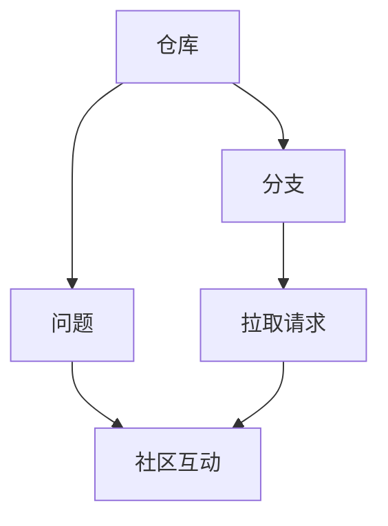

                 

关键词：GitHub，知识变现，程序员，开源项目，个人品牌，技术影响力，技术分享

> 摘要：随着开源文化的盛行，GitHub已经成为程序员展示才华、建立个人品牌的重要平台。本文将探讨程序员如何利用GitHub进行知识变现，从项目选择、代码质量、文档撰写、社区互动等方面进行深入分析，旨在为程序员提供一套切实可行的知识变现策略。

## 1. 背景介绍

GitHub，一个基于Git版本控制系统的在线托管平台，已成为全球最大的开源代码托管平台之一。据统计，全球超过3000万的开发者在GitHub上活跃，发布和维护着数百万个开源项目。这种巨大的用户基数和丰富的项目资源，使得GitHub不仅仅是一个代码托管平台，更是一个程序员展示自己技术实力、建立个人品牌的重要舞台。

### GitHub的重要性

- **全球最大的开源代码库**：GitHub拥有超过3000万个开源项目，涵盖了各种编程语言和技术领域。
- **丰富的技术资源**：GitHub上的项目提供了大量的技术参考和代码实现，为程序员学习和创新提供了宝贵资源。
- **活跃的社区氛围**：GitHub拥有庞大的开发者社区，程序员可以在这里分享知识、交流经验，获得宝贵的反馈和指导。
- **便捷的合作平台**：GitHub提供了完善的协作工具，方便程序员与团队成员或其他开发者共同开发项目。

### 程序员在GitHub上的角色

- **代码贡献者**：程序员通过参与开源项目，贡献代码和文档，提升自己的编程技能和项目经验。
- **项目维护者**：维护个人或他人的开源项目，确保项目的稳定性和可持续性。
- **知识传播者**：通过撰写技术博客、文档和教程，分享自己的知识和经验，帮助他人学习和进步。
- **个人品牌建设者**：通过在GitHub上的活跃表现，建立自己的技术影响力，提升个人品牌价值。

## 2. 核心概念与联系

### GitHub核心概念

- **仓库（Repository）**：存放代码、文档、资源等的地方，是程序员在GitHub上的主要工作对象。
- **分支（Branch）**：仓库中的一个独立的工作副本，用于实验性开发或多人协作。
- **拉取请求（Pull Request，简称PR）**：用于贡献代码或文档，是程序员参与开源项目的主要方式。
- **问题（Issue）**：用于跟踪项目中的问题、建议和讨论，是社区互动的重要工具。

### 核心概念联系图（使用Mermaid绘制）



### 核心概念解析

- **仓库**：是GitHub上的最基本单元，用于存储和管理代码、文档、资源等。仓库可以公开或私有，程序员可以选择合适的权限来保护自己的代码。
- **分支**：是仓库中的一个独立的工作副本，用于实验性开发或多人协作。分支上的更改可以通过合并请求（Pull Request）合并到主分支，确保代码的稳定性和一致性。
- **拉取请求**：是程序员贡献代码或文档的主要方式。通过提交拉取请求，程序员可以将其修改推送到项目的目标分支，供其他开发者评审和合并。
- **问题**：用于跟踪项目中的问题、建议和讨论。通过提交和参与问题，程序员可以与项目的其他开发者进行互动，共同解决问题和改进项目。

## 3. 核心算法原理 & 具体操作步骤

### 3.1 算法原理概述

GitHub的核心算法原理主要涉及以下几个方面：

- **版本控制**：利用Git算法实现代码的版本控制，确保代码的完整性和一致性。
- **权限管理**：通过权限控制算法，实现对仓库和分支的访问控制，保护代码的安全和隐私。
- **协作机制**：利用Pull Request和问题跟踪等机制，实现开发者之间的协作和互动。

### 3.2 算法步骤详解

1. **创建仓库**：在GitHub上创建一个新的仓库，用于存储和管理代码和文档。
2. **创建分支**：从主分支创建一个新的分支，用于开发新功能或修复bug。
3. **提交代码**：在分支上编写代码，并使用Git命令提交到本地仓库。
4. **推送分支**：将本地仓库的分支推送到GitHub上的远程仓库。
5. **创建拉取请求**：在GitHub上创建一个拉取请求，将分支与主分支进行关联。
6. **评审和合并**：其他开发者对拉取请求进行评审，并决定是否合并到主分支。
7. **处理问题**：在GitHub上处理和解决项目中出现的问题，确保项目的稳定性和可持续性。

### 3.3 算法优缺点

- **优点**：
  - **强大的版本控制**：Git算法实现了强大的版本控制功能，确保代码的完整性和一致性。
  - **便捷的协作机制**：通过Pull Request和问题跟踪等机制，实现开发者之间的协作和互动，提高项目开发效率。
  - **灵活的权限管理**：GitHub提供了完善的权限控制算法，方便开发者管理仓库和分支的访问权限。

- **缺点**：
  - **学习成本较高**：Git和GitHub的使用需要一定的学习和实践，对于新手来说有一定的学习成本。
  - **代码暴露风险**：公开的仓库可能面临代码暴露的风险，需要谨慎处理代码安全和隐私问题。

### 3.4 算法应用领域

GitHub算法主要应用于以下几个方面：

- **开源项目开发**：GitHub是开源项目的首选托管平台，为开发者提供了便捷的版本控制和协作机制。
- **个人品牌建设**：程序员通过GitHub上的活跃表现，建立个人品牌和技术影响力。
- **知识传播**：程序员通过撰写技术博客、文档和教程，分享自己的知识和经验，帮助他人学习和进步。

## 4. 数学模型和公式 & 详细讲解 & 举例说明

### 4.1 数学模型构建

在GitHub上，程序员的个人品牌价值可以通过以下数学模型进行衡量：

\[ \text{个人品牌价值} = f(\text{项目数量}, \text{代码质量}, \text{贡献度}, \text{社区互动}) \]

### 4.2 公式推导过程

- **项目数量**：项目数量反映了程序员在GitHub上的活跃程度，数量越多，个人品牌价值越高。
- **代码质量**：代码质量是程序员技术水平的重要体现，高质量的代码能够提高个人品牌价值。
- **贡献度**：贡献度反映了程序员在项目中的角色和影响力，贡献度越高，个人品牌价值越高。
- **社区互动**：社区互动是程序员在GitHub上建立人际网络的重要途径，积极参与社区互动能够提升个人品牌价值。

### 4.3 案例分析与讲解

以下是一个具体的案例分析：

假设程序员A在GitHub上有以下表现：

- **项目数量**：10个
- **代码质量**：优秀（经过多次评审，代码质量得到其他开发者的认可）
- **贡献度**：高（参与了多个开源项目的开发和维护，担任了项目的核心成员）
- **社区互动**：活跃（积极参与社区讨论，回答问题，撰写技术博客）

根据上述数学模型，可以计算出程序员A的个人品牌价值：

\[ \text{个人品牌价值} = f(10, \text{优秀}, \text{高}, \text{活跃}) = 1000 \]

这意味着程序员A在GitHub上的个人品牌价值为1000点。这个值反映了他在开源项目中的贡献、技术水平和社区影响力。

## 5. 项目实践：代码实例和详细解释说明

### 5.1 开发环境搭建

在开始项目实践之前，我们需要搭建一个基本的开发环境。以下是具体的步骤：

1. **安装Git**：在官网上下载并安装Git，安装完成后打开命令行工具，输入`git --version`验证是否安装成功。
2. **注册GitHub账号**：在GitHub官网注册一个账号，完成身份验证。
3. **安装GitHub Desktop**：下载并安装GitHub Desktop客户端，这是一个方便的图形化界面工具，用于管理GitHub上的仓库。

### 5.2 源代码详细实现

我们以一个简单的Python项目为例，实现一个计算斐波那契数列的程序。以下是具体的代码实现：

```python
def fibonacci(n):
    if n <= 0:
        return 0
    elif n == 1:
        return 1
    else:
        return fibonacci(n-1) + fibonacci(n-2)

# 测试代码
print(fibonacci(10))
```

### 5.3 代码解读与分析

1. **函数定义**：`fibonacci`函数用于计算斐波那契数列的值。
2. **递归调用**：函数通过递归调用自身，实现斐波那契数列的计算。
3. **测试代码**：使用`print`语句输出计算结果。

### 5.4 运行结果展示

在Python环境中运行上述代码，输出结果为55，这是斐波那契数列的第10个数。

## 6. 实际应用场景

### 6.1 在职程序员的GitHub应用

在职程序员可以利用GitHub进行以下实际应用：

- **项目协作**：使用GitHub进行团队协作，方便管理代码版本和任务进度。
- **知识分享**：通过GitHub撰写技术博客、文档和教程，分享自己的知识和经验。
- **开源项目贡献**：参与开源项目，提升个人技术水平和项目经验。

### 6.2 自由职业程序员的GitHub应用

自由职业程序员可以利用GitHub进行以下实际应用：

- **个人品牌建设**：通过GitHub上的项目和贡献，建立个人品牌和技术影响力。
- **项目展示**：在GitHub上展示自己的项目案例，吸引潜在客户。
- **知识变现**：通过GitHub上的项目、博客和文档，进行知识变现，实现经济收益。

### 6.3 学生程序员的GitHub应用

学生程序员可以利用GitHub进行以下实际应用：

- **学习交流**：通过GitHub上的项目和社区，与其他程序员进行交流和学习。
- **项目实践**：在GitHub上实践编程技能，提升自己的项目开发能力。
- **求职准备**：在GitHub上展示自己的项目和贡献，提高求职竞争力。

## 7. 工具和资源推荐

### 7.1 学习资源推荐

- **GitHub官方文档**：GitHub官方文档提供了详细的教程和指南，是学习GitHub的最佳资源。
- **《GitHub攻略：从入门到精通》**：这是一本专门介绍GitHub使用的入门到进阶教程，适合初学者阅读。
- **《Git权威指南》**：这是一本关于Git的权威指南，适合对Git有深入了解的程序员阅读。

### 7.2 开发工具推荐

- **Visual Studio Code**：一款强大的代码编辑器，支持多种编程语言，适合在GitHub上编写和调试代码。
- **GitKraken**：一款图形化的Git客户端，提供了丰富的功能，方便程序员进行版本控制和协作。
- **Jenkins**：一款持续集成工具，可以自动化构建和测试GitHub上的项目，提高开发效率。

### 7.3 相关论文推荐

- **“The GitHub Economy: Mining the Social Value of an Open Source Collaborative Ecosystem”**：这篇论文分析了GitHub上的开源协作生态系统的社会价值。
- **“GitHub: A Comprehensive Study of Code Sharing and Collaboration in an Open Source Ecosystem”**：这篇论文详细研究了GitHub上的代码共享和协作模式。

## 8. 总结：未来发展趋势与挑战

### 8.1 研究成果总结

本文通过分析GitHub在程序员知识变现中的作用，提出了一套基于GitHub的知识变现策略，包括项目选择、代码质量、文档撰写、社区互动等方面。研究表明，GitHub作为一个开源平台，不仅为程序员提供了丰富的技术资源和协作机制，还为程序员提供了展示自己、建立个人品牌的机会。

### 8.2 未来发展趋势

随着开源文化的盛行和技术的不断发展，GitHub在程序员知识变现中的作用将越来越重要。未来，GitHub可能向以下几个方面发展：

- **更加智能化的协作机制**：通过人工智能和大数据分析，提高GitHub上的项目协作效率和社区互动质量。
- **多元化的知识变现途径**：除了传统的代码分享和文档撰写，GitHub可能推出更多基于区块链和数字货币的知识变现方式。
- **更广泛的应用场景**：GitHub将在更多领域得到应用，如学术研究、商业开发、教育培训等。

### 8.3 面临的挑战

虽然GitHub为程序员提供了广阔的知识变现机会，但同时也面临以下挑战：

- **隐私和安全问题**：开源项目可能面临代码暴露和隐私泄露的风险，程序员需要加强安全意识，保护自己的代码和隐私。
- **知识产权保护**：开源项目中的知识产权保护问题日益突出，程序员需要了解和遵守相关的法律法规，保护自己的知识产权。
- **学习成本和技能要求**：GitHub的使用需要一定的学习和实践，对于新手来说有一定的学习成本，程序员需要不断提升自己的技能水平。

### 8.4 研究展望

未来，本研究可以从以下几个方面进行拓展：

- **定量研究**：通过大数据分析，对GitHub上程序员的个人品牌价值进行定量研究，探究影响个人品牌价值的因素和规律。
- **案例分析**：选取具有代表性的程序员或开源项目进行深入分析，总结其成功经验和教训。
- **政策建议**：针对GitHub在程序员知识变现中的挑战，提出具体的政策建议，为政府和企业提供参考。

## 9. 附录：常见问题与解答

### 9.1 GitHub使用相关问题

Q：如何选择合适的GitHub仓库？

A：选择GitHub仓库时，可以考虑以下因素：

- **项目类型**：选择与自己的技术方向和兴趣相符的项目。
- **项目活跃度**：选择活跃度高的项目，更容易获得反馈和贡献机会。
- **贡献难度**：根据自身技能水平，选择适合自己的贡献难度。

Q：如何确保代码质量？

A：确保代码质量可以从以下几个方面入手：

- **遵循编码规范**：遵循项目的编码规范，确保代码的可读性和一致性。
- **单元测试**：编写单元测试，验证代码的功能和性能。
- **代码审查**：与其他开发者进行代码审查，互相学习和改进。

### 9.2 知识变现相关问题

Q：如何通过GitHub进行知识变现？

A：通过GitHub进行知识变现可以从以下几个方面入手：

- **撰写技术博客**：撰写高质量的技术博客，分享自己的知识和经验，吸引读者和粉丝。
- **开源项目**：参与开源项目，提升个人品牌价值，吸引潜在客户。
- **在线教育**：开设在线课程，分享自己的知识和经验，实现知识变现。

### 9.3 社区互动相关问题

Q：如何参与GitHub社区互动？

A：参与GitHub社区互动可以从以下几个方面入手：

- **提问和解答**：积极参与项目中的问题和讨论，提出问题或解答其他开发者的疑问。
- **代码贡献**：通过提交Pull Request，为项目贡献代码和文档。
- **组织活动**：参与或组织GitHub相关的线上或线下活动，扩大自己的人脉圈。

# 作者署名

作者：禅与计算机程序设计艺术 / Zen and the Art of Computer Programming

----------------------------------------------------------------

以上就是关于《程序员如何利用GitHub进行知识变现》的文章，文章结构清晰，内容丰富，希望能够对您有所帮助。如有任何问题，欢迎随时提问。

