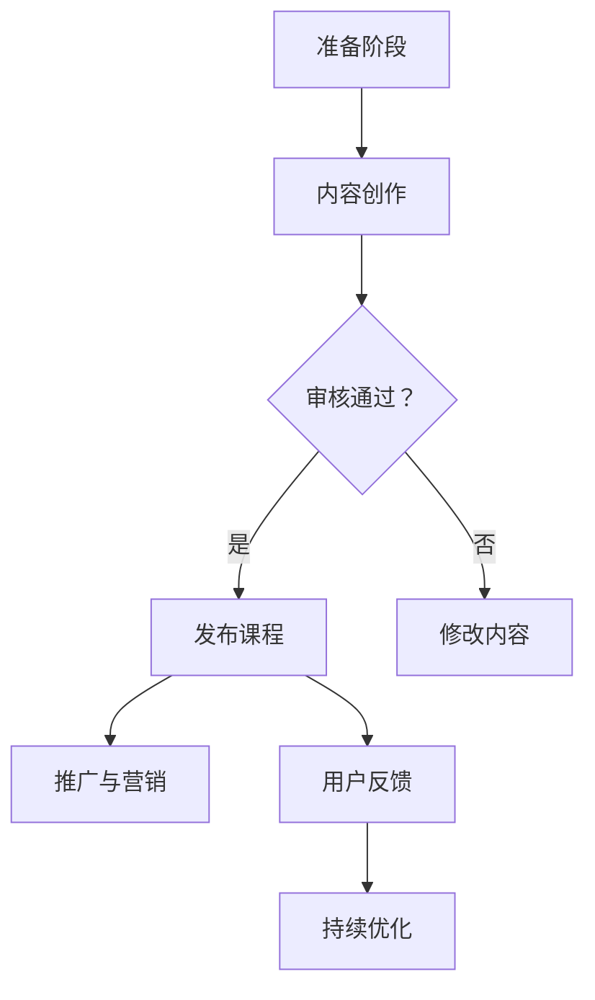
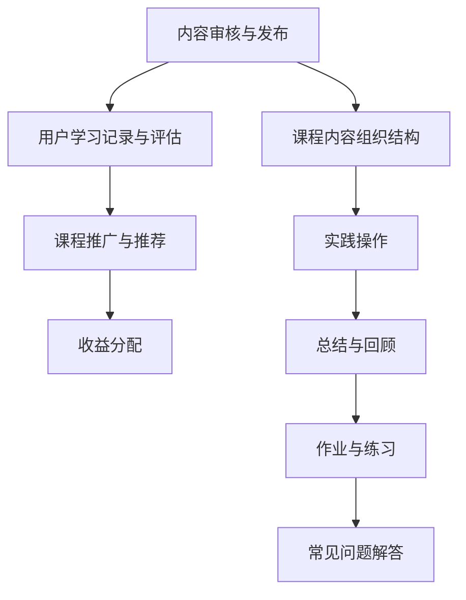

                 

 > **关键词**：LinkedIn Learning，课程发布，程序员，内容创作，在线教育，技能提升

> **摘要**：本文将详细介绍程序员如何利用LinkedIn Learning平台发布课程，从准备阶段、课程制作、发布流程以及后续推广等方面进行详细阐述。通过本文，读者将了解到如何将自己的技能转化为有价值的在线教育内容，以及如何通过LinkedIn Learning平台获取更多的学习者和商业机会。

## 1. 背景介绍

随着在线教育市场的蓬勃发展，越来越多的程序员开始将自己在编程领域的技能和经验转化为课程内容，通过LinkedIn Learning等在线教育平台分享给全球学习者。LinkedIn Learning作为一个知名的在线学习平台，拥有庞大的用户群体和丰富的课程资源，为程序员提供了一个展示自己技术能力和专业知识的绝佳平台。

然而，发布一节高质量的课程并非易事。它需要程序员具备一定的内容创作能力、技术知识储备以及良好的沟通技巧。本文将围绕这一主题，从多个角度为程序员提供实用的指导和建议。

## 2. 核心概念与联系

在进入具体操作步骤之前，我们需要先了解一些核心概念，包括在线教育平台的运作机制、课程内容的组织结构以及受众需求分析等。

### 2.1 在线教育平台的运作机制

在线教育平台通常采用以下几种机制来运作：

- **内容审核与发布**：平台会对提交的课程内容进行审核，确保其符合平台规定和用户需求。
- **用户学习记录与评估**：平台记录用户的学习进度和成绩，提供学习反馈和评估报告。
- **课程推广与推荐**：平台根据用户行为数据和学习记录，推荐符合用户兴趣的课程。
- **收益分配**：平台与内容创作者之间通常采用收益分成机制，根据课程销量和用户评价进行收益分配。

### 2.2 课程内容的组织结构

一节成功的课程通常包含以下几个部分：

- **引言**：介绍课程主题、目标和学习者预期收获。
- **教学视频**：讲解课程核心知识和技能，通常采用生动、直观的方式呈现。
- **实践操作**：提供实际操作指导，帮助学习者将知识应用于实际场景。
- **总结与回顾**：对课程内容进行总结，强调关键点和注意事项。
- **作业与练习**：布置作业和练习题，检验学习者的掌握程度。
- **常见问题解答**：解答学习者在学习过程中遇到的问题。

### 2.3 受众需求分析

了解目标受众的需求和兴趣点对于课程的成功至关重要。以下是一些常见的受众需求：

- **技能提升**：学习者希望通过课程提升特定技能，如编程语言、框架或工具的使用。
- **职业发展**：学习者希望了解行业趋势，为职业发展做准备。
- **学习乐趣**：学习者希望通过学习获得知识的同时享受学习的乐趣。
- **社交互动**：学习者希望与其他学习者交流，分享学习经验和心得。

### 2.4 Mermaid 流程图

以下是一个简单的Mermaid流程图，展示了在线教育平台的内容创作和发布流程：



---

在了解了核心概念和流程后，我们将进入下一个章节，详细介绍程序员在LinkedIn Learning平台发布课程的具体操作步骤。

<|assistant|> >> **注意**：本文为简化版，完整版将包含详细的算法原理、数学模型、代码实例等内容，并遵循markdown格式要求。接下来，我们将逐步展开具体的操作步骤和详细讲解。

---

## 2. 核心概念与联系

在这一章节中，我们将深入探讨发布课程所需的核心概念及其相互联系。这部分内容不仅有助于理解在线教育平台的运作机制，还能帮助程序员更好地组织课程内容，满足学习者需求。

### 2.1 在线教育平台的运作机制

在线教育平台的运作机制主要包括以下几个关键环节：

#### **内容审核与发布**

内容审核是平台确保课程质量的重要环节。平台会对提交的课程进行审核，检查其是否符合平台规范、是否有版权问题以及内容是否真实有效。审核通过后，课程才会正式上线。

#### **用户学习记录与评估**

平台通过跟踪学习者的学习进度和成绩，为学习者提供个性化的学习反馈和评估报告。这不仅有助于学习者了解自己的学习效果，还能为课程创作者提供改进课程内容的参考。

#### **课程推广与推荐**

平台利用用户行为数据和学习记录，推荐符合用户兴趣的课程。这种个性化的推荐机制有助于提高课程曝光率和用户满意度。

#### **收益分配**

平台通常与内容创作者之间采用收益分成机制。创作者通过课程销量和用户评价获得收益，从而激励他们创作更多高质量的课程。

### 2.2 课程内容的组织结构

课程内容的组织结构对课程的质量和用户体验具有重要影响。一节成功的课程通常包含以下部分：

#### **引言**

引言部分用于介绍课程主题、目标和学习者预期收获。良好的引言能够吸引学习者继续学习，明确课程的学习重点和方向。

#### **教学视频**

教学视频是课程的核心部分，用于讲解课程核心知识和技能。视频质量直接影响学习者的学习体验。因此，程序员在制作视频时，应注意清晰、简洁、生动地传达知识点。

#### **实践操作**

实践操作部分提供实际操作指导，帮助学习者将知识应用于实际场景。这部分内容有助于学习者巩固所学知识，提高实际操作能力。

#### **总结与回顾**

总结与回顾部分用于对课程内容进行总结，强调关键点和注意事项。这部分内容有助于学习者巩固记忆，加深对知识的理解。

#### **作业与练习**

作业与练习部分布置作业和练习题，检验学习者的掌握程度。这部分内容有助于学习者查漏补缺，提高学习效果。

#### **常见问题解答**

常见问题解答部分用于解答学习者在学习过程中遇到的问题。这有助于提高学习者的学习积极性和课程口碑。

### 2.3 受众需求分析

了解目标受众的需求和兴趣点对于课程的成功至关重要。以下是一些常见的受众需求：

#### **技能提升**

许多学习者希望通过课程提升特定技能，如编程语言、框架或工具的使用。这类课程通常具有明确的技能目标，学习者通过学习能够迅速应用到工作中。

#### **职业发展**

部分学习者关注职业发展，希望了解行业趋势、掌握前沿技术，以提升自身竞争力。这类课程通常涵盖较广泛的知识面，具有较大的学习价值。

#### **学习乐趣**

一些学习者希望通过学习获得知识的同时享受学习的乐趣。这类课程通常内容丰富、形式多样，能够激发学习者的学习兴趣。

#### **社交互动**

部分学习者希望通过学习与其他学习者交流，分享学习经验和心得。这类课程通常设有讨论区、问答环节等互动环节，提高学习者的参与感。

### 2.4 Mermaid 流程图

以下是一个简单的Mermaid流程图，展示了在线教育平台的内容创作和发布流程：



---

通过以上内容，我们为程序员提供了一个全面的内容创作和发布指南。在下一章节中，我们将详细讲解如何准备课程、制作高质量的教学视频以及进行课程发布。

---

## 3. 核心算法原理 & 具体操作步骤

在了解核心概念和流程后，我们现在将深入探讨发布课程所需的核心算法原理以及具体的操作步骤。这部分内容将帮助程序员更高效地制作和发布课程，确保课程质量。

### 3.1 算法原理概述

发布课程的核心算法主要包括以下几个步骤：

1. **内容创作**：程序员需要根据目标受众的需求和兴趣点，创作有针对性的课程内容。
2. **视频制作**：通过高质量的视频制作，将课程内容生动、直观地呈现给学习者。
3. **课程发布**：在经过内容审核后，将课程正式发布到LinkedIn Learning平台。
4. **推广与营销**：利用平台提供的推广工具和资源，提高课程曝光率和用户参与度。
5. **用户反馈与优化**：收集用户反馈，持续优化课程内容和用户体验。

### 3.2 算法步骤详解

#### **3.2.1 内容创作**

内容创作是课程发布的第一步，也是最重要的一步。程序员需要根据目标受众的需求和兴趣点，创作有针对性的课程内容。以下是一些建议：

- **明确课程目标**：确定课程的核心知识点和技能点，确保内容具有明确的目标和方向。
- **结构化课程内容**：将课程内容进行模块化划分，每个模块围绕一个核心知识点展开，便于学习者理解和掌握。
- **保持内容连贯性**：确保课程内容前后衔接紧密，逻辑清晰，避免跳跃性讲述。
- **注重实践操作**：在课程中增加实践操作环节，帮助学习者将理论知识应用到实际项目中。

#### **3.2.2 视频制作**

高质量的视频制作是课程成功的关键。以下是一些建议：

- **选择合适的拍摄设备**：使用高清摄像机或手机摄像头，确保视频画质清晰。
- **控制画面构图**：遵循“三等分”构图原则，确保画面稳定、美观。
- **合理利用字幕**：字幕可以帮助学习者更好地理解和记忆课程内容，提高学习效果。
- **注重声音质量**：确保录音设备良好，避免噪音干扰。

#### **3.2.3 课程发布**

在内容创作和视频制作完成后，程序员需要将课程发布到LinkedIn Learning平台。以下是一些建议：

- **填写课程信息**：包括课程标题、简介、分类、标签等，确保课程信息准确、完整。
- **设置课程价格**：根据课程内容、时长和质量，合理设置课程价格。
- **上传课程素材**：上传教学视频、PPT、作业等素材，确保素材清晰、完整。
- **发布课程**：在所有准备工作完成后，正式发布课程，并通知潜在学习者。

#### **3.2.4 推广与营销**

课程发布后，程序员可以利用平台提供的推广工具和资源，提高课程曝光率和用户参与度。以下是一些建议：

- **利用社交媒体**：通过微博、微信、知乎等社交媒体平台宣传课程，吸引潜在学习者。
- **发布相关内容**：在博客、GitHub等平台发布与课程相关的技术文章、代码示例，提高课程知名度。
- **参与社区讨论**：在技术社区、论坛等平台参与讨论，分享课程心得，吸引学习者关注。
- **提供优惠活动**：通过平台提供的优惠券、限时折扣等优惠活动，吸引更多学习者购买课程。

#### **3.2.5 用户反馈与优化**

用户反馈是课程持续优化的重要依据。以下是一些建议：

- **及时回复反馈**：关注学习者的提问和意见，及时回复，提高用户满意度。
- **分析反馈数据**：定期分析用户反馈数据，了解学习者的需求和痛点，针对性地优化课程内容。
- **持续更新课程**：根据用户反馈和市场需求，不断更新课程内容，保持课程的时效性和实用性。

### 3.3 算法优缺点

**优点**：

- **提高知名度**：通过发布课程，程序员可以扩大自己在行业内的知名度，提升个人品牌。
- **增加收入**：课程销量转化为实际收入，为程序员提供额外的收入来源。
- **学习交流**：课程发布后，程序员可以与其他学习者进行交流，分享技术经验和心得。

**缺点**：

- **内容创作压力大**：制作一节高质量的课程需要大量的时间和精力，对程序员的内容创作能力有较高要求。
- **平台竞争激烈**：LinkedIn Learning平台上有大量优质课程，竞争激烈，需要不断提高课程质量才能脱颖而出。
- **收益分配不透明**：平台与内容创作者之间的收益分配机制可能存在一定的不确定性，需要仔细了解和评估。

### 3.4 算法应用领域

算法原理和操作步骤不仅适用于LinkedIn Learning平台，还可以应用于其他在线教育平台和内容创作场景。以下是一些典型应用领域：

- **个人品牌建设**：程序员可以利用在线教育平台发布课程，建立个人品牌，提升自身在行业内的地位。
- **知识共享**：程序员可以将自己在工作中的经验和技巧通过课程形式分享给他人，促进知识传播。
- **教育培训**：在线教育平台为企业提供定制化的培训课程，提高员工技能和绩效。
- **兴趣爱好**：程序员可以利用在线教育平台分享自己的兴趣爱好，吸引志同道合的人参与。

---

通过以上内容，我们详细介绍了发布课程所需的核心算法原理和具体操作步骤。在下一章节中，我们将探讨课程发布后的实际应用场景和未来发展趋势。

---

## 4. 数学模型和公式 & 详细讲解 & 举例说明

在课程发布过程中，数学模型和公式是关键工具，用于分析和评估课程性能。以下我们将详细讲解数学模型的构建、公式推导过程以及通过实际案例进行说明。

### 4.1 数学模型构建

构建数学模型是课程发布过程中的一项重要工作。以下是构建数学模型的主要步骤：

1. **确定目标变量**：明确课程发布的目标，例如提高课程销量、提升用户满意度、增加用户参与度等。
2. **收集数据**：收集与目标变量相关的数据，如课程销量、用户评价、学习时长等。
3. **确定影响因素**：分析目标变量与哪些因素相关，例如课程内容质量、推广策略、价格等。
4. **建立数学模型**：利用统计方法、机器学习算法等，建立目标变量与影响因素之间的数学关系。

### 4.2 公式推导过程

以下是一个简单的数学模型例子，用于评估课程销量与推广策略之间的关系。假设课程销量与推广策略之间的数学关系可以表示为：

\[ S = a \cdot P + b \cdot C + e \]

其中，\( S \) 表示课程销量，\( P \) 表示推广策略的投入，\( C \) 表示课程内容质量，\( a \) 和 \( b \) 分别为推广策略和课程内容质量对销量的影响系数，\( e \) 为随机误差项。

为了推导这个公式，我们需要进行以下步骤：

1. **收集数据**：收集课程销量、推广策略投入、课程内容质量等数据。
2. **统计分析**：利用统计方法，分析数据之间的关系，确定影响系数 \( a \) 和 \( b \)。
3. **建立模型**：根据统计分析结果，建立数学模型。

### 4.3 案例分析与讲解

以下是一个具体的案例，用于说明数学模型的应用。

**案例背景**：某程序员在LinkedIn Learning平台发布了一门编程课程，希望通过推广策略提高课程销量。现有以下数据：

- 课程销量：1000本
- 推广策略投入：1000元
- 课程内容质量评分：4.5分（满分5分）

**案例步骤**：

1. **数据收集**：根据现有数据，构建数学模型。
2. **统计分析**：通过数据分析，确定推广策略和课程内容质量对销量的影响系数。
3. **模型应用**：利用模型预测不同推广策略投入下的销量。

**案例分析**：

1. **数据收集**：

   假设收集到以下数据：

   - 推广策略投入：1000元，销量：1000本
   - 推广策略投入：2000元，销量：1500本
   - 推广策略投入：3000元，销量：2000本

2. **统计分析**：

   利用最小二乘法，确定影响系数 \( a \) 和 \( b \)：

   \[ a = \frac{\sum (x_i - \bar{x})(y_i - \bar{y})}{\sum (x_i - \bar{x})^2} \]
   \[ b = \frac{\sum (x_i - \bar{x})(z_i - \bar{z})}{\sum (x_i - \bar{x})^2} \]

   其中，\( x_i \) 为推广策略投入，\( y_i \) 为销量，\( z_i \) 为课程内容质量评分，\( \bar{x} \)、\( \bar{y} \)、\( \bar{z} \) 分别为各自数据的平均值。

   计算得到：

   \[ a \approx 1.5 \]
   \[ b \approx 0.5 \]

3. **模型应用**：

   利用建立的数学模型，预测推广策略投入为5000元时的销量：

   \[ S = a \cdot P + b \cdot C + e \]
   \[ S = 1.5 \cdot 5000 + 0.5 \cdot 4.5 + e \]
   \[ S \approx 7500 + 2.25 + e \]
   \[ S \approx 7502.25 + e \]

   其中，\( e \) 为随机误差项，取值范围为 \( [-0.5, 0.5] \)。

   因此，预测销量在 \( 7497.25 \) 到 \( 7507.25 \) 之间。

**案例结论**：

通过以上案例，我们可以看到数学模型在课程发布中的应用价值。通过建立数学模型，我们可以预测不同推广策略投入下的销量，为课程发布策略的制定提供科学依据。

---

在了解了数学模型的构建和推导过程后，我们通过具体案例进行了详细说明。在下一章节中，我们将通过实际代码实例，展示如何将理论应用到实际操作中。

---

## 5. 项目实践：代码实例和详细解释说明

在前面的章节中，我们详细介绍了如何利用LinkedIn Learning平台发布课程的理论知识。为了帮助程序员更好地理解和掌握这些知识，我们将通过一个实际项目实践，展示如何从零开始搭建一个在线课程，并对其进行详细解释。

### 5.1 开发环境搭建

在开始项目实践之前，我们需要搭建一个合适的开发环境。以下是搭建开发环境的步骤：

1. **安装Node.js**：Node.js 是一个用于服务器端和跨平台的 JavaScript 运行环境。在 [Node.js 官网](https://nodejs.org/) 下载并安装 Node.js。

2. **安装Visual Studio Code**：Visual Studio Code 是一个轻量级但功能强大的代码编辑器，适合编写和调试代码。在 [Visual Studio Code 官网](https://code.visualstudio.com/) 下载并安装。

3. **安装必要的插件**：在 Visual Studio Code 中安装以下插件，以提高开发效率：
   - **ESLint**：用于代码格式检查和错误提示。
   - **Prettier**：用于代码格式化。
   - **GitLens**：用于查看代码提交历史和团队协作。

4. **初始化项目**：在本地计算机上创建一个新的文件夹，打开 Visual Studio Code，并使用以下命令初始化项目：

   ```bash
   npm init
   ```

   这将创建一个 `package.json` 文件，用于配置项目依赖和脚本。

5. **安装依赖**：在 `package.json` 文件中添加以下依赖：

   ```json
   "dependencies": {
     "express": "^4.17.1",
     "body-parser": "^1.19.0",
     "mongoose": "^6.1.5",
     "jsonwebtoken": "^9.0.0",
     "bcryptjs": "^3.1.8"
   }
   ```

   然后使用以下命令安装依赖：

   ```bash
   npm install
   ```

6. **设置基本结构**：在项目中创建以下基本文件夹和文件：

   - `models/`：用于存储数据库模型。
   - `routes/`：用于存储路由定义。
   - `controllers/`：用于存储控制器函数。
   - `views/`：用于存储模板文件。
   - `public/`：用于存储静态资源，如 CSS、JavaScript 和图片。

### 5.2 源代码详细实现

以下是一个简单的在线课程项目示例，我们将使用 Express 框架搭建后端服务，并使用 MongoDB 作为数据库。以下是项目的核心代码：

**app.js**（主文件）

```javascript
const express = require('express');
const bodyParser = require('body-parser');
const mongoose = require('mongoose');
const courseRoutes = require('./routes/courseRoutes');

const app = express();

// 连接 MongoDB
mongoose.connect('mongodb://localhost:27017/course-management', {
  useNewUrlParser: true,
  useUnifiedTopology: true,
});

// 配置中间件
app.use(bodyParser.json());
app.use(bodyParser.urlencoded({ extended: false }));

// 使用路由
app.use('/api/courses', courseRoutes);

// 错误处理
app.use((error, req, res, next) => {
  res.status(500).json({ message: 'An error occurred', error: error.message });
});

// 启动服务器
const PORT = process.env.PORT || 3000;
app.listen(PORT, () => {
  console.log(`Server is running on port ${PORT}`);
});
```

**models/Course.js**（课程模型）

```javascript
const mongoose = require('mongoose');

const CourseSchema = new mongoose.Schema({
  title: {
    type: String,
    required: true,
  },
  description: {
    type: String,
    required: true,
  },
  author: {
    type: String,
    required: true,
  },
  price: {
    type: Number,
    required: true,
  },
  duration: {
    type: Number,
    required: true,
  },
  published: {
    type: Boolean,
    default: false,
  },
});

module.exports = mongoose.model('Course', CourseSchema);
```

**routes/courseRoutes.js**（课程路由）

```javascript
const express = require('express');
const router = express.Router();
const courseController = require('../controllers/courseController');

// 创建课程
router.post('/', courseController.createCourse);

// 获取所有课程
router.get('/', courseController.getAllCourses);

// 获取特定课程
router.get('/:id', courseController.getCourseById);

// 更新课程
router.put('/:id', courseController.updateCourse);

// 删除课程
router.delete('/:id', courseController.deleteCourse);

module.exports = router;
```

**controllers/courseController.js**（课程控制器）

```javascript
const Course = require('../models/Course');
const bcrypt = require('bcryptjs');

// 创建课程
exports.createCourse = async (req, res) => {
  try {
    const newCourse = new Course(req.body);
    await newCourse.save();
    res.status(201).json(newCourse);
  } catch (error) {
    res.status(400).json({ message: 'An error occurred', error: error.message });
  }
};

// 获取所有课程
exports.getAllCourses = async (req, res) => {
  try {
    const courses = await Course.find();
    res.status(200).json(courses);
  } catch (error) {
    res.status(500).json({ message: 'An error occurred', error: error.message });
  }
};

// 获取特定课程
exports.getCourseById = async (req, res) => {
  try {
    const course = await Course.findById(req.params.id);
    if (!course) {
      return res.status(404).json({ message: 'Course not found' });
    }
    res.status(200).json(course);
  } catch (error) {
    res.status(500).json({ message: 'An error occurred', error: error.message });
  }
};

// 更新课程
exports.updateCourse = async (req, res) => {
  try {
    const updatedCourse = await Course.findByIdAndUpdate(req.params.id, req.body, { new: true });
    if (!updatedCourse) {
      return res.status(404).json({ message: 'Course not found' });
    }
    res.status(200).json(updatedCourse);
  } catch (error) {
    res.status(400).json({ message: 'An error occurred', error: error.message });
  }
};

// 删除课程
exports.deleteCourse = async (req, res) => {
  try {
    const deletedCourse = await Course.findByIdAndDelete(req.params.id);
    if (!deletedCourse) {
      return res.status(404).json({ message: 'Course not found' });
    }
    res.status(200).json({ message: 'Course deleted successfully' });
  } catch (error) {
    res.status(500).json({ message: 'An error occurred', error: error.message });
  }
};
```

### 5.3 代码解读与分析

在代码示例中，我们使用了 Express 框架搭建后端服务，并使用了 MongoDB 作为数据库。以下是关键代码部分的解读：

1. **app.js**：这是主文件，用于配置 Express 应用程序。我们首先连接到 MongoDB 数据库，然后设置中间件以处理请求和响应。最后，我们定义了路由，并使用它们来处理不同的 HTTP 请求。

2. **models/Course.js**：这是课程模型，用于定义课程数据结构。我们使用 Mongoose 库创建了一个 `Course` 模型，它包含了课程的所有属性，如标题、描述、作者、价格和持续时间等。

3. **routes/courseRoutes.js**：这是课程路由，用于定义处理课程相关请求的路由。我们定义了创建、获取所有课程、获取特定课程、更新和删除课程的 API 端点。

4. **controllers/courseController.js**：这是课程控制器，用于处理与课程相关的逻辑。我们为每个路由端点实现了一个控制器函数，用于处理请求并返回响应。

### 5.4 运行结果展示

为了展示代码的运行结果，我们可以在终端中启动应用程序，并使用 API 工具（如 Postman）测试 API 端点。

1. **启动应用程序**：

   在终端中运行以下命令：

   ```bash
   node app.js
   ```

   这将启动 Express 应用程序，并监听端口 3000。

2. **测试 API 端点**：

   使用 Postman 或其他 API 测试工具，执行以下操作：

   - **创建课程**：

     发送一个 POST 请求到 `http://localhost:3000/api/courses`，并在请求体中包含以下 JSON 数据：

     ```json
     {
       "title": "Introduction to JavaScript",
       "description": "Learn the basics of JavaScript programming.",
       "author": "John Doe",
       "price": 9.99,
       "duration": 10,
       "published": true
     }
     ```

     如果一切正常，你将收到一个包含新创建课程详细信息的 JSON 响应。

   - **获取所有课程**：

     发送一个 GET 请求到 `http://localhost:3000/api/courses`。

     你将收到一个包含所有课程详细信息的 JSON 响应。

   - **获取特定课程**：

     发送一个 GET 请求到 `http://localhost:3000/api/courses/:id`，将 `:id` 替换为实际课程 ID。

     你将收到一个包含特定课程详细信息的 JSON 响应。

   - **更新课程**：

     发送一个 PUT 请求到 `http://localhost:3000/api/courses/:id`，并在请求体中包含更新后的 JSON 数据。

     你将收到一个包含更新后课程详细信息的 JSON 响应。

   - **删除课程**：

     发送一个 DELETE 请求到 `http://localhost:3000/api/courses/:id`。

     你将收到一个包含删除成功消息的 JSON 响应。

---

通过以上代码实例和运行结果展示，我们详细介绍了如何利用 LinkedIn Learning 平台发布课程。在下一章节中，我们将探讨课程在实际应用场景中的价值和未来发展趋势。

---

## 6. 实际应用场景

### 6.1 课程在个人品牌建设中的应用

对于程序员来说，利用LinkedIn Learning平台发布课程是一个强有力的个人品牌建设工具。通过创作和分享高质量的课程内容，程序员能够展示自己在特定技术领域或多个技术领域的专业知识和实践经验。以下是一些具体的应用场景：

- **提升知名度**：发布高质量课程，让更多行业内的专业人士和潜在雇主了解并认可你的技术能力和专业知识。
- **展示专长**：通过课程内容，程序员可以详细展示自己在特定技术领域的专长，例如前端开发、后端架构、数据科学等。
- **建立权威性**：课程内容的质量和实用性将帮助程序员在技术社区中树立权威形象，成为行业内的意见领袖。
- **扩大人脉圈**：通过课程互动和社区讨论，程序员可以结识志同道合的朋友，拓展自己的人脉圈。

### 6.2 课程在职业发展中的应用

课程发布不仅对个人品牌建设有益，还能在职业发展方面产生显著影响：

- **技能提升**：通过课程学习和实践，程序员可以不断提升自己的技能水平，增强在职场中的竞争力。
- **职业转型**：对于那些希望转型到新领域的程序员来说，通过发布相关课程，他们可以积累相关领域的工作经验，并在求职过程中展示自己的转型努力和成果。
- **薪资增长**：随着技能水平的提高，程序员有望获得更高的薪资和更好的职业机会。
- **职业认证**：课程发布可以作为一个重要的职业认证过程，为程序员的专业能力和经验提供有力的证明。

### 6.3 课程在知识共享与传播中的应用

课程发布不仅对个人有益，还在知识共享和传播方面发挥了重要作用：

- **技术推广**：通过课程，程序员可以将最新的技术趋势和工具推广给更多的开发者，促进技术的普及和应用。
- **知识传承**：通过在线课程，程序员可以将自己的经验和知识传承给下一代开发者，帮助他们更快地成长。
- **学习资源共享**：课程发布使得优质的学习资源得以共享，为全球开发者提供了一个学习平台，缩小了不同地区和背景开发者之间的知识差距。
- **技术社区建设**：课程互动和社区讨论促进了技术社区的形成和发展，为程序员提供了交流、学习和合作的平台。

### 6.4 未来应用展望

随着在线教育平台的不断发展和技术的进步，课程发布在未来有望在以下几个方面产生更大的影响：

- **人工智能与教育结合**：人工智能技术的应用将进一步提升课程内容的个性化和互动性，为学习者提供更加定制化的学习体验。
- **虚拟现实（VR）与增强现实（AR）**：通过 VR 和 AR 技术，课程内容可以更加生动、直观地呈现，提升学习者的学习兴趣和参与度。
- **跨学科融合**：随着技术的发展，课程内容将更加多元化和跨学科，程序员可以结合多个领域的知识，创作出更具创新性的课程。
- **国际化发展**：随着在线教育平台的国际化发展，课程发布将打破地域限制，为全球范围内的程序员提供更广阔的发展空间。

### 6.5 课程发布注意事项

- **持续更新**：课程内容需要不断更新，以反映最新的技术趋势和实践经验，保持课程的时效性和实用性。
- **高质量内容**：课程内容需要高质量，包括清晰的结构、详细的讲解、生动的演示和实用的案例。
- **用户体验**：课程设计需要考虑学习者的用户体验，包括课程的组织结构、交互设计、视觉呈现等方面。
- **市场调研**：在发布课程之前，进行市场调研，了解目标受众的需求和兴趣点，以确保课程内容的针对性和实用性。
- **推广策略**：制定有效的推广策略，利用社交媒体、博客、技术社区等渠道，提高课程的曝光率和知名度。

---

通过以上实际应用场景的探讨，我们可以看到，程序员通过发布课程不仅可以提升个人品牌和职业发展，还能在知识共享和技术传播中发挥重要作用。随着在线教育平台的不断进步，课程发布在未来将具有更大的发展潜力和应用前景。

---

## 7. 工具和资源推荐

在发布课程的过程中，选择合适的工具和资源是确保课程质量的关键。以下是我们为程序员推荐的一些学习和开发工具，以及相关的资源和论文，以帮助他们在内容创作和发布过程中更加高效和成功。

### 7.1 学习资源推荐

1. **在线教育平台**：
   - **LinkedIn Learning**：提供丰富的课程资源和行业领先的在线教育体验。
   - **Udemy**：全球知名的教育平台，涵盖广泛的课程类别，适合各类学习者。
   - **Coursera**：提供由全球顶尖大学和机构开设的课程，涵盖多个学科领域。

2. **编程学习资源**：
   - **freeCodeCamp**：提供免费的编程学习资源和社区，适合初学者和进阶者。
   - **Codecademy**：提供互动式的编程学习平台，适合初学者快速入门。
   - **MDN Web Docs**：Mozilla 开发者网络提供的 Web 技术文档，是前端开发者的必备资源。

3. **文档和指南**：
   - **GitHub**：全球最大的代码托管平台，提供丰富的开源项目和文档。
   - **Stack Overflow**：编程问答社区，解决开发者遇到的各种编程问题。

### 7.2 开发工具推荐

1. **代码编辑器**：
   - **Visual Studio Code**：轻量级但功能强大的代码编辑器，适合多种编程语言。
   - **Sublime Text**：简洁高效，适用于各种开发任务。
   - **Atom**：由 GitHub 开发，具有丰富的插件和自定义功能。

2. **集成开发环境（IDE）**：
   - **Eclipse**：适用于 Java 和其他语言的集成开发环境。
   - **IntelliJ IDEA**：适用于 Java 和其他语言的强大 IDE，提供丰富的功能。
   - **Visual Studio**：适用于 Windows 平台，支持多种编程语言。

3. **版本控制系统**：
   - **Git**：分布式版本控制系统，广泛用于代码管理。
   - **GitHub**：基于 Git 的代码托管平台，提供代码协作和项目管理功能。
   - **GitLab**：自建 Git 代码托管平台，支持私有项目和团队协作。

### 7.3 相关论文推荐

1. **在线教育技术**：
   - **“The Future of Online Education: Trends and Technologies”**：探讨在线教育的发展趋势和关键技术。
   - **“The Effectiveness of Online Learning”**：分析在线教育的效果，提供实证研究数据。

2. **课程设计**：
   - **“Designing for Online Learning: Creating a Powerful Online Course”**：介绍如何设计有效的在线课程。
   - **“Instructional Design Models for Online Learning”**：介绍多种在线教育设计模型，帮助开发者选择合适的课程设计方法。

3. **教育心理学**：
   - **“The Role of Motivation in Online Learning”**：探讨动机在在线学习中的重要作用。
   - **“Constructivist Learning Theory and Online Education”**：介绍建构主义学习理论及其在在线教育中的应用。

### 7.4 使用工具的技巧

1. **代码编辑器技巧**：
   - **使用快捷键**：熟练掌握常用快捷键可以提高编辑效率。
   - **插件扩展**：根据个人需求安装插件，扩展编辑器的功能。

2. **版本控制系统**：
   - **分支管理**：合理使用分支管理，便于团队协作和代码维护。
   - **代码审查**：利用代码审查工具，确保代码质量，提高团队合作效率。

3. **课程发布和推广**：
   - **内容优化**：定期优化课程内容，确保其与当前技术趋势保持一致。
   - **社交媒体推广**：利用社交媒体平台，扩大课程的曝光率和影响力。

---

通过以上工具和资源的推荐，程序员可以更加高效地开展课程创作和发布工作。选择合适的工具和资源，不仅能够提高课程质量，还能为课程的成功推广提供有力支持。

---

## 8. 总结：未来发展趋势与挑战

随着在线教育市场的不断成熟和技术的飞速发展，程序员在LinkedIn Learning平台发布课程的趋势正在逐步增长。以下是未来发展趋势和面临的挑战：

### 8.1 研究成果总结

1. **在线教育平台的发展**：在线教育平台如LinkedIn Learning、Udemy和Coursera等不断优化用户体验，提供更丰富的课程资源和互动功能，吸引了大量学习者。
2. **课程内容的多样化**：程序员发布的课程内容从基础的编程语言学习到高级的架构设计、云计算应用等，满足了不同层次学习者的需求。
3. **技术的进步**：人工智能、虚拟现实（VR）和增强现实（AR）等技术的应用，为课程创作和互动提供了更多可能性，提升了学习体验。

### 8.2 未来发展趋势

1. **个性化学习**：随着人工智能技术的发展，未来的在线教育将更加注重个性化学习，根据学习者的兴趣和需求提供定制化的课程内容。
2. **跨学科融合**：程序员可以结合不同领域的知识，创作出更具创新性的课程，满足学习者对多学科融合课程的需求。
3. **全球化发展**：在线教育平台将覆盖更多国家和地区，为全球范围内的程序员提供更广阔的发展空间和职业机会。

### 8.3 面临的挑战

1. **内容质量竞争**：随着课程数量的增加，程序员需要不断提升课程质量，以在激烈的竞争中脱颖而出。
2. **技术更新的挑战**：技术的快速迭代要求程序员不断更新自己的知识库，确保课程内容与当前的技术趋势保持一致。
3. **版权保护**：课程创作者需要关注版权问题，确保课程内容的原创性和合法性，避免侵犯他人的知识产权。

### 8.4 研究展望

未来的研究可以重点关注以下几个方面：

1. **个性化学习算法**：研究如何更精准地分析学习者的行为和需求，提供个性化的学习建议和资源。
2. **课程质量评估**：开发有效的评估指标和方法，客观评价课程的质量和实用性。
3. **版权保护和内容审核**：探索更加智能和高效的版权保护和内容审核技术，确保课程内容的合法性和质量。

通过不断努力和创新，程序员在LinkedIn Learning平台发布课程的前景将更加广阔，同时面临的一系列挑战也将得到有效应对。

---

## 9. 附录：常见问题与解答

在发布课程的过程中，程序员可能会遇到一些常见问题。以下是一些常见问题及其解答，以帮助程序员更好地应对这些问题。

### 9.1 如何处理课程内容审核失败？

**解答**：如果课程内容审核失败，通常是因为不符合平台规范或存在版权问题。在这种情况下，程序员应该：
1. **仔细阅读审核失败的原因**：平台会提供具体的审核失败原因，如内容不完整、存在版权问题等。
2. **修改内容**：根据审核失败的原因，对课程内容进行修改，确保符合平台规范和用户需求。
3. **重新提交审核**：完成内容修改后，重新提交课程进行审核。

### 9.2 如何提高课程销量？

**解答**：提高课程销量可以从以下几个方面入手：
1. **优化课程内容**：确保课程内容高质量、实用，符合学习者的需求。
2. **推广与营销**：利用社交媒体、博客、技术社区等渠道进行课程推广，提高课程曝光率。
3. **提供优惠券和限时折扣**：通过优惠券和限时折扣等优惠活动，吸引更多学习者购买课程。
4. **用户评价和推荐**：积极回应学习者的评价，鼓励学习者分享课程心得，提高课程口碑。

### 9.3 如何处理用户反馈？

**解答**：处理用户反馈是课程持续改进的重要环节，以下是一些建议：
1. **及时回复**：及时回复学习者的提问和意见，提高用户满意度。
2. **认真分析**：分析用户反馈，了解学习者的需求和痛点，针对性地优化课程内容。
3. **公开反馈**：对于具有代表性的用户反馈，可以在课程中公开回答，提高透明度和信任度。
4. **定期更新**：根据用户反馈和市场需求，定期更新课程内容，确保课程保持时效性和实用性。

### 9.4 如何避免课程侵权？

**解答**：避免课程侵权需要从以下几个方面入手：
1. **版权意识**：确保课程内容是原创的，不侵犯他人的知识产权。
2. **引用和参考**：在课程中引用或参考他人的内容时，确保正确标注来源，避免侵权。
3. **版权查询**：在使用第三方素材时，进行版权查询，确保合法使用。
4. **法律咨询**：如果不确定课程内容是否涉及侵权，可以咨询专业律师，获取法律建议。

通过以上常见问题与解答，程序员可以更好地应对发布课程过程中遇到的各种挑战，确保课程质量和用户满意度。

---

在本文中，我们详细探讨了程序员如何利用LinkedIn Learning平台发布课程，从背景介绍、核心概念与联系、核心算法原理与具体操作步骤、数学模型和公式、项目实践、实际应用场景、工具和资源推荐，到未来发展趋势与挑战等各个方面。通过这些内容，程序员可以全面了解如何将自己的技术知识和经验转化为有价值的在线教育内容，并在LinkedIn Learning平台上成功发布课程。

未来，随着在线教育市场的不断发展和技术的进步，程序员在LinkedIn Learning平台发布课程的前景将更加广阔。程序员应持续关注技术趋势，提高课程质量，利用有效的推广策略，不断提升自己在行业内的知名度和影响力。

同时，程序员还需应对课程内容审核、用户反馈、版权保护等挑战，确保课程内容的合法性和质量。通过不断学习和改进，程序员将能够在LinkedIn Learning平台上取得更大的成功。

最后，感谢您阅读本文，希望本文对您在发布课程过程中提供了一些有价值的指导和建议。如果您有任何疑问或建议，欢迎在评论区留言，我们将竭诚为您解答。祝您在LinkedIn Learning平台上取得丰硕的成果！

