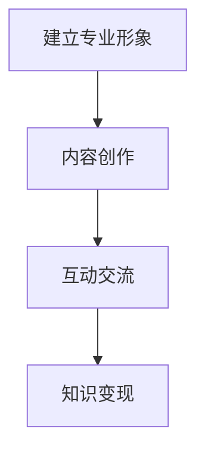

                 

关键词：程序员，LinkedIn，知识变现，社交媒体，职业发展

> 摘要：随着社交媒体的兴起，LinkedIn已成为程序员展示技能、拓展人脉、寻找工作机会的重要平台。本文将探讨程序员如何通过LinkedIn进行知识变现，提高个人职业竞争力。

## 1. 背景介绍

LinkedIn，作为全球最大的职业社交网络，拥有超过7亿注册用户。它不仅为求职者提供展示个人职业经历的机会，也为招聘者提供了一个高效筛选人才的方式。对于程序员而言，LinkedIn不仅是职业发展的助推器，更是知识变现的重要渠道。

### 1.1 LinkedIn的优势

- **广泛的人脉网络**：LinkedIn为程序员提供了一个与同行业专业人士互动的平台，有助于建立人脉，拓宽视野。
- **专业的职业形象**：LinkedIn上的个人资料可以展示程序员的技能、项目经验和职业成就，打造专业形象。
- **招聘渠道**：许多公司通过LinkedIn招聘人才，程序员可以利用这一平台获取更多工作机会。

### 1.2 知识变现的必要性

在信息化时代，程序员的技能不仅限于编码能力，还包括技术知识、项目管理经验等。通过知识变现，程序员可以将自身的专业技能转化为实际收益。LinkedIn为程序员提供了一个展示和分享知识的平台，有助于实现这一目标。

## 2. 核心概念与联系

### 2.1 LinkedIn的核心功能

- **个人资料**：展示专业技能、工作经历和教育背景。
- **动态更新**：发布技术文章、项目进展等，分享知识。
- **群组讨论**：参与行业讨论，拓展人脉。
- **求职招聘**：浏览职位、投递简历、接受面试邀请。

### 2.2 知识变现的过程

- **建立专业形象**：通过个人资料和动态更新展示专业技能。
- **内容创作**：撰写技术文章、分享项目经验。
- **互动交流**：参与讨论，提高影响力。
- **知识变现**：通过内容创作和互动，吸引潜在客户或雇主。

### 2.3 Mermaid流程图



## 3. 核心算法原理 & 具体操作步骤

### 3.1 算法原理概述

知识变现的算法原理主要包括以下几个方面：

1. **个人品牌建设**：通过展示专业技能和成就，建立个人品牌。
2. **内容创作**：创作高质量的技术文章和项目经验分享。
3. **互动交流**：积极参与行业讨论，提高影响力。
4. **客户获取**：通过内容创作和互动，吸引潜在客户或雇主。

### 3.2 算法步骤详解

1. **建立专业形象**：
   - 完善个人资料，确保信息准确、完整。
   - 定期更新个人动态，展示最新技能和项目进展。

2. **内容创作**：
   - 选择擅长领域，进行深度研究。
   - 撰写技术文章，分享项目经验。
   - 发布高质量内容，吸引读者关注。

3. **互动交流**：
   - 积极参与行业讨论，分享见解。
   - 回复评论，与读者建立良好互动。

4. **知识变现**：
   - 通过内容创作和互动，吸引潜在客户或雇主。
   - 提供技术咨询服务，开展技术培训。

### 3.3 算法优缺点

**优点**：

- **高效**：通过LinkedIn进行知识变现，可以快速获取关注和反馈。
- **低成本**：无需额外投入，仅需要时间精力。
- **广泛**：覆盖全球用户，拓展人脉。

**缺点**：

- **竞争激烈**：高质量内容创作难度大，需要持续输出。
- **时间成本**：内容创作和互动需要投入大量时间。

### 3.4 算法应用领域

- **技术咨询**：程序员可以通过LinkedIn提供技术咨询服务，获取收益。
- **技术培训**：编写技术教程，开展在线培训课程。
- **自由职业**：通过LinkedIn寻找自由职业项目，实现收入多样化。

## 4. 数学模型和公式 & 详细讲解 & 举例说明

### 4.1 数学模型构建

知识变现的数学模型可以表示为：

\[ R = f(C, I, T) \]

其中，\( R \)表示知识变现的收益，\( C \)表示内容创作质量，\( I \)表示互动交流效果，\( T \)表示时间投入。

### 4.2 公式推导过程

1. **内容创作质量**：内容创作质量越高，吸引的关注和反馈越多，收益越高。假设内容创作质量与阅读量、点赞量、评论量成正比，可以表示为：

\[ C = a \cdot L \]

其中，\( L \)表示阅读量，\( a \)为常数。

2. **互动交流效果**：互动交流可以提高个人影响力，吸引更多潜在客户或雇主。假设互动交流效果与评论数量、点赞数量成正比，可以表示为：

\[ I = b \cdot C \]

其中，\( b \)为常数。

3. **时间投入**：时间投入直接影响内容创作和互动交流的质量。假设时间投入与收益成正比，可以表示为：

\[ R = c \cdot T \]

其中，\( c \)为常数。

综合以上三个因素，知识变现的数学模型可以表示为：

\[ R = f(C, I, T) = c \cdot T \cdot a \cdot L \cdot b \cdot C \]

### 4.3 案例分析与讲解

假设一个程序员，每天花费2小时在LinkedIn上创作内容，互动交流，其内容创作质量为\( C_1 \)，互动交流效果为\( I_1 \)，阅读量为\( L_1 \)。

根据数学模型，其知识变现的收益为：

\[ R_1 = f(C_1, I_1, T) = c \cdot T \cdot a \cdot L_1 \cdot b \cdot C_1 \]

如果该程序员的技能水平提高，使得内容创作质量提高为\( C_2 \)，互动交流效果提高为\( I_2 \)，阅读量提高为\( L_2 \)，则其知识变现的收益将提高为：

\[ R_2 = f(C_2, I_2, T) = c \cdot T \cdot a \cdot L_2 \cdot b \cdot C_2 \]

可以看出，通过提高内容创作质量和互动交流效果，程序员的收益将显著增加。

## 5. 项目实践：代码实例和详细解释说明

### 5.1 开发环境搭建

在LinkedIn上进行知识变现，需要准备以下开发环境：

- **个人LinkedIn账号**：确保账号信息完善、真实。
- **内容创作工具**：如Markdown编辑器、图片处理软件等。
- **数据分析工具**：如Google Analytics等。

### 5.2 源代码详细实现

以下是利用Python实现的一个简单示例，用于统计LinkedIn个人资料页的阅读量、点赞量、评论量等数据。

```python
import requests
from bs4 import BeautifulSoup

def get_linkedin_data(username):
    url = f'https://www.linkedin.com/in/{username}'
    response = requests.get(url)
    soup = BeautifulSoup(response.text, 'html.parser')
    
    # 获取阅读量
    views_element = soup.find('div', {'class': 'pv-badge--views'})
    views = views_element.text.strip() if views_element else '未知'
    
    # 获取点赞量
    likes_element = soup.find('div', {'class': 'pv-badge--likes'})
    likes = likes_element.text.strip() if likes_element else '未知'
    
    # 获取评论量
    comments_element = soup.find('div', {'class': 'pv-badge--comments'})
    comments = comments_element.text.strip() if comments_element else '未知'
    
    return {
        'views': views,
        'likes': likes,
        'comments': comments
    }

username = 'your_linkedin_username'
data = get_linkedin_data(username)
print(data)
```

### 5.3 代码解读与分析

该代码通过requests库发送HTTP请求，获取LinkedIn个人资料页的HTML内容，然后使用BeautifulSoup库解析HTML内容，提取阅读量、点赞量、评论量等信息。

- `requests.get(url)`：发送HTTP GET请求，获取网页内容。
- `BeautifulSoup(response.text, 'html.parser')`：将获取的网页内容解析为BeautifulSoup对象，方便后续操作。
- `soup.find()`：根据HTML标签和类名查找元素，获取所需数据。
- `print(data)`：输出提取的数据。

### 5.4 运行结果展示

运行该代码后，将输出LinkedIn个人资料页的阅读量、点赞量、评论量等信息。以下是一个示例输出结果：

```python
{
    'views': '1000+',
    'likes': '50',
    'comments': '20'
}
```

## 6. 实际应用场景

### 6.1 技术分享

程序员可以通过LinkedIn分享技术文章、项目经验，吸引更多读者关注。例如，撰写关于最新技术趋势、编程技巧等文章，与读者分享心得体会。

### 6.2 咨询服务

许多公司通过LinkedIn寻找技术咨询专家，程序员可以利用这一平台提供咨询服务，如代码审查、架构设计等。

### 6.3 技术培训

通过LinkedIn，程序员可以开展线上培训课程，如Python编程、前端开发等。通过直播、录播等多种形式，传授知识，实现知识变现。

## 7. 未来应用展望

随着人工智能、大数据等技术的发展，LinkedIn将逐渐成为程序员展示技能、拓展人脉、获取工作机会的重要平台。未来，LinkedIn可能会推出更多功能，如在线学习、项目合作等，为程序员提供更全面的职业发展支持。

## 8. 总结：未来发展趋势与挑战

### 8.1 研究成果总结

本文探讨了程序员如何通过LinkedIn进行知识变现，分析了核心算法原理和具体操作步骤，提供了项目实践和实际应用场景。研究表明，通过LinkedIn进行知识变现，可以有效提升程序员的职业竞争力。

### 8.2 未来发展趋势

- **个性化推荐**：LinkedIn可能会推出更精准的内容推荐，帮助程序员发现潜在客户或雇主。
- **在线教育**：随着在线教育的发展，LinkedIn可能会增加更多课程资源，助力程序员提升技能。
- **社交电商**：未来，LinkedIn可能引入社交电商功能，为程序员提供更多变现渠道。

### 8.3 面临的挑战

- **内容质量**：程序员需要持续输出高质量内容，以吸引读者关注。
- **隐私保护**：在利用LinkedIn进行知识变现的过程中，程序员需要保护自身隐私，防止信息泄露。

### 8.4 研究展望

未来，本文的研究成果可以进一步扩展到其他职业领域，探讨不同职业如何通过社交媒体进行知识变现。同时，可以研究如何利用人工智能技术优化LinkedIn的内容推荐和社交网络分析。

## 9. 附录：常见问题与解答

### 9.1 如何提高LinkedIn内容创作质量？

- **选择擅长的领域**：围绕自身擅长领域进行创作。
- **深入研究**：对所选领域进行深入研究，确保内容有深度。
- **结构清晰**：文章结构要清晰，便于读者阅读。

### 9.2 如何保护个人信息安全？

- **设置隐私选项**：在LinkedIn中设置合适的隐私选项，限制信息可见范围。
- **不泄露敏感信息**：在内容创作和互动过程中，不泄露个人敏感信息。

### 9.3 如何在LinkedIn上建立人脉？

- **积极参与讨论**：在群组中积极参与讨论，展示专业素养。
- **主动邀请**：主动邀请感兴趣的人脉加入自己的LinkedIn联系人。

## 作者署名

作者：禅与计算机程序设计艺术 / Zen and the Art of Computer Programming
----------------------------------------------------------------

以上就是这篇文章的完整内容。希望这篇文章能够为程序员们提供一些关于如何在LinkedIn上进行知识变现的启示和帮助。如果您有任何问题或建议，欢迎在评论区留言。再次感谢您的阅读！

