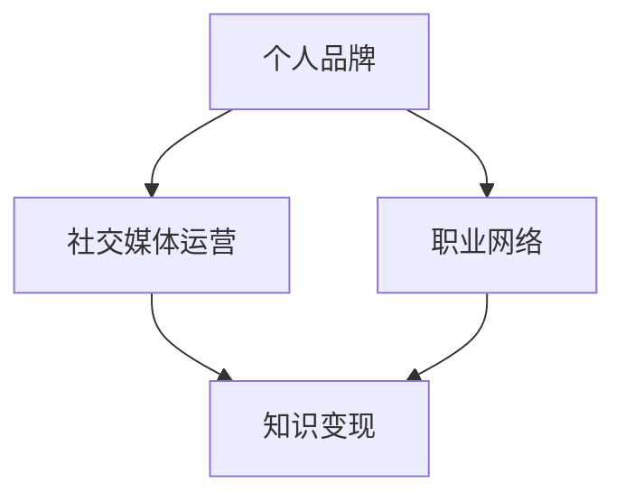

                 

关键词：LinkedIn、知识变现、程序员、网络平台、职业发展

> 摘要：本文将探讨如何利用LinkedIn这一全球领先的职业社交平台，帮助程序员们将自身知识转化为实际的经济价值。通过有效构建个人品牌、掌握社交媒体运营技巧以及积极参与行业交流，程序员们可以在LinkedIn上实现知识变现，提升个人职业竞争力。

## 1. 背景介绍

在信息技术飞速发展的今天，程序员作为技术领域的核心人才，其价值日益凸显。然而，传统的知识变现方式往往局限于项目合作、咨询服务等，这些方式的局限性使得程序员的才能和知识未能得到充分展示和利用。LinkedIn作为一个专业的社交平台，为程序员提供了一个全新的知识变现途径。

### LinkedIn的特点与优势

1. **全球用户基础**：LinkedIn拥有超过7亿的注册用户，其中大部分是专业人士，这为程序员提供了一个广阔的展示舞台。
2. **专业社交网络**：LinkedIn的用户群体以职业人士为主，这使得平台上的交流更具有专业性和针对性。
3. **功能丰富**：LinkedIn提供了丰富的功能，如职业动态、人脉拓展、内容发布等，程序员可以利用这些功能提升自身的影响力。

### 程序员面临的知识变现挑战

1. **信息过载**：随着互联网的普及，程序员面临的信息量日益增长，如何从中筛选出有价值的信息成为挑战。
2. **竞争激烈**：技术领域人才众多，程序员需要通过独特的视角和专业的知识来凸显自身价值。
3. **个人品牌建设**：如何在LinkedIn上建立个人品牌，吸引更多的关注和机会，是程序员需要解决的问题。

## 2. 核心概念与联系

为了在LinkedIn上实现知识变现，程序员需要理解几个核心概念，包括个人品牌、社交媒体运营和职业网络。

### 个人品牌

个人品牌是个人在职业领域中的独特形象和声誉。一个强大的个人品牌能够吸引更多的关注和机会，提高个人在职场中的竞争力。

### 社交媒体运营

社交媒体运营是指在社交媒体平台上进行的策略性活动，包括内容发布、互动管理、粉丝增长等。有效的社交媒体运营能够提升个人在LinkedIn上的影响力。

### 职业网络

职业网络是指个人在职场中所建立的关系网络，这些关系网络不仅能够提供职业机会，还能够为个人提供专业知识和经验的交流。

下面是利用Mermaid绘制的流程图，展示这些核心概念之间的联系：



## 3. 核心算法原理 & 具体操作步骤

### 3.1 算法原理概述

在LinkedIn上实现知识变现的核心算法是内容营销和社交互动。

1. **内容营销**：通过发布高质量的内容，吸引受众关注，建立个人品牌。
2. **社交互动**：通过积极回复评论、分享他人内容、参与讨论等方式，增强在LinkedIn上的影响力。

### 3.2 算法步骤详解

1. **内容发布**：定期发布技术文章、博客、视频等内容，分享技术见解和经验。
2. **互动管理**：回复评论，参与讨论，积极互动，建立职业网络。
3. **人脉拓展**：主动联系潜在合作伙伴和同行业人士，扩大职业网络。
4. **数据监控**：定期分析LinkedIn数据，调整内容策略和互动方式。

### 3.3 算法优缺点

**优点**：

- **广泛传播**：通过LinkedIn，程序员的知识和经验可以迅速传播到全球范围内。
- **低成本**：相较于传统广告和推广，LinkedIn上的知识变现成本较低。
- **互动性强**：LinkedIn提供了一个实时互动的平台，程序员可以与受众直接交流。

**缺点**：

- **信息过载**：LinkedIn上的信息量庞大，程序员需要筛选有价值的信息。
- **时间投入**：有效利用LinkedIn进行知识变现需要投入大量的时间和精力。

### 3.4 算法应用领域

- **技术咨询**：程序员可以通过LinkedIn提供技术咨询服务，解决企业或个人的技术难题。
- **技术培训**：程序员可以利用LinkedIn发布在线课程，传授技术知识和经验。
- **项目合作**：程序员可以通过LinkedIn寻找合适的合作伙伴，共同完成项目。

## 4. 数学模型和公式 & 详细讲解 & 举例说明

### 4.1 数学模型构建

在LinkedIn上实现知识变现的数学模型可以表示为：

\[ f(X) = k \cdot I(X) \cdot R(X) \]

其中：

- \( f(X) \)：知识变现效果
- \( k \)：常数系数
- \( I(X) \)：内容影响力
- \( R(X) \)：社交互动率

### 4.2 公式推导过程

1. **内容影响力**：

\[ I(X) = \alpha \cdot \frac{C(X)}{C_{\text{total}}} \]

其中：

- \( \alpha \)：影响力系数
- \( C(X) \)：内容质量得分
- \( C_{\text{total}} \)：总内容质量得分

2. **社交互动率**：

\[ R(X) = \beta \cdot \frac{I(X)}{I_{\text{max}}} \]

其中：

- \( \beta \)：互动系数
- \( I_{\text{max}} \)：最大影响力得分

### 4.3 案例分析与讲解

假设程序员A在LinkedIn上发布了一篇技术文章，内容质量得分为80，总内容质量得分为100，社交互动率为20%。根据数学模型，可以计算出其知识变现效果：

\[ f(A) = k \cdot 0.8 \cdot 0.2 = 0.16k \]

假设常数系数 \( k \) 为10，则知识变现效果为1.6。这意味着程序员A通过这篇文章实现了1.6的经济价值。

## 5. 项目实践：代码实例和详细解释说明

### 5.1 开发环境搭建

为了在LinkedIn上实现知识变现，程序员需要搭建一个基本的开发环境，包括LinkedIn账号、内容发布工具和数据分析工具。

- **LinkedIn账号**：注册一个专业的LinkedIn账号，完善个人资料。
- **内容发布工具**：可以使用LinkedIn内置的内容发布功能，或者使用第三方工具如Hootsuite进行内容管理。
- **数据分析工具**：使用LinkedIn Analytics或其他社交媒体分析工具，监控内容表现和互动数据。

### 5.2 源代码详细实现

下面是一个简单的Python代码示例，用于发布LinkedIn文章并监控互动数据：

```python
import requests
import json

# LinkedIn API credentials
client_id = 'YOUR_CLIENT_ID'
client_secret = 'YOUR_CLIENT_SECRET'
access_token = 'YOUR_ACCESS_TOKEN'

# 文章数据
article_data = {
    'title': '如何利用LinkedIn进行知识变现',
    'summary': '本文将探讨如何利用LinkedIn这一全球领先的职业社交平台，帮助程序员们将自身知识转化为实际的经济价值。',
    'content': '详细内容见上文。',
    'published': True
}

# 发布文章
url = 'https://api.linkedin.com/v2/ugcPosts'
headers = {
    'Authorization': f'Bearer {access_token}',
    'Content-Type': 'application/json'
}
response = requests.post(url, headers=headers, json=article_data)

# 解析响应
if response.status_code == 201:
    post_id = json.loads(response.text)['entity']['ugcPost'].get('post')
    print(f'文章发布成功，ID为：{post_id}')
else:
    print('文章发布失败')

# 监控互动数据
# ...（使用LinkedIn Analytics API或其他监控工具）
```

### 5.3 代码解读与分析

上述代码首先设置了LinkedIn API凭证，然后定义了文章数据，包括标题、摘要和内容。接着，通过requests库向LinkedIn API发送POST请求，发布文章。最后，根据响应结果判断文章是否发布成功。

### 5.4 运行结果展示

运行上述代码后，程序会发布一篇名为“如何利用LinkedIn进行知识变现”的文章。发布成功后，会输出文章的ID，便于后续监控互动数据。

## 6. 实际应用场景

### 6.1 技术咨询

程序员可以通过LinkedIn提供技术咨询服务，如代码审查、系统优化、技术培训等。通过发布专业的技术文章和互动，吸引潜在客户。

### 6.2 技术分享

程序员可以在LinkedIn上分享技术见解和经验，通过发布博客文章、技术演讲视频等形式，提升个人影响力，吸引更多的关注和机会。

### 6.3 项目合作

程序员可以利用LinkedIn寻找合适的合作伙伴，共同完成项目。通过发布项目进展和成果，吸引潜在合作伙伴。

## 6.4 未来应用展望

随着技术的不断进步和社交媒体的发展，LinkedIn在程序员知识变现领域的应用将更加广泛。未来，可能出现以下趋势：

- **智能推荐**：LinkedIn可能引入更智能的内容推荐算法，帮助程序员更好地发现和分享有价值的信息。
- **多元化变现**：除了内容发布和社交互动，LinkedIn可能会推出更多的变现方式，如在线教育、广告合作等。
- **隐私保护**：随着用户对隐私的关注增加，LinkedIn可能需要加强隐私保护措施，确保用户信息安全。

## 7. 工具和资源推荐

### 7.1 学习资源推荐

- **LinkedIn官方文档**：https://www.linkedin.com/sdk
- **《社交网络营销实战》**：一本关于社交媒体营销的经典书籍，适用于LinkedIn等其他平台。
- **在线课程**：如Coursera、Udemy等平台上的社交媒体营销相关课程。

### 7.2 开发工具推荐

- **LinkedIn API Explorer**：https://developer.linkedin.com/api-explorer
- **Postman**：一款流行的API调试工具，适用于LinkedIn API开发。
- **Python requests库**：https://requests.readthedocs.io

### 7.3 相关论文推荐

- **"Social Capital and Knowledge Transfer in Virtual Communities of Practice"**
- **"The Impact of Social Media on Professional Development: A Literature Review"**
- **"Social Networks and Knowledge Sharing in Organizations"**

## 8. 总结：未来发展趋势与挑战

### 8.1 研究成果总结

本文探讨了程序员如何利用LinkedIn进行知识变现，从核心概念到具体操作步骤，再到实际应用场景，全面阐述了这一领域的现状和未来趋势。

### 8.2 未来发展趋势

随着技术的进步和社交媒体的发展，LinkedIn在程序员知识变现领域的应用将更加广泛。智能推荐、多元化变现和隐私保护将是未来的发展趋势。

### 8.3 面临的挑战

信息过载、竞争激烈和个人品牌建设是程序员在LinkedIn上实现知识变现面临的挑战。如何筛选有价值的信息、凸显个人价值、建立强大的个人品牌将是未来的研究重点。

### 8.4 研究展望

未来的研究可以关注以下几个方向：1）探索更有效的社交媒体运营策略；2）研究智能推荐算法在知识变现中的应用；3）分析隐私保护措施对知识变现的影响。

## 9. 附录：常见问题与解答

### 9.1 如何在LinkedIn上发布文章？

- 登录LinkedIn账号，点击“撰写文章”按钮。
- 按照提示填写文章标题、摘要和内容。
- 选择发布时间，并确认内容。

### 9.2 如何提高LinkedIn文章的曝光率？

- 定期发布高质量文章。
- 在文章中使用关键词优化。
- 分享文章到其他社交媒体平台。

### 9.3 如何在LinkedIn上建立人脉？

- 主动联系感兴趣的人士。
- 参与LinkedIn群组讨论。
- 分享有价值的内容，吸引关注。

以上是关于“程序员如何利用LinkedIn进行知识变现”的详细文章。希望对您有所帮助！作者：禅与计算机程序设计艺术 / Zen and the Art of Computer Programming
----------------------------------------------------------------

### 结论 Conclusion

通过本文，我们详细探讨了程序员如何利用LinkedIn这一全球领先的职业社交平台进行知识变现。从背景介绍到核心算法原理，再到实际应用场景和未来展望，本文为程序员提供了一套全面的策略，以实现知识变现，提升个人职业竞争力。在LinkedIn上构建个人品牌、掌握社交媒体运营技巧和积极参与行业交流，是程序员成功实现知识变现的关键。希望本文能为您提供有价值的启示，助力您的职业发展。作者：禅与计算机程序设计艺术 / Zen and the Art of Computer Programming。

