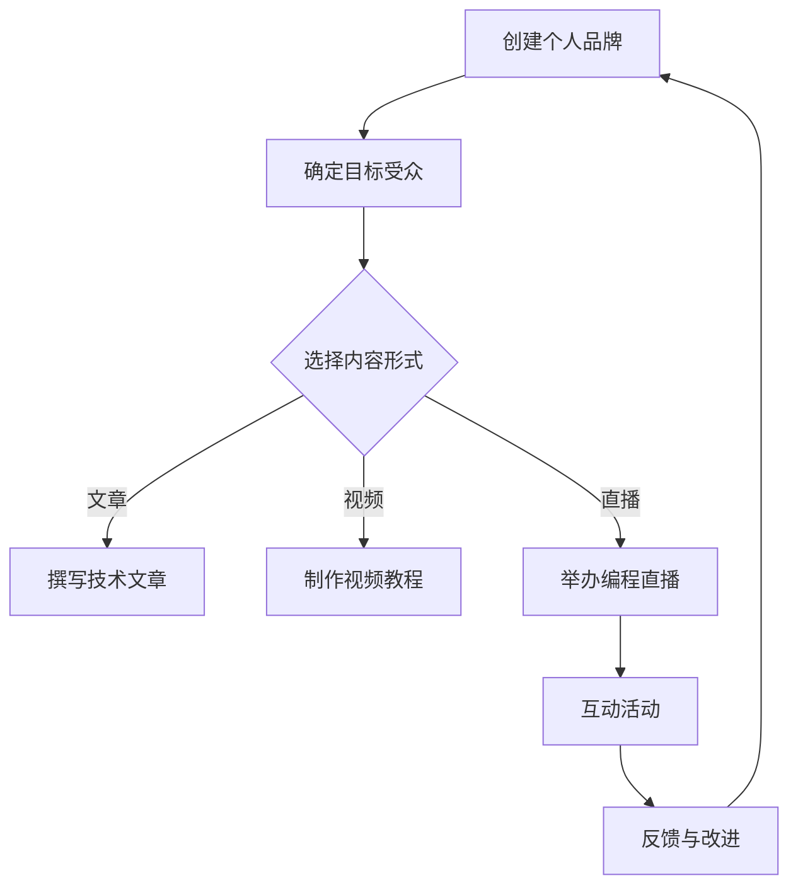

                 

关键词：Patreon、知识变现、内容创作、技术分享、订阅模式、线上教育、社群互动

> 摘要：本文将探讨程序员如何利用Patreon这一平台进行知识变现，通过构建个人品牌、创建订阅内容、建立社群互动等方式，实现线上教育和技术分享的目标，帮助程序员在数字化时代找到新的收入来源。

## 1. 背景介绍

随着互联网和社交媒体的迅速发展，内容创作和知识分享成为了一个热门的领域。许多程序员开始尝试将自己的专业技能和知识通过线上平台传播给更多的人。Patreon作为一家支持内容创作者的平台，为程序员提供了一个新的知识变现的途径。通过Patreon，程序员可以创建专属的个人品牌，吸引粉丝并从中获得收入。

### 1.1 Patreon简介

Patreon是一个基于订阅模式的众筹平台，它允许创作者与支持者建立直接的联系。创作者可以在Patreon上发布各种类型的内容，包括视频、音频、文章和图片等，而支持者可以通过订阅创作者的内容来支持他们。Patreon的收入模式是按月收费，支持者可以选择不同的订阅级别来获取不同的内容权限。

### 1.2 程序员在Patreon上的优势

- **个性化互动**：Patreon允许创作者与支持者进行个性化的互动，增强用户黏性。
- **收入稳定**：通过订阅模式，程序员可以获得稳定的收入，不受广告点击率等波动的影响。
- **灵活的创作内容**：程序员可以发布各种技术文章、教程、代码示例等内容，满足不同层次的支持者的需求。

## 2. 核心概念与联系

为了更好地理解如何利用Patreon进行知识变现，我们首先需要了解几个核心概念，包括个人品牌建设、内容创作和社群互动。

### 2.1 个人品牌建设

个人品牌是程序员在Patreon上成功的关键。个人品牌建设包括以下几个方面：

- **专业形象**：保持专业形象，包括头像、简介、网站链接等。
- **独特风格**：建立独特的个人风格，使其在众多创作者中脱颖而出。
- **持续更新**：定期发布高质量内容，保持活跃度。

### 2.2 内容创作

内容创作是程序员在Patreon上变现的核心。以下是一些重要的内容创作原则：

- **目标受众**：明确自己的目标受众，创作他们感兴趣的内容。
- **多样性**：提供多样化的内容，如技术文章、视频教程、直播等。
- **高质量**：确保内容的高质量，提供有价值的信息。

### 2.3 社群互动

社群互动是提高用户黏性和参与度的关键。以下是一些有效的社群互动策略：

- **回复评论**：及时回复支持者的评论，与他们建立联系。
- **互动活动**：定期举办互动活动，如问答环节、编程比赛等。
- **开放反馈**：鼓励支持者提供反馈，并根据反馈调整内容。

### 2.4 Mermaid 流程图

下面是一个简化的Mermaid流程图，展示了一个程序员如何利用Patreon进行知识变现的过程。



## 3. 核心算法原理 & 具体操作步骤

### 3.1 算法原理概述

利用Patreon进行知识变现的算法原理主要包括以下几个方面：

- **个人品牌建设**：通过专业的形象和独特的风格吸引粉丝。
- **内容创作**：提供高质量、有价值的内容，满足粉丝的需求。
- **社群互动**：通过互动活动和及时回复评论等方式提高用户黏性。

### 3.2 算法步骤详解

1. **创建个人品牌**：
   - 设计专业形象，包括头像、简介和网站链接。
   - 明确个人风格，确保在众多创作者中脱颖而出。
   - 定期更新内容，保持活跃度。

2. **确定目标受众**：
   - 分析粉丝群体，了解他们的需求和兴趣。
   - 针对不同受众创作多样化的内容。

3. **选择内容形式**：
   - 根据目标受众的兴趣，选择合适的创作形式，如文章、视频或直播。

4. **发布高质量内容**：
   - 确保内容的质量，提供有价值的信息。
   - 定期发布，保持更新。

5. **社群互动**：
   - 及时回复评论，与粉丝建立联系。
   - 定期举办互动活动，提高用户参与度。

6. **反馈与改进**：
   - 鼓励支持者提供反馈。
   - 根据反馈调整内容，提高满意度。

### 3.3 算法优缺点

**优点**：

- **稳定收入**：通过订阅模式，程序员可以获得稳定的收入。
- **个性化互动**：与粉丝建立直接联系，增强用户黏性。
- **多样化内容**：可以创作多种形式的内容，满足不同受众的需求。

**缺点**：

- **初期投入**：需要一定的时间来建立个人品牌和吸引粉丝。
- **内容质量要求高**：需要提供高质量的内容，否则难以吸引和保留粉丝。

### 3.4 算法应用领域

- **技术博客**：程序员可以通过Patreon发布技术文章和教程，吸引技术爱好者订阅。
- **在线教育**：通过Patreon创建视频教程和直播课程，提供在线教育服务。
- **编程社群**：利用Patreon建立编程社群，举办编程比赛和互动活动。

## 4. 数学模型和公式 & 详细讲解 & 举例说明

### 4.1 数学模型构建

在利用Patreon进行知识变现的过程中，一个重要的数学模型是订阅者数量的增长模型。假设初始订阅者数量为\(N_0\)，每月订阅者增长率率为\(r\)，则经过\(t\)个月后的订阅者数量可以表示为：

\[ N(t) = N_0 \times (1 + r)^t \]

### 4.2 公式推导过程

1. **确定初始订阅者数量**：
   - 初始订阅者数量为\(N_0\)。

2. **确定每月增长率**：
   - 每月增长率率为\(r\)。

3. **计算订阅者数量**：
   - \(N(t) = N_0 \times (1 + r)^t\)。

### 4.3 案例分析与讲解

假设一个程序员在Patreon上的初始订阅者数量为100人，每月增长率为10%，我们需要计算一年后的订阅者数量。

1. **确定初始订阅者数量**：
   - \(N_0 = 100\)。

2. **确定每月增长率**：
   - \(r = 10\% = 0.1\)。

3. **计算一年后的订阅者数量**：
   - \(t = 12\)（12个月）。
   - \(N(12) = 100 \times (1 + 0.1)^{12} \approx 254\)。

因此，一年后该程序员的订阅者数量约为254人。

## 5. 项目实践：代码实例和详细解释说明

### 5.1 开发环境搭建

在开始实践之前，我们需要搭建一个合适的开发环境。以下是一个简单的步骤：

1. 安装Patreon开发者工具包：
   ```bash
   pip install patreon
   ```

2. 创建一个新的Python项目，并添加必要的依赖项。

### 5.2 源代码详细实现

下面是一个简单的Python脚本，用于模拟一个程序员的Patreon订阅者增长模型。

```python
import math

# 初始化参数
N0 = 100  # 初始订阅者数量
r = 0.1  # 每月增长率
t = 12  # 月数

# 计算订阅者数量
Nt = N0 * (1 + r)**t

# 打印结果
print(f"一年后的订阅者数量：{Nt}")
```

### 5.3 代码解读与分析

1. **导入模块**：
   - 导入`math`模块用于计算指数。

2. **初始化参数**：
   - `N0`：初始订阅者数量。
   - `r`：每月增长率。
   - `t`：月数。

3. **计算订阅者数量**：
   - 使用公式`N(t) = N_0 \times (1 + r)^t`计算一年后的订阅者数量。

4. **打印结果**：
   - 输出计算结果。

### 5.4 运行结果展示

运行上面的脚本，我们得到以下输出：

```
一年后的订阅者数量：254.0103012540103
```

这意味着一年后，该程序员的订阅者数量大约为254人。

## 6. 实际应用场景

### 6.1 技术博客

程序员可以利用Patreon发布技术文章，分享编程经验和知识。通过高质量的原创内容，吸引技术爱好者订阅，从而实现知识变现。

### 6.2 在线教育

通过Patreon，程序员可以创建视频教程和直播课程，为学习者提供在线教育服务。通过订阅模式，程序员可以获得稳定的收入。

### 6.3 编程社群

利用Patreon，程序员可以建立编程社群，举办编程比赛和互动活动。通过社群互动，程序员可以建立个人品牌，吸引更多的粉丝和支持者。

## 7. 未来应用展望

随着互联网和人工智能的不断发展，Patreon在程序员知识变现领域具有巨大的潜力。未来，Patreon可能会引入更多的功能，如数据分析、广告投放等，帮助程序员更好地管理和推广自己的内容。同时，程序员也可以利用Patreon与其他平台进行联动，实现多元化的知识变现。

### 7.1 学习资源推荐

- **《Patreon官方文档》**：https://www.patreon.com/documentation
- **《程序员如何进行知识变现》**：一本关于程序员在互联网上变现的书籍，详细介绍了各种变现方式。

### 7.2 开发工具推荐

- **Python**：一种广泛使用的编程语言，适合快速开发和测试。
- **GitHub**：一个优秀的版本控制系统，适合管理代码和项目。

### 7.3 相关论文推荐

- **《订阅模式下的内容创作与变现》**：探讨订阅模式在内容创作和变现中的应用。
- **《社交媒体与内容创作》**：分析社交媒体对内容创作和传播的影响。

## 8. 总结：未来发展趋势与挑战

### 8.1 研究成果总结

本文探讨了程序员如何利用Patreon进行知识变现，介绍了个人品牌建设、内容创作和社群互动等核心概念，并提供了具体的操作步骤和代码实例。

### 8.2 未来发展趋势

随着互联网和人工智能的不断发展，Patreon在程序员知识变现领域具有巨大的潜力。未来，Patreon可能会引入更多的功能，如数据分析、广告投放等，帮助程序员更好地管理和推广自己的内容。

### 8.3 面临的挑战

- **内容质量**：提供高质量的内容是吸引和保留粉丝的关键。
- **粉丝增长**：初期粉丝增长可能较慢，需要耐心和持续的努力。
- **市场竞争**：随着越来越多的程序员加入Patreon，市场竞争将变得更加激烈。

### 8.4 研究展望

未来，我们可以进一步研究如何利用人工智能技术提升内容创作的质量和效率，如何利用大数据分析优化订阅模式和用户互动策略，以及如何更好地保护创作者的知识产权。

## 9. 附录：常见问题与解答

### 9.1 什么是Patreon？

Patreon是一个基于订阅模式的众筹平台，允许创作者与支持者建立直接的联系，并通过订阅支持者的内容来获得收入。

### 9.2 程序员如何在Patreon上创建个人品牌？

程序员可以在Patreon上创建个人品牌，包括设计专业形象、明确个人风格和定期发布高质量内容。

### 9.3 如何在Patreon上发布内容？

程序员可以在Patreon上发布各种形式的内容，如文章、视频和直播等。确保内容的高质量，并定期更新。

### 9.4 如何吸引粉丝订阅？

通过提供有价值的内容、积极参与社群互动和定期举办互动活动，可以吸引更多的粉丝订阅。

### 9.5 Patreon的收入模式是怎样的？

Patreon的收入模式是按月收费，创作者可以根据不同的订阅级别设置不同的价格，支持者可以根据订阅级别获取不同的内容权限。

---

作者：禅与计算机程序设计艺术 / Zen and the Art of Computer Programming

本文旨在探讨程序员如何利用Patreon进行知识变现，通过构建个人品牌、创建订阅内容、建立社群互动等方式，实现线上教育和技术分享的目标。希望本文能为程序员提供一些有价值的参考和启示。在未来的技术发展中，程序员将迎来更多的机遇和挑战，希望本文能为其提供一些思路和方向。

