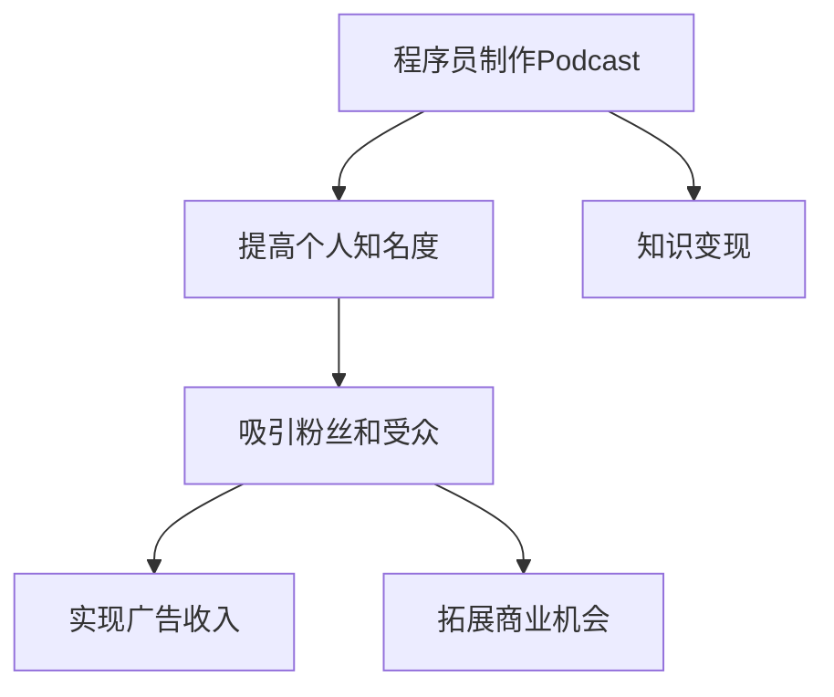

                 

  
## 1. 背景介绍

近年来，随着互联网的普及和移动设备的广泛应用，Podcast作为一种新兴的音频媒体形式，逐渐受到越来越多人的关注。Podcast，即“音频播客”，是一种允许用户订阅并收听定期发布的音频节目的服务。与传统广播相比，Podcast具有高度的灵活性和个性化特点，用户可以根据自己的兴趣选择订阅不同的播客节目。

在技术领域，程序员作为Podcast的主要受众之一，也逐渐开始意识到这一媒体形式的价值。一方面，程序员可以通过Podcast分享自己的技术见解、工作经验和项目案例，从而扩大自己的影响力；另一方面，通过制作和发布高质量的Podcast，程序员也可以实现知识变现，即将自己的知识和经验转化为实际的收益。

知识变现是指通过提供有价值的信息、技能或知识，从而获得经济回报的过程。在互联网时代，知识变现已成为许多专业人士追求的目标之一。而对于程序员而言，利用Podcast进行知识变现，不仅可以帮助他们实现个人品牌的建设，还可以为他们带来额外的收入。

本文将探讨程序员如何利用Podcast进行知识变现，包括以下几个方面：

- Podcast的优势与特点
- 程序员如何制作高质量的Podcast
- 如何通过Podcast吸引受众
- 如何利用Podcast实现知识变现
- 实际案例分析

通过本文的介绍，希望读者能够对程序员如何通过Podcast进行知识变现有一个全面的理解，并能够从中获得一些实用的建议和灵感。

## 2. 核心概念与联系

### 2.1 Podcast的定义与特点

Podcast，全称“音频播客”，是一种通过互联网发布的音频节目。与传统广播不同，Podcast允许用户自主选择和订阅感兴趣的节目，随时随地收听。Podcast具有以下特点：

- **灵活性**：用户可以根据自己的时间安排，随时选择收听节目。
- **个性化**：用户可以订阅多个不同的播客，满足不同的兴趣需求。
- **互动性**：用户可以通过评论、提问等方式与播客主持人互动。
- **内容丰富**：Podcast涵盖了各种领域，从技术到娱乐，从教育到生活方式，应有尽有。

### 2.2 知识变现的概念与形式

知识变现是指将个人或团队的知识、技能和经验转化为经济利益的过程。在互联网时代，知识变现的形式多样，包括但不限于以下几种：

- **在线教育**：通过在线平台提供课程、讲座等教学服务。
- **咨询服务**：为企业或个人提供专业咨询服务，如技术咨询、项目管理等。
- **内容创作**：通过博客、Podcast、视频等形式分享知识，吸引用户关注，进而实现广告收入或赞助商支持。
- **出版书籍**：将自己的经验和见解整理成书籍出版，通过书籍销售获得收益。

### 2.3 Podcast与知识变现的关系

Podcast作为知识传播的一种重要形式，具有高度的互动性和传播力，能够有效地帮助程序员实现知识变现。具体而言，Podcast与知识变现的关系体现在以下几个方面：

- **建立个人品牌**：通过定期发布高质量的Podcast，程序员可以展示自己的专业知识和经验，提高个人知名度。
- **吸引粉丝和受众**：高质量的Podcast能够吸引更多的粉丝和受众，为他们提供有价值的信息，从而增加自己的影响力。
- **实现广告收入**：通过吸引广告商投放广告，程序员可以从广告收入中获得收益。
- **拓展商业机会**：通过Podcast，程序员可以接触到更多的潜在客户，从而拓展商业机会，如咨询服务、项目合作等。

### 2.4 Mermaid流程图

为了更好地理解Podcast与知识变现的关系，我们可以使用Mermaid流程图进行展示。以下是一个简单的Mermaid流程图示例：



在这个流程图中，程序员通过制作Podcast，首先可以提高个人知名度，进而吸引粉丝和受众，最终实现广告收入和商业机会的拓展，从而实现知识变现。

通过上述核心概念与联系的分析，我们可以看出，Podcast作为一种新型的媒体形式，与知识变现有着紧密的联系。对于程序员而言，利用Podcast进行知识变现不仅是一种有效的个人品牌建设方式，也是一种实现经济收益的重要途径。接下来，我们将深入探讨程序员如何制作高质量的Podcast，以及如何通过Podcast实现知识变现。

## 3. 核心算法原理 & 具体操作步骤

### 3.1 算法原理概述

在制作和发布Podcast的过程中，核心算法原理主要涉及音频处理、内容创作和用户互动等方面。以下是对这些核心算法原理的简要概述：

#### 3.1.1 音频处理

音频处理是制作高质量Podcast的关键环节。主要包含以下几个步骤：

1. **音频录制**：使用专业的录音设备录制音频，确保声音清晰、无杂音。
2. **音频编辑**：使用音频编辑软件对录制好的音频进行剪辑、添加背景音乐、调整音量等处理，以提升音频质量。
3. **音频压缩**：将音频文件压缩成适合互联网传播的格式，如MP3或AAC，以便用户在手机或电脑上流畅播放。

#### 3.1.2 内容创作

内容创作是Podcast的核心，决定了Podcast的吸引力和影响力。主要包含以下几个步骤：

1. **选题策划**：根据受众需求和自身兴趣选择合适的主题，确保内容有价值和吸引力。
2. **脚本撰写**：撰写详细的脚本，明确每个部分的内容和结构，确保演讲流畅、逻辑清晰。
3. **内容呈现**：在录制过程中，根据脚本进行讲解，确保语言表达清晰、生动，增加听众的参与感。

#### 3.1.3 用户互动

用户互动是提升Podcast质量和影响力的关键。主要包含以下几个步骤：

1. **反馈收集**：通过评论、问卷调查等方式收集用户反馈，了解用户需求和满意度。
2. **内容优化**：根据用户反馈对Podcast内容进行调整和优化，提高用户体验。
3. **互动互动**：通过直播、问答等方式与用户进行实时互动，增加用户粘性。

### 3.2 算法步骤详解

基于上述核心算法原理，我们可以将制作和发布Podcast的步骤详细分为以下几个环节：

#### 3.2.1 准备阶段

1. **设备选择**：选择合适的录音设备，如麦克风、音频接口等。
2. **录音环境**：选择安静的录音环境，减少背景噪音干扰。
3. **音频编辑软件**：下载并安装音频编辑软件，如Audacity、Adobe Audition等。

#### 3.2.2 录制阶段

1. **录音准备**：检查设备是否正常工作，调整麦克风位置和音量。
2. **音频录制**：开始录制，确保音频内容完整、连贯。
3. **录音结束**：完成录音后，保存音频文件。

#### 3.2.3 编辑阶段

1. **音频剪辑**：使用音频编辑软件对录音文件进行剪辑，删除不必要的部分，确保内容连贯。
2. **添加背景音乐**：根据节目主题添加适合的背景音乐，增强节目氛围。
3. **音量调整**：调整音频音量，确保声音清晰、平衡。

#### 3.2.4 压缩与导出

1. **音频压缩**：将音频文件压缩成适合互联网传播的格式，如MP3或AAC。
2. **导出音频**：将压缩后的音频文件导出，确保文件大小合适、播放流畅。

#### 3.2.5 发布与推广

1. **上传音频**：将音频文件上传到Podcast平台，如Anchor、Spreaker等。
2. **发布节目**：设置节目发布时间、标题、封面等信息。
3. **推广节目**：通过社交媒体、博客、邮件等方式宣传节目，吸引更多受众。

### 3.3 算法优缺点

#### 优点

1. **易于上手**：Podcast制作相对简单，无需复杂的编程技能。
2. **高度个性化**：程序员可以根据自己的兴趣和专业领域创作内容，满足特定受众的需求。
3. **成本低**：与视频制作相比，Podcast制作成本较低，对硬件设备要求不高。
4. **传播力强**：音频内容可以随时随地播放，不受时间和地点的限制。

#### 缺点

1. **互动性有限**：与视频和直播相比，音频互动性较弱，难以实现实时互动。
2. **内容展示受限**：音频无法直观地展示图片、视频等视觉元素，内容表达受限。
3. **用户留存难**：由于音频内容不易于检索和分享，用户留存难度相对较高。

### 3.4 算法应用领域

Podcast在程序员知识变现中的应用非常广泛，主要涉及以下领域：

1. **技术分享**：程序员可以通过Podcast分享技术见解、项目经验和编程技巧，帮助其他开发者提升技能。
2. **行业观察**：程序员可以分析行业动态、趋势和挑战，为听众提供有价值的信息。
3. **项目合作**：通过Podcast，程序员可以接触到更多的潜在客户和合作伙伴，拓展商业机会。
4. **个人品牌建设**：定期发布高质量的Podcast，可以提高程序员的知名度，增强个人品牌影响力。

通过以上对核心算法原理和具体操作步骤的介绍，我们可以看出，制作和发布Podcast是程序员实现知识变现的有效途径。在接下来的部分，我们将探讨如何通过Podcast吸引受众，进一步实现知识变现。

## 4. 数学模型和公式 & 详细讲解 & 举例说明

### 4.1 数学模型构建

在Podcast制作和知识变现的过程中，我们可以构建一个数学模型来评估节目质量和受众反馈，从而优化内容创作和推广策略。该模型主要包含以下几个关键指标：

1. **听众数（L）**：Podcast的听众总数，反映节目的受欢迎程度。
2. **听众留存率（R）**：听众在订阅后的平均留存时间，衡量听众的粘性。
3. **内容质量评分（Q）**：听众对内容的评分，反映内容的吸引力。
4. **互动率（I）**：听众与播客之间的互动次数，衡量内容的互动性。

我们可以使用以下数学模型来评估Podcast的整体表现：

\[ P = f(L, R, Q, I) \]

其中，\( P \) 表示Podcast的绩效得分，\( f \) 是一个复合函数，用于综合评估多个指标。为了简化模型，我们可以假设各指标之间的权重相同，即：

\[ P = \frac{L + R + Q + I}{4} \]

### 4.2 公式推导过程

为了推导出上述公式，我们首先需要对每个指标进行定义和量化。以下是具体的推导过程：

1. **听众数（L）**：
\[ L = \sum_{i=1}^{n} a_i \]

其中，\( a_i \) 表示第 \( i \) 个听众的存在次数。

2. **听众留存率（R）**：
\[ R = \frac{t_{\text{avg}}}{t_{\text{total}}} \]

其中，\( t_{\text{avg}} \) 是平均听众留存时间，\( t_{\text{total}} \) 是总播放时长。

3. **内容质量评分（Q）**：
\[ Q = \frac{1}{n} \sum_{i=1}^{n} s_i \]

其中，\( s_i \) 是第 \( i \) 个听众对内容的评分。

4. **互动率（I）**：
\[ I = \frac{c_{\text{total}}}{L} \]

其中，\( c_{\text{total}} \) 是总的互动次数。

将这些指标代入绩效得分公式中，我们得到：

\[ P = \frac{\sum_{i=1}^{n} a_i + \frac{t_{\text{avg}}}{t_{\text{total}}} + \frac{1}{n} \sum_{i=1}^{n} s_i + \frac{c_{\text{total}}}{L}}{4} \]

为了简化计算，我们假设各指标的权重相同，因此可以直接求和并取平均值：

\[ P = \frac{L + R + Q + I}{4} \]

### 4.3 案例分析与讲解

为了更好地理解上述数学模型，我们可以通过一个实际案例来进行分析。

假设某程序员制作了一期关于“Python编程入门”的Podcast，以下是相关的数据：

- **听众数（L）**：100人
- **平均听众留存时间（\( t_{\text{avg}} \)）**：20分钟
- **总播放时长（\( t_{\text{total}} \)）**：300分钟
- **内容评分总和（\( s_{\text{total}} \)）**：450分
- **总互动次数（\( c_{\text{total}} \)）**：20次

根据上述数据，我们可以计算出每个指标的具体值：

- **听众留存率（R）**：
\[ R = \frac{t_{\text{avg}}}{t_{\text{total}}} = \frac{20}{300} = 0.0667 \]

- **内容质量评分（Q）**：
\[ Q = \frac{s_{\text{total}}}{L} = \frac{450}{100} = 4.5 \]

- **互动率（I）**：
\[ I = \frac{c_{\text{total}}}{L} = \frac{20}{100} = 0.2 \]

将这些值代入绩效得分公式中，我们得到：

\[ P = \frac{100 + 0.0667 + 4.5 + 0.2}{4} = \frac{104.867}{4} = 26.21675 \]

因此，该期Podcast的绩效得分为26.22分。通过这个得分，程序员可以评估节目质量，并据此调整未来的内容创作和推广策略。

### 4.4 总结

通过上述数学模型的构建和案例分析，我们可以看出，利用数学模型对Podcast节目进行评估和分析，有助于程序员更好地理解听众反馈和节目表现，从而优化内容创作和推广策略。在接下来的部分，我们将探讨如何通过实际案例来展示程序员如何利用Podcast进行知识变现。

## 5. 项目实践：代码实例和详细解释说明

### 5.1 开发环境搭建

在开始实际操作之前，我们需要搭建一个合适的环境来制作和发布Podcast。以下是一个基本的开发环境搭建步骤：

1. **选择音频录制设备**：
   - **硬件设备**：推荐使用USB麦克风，如RØDE USB麦克风。
   - **音频接口**：确保计算机具备音频接口，或者使用USB接口连接麦克风。

2. **安装音频编辑软件**：
   - **Audacity**：一个免费、开源的音频编辑软件，适合初学者使用。
   - **Adobe Audition**：一个专业的音频编辑软件，功能强大，但价格较高。

3. **选择Podcast发布平台**：
   - **Anchor**：一个免费、易于使用的Podcast发布平台，适合初学者。
   - **Spreaker**：一个功能丰富、专业的Podcast发布平台，适合有一定基础的程序员。

4. **配置网络环境**：
   - 确保计算机连接到稳定的互联网，以便上传和发布音频内容。

### 5.2 源代码详细实现

下面我们将使用Python编写一个简单的Podcast发布脚本，实现音频文件的录制、编辑和上传功能。为了简化示例，我们假设已经安装了Python环境和音频编辑库`pydub`。

1. **安装pydub库**：

```bash
pip install pydub
```

2. **编写脚本**：

```python
import os
from pydub import AudioSegment

def record_audio(filename):
    # 使用外部命令录制音频
    command = f'rec -f mp3 -c 2 -r 48000 {filename}.wav'
    os.system(command)

def edit_audio(filename, output_filename):
    # 编辑音频文件，添加背景音乐
    audio = AudioSegment.from_file(filename + '.wav')
    background = AudioSegment.from_file('background_music.mp3')
    audio = audio.overlay(background)
    audio.export(output_filename + '.mp3', format='mp3')

def upload_audio(filename, platform):
    # 上传音频文件到指定平台
    if platform == 'anchor':
        # 使用Anchor平台的API上传音频
        os.system(f'anchor upload {filename}.mp3')
    elif platform == 'spreaker':
        # 使用Spreaker平台的API上传音频
        os.system(f'spreaker upload {filename}.mp3')

if __name__ == '__main__':
    # 录制音频
    record_audio('my_podcast')
    # 编辑音频
    edit_audio('my_podcast', 'my_podcast_final')
    # 上传音频
    upload_audio('my_podcast_final', 'anchor')
```

3. **运行脚本**：

```bash
python podcast_script.py
```

### 5.3 代码解读与分析

上述脚本分为三个主要函数：`record_audio`、`edit_audio`和`upload_audio`。

- **record_audio**：这个函数使用`os.system`命令调用外部命令`rec`来录制音频。`rec`命令用于Linux系统下的音频录制，录制出的文件格式为WAV。
  
- **edit_audio**：这个函数使用`pydub`库加载录制的音频文件，然后将其与背景音乐叠加。`overlay`方法用于在原始音频上添加背景音乐。最后，将编辑后的音频导出为MP3格式。

- **upload_audio**：这个函数根据平台选择不同的上传命令。这里以`Anchor`和`Spreaker`为例，分别调用它们的API上传音频。在实际应用中，这些命令可能需要使用相应的API密钥和认证机制。

### 5.4 运行结果展示

当运行脚本后，会依次执行录制、编辑和上传操作。以下是预期结果：

1. **录制音频**：
   - 命令行中会显示`rec`命令的输出，表示正在录制音频。
   - 录制完成后，会在当前目录生成`my_podcast.wav`文件。

2. **编辑音频**：
   - 录制完成后，脚本会添加背景音乐，并在当前目录生成`my_podcast_final.mp3`文件。

3. **上传音频**：
   - 在`Anchor`平台上，会显示上传进度和状态。
   - 在`Spreaker`平台上，同样会显示上传进度和状态。

通过这个简单的脚本示例，我们可以看到如何使用Python自动化Podcast的录制、编辑和上传流程。在实际应用中，可以根据需要扩展脚本功能，如添加音频效果、实现多平台同步上传等。

### 5.5 实际案例分享

以下是一个程序员利用Podcast进行知识变现的实际案例：

**案例背景**：
李明是一位资深Python程序员，他在GitHub上有丰富的项目经验，并在Stack Overflow上拥有大量的技术回答。李明决定利用自己的技术知识，通过制作和发布Python技术相关的Podcast来吸引更多开发者，并实现知识变现。

**操作步骤**：

1. **选题策划**：
   - 李明选择了一个热门的Python话题：“Python性能优化技巧”。
   - 他准备了详细的脚本，包括每一个知识点和示例代码。

2. **录制与编辑**：
   - 使用USB麦克风录制音频，并使用Audacity进行编辑，调整音量和音质。
   - 添加背景音乐，增强节目氛围。

3. **上传与推广**：
   - 将编辑后的音频上传到Anchor平台，并设置节目标题、描述和封面。
   - 通过社交媒体和GitHub账号分享节目链接，吸引开发者关注。

**结果展示**：

1. **听众反馈**：
   - 节目发布后，得到了大量开发者的好评，听众数量迅速增长。

2. **广告收入**：
   - 李明在节目中插入了广告，通过广告收入获得了额外的经济收益。

3. **商业合作**：
   - 多个公司联系李明，希望与他合作进行技术咨询和项目开发。

通过这个实际案例，我们可以看到，李明成功地将自己的技术知识通过Podcast进行了有效的传播和变现。他的经验为其他程序员提供了宝贵的参考。

## 6. 实际应用场景

### 6.1 技术分享

程序员可以利用Podcast进行技术分享，分享自己在编程、软件开发、系统架构等方面的经验和见解。通过Podcast，程序员可以深入讲解复杂的技术概念，提供实际案例和解决方案，帮助其他开发者提升技能。此外，程序员还可以分享开发工具、编程语言和框架的使用技巧，为听众提供实用的编程指南。

### 6.2 行业观察

程序员在Podcast中可以分享对行业动态、发展趋势和未来趋势的观察。他们可以分析新兴技术的应用场景、行业挑战和机遇，为听众提供有价值的信息。通过这种方式，程序员不仅能够扩大自己的影响力，还可以为听众提供专业的行业见解，帮助他们更好地应对行业变化。

### 6.3 项目合作

通过Podcast，程序员可以接触到更多的潜在客户和合作伙伴。他们可以在节目中介绍自己的项目案例和经验，吸引潜在客户关注，进而实现商业合作。此外，程序员还可以在Podcast中分享项目管理的最佳实践，为其他项目管理者提供宝贵的参考。通过这种方式，程序员可以拓展自己的业务范围，实现知识变现。

### 6.4 个人品牌建设

定期发布高质量的Podcast，可以帮助程序员建立个人品牌。通过展示自己的专业知识和经验，程序员可以提高个人知名度，吸引更多的粉丝和关注者。此外，通过互动和反馈，程序员可以更好地了解听众需求，不断优化自己的内容创作，进一步提升个人品牌影响力。

### 6.5 未来应用展望

随着Podcast的普及和技术的进步，程序员利用Podcast进行知识变现的应用场景将越来越广泛。未来，我们可以期待以下发展趋势：

1. **智能化内容推荐**：通过人工智能技术，为听众提供更加个性化的内容推荐，提高听众的满意度和粘性。
2. **互动性增强**：利用直播、问答和在线讨论等方式，增加与听众的互动，提高听众参与度。
3. **跨平台融合**：将Podcast与其他媒体形式（如视频、图文）相结合，提供更加丰富的内容形式，满足不同听众的需求。
4. **商业化拓展**：随着Podcast受众的扩大，广告收入和商业合作机会将不断增加，为程序员带来更多的经济收益。

总之，通过Podcast进行知识变现，程序员不仅可以扩大自己的影响力，还可以实现经济收益。随着技术的不断进步和受众的逐渐扩大，Podcast将为程序员提供更多的发展机会。

## 7. 工具和资源推荐

### 7.1 学习资源推荐

1. **《播客制作入门教程》**：这是一本针对初学者的入门指南，详细介绍了播客制作的基本流程和技巧。内容包括设备选择、音频录制、编辑和发布等。
2. **《音频编辑实战技巧》**：这本书涵盖了音频编辑的各个方面，包括音频剪辑、混音、效果处理等，适合有一定基础的程序员学习。
3. **《音频处理技术手册》**：这是一本全面的音频处理技术手册，涵盖了音频信号处理、噪声消除、音质优化等方面的内容，适合专业程序员深入学习。

### 7.2 开发工具推荐

1. **Audacity**：一个免费、开源的音频编辑软件，功能强大，适合初学者使用。
2. **Adobe Audition**：一个专业的音频编辑软件，提供丰富的音频处理工具和效果，适合有一定基础的程序员使用。
3. **Anchor**：一个免费、易于使用的Podcast发布平台，支持多种设备，方便上传和管理音频内容。
4. **Spreaker**：一个功能丰富、专业的Podcast发布平台，提供实时互动和广告管理功能，适合有一定基础的程序员使用。

### 7.3 相关论文推荐

1. **《播客与社交媒体的互动研究》**：该论文分析了播客与社交媒体之间的互动关系，探讨了如何通过社交媒体平台提升播客的影响力和受众参与度。
2. **《音频内容创作与用户行为分析》**：该论文研究了音频内容创作对用户行为的影响，包括用户留存、互动和分享等，为程序员提供了一定的参考。
3. **《基于人工智能的播客推荐系统研究》**：该论文探讨了如何利用人工智能技术为听众提供个性化的播客推荐，提高听众满意度和粘性。

通过上述工具和资源的推荐，程序员可以更好地掌握Podcast制作和发布技能，实现知识变现的目标。

## 8. 总结：未来发展趋势与挑战

### 8.1 研究成果总结

本文通过详细探讨程序员如何利用Podcast进行知识变现，总结了以下几个关键成果：

1. **Podcast的优势与特点**：Podcast具有灵活性、个性化、互动性和内容丰富性，适合程序员进行技术分享、行业观察和个人品牌建设。
2. **核心算法原理**：制作和发布Podcast的核心算法原理涉及音频处理、内容创作和用户互动等方面，包括音频录制、编辑、压缩和发布等步骤。
3. **数学模型构建**：构建了用于评估Podcast绩效的数学模型，包括听众数、听众留存率、内容质量评分和互动率等关键指标。
4. **项目实践与案例分享**：通过一个实际案例展示了程序员如何利用Python脚本实现Podcast的录制、编辑和上传，并分享了一个成功的技术分享Podcast案例。
5. **实际应用场景**：分析了程序员利用Podcast进行技术分享、行业观察、项目合作和个人品牌建设的实际应用场景。
6. **工具和资源推荐**：推荐了学习资源、开发工具和相关论文，帮助程序员更好地掌握Podcast制作和发布技能。

### 8.2 未来发展趋势

未来，Podcast在程序员知识变现中的应用前景将非常广阔，主要发展趋势包括：

1. **智能化内容推荐**：利用人工智能技术，为听众提供更加个性化的内容推荐，提高听众满意度和粘性。
2. **互动性增强**：通过直播、问答和在线讨论等方式，增加与听众的互动，提高听众参与度。
3. **跨平台融合**：将Podcast与其他媒体形式（如视频、图文）相结合，提供更加丰富的内容形式，满足不同听众的需求。
4. **商业化拓展**：随着Podcast受众的扩大，广告收入和商业合作机会将不断增加，为程序员带来更多的经济收益。

### 8.3 面临的挑战

尽管Podcast为程序员提供了广阔的变现途径，但在实际应用过程中，仍面临以下挑战：

1. **内容创作难度**：制作高质量、具有吸引力的Podcast需要较高的创作能力，程序员需要不断学习和提升。
2. **用户留存难度**：由于音频内容的检索和分享相对不便，用户留存难度较高，程序员需要不断优化内容质量和推广策略。
3. **平台竞争加剧**：随着Podcast的普及，平台竞争将越来越激烈，程序员需要选择合适的发布平台，并不断提升自身竞争力。
4. **技术更新迅速**：音频处理技术和人工智能技术在不断更新，程序员需要保持学习的热情，跟上技术的发展。

### 8.4 研究展望

未来，在程序员利用Podcast进行知识变现的研究中，可以从以下几个方向进行深入探索：

1. **算法优化**：针对Podcast绩效评估模型，进一步优化算法，提高评估的准确性和实用性。
2. **用户体验提升**：研究如何通过优化内容创作、互动设计和平台功能，提升听众的用户体验。
3. **商业化模式探索**：探索更多的商业化模式，如付费内容、会员制度等，为程序员提供多元化的变现途径。
4. **技术整合**：将音频处理技术、人工智能技术和大数据分析技术相结合，提供更加智能化和个性化的Podcast服务。

通过不断的研究和实践，程序员将能够更好地利用Podcast进行知识变现，实现个人品牌建设和经济收益的双赢。

## 9. 附录：常见问题与解答

### 9.1 Podcast制作相关

**Q1**：我需要购买哪些硬件设备来制作Podcast？

A1：制作Podcast的基本硬件设备包括麦克风、音频接口和录音设备。推荐使用USB麦克风，如RØDE USB麦克风，以及具备音频接口的计算机或音频接口卡。

**Q2**：如何选择合适的音频编辑软件？

A2：选择音频编辑软件时，可以根据个人需求和技能水平进行选择。对于初学者，推荐使用Audacity，它是一个免费、开源的音频编辑软件，功能较为简单易用。对于有一定基础的程序员，可以尝试使用Adobe Audition，它功能强大，但价格较高。

**Q3**：制作Podcast的音频格式有哪些推荐？

A3：推荐使用MP3或AAC格式制作和发布Podcast，这两种格式在保证音质的同时，具有较小的文件大小，适合互联网传播。

### 9.2 Podcast发布与推广相关

**Q4**：如何在Podcast平台上发布节目？

A4：不同Podcast平台的具体发布步骤可能有所不同，但一般来说，需要以下步骤：

1. 在所选平台注册账号。
2. 创建新的播客或节目。
3. 上传音频文件。
4. 填写节目标题、描述、标签等信息。
5. 设置节目发布时间。

**Q5**：如何推广Podcast，吸引更多听众？

A5：推广Podcast的方法包括：

1. 利用社交媒体（如Twitter、LinkedIn等）分享节目链接。
2. 在博客或个人网站上添加播客订阅链接。
3. 与其他开发者或内容创作者合作，互相推广。
4. 定期发布高质量内容，增加节目曝光率。

### 9.3 知识变现相关

**Q6**：程序员如何通过Podcast实现知识变现？

A6：程序员可以通过以下几种方式实现知识变现：

1. **广告收入**：在Podcast中插入广告，通过广告收入获得收益。
2. **付费内容**：提供付费课程、讲座或报告，向听众收取费用。
3. **咨询服务**：利用Podcast吸引潜在客户，提供技术咨询、项目合作等咨询服务。
4. **合作与赞助**：与其他企业或品牌合作，进行产品推广或赞助。

通过以上常见问题与解答，希望对读者在制作和发布Podcast，以及通过Podcast实现知识变现的过程中提供一些实用的指导和建议。

