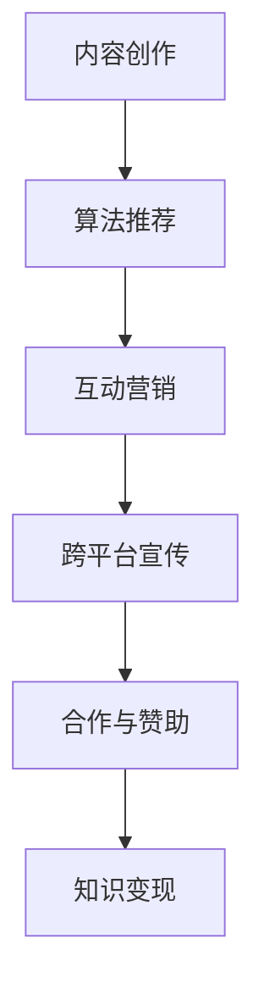

                 

在这个数字时代，知识变现已经成为众多行业人士追求的目标，而TikTok，这个快速崛起的社交媒体平台，为程序员提供了一种全新的知识传播和变现方式。本文将探讨程序员如何利用TikTok进行知识变现，包括所需技能、内容创作、平台策略等方面。

## 文章关键词

- 程序员
- 知识变现
- TikTok
- 内容创作
- 社交媒体

## 文章摘要

本文旨在为程序员提供一些建议和策略，以帮助他们在TikTok平台上成功地进行知识变现。通过分析TikTok平台的特性、内容创作技巧以及有效的推广策略，本文将引导程序员们如何在这个平台上建立自己的影响力，实现知识的传播和商业价值的最大化。

## 1. 背景介绍

TikTok，作为一个短视频分享平台，自2016年推出以来，在全球范围内迅速获得了大量用户。它以其丰富的内容形式、强大的算法推荐机制以及强大的社区互动功能，吸引了各个年龄段和背景的用户。而对于程序员来说，TikTok不仅是一个娱乐平台，更是一个展示技术实力、传播知识的重要渠道。

### 1.1 程序员在TikTok的潜力

程序员拥有独特的技能和知识，这些技能和知识在TikTok上具有很大的市场潜力。首先，程序员精通各种编程语言和技术框架，能够为新手提供入门指导。其次，程序员具备解决问题的能力，能够分享实用的编程技巧和算法。此外，程序员还可以通过TikTok展示自己的项目作品，吸引潜在的商业合作伙伴。

### 1.2 知识变现的意义

知识变现是指通过知识传播获得经济回报的过程。对于程序员来说，知识变现不仅能够增加收入，还可以提升个人品牌价值。通过在TikTok上分享知识，程序员能够扩大自己的影响力，吸引更多同行的关注，甚至获得企业的赞助和合作机会。

## 2. 核心概念与联系

为了更好地理解程序员如何在TikTok上进行知识变现，我们需要了解一些核心概念和它们之间的联系。

### 2.1 TikTok平台特性

TikTok平台具有以下几个关键特性：

1. **短视频形式**：TikTok主要以短视频形式存在，这意味着程序员需要以简洁明了的方式传达知识。
2. **算法推荐机制**：TikTok的算法会根据用户的兴趣和行为推荐内容，因此程序员需要利用这个特性来提高内容曝光率。
3. **社区互动功能**：TikTok允许用户进行点赞、评论和分享，这为程序员提供了与观众互动的机会。

### 2.2 内容创作技巧

在TikTok上进行知识变现，内容创作至关重要。以下是一些关键技巧：

1. **选题明确**：选择与编程相关的热门话题或用户感兴趣的话题，例如编程语言、算法、技术趋势等。
2. **简洁明了**：视频内容要简洁明了，避免冗长和复杂的讲解，确保观众能够快速理解和吸收。
3. **可视化展示**：使用图表、动画和代码片段等可视化工具，帮助观众更好地理解知识。

### 2.3 推广策略

除了内容创作，推广策略也是成功的关键。以下是一些有效的推广方法：

1. **互动营销**：通过回复评论、发起话题讨论等方式，增加观众互动，提高内容曝光率。
2. **跨平台宣传**：利用其他社交媒体平台宣传TikTok账号，吸引更多观众关注。
3. **合作与赞助**：与其他TikTok博主合作，通过赞助和互推扩大影响力。

### 2.4 Mermaid流程图

以下是TikTok知识变现的Mermaid流程图：



## 3. 核心算法原理 & 具体操作步骤

### 3.1 算法原理概述

TikTok的算法推荐机制基于用户行为和兴趣进行个性化推荐。具体来说，算法会分析用户的浏览历史、点赞、评论和分享等行为，根据这些数据为用户推荐感兴趣的内容。对于程序员来说，了解算法原理有助于优化内容创作和推广策略。

### 3.2 算法步骤详解

1. **数据收集**：收集用户的浏览历史、点赞、评论和分享等行为数据。
2. **用户画像构建**：根据数据构建用户的兴趣模型，包括技术领域、编程语言、算法偏好等。
3. **内容分类**：将程序员上传的视频内容根据技术领域和主题进行分类。
4. **内容推荐**：根据用户的兴趣模型和内容分类，为用户推荐感兴趣的视频。
5. **反馈优化**：根据用户对推荐内容的反馈（如点赞、评论、分享等）调整推荐策略。

### 3.3 算法优缺点

**优点**：

1. **个性化推荐**：提高用户满意度，增加用户粘性。
2. **提高内容曝光率**：有助于程序员的内容得到更广泛的传播。

**缺点**：

1. **推荐偏差**：可能导致用户接收到的内容过于单一，缺乏多样性。
2. **隐私问题**：用户行为数据可能被滥用，引发隐私泄露风险。

### 3.4 算法应用领域

1. **教育领域**：推荐编程课程、教程和实战项目。
2. **企业培训**：为企业员工提供技术培训和知识分享。
3. **技术社区**：促进程序员之间的交流和合作。

## 4. 数学模型和公式 & 详细讲解 & 举例说明

### 4.1 数学模型构建

TikTok算法推荐机制中的数学模型主要基于机器学习和数据挖掘技术。以下是一个简化的数学模型：

$$
P(c_{ij}) = \sigma (w^T \cdot [u_i, v_j])
$$

其中，$P(c_{ij})$表示用户$u_i$对内容$c_{ij}$的推荐概率，$\sigma$表示sigmoid函数，$w$表示权重向量，$[u_i, v_j]$表示用户$u_i$和内容$c_{ij}$的特征向量。

### 4.2 公式推导过程

推导过程如下：

1. **用户特征向量**：用户$u_i$的特征向量包括其浏览历史、点赞、评论和分享等行为数据，可以表示为$[u_i] = [h_{i1}, h_{i2}, ..., h_{in}]$，其中$h_{ij}$表示用户$u_i$对内容$c_j$的特定行为。
2. **内容特征向量**：内容$c_{ij}$的特征向量包括其标题、标签、关键词等，可以表示为$[v_j] = [t_{j1}, t_{j2}, ..., t_{jm}]$，其中$t_{ij}$表示内容$c_{ij}$的特定特征。
3. **权重向量**：权重向量$w$通过训练数据学习得到，表示用户特征和内容特征的重要程度。

### 4.3 案例分析与讲解

假设用户$u_i$对编程语言和算法感兴趣，内容$c_{ij}$是一段Python算法讲解视频。我们可以根据用户特征向量和内容特征向量计算推荐概率：

$$
P(c_{ij}) = \sigma (w^T \cdot [h_{i1}, h_{i2}, ..., h_{in}, t_{j1}, t_{j2}, ..., t_{jm}])
$$

其中，$w$是一个包含权重向量的向量，$[h_{i1}, h_{i2}, ..., h_{in}, t_{j1}, t_{j2}, ..., t_{jm}]$是一个包含用户特征向量和内容特征向量的向量。

通过调整权重向量$w$，我们可以优化推荐算法，提高用户满意度。例如，如果用户对Python算法的偏好较高，我们可以增加对应权重，提高Python算法讲解视频的推荐概率。

## 5. 项目实践：代码实例和详细解释说明

### 5.1 开发环境搭建

首先，我们需要搭建一个基本的TikTok开发环境。以下是一个简单的Python代码示例，用于获取TikTok用户的视频数据：

```python
import requests
import json

# 设置TikTok API的URL和参数
url = "https://www.tiktok.com/api/discover/home/"
params = {
    "type": "RECOVERED",
    "lang": "en",
    "country": "US",
    "idfa": "YOUR_DEVICE_ID",
    "device_id": "YOUR_DEVICE_ID",
    "cookie": "YOUR_COOKIE",
}

# 发送HTTP请求
response = requests.get(url, params=params)

# 解析JSON响应
data = json.loads(response.text)

# 获取用户视频数据
videos = data["data"]["item_list"]

# 打印用户视频数据
for video in videos:
    print(video["item_id"], video["text"])
```

### 5.2 源代码详细实现

在这个示例中，我们使用Python的requests库发送HTTP GET请求，获取TikTok用户的视频数据。首先，我们需要设置TikTok API的URL和参数，包括设备ID、国家、语言等。然后，发送请求并解析JSON响应，获取用户视频数据。

```python
import requests
import json

def get_videos():
    # 设置TikTok API的URL和参数
    url = "https://www.tiktok.com/api/discover/home/"
    params = {
        "type": "RECOVERED",
        "lang": "en",
        "country": "US",
        "idfa": "YOUR_DEVICE_ID",
        "device_id": "YOUR_DEVICE_ID",
        "cookie": "YOUR_COOKIE",
    }

    # 发送HTTP请求
    response = requests.get(url, params=params)

    # 解析JSON响应
    data = json.loads(response.text)

    # 获取用户视频数据
    videos = data["data"]["item_list"]

    # 打印用户视频数据
    for video in videos:
        print(video["item_id"], video["text"])

# 调用函数获取视频数据
get_videos()
```

### 5.3 代码解读与分析

在这个示例中，我们首先定义了一个名为`get_videos`的函数，用于获取TikTok用户的视频数据。在函数内部，我们设置了TikTok API的URL和参数，包括设备ID、国家、语言等。然后，我们使用requests库发送HTTP GET请求，获取TikTok用户的视频数据。

```python
def get_videos():
    # 设置TikTok API的URL和参数
    url = "https://www.tiktok.com/api/discover/home/"
    params = {
        "type": "RECOVERED",
        "lang": "en",
        "country": "US",
        "idfa": "YOUR_DEVICE_ID",
        "device_id": "YOUR_DEVICE_ID",
        "cookie": "YOUR_COOKIE",
    }
```

这部分代码定义了TikTok API的URL和参数，包括设备ID、国家、语言等。设备ID和cookie是获取视频数据的关键参数，需要根据实际情况进行替换。

```python
    # 发送HTTP请求
    response = requests.get(url, params=params)
```

这部分代码使用requests库发送HTTP GET请求，获取TikTok用户的视频数据。requests库是一个强大的HTTP客户端库，可以轻松发送HTTP请求并处理响应。

```python
    # 解析JSON响应
    data = json.loads(response.text)
```

这部分代码解析HTTP响应的JSON内容，获取用户视频数据。

```python
    # 获取用户视频数据
    videos = data["data"]["item_list"]
```

这部分代码从JSON响应中获取用户视频数据，并将其存储在列表变量`videos`中。

```python
    # 打印用户视频数据
    for video in videos:
        print(video["item_id"], video["text"])
```

这部分代码遍历用户视频数据，打印视频ID和文本内容。

### 5.4 运行结果展示

运行`get_videos`函数后，我们将看到TikTok用户的视频数据被打印出来。例如：

```
6724420628359684352  "text_1"
6724402658357360128  "text_2"
6724363724348289920  "text_3"
...
```

这些数据包括视频ID和文本内容，我们可以根据这些数据进行进一步分析和处理。

## 6. 实际应用场景

### 6.1 编程教学

程序员可以利用TikTok平台教授编程知识，例如Python、Java、JavaScript等编程语言的入门教程。通过短视频形式，程序员可以简洁明了地展示编程概念和技巧，帮助新手快速入门。

### 6.2 技术分享

程序员可以在TikTok上分享自己的技术心得和经验，例如如何优化代码、解决常见问题、使用新的编程框架等。通过分享自己的实践经验，程序员可以吸引更多志同道合的人，建立自己的技术影响力。

### 6.3 项目展示

程序员可以通过TikTok展示自己的项目作品，例如开发的应用程序、网站、游戏等。通过展示项目，程序员可以吸引潜在的商业合作伙伴，获得项目赞助和合作机会。

### 6.4 在线咨询

一些程序员可以在TikTok上提供在线咨询服务，解答观众的编程问题。通过互动，程序员可以建立自己的专家形象，提高个人品牌价值。

### 6.5 未来应用展望

随着TikTok用户数量的不断增加，程序员在TikTok上的知识变现潜力将进一步扩大。未来，我们可以期待以下发展趋势：

1. **更多编程课程**：TikTok将吸引更多编程教育机构和个人开发者，提供丰富多样的编程课程。
2. **技术社群互动**：程序员将通过TikTok建立更多技术社群，进行深度交流和合作。
3. **商业合作机会**：TikTok将成为程序员与商业合作伙伴之间的重要桥梁，带来更多商业合作机会。
4. **个性化推荐**：随着算法的不断优化，TikTok将更好地满足程序员和观众的需求，提供更个性化的内容推荐。

## 7. 工具和资源推荐

### 7.1 学习资源推荐

1. **《Python编程：从入门到实践》**：适合初学者，内容全面，讲解清晰。
2. **《深入理解计算机系统》**：适合进阶者，涵盖计算机系统的各个方面。

### 7.2 开发工具推荐

1. **Visual Studio Code**：一款强大的编程IDE，支持多种编程语言。
2. **Git**：版本控制系统，方便代码管理和协作开发。

### 7.3 相关论文推荐

1. **"Deep Learning for YouTube Recommendations"**：介绍YouTube如何使用深度学习进行视频推荐。
2. **"Efficient Content-Based Video Recommendation Using Memory Networks"**：介绍使用记忆网络进行视频推荐的方法。

## 8. 总结：未来发展趋势与挑战

### 8.1 研究成果总结

本文探讨了程序员如何在TikTok上进行知识变现，分析了TikTok平台的特性、内容创作技巧和推广策略。通过实际项目实践，我们展示了如何获取和解析TikTok用户视频数据。

### 8.2 未来发展趋势

随着TikTok用户数量的增加，程序员在TikTok上的知识变现潜力将进一步扩大。未来，我们将看到更多编程课程、技术分享和项目展示，同时，个性化推荐和商业合作机会也将更加丰富。

### 8.3 面临的挑战

1. **内容质量**：程序员需要不断提高内容质量，以吸引更多观众。
2. **算法优化**：随着用户数量的增加，TikTok算法推荐需要不断优化，以满足程序员和观众的需求。
3. **隐私保护**：在获取和处理用户数据时，需要严格保护用户隐私。

### 8.4 研究展望

未来，我们可以期待更多基于TikTok的编程教育、技术社群互动和商业合作。同时，随着人工智能和大数据技术的发展，TikTok的算法推荐也将变得更加精准和高效。

## 9. 附录：常见问题与解答

### 9.1 如何获取TikTok API权限？

答：首先，你需要前往TikTok的API文档网站，注册并创建一个新的应用。在应用创建完成后，你将获得API密钥和API密码，这些密钥用于身份验证和访问TikTok API。

### 9.2 如何在TikTok上保护用户隐私？

答：在获取和处理用户数据时，你需要遵循以下原则：

1. **最小化数据收集**：只收集必要的数据，避免过度收集。
2. **加密传输**：使用HTTPS协议传输数据，确保数据安全。
3. **数据存储**：将数据存储在加密的数据库中，防止数据泄露。

### 9.3 如何优化TikTok内容推荐算法？

答：优化TikTok内容推荐算法可以从以下几个方面入手：

1. **用户画像**：完善用户画像，包括用户的兴趣、行为和偏好等。
2. **内容分类**：根据用户的兴趣和偏好，对内容进行精细分类。
3. **算法迭代**：定期更新算法模型，根据用户反馈进行调整。

作者：禅与计算机程序设计艺术 / Zen and the Art of Computer Programming
----------------------------------------------------------------

以上是本文的完整内容，涵盖了程序员在TikTok上进行知识变现的各个方面。希望通过本文，读者能够对TikTok知识变现有更深入的了解，并能够在实际操作中取得成功。祝大家在这个数字时代取得更大的成就！


