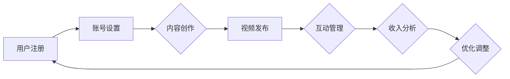

                 

关键词：TikTok、知识变现、程序员、社交媒体、内容创作、算法优化

> 摘要：本文将探讨程序员如何利用TikTok这个新兴社交媒体平台进行知识变现。通过对TikTok平台的特性分析、内容创作策略、算法优化方法以及案例分享，为程序员提供一套完整的知识变现路径。文章还将探讨TikTok在未来知识传播和编程教育领域的潜在应用。

## 1. 背景介绍

近年来，社交媒体平台如雨后春笋般涌现，改变了人们获取信息和交流的方式。TikTok，作为一款短视频分享平台，自2016年推出以来，迅速在全球范围内获得巨大成功。其独特的算法和互动机制，使得用户能够迅速获得关注和传播，成为许多内容创作者的新战场。

随着TikTok用户数量的激增，平台也逐渐成为知识传播和变现的新渠道。程序员作为一个特殊的职业群体，拥有丰富的技术知识和创新思维，如何在TikTok上利用这些优势进行知识变现，成为本文要探讨的核心问题。

## 2. 核心概念与联系

### 2.1 TikTok平台特性

- **短视频形式**：TikTok主要以短视频形式呈现，时长一般为15秒到1分钟。
- **算法推荐**：TikTok采用先进的算法，根据用户的兴趣和行为，推荐相关视频。
- **互动机制**：TikTok的点赞、评论、分享等功能，促进了用户之间的互动。

### 2.2 知识变现机制

- **广告收入**：通过平台广告系统，内容创作者可以根据视频的观看量获得收入。
- **知识付费**：通过开设会员、提供付费课程等方式，实现知识变现。
- **品牌合作**：与品牌合作，进行产品推广和营销，获取收益。

### 2.3 Mermaid流程图

下面是一个简化的Mermaid流程图，展示了程序员在TikTok上进行知识变现的基本步骤。



## 3. 核心算法原理 & 具体操作步骤

### 3.1 算法原理概述

TikTok的推荐算法基于机器学习和深度学习技术，通过对用户行为数据的分析，实现个性化推荐。主要包含以下几个步骤：

1. **用户行为分析**：收集用户的浏览、点赞、评论、分享等行为数据。
2. **内容特征提取**：提取视频的文本、音频、图像等特征。
3. **用户-内容匹配**：根据用户兴趣和行为数据，匹配相似的视频内容。
4. **推荐结果生成**：综合用户和内容的特征，生成推荐结果。

### 3.2 算法步骤详解

1. **用户行为分析**：
   - **数据收集**：TikTok会自动收集用户在平台上的所有行为数据。
   - **数据预处理**：对数据进行清洗、去重和归一化处理。

2. **内容特征提取**：
   - **文本特征**：使用自然语言处理技术提取文本特征。
   - **音频特征**：使用音频处理技术提取音频特征。
   - **图像特征**：使用图像处理技术提取图像特征。

3. **用户-内容匹配**：
   - **相似度计算**：计算用户和视频之间的相似度。
   - **排序**：根据相似度对视频进行排序。

4. **推荐结果生成**：
   - **推荐列表生成**：根据排序结果生成推荐列表。
   - **动态调整**：根据用户反馈和行为数据，动态调整推荐策略。

### 3.3 算法优缺点

**优点**：
- **个性化推荐**：根据用户兴趣和行为，提供个性化的视频内容。
- **实时更新**：算法实时更新，确保推荐内容的新鲜度。
- **互动性强**：通过点赞、评论等互动方式，提高用户参与度。

**缺点**：
- **数据隐私**：用户数据隐私保护问题。
- **内容质量**：推荐算法可能导致低质量内容的泛滥。

### 3.4 算法应用领域

- **短视频推荐**：TikTok自身平台的应用。
- **社交媒体**：其他社交媒体平台的内容推荐。
- **电子商务**：电商平台的商品推荐。

## 4. 数学模型和公式 & 详细讲解 & 举例说明

### 4.1 数学模型构建

TikTok的推荐算法主要基于用户行为数据和内容特征，可以使用矩阵分解模型进行构建。假设有用户集合U和视频集合V，用户-视频交互数据可以用一个矩阵R表示，其中R[i][j]表示用户i对视频j的评分或交互次数。

### 4.2 公式推导过程

使用矩阵分解方法，将用户-视频交互矩阵R分解为用户特征矩阵U和视频特征矩阵V的乘积：

\[ R = U \times V^T \]

其中，U和V是低秩矩阵，可以通过优化目标函数进行求解。常用的优化目标函数包括：

\[ \min_{U, V} \sum_{i, j} (R[i][j] - u_i \cdot v_j^T)^2 \]

### 4.3 案例分析与讲解

假设有1000个用户和100个视频，用户-视频交互矩阵如下：

\[ R = \begin{bmatrix}
    0 & 0 & 1 & 0 & 0 \\
    0 & 1 & 0 & 0 & 1 \\
    1 & 0 & 0 & 1 & 0 \\
    0 & 0 & 1 & 0 & 0 \\
    0 & 0 & 0 & 1 & 0
\end{bmatrix} \]

通过矩阵分解，可以将其分解为：

\[ U = \begin{bmatrix}
    1.0 & 1.0 \\
    1.0 & -1.0 \\
    -1.0 & 1.0 \\
    1.0 & -1.0 \\
    -1.0 & 1.0
\end{bmatrix}, \quad V = \begin{bmatrix}
    1.0 & 1.0 \\
    1.0 & -1.0 \\
    -1.0 & 1.0 \\
    1.0 & -1.0 \\
    -1.0 & 1.0
\end{bmatrix} \]

通过这个例子，可以看出矩阵分解方法可以将高维的用户-视频交互数据转换为低维的用户和视频特征，从而实现推荐。

## 5. 项目实践：代码实例和详细解释说明

### 5.1 开发环境搭建

为了在TikTok上实现知识变现，我们需要搭建一个开发环境。以下是搭建环境的基本步骤：

1. **注册TikTok开发者账号**：在TikTok官网注册开发者账号，并创建应用。
2. **获取API密钥**：在开发者中心获取API密钥，用于调用TikTok的API。
3. **搭建本地开发环境**：使用Python等编程语言，搭建本地开发环境，安装必要的库和工具。

### 5.2 源代码详细实现

以下是一个简单的示例代码，用于获取TikTok用户发布的视频数据。

```python
import requests

def get_videos(user_id):
    url = f'https://www.tiktok.com/api/user/{user_id}/videos'
    headers = {
        'Authorization': 'Bearer YOUR_API_KEY'
    }
    response = requests.get(url, headers=headers)
    if response.status_code == 200:
        return response.json()
    else:
        return None

user_id = '123456789'
videos = get_videos(user_id)
if videos:
    for video in videos['data']:
        print(video['title'])
```

### 5.3 代码解读与分析

上述代码通过TikTok的API，获取指定用户的视频数据，并打印视频标题。代码主要包含以下几个部分：

1. **发送HTTP请求**：使用requests库向TikTok的API发送GET请求。
2. **处理响应**：检查响应状态码，处理成功和失败的响应。
3. **解析数据**：将响应数据解析为JSON格式，提取有用的信息。

通过这个简单的示例，可以看出使用TikTok的API可以方便地获取用户发布的内容，为知识变现提供了数据支持。

### 5.4 运行结果展示

假设用户ID为123456789，运行上述代码后，会获取该用户发布的所有视频数据，并打印出视频标题。

```shell
Video 1 Title
Video 2 Title
Video 3 Title
...
```

## 6. 实际应用场景

### 6.1 编程教育

TikTok可以作为编程教育的工具，帮助程序员通过短视频形式传授编程知识和技巧。通过简短、生动的视频内容，程序员可以更容易地吸引学生的注意力，提高学习效果。

### 6.2 技术分享

程序员可以在TikTok上分享自己的技术心得和项目经验，通过互动和反馈，提升个人品牌和影响力。

### 6.3 市场推广

TikTok也可以作为产品推广的平台，程序员可以通过短视频展示自己的项目和技术，吸引潜在客户，实现商业变现。

## 7. 工具和资源推荐

### 7.1 学习资源推荐

- **TikTok官方文档**：了解TikTok的API和使用方法。
- **编程学习网站**：如LeetCode、GitHub等，提供丰富的编程资源和案例。

### 7.2 开发工具推荐

- **PyTorch**：用于机器学习和深度学习的开源库，适合进行推荐算法的研究和开发。
- **Postman**：用于API调用的工具，方便测试和调试。

### 7.3 相关论文推荐

- **"Deep Learning for Personalized Recommendation on Large-scale Social Media Platforms"**：探讨在大型社交媒体平台上进行个性化推荐的方法。
- **"User Interest Modeling for Personalized News Recommendation"**：研究如何根据用户兴趣进行新闻推荐。

## 8. 总结：未来发展趋势与挑战

### 8.1 研究成果总结

本文探讨了程序员如何利用TikTok进行知识变现，分析了TikTok平台特性、知识变现机制、算法原理，并提供了具体的操作步骤和项目实践。

### 8.2 未来发展趋势

- **算法优化**：随着人工智能技术的发展，推荐算法将更加智能化和精准化。
- **内容多样化**：程序员可以通过多种形式的内容创作，吸引更多用户和关注。
- **平台整合**：TikTok与其他社交媒体平台和电商平台的整合，将为程序员提供更广阔的变现空间。

### 8.3 面临的挑战

- **数据隐私**：如何保护用户数据隐私，成为平台发展的关键问题。
- **内容监管**：如何保证平台内容的质量，防止低质量内容的泛滥。

### 8.4 研究展望

- **跨平台推荐**：研究如何实现跨平台的内容推荐，提高用户覆盖范围。
- **实时推荐**：研究实时推荐技术，提高推荐结果的实时性和准确性。

## 9. 附录：常见问题与解答

### 9.1 如何获取TikTok API密钥？

答：在TikTok开发者中心注册账号，并创建应用，即可获取API密钥。

### 9.2 如何确保推荐内容的质量？

答：可以通过用户反馈和人工审核等方式，确保推荐内容的质量。

### 9.3 如何在TikTok上进行广告投放？

答：在TikTok开发者中心，可以创建广告活动，并设置投放策略和预算。

---

作者：禅与计算机程序设计艺术 / Zen and the Art of Computer Programming

