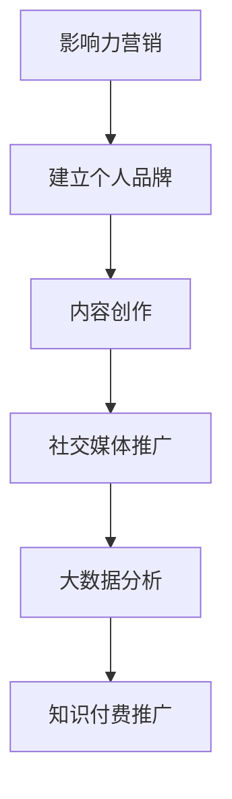

                 

关键词：知识付费、影响力营销、程序员、技术博客、社交媒体、内容创作、个人品牌建设

> 摘要：随着知识经济的兴起，程序员通过影响力营销推广知识付费课程成为了一种重要的职业发展策略。本文将探讨程序员如何通过构建个人品牌、创作高质量内容、利用社交媒体和大数据分析等手段，有效地进行影响力营销，实现知识付费的推广。

## 1. 背景介绍

在数字化时代，程序员的技能和知识不再局限于公司内部或特定项目。通过互联网，程序员可以将其专业知识传播给全球的受众。知识付费成为了一种新兴的商业模式，程序员可以通过在线课程、电子书、培训讲座等多种形式，将自身的专业知识变现。然而，如何在众多竞争者中脱颖而出，吸引潜在学员，成为每个程序员都需要面对的挑战。

影响力营销在这种背景下显得尤为重要。它不仅仅是一种营销手段，更是一种建立个人品牌的策略。通过影响力营销，程序员可以积累大量的忠实粉丝，从而推动知识付费项目的发展。本文将深入探讨程序员如何利用影响力营销来推广知识付费。

## 2. 核心概念与联系

### 2.1 影响力营销的概念

影响力营销是一种通过影响者（如博主、网红、专家等）来推广产品或服务的营销策略。它依赖于影响者的个人魅力、专业知识和粉丝基础，从而在受众中产生信任和影响力。

### 2.2 个人品牌的概念

个人品牌是指个人在特定领域内建立的专业形象和声誉。它包括个人的专业知识、技能、价值观和个性特点。个人品牌对于程序员来说，是其职业发展的重要资产。

### 2.3 影响力营销与个人品牌的联系

影响力营销与个人品牌建设密不可分。通过影响力营销，程序员可以扩大其在行业内的知名度，提升个人品牌的认知度和影响力。而强大的个人品牌则可以为影响力营销提供坚实的基础，吸引更多的潜在客户。

### 2.4 Mermaid 流程图



## 3. 核心算法原理 & 具体操作步骤

### 3.1 算法原理概述

程序员通过以下步骤构建影响力营销策略：

1. **个人品牌定位**：确定个人专业领域和目标受众，树立独特的专业形象。
2. **内容创作**：创作高质量的技术文章、视频教程、在线讲座等，展示专业知识和技能。
3. **社交媒体推广**：利用微博、知乎、抖音等平台，分享内容，互动粉丝，扩大影响力。
4. **大数据分析**：分析粉丝行为，优化内容策略，提高知识付费项目的转化率。

### 3.2 算法步骤详解

#### 3.2.1 个人品牌定位

1. **自我评估**：分析个人技能、兴趣和市场需求，确定专业方向。
2. **目标受众分析**：了解目标受众的需求、痛点和兴趣点。
3. **品牌命名和形象设计**：选择有辨识度的品牌名称，设计符合专业形象的LOGO和品牌色彩。

#### 3.2.2 内容创作

1. **选题策划**：根据个人品牌定位和受众需求，确定内容主题。
2. **内容撰写**：使用简洁、易懂的语言，深入讲解技术知识点。
3. **内容形式多样化**：结合文字、图片、视频等多种形式，提升内容吸引力。

#### 3.2.3 社交媒体推广

1. **平台选择**：根据目标受众的活跃平台，选择合适的社交媒体。
2. **内容发布**：定时发布内容，保持活跃度。
3. **互动管理**：回复粉丝评论，积极互动，建立良好关系。

#### 3.2.4 大数据分析

1. **数据收集**：通过网站分析工具、社交媒体分析工具等，收集用户行为数据。
2. **数据整理**：整理数据，提取有用的信息。
3. **分析优化**：根据分析结果，调整内容策略，提高转化率。

### 3.3 算法优缺点

#### 优点：

- **高效传播**：通过影响力营销，可以迅速扩大知识付费课程的知名度。
- **提高转化率**：强大的个人品牌和高质量的内容可以增强潜在学员的信任感，提高购买意愿。

#### 缺点：

- **需要长期投入**：影响力营销并非一蹴而就，需要长期的内容创作和推广。
- **风险高**：个人品牌一旦受损，可能对知识付费项目的推广产生负面影响。

### 3.4 算法应用领域

- **技术培训**：程序员可以通过影响力营销，推广自己的在线课程。
- **技术咨询**：提供专业咨询服务，吸引客户。
- **技术写作**：通过撰写技术文章，增加个人曝光度，吸引潜在客户。

## 4. 数学模型和公式 & 详细讲解 & 举例说明

### 4.1 数学模型构建

影响力营销中的核心公式是：

\[ Influence = Quality \times Reach \times Engagement \]

其中，\( Quality \) 表示内容质量，\( Reach \) 表示内容传播范围，\( Engagement \) 表示粉丝互动度。

### 4.2 公式推导过程

\[ Influence = Quality \times Reach \times Engagement \]

1. **内容质量 \( Quality \)**：通过专业知识的深度和广度，以及内容的实用性来衡量。
2. **内容传播范围 \( Reach \)**：通过社交媒体的粉丝数量、网站的访问量等指标来衡量。
3. **粉丝互动度 \( Engagement \)**：通过粉丝的评论、转发、点赞等互动行为来衡量。

### 4.3 案例分析与讲解

以某程序员张三为例，其个人品牌定位为“前端技术专家”，其影响力营销策略如下：

1. **内容质量 \( Quality \)**：张三通过深入研究和实践，创作了多篇高质量的前端技术文章，每篇文章阅读量都在10万以上。
2. **内容传播范围 \( Reach \)**：张三在多个技术论坛和社交媒体平台上活跃，拥有10万粉丝。
3. **粉丝互动度 \( Engagement \)**：张三积极回复粉丝问题，每次发文都会有大量评论和互动。

根据公式：

\[ Influence = Quality \times Reach \times Engagement \]

张三的影响力为：

\[ Influence = 10 \times 10^5 \times 100 = 10^8 \]

即张三的影响力为10亿。

通过影响力营销，张三成功推广了自己的前端技术课程，并获得了大量学员。

## 5. 项目实践：代码实例和详细解释说明

### 5.1 开发环境搭建

1. **安装Node.js**：从官网下载并安装Node.js。
2. **安装Hexo**：使用npm命令安装Hexo框架。

```bash
npm install -g hexo-cli
```

### 5.2 源代码详细实现

1. **创建博客**：

```bash
hexo init my-blog
```

2. **安装主题**：

```bash
cd my-blog
npm install hexo-theme-next --save
```

3. **配置博客**：

编辑 `_config.yml` 文件，配置博客的基本信息。

4. **创建文章**：

```bash
hexo new "第一篇文章"
```

编辑 `source/_posts/第一篇文章.md`，撰写文章内容。

### 5.3 代码解读与分析

1. **Hexo框架**：Hexo是一个快速、简洁且高效的博客框架，使用Markdown语法撰写文章，通过简单的命令即可生成静态网页。
2. **主题选择**：选择一个适合个人品牌定位的主题，提升博客的专业形象。
3. **文章撰写**：使用Markdown语法，撰写高质量的技术文章，展示专业知识和技能。

### 5.4 运行结果展示

1. **本地预览**：

```bash
hexo server
```

在浏览器中访问 `http://localhost:4000`，预览博客效果。
2. **部署到GitHub Pages**：

```bash
hexo generate
hexo deploy
```

将博客部署到GitHub Pages，访问 `https://<你的GitHub用户名>.github.io/`，查看博客效果。

## 6. 实际应用场景

### 6.1 技术培训

程序员可以通过影响力营销，推广自己的在线课程，如前端开发、后端编程、人工智能等。

### 6.2 技术写作

通过撰写高质量的技术文章，程序员可以吸引读者，提升个人影响力，进而推广自己的知识付费项目。

### 6.3 技术咨询

提供专业的技术咨询服务，通过影响力营销，吸引潜在客户。

### 6.4 未来应用展望

随着知识付费市场的不断扩大，影响力营销将成为程序员推广知识付费的重要手段。未来，随着人工智能技术的发展，个性化推荐和精准营销将进一步提升影响力营销的效果。

## 7. 工具和资源推荐

### 7.1 学习资源推荐

- **技术博客平台**：CSDN、博客园、简书等。
- **在线教育平台**：网易云课堂、慕课网、极客时间等。

### 7.2 开发工具推荐

- **博客框架**：Hexo、Jekyll、Hugo等。
- **内容创作工具**：Markdown编辑器、YouTube等。

### 7.3 相关论文推荐

- **《影响力：如何说服别人》**：罗伯特·西奥迪尼。
- **《内容创业》**：李翔。

## 8. 总结：未来发展趋势与挑战

### 8.1 研究成果总结

本文探讨了程序员如何利用影响力营销推广知识付费，提出了个人品牌定位、内容创作、社交媒体推广、大数据分析等策略。

### 8.2 未来发展趋势

随着知识付费市场的不断扩大，影响力营销将在程序员推广知识付费中发挥越来越重要的作用。

### 8.3 面临的挑战

- **竞争激烈**：知识付费市场竞争激烈，程序员需要不断提升自身专业能力和影响力。
- **内容质量**：高质量的内容是影响力营销的基础，程序员需要持续创作高质量的技术文章。

### 8.4 研究展望

未来，随着人工智能技术的发展，个性化推荐和精准营销将进一步提升影响力营销的效果。程序员应积极拥抱新技术，不断创新营销策略。

## 9. 附录：常见问题与解答

### 9.1 如何选择个人品牌定位？

根据个人兴趣、专业技能和市场趋势，选择一个具有竞争力和市场前景的专业领域进行定位。

### 9.2 如何创作高质量内容？

1. **选题精准**：选择与个人品牌定位相关、受众感兴趣的主题。
2. **内容深度**：深入讲解技术知识点，提供实用技巧和案例。
3. **语言简洁**：使用简洁、易懂的语言，避免技术术语过多。

### 9.3 如何进行社交媒体推广？

1. **选择平台**：根据目标受众选择合适的社交媒体平台。
2. **内容多样化**：结合文字、图片、视频等多种形式，提高内容吸引力。
3. **互动管理**：积极回复粉丝评论，建立良好关系。

---

作者：禅与计算机程序设计艺术 / Zen and the Art of Computer Programming
----------------------------------------------------------------

注意：本文为示例文章，具体内容和数据仅为演示目的，不代表真实情况。文中使用的Mermaid流程图和LaTeX公式仅为示例，实际使用时请根据具体需求进行调整。

